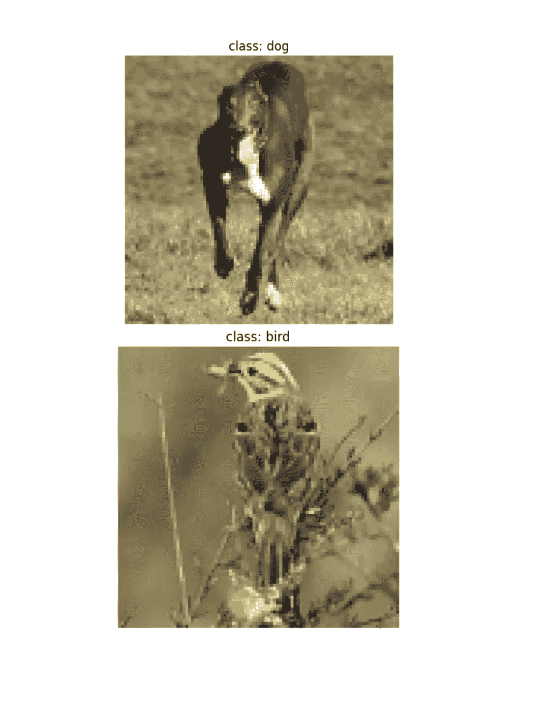
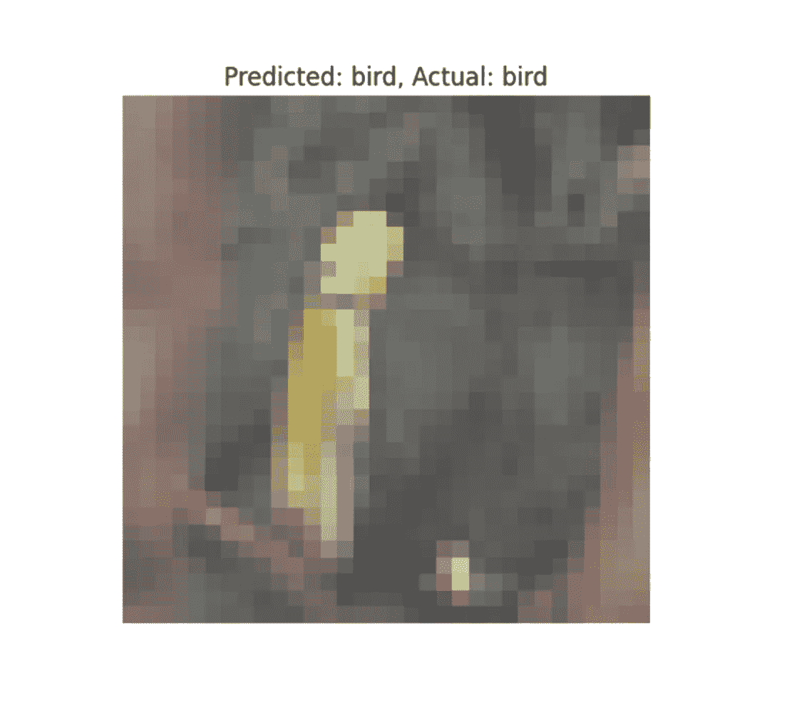
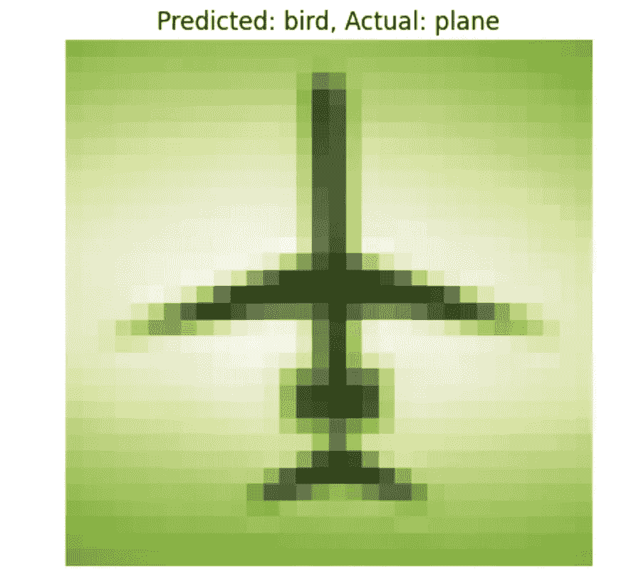

# VGG 的实现

> 原文：[`towardsdatascience.com/an-implementation-of-vgg-dea082804e14`](https://towardsdatascience.com/an-implementation-of-vgg-dea082804e14)

## 面向初学者的教程

[](https://medium.com/@mina.ghashami?source=post_page-----dea082804e14--------------------------------)[](https://towardsdatascience.com/?source=post_page-----dea082804e14--------------------------------) [Mina Ghashami](https://medium.com/@mina.ghashami?source=post_page-----dea082804e14--------------------------------)

·发表于 [Towards Data Science](https://towardsdatascience.com/?source=post_page-----dea082804e14--------------------------------) ·9 分钟阅读·2023 年 10 月 31 日

--

在这篇文章中，我们查看 VGG 的实现及其在 STL10 [2, 3]数据集上的训练。

我们在[上一篇文章](https://medium.com/towards-data-science/image-classification-for-beginners-8546aa75f331)中回顾了 VGG 架构。如果不熟悉，请查看。

[](/image-classification-for-beginners-8546aa75f331?source=post_page-----dea082804e14--------------------------------) ## 面向初学者的图像分类

### VGG 和 ResNet 架构自 2014 年

[towardsdatascience.com

简而言之，

> ***VGG*** *代表* ***视觉几何组*** *，是牛津大学的一个研究小组。2014 年，他们设计了一种用于图像分类任务的深度卷积神经网络架构，并以他们自己命名；即 VGG [1].*

VGGNet 有几种配置，如 VGG16（16 层）和 VGG19（19 层）。

VGG16 的架构如下：它有 13 个卷积层和 3 个全连接层。


作者提供的图像

# 模型实现

让我们在 PyTorch 中实现 VGG16。

```py
import torch
import torch.nn as nn
import torch.optim as optim
import torch.nn.functional as F
import torchvision
import torchvision.transforms as transforms
import numpy as np
import matplotlib.pyplot as plt

class VGG16(nn.Module):
    def __init__(self, input_channel, num_classes):
        super(VGG16, self).__init__()
        self.features = nn.Sequential(
            nn.Conv2d(input_channel, 64, kernel_size=3, padding=1), nn.ReLU(inplace=True),
            nn.Conv2d(64, 64, kernel_size=3, padding=1), nn.ReLU(inplace=True),
            nn.MaxPool2d(kernel_size=2, stride=2),
            nn.Conv2d(64, 128, kernel_size=3, padding=1), nn.ReLU(inplace=True),
            nn.Conv2d(128, 128, kernel_size=3, padding=1), nn.ReLU(inplace=True),
            nn.MaxPool2d(kernel_size=2, stride=2),
            nn.Conv2d(128, 256, kernel_size=3, padding=1), nn.ReLU(inplace=True),
            nn.Conv2d(256, 256, kernel_size=3, padding=1), nn.ReLU(inplace=True),
            nn.Conv2d(256, 256, kernel_size=3, padding=1), nn.ReLU(inplace=True),
            nn.MaxPool2d(kernel_size=2, stride=2),
            nn.Conv2d(256, 512, kernel_size=3, padding=1), nn.ReLU(inplace=True),
            nn.Conv2d(512, 512, kernel_size=3, padding=1), nn.ReLU(inplace=True),
            nn.Conv2d(512, 512, kernel_size=3, padding=1), nn.ReLU(inplace=True),
            nn.MaxPool2d(kernel_size=2, stride=2),
            nn.Conv2d(512, 512, kernel_size=3, padding=1), nn.ReLU(inplace=True),
            nn.Conv2d(512, 512, kernel_size=3, padding=1), nn.ReLU(inplace=True),
            nn.Conv2d(512, 512, kernel_size=3, padding=1), nn.ReLU(inplace=True),
            nn.MaxPool2d(kernel_size=2, stride=2)
        )
        self.classifier = nn.Sequential(
            nn.Linear(512 * 3* 3, 4096), nn.ReLU(True), nn.Dropout(),
            nn.Linear(4096, 4096), nn.ReLU(True), nn.Dropout(),
            nn.Linear(4096, num_classes)
        )
```

请注意，实现的结构基于两个属性：

+   特征：包含所有的卷积层和最大池化层

+   分类器：包含全连接层和用于分类的 softmax 层

还需注意，我们将*input_channel*作为输入参数传递。该参数为 3 时表示图像为彩色，为 1 时表示图像为灰度。

最后但同样重要的是，第一个全连接层是*nn.Linear(512 * 3 * 3, 4096).* 之所以输入维度是*512 * 3 * 3*，是因为我们设置它以适应输入图像为*96 * 96*。如果我们传递不同尺寸的图像，则需要更改此值。例如，对于 224 * 224 的图像，该层变为*nn.Linear(512 * 7 * 7, 4096).*

然后我们实现*forward()*方法：

```py
def forward(self, x):
  layer_outputs = []
  for i in range(len(self.features)):
    x = self.featuresi
    layer_outputs.append(x)

  x = x.view(x.size(0), -1)

  for i in range(len(self.classifier)):
    x = self.classifieri
    layer_outputs.append(x)

  return x, layer_outputs
```

现在网络已经完成，让我们通过它传递一个随机张量，并查看它在经过各层时形状的变化。

```py
vgg_model = VGG16(3, 10)
input_tensor = torch.rand(1, 3, 96, 96)
x, layer_outputs = vgg_model(input_tensor)
for l in layer_outputs:
  print(l.shape)
```

它打印出以下形状：

```py
 torch.Size([1, 64, 96, 96])
torch.Size([1, 64, 96, 96])
torch.Size([1, 64, 96, 96])
torch.Size([1, 64, 96, 96])
torch.Size([1, 64, 48, 48])
torch.Size([1, 128, 48, 48])
torch.Size([1, 128, 48, 48])
torch.Size([1, 128, 48, 48])
torch.Size([1, 128, 48, 48])
torch.Size([1, 128, 24, 24])
torch.Size([1, 256, 24, 24])
torch.Size([1, 256, 24, 24])
torch.Size([1, 256, 24, 24])
torch.Size([1, 256, 24, 24])
torch.Size([1, 256, 24, 24])
torch.Size([1, 256, 24, 24])
torch.Size([1, 256, 12, 12])
torch.Size([1, 512, 12, 12])
torch.Size([1, 512, 12, 12])
torch.Size([1, 512, 12, 12])
torch.Size([1, 512, 12, 12])
torch.Size([1, 512, 12, 12])
torch.Size([1, 512, 12, 12])
torch.Size([1, 512, 6, 6])
torch.Size([1, 512, 6, 6])
torch.Size([1, 512, 6, 6])
torch.Size([1, 512, 6, 6])
torch.Size([1, 512, 6, 6])
torch.Size([1, 512, 6, 6])
torch.Size([1, 512, 6, 6])
torch.Size([1, 512, 3, 3])
torch.Size([1, 4096])
torch.Size([1, 4096])
torch.Size([1, 4096])
torch.Size([1, 4096])
torch.Size([1, 4096])
torch.Size([1, 4096])
torch.Size([1, 10])
```

所以最终输出是一个 10 维的向量，表示图像属于 10 个类别中任何一个类别的概率。

# 数据转换 — STL10

现在，让我们在 STL10 数据集[2,3]上进行训练，该数据集已获得商业使用许可。此数据集包含 5000 张彩色图像，分为 10 个类别。

每张图像为 96x96 像素，10 个类别如下：

```py
classes = ('airplane', 'bird', 'car', 'cat', 'deer', 'dog',\
           'horse', 'monkey', 'ship', 'truck')
```

让我们加载数据并查看一些图像：

```py
 transform = transforms.Compose([
    transforms.ToTensor()
])

trainset = torchvision.datasets.STL10(root = './data', split = 'train', download = True, transform=transform)
trainloader = torch.utils.data.DataLoader(trainset, batch_size=len(trainset))

classes = ('airplane', 'bird', 'car', 'cat', 'deer', 'dog',\
           'horse', 'monkey', 'ship', 'truck')

images, target = next(iter(trainloader))

np_images = images.numpy() # convert to numpy

# display one image
plt.imshow(np.transpose(np_images[0], (1, 2, 0)))
plt.title(f'class: {classes[target[0]]}')
plt.axis('off')
plt.show()

# display another image
plt.imshow(np.transpose(np_images[1], (1, 2, 0)))
plt.title(f'class: {classes[target[1]]}')
plt.axis('off')
plt.show()
```

它打印这些图像及其标签：



图片来源于作者

接下来，让我们对数据进行标准化。为了标准化数据，我们首先计算*均值*和*标准差*：

```py
transform = transforms.Compose([
    transforms.ToTensor()
])

trainset = torchvision.datasets.STL10(root = './data', split = 'train', download = True, transform=transform)
trainloader = torch.utils.data.DataLoader(trainset, batch_size=len(trainset))

classes = ('airplane', 'bird', 'car', 'cat', 'deer', 'dog',\
           'horse', 'monkey', 'ship', 'truck')

images, target = next(iter(trainloader))

np_images = images.numpy() # convert to numpy. 

# calculate mean and std for each channel 
mean = np.mean(np_images, axis=(0,2,3)) 
std = np.std(np_images, axis=(0,2,3)) 
```

请注意，在*trainloader*中，我们设置了*batch_size = len(trainset)*，以便加载整个数据集来计算均值和标准差。之后，当我们想要训练模型时，我们将数据以 128 张图像的小批量加载。

从上面可以看出，*np_images*的形状是(5000, 3, 96, 96)，即 5000 张 96x96 像素的彩色图像（注意通道数为 3，表示图像是彩色的）。因此，均值和标准差如下：

**均值 = [**0.44671103, 0.43980882, 0.40664575]

**标准差 =** [0.2603408, 0.25657743, 0.2712671

我们将使用这个均值和标准差来标准化测试数据和训练数据。让我们定义每个数据集的转换：

```py
# train transformation
transform_train = transforms.Compose([
    transforms.RandomCrop(96, padding = 4), # we first pad by 4 pixels on each side then crop
    transforms.RandomHorizontalFlip(),
    transforms.ToTensor(),
    transforms.Normalize((0.44671103, 0.43980882, 0.40664575), (0.2603408 , 0.25657743, 0.2712671))
])

# test transformation
transform_test = transforms.Compose([
    transforms.ToTensor(),
    transforms.Normalize((0.44671103, 0.43980882, 0.40664575), (0.2603408 , 0.25657743, 0.2712671))
])

trainset = torchvision.datasets.STL10(root = './data', split = 'train', download = True, transform=transform_train)
trainloader = torch.utils.data.DataLoader(trainset, batch_size = 128, shuffle = True, num_workers = 2)

testset = torchvision.datasets.STL10(root = './data', split = 'test', download = True, transform=transform_test)
testloader = torch.utils.data.DataLoader(testset, batch_size = 256, shuffle = True, num_workers = 2)In above transformation that we have defined on train data you see that we are augmenting the data by cropping a random 28x28 patch and flipping it. The reason we augment the data is to increase diversity in the training data and force the model to learn better. 
```

# 训练模型

我们首先定义超参数，例如：

+   学习率

+   学习率调度器

+   损失函数：用于分类的交叉熵

+   优化器

```py
# instantiate the model
vgg_model = VGG16(input_channel=1, num_classes=10) 
device = 'cuda' if torch.cuda.is_available() else 'cpu'
vgg_model = vgg_model.to(device)

# define hyper-parameters: learning rate, optimizer, scheduler
lr = 0.00001
criterion = nn.CrossEntropyLoss()
vgg_optimizer = optim.SGD(vgg_model.parameters(), lr = lr, momentum=0.9, weight_decay = 5e-4)
vgg_scheduler = torch.optim.lr_scheduler.CosineAnnealingLR(vgg_optimizer, T_max = 200)And we write the train function on each batch:
```

接下来，我们定义两个函数：

**方法 1：** train_batch：对于数据中的所有批次，它训练模型，计算损失并更新参数。此方法应用反向传播并计算训练损失。

```py
def train_batch(epoch, model, optimizer):
    print("epoch ", epoch)
    model.train()
    train_loss = 0
    correct = 0
    total = 0

    for batch_idx, (input, targets) in enumerate(trainloader):
        inputs, targets = input.to(device), targets.to(device)
        optimizer.zero_grad()
        outputs, _ = model(inputs)
        loss = criterion(outputs, targets)
        loss.backward()
        optimizer.step()

        train_loss += loss.item()
        _, predicted = outputs.max(1)
        total += targets.size(0)
        correct += predicted.eq(targets).sum().item()
    print(batch_idx, len(trainloader), 'Loss: %.3f | Acc: %.3f%% (%d/%d)'
                         % (train_loss/(batch_idx+1), 100.*correct/total, correct, total))
```

**方法 2**：是 validate_batch 函数，其中我们在测试加载器的一个批次上验证模型。通常，在每个训练周期之后，我们调用此函数来获取模型在每个训练周期末的性能。此函数计算测试集（即未见数据）的损失，并且**不**进行任何反向传播。

```py
def validate_batch(epoch, model):
    model.eval()
    test_loss = 0
    correct = 0
    total = 0
    with torch.no_grad():
        for batch_idx, (inputs, targets) in enumerate(testloader):
            inputs, targets = inputs.to(device), targets.to(device)
            outputs,_ = model(inputs)
            loss = criterion(outputs, targets)

            test_loss += loss.item()
            _, predicted = outputs.max(1)
            total += targets.size(0)
            correct += predicted.eq(targets).sum().item()

    print(batch_idx, len(testloader), 'Loss: %.3f | Acc: %.3f%% (%d/%d)'
                 % (test_loss/(batch_idx+1), 100.*correct/total, correct, total)) 
```

## 让实际训练开始 …

对于每一个训练周期，我们训练模型并检查模型在测试数据集上的表现。我们调用*vgg_scheduler.step()*，然后通知调度器递增其内部计数器并更新学习率。

```py
start_epoch = 0
for epoch in range(start_epoch, start_epoch+20):
    train_batch(epoch, vgg_model, vgg_optimizer)
    validate_batch(epoch, vgg_model)
    vgg_scheduler.step()
```

我们看到以下性能：

```py
epoch  0
390 391 Loss: 5.506 | Acc: 24.864% (12432/50000)
39 40 Loss: 4.512 | Acc: 49.780% (4978/10000)
epoch  1
390 391 Loss: 5.140 | Acc: 33.226% (16613/50000)
39 40 Loss: 4.156 | Acc: 57.120% (5712/10000)
epoch  2
390 391 Loss: 4.978 | Acc: 36.594% (18297/50000)
39 40 Loss: 3.953 | Acc: 60.450% (6045/10000)
epoch  3
390 391 Loss: 4.908 | Acc: 38.498% (19249/50000)
39 40 Loss: 3.898 | Acc: 69.430% (6943/10000)
epoch  4
390 391 Loss: 4.827 | Acc: 39.982% (19991/50000)
39 40 Loss: 3.631 | Acc: 68.240% (6824/10000)
epoch  5
390 391 Loss: 4.767 | Acc: 40.876% (20438/50000)
39 40 Loss: 3.677 | Acc: 71.260% (7126/10000)
epoch  6
390 391 Loss: 4.686 | Acc: 42.356% (21178/50000)
39 40 Loss: 3.180 | Acc: 73.560% (7356/10000)
epoch  7
390 391 Loss: 4.664 | Acc: 42.606% (21303/50000)
39 40 Loss: 3.259 | Acc: 76.920% (7692/10000)
epoch  8
390 391 Loss: 4.653 | Acc: 43.014% (21507/50000)
39 40 Loss: 3.118 | Acc: 77.150% (7715/10000)
epoch  9
390 391 Loss: 4.606 | Acc: 43.762% (21881/50000)
39 40 Loss: 2.961 | Acc: 75.850% (7585/10000)
epoch  10
390 391 Loss: 4.608 | Acc: 43.802% (21901/50000)
39 40 Loss: 2.840 | Acc: 81.130% (8113/10000)
epoch  11
390 391 Loss: 4.582 | Acc: 44.156% (22078/50000)
39 40 Loss: 2.878 | Acc: 80.810% (8081/10000)
....
...
..
```

我们看到模型在第 11 个周期的准确率达到 80.8%。

接下来，让我们查看 10 张图像以及模型对它们标签的预测：

```py
model = vgg19_model

mean = [0.44671103, 0.43980882, 0.40664575]
std = [0.2603408 , 0.25657743, 0.2712671]

# Evaluate the model on random images and display results
for _ in range(10):
    # Get a random test image
    data, target = next(iter(testloader))

    # Get model's predictions
    output, _ = model(data.to(device))
    _, predicted = torch.max(output, 1)

    # Display the image along with predicted and actual labels
    # Unnormalize the image
    display_img = data[0]
    unnormalized_image = display_img.clone()  # Create a copy to avoid modifying the original tensor
    for i in range(3):
      unnormalized_image[i] = (unnormalized_image[i] * std[i]) + mean[i]
    plt.imshow(np.transpose(unnormalized_image.numpy(), (1, 2, 0)))
    plt.title(f'Predicted: {classes[predicted[0]]}, Actual: {classes[target[0]]}')
    plt.axis('off')
    plt.show()
```

例如，我们看到以下图像是一只鸟，模型正确地预测为鸟。



图片来源于作者

然后我们看到一个错误预测的例子，其中图像是一架飞机，但 VGG 将其预测为一只鸟：



图片来源于作者

这就结束了我们对 VGG 模型的实现部分。我们看到 VGG 具有非常深的架构和许多参数，但其实现非常直接，这归功于其架构的统一性。

到目前为止，我们已经回顾了 VGG 和 ResNet 的概念以及 VGG 的代码。在下一篇文章中，我们可以查看 ResNet 的实现。

如有任何评论或问题，请告知我。

如果你有任何问题或建议，请随时联系我：

邮箱: mina.ghashami@gmail.com

LinkedIn: [`www.linkedin.com/in/minaghashami/`](https://www.linkedin.com/in/minaghashami/)

# 参考资料

1.  [非常深层的卷积网络用于大规模图像识别](https://arxiv.org/pdf/1409.1556.pdf)

1.  [`pytorch.org/vision/main/generated/torchvision.datasets.STL10.html`](https://pytorch.org/vision/main/generated/torchvision.datasets.STL10.html)

1.  [`cs.stanford.edu/~acoates/stl10/`](https://cs.stanford.edu/~acoates/stl10/)
