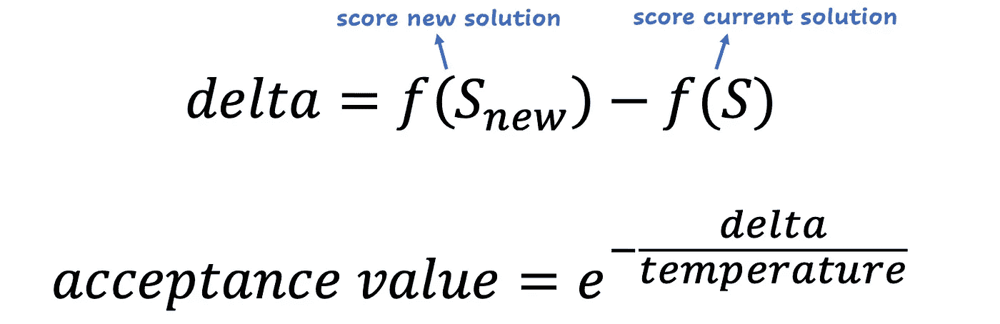
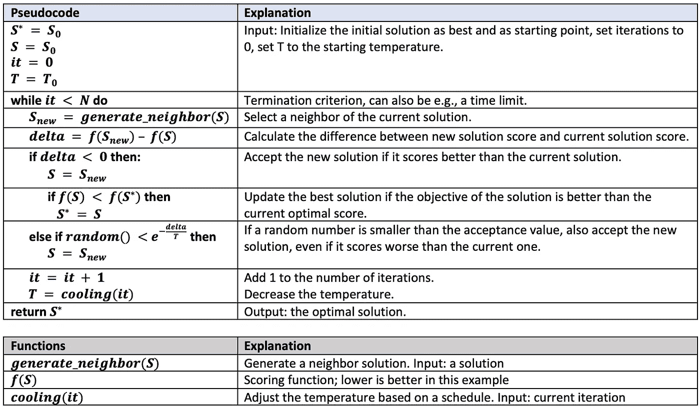
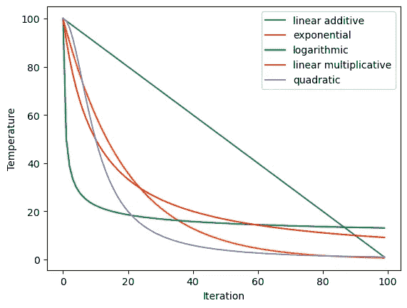
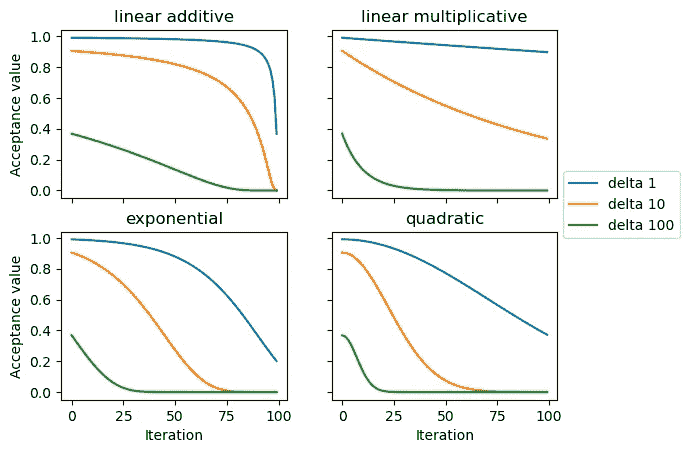
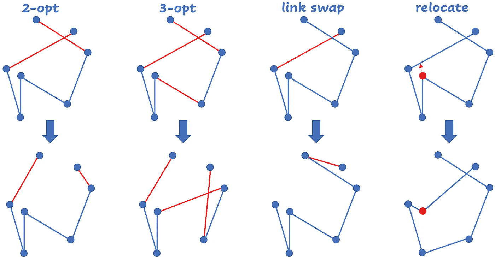
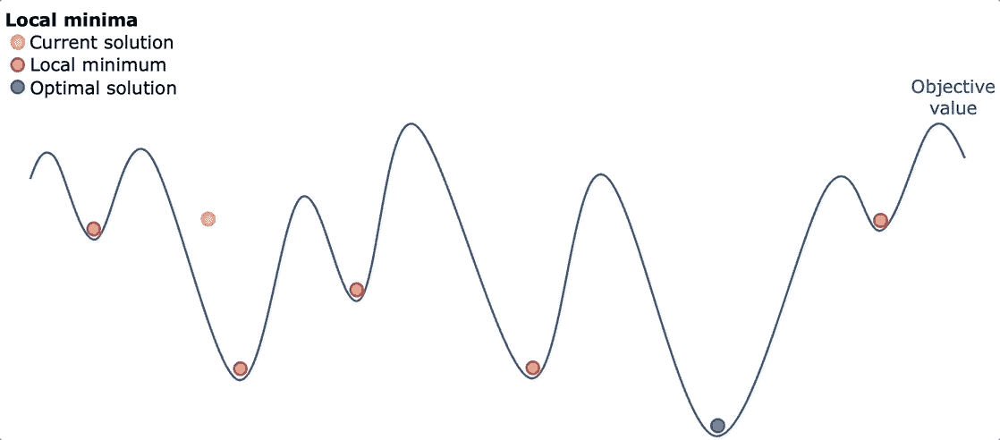
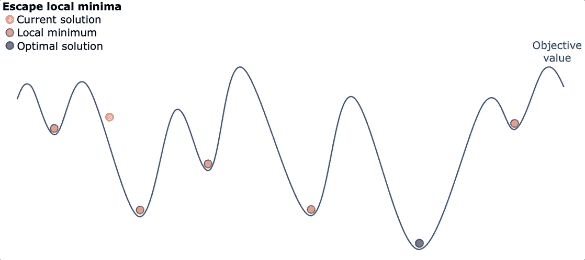
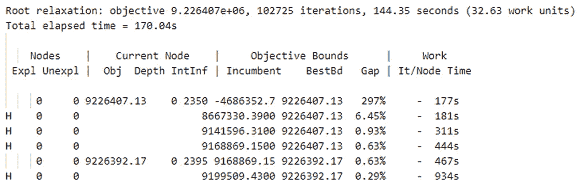
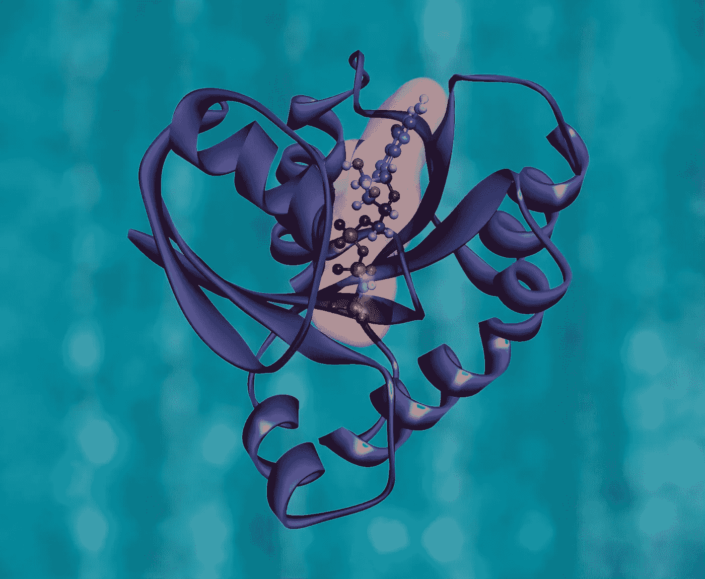

# 强大的优化技术简介：模拟退火

> 原文：[`towardsdatascience.com/an-introduction-to-a-powerful-optimization-technique-simulated-annealing-87fd1e3676dd`](https://towardsdatascience.com/an-introduction-to-a-powerful-optimization-technique-simulated-annealing-87fd1e3676dd)


这完全与温度有关。图像由 Dall-E 2 提供。

## 解释、参数、优点、缺点和使用案例

[](https://hennie-de-harder.medium.com/?source=post_page-----87fd1e3676dd--------------------------------)[](https://towardsdatascience.com/?source=post_page-----87fd1e3676dd--------------------------------) [Hennie de Harder](https://hennie-de-harder.medium.com/?source=post_page-----87fd1e3676dd--------------------------------)

·发表于 [Towards Data Science](https://towardsdatascience.com/?source=post_page-----87fd1e3676dd--------------------------------) ·9 分钟阅读·2023 年 3 月 15 日

--

**模拟退火是一种优化技术，试图为数学优化问题找到全局最优解。这是一种很棒的技术，你可以将其应用于广泛的问题。在本文中，我们将深入探讨模拟退火的定义、优点、缺点和使用案例。**

你不应该有最喜欢的机器学习模型或优化技术。但人们确实有他们的偏爱，比如 LightGBM。在优化方面，我喜欢的一种技术是模拟退火。它易于理解，适用于许多不同类型的问题。

> 本文需要有关数学优化问题和局部搜索的知识。如果你没有这些知识，[这篇文章](https://medium.com/towards-data-science/mathematical-optimization-heuristics-every-data-scientist-should-know-b26de0bd43e6)是一个很好的起点。

# 什么是模拟退火？

模拟退火（SA）是一种随机优化算法，用于寻找成本函数的全局最小值。它是一种局部搜索的元启发式方法，解决了陷入局部最小值的问题。该算法基于[冶金中的退火过程](https://www.chemeurope.com/en/encyclopedia/Annealing_%28metallurgy%29.html)，其中金属被加热然后缓慢冷却。通过这种方式，金属变得柔软，并为进一步加工做好准备。该算法在[1983 年的这篇论文中介绍](https://www.dcs.gla.ac.uk/~pat/ads2/java/TxSxP/papers/sa.pdf)。

在模拟退火（SA）中，算法从一个初始解和一个较高的初始温度开始。通过对解进行随机变化来扰动该解，然后使用目标函数评估结果的新解。如果新解更好（即，成本更低），则接受它作为新的当前解。如果新解更差（即，成本更高），它仍然有可能被接受，这个接受的概率取决于温度和恶化的程度，这称为接受值。这个想法是允许算法在过程的早期偶尔接受更差的解，以探索更广泛的解范围，并避免陷入局部最小值。

通常使用*Metropolis 接受准则*来计算接受值。输入包括温度以及邻域解（新解）和当前解之间的分数差异。首先计算差异，如果低于零则接受当前解。如果高于零，则计算接受值，即在更差时接受此解的概率：



随着算法的进展，温度会根据冷却计划逐渐降低。这减少了接受较差解的可能性，并允许算法向全局最小值收敛。可以使用不同类型的冷却计划，例如线性、对数或几何冷却。

SA 在找到一个满意的解，或者达到最大迭代次数或某些收敛标准时终止。



基本版本的模拟退火中使用的伪代码和函数。

# 参数

如果你想充分发挥模拟退火实现的优势（显然你是这样想的），那么注意其参数是很重要的。以下是最重要的参数：

## 温度和冷却计划

初始温度是系统的起始温度，并决定接受较差解的概率。如果初始温度过高，算法可能会接受过多的糟糕解；而如果温度过低，算法可能会陷入局部最小值。

直接相关的是冷却计划：它决定了在退火过程中温度下降的速度。如果冷却计划过于缓慢，算法可能无法在合理的时间内收敛到一个好的解；而如果冷却计划过于迅速，算法可能会收敛到一个次优解。



不同的冷却计划用于确定给定迭代的温度。初始温度设置为 100，迭代限制为 100。图像由作者提供。

## 接受准则

接受标准决定了接受或拒绝新解决方案的阈值。接受标准的值是指在新解决方案的得分低于当前解决方案的情况下接受新解决方案的概率。它基于新解决方案得分与当前解决方案得分之间的差异。

以下是与不同冷却计划相关的不同增量（1、10 和 100）的接受值：



不同增量和冷却计划的接受值。作者提供的图片。

所以如果我们看一个例子，迭代次数 75 和增量 10，接受解决方案的概率是：


差异相当大！这就是为什么测试不同参数的冷却计划很重要。

## 迭代次数

迭代次数应设置得足够高，以允许算法收敛到良好的解决方案，但又不至于过高，以至于算法运行时间过长。

## 邻域函数

这是可以应用于当前解决方案以生成新解决方案的一组操作。邻域函数应该谨慎选择，以平衡对搜索空间的探索和对良好解决方案的利用。对于每个问题，你可以用不同的方法构造它。以下是旅行商问题的 4 种不同的局部移动类型：



旅行商问题的常见局部移动。作者提供的图片。

# 优势与劣势

SA 强大且有效。以下是该元启发式算法的五个优点：

## **优势 1\. 有效寻找全局最优解**

与局部搜索不同，SA 旨在找到成本函数的全局最小值。通过允许随机移动和以概率接受更差的解决方案，它可以有效地搜索大范围的解决方案空间，找到全局最优解，即使在存在局部最优解的情况下。

下面你可以看到当你应用局部搜索而没有像 SA 这样的元启发式算法时会发生什么。你从某个地方开始，只接受更好的解决方案。然后你会陷入局部最小值：



局部搜索。最终解决方案取决于起始解决方案。作者提供的 GIF。

模拟退火可以逃离局部最小值，因为它接受更差的解决方案。如果我们从相同的解决方案开始，SA 可能会这样发生：



模拟退火搜索最优解。作者提供的 GIF。

除了 SA，你可以尝试其他元启发式算法以逃离局部最小值，如迭代局部搜索或禁忌搜索。

## **优势 2\. 鲁棒性**

模拟退火可以处理各种优化问题，具有不同类型的成本函数、约束条件和搜索空间。它不依赖于关于成本函数本质的假设，并且对输入中的噪声和不确定性具有鲁棒性。

## **优势 3. 灵活性**

另一个优势是模拟退火（SA）可以很容易地自定义和适应不同的问题领域和搜索空间。冷却计划、邻域结构和接受标准可以调整以适应特定的解决问题。

## **优势 4. 高效**

通常，算法在找到解决方案所需的计算资源方面是高效的。它通常能迅速找到良好的解决方案，尤其是在算法的早期阶段，当允许大的随机移动时。如果问题很大，使用 SA 而不是像 MIP 这样的精确算法可以节省大量时间，同时仍能获得高质量的解决方案。

## **优势 5. 可并行化**

并行化可以实现更快的优化和同时搜索更广泛的解决方案范围。SA 容易并行化。以下是设置并行化的代码片段：

```py
import multiprocessing as mp
import numpy as np

def simulated_annealing(problem: Problem, seed: int):
    # Set up problem-specific variables
    # Initialize a starting solution
    # Run simulated annealing algorithm
    # Return best solution found
    best_solution = np.random.randint(0, 30)
    return best_solution

def parallel_simulated_annealing(problem: Problem, n_processes: int = 5):
    seeds = np.random.randint(0, 2**32-1, size=n_processes)
    pool = mp.Pool(n_processes)
    results = [pool.apply_async(simulated_annealing, args=(problem, seed)) for seed in seeds]
    pool.close()
    pool.join()
    best_solution = results[0].get()
    for r in results[1:]:
        s = r.get()
        if problem.is_better(s, best_solution):
            best_solution = s
    return best_solution

class Problem:
    def __init__(self):
        # Set up the problem
        pass

    def is_better(self, s, best_solution):
        if s < best_solution:
            return True
        else:
            return False

if __name__ == '__main__':
    solution = parallel_simulated_annealing()
```

注意，`simulated_annealing`和`Problem`类的实现非常简单且不真实。返回一个随机数，最低的被接受为最佳解。

与任何优化技术一样，也有一些缺点。以下是最重要的几点：

## **劣势 1. 调优**

需要调优。例如，冷却计划、邻域结构和接受标准需要调整以获得良好的结果。要微调这些参数，最好结合领域知识和实验。调优不仅对不同问题重要，对于结构相同但大小不同的问题，可能也需要不同的参数。

## **劣势 2. 无法保证最优解**

模拟退火不能保证找到全局最优解，因为它依赖于概率性移动和接受较差的解。它只能保证找到局部最优解。使用 SA 时，你不知道最优解和当前最佳解之间的差距，而使用精确算法可以知道这个差距。



Gurobi 日志显示当前解决方案和最佳可能解决方案之间的百分比差距。图片由作者提供。

## **劣势 3. 收敛慢**

在某些情况下，SA 的收敛可能较慢，特别是对于具有大搜索空间的复杂问题。这可能使得它对于时间限制紧迫的问题效率低下。解决这个问题的一种方法是指定时间限制。

# 你什么时候应该尝试模拟退火？

有几个使用场景非常适合模拟退火。[组合优化问题](https://en.wikipedia.org/wiki/Combinatorial_optimization)具有大搜索空间和[非凸](https://en.wikipedia.org/wiki/Convex_set)目标函数，非常适合模拟退火。例子包括最小生成树问题、旅行商问题、带容量的车辆路径问题或图着色问题。

对于[非线性](https://en.wikipedia.org/wiki/Nonlinear_programming)优化问题，模拟退火算法可能会有效。如果这些问题有多个局部最优点，传统的基于梯度的优化技术可能会失败。例如，模拟退火算法已经被用于[蛋白质折叠](https://pubmed.ncbi.nlm.nih.gov/16732545/)和[分子构象](https://www.cell.com/structure/pdf/S0969-2126(97)00190-1.pdf)问题。

另一方面，对于某些类型的问题，你不应考虑模拟退火。对于[凸](https://en.wikipedia.org/wiki/Convex_set)优化问题，传统的基于梯度的优化技术通常更为高效和有效。

对于大规模优化问题，尤其是高维搜索空间中的问题，模拟退火可能计算开销大且速度慢。在这些情况下，其他优化技术，如遗传算法或粒子群优化，可能更为有效，因为它们可以同时考虑多个解。



蛋白质折叠。照片由[国家癌症研究所](https://unsplash.com/@nci?utm_source=medium&utm_medium=referral)提供，发布在[Unsplash](https://unsplash.com/?utm_source=medium&utm_medium=referral)

# 结论

模拟退火是一种基于冶金中退火物理过程的随机优化算法。它通过允许随机移动和对较差解的概率接受，来寻找成本函数的全局最小值，从而有效地搜索大型解空间并避免陷入局部最优。模拟退火算法强大、鲁棒、灵活、高效且可并行化。然而，它需要调优，不能保证找到全局最优，并且在某些情况下可能收敛缓慢。为了获得最佳结果，重要的是关注其参数，如初始温度、降温计划、邻域函数、接受准则和迭代次数。对于一些使用场景，你应该考虑其他技术，如遗传算法或粒子群优化。

## 相关内容

[](/exact-algorithm-or-heuristic-20d59d7fb359?source=post_page-----87fd1e3676dd--------------------------------) ## 精确算法还是启发式算法？

### 一个逐步指南，帮助你为数学优化问题做出正确选择。

towardsdatascience.com [](/four-ways-to-combine-mathematical-optimization-and-machine-learning-8cb874276254?source=post_page-----87fd1e3676dd--------------------------------) ## 五种将数学优化与机器学习结合的方法

### 结合两种力量的实际示例。

[towardsdatascience.com [](/mathematical-optimization-heuristics-every-data-scientist-should-know-b26de0bd43e6?source=post_page-----87fd1e3676dd--------------------------------) ## 数学优化启发式算法每个数据科学家都应该知道

### 本地搜索、遗传算法等等。

[towardsdatascience.com
