# 协方差和相关性的介绍

> 原文：[`towardsdatascience.com/an-introduction-to-covariance-and-correlation-52d613a0ceb4?source=collection_archive---------0-----------------------#2023-03-25`](https://towardsdatascience.com/an-introduction-to-covariance-and-correlation-52d613a0ceb4?source=collection_archive---------0-----------------------#2023-03-25)

## 对一些非常常见的关联度量的简要介绍

 [Rob Taylor, PhD](https://medium.com/@dataforyou?source=post_page-----52d613a0ceb4--------------------------------)

·

[关注](https://medium.com/m/signin?actionUrl=https%3A%2F%2Fmedium.com%2F_%2Fsubscribe%2Fuser%2F98de080592fc&operation=register&redirect=https%3A%2F%2Ftowardsdatascience.com%2Fan-introduction-to-covariance-and-correlation-52d613a0ceb4&user=Rob+Taylor%2C+PhD&userId=98de080592fc&source=post_page-98de080592fc----52d613a0ceb4---------------------post_header-----------) 发表在 [Towards Data Science](https://towardsdatascience.com/?source=post_page-----52d613a0ceb4--------------------------------) · 6 min 阅读 · 2023 年 3 月 25 日 

--

[Richard Horvath](https://unsplash.com/@orwhat?utm_source=medium&utm_medium=referral) 的照片，来自 [Unsplash](https://unsplash.com/?utm_source=medium&utm_medium=referral)

## 介绍

理解变量之间的关联对于构建准确的模型和做出明智的决策至关重要。统计学可能是一门混乱的学科，充满了噪音和随机变异。然而，通过识别变量之间的模式和联系，我们可以深入了解变化的特征如何相互影响。对于数据科学家和数据分析师而言，这些关联极其有用，特别是在分析和模型构建方面。

鉴于此，协方差和相关性是描述变量之间关系的两个基本统计概念。尽管它们在本质上是相似的，但在描述关联时确实有所不同。但是，正如我们将很快发现的，这些差异更多的是表面上的，而不是实质上的，它们实际上只是同一事物的不同方面。因此，今天我们将探讨协方差和相关性是什么，它们是如何计算的，以及它们的含义。

## 协方差

为了激发这个讨论，假设我们有两个随机变量*X*和*Y*，我们对它们特别感兴趣。我不会对*它们的分布*做任何具体假设，只是说它们是根据某个函数*f*(*x*, *y*)联合分布的。在这种情况下，考虑*X*和*Y*共同变化的程度是很有趣的，这正是*协方差*所测量的：它是两个随机变量的*联合变异性*的度量。

如果我们把*X*和*Y*看作连续随机变量，那么协方差可以表示为：

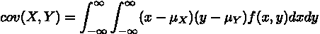

协方差的定义（图片由作者提供）。

这里的积分使这个方程看起来比实际要复杂，而实际上这里只是对联合空间进行平均计算。这个事实可以通过使用期望值运算符**E**[⋅]来更清楚地呈现，它提供了一个更易于接受的数学表达式来表示协方差：

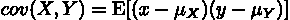

使用期望运算符定义协方差（图片由作者提供）。

所以，我们在这里看到的是，协方差是对均值中心化的*X*和*Y*变量的乘积取期望（或平均）。实际上，这可以进一步简化，因为期望具有相当好的线性特性：

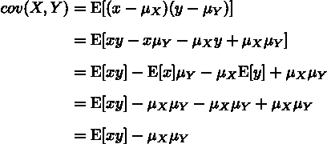

使用期望的线性特性进一步简化协方差的定义（图片由作者提供）。

我们现在可以看到，协方差只是变量乘积的均值减去它们均值乘积的结果。此外，还有一个有趣的事实：*方差*是协方差的一个特殊情况，简单来说，就是变量与自身的协方差：

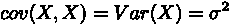

变量自身的协方差就是方差（图片由作者提供）。

从根本上说，协方差是任何联合概率分布的一个特性，并且是其本身的一个总体参数。这意味着，如果我们只有*X*和*Y*的样本，我们可以使用以下公式计算样本协方差：

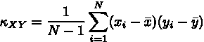

样本协方差（图片由作者提供）。

好的，那么在实际中协方差意味着什么？

简单来说，协方差衡量了一个变量的值与另一个变量的值之间的关系程度，这种关系可以是正的也可以是负的。*正*协方差表明这两个变量倾向于朝相同方向变化。例如，如果*X*的较大值通常与*Y*的较大值一致，那么协方差就是正的。如果较低的值也一致，则也是如此。然而，*负*协方差则表明值倾向于朝相反方向变化：例如，大的*X*值对应低的*Y*值时，就会出现这种情况。

协方差的一个有用特性是它的符号描述了*X*和*Y*之间的*线性关系*的倾向。也就是说，它所表达的实际单位并不特别有用。请记住，我们在计算*X*和*Y*的乘积，因此协方差本身的单位也是*X* × *Y*。这可能使得数据之间的比较变得困难，因为测量的尺度是重要的。

## 相关性

我们通常所说的*相关性*是通过 Pearson 的积矩相关系数来衡量的，该系数通常用*ρ*表示。如果你觉得协方差听起来很像相关性，那你没错。这是因为相关系数只是协方差的*标准化*版本，其中标准化因子是标准差的乘积。

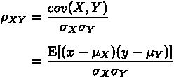

Pearson 的积矩相关系数（作者提供的图片）。

我们还可以使用以下公式从数据中估计相关系数：

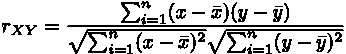

样本相关系数（作者提供的图片）。

这种标准化的结果是，相关系数的值只能在-1 和 1 之间，其中-1 表示完全负相关，1 表示完全正相关，0 表示没有相关性。这样，它测量了两个变量之间关系的强度和方向。这样做的好处是，相关系数是*标准化的度量*，意味着它不受涉及变量的尺度影响。这解决了协方差的一个内在问题，使得比较不同变量集之间的相关性变得更容易。

然而，虽然相关系数估计了关系的强度，但它无法完全描述数据。Anscombe 的四重奏很好地展示了这一点，显示了数据中的不同模式如何产生相同的相关系数。最终，Pearson 的相关系数只有在数据是多元正态分布时才提供完整的描述。如果不是这样，则相关系数仅提供指示，并需要与数据的视觉检查结合考虑。

## 协方差、相关性与独立性

假设随机变量*X*和*Y*是统计独立的。在独立性假设下，*X*和*Y*的期望值为：

两个独立随机变量的期望（图片由作者提供）。

如果我们将这个代入协方差的表达式中，我们会发现

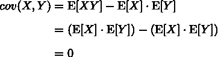

独立随机变量的协方差（图片由作者提供）。

因此，独立的随机变量具有零协方差，这进一步表明这些变量是*无关*的。然而，如果我们发现两个变量无关——即它们的相关系数为零——我们不能简单地假设它们是独立的。从根本上讲，协方差和相关性衡量的是*线性*依赖关系，所以我们只能说这些变量之间不是*线性*相关的。这些变量完全可能是非线性相关的，但协方差和相关性无法检测这些类型的关系。

为了说明这一事实，我们可以借用一个经典的反例。假设*X*是一个有某种围绕零对称分布*f*(*x*)的随机变量。这意味着对于所有*x*，我们有*f*(*-x*) = *f*(*x*)，这进一步意味着以下结论成立：

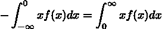

对称性条件（图片由作者提供）。

根据这个对称性条件，*X*的期望值为：

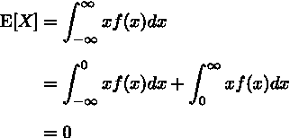

对称分布的期望（图片由作者提供）。

如果我们现在在*X*和*Y*之间创建一个依赖关系，使得*Y* = *X²*，那么我们就知道对于任何给定的*X*值，*Y*必须是什么。然而，如果我们检查*X*和*Y*之间的协方差，我们会发现：

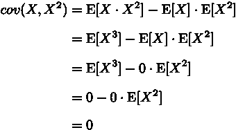

非线性相关的两个变量的协方差（图片由作者提供）。

这表明，虽然*X*和*Y*明显相关，但协方差为零，因为它们之间的关系是非线性的。不过，有一种特殊情况你需要知道。如果*X*和*Y*都是正态分布变量，那么零的相关系数*确实*意味着独立。

## 相关内容

+   [多重共线性：问题还是无问题？](https://medium.com/towards-data-science/multicollinearity-problem-or-not-d4bd7a9cfb91)

感谢阅读！

如果你喜欢这篇文章并希望保持最新状态，请考虑[关注我在 Medium](https://medium.com/@dataforyou)。这将确保你不会错过任何新内容。

要无限访问所有内容，请考虑注册[Medium 订阅](https://medium.com/membership)。

你还可以[在 Twitter 上关注我](https://twitter.com/dataforyounz)、[在 LinkedIn 上关注我](https://www.linkedin.com/in/dataforyou/)，或者查看我的[GitHub](https://github.com/dataforyounz)，如果这更符合你的兴趣 😉
