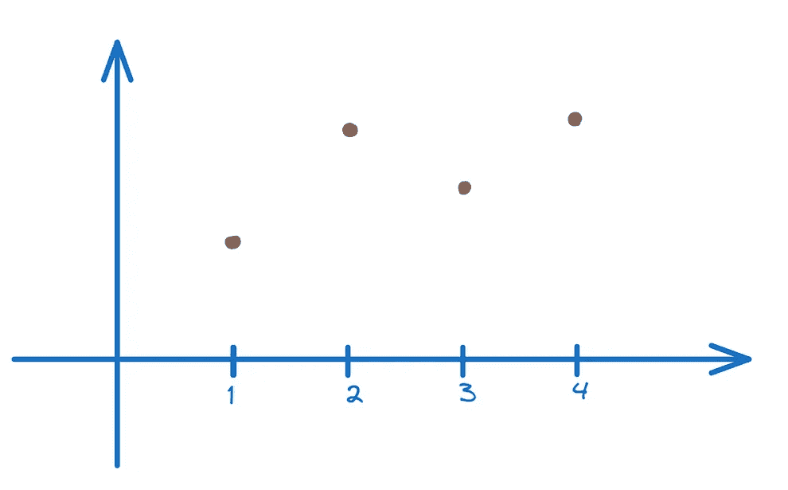
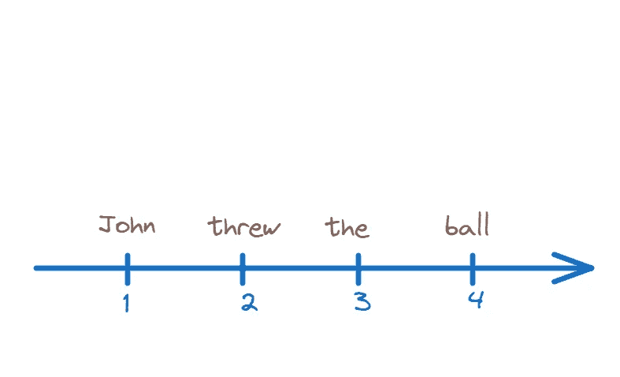
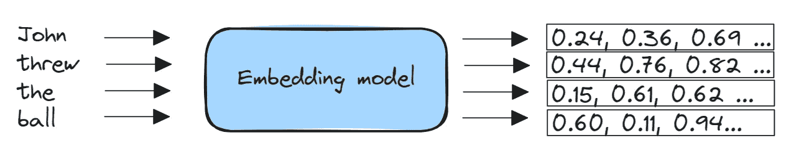
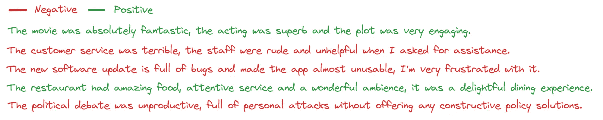
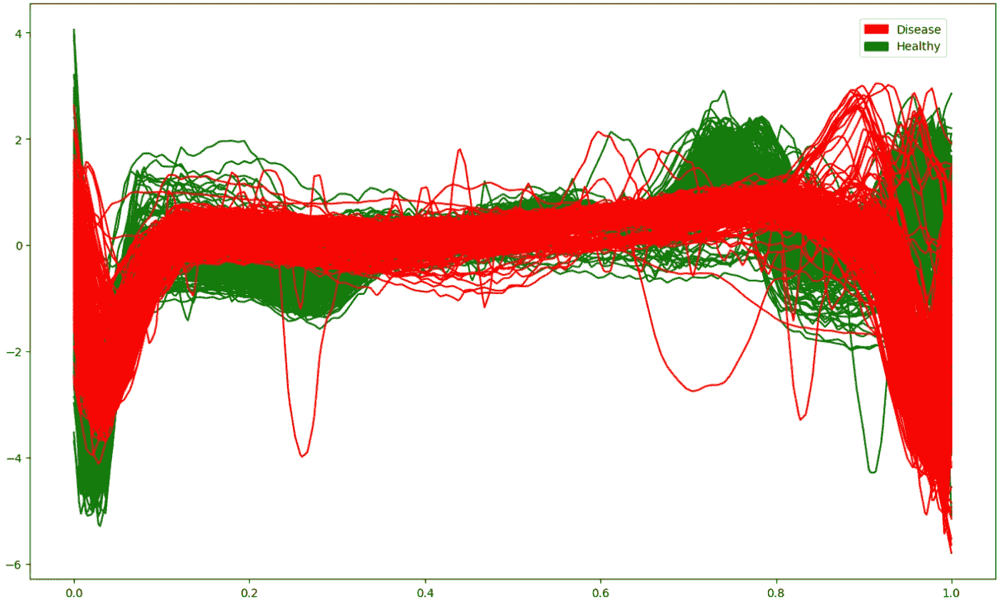
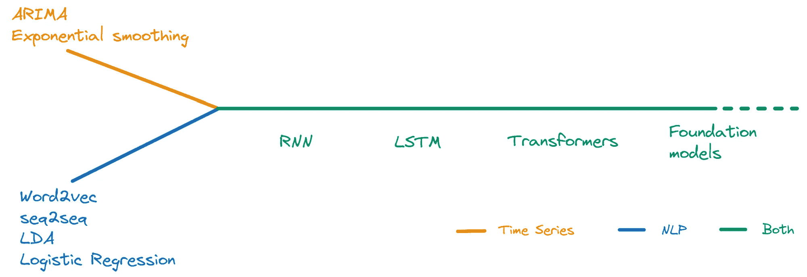
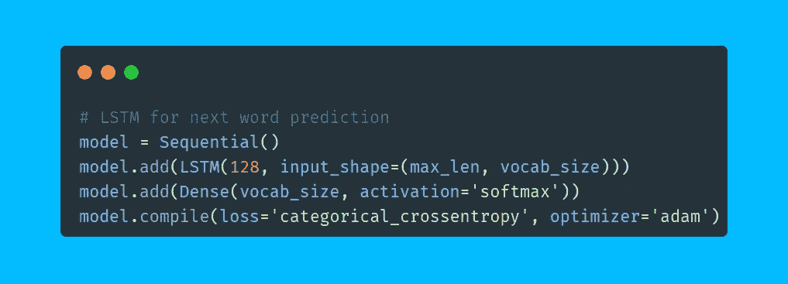
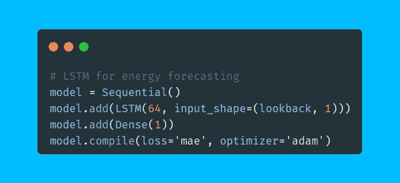
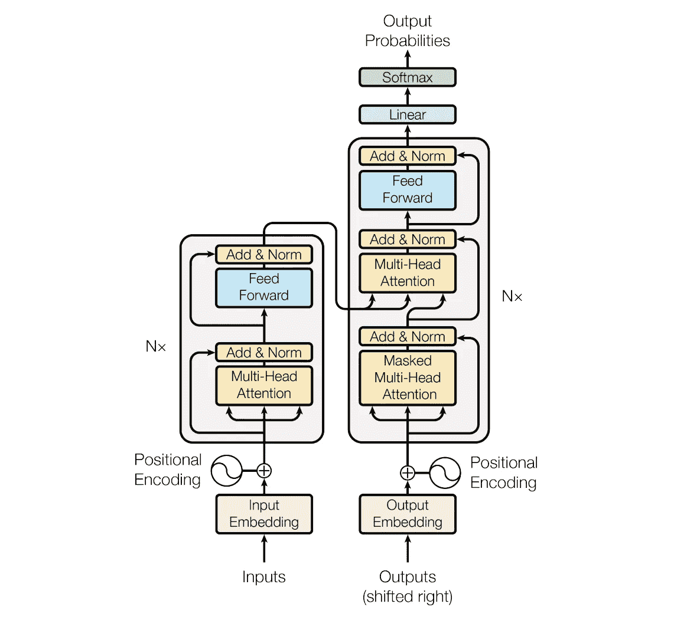
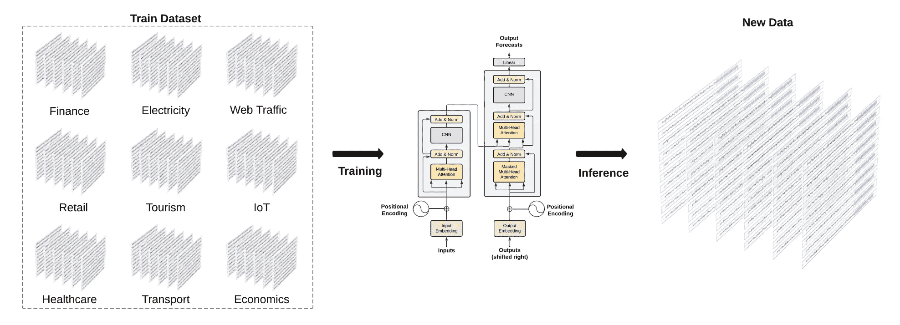

# 深度学习在序列数据中的应用介绍

> 原文：[`towardsdatascience.com/an-introduction-to-deep-learning-for-sequential-data-ac966b9b9b67`](https://towardsdatascience.com/an-introduction-to-deep-learning-for-sequential-data-ac966b9b9b67)

## 突出时间序列与自然语言处理的相似性

 [Donato Riccio](https://donatoriccio.medium.com/?source=post_page-----ac966b9b9b67--------------------------------)

·发表于 [Towards Data Science](https://towardsdatascience.com/?source=post_page-----ac966b9b9b67--------------------------------) ·阅读时间 8 分钟·2023 年 11 月 14 日

--

当我加载时间序列数据集时的想象。图片由作者提供。（AI 辅助）

时间序列和自然语言等序列数据需要能够捕捉顺序和上下文的模型。时间序列分析侧重于基于时间模式进行预测，而自然语言处理旨在从单词序列中提取语义信息。

尽管任务各异，但这两种数据类型都有长程依赖关系，即远距离的元素会影响预测。随着深度学习的发展，最初为一个领域开发的模型架构已被调整以适用于另一个领域。

## 序列数据

时间序列和自然语言都具有顺序结构，其中观察值在序列中的位置至关重要。

时间序列是一系列数值。（左）文本是一系列单词。（右）图片由作者提供。

时间序列是一组按时间顺序排列的观察值，并以固定的时间间隔进行采样。一些例子包括：

+   每日股票价格

+   每小时服务器指标

+   每秒的温度读数

时间序列数据的关键属性是观察值的顺序是有意义的。时间上相邻的值通常高度相关——了解近期值有助于预测下一个值。时间序列分析旨在对这些时间依赖性进行建模，以理解模式并进行预测。

文本数据也是序列化的——单词的顺序传达了意义和上下文。例如：

+   约翰扔了球

+   球扔了约翰

尽管两个句子包含相同的单词，但其含义完全取决于词序。这些时间关系在语言模型中表示，是自然语言任务如翻译和总结的关键。

时间序列和文本都表现出**长距离依赖**——序列中相隔较远的值仍会相互影响。此外，本地模式在不同位置之间重复。

## 神经网络中的时间序列和文本表示

文本数据需要转换为嵌入，以使其对机器可读。

称为嵌入的向量表示从大型数据集中学习，以捕捉单词或数据点之间的语义意义和关系。嵌入向量在每个元素中编码不同的语义属性，以密集的低维方式表示单词/数据，供机器学习模型使用。嵌入可以在大型语料库上预训练，然后针对特定任务进行微调。

从单词到嵌入。图片来源于作者。

在分析时间序列时，还需考虑趋势和季节性等因素。但在神经网络中，这些数据的表示方式的最终区别在于时间序列是值的序列，而文本是向量的序列。

## 顺序数据任务

在检查顺序数据时，最直观的下一步是预测序列中接下来会发生什么。

**在时间序列预测中**，你试图根据过去的数据预测一个连续值（例如明天的股价或下周的温度）。模型被训练以最小化其预测值与实际值之间的差异，这是回归任务的一个常见特征。

**文本生成**——或更恰当地说，**下一个标记预测**——包括训练一个模型，以根据之前的标记预测下一个标记。自回归语言建模可以被视为一个多类分类问题，其中每个可能的标记可以看作一个单独的类别。输出是词汇表中所有可能标记的概率分布。

文本分类（情感分析）。图片来源于作者。

其他任务包括**句子分类**——将句子或文档分类到预定义的类别中，以及**时间序列分类**。

一个例子是情感分析，这是一个将每个文本分类为*积极*或*消极*类别的任务。时间序列也可以进行分类，例如，可以将心跳分类为*健康*或*疾病*以检测异常。

时间序列分类（ECG）。图片来源于作者。

在这里，模型需要在手动标注的示例数据集上进行训练，以学习如何将文本或时间序列特征映射到分类标签。

## 顺序数据建模

在今天强大的神经网络用于时间序列预测和自然语言处理之前，通常使用不同的模型来处理这些任务。

在 2010 年代之前，像自回归积分滑动平均**（ARIMA）**和指数平滑模型这样的统计方法在时间序列预测中非常流行。这些方法依赖于时间序列中过去值之间的数学关系来预测未来值。虽然在一些数据上有效，但它们做出的刚性假设限制了其在复杂现实世界时间序列上的表现。

在自然语言处理（NLP）中，语言翻译和语音识别等任务过去通常使用基于规则的系统来解决。这些系统编码了人为制定的规则和语法，需要大量的手工努力，并且在处理真实人类语言的细微差别和变化时存在困难。作为替代，朴素贝叶斯、逻辑回归以及其他经典机器学习模型有时也会被应用，但这些模型无法有效捕捉文本数据中的长期上下文和依赖关系。

用于序列数据的模型。作者提供的图像。

**RNN**和**LSTM**网络的引入使得时间序列预测和自然语言处理能够进行上下文学习。与依赖于刚性统计假设或简单的输入输出映射不同，RNN 可以从顺序数据中学习长期依赖关系。这一突破使得它们在语言建模、情感分析和非线性预测等问题上表现出色，而这些问题的经典方法无效。尽管在 1980 年代就已引入，但这些模型直到过去十年才变得实用，因为计算能力显著提高。Google 在 2015 年开始在 Google Voice 中使用 LSTM。[1]

## 循环神经网络

RNN 包含递归连接，允许信息在时间步长之间持续存在。

在进行预测时，可以训练递归神经网络（RNN）使用时间序列中的历史观测数据来学习时间模式。RNN 通过在每个时间步根据当前输入和先前的隐藏状态来更新其隐藏状态来处理序列。

对于下一个标记预测，RNN 在像句子这样的文本序列上进行训练，其中每个标记是一个词。RNN 学习基于先前的词预测下一个词。隐藏状态保持早期词的上下文，以指导下一个预测。在每一步，RNN 输出下一个标记的概率分布。

LSTM 模型可用于预测和下一个词预测。作者提供的图像。

RNNs 记住过去上下文的能力对 NLP 和时间序列分析中的序列任务产生了变革性影响。然而，由于梯度消失和爆炸等问题，它们在处理长期依赖时可能会遇到困难。这一问题促使了像**LSTM**这样的架构进展，以改善跨多个时间步的梯度流，并通过基于注意力的模型进一步增强。

## Transformers

**注意力**机制使得我们今天所知的所有惊人 LLM 成为可能。它们最初是为了增强 RNNs，通过允许模型在进行预测时关注输入序列的相关部分。注意力函数为每个时间步评分重要性，并利用这些权重提取相关上下文。

注意力已成为 NLP 和时间序列建模中序列任务不可或缺的组成部分。通过关注相关输入，它提高了模型的准确性和可解释性。

原始的 Transformer 架构。位置编码使得序列的顺序能够被捕捉到。[2]

完全依赖自注意力的 Transformer 架构在 NLP 和时间序列建模中取得了突破性成果。自注意力层允许建模序列元素之间的依赖关系，只要序列适合上下文长度，无论距离多远。

Transformers 已成为顺序数据的最先进技术，**这种架构被适配为 NLP 的 BERT 和时间序列的 Temporal Fusion Transformer。**

# 面向时间序列的基础模型

**基础模型**是一个大型机器学习模型，可以在大量数据上进行训练，然后适应各种任务。基础模型不同于传统的机器学习模型，后者通常执行特定任务。它们更为通用和灵活，可以作为开发更专业应用的起点。避免从头开始的昂贵训练可以显著减少构建新应用的时间和成本。

在 NLP 中，大型语言模型允许***上下文学习***——它们可以执行未明确训练的新任务。这一革命性能力使 ChatGPT 和其他 LLM 如此强大，因为它们能够泛化到各种任务。

当前的大多数预测方法必须针对每个新数据集进行单独拟合。这一过程耗时且需要领域专业知识。为了解决这个问题，基础模型的概念最近被应用于时间序列数据。

TimeGPT 在大量数据集上进行了预训练，并能够生成新数据。[3]

**TimeGPT**是一个基于 Transformer 的神经网络，预训练于超过 1000 亿个时间序列数据点的多样数据集，涵盖了经济学、天气、交通、零售销售等领域。其关键创新在于，像 GPT-3 一样，TimeGPT 能够泛化，对新的时间序列数据进行准确预测，而无需对每个新数据集重新训练。这种*零样本*能力相比于传统预测管道节省了大量时间和资源。一个基础模型简化了预测过程，仅用几行代码即可应用于任何时间序列。[2]

## 收获

在进行深度学习时，要跳出框框思考。数据和模型之间有更多共同之处——一切都是互联的。时间序列分析和自然语言处理（NLP）都在迅速创新和共享思想。

时间序列和自然语言处理作为序列数据类型有许多相似之处。我们使用 RNN、LSTM 和 Transformer 等架构对这两者进行建模。随着深度学习的进步，我们预计技术将继续在这些领域之间交叉。

2010 年代是神经网络征服曾经由统计模型主导的领域的十年。2020 年代看起来将是 Transformer 巩固其主导地位的十年，研究人员不断推动这些强大模型的边界。

*喜欢这篇文章吗？通过订阅我的新闻通讯，每周获取数据科学面试问题送到你的邮箱，* [*The Data Interview*](https://thedatainterview.substack.com/)*。*

*另外，你可以在* [*LinkedIn*](https://www.linkedin.com/in/driccio/)*上找到我。*

## 参考文献

[1] [长短期记忆 — 维基百科](https://en.wikipedia.org/wiki/Long_short-term_memory)

[2][[1706.03762] Attention Is All You Need (arxiv.org)](https://arxiv.org/abs/1706.03762)

[3] [[2310.03589] TimeGPT-1 (arxiv.org)](https://arxiv.org/abs/2310.03589?ref=emergentmind)
