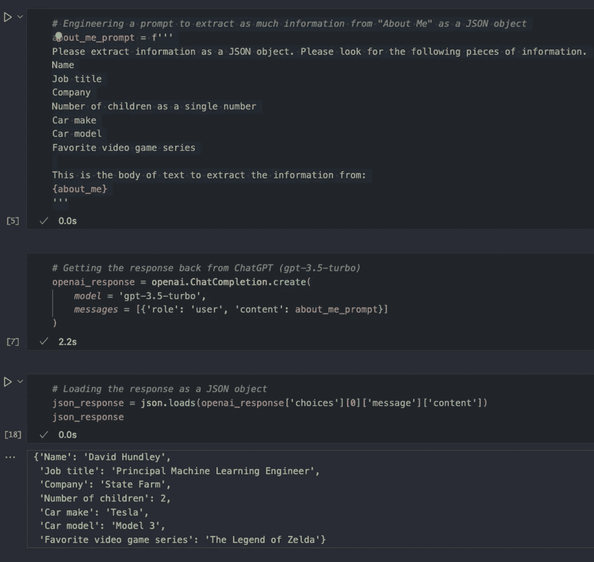
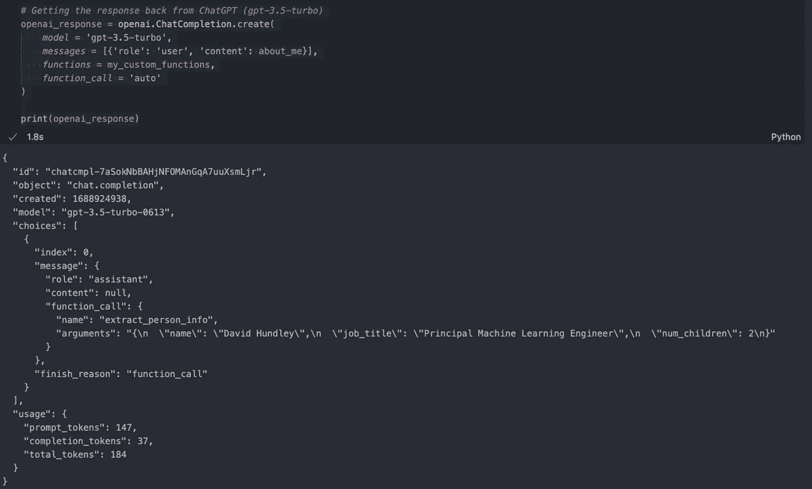
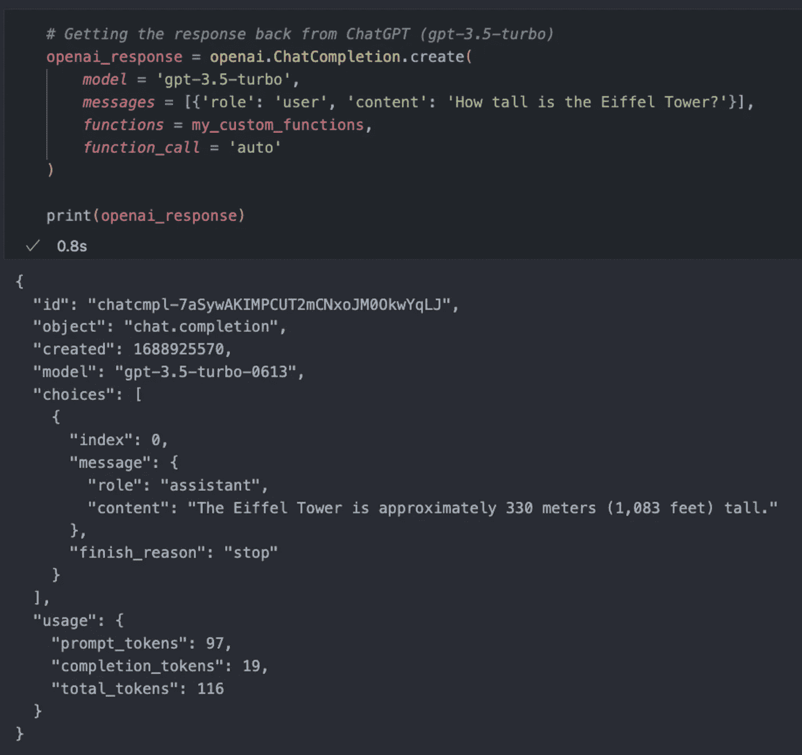
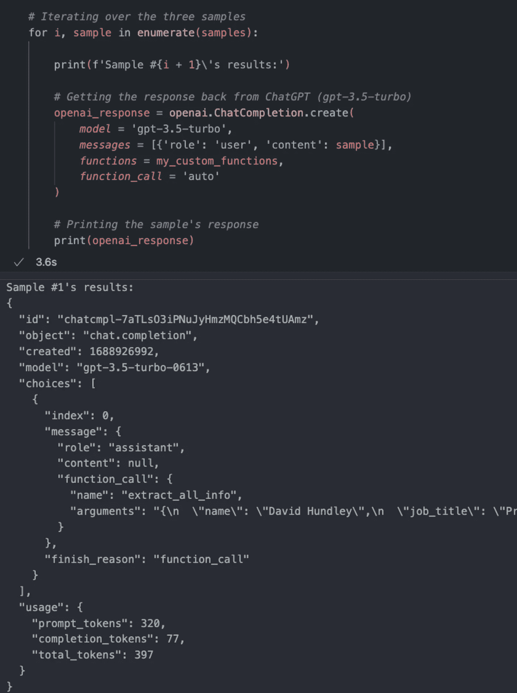
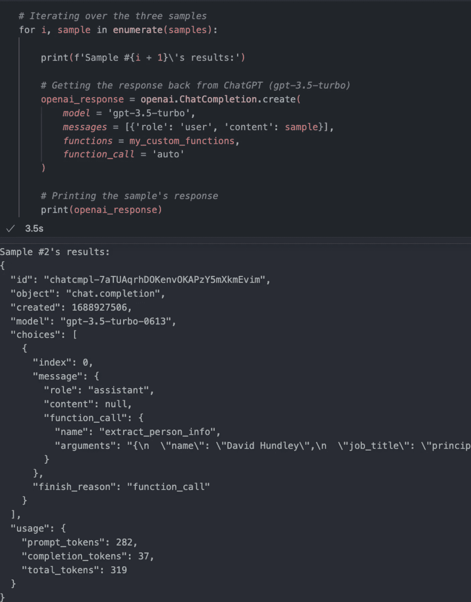
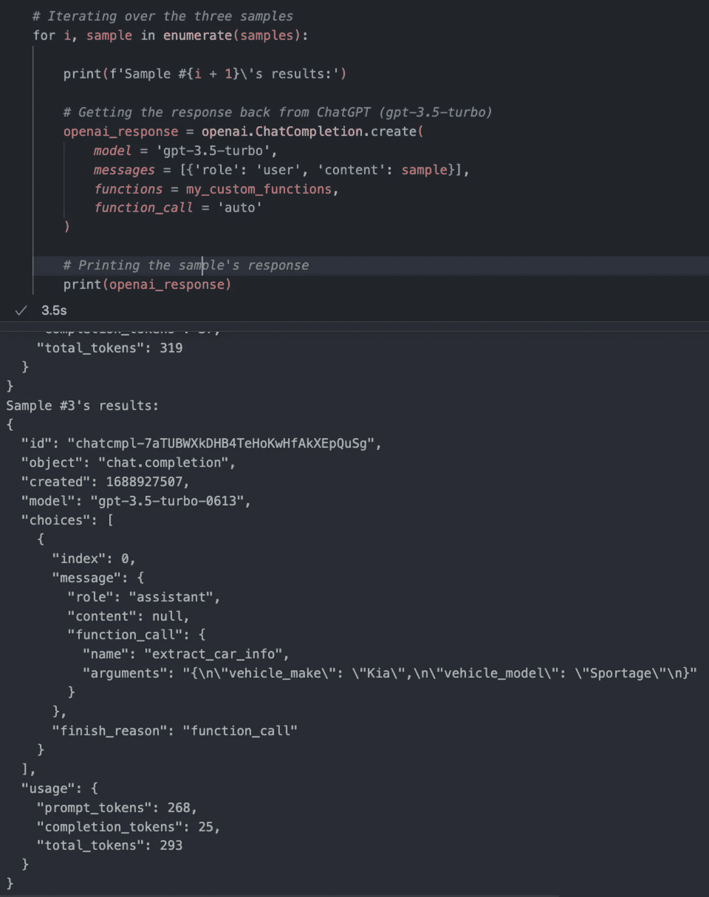
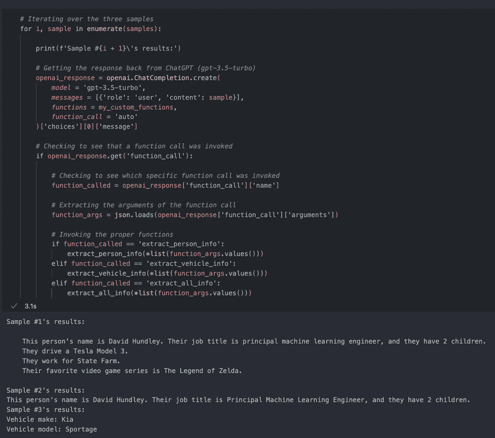
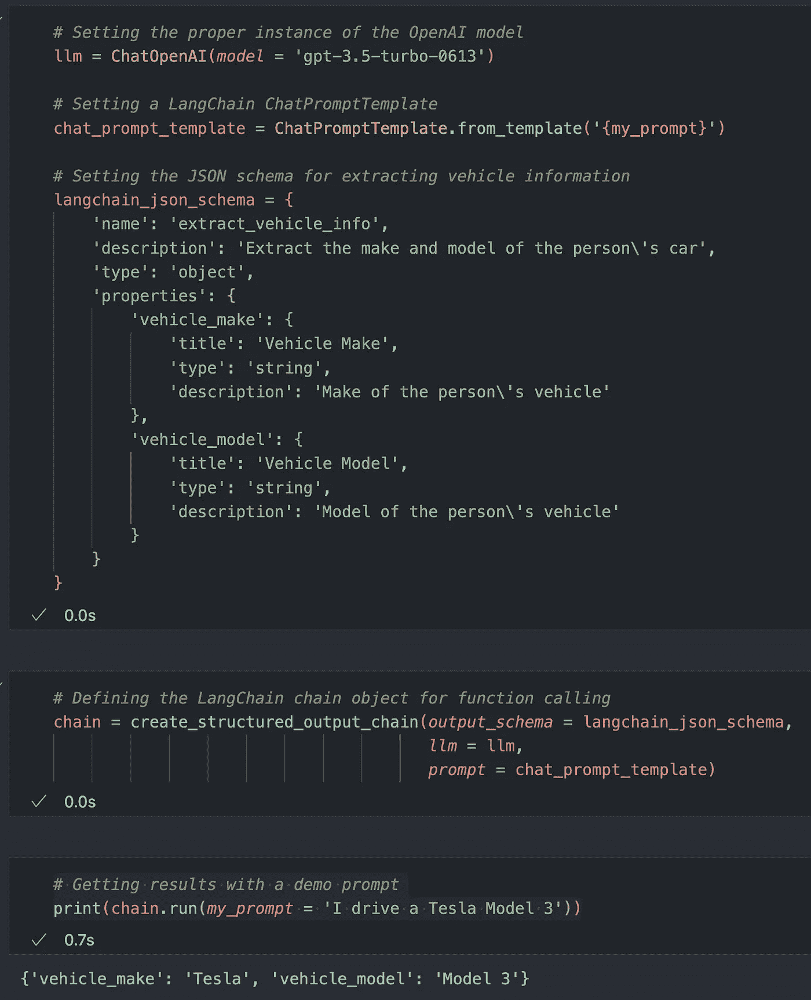

# OpenAI 函数调用简介

> 原文：[`towardsdatascience.com/an-introduction-to-openai-function-calling-e47e7cd7680e`](https://towardsdatascience.com/an-introduction-to-openai-function-calling-e47e7cd7680e)

## 不再输出无结构的数据；将 ChatGPT 的完成内容转化为结构化的 JSON！

[](https://dkhundley.medium.com/?source=post_page-----e47e7cd7680e--------------------------------)[](https://towardsdatascience.com/?source=post_page-----e47e7cd7680e--------------------------------) [David Hundley](https://dkhundley.medium.com/?source=post_page-----e47e7cd7680e--------------------------------)

·发表于 [Towards Data Science](https://towardsdatascience.com/?source=post_page-----e47e7cd7680e--------------------------------) ·阅读时间 16 分钟·2023 年 7 月 9 日

--


作者制作的标题卡

几个月前，OpenAI 向公众发布了他们的 API，这让许多希望以系统化方式利用 ChatGPT 输出的开发者感到兴奋。尽管这很激动人心，但也同样有些令人头痛，因为我们程序员通常工作在**结构化数据类型**的领域。我们喜欢整数、布尔值和列表。无结构的字符串处理起来可能很麻烦，为了获得一致的结果，程序员必须面对他们最可怕的噩梦：开发用于正确解析的正则表达式（Regex）。🤢

当然，提示工程确实可以在这里提供很大帮助，但仍然不完美。例如，如果你想让 ChatGPT 分析电影评论的积极性或消极性，你可能会构造如下提示：

```py
prompt = f'''
Please perform a sentiment analysis on the following movie review:
{MOVIE_REVIEW_TEXT}
Please output your response as a single word: either "Positive" or "Negative".
'''
```

这个提示实际上做得相当不错，但结果并不完全一致。例如，我看到 ChatGPT 在电影情感示例中产生的输出可能如下：

+   `Positive`

+   `positive`

+   `Positive.`

这看起来可能不是大问题，但在编程世界中，这些是不相等的。再说，你可以通过一些正则表达式来处理这样的简单示例，但超出这一点，大多数人（包括我自己）在编写正则表达式方面都很糟糕，有些情况下即使是正则表达式也无法正确解析信息。

正如你所看到的，程序员们一直希望 OpenAI 增加支持结构化 JSON 输出的功能，而 OpenAI 以 **函数调用** 的形式实现了这一点。[函数调用](https://openai.com/blog/function-calling-and-other-api-updates) 的意思就是它允许 ChatGPT 生成可以与自定义函数交互的参数，以使用结构化数据类型。不再需要花哨的提示工程和正则表达式来祈祷你能得到正确的结果。在这篇文章中，我们将介绍如何利用这一新功能，但首先，让我们从一个例子开始，展示我们过去如何尝试通过提示工程和正则表达式生成结构化数据输出。

在我们进入文章的主要内容之前，请允许我 [分享这个 Jupyter notebook 在我的 GitHub 上的链接](https://github.com/dkhundley/openai-api-tutorial/blob/main/notebooks/function-calling.ipynb)。这个 notebook 包含了我将在这篇博客文章中运行的所有代码（以及更多）。此外，我建议你 [查看 OpenAI 官方的函数调用文档](https://platform.openai.com/docs/guides/gpt/function-calling)，以获取我可能没有涵盖的内容。

# 函数调用前的时代

为了展示我们在“函数调用前的时代”是如何做的，我写了一小段关于自己的文本，我们将使用 OpenAPI 从这段文本中提取信息。以下是我们将要使用的“关于我”的文本：

> 你好！我叫大卫·亨德利。我是 State Farm 的首席机器学习工程师。我喜欢学习 AI 并将所学的知识传授给他人。我有两个女儿。我开一辆特斯拉 Model 3，我最喜欢的视频游戏系列是《塞尔达传说》。

假设我想从这段文本中提取以下信息：

+   姓名

+   职业头衔

+   公司

+   子女数量 *以整数形式（这很重要！）*

+   车辆品牌

+   车辆型号

+   最喜欢的视频游戏系列

这是我如何设计一个少量示例提示以生成结构化 JSON 输出：

```py
# Engineering a prompt to extract as much information from "About Me" as a JSON object
about_me_prompt = f'''
Please extract information as a JSON object. Please look for the following pieces of information.
Name
Job title
Company
Number of children as a single integer
Car make
Car model
Favorite video game series

This is the body of text to extract the information from:
{about_me}
'''

# Getting the response back from ChatGPT (gpt-3.5-turbo)
openai_response = openai.ChatCompletion.create(
    model = 'gpt-3.5-turbo',
    messages = [{'role': 'user', 'content': about_me_prompt}]
)

# Loading the response as a JSON object
json_response = json.loads(openai_response['choices'][0]['message']['content'])
json_response
```

让我们来看看 ChatGPT 是如何返回这个完成的：



“函数调用前”的时代（作者捕捉）

正如你所见，这其实还不错。但它不是理想的，并且由于以下原因可能会有风险：

+   我们不能保证 OpenAI 的回应会提供干净的 JSON 输出。它可能会生成类似于“这是你的 JSON：”后跟 JSON 输出的内容，这意味着为了使用 `json.loads()` 将字符串解析为 JSON 对象，我们必须先去掉响应开头的那一小段文本。

+   我们不能保证 JSON 对象中的键值对的键在 API 调用中是一致的。回忆一下上面提到的 3 个 `Positive` 实例。这正是你在尝试通过少量提示工程解析键时所面临的风险。你可能唯一能固定这个问题的方法是使用正则表达式，但正如我们之前讨论过的，这也有自己的麻烦。

+   我们不能保证收到的响应是正确的数据类型格式。虽然我们提取孩子数量的提示工程解析成了一个合适的整数，但我们仍然只能祈祷每次 API 调用都能获得一致的结果。

我们可以将这些问题总结为一句话：**没有功能调用，我们不能保证获得对系统化实现所需精度的重要一致结果。** 这是一个非平凡的问题，通过提示工程和正则表达式解决起来可能非常具有挑战性。

# 进入功能调用

现在我们已经对为什么从 ChatGPT 获得结构化输出曾经存在问题有了一定的直觉，让我们来看看 OpenAI 引入的新功能调用能力。

功能调用实际上有点误导。OpenAI 实际上并没有在真正的函数调用中运行你的代码。相反，它只是设置了你执行自定义函数所需的结构化参数，我认为这是更好的行为。虽然你可能会觉得 OpenAI API 不执行你的自定义函数不合理，但考虑到要做到这一点，你必须将函数代码传递给 ChatGPT。这段函数代码可能包含你不想暴露给任何人的专有信息，因此不需要传递这些代码来利用 OpenAI 的功能调用是件好事。

让我们来看一个如何使用单个自定义函数启用功能调用的示例。使用我们前一节的“关于我”样本文本，创建一个名为`extract_person_info`的自定义函数。这个函数只需要三项信息：个人姓名、职位名称和孩子数量。（我们将在下一节重新访问提取其余信息的部分；我现在只是想从简单开始。）这个自定义函数故意设计得非常简单，它将接受我们的参数，并将它们合并为一个字符串。以下是代码：

```py
def extract_person_info(name, job_title, num_children):
    '''
    Prints basic "About Me" information

    Inputs:
        - name (str): Name of the person
        - job_title (str): Job title of the person
        - num_chilren (int): The number of children the parent has.
    '''

    print(f'This person\'s name is {name}. Their job title is {job_title}, and they have {num_children} children.')
```

为了利用功能调用，我们需要以特定的方式设置一个 JSON 对象，说明我们自定义函数的名称以及我们希望 ChatGPT 从文本正文中提取的数据元素。由于 JSON 对象应有的具体格式，如果你想了解我未涉及的详细信息，建议参考 OpenAI 的开发者文档。

（注意：在 OpenAI 文档中，我注意到 JSON 对象中有一个名为`required`的元素，似乎表示参数必须存在，以便 ChatGPT 能够正确识别函数。我尝试过测试，但无论如何，这可能不是这种功能的工作方式，或者我做错了什么。无论如何，我确实不清楚这个`required`参数的意义。😅）

这是我们需要如何构建我们的 JSON 对象以利用自定义函数：

```py
my_custom_functions = [
    {
        'name': 'extract_person_info',
        'description': 'Get "About Me" information from the body of the input text',
        'parameters': {
            'type': 'object',
            'properties': {
                'name': {
                    'type': 'string',
                    'description': 'Name of the person'
                },
                'job_title': {
                    'type': 'string',
                    'description': 'Job title of the person'
                },
                'num_children': {
                    'type': 'integer',
                    'description': 'Number of children the person is a parent to'
                }
            }
        }
    }
]
```

你可能已经对 JSON 语法很熟悉了，不过让我稍微提一下与每个属性相关的数据类型。如果你像我一样是 Python 开发人员，请注意，这种 JSON 结构的数据类型与我们在 Python 中定义的数据结构并不完全相同。一般来说，我们可以找到一些工作得不错的等效类型，但如果你想了解更多关于这种 JSON 结构的具体数据类型，[请查看这个文档](https://json-schema.org/understanding-json-schema/reference/object.html)。

现在我们准备进行 API 调用以获取结果！使用 Python 客户端，你会注意到语法非常类似于我们通常获取完成的方式。我们只是要在此调用中添加一些额外的参数，代表我们的函数调用：

```py
# Getting the response back from ChatGPT (gpt-3.5-turbo)
openai_response = openai.ChatCompletion.create(
    model = 'gpt-3.5-turbo',
    messages = [{'role': 'user', 'content': about_me}],
    functions = my_custom_functions,
    function_call = 'auto'
)

print(openai_response)
```

如你所见，我们只是将自定义函数列表（在我们的例子中是单个自定义函数）作为`functions`参数传递，并且你会注意到一个名为`function_call`的额外参数，我们将其设置为`auto`。目前不必担心这个`auto`，因为我们将在下一节回顾这个`auto`的作用。

让我们运行这段代码，看看 ChatGPT 的完整 API 响应



使用单个函数的函数调用（由作者捕捉）

大多数情况下，这个响应看起来与非函数调用响应相同，但现在响应中多了一个额外的字段，叫做`function_call`，在这个字典下嵌套了两个额外的项目：`name`和`arguments`。`name`表示我们将用 ChatGPT 的输出调用的自定义函数的名称，而`arguments`包含一个字符串，我们可以使用`json.loads()`将其加载为 JSON 对象，从而加载我们的自定义函数参数。

注意，现在我们获得的结果比之前函数调用方法的结果要一致得多。现在我们可以保证键值对的键和值的数据类型将是一致的。无需复杂的提示工程或正则表达式！

这就是 OpenAI 函数调用的核心！当然，这只是一个非常简单的示例来帮助你入门，但你可能还有其他问题。我们将在下一节讨论这些问题。

# 那么…怎么办呢？

上一部分介绍了如何启用函数调用的一个非常简单的示例，但如果你像我一样，可能会有一些额外的问题。自然，我不能涵盖所有这些问题，但我确实想要探讨两个比上一部分稍微复杂一些的问题。

## 如果我提交的提示中不包含我自定义函数所需的信息会怎样？

在我们的原始示例中，我们的自定义函数旨在提取三个非常具体的信息点，我们通过传入我的自定义“关于我”文本作为提示来成功演示了这一点。但你可能会想，如果你传入任何其他不包含这些信息的提示会发生什么？

记住，我们在 API 客户端调用中设置了一个名为 `function_call` 的参数，我们将其设置为 `auto`。我们将在下一小节中更深入地探讨这个问题，但这个参数的本质作用是告诉 ChatGPT 在何时使用自定义函数来构建输出。

那么，当我们提交一个不匹配任何自定义函数的提示时会发生什么呢？简单来说，它将默认采用典型行为，好像函数调用不存在一样。我们用一个任意提示来测试一下：“埃菲尔铁塔有多高？”



函数调用，但提示不匹配函数（作者拍摄）

如你所见，我们得到了典型的“完成”输出，尽管我们传入了自定义函数。自然，这也很合理，因为这个任意的埃菲尔铁塔提示中不包含我们所寻找的具体信息。

## 如果我想传递多个自定义函数，而其中一些函数具有重叠的参数怎么办？

简而言之，ChatGPT 能够智能地处理这个问题。我们之前将一个自定义函数作为 Python 字典列表传入，现在我们只需继续向这个列表中添加更多 Python 字典，每个字典表示一个不同的函数。我们来添加两个新函数：一个叫做 `extract_vehicle_info`，另一个叫做 `extract_all_info`。调整后的语法如下：

```py
# Defining a function to extract only vehicle information
def extract_vehicle_info(vehicle_make, vehicle_model):
    '''
    Prints basic vehicle information

    Inputs:
        - vehicle_make (str): Make of the vehicle
        - vehicle_model (str): Model of the vehicle
    '''

    print(f'Vehicle make: {vehicle_make}\nVehicle model: {vehicle_model}')

# Defining a function to extract all information provided in the original "About Me" prompt
def extract_vehicle_info(name, job_title, num_children, vehicle_make, vehicle_model, company_name, favorite_vg_series):
    '''
    Prints the full "About Me" information

    Inputs:
        - name (str): Name of the person
        - job_title (str): Job title of the person
        - num_chilren (int): The number of children the parent has
        - vehicle_make (str): Make of the vehicle
        - vehicle_model (str): Model of the vehicle
        - company_name (str): Name of the company the person works for
        - favorite_vg_series (str): Person's favorite video game series.
    '''

    print(f'''
    This person\'s name is {name}. Their job title is {job_title}, and they have {num_children} children.
    They drive a {vehicle_make} {vehicle_model}.
    They work for {company_name}.
    Their favorite video game series is {favorite_vg_series}.
    ''')

# Defining how we want ChatGPT to call our custom functions
my_custom_functions = [
    {
        'name': 'extract_person_info',
        'description': 'Get "About Me" information from the body of the input text',
        'parameters': {
            'type': 'object',
            'properties': {
                'name': {
                    'type': 'string',
                    'description': 'Name of the person'
                },
                'job_title': {
                    'type': 'string',
                    'description': 'Job title of the person'
                },
                'num_children': {
                    'type': 'integer',
                    'description': 'Number of children the person is a parent to'
                }
            }
        }
    },
    {
        'name': 'extract_car_info',
        'description': 'Extract the make and model of the person\'s car',
        'parameters': {
            'type': 'object',
            'properties': {
                'vehicle_make': {
                    'type': 'string',
                    'description': 'Make of the person\'s vehicle'
                },
                'vehicle_model': {
                    'type': 'string',
                    'description': 'Model of the person\'s vehicle'
                }
            }
        }
    },
    {
        'name': 'extract_all_info',
        'description': 'Extract all information about a person including their vehicle make and model',
        'parameters': {
            'type': 'object',
            'properties': {
                'name': {
                    'type': 'string',
                    'description': 'Name of the person'
                },
                'job_title': {
                    'type': 'string',
                    'description': 'Job title of the person'
                },
                'num_children': {
                    'type': 'integer',
                    'description': 'Number of children the person is a parent to'
                },
                'vehicle_make': {
                    'type': 'string',
                    'description': 'Make of the person\'s vehicle'
                },
                'vehicle_model': {
                    'type': 'string',
                    'description': 'Model of the person\'s vehicle'
                },
                'company_name': {
                    'type': 'string',
                    'description': 'Name of the company the person works for'
                },
                'favorite_vg_series': {
                    'type': 'string',
                    'description': 'Name of the person\'s favorite video game series'
                }
            }
        }
    }
]
```

特别注意 `extract_all_info` 如何覆盖与我们原始的 `extract_person_info` 函数一些相同的参数，那么 ChatGPT 如何知道选择哪个函数？简单来说，ChatGPT 寻找最佳匹配。如果我们传入的提示包含了 `extract_all_info` 函数所需的所有参数，它就会选择这个函数。但如果我们仅传入包含简单的个人信息或关于车辆的提示，它将利用相应的函数来处理。我们在这里用一些示例代码来执行这个操作：

+   示例 1：原始的“关于我”文本。（见上文。）

+   示例 2：*“我的名字是 David Hundley。我是一名首席机器学习工程师，我有两个女儿。”*

+   示例 3：*“她开的是一辆起亚智跑。”*



示例 #1 的结果（作者捕获）



示例 #2 的结果（作者捕获）



示例 #3 的结果：

在每个相应的提示中，ChatGPT 选择了正确的自定义函数，我们可以特别注意到 API 响应对象中`function_call`下的`name`值。除了这是识别哪个函数使用参数的便捷方式外，我们还可以将实际的自定义 Python 函数程序化地映射到这个值上，以正确地运行代码。如果这不太清楚，也许查看代码会更明白：

```py
# Iterating over the three samples
for i, sample in enumerate(samples):

    print(f'Sample #{i + 1}\'s results:')

    # Getting the response back from ChatGPT (gpt-3.5-turbo)
    openai_response = openai.ChatCompletion.create(
        model = 'gpt-3.5-turbo',
        messages = [{'role': 'user', 'content': sample}],
        functions = my_custom_functions,
        function_call = 'auto'
    )['choices'][0]['message']

    # Checking to see that a function call was invoked
    if openai_response.get('function_call'):

        # Checking to see which specific function call was invoked
        function_called = openai_response['function_call']['name']

        # Extracting the arguments of the function call
        function_args = json.loads(openai_response['function_call']['arguments'])

        # Invoking the proper functions
        if function_called == 'extract_person_info':
            extract_person_info(*list(function_args.values()))
        elif function_called == 'extract_vehicle_info':
            extract_vehicle_info(*list(function_args.values()))
        elif function_called == 'extract_all_info':
            extract_all_info(*list(function_args.values()))
```



最终程序结果！（作者捕获）

****注意事项****：为了完全透明，我必须多次运行那段代码才能使其产生这样的结果。问题在于，因为`extract_person_info`和`extract_all_info`的性质较为相似，ChatGPT 经常把它们混淆在一起。我猜这里的教训是，你的函数应该提取不同的信息。我也仅使用了`gpt-3.5-turbo`进行测试，因此可能像 GPT-4 这样更强大的模型可能处理得更好。

*****2023 年 7 月 28 日更新**：我添加了一个关于如何与 LangChain 配合使用的新部分！***

# OpenAI 函数调用与 LangChain

鉴于 LangChain 的广泛使用，我认为了解如何在该框架内使用相同的函数调用能力可能会有用。对于熟悉 LangChain 的人，你可能已经知道 LangChain 提供了自己的解析能力，这些解析能力主要通过先进的提示工程实现。

如果你已经在使用这些 LangChain 解析器，你可能会想，“我是否应该转向使用 OpenAI 函数调用以获得更好的性能？” 不幸的是，没有一个明确的答案，因为 OpenAI 已经抽象化了实现函数调用的方式。（相信我，我深入挖掘了 OpenAI 客户端源代码，[这一行](https://github.com/openai/openai-python/blob/main/openai/api_resources/abstract/engine_api_resource.py#L156)显示它确实被抽象化了！）如果你已经在使用 LangChain 的解析器，我可能建议你继续使用这些解析器，特别是因为它们对于其他 LLM 也具有可移植性。

好消息是，如果你想同时利用 OpenAI 的函数调用和其他 LangChain 功能（并且可以接受只传入一个函数调用模板），你完全可以做到这一点！我不会在这篇文章中深入介绍 LangChain，但我会展示如何快速启用它的代码。这本质上涉及到导入一些 LangChain 对象，并将它们作为我们已经创建的内容的“包装器”。

在继续之前，还有一个问题是 LangChain 的实现……它似乎不允许我们一次提交多个函数调用模板。此外，我们还需要重新格式化 JSON 架构以适应这个特定的实现。它看起来非常相似。我们来做一个逐对比。以下是原生 OpenAI 函数调用的 JSON 架构：

```py
native_json_schema = {
    'name': 'extract_vehicle_info',
    'description': 'Extract the make and model of the person\'s car',
    'parameters': {
        'type': 'object',
        'properties': {
            'vehicle_make': {
                'type': 'string',
                'description': 'Make of the person\'s vehicle'
            },
            'vehicle_model': {
                'type': 'string',
                'description': 'Model of the person\'s vehicle'
            }
        }
    }
}
```

这里是重新格式化后的版本的样子：

```py
langchain_json_schema = {
    'name': 'extract_vehicle_info',
    'description': 'Extract the make and model of the person\'s car',
    'type': 'object',
    'properties': {
        'vehicle_make': {
            'title': 'Vehicle Make',
            'type': 'string',
            'description': 'Make of the person\'s vehicle'
        },
        'vehicle_model': {
            'title': 'Vehicle Model',
            'type': 'string',
            'description': 'Model of the person\'s vehicle'
        }
    }
}
```

这个小代码片段将展示如何执行与上述相同的功能，只不过这次是使用 LangChain！

```py
# Importing the LangChain objects
from langchain.chat_models import ChatOpenAI
from langchain.chains import LLMChain
from langchain.prompts.chat import ChatPromptTemplate
from langchain.chains.openai_functions import create_structured_output_chain

# Setting the proper instance of the OpenAI model
llm = ChatOpenAI(model = 'gpt-3.5-turbo-0613')

# Setting a LangChain ChatPromptTemplate
chat_prompt_template = ChatPromptTemplate.from_template('{my_prompt}')

# Setting the JSON schema for extracting vehicle information
langchain_json_schema = {
    'name': 'extract_vehicle_info',
    'description': 'Extract the make and model of the person\'s car',
    'type': 'object',
    'properties': {
        'vehicle_make': {
            'title': 'Vehicle Make',
            'type': 'string',
            'description': 'Make of the person\'s vehicle'
        },
        'vehicle_model': {
            'title': 'Vehicle Model',
            'type': 'string',
            'description': 'Model of the person\'s vehicle'
        }
    }
}

# Defining the LangChain chain object for function calling
chain = create_structured_output_chain(output_schema = langchain_json_schema,
                                       llm = llm,
                                       prompt = chat_prompt_template)

# Getting results with a demo prompt
print(chain.run(my_prompt = 'I drive a Tesla Model 3.'))
```

如下图所示，我们得到的结果与之前完全相同。



LangChain 调用的输出（截图由作者捕获）

# 总结

我希望你现在能理解为什么函数调用会如此强大！在构建利用生成式 AI 的应用程序时，这种函数调用对程序员来说是一个福音。由于现在不必过多担心输出的 JSON 结构，我们可以将时间集中在构建应用程序的其他部分。现在在这个领域工作是一个绝妙的时机。
