# 《Pandas 用户的 Polars 介绍》

> 原文：[`towardsdatascience.com/an-introduction-to-polars-for-pandas-users-2a52b2a03017`](https://towardsdatascience.com/an-introduction-to-polars-for-pandas-users-2a52b2a03017)

## 展示如何使用这个全新的、极速的 DataFrame 库与表格数据进行交互

[](https://dkhundley.medium.com/?source=post_page-----2a52b2a03017--------------------------------)[](https://towardsdatascience.com/?source=post_page-----2a52b2a03017--------------------------------) [David Hundley](https://dkhundley.medium.com/?source=post_page-----2a52b2a03017--------------------------------)

·发表于 [Towards Data Science](https://towardsdatascience.com/?source=post_page-----2a52b2a03017--------------------------------) ·17 min 阅读·2023 年 3 月 5 日

--

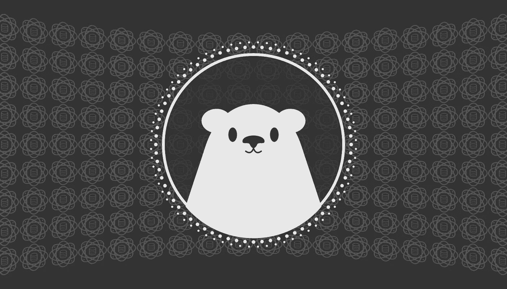

标题卡由作者创建

如果你像我一样，可能会听到很多关于这个新 [Polars](https://www.pola.rs) 库的宣传，但不确定它是什么或如何开始使用。如果你完全陌生，理解 Polars 最简单的方式是，它是一个比传统的 Pandas DataFrame 库更快的替代品。本文将专注于 Polars 的 Python 实现，但请注意，它也可以与越来越流行的 Rust 语言一起使用。

在继续之前，让我首先表达我对任何新软件的谨慎乐观态度。总是有一个大问题：“这会变得主流吗？”不幸的是，我已经见证了太多次一款很酷的软件在最初引起了大量关注，但后来却逐渐消失。关于 Polars，我认为现在做出长期的判断为时尚早，但我将在本文的末尾提供我对 Polars 的个人看法。

本介绍指南专门为那些已经熟悉 Pandas 库的人编写，我将直接比较 Polars 和 Pandas 的语法和性能。如果你希望更顺畅地跟随，请 [在 GitHub 上查找我的代码](https://github.com/dkhundley/ds-quick-tips/blob/master/016_intro_to_polars/intro_to_polars.ipynb)。为了演示的目的，我们将使用 [经典的 Titanic 数据集](https://www.tensorflow.org/datasets/catalog/titanic)。另外，为了说明我展示的性能指标，我将在一台标准的 2021 年 MacBook Pro M1 Pro 芯片上进行所有操作。（我还在运行 Windows 11 的 Microsoft Surface Pro 9 上进行了测试，并确认它的表现类似。）

在深入文章主体之前的最后一点说明：Polars 仍处于非常早期的生命周期阶段，所以即使 6 个月后，本文的内容也可能已经过时，不要感到惊讶。

好的，让我们开始探索 Polars 吧！ 🐻‍❄️

# 安装

幸运的是，安装 Polars 非常简单。你可以像安装其他 Python 库一样安装 Polars。这里是从 PyPI 安装 Polars 的具体命令。

```py
pip install polars
```

在本指南的过程中，我们有时需要在 Pandas 和 Polars 之间进行一些转换。（是的，这并不理想，我更愿意避免这种情况，但目前，这是解决我遇到的一些问题的唯一方法。）为此，你还需要安装 PyArrow Python 库。与安装 Polars 类似，我们可以运行以下命令从 PyPI 安装 PyArrow。

```py
pip install pyarrow
```

最后的安装步骤是可选的，但你可能会发现它对未来的工作很有用。正如介绍中提到的，我打算演示 Pandas 与 Polars 的性能对比，而在 Jupyter notebook 中进行这项工作时，我们可以运行 Jupyter 魔法命令`%% time`来输出每个特定单元格的运行时间。这自然会变得非常繁琐，幸运的是，我们可以安装一个特殊的 Jupyter 扩展，它会在每个运行的单元格下方自动显示一个小文本行来显示运行时间。为此，我们需要在你的 CLI 中运行以下 3 个命令。

```py
pip install jupyter_contrib_nbextensions
jupyter contrib nbextension install --user
jupyter nbextension enable execute_time/ExecuteTime
```

上述命令所启用的是 Jupyter 用户界面中的一个新切换按钮，它可以正确显示每个单元格运行的运行时间。要在 Jupyter notebook 界面中启用此功能，导航到 `Cell > Execution Timings` 并选择 `Toggle Visibility (all)`。下面的截图也恰当地演示了这一点。

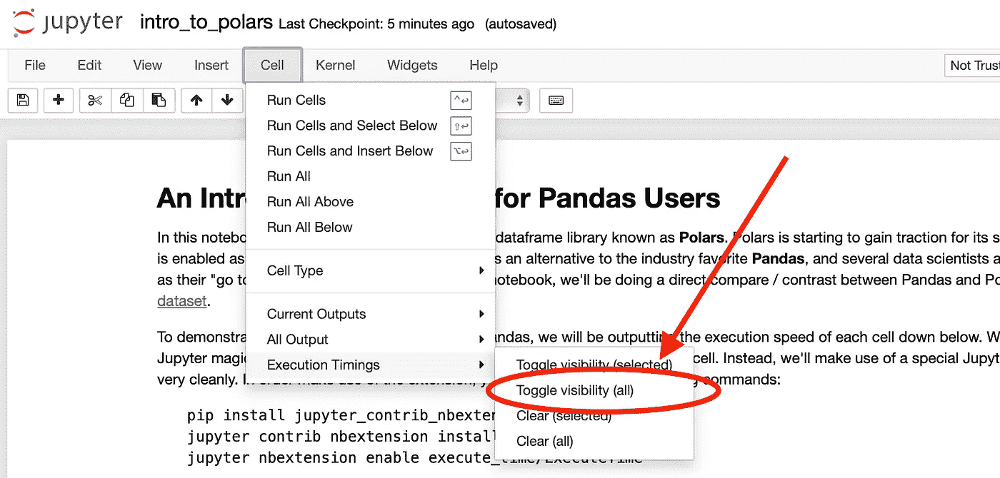

作者捕捉的截图

# 开始使用

在这一部分，我们将展示一些常见命令，许多数据科学家和机器学习工程师在处理任何新数据集时都喜欢先运行这些命令。作为提醒，我们将使用 Titanic 数据集，我已经将其保存为 CSV 文件在一个相邻的目录中。

## 导入 Pandas 和 Polars

当然，我们首先需要适当地导入各自的 Python 库。正如 Pandas 用户所知道的，Pandas 在导入时几乎被别名为 `pd`。同样，Polars 也通常用两个字母 `pl` 作为别名。

```py
# Importing Pandas and Polars
import pandas as pd
import polars as pl
```

## 从 CSV 文件加载数据

在这篇文章中，你会发现 Polars 和 Pandas 有时在做事情的方式上会非常不同，而有时语法则完全相同。幸运的是，这第一次示例中从 Pandas 到 Polars 的语法是完全相同的。下面的代码展示了这种相似性。

```py
# Setting the filepath where I have saved the Titanic dataset locally
TITANIC_FILEPATH = '../data/titanic/train.csv'

# Loading the Titanic dataset with Pandas
df_pandas = pd.read_csv(TITANIC_FILEPATH)

# Loading the Titanic dataset with Polars
df_polars = pl.read_csv(TITANIC_FILEPATH)
```

在继续之前，让我们开始讨论这些库的性能。正如下面的截图所示，Polars 的加载比 Pandas 的加载快了 1 毫秒。透明地说，每次运行这些单元格时我得到的结果不同，但我可以说 Polars 一直比较快。这将是本文中的一个反复出现的主题。

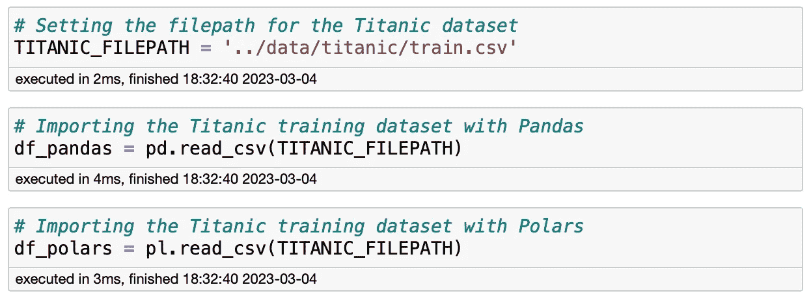

作者截图

## 查看每个 DataFrame 的前几行

在加载 CSV 文件后，我喜欢做的第一件事就是查看 DataFrame 的前几行，以便了解我正在处理的数据。从语法角度来看，Pandas 用户会发现 Polars 的实现完全相同，使用起来非常得心应手。

```py
# Viewing the first few rows of the Pandas DataFrame
df_pandas.head()

# Viewing the first few rows of the Polars DataFrame
df_polars.head()
```

尽管语法相同，但 Pandas 和 Polars 之间的输出有趣地不同，而且大部分情况下，我实际上非常喜欢 Polars 在这里显示的输出。正如你在下面看到的，Polars 直接在每个特征的名称下方显示每个特征的数据类型。此外，基于字符串的列的语法会将值用双引号括起来。我个人非常喜欢这一点，因为 Pandas 对每列的数据类型并不特别明确，尤其是字符串列。Polars 唯一奇怪的地方是，它不会像 Pandas 那样将每行的索引值显示在左侧。需要明确的是，索引值仍然存在，只是没有在此视图中显示。（还要注意，Polars 在这个实例中运行速度是 Pandas 的两倍。）

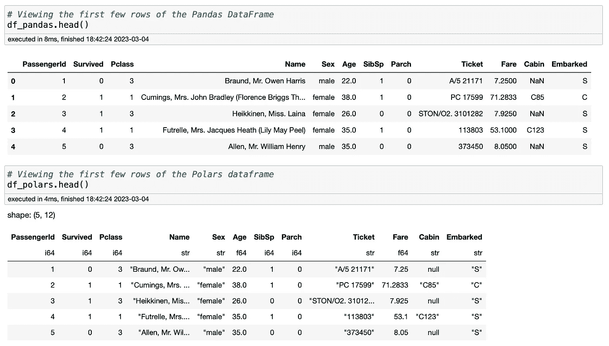

作者截图

## 查看 DataFrame 的信息

到目前为止，这两个库的语法一直相同，但现在我们进入它们在功能上开始大相径庭的部分。Pandas 用户会熟悉两个函数，它们分别展示关于 DataFrame 的信息：`info()` 和 `describe()`。`info()` 显示诸如特征名称、数据类型和空值等信息，而 `describe()` 显示与每个特征相关的一般统计数据，如均值和标准差。以下是 Pandas 代码以及每个函数输出的截图。

```py
# Viewing the general contents of the Pandas DataFrame
df_pandas.info()

# Viewing stats about the Pandas DataFrame
df_pandas.describe()
```

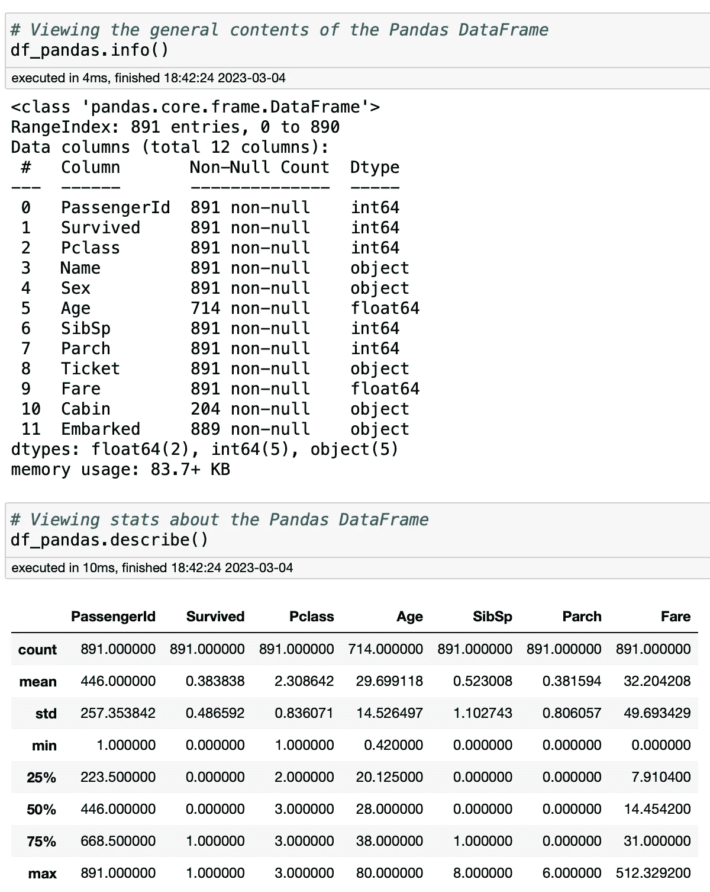

作者截图

在这方面，Polars 与 Pandas 大相径庭。首先，它没有 `info()` 命令。相反，它将 `describe()` 命令进行了一定程度的融合，将我们习惯于看到的 Pandas `info()` 和 `describe()` 函数的输出合并成一个单一的输出。以下是其样子。

```py
# Viewing information about the Polars DataFrame
df_polars.describe()
```

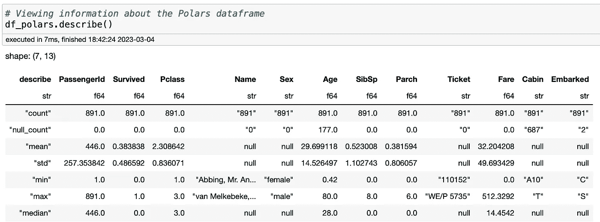

作者截图

说实话，我对这个实现的感受有些复杂。一方面，我认为 Polars 的输出更清楚地显示了空值的数量，因为你需要做一点心理数学来理解 Pandas 输出中的空值数量。但另一方面，Polars 丢失了 Pandas 提供的信息，如四分位数范围值。还要注意，在 Pandas 的 `describe()` 输出中，它合理地排除了基于字符串的列，而 Polars 仍然保留它们。我通常不会在意，但如果你看看“性别”特征的“最小”和“最大”值，例如，它给出了一些……嗯……不太令人愉快的结果！

## 显示特定特征的值计数

另一件我喜欢在开始使用分类数据集时做的事情是查看每个分类特征的值计数。幸运的是，我们回到了 Pandas 用户会熟悉的类似语法，只是你会注意到输出略有不同。

```py
# Viewing the values associated to the "Embarked" column in the Pandas DataFrame
df_pandas['Embarked'].value_counts()

# Viewing the values associated to the "Embarked" column in the Polars DataFrame
df_polars['Embarked'].value_counts()
```

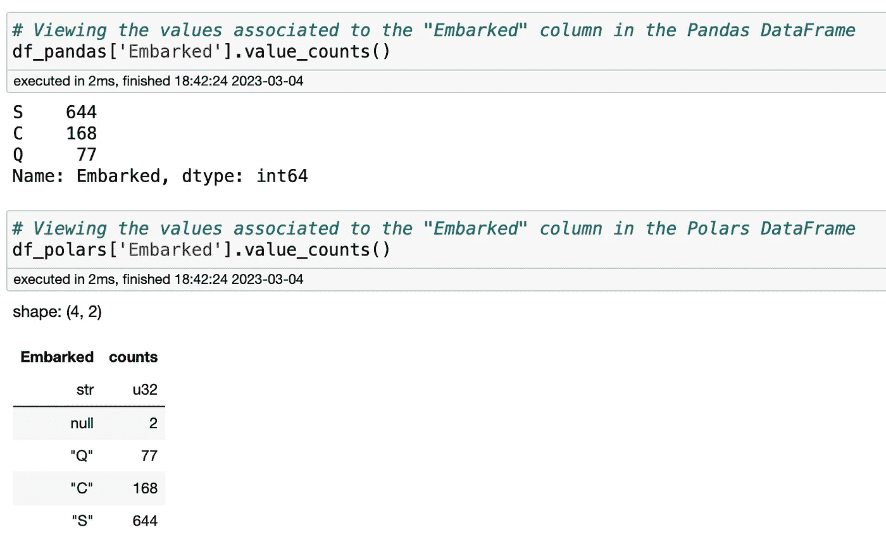

作者截图

正如你所看到的，Polars 的输出实际上更具信息性，因为它包含了空值的数量，而 Pandas 的输出完全没有提到空值。这是一个我必须承认 Polars 绝对胜出的例子。这真的很方便！

# 数据整理

现在我们已经探索了一些非常初步的命令，让我们进入数据整理的更复杂功能。在本节中，我们将探讨一些常见的整理策略，并继续比较 Pandas 和 Polars。

## 获取 DataFrame 的切片

记得我提到过 Polars 在 `head()` 输出中没有显示每行的索引值，但它们仍然存在吗？我们可以通过演示如何获取每个 DataFrame 的切片来证明这一点。幸运的是，Polars 和 Pandas 的语法和输出在这里完全相同。此外，快速查看我们的性能指标，注意到 Polars 执行切片的速度是 Pandas 的两倍。

```py
# Getting a slice of the Pandas DataFrame using index values
df_pandas[15:30]

# Getting a slice of the Polars DataFrame using index values
df_polars[15:30]
```

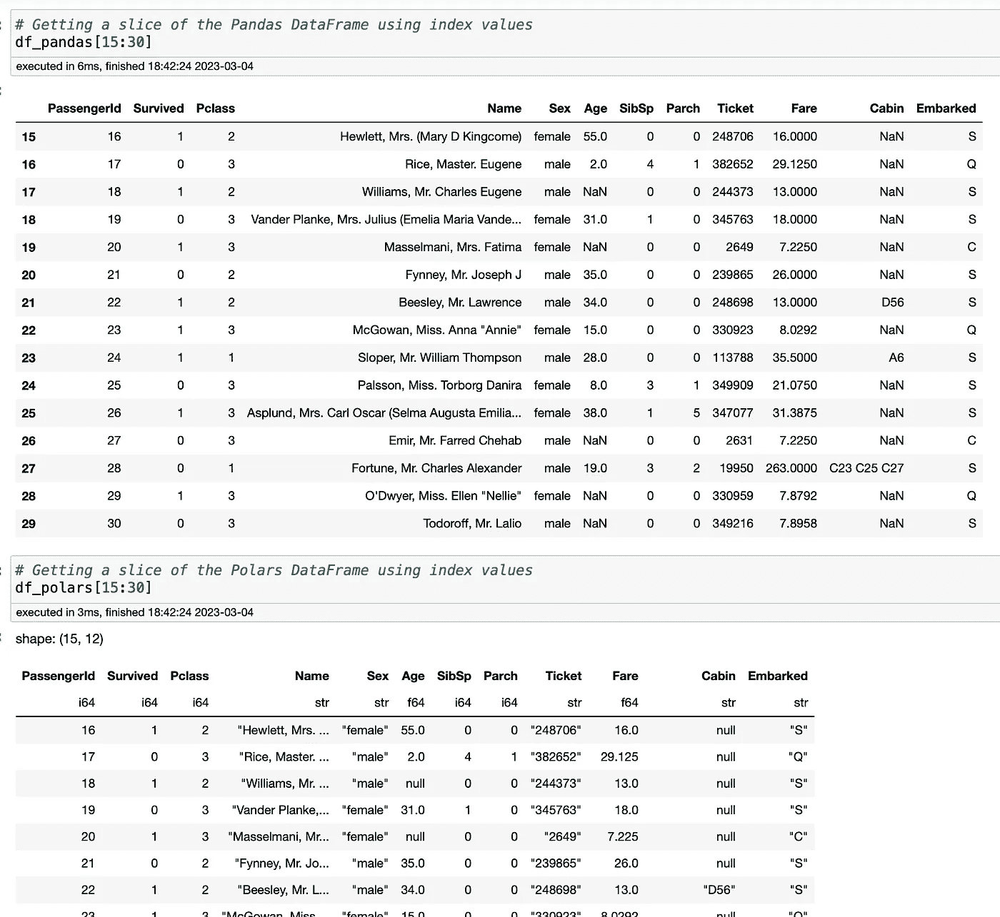

作者截图

## 按特征值过滤 DataFrame

在我们将在这篇文章中展示的所有内容中，这是我们可以以多种不同方式执行相似功能的领域。我不会尝试演示所有方法，因此我选择了以下方式来展示 Polars 如何以略有不同的语法模拟 Pandas 的相似功能。下面是提取所有代表泰坦尼克号上青少年的行的代码。（由于有 95 名青少年，输出有点长，因此我不会显示输出。只需知道输出确实是相同的。）

```py
# Extracting teenagers from the Pandas DataFrame
df_pandas[df_pandas['Age'].between(13, 19)]

# Extracting teenagers from the Polars DataFrame
df_polars.filter(df_polars['Age'].is_between(13, 19))
```

再次，我们可以通过不同的语法在 Pandas 和 Polars 中实现相同的结果。我想强调的是，[官方 Polars 文档](https://pola-rs.github.io/polars/py-polars/html/reference/dataframe/api/polars.DataFrame.filter.html#polars.DataFrame.filter)演示了我上面做的事情，使用了我认为比较奇怪的语法。当我使用`df_polars['Age']`来引用 Polars DataFrame 中的“Age”列时，官方文档推荐使用这种语法：`pl.col('Age')`。输出是完全相同的，所以说哪一种都是对的也未必。你会觉得 Polars 应该尽可能地展示与 Pandas 类似的内容，因为大多数使用 Polars 的人都是 Pandas 用户，正如我成功展示的那样，`df_polars['Age']`的类选择效果很好。这在 Polars 文档中实际上很常见，因此请注意，尽管文档可能说一回事，但你可能可以使用你已经熟悉的更经典的语法。

## 填充 Null 值

到目前为止，我们对 Polars 的体验从中性到积极。遗憾的是，在这个特定的功能上，我们开始进入一些负面领域。在 Pandas 中，用 null 值填充一列是相对简单的，我们甚至可以直接使用`inplace`参数来完成填充。

```py
# Filling "Embarked" nulls in the Pandas DataFrame
df_pandas['Embarked'].fillna('S', inplace = True)
```

不幸的是，Polars 在这里有点奇怪。首先，没有`inplace`参数的等效项，这实际上是 Polars 中一个反复出现的主题，我们稍后会再次看到。此外，Polars 实际上有两个不同的填充 null 值的函数：`fill_null()`和`fill_nan()`。查看每个函数的文档，我诚实地告诉你我不明白为什么选择其中一个而不是另一个。（当然，这可能是我自己的无知。）在下面的代码块中，我使用了`fill_null()`函数，其效果与 Pandas 的`fillna()`相同。

```py
# Filling "Embarked" nulls in the Polars DataFrame
df_polars = df_polars.with_columns(df_polars['Embarked'].fill_null('S'))
```

## 按特征名称分组数据

为了更深入地理解数据，数据从业者通常会将数据分组以了解数据组可能带来的新见解。在这方面，Pandas 用户会非常熟悉`groupby()`函数。不幸的是，Polars 确实也有一个`groupby()`函数，但它的输出却大相径庭。Pandas 用户会发现这种差异很突兀，我坦率地说没有找到使用不同 Polars 语法来模拟 Pandas 输出的方法。（当然，我承认我没有尝试得很认真。😅）见下文，如何用相同的语法在每个库中产生截然不同的结果。

```py
# Grouping data by ticket class and gender to view counts in the Pandas DataFrame
df_pandas.groupby(by = ['Pclass', 'Sex']).count()

# Grouping data by ticket class and gender to view counts in the Polars dataframe
df_polars.groupby(by = ['Pclass', 'Sex']).count()
```

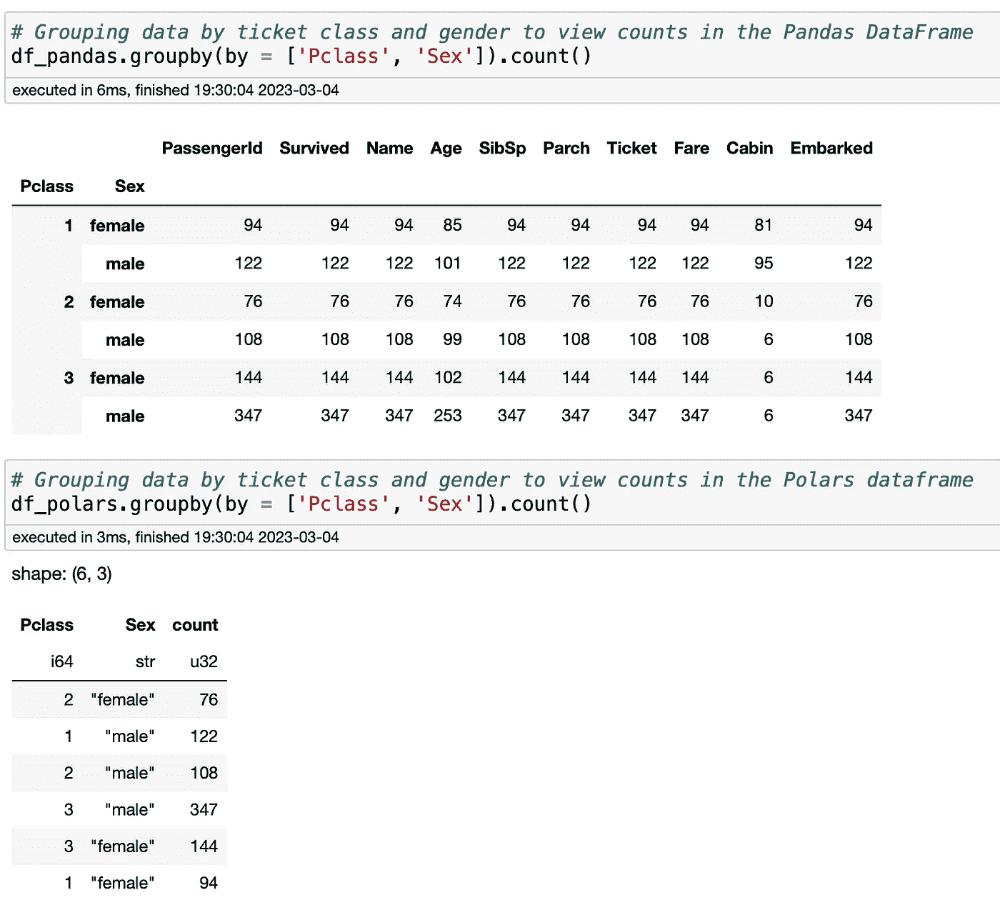

作者截图

# 特征工程

虽然特征工程确实可以被视为数据处理的一种类型，但我决定将其分开成独立的部分，因为它与我过去做的其他工作相关。作为 [GitHub 上这个笔记本](https://github.com/dkhundley/titanic-byoc/blob/main/notebooks/feature-engineering.ipynb) 的一部分，我展示了如何对 Titanic 数据集进行特征工程。我们不会在这一部分覆盖每一个特征工程，但我们会展示一些内容，以便你可以了解这些相同的工作在 Pandas 和 Polars 中的比较。我们将通过使用以下代码从头开始重新加载每个 DataFrame 来重新开始。

```py
# Reloading each DataFrame from scratch
df_pandas = pd.read_csv(TITANIC_FILEPATH)
df_polars = pl.read_csv(TITANIC_FILEPATH)
```

## 删除不必要的特征

在几乎所有你会处理的数据集中，你都会发现一些无关的特征，这些特征在传递给任何机器学习算法之前需要被删除。虽然在 Polars 中这并不困难，但请记住，Polars 的函数没有类似 `inplace` 参数，这样我们就无法就地更新 Polars DataFrame。下面是两种库中删除特征的语法。

```py
# Dropping unnecessary features from the Pandas DataFrame
df_pandas.drop(columns = ['PassengerId', 'Name', 'Ticket', 'Cabin'], inplace = True)

# Dropping unnecessary features from the Polars DataFrame
df_polars = df_polars.drop(columns = ['PassengerId', 'Name', 'Ticket', 'Cabin'])
```

## 对分类特征进行独热编码

还记得我最开始提到我们必须安装 PyArrow 以将我们的 Polars DataFrame 转换为 Pandas DataFrame 吗？好吧，这就是我们必须这么做的第一个实例。我个人更喜欢使用 [Category Encoder 的独热编码实现](https://contrib.scikit-learn.org/category_encoders/onehot.html) 来进行独热编码。为了说明，这里是安装后如何导入它。

```py
# Importing the one-hot encoding object from Category Encoders
from category_encoders.one_hot import OneHotEncoder
```

如果我们使用 Pandas 对“性别”（即性别）特征进行独热编码，以下是语法示例。

```py
# Instantiating One Hot Encoder objects for the Pandas DataFrame
sex_ohe_encoder_pandas = OneHotEncoder(use_cat_names = True, handle_unknown = 'ignore')

# Performing a one hot encoding on the "Sex" column for the Pandas DataFrame
sex_dummies_pandas = sex_ohe_encoder_pandas.fit_transform(X_pandas['Sex'])

# Concatenating the gender dummies back to the original Pandas DataFrame
X_pandas = pd.concat([X_pandas, sex_dummies_pandas], axis = 1)

# Dropping the original "Sex" column in the Pandas DataFrame
X_pandas.drop(columns = ['Sex'], inplace = True)
```

不幸的是，Category Encoder 的 `OneHotEncoder` 并未设置为与 Polars 一起使用。如果我们直接运行以下代码，我们会看到下面截图中的错误。

```py
# Performing a one hot encoding on the "Sex" column for the Polars DataFrame
sex_dummies_polars = sex_ohe_encoder_polars.fit_transform(X_polars['Sex'])
```

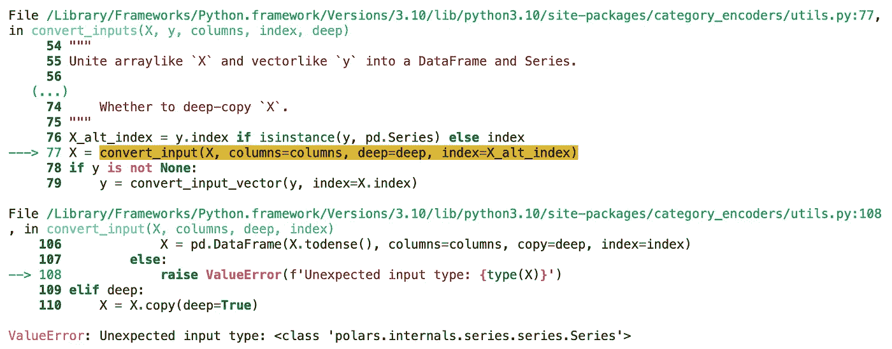

作者截图

有一种解决方法，但不幸的是，这不会是我们第一次遇到类似的破坏性问题。下面是使用 Polars 执行独热编码的完整解决方法。请注意，在将 Polars DataFrame 拟合到 `OneHotEncoder` 对象之前，我们首先需要将其转换为 Pandas DataFrame。然后在转换后，我们可以简单地将其转换回 Polars DataFrame。

```py
# Instantiating One Hot Encoder objects for the Polars DataFrame
sex_ohe_encoder_polars = OneHotEncoder(use_cat_names = True, handle_unknown = 'ignore')

# Performing a one hot encoding on the "Sex" column for the Polars DataFrame
sex_dummies_polars = sex_ohe_encoder_polars.fit_transform(X_polars['Sex'].to_pandas())

# Converting the Polars dummies from a Pandas DataFrame to a Polars DataFrame
sex_dummies_polars = pl.from_pandas(sex_dummies_polars)

# Concatenating the gender dummies back to the original Polars DataFrame
X_polars = pl.concat([X_polars, sex_dummies_polars], how = 'horizontal')

# Dropping the original "Sex" column in the Polars DataFrame
X_polars = X_polars.drop(columns = ['Sex'])
```

最后，请注意，Polars 的 `concat()` 函数的实现与 Pandas 有些不同。Pandas 使用 `axis` 参数来指示如何执行连接，而 Polars 则使用 `how` 和基于字符串的值。我个人更喜欢 Polars 在这里的实现。

## 数值数据分箱

我选择执行“年龄”特征工程的方式是将其分箱为适当的年龄组。例如，13 至 19 岁的人被分类为青少年，而 60 岁以上的人被认为是老年人。Pandas 有一个非常好的函数叫做`cut()`，可以根据你提供的输入正确地进行分箱。这是执行此操作的语法。

```py
# Establishing our bins values and names
bin_labels = ['child', 'teen', 'young_adult', 'adult', 'elder']
bin_values = [-1, 12, 19, 30, 60, 100]

# Applying "Age" binning for the Pandas DataFrame
age_bins_pandas = pd.DataFrame(pd.cut(X_pandas['Age'], bins = bin_values, labels = bin_labels))
```

Polars 确实提供了自己实现的`cut()`函数，但其输出与 Pandas 的差异非常大，以至于我个人觉得无法使用。这是该代码的语法和输出。

```py
# Applying "Age" binning for the Polars DataFrame
age_bins_polars = pl.cut(X_polars['Age'], bins = bin_values)
age_bins_polars.head()
```

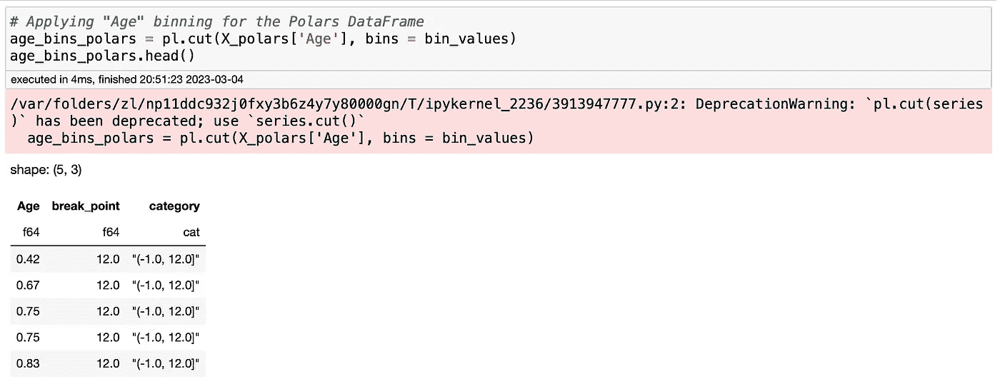

作者捕获的截图

看输出结果，实际上看起来分箱操作确实有效，但它做了一些奇怪的事情。首先，它没有使用我通过`bin_labels`数组建立的语义名称。其次，它没有保持传入函数的行顺序。相反，你可以看到 Polars 的输出现在已经按照从最低值（即最年轻的年龄）开始的升序排序。我相信我可以找到第一个问题的解决方法，但第二个问题使得这个输出对我来说毫无用处。诱惑是将年龄与原始 DataFrame 匹配，但正如你在这个简单的输出中看到的，行 4 和行 5 有相同的`0.75`值。虽然在这个特定用例中可能没问题，但这种做法对不同的数据集可能是危险的。

（注：在我草拟这篇文章时，我从 Polars 0.16.8 升级到 0.16.10，在这个版本中，Polars 的`cut()`函数现在被弃用，取而代之的是使用 Polars Series 实现的`cut()`。似乎这个新实现没有解决问题，在发布时，[一个 GitHub 问题](https://github.com/pola-rs/polars/issues/4286)已被指出请求添加行索引保留。一般来说，这是一个很好的提醒，Polars 仍处于早期阶段！）

# 机器学习中的预测建模

最后的部分将简要介绍，因为不幸的是，这是 Polars 最终对我来说表现不佳的地方，至少在发布这篇文章的时候是这样。类似于我在之前的 Titanic 项目中为特征工程创建 Jupyter 笔记本的方式，我将尝试模拟在[我原来的 Titanic 预测建模笔记本](https://github.com/dkhundley/titanic-byoc/blob/main/notebooks/predictive-modeling.ipynb)中完成的相同步骤。

## 执行训练-测试拆分

任何良好的机器学习实践的标志，下面的代码演示了如何进行训练-测试（或训练-验证）拆分，以保留数据集用于后续模型验证。由于我们将使用 Scikit-Learn 的`train_test_split`函数，这里没有太多需要注意的，因为 Pandas 和 Polars DataFrames 的语法完全相同。我只是想强调，今天这在 Polars 中开箱即用，无需任何特殊的解决方法。 😃

```py
# Importing Scikit-Learn's train_test_split function
from sklearn.model_selection import train_test_split

# Performing a train-validation split on the Pandas data
X_train_pandas, X_val_pandas, y_train_pandas, y_val_pandas = train_test_split(X_pandas, y_pandas, test_size = 0.2, random_state = 42)

# Performing a train-validation split on the Polars data
X_train_polars, X_val_polars, y_train_polars, y_val_polars = train_test_split(X_polars, y_polars, test_size = 0.2, random_state = 42)
```

## 执行预测建模

我们终于来到了 Polars 不幸出错的地方。在下面的代码中，我演示了如何将 Pandas DataFrames 适配到 Scikit-Learn 的随机森林分类器，这应该会在那个漂亮的蓝色框中产生输出。

```py
# Instantiating a Random Forest Classifier object for the Pandas DataFrame
rfc_model_pandas = RandomForestClassifier(n_estimators = 50,
                                          max_depth = 20,
                                          min_samples_split = 10,
                                          min_samples_leaf = 2)

# Fitting the Pandas DataFrame to the Random Forest Classifier algorithm
rfc_model_pandas.fit(X_train_pandas, y_train_pandas.values.ravel())
```

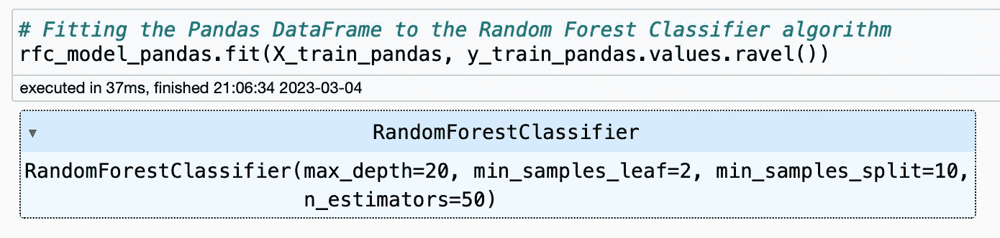

作者捕获的截图

不幸的是，当尝试用 Polars DataFrame 做同样的事情时，我遇到了瓶颈。当我尝试运行下面的代码块时，我收到了下图中的错误。

```py
# Instantiating a Random Forest Classifier object for the Polars DataFrame
rfc_model_polars = RandomForestClassifier(n_estimators = 50,
                                          max_depth = 20,
                                          min_samples_split = 10,
                                          min_samples_leaf = 2)

# Fitting the Polars DataFrame to the Random Forest Classifier algorithm
rfc_model_polars.fit(X_train_polars, y_train_polars.values.ravel())
```

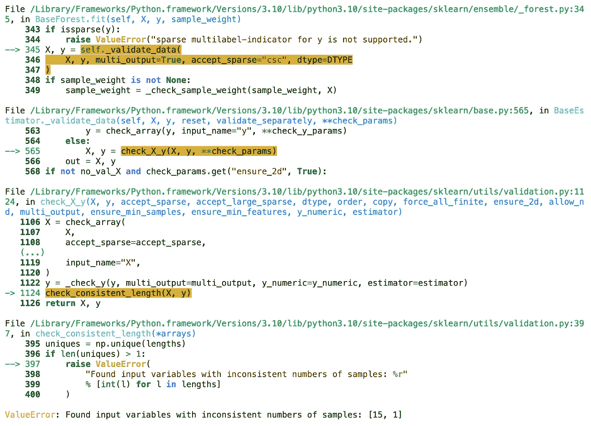

作者捕获的截图

我花了一个小时仔细检查 Scikit-Learn 的源代码，以了解这里发生了什么，但仍然不太确定为什么它无法像 Pandas DataFrames 一样一致地读取 Polars DataFrame 的形状。当运行像 `df_polars.shape` 这样的命令时，它始终显示与相关 Pandas 命令相同的输出。这确实让人困惑。

现在透明地说，Scikit-Learn 是我为此实验尝试的唯一算法库。你可能会在其他算法库如 XGBoost 或 LightGBM 中遇到不同的结果，但老实说，我倾向于相信大多数 — 如果不是全部的话 — 都会有与 Scikit-Learn 相同的问题。（这是一个坦率的天真假设，所以请检查我的工作！😂）

# 结论

一般来说，我对 Polars 的表现非常满意。我们 consistently 看到 Polars 的性能更快，虽然这是一个相对简单的用例，但我可以想象这些性能提升在大规模应用时会显著感受到。我也非常喜欢其他功能，比如使用 `head()` 函数时显示每个特征的数据类型。像这样的细节比预期的更受我们这些人喜欢。

不幸的是，基于目前的状态，我无法推荐 Polars 用于“黄金时间”的机器学习生产场景。（提醒：截至本出版时，最新版本为 0.16.10）。我发现的 `cut()` 函数问题以及无法与 Category Encoders 或 Scikit-Learn 的随机森林分类器集成对我来说都是无法接受的。我想这种障碍在现在习惯使用 Pandas 的许多其他库中也存在。

如果我是一名纯粹的数据分析师，而不是进行机器学习，或许 Polars 可以在那个特定的环境下使用。目前，Polars 遇到的最大麻烦似乎是在尝试与其他库集成时。（这当然不是 Polars 的错！）我能理解数据分析师可能只使用 Polars 而没有其他库，在这种情况下，请小心使用。（小心不要被 `cut()` 陷阱困住！😂）

到头来，我只是非常感激那些优秀的人们致力于让已经很好的东西变得更好。当 Numpy 和 Pandas 最初推出时，相比于普通的 Python，其性能提升是令人惊叹的，甚至让人觉得再也无法更好。然而，Polars 的出现向我们展示了我们可以做得更好。这真是太棒了。感谢 Polars 团队的辛勤工作，我期待着看到 Polars 的发展！🐻‍❄️
