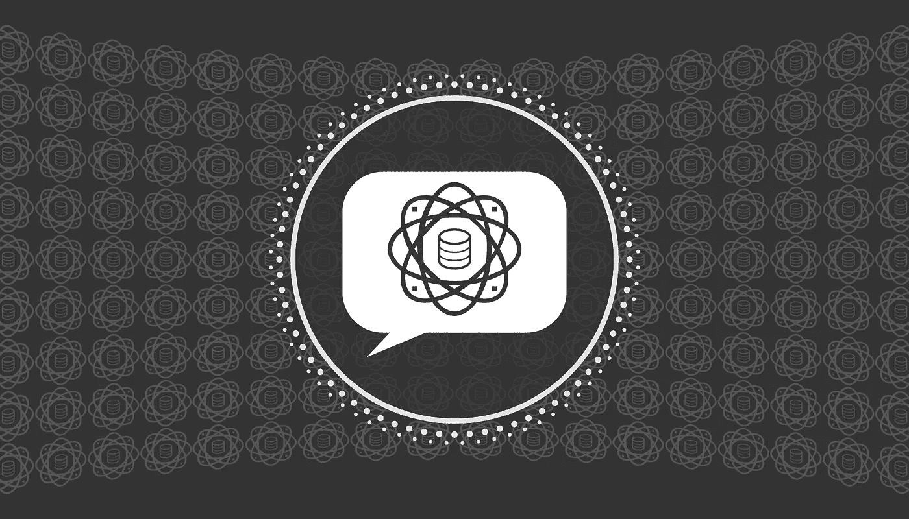

# 对 ChatGPT 等模型如何工作的直观理解

> 原文：[`towardsdatascience.com/an-intuition-for-how-models-like-chatgpt-work-c7f01616bd6d`](https://towardsdatascience.com/an-intuition-for-how-models-like-chatgpt-work-c7f01616bd6d)

## 提供对流行的变换器模型如 ChatGPT 及其他大型语言模型（LLMs）背后思想的直观理解

 [David Hundley](https://dkhundley.medium.com/?source=post_page-----c7f01616bd6d--------------------------------)

·发表于 [Towards Data Science](https://towardsdatascience.com/?source=post_page-----c7f01616bd6d--------------------------------) ·阅读时间 10 分钟·2023 年 12 月 30 日

--

作者创建的标题卡

随着 2023 年的结束，想到生成式 AI 已经对我们的日常生活产生了如此大的影响，真是令人难以置信。自从 2022 年 11 月 ChatGPT 发布以来，这个领域发展如此迅速，以至于难以相信所有这些进展仅仅发生在一年之内。

尽管结果相当惊人，但其背后的复杂性使得很多人公开猜测这些大型语言模型（LLMs）的工作原理。有些人猜测这些模型是从预设的响应数据库中提取信息的，还有人猜测这些 LLMs 已经获得了人类水平的意识。这些都是极端的观点，正如你所猜测的，都是不正确的。

你可能听说过这些**大型语言模型（LLMs）是下一个词预测器，也就是说它们使用概率来确定句子中应该出现的下一个词**。这种理解在技术上是正确的，但对于充分理解这些模型来说，略显抽象。为了建立更强的直觉，我们需要深入探讨。**这篇文章的目的是为商业领袖提供足够深入的理解，以便他们能够做出明智的决策，从而适当地接触生成式 AI，以满足各自公司的需求**。我们将保持在更具概念性和直观的层面，避免深入探讨这些模型背后的复杂数学。

# 理解语言

考虑这个句子：“我喜欢在早晨喝 ______。”你会如何判断如何填补这个空白？大多数合理的人可能会填入咖啡、水或果汁。更搞笑的可能会说啤酒或酸奶，但所有这些不同的选项都集中在一个重要的语境线索上：饮用。这本身就缩小了空白的可能性，但那些理解了整个句子语境的人还注意到“早晨”这个词，从而进一步缩小了语境。换句话说，“饮用” + “早晨” = 一种早餐饮料。

对我们来说，这很简单，因为我给出的短语是英文的，而你大概也是用英文阅读的。但是，如果我们没有直接理解诸如“饮料”和“早晨”这些语境词汇的能力，我们怎么能正确地填补那个空白呢？

这正是计算机面临的困境。计算机对世界没有语义理解，因为在计算机的 CPU 或 GPU 的核心部分，它只是以极快的速度处理一堆一和零。换句话说，它没有直觉去理解天空是蓝色的、早晨是什么，或者比萨饼有多么美味。

所以你可能会想，计算机如何解决这个问题呢？

我实际上通过玩一款新的独立视频游戏[*《塞那尔的咏唱》*](https://youtu.be/__hzPH3tcvA?si=5diH-3hoT179hy7J)来亲身体验了这个概念。在游戏中，玩家控制一个角色，这个角色身处一个人们用可解读的象形文字交流的世界。随着游戏的进行，玩家通过环境中展示的语境线索逐渐适应。例如，你早期学到的两个词是“你”和“我”，这是因为一个非玩家角色（NPC）在说“我”的象形文字时指向自己，而在说“你”的象形文字时指向玩家角色。这非常类似于你想象的历史学家如何将埃及象形文字翻译成更现代的语言。

在这些情况下，单个字符到底是什么并不重要。在*《塞那尔的咏唱》*中，无论玩家说什么语言，你都可以避免学习这种类似象形文字的语言。这些字符是虚构的，重要的是两个方面：**一致性和语境**。接下来让我们深入探讨这些概念。

# 一致性通过排序

你使用单词的**顺序**必须在时间上保持相对一致。在英语中，几乎所有的句子都遵循典型的主谓结构。虽然像西班牙语这样的语言往往根据主语改变动词，但它仍然是一种与英语一样有效的语言。例如，考虑句子“我去商店”。在西班牙语中，这句话翻译为“Me voy a la tienda”。这两种语言使用了不同的单词和略有不同的单词顺序，但都表达了去商店的相同意思。这使得这两种语言都是有效的。

当然，这个相同的原则超越了英语和西班牙语，适用于所有语言，无论是口头还是书面语言。为什么？**单词的顺序比单词本身更重要。**

对于一个以二进制的 1 和 0 操作的计算机来说，这无疑是个好消息。如果单词本身并不重要，那意味着我们可以根据需要重新定义它们。在我们的计算机中，它希望处理数字，因此它将单词转换为数字向量。我们称这个将单词转换为向量的过程为**编码**过程，而我们称这个过程的输出——数字向量——为**嵌入**。

你可能不会感到惊讶，这个简单的编码过程并不新鲜。将单词转化为计算机可以操作的形式从来都不是问题。挑战在于，研究人员不得不花费数十年时间尝试使用不同的数学算法来理解这些嵌入。

不深入细节，这一努力被称为**自然语言处理（NLP）**领域，它有着丰富的历史，我们留待另一天讨论。多年来出现了许多 NLP 技术，许多技术今天在某些场景下仍然有效。实际上，其中一些技术在某些用例中甚至比大型语言模型（LLMs）更有效，使得它们在解决今天的一些问题时仍然值得推荐。

一个重大的自然语言处理突破集中在这个相同的单词顺序一致性的重要性上。2014 年，谷歌的研究人员发现了一种有效地编码句子并随后以特定方式“解码”它以获得有益结果的方法。例如，他们可以将一个英语句子传入这个**编码器-解码器架构**，然后在另一端弹出同一个句子，但用西班牙语表示。他们将这种序列到序列的架构称为**seq2seq**。

记住，我提到过在语言中，两个最重要的特征是一致性（在顺序上）和上下文。seq2seq 有助于解决一致性的问题，但上下文呢？

# 上下文线索

上下文在接下来的几年里仍然是一个棘手的概念，因为早期的编码器-解码器架构，如 seq2seq，并没有很好的管理上下文的方法。研究人员尝试了不同的方法，包括引入了某种有效的**长短期记忆（LSTM）**单元，在这种方法中，神经网络试图保持整个句子的历史上下文。例如，考虑以下句子：“不要让小偷进来，以免他偷走我们所有珍贵的财物和物品。”想象一下如果一个模型记录了这个句子中每个单词的上下文，除了第一个单词。那么你会得到与句子相反的意图！LSTM 旨在通过尽可能多地保留早期上下文来纠正这些错误。从数学上讲，这意味着保留一些数字以代表“长期记忆”，同时对更多的“短期记忆”给予相等或额外的权重。

尽管如此，LSTM 并没有完全解决问题，如果你考虑上下文，你会理解这因为并不是所有的单词都有相等的权重。让我们重新审视一下原始示例，“我早晨喜欢喝 ______。”在这种情况下，最重要的单词是“drink”，它帮助我们填补空白。因此，我们应该给予这个单词更多的权重，或者你可以说，我们应该对这个单词给予更多的**注意**。“注意力”正是谷歌研究人员在他们臭名昭著的 2017 年论文《注意力机制才是你所需要的一切》中提到的。

神经网络中的注意力机制是一个复杂的数学过程，但我们仍然可以在直观层面上理解它。正如我们已经提到的，信息首先通过嵌入过程被**编码**，这样我们就可以对不同的单词序列进行逐一比较。这些信息随后会通过一个**解码器**，生成一个新的单词序列，以响应我们给模型的输入。虽然我们演示了如何输入一句英文并生成西班牙语翻译，我们也可以输入像“伊利诺伊州的首都是什么？”这样的内容，并仍然得到恰当解码的输出：“伊利诺伊州的首都是斯普林菲尔德。”

**记住，注意力机制就是在上下文中对重要单词给予关注，以产生更准确的输出**。这是通过在解码过程中评估一个单词与编码过程中所有单词的相似性来完成的。考虑我们前面段落中的示例。假设解码器模型已经生成了输出：“伊利诺伊州的首都是 _______。”它如何知道如何填补这个最后的空白？它将查看当前解码的单词与编码过程中的所有单词的相似程度。具体来说，它会看到“capital”和“Illinois”之间的强相关性/相似性，从而推导出最可能的答案，在这个例子中是“Springfield”。

当然，你可以想象，为了有效地产生更具普遍性的输出，LLMs 需要大量的示例，这就是为什么我们称它们为“大型”语言模型。一般来说，我们在训练过程中向 LLM 提供的示例（或 **参数**）越多，它预测正确单词的机会就越大。当然，我们简化了这个概念，影响生成 AI 模型输出的因素还有很多细微之处。例如，人们开始发现 **专家混合（MoE）** 模型的有效性，其中“小型”模型在更具体的知识领域进行训练，然后组合以产生更有成效的结果。事实上，有传言称这就是 OpenAI 的热门 GPT-4 在后台工作的方式。

# 处理陷阱与误区

尽管 LLMs 很酷，但它们并不完美，并且不总是产生最正确或最相关的结果。我们将这些自信但不正确的回答称为 **幻觉**，但从技术上讲，将幻觉称为不正确对 LLM 来说是不公平的。请记住，正如我们在本文中探讨这些模型背后的直觉时，我们对如何使用非常复杂的概率方法得出结果有一个大致的了解。**这些模型中没有感知推理；它们只是根据训练过程预测概率。** 你不能真正责怪模型遵循经验推导的概率！

如果你使用不同种类的 LLM，这一点尤其明显。你可能只熟悉 ChatGPT，但如果你尝试足够多的 LLM，你会注意到结果有很大不同。例如，有传言称 ChatGPT 的基础模型 `gpt-3.5-turbo` 是在 700 亿个参数上训练的。现在我们有像 Meta 的 Llama 2 这样的模型，参数数量低至 70 亿，相当于 `gpt-3.5-turbo` 的十分之一。在实践中，这些模型之间的性能差异非常明显。（当然，像 Mistral 这样的较小模型也在不断改进，甚至接近 ChatGPT 的表现！）

模型产生幻觉的倾向应该让企业领导在将生成 AI 应用于业务流程时三思。在这些早期的 LLM 日子里，也许更合适的是包含一个“人工干预”机制，其中人工将生成 AI 用于辅助工作过程，但如果人工认为模型的结果不好，可以“推翻” LLM 的回答。当然，这些模型随着时间的推移会变得越来越好，所以企业领导可能会随着时间的推移放宽一些限制。这将取决于企业的风险承受能力。

此外，应该注意的是，这些大型语言模型可能表现出不公平的偏见，尽管这*并非*意味着这种偏见是故意的。我喜欢把 LLMs 看作是“时代精神机器”。如果 LLMs 是基于高级概率的下一个词预测器，**那么预测的准确性只取决于它在训练时看到的数据**。所以，如果你只用一堆讨论披萨味道糟糕的文本来训练一个 LLM，不要感到惊讶它倾向于对披萨发表负面评论！同样，在线上对 LLMs 表现出不公平偏见的投诉是正确的，但这只是因为训练数据的“时代精神”倾向于这种方式。例如，如果训练数据包含了很多批评某个政治候选人的文章，那么 LLM 对该候选人表现出不公平的偏见也就不足为奇了。相信这种偏见是故意嵌入模型中的是一种误解。

最后，我们应该讨论版权侵犯的问题。因为 LLMs 测量单词之间的高级概率，所以这些 LLMs 能够模拟受版权保护的作品也就不足为奇了。之所以使用“模拟”一词，是因为 LLMs 由于复杂的概率问题无法完整再现受版权保护的作品。因此，我可以让 LLM 像《哈利·波特》系列中的海格或《星球大战》中的贾贾·宾克斯一样与我对话，但它会很难完全再现这些电影剧本中的对话。换句话说，不要指望 LLM 能够充分再现整个《哈利·波特》书系列。这实在太长了，而且这些单词的概率变得过于复杂。

尽管如此，版权侵犯的领域依然混乱，这似乎是那些训练大型语言模型（LLMs）的公司面临的问题，而不是仅仅使用这些模型的公司面临的问题。现在，虽然一个公司在使用他人的 LLM 时仍然应该设法设置防护措施，确保不会故意再现受版权保护的作品，这通过适当的提示工程是可以做到的。但像 OpenAI 这样的公司目前正面临一个法律困境，即是否在最初的训练过程中合法使用了他人的数据。根据这篇文章发布时的情况，[*纽约时报*正在起诉 OpenAI 和微软，指控他们的不当使用了其新闻数据来训练模型](https://fortune.com/2023/12/27/openai-microsoft-new-york-times-lawsuit-ai-copyright-infringement/)。我不是这些法律问题的专家，但观察这些案件将很重要，以了解立法如何影响 LLMs 的未来发展。

生成式人工智能领域是一个极具吸引力的领域，我很期待看到未来这个领域如何持续发展。我们仍处于这场变革的早期阶段，我预期我们将继续看到在采纳、技术演进和法律理解方面的进展。我希望这篇文章能为你提供足够的直觉，以便你能在以适当的谨慎态度接触这一激动人心的领域时做出更明智的决策！ 😃
