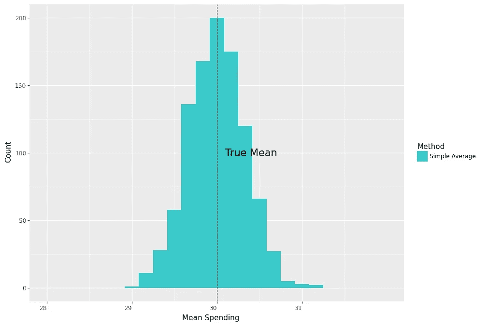
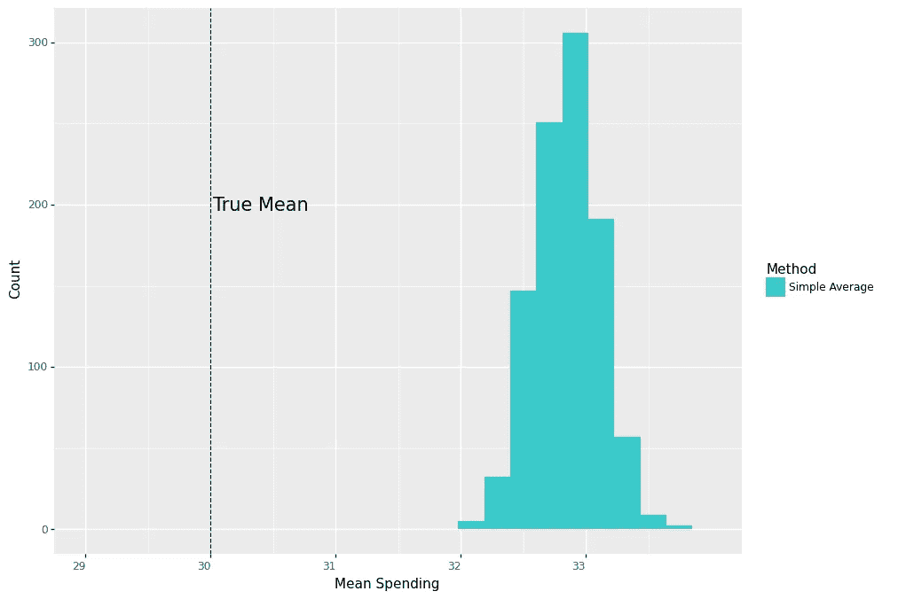
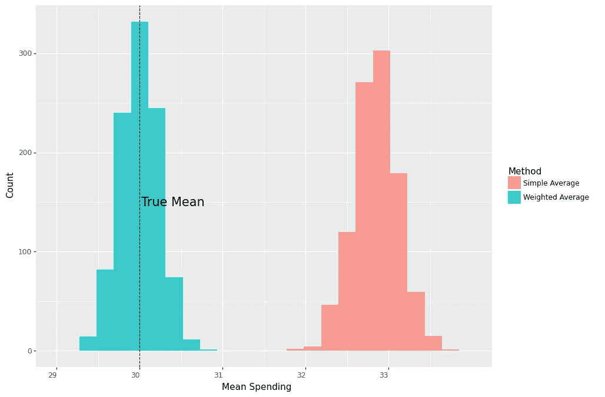
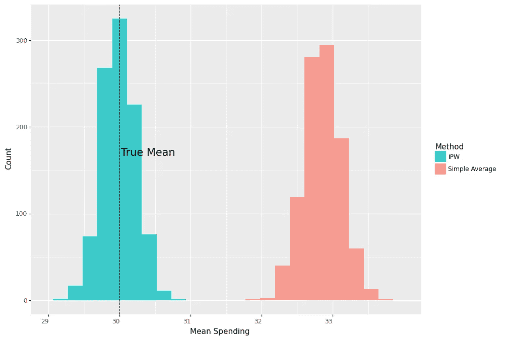
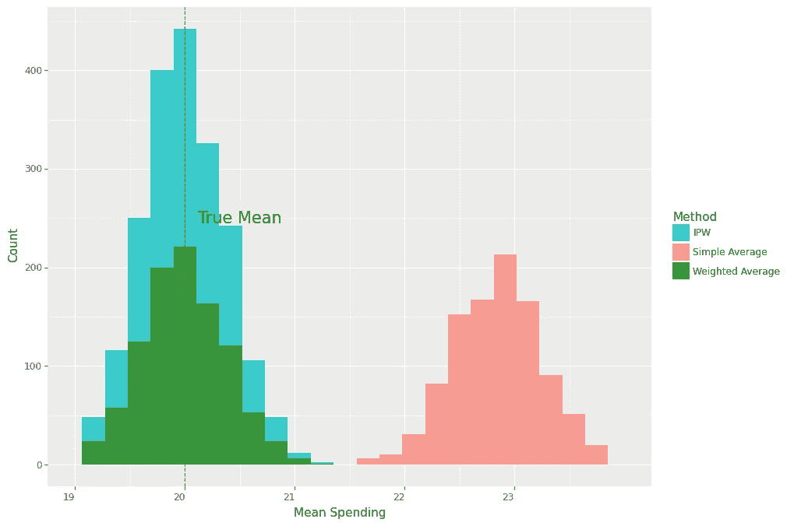

# 逆倾向加权在因果推断中的直观解释

> 原文：[`towardsdatascience.com/an-intuitive-explanation-for-inverse-propensity-weighting-in-causal-inference-459a7e6fa94a?source=collection_archive---------9-----------------------#2023-01-18`](https://towardsdatascience.com/an-intuitive-explanation-for-inverse-propensity-weighting-in-causal-inference-459a7e6fa94a?source=collection_archive---------9-----------------------#2023-01-18)

## 通过一个简单的例子理解逆倾向加权的根源。

[](https://medium.com/@murat.unal?source=post_page-----459a7e6fa94a--------------------------------)[](https://towardsdatascience.com/?source=post_page-----459a7e6fa94a--------------------------------) [Murat Unal](https://medium.com/@murat.unal?source=post_page-----459a7e6fa94a--------------------------------)

·

[关注](https://medium.com/m/signin?actionUrl=https%3A%2F%2Fmedium.com%2F_%2Fsubscribe%2Fuser%2F15a64c9fc55d&operation=register&redirect=https%3A%2F%2Ftowardsdatascience.com%2Fan-intuitive-explanation-for-inverse-propensity-weighting-in-causal-inference-459a7e6fa94a&user=Murat+Unal&userId=15a64c9fc55d&source=post_page-15a64c9fc55d----459a7e6fa94a---------------------post_header-----------) 发表在 [数据科学前沿](https://towardsdatascience.com/?source=post_page-----459a7e6fa94a--------------------------------) ·8 分钟阅读·2023 年 1 月 18 日

--

[](https://medium.com/m/signin?actionUrl=https%3A%2F%2Fmedium.com%2F_%2Fbookmark%2Fp%2F459a7e6fa94a&operation=register&redirect=https%3A%2F%2Ftowardsdatascience.com%2Fan-intuitive-explanation-for-inverse-propensity-weighting-in-causal-inference-459a7e6fa94a&source=-----459a7e6fa94a---------------------bookmark_footer-----------)

图片由 [Diego PH](https://unsplash.com/ko/@jdiegoph?utm_source=medium&utm_medium=referral) 提供，来自 [Unsplash](https://unsplash.com/?utm_source=medium&utm_medium=referral)

一种公认的因果推断方法基于逆倾向加权（IPW）。在这篇文章中，我们将使用一个简单的例子来建立对 IPW 的直观理解。具体而言，我们将看到如何从简单的加权平均推导 IPW，以便在因果评估中考虑不同的处理分配率。

让我们考虑一个简单的例子，我们想要估计进行营销优惠券活动对顾客支出的平均效果。我们在两个商店中运行此活动，通过随机将优惠券分配给现有顾客。假设两个商店的顾客数量相同，而我们不知道的是，处理顾客的支出在商店 1 和商店 2 中分别呈*N(20,3²)*和*N(40,3²)*的分布。

在整个例子中，*Yi*​(1)表示个体在收到优惠券时的支出，*Ti*​=1，而*Yi*​(0)表示他们在未收到优惠券时的支出，*Ti*​=0。这些随机变量称为潜在结果。观察到的结果*Yi*​与潜在结果的关系如下：

我们的估计量，即我们想要估计的内容，是在给定优惠券的情况下的总体平均支出，*E*[*Yi*​(1)]。如果我们在两个商店中随机分配相同数量的优惠券给顾客，我们可以通过简单地平均处理顾客的观察支出来获得这个无偏估计，即 0.5∗$20+0.5∗$40=$30。

从数学上看，这如下所示：

第一个方程是由于潜在结果，最后一个方程则源于随机分配处理，这使得潜在结果与处理分配独立：

## 简单平均

我们定义一个函数，该函数生成 2000 个顾客的样本，随机将其中 50%的人分配到两个商店的处理组，并记录他们的平均支出。我们还将运行一个模拟，该模拟调用此函数 1000 次。

```py
def run_campaign(biased=False):
    true_mu1treated , true_mu2treated = 20 , 40
    n, p , obs = 1, .5 , 2000 # number of trials, probability of each trial, 
                              # number of observations
    store = np.random.binomial(n, p, obs)+1
    df = pd.DataFrame({'store':store})
    probtreat1 = .5

    if biased:
        probtreat2 = .9
    else:
        probtreat2 = .5

    treat = lambda x: int(np.random.binomial(1, probtreat1, 1))\
                   if x==1 else int(np.random.binomial(1, probtreat2, 1)) 

    spend = lambda x: float(np.random.normal(true_mu1treated, 3,1))\
                   if (x[0]==1 and x[1]==1)\
                   else ( float(np.random.normal(true_mu2treated, 3,1) ) )

    df['treated'] = df['store'].apply(treat)
    df['spend'] = df[['store','treated']].apply(tuple,1).apply(spend)

    simple_value_treated = np.mean(df.query('treated==1')['spend'])

    return [simple_value_treated]
```

```py
sim = 1000
values = Parallel(n_jobs=4)(delayed(run_campaign)() for _ in tqdm(range(sim)))
results_df = pd.DataFrame(values, columns=['simple_treat'])
```

以下图表显示了平均支出的分布围绕真实均值集中。



作者的图 1

现在，假设由于某种原因，第二家商店将 90%的优惠券分配给顾客，而第一家商店则分配给 50%的顾客。如果我们忽略这一点，并使用之前相同的方法计算所有处理顾客支出的平均值会发生什么？由于第二家商店的顾客治疗率更高，他们的平均支出在我们的估计中将占据更大的权重，从而导致上升偏差。

换句话说，我们不再有真正的随机实验，因为现在收到优惠券的概率取决于商店。此外，由于两个商店中处理顾客的平均支出也有很大不同，因此顾客所属的商店在因果推断中是一个混杂变量。

从数学上讲，如果我们使用处理顾客的简单平均支出，这次，得到的结果将不是：

我们得到的是：

确实，通过重复模拟和绘制结果，我们看到平均支出的分布现在远离真实均值。

```py
sim = 1000
values = Parallel(n_jobs=4)(delayed(run_campaign)(biased=True) for _ in tqdm(range(sim)) )
results_df = pd.DataFrame(values, columns=['simple_treat'])
```



作者图 2

## 加权平均

然而，一切并未丧失。由于我们知道实验出现了问题，因为商店之间的分配率不同，我们可以通过对处理顾客支出的加权平均进行修正，其中权重代表每家商店中顾客的比例。这意味着，我们可以在考虑商店信息后恢复随机处理分配：

其中 *Xi* 表示顾客 *i* 在商店中的会员身份

并获得我们因果估计量的无偏估计 *E[Yi(1)]*。

数学计算如下：

其中第一个方程是由于迭代期望定律，第二个方程是由于条件独立性。

设 *n1* 和 *n2* 分别表示两家商店中的顾客数量。同样，设 *n1T* 和 *n2T* 表示两家商店中处理过的顾客数量。那么上述估计量可以从数据中计算得出：

确实，如果我们重复之前的抽样过程

```py
def run_campaign2():
    true_mu1treated , true_mu2treated = 20, 40
    n, p , obs = 1, .5 , 2000 # number of trials, probability of each trial, 
                              # number of observations
    store = np.random.binomial(n, p, obs)+1
    df = pd.DataFrame({'store':store})

    probtreat1 = .5
    probtreat2 = .9

    treat = lambda x: int(np.random.binomial(1, probtreat1, 1)) 
                   if x==1 else int(np.random.binomial(1, probtreat2, 1)) 

    spend = lambda x: float(np.random.normal(true_mu1treated, 3, 1)) 
                   if (x[0]==1 and x[1]==1) 
                   else ( float(np.random.normal(true_mu2treated, 3, 1) ) )

    df['treated'] = df['store'].apply(treat)
    df['spend'] = df[['store','treated']].apply(tuple,1).apply(spend)

    simple_value_treated = np.mean(df.query('treated==1')['spend'])

    prob1 = df.query('store==1').shape[0]/df.shape[0]
    prob2 = df.query('store==2').shape[0]/df.shape[0]

    est_mu1treated = np.mean(df.query('treated==1 & store==1')['spend'])
    est_mu2treated = np.mean(df.query('treated==1 & store==2')['spend'])

    weighted_value_treated = prob1*est_mu1treated + prob2*est_mu2treated

    return [simple_value_treated, weighted_value_treated]
```

```py
sim = 1000
values = Parallel(n_jobs=4)(delayed(run_campaign2)() for _ in tqdm(range(sim)) )
results_df = pd.DataFrame(values, columns=['simple_treat','weighted_treat'])
```

我们看到加权平均的平均值再次正好等于真实均值。



作者图 3

## IPW

现在，让我们通过重新编写商店 1 的平均支出来进行一些代数操作：

对商店 2 进行相同操作并将结果代入，我们得到如下：

设商店 1 中处理顾客的比例为

对于商店 2 同样如此，那么我们可以将之前的方程简化为：

其中 *p(Xi)* 是在混杂变量条件下接受处理的概率，也就是 **倾向评分**，

注意，我们从一个加权平均开始，最后得到的只是另一个使用

作为权重。这就是著名的 **逆倾向加权估计量**。

使用这个估计量进行之前的分析

```py
def run_campaign3():
    true_mu1treated , true_mu2treated = 20, 40
    n, p , obs = 1, .5 , 2000 # number of trials, probability of each trial, 
                              # number of observations
    store = np.random.binomial(n, p, obs)+1
    df = pd.DataFrame({'store':store})

    probtreat1 = .5
    probtreat2 = .9

    treat = lambda x: int(np.random.binomial(1, probtreat1, 1)) 
                   if x==1 else int(np.random.binomial(1, probtreat2, 1)) 

    spend = lambda x: float(np.random.normal(true_mu1treated, 3, 1)) 
                   if (x[0]==1 and x[1]==1) 
                   else ( float(np.random.normal(true_mu2treated, 3, 1) ) )

    df['treated'] = df['store'].apply(treat)
    df['spend'] = df[['store','treated']].apply(tuple,1).apply(spend)

    prob1 = df.query('store==1').shape[0]/df.shape[0]
    prob2 = df.query('store==2').shape[0]/df.shape[0]

    simple_value_treated = np.mean(df.query('treated==1')['spend'])

    #estimate propensity score:
    ps1 = df.query('treated==1 & store==1').shape[0]/df.query('store==1').shape[0]
    ps2 = df.query('treated==1 & store==2').shape[0]/df.query('store==2').shape[0]
    df['ps'] = pd.Series(np.where(df['store']==1, ps1, ps2))
    ipw_value_treated = np.mean( (df['spend']*df['treated'])/df['ps'])

    return [simple_value_treated, ipw_value_treated]
```

```py
sim=1000
values = Parallel(n_jobs=4)(delayed(run_campaign3)() for _ in tqdm(range(sim)) )
results_df = pd.DataFrame(values, columns=['simple_treat','ipw_treat'])
```

给我们之前相同的无偏估计。



作者图 4

## 估计平均处理效果

现在，我们的终极目标是了解营销活动产生的平均增量支出，也就是平均处理效果。为了做到这一点，我们还需要估计没有获得优惠券的总体平均支出 *E[Y_i(0)]* 并将其与 *E[Y_i(1)]* 进行比较。我们的估计量现在是：

为此，首先我们对未处理组重复相同的论证，得到 *E[Y_i(0)]* 的无偏估计如下：

最后将它们结合起来估计影响：

现在，让我们将之前的分析扩展到估计活动的影响。假设未处理顾客在两家商店中的支出分布为 *N(10,2²)*，因此活动的真实效果为 0.5*$10 + 0.5*$30 = $20。

```py
def run_campaign4():
    true_mu1treated , true_mu2treated = 20, 40
    true_mu1control , true_mu2control = 10, 10
    n, p , obs = 1, .5 , 2000 # number of trials, probability of each trial, number of observations
    store = np.random.binomial(n, p, obs)+1
    df = pd.DataFrame({'store':store})

    probtreat1 = .5
    probtreat2 = .9

    treat = lambda x: int(np.random.binomial(1, probtreat1, 1)) 
                   if x==1 else int(np.random.binomial(1, probtreat2, 1)) 

    spend = lambda x: float(np.random.normal(true_mu1treated, 3, 1)) 
                   if (x[0]==1 and x[1]==1) 
                   else ( float(np.random.normal(true_mu2treated, 3, 1) ) 
                   if  (x[0]==2 and x[1]==1)   
                                                                                              else (float(np.random.normal(true_mu1control, 2, 1) ) if  (x[0]==1 and x[1]==0)  
                                                                                    else  float(np.random.normal(true_mu2control, 2, 1))     )
    df['treated'] = df['store'].apply(treat)
    df['spend'] = df[['store','treated']].apply(tuple,1).apply(spend)

    prob1 = df.query('store==1').shape[0]/df.shape[0]
    prob2 = df.query('store==2').shape[0]/df.shape[0]

    simple_value_treated = np.mean(df.query('treated==1')['spend'])
    simple_value_control = np.mean(df.query('treated==0')['spend'])

    simple_tau = simple_value_treated - simple_value_control

    est_mu1treated = np.mean(df.query('treated==1 & store==1')['spend'])
    est_mu2treated = np.mean(df.query('treated==1 & store==2')['spend'])

    weighted_value_treated = prob1*est_mu1treated + prob2*est_mu2treated

    est_mu1control = np.mean(df.query('treated==0 & store==1')['spend'])
    est_mu2control = np.mean(df.query('treated==0 & store==2')['spend'])

    weighted_value_control = prob1*est_mu1control + prob2*est_mu2control
    weighted_tau = weighted_value_treated - weighted_value_control

    #estimate propensity score:
    ps1 = df.query('treated==1 & store==1').shape[0]/df.query('store==1').shape[0]
    ps2 = df.query('treated==1 & store==2').shape[0]/df.query('store==2').shape[0]

    df['ps'] = pd.Series(np.where(df['store']==1, ps1, ps2))

    ipw_value_treated = np.mean( (df['spend']*df['treated'])/df['ps'])
    ipw_value_control = np.mean( (df['spend']*(1-df['treated']) )/(1-df['ps'] ))
    ipw_tau = ipw_value_treated - ipw_value_control

    return [simple_tau, weighted_tau, ipw_tau]
```

```py
sim=1000
values = Parallel(n_jobs=4)(delayed(run_campaign4)() for _ in tqdm(range(sim)) )
results_df = pd.DataFrame(values, columns=['simple_tau','weighted_tau','ipw_tau'])
```

如下所示，加权平均数和 IPW 估计器的中心都围绕着真实效应$20，而不控制商店会员的简单平均数的分布则围绕着$23，偏离真实效应 15%。



作者图 5

## 结论

IPW 估计器在因果推断中有着悠久的历史。这篇文章的目标是通过一个简单的例子来培养对这一著名估计器的直觉。通过一个营销案例，我们看到该方法的标志性特征是纠正不平等的处理分配机制。此外，我们还展示了该方法是加权平均估计器的扩展。

## 参考文献

[1] 理查德·K·克朗普，V·约瑟夫·霍茨，圭多·W·因本斯，奥斯卡·A·米特尼克。[处理有限重叠以估计平均处理效应。](https://academic.oup.com/biomet/article-abstract/96/1/187/235329?redirectedFrom=fulltext&login=false)（2009 年），*Biometrika*。

[2] 斯特凡·瓦格尔，[Stats 361: 因果推断](https://web.stanford.edu/~swager/stats361.pdf)（2020 年春季），*斯坦福大学*。

## 代码

该分析的代码可以在我的 GitHub [仓库](https://github.com/muratunalphd/Blog-Posts)中找到。

> 感谢阅读！
> 
> 我的目标是记录自己的学习，并与可能觉得有用的他人分享。如果您发现任何错误或有任何评论/建议，请告知我。
