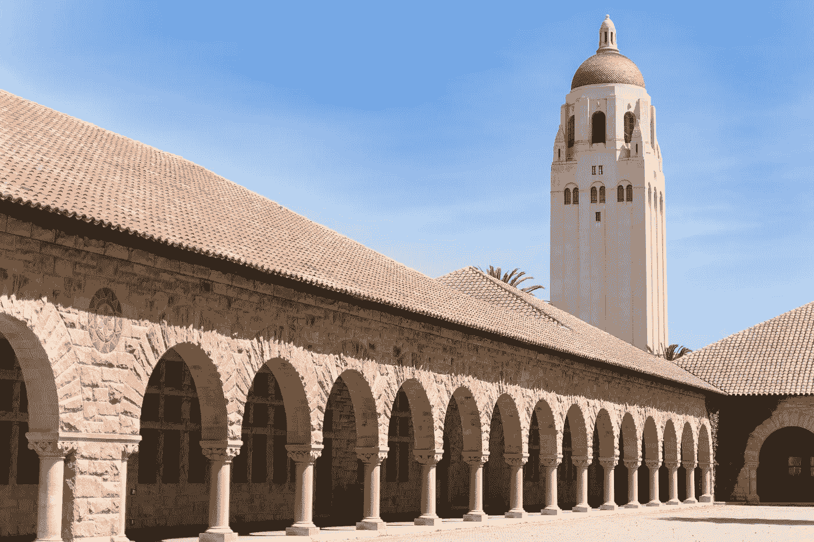

# 赠献给我的物理学博士学位。

> 原文：[`towardsdatascience.com/an-ode-to-my-physics-ph-d-718894196f91?source=collection_archive---------3-----------------------#2023-07-18`](https://towardsdatascience.com/an-ode-to-my-physics-ph-d-718894196f91?source=collection_archive---------3-----------------------#2023-07-18)

## 关于五年物理学与向机器学习过渡的感想

 [Jacob Marks, Ph.D.](https://medium.com/@jacob_marks?source=post_page-----718894196f91--------------------------------)

·

[关注](https://medium.com/m/signin?actionUrl=https%3A%2F%2Fmedium.com%2F_%2Fsubscribe%2Fuser%2Ff7dc0c0eae92&operation=register&redirect=https%3A%2F%2Ftowardsdatascience.com%2Fan-ode-to-my-physics-ph-d-718894196f91&user=Jacob+Marks%2C+Ph.D.&userId=f7dc0c0eae92&source=post_page-f7dc0c0eae92----718894196f91---------------------post_header-----------) 发表在 [Towards Data Science](https://towardsdatascience.com/?source=post_page-----718894196f91--------------------------------) · 10 分钟阅读 · 2023 年 7 月 18 日

--

图片来自 Unsplash。

一年前，我进行了博士论文答辩。由于房间四周都是窗户，大家习惯称之为“鱼缸”，让路过的人可以窥视进来。那天是星期五下午 4 点，这是我所有委员会成员唯一能参加的时间。经历了不可避免的视听设备故障后，我向朋友、家人和物理学家们展示了大约一个小时的内容，主题是**“对称保护拓扑的惊人持久性”**。然后，我与答辩委员会进行了简短的私人会议，深入探讨了我研究项目的技术细节，以检验我对研究的理解深度。5:30 时，我带着物理学博士学位走出了房间。

我平静地走下两层楼，走到外面，迎接到一个晴朗明亮的周五下午的帕洛阿尔托，发现我的父母和最好的朋友在等待祝贺我，并送上香槟。我的平静外表崩溃了，我开始哭泣。

那一天——那一刻——代表了一个顶点。它是五年的课程、教学和研究的高潮；是艰难地解读难以理解的方程式的漫长日子和回应评审报告问题的漫长夜晚；是无数次的*啊哈！*时刻，其中大多数结果都是错的；以及对我是否能够完成的无处不在的恐惧。

站在斯坦福大学杜兰德大楼的露台上，与我的父母、室友和伴侣在一起，我充满了喜悦、感激，尤其是释然。至少在那一刻，我可以暂时抛开自我怀疑和无尽的存在恐惧。在那短暂的一刻，我可以为自己感到自豪。

同时，这一刻无疑是甜中带涩的：它标志着我在物理学上投入的时间的结束。我不知道博士后生活会给我带来什么，但我知道物理学将不再是一个指导力量。

斯坦福校园，我在这里完成了我的物理学博士学位。图片由 Unsplash 提供。

在开始攻读博士学位之前，我就知道学术界不是我的道路。在我的物理学新生群体中，这是一个相当特殊的情绪。现在，我的大多数同学已经毕业，其他人也离开了学术界。但对大多数人来说，这并不是他们最初的意图。从一开始，我就决定在获得学位后进入工业界。实际上，这也是我选择在旧金山湾区攻读研究生学位的*原因*！

我知道这一天会到来。但我并没有准备好面对现实。

物理学一直是我生活的一部分。我的许多决策都受到对对称性、秩序、普遍性和涌现等概念的痴迷驱动。

这种痴迷使我在本科时学习了物理学、数学和哲学（顺便说一下，这意味着我拥有物理学和哲学的学士学位，以及物理学的博士学位，我总觉得这很有趣！）；与斯蒂芬·沃尔夫拉姆在沃尔夫拉姆研究所合作；并攻读凝聚态物理理论博士学位，这是物理学的一个子领域，关注秩序与对称性之间的相互作用如何导致新的物质相。

更重要的是，多年来我一直把自己视为*物理学家*。物理学不仅仅是我学习的学科或我发现无尽迷人的理念的伞；它是我身份的一部分。物理学影响了我处理新问题的方式以及我与物理现实互动的方式。它塑造了我看待世界和我在其中的位置的方式。

对许多有志于成为物理学家的人来说，博士答辩标志着他们的出现。虽然它可能有些过时，但博士学位作为学术界成员的证明；验证了在学科内容、主题和细节上的多年“训练”已见成效。

对我来说，这一刻也意味着一次离别。我正在离开物理学，在接下来的几个月里，我将面临从“物理学家”到“正在恢复的物理学家”的身份危机。

在接下来的一个月里，我花了很多时间在互联网上搜索，包括个人和职业网络内外，寻找那些最近从理论物理学转型到行业的人。我联系了我能找到的所有人，涵盖了不同的行业、角色和职业阶段，对大多数人的热情和响应感到惊喜。

更大的惊讶来自于听他们的故事。我与之交谈的大多数在行业中的前物理学家在博士毕业五年后对自己职业的现状感到满意——有些人甚至更早。但是，在反思他们的经历时，每个人表达的主流情感是挫折、失望、谦逊和遗憾的结合。

在物理学中，常常会被告知*从*物理学开始，你可以做*任何*事。人们看到一个前量子物理学家在金融行业；一个来自 CERN 的研究员现在是科技公司 AI 研究的负责人；一个曾经的弦理论学家现在伪装成海洋学家，他们认为物理学让你为一切做好了准备，一次性地。不过，“他们”并不是错的，但这个画面具有误导性。

当然，到处都有前物理学家。的确，“物理思维”是许多职业的宝贵基础。然而，从我自己的经历以及与他人的对话来看，我认为这更多是关于*物理*给予个人的，而不是*吸引*到物理学的*人*。

无论你尝试转型到哪个领域，都有一些人花费多年时间研究和磨练他们的技能。物理学不能替代技能，当然也不能替代知识。事实上，没有任何东西能替代时间的投入。结果证明，大多数公司雇佣的是技能——特别是在经济衰退期间。

这里就是前面提到的谦逊之处。尽管在声誉卓著的期刊上发表了论文，沉浸于大量的数学方程式中，并学会了如何应对模糊的研究问题，但许多进入行业的物理学家在找工作时遇到了困难。

图片由 Unsplash 提供。

一位朋友告诉我他为找工作而努力了六个月，在这段时间里，他申请了超过一百个职位，最后才收到一个录用通知。还有人对只被邀请面试的职位感到羞愧，这些职位远低于他们的教育水平。当他们开始工作时，许多人对自己在攻读博士学位之前就能胜任这些工作的能力感到沮丧。

为了成功，我一遍又一遍地听到，你必须从头开始。一位曾经是弦理论学者的朋友在从事机器学习的工作时总结了一句话：

> “我不认为自己是物理学家。我回顾在物理学中的时光就像一场模糊的梦。”

当我开始认真申请工作时，在大规模裁员和招聘冻结的背景下，我感受到的主要情绪是焦虑和沮丧，并夹杂着自我厌恶的情绪。

我对气候科技感兴趣，但所有看起来有趣的职位要么因为经济前景被裁撤，要么是我不具备资格的职位。

我也对机器学习感兴趣，而这是一个似乎不受招聘冻结影响的领域，所以我决定将精力集中在这里。我对 Leetcode 问题、脑筋急转弯或白板问题没有问题，因此当我能获得面试时，我通常能进入最终轮。但我一直收到拒绝，因为我的软件工程技能不够强。回顾这一点，我完全理解他们的意思，以及为什么我没有收到这些录用通知。

我开始焦虑自己找不到工作。我对求职过程越来越感到沮丧。同时，我对自己感到不满，因为我把自己放在了这种位置上，花了五年时间攻读一个我并不打算继续从事的领域的博士学位。我本可以做*任何*事，但我选择了研究对称性、拓扑学和涌现。

我已经不再称自己为物理学家，但我还没有找到可以取代它的身份。当然，通过职业来定义自我本身就是一个问题——这是我至今仍在努力解决的。

在十月，就在我的焦虑开始转变为绝望时，情况有所好转。我迅速收到了一些来自重视我非传统经验和技能的公司的录用通知。

Leap of faith. 图片由 Unsplash 提供。

我很幸运在一家令人惊叹的 A 轮创业公司 Voxel51 找到了归宿，在那里我接受了机器学习工程师兼开发者关系传播者的职位。Voxel51 团队给了我一个机会——尽管我的软件工程经验和机器学习接触有限，他们还是聘用了我作为机器学习工程师；尽管我对开发者关系的概念还很陌生，他们还是让我加入了他们的开发者关系工作！

回顾过去，我认为[Voxel51](https://voxel51.com/)为什么聘用我，以及为什么这个职位取得成功，归结起来有三个原因：

1.  **使命对齐**：Voxel51 的使命是为世界的数据带来清晰和透明。近十年来，我一直努力使物理学中的概念、思想和研究结果变得可及（个人博客、耶鲁科学杂志、物理世界等）。物理本身是不可转移的，但我努力的精神与公司的使命紧密对齐。

1.  **学习是核心**：作为开发者推广员的一部分，持续学习和探索新技术是非常重要的，而机器学习如今发展如此迅速，以至于*每个人*都需要不断学习以保持与时俱进。因此，学习曾经是（并且仍然是！）这份工作的核心组成部分。通过与 Voxel51 的合作，我和 Voxel51 成功地将一个潜在的弱点（知识的空白）转化为优势，通过创建源自我经历的教育内容！

1.  **创业公司思维**：当大型公司招聘时，他们通常寻找能够完成非常具体任务的人。因此，他们会寻找具备非常特定技能和经验的人。在创业公司中，每个人都必须身兼多职，个人可以创造价值的方式有很多。这并不总是那么明确，但通常来说，我发现具有非传统技能集——包括博士学位的人——在灵活、常常模糊不清和不断变化的创业环境中能够蓬勃发展。

我在 Voxel51 待了将近九个月，已经学到了很多东西。我学习了软件工程、计算机视觉和生成性 AI；我还学习了市场营销、开发者关系和社区管理。我还学到了很多关于自己的事情：哪些类型的工作让我感到兴奋，我如何与他人合作，以及如何平衡工作与生活（仍在进行中）。在过去的一年里，我学到的知识与研究生阶段的任何一年一样多。我仍然在不断学习！

距离物理博士学位已经过去一年，心中的怨恨终于开始减退。我曾因为花费五年时间进行物理研究而对自己非常不满，以至于忽视了更大的图景。我并不是为了职业发展才攻读物理博士学位。我选择攻读博士学位是因为我热爱物理，并且我想有机会深入探索关于我们宇宙的基本问题。能够做到这一点是一种奢侈——对此我深感感激。

我感激我的导师资助我，并允许我从事我感兴趣的项目，也感激我从博士后和教授那里获得的指导。我发表了经过同行评审的论文，为庞大的科学知识体系做出了（即便是微不足道的）贡献。我对物理学有了更深刻、更广泛的理解。我还结识了许多在物理学及其他领域做出杰出工作的酷人。

我还非常感激许多间接源自攻读物理学博士学位的经历。我在 Google X 担任了博士量子研究员的实习；我加入了《Physics World》成为学生撰稿人；我第一次真正体验了创业；我与最好的朋友们一起生活了三年；我还遇到了我的伴侣。

我仍然把自己看作是一个正在恢复中的物理学家，但现在我也看到了我带走了什么。曾几何时，学习物理学是我的梦想，而我实现了这个梦想。我将永远热爱物理学。

我进入了职业生涯的新阶段，并且也喜欢我现在的工作。我离开物理学的时间越长，我对更广泛的主题和观点的兴趣就越浓。我发现自己被追求卓越、学习过程本身以及对真实、可触及影响的渴望所吸引。

不必永远做物理学家也没关系。拥有一个新的梦想也没关系。

谢谢你，物理学。

永远属于你的，

雅各布

雅各布·马克斯

斯坦福大学物理学博士‘2022
