# 2024 年 Microsoft Fabric 概述

> 原文：[`towardsdatascience.com/an-overview-of-microsoft-fabric-going-into-2024-cd51a18c07b5`](https://towardsdatascience.com/an-overview-of-microsoft-fabric-going-into-2024-cd51a18c07b5)

## Microsoft Fabric 在 2024 年能带来什么？

 [Eirik Berge, PhD](https://medium.com/@ebbeberge?source=post_page-----cd51a18c07b5--------------------------------)

·发表于 [Towards Data Science](https://towardsdatascience.com/?source=post_page-----cd51a18c07b5--------------------------------) ·17 分钟阅读·2023 年 12 月 31 日

--

图片来源 [Ricardo Loaiza](https://unsplash.com/@rickpekar?utm_source=medium&utm_medium=referral) 在 [Unsplash](https://unsplash.com/?utm_source=medium&utm_medium=referral)

# 概述

1.  介绍

1.  什么是 Microsoft Fabric？

1.  Microsoft Fabric 的主要组件

1.  使用 Microsoft Fabric 的 3 个优点

1.  使用 Microsoft Fabric 的 3 个缺点

1.  你应该更改吗？

1.  总结

# 介绍

[Microsoft Fabric](https://www.microsoft.com/en-us/microsoft-fabric) 被微软宣传为一个**全面的数据分析、数据工程和人工智能平台**。它在 2023 年春季以预览形式推出，并于 2023 年 11 月[正式上市](https://www.microsoft.com/en-us/microsoft-fabric/blog/2023/11/15/prepare-your-data-for-ai-innovation-with-microsoft-fabric-now-generally-available/)。该平台基于现有服务如 [Azure Synapse Analytics](https://azure.microsoft.com/en-us/products/synapse-analytics)、[Azure Data Factory](https://azure.microsoft.com/en-us/products/data-factory)、[Azure Data Lake Gen 2](https://learn.microsoft.com/en-us/azure/storage/blobs/data-lake-storage-introduction)、[Microsoft Purview](https://azure.microsoft.com/en-us/products/purview) 和 [Power BI](https://www.microsoft.com/en-us/power-platform/products/power-bi) 的功能。

在这篇博客文章中，**我想给你提供一个关于 Microsoft Fabric 平台进入 2024 年的高层次概述**。具体来说，我想回答以下问题：

+   Microsoft Fabric 涵盖了数据生命周期的哪些部分？

+   Microsoft Fabric 中的每个组件试图实现什么？

+   使用 Microsoft Fabric 的优点和缺点是什么？

+   你是否应该考虑迁移到 Microsoft Fabric？

我对 Microsoft Fabric 的经验来自于我参加的**为期四天的 Microsoft 深度课程**以及在过去几个月中对 Microsoft Fabric 的实验。我还广泛使用了 Microsoft Fabric 所借鉴的工具。然而，我**与微软没有关联**，从未因过度宣传或低估 Microsoft Fabric 而获得经济利益。基于这些，我可以提供一个客观的 Microsoft Fabric 概述。

正如你从博客的其余部分可以看出，我认为**Microsoft Fabric 为统一数据平台提供了一些真正有用的功能**。然而，像其他所有事物一样，是否迁移到 Microsoft Fabric 还将取决于许多因素。

# 什么是 Microsoft Fabric？

让我们尝试了解一下 Microsoft Fabric 以及它试图实现的目标。

**Microsoft Fabric 是一个全面的数据和分析平台，处理从数据收集阶段到分析阶段的所有数据。** 这包括数据存储、数据管道、数据警报、数据血缘、数据治理、AI 功能、Power BI 集成等。该平台基于之前的微软服务，将许多现有功能整合到一个包中。

根据微软的说法，Microsoft Fabric 有四个重点领域，这些领域塑造了其目标和试图实现的目标：

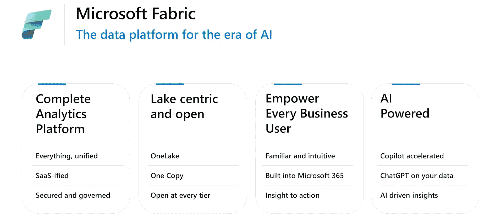

来自微软公开学习资料的图片

## 完整的分析平台

Microsoft Fabric 平台是一个成熟的生态系统，旨在为数据和分析平台提供所需的完整解决方案。

大多数数据平台，如 Databricks 和 Azure Synapse Analytics，都是基于 PaaS（平台即服务）的，供应商处理操作系统、维护和工作负载分配等事宜，而用户则控制代码和数据。Microsoft Fabric 自我定位为 SaaS（软件即服务）平台，供应商在代码和配置方面承担更大的角色。这通过更多地关注低代码工具如 Azure Data Factory、Azure Data Activator 和 Power BI 来实现，正如我们将看到的那样。

我认为将 Microsoft Fabric 称为 SaaS 平台有些牵强。对于大规模项目，仍然需要编写代码，无论是 Spark、SQL 还是 Python。然而，Microsoft Fabric 平台确实在朝着 SaaS 数据平台的方向迈出了一步，通过更依赖低代码/无代码工具来实现。

Microsoft Fabric 还通过先前在 Microsoft Purview 服务中提供的功能强调治理和安全。这包括通过将数据分组到域和工作区来保护数据所有权。它还包括通过数据目录和数据血缘提供可见性，使解决方案可扩展，同时不会完全失去对可用数据及其受众的跟踪。

## 以湖泊为中心且开放

Microsoft Fabric 使用 OneLake，承诺简化数据存储、维护和数据复制。

> OneLake 是为整个组织设计的单一、统一、逻辑数据湖——Microsoft 文档

OneLake 建立在大多数 Azure 用户都有经验的 Azure Data Lake Gen 2 基础上。它被设计成一个统一的数据存储中心，而不是为组织中的不同分支和团队设置多个数据湖。因此，你可以在 Microsoft Fabric 租户中拥有一个且仅有一个 OneLake。数据的所有权通过像**工作区**和**域**这样的组织功能在 OneLake 内部进行处理。

OneLake 支持任何文件格式，无论是结构化的还是非结构化的。然而，它对 Delta Parquet 格式略有偏好，因为 Fabric 中的任何数据仓库或湖仓默认以此格式存储数据。

OneLake 使用**快捷方式**，这一功能模拟了我们在本地机器上熟悉的快捷方式。快捷方式用于共享数据而不会出现数据重复的问题。拥有正确权限的用户可以在工作区之间以及到外部服务如 AWS 的 S3 存储和低代码 Power Platform 的 Dataverse 存储之间创建快捷方式。

## 赋能每一个业务用户

Microsoft Fabric 的用户界面对 Power BI 用户非常熟悉，对来自不同数据平台的大多数人来说也很直观。这允许分析方面的业务用户在数据存储和数据转换的管理中发挥更大的作用。

Microsoft Fabric 还非常努力地与业务用户喜爱的两个其他平台集成——Power Platform 和 Microsoft 365。这两种集成都允许业务用户更接近数据，并与数据工程师和数据科学家更无缝地协作。

## AI 驱动

最终，Microsoft Fabric 平台以不同方式集成了 AI。其中一个方面是结合 LLM（大型语言模型），如 GPT 模型和 Microsoft Copilot，以加快开发过程。这些工具开始被大量集成到平台中。如果这种集成成功，这将是 Microsoft Fabric 的一个主要卖点。

AI 也以另一种方式来到 Microsoft Fabric。现在你可以训练机器学习模型，进行实验、保存和部署模型。这似乎是基于 Microsoft 从 Azure Machine Learning 服务中获得的经验，在那里这些功能已经存在一段时间。因此，尽管在 Microsoft Azure 的整体范围内这不是新功能，但它与 Microsoft Fabric 中的数据工程任务紧密结合则是新颖的。

在 Azure Synapse Analytics 中，没有可用于机器学习的强大功能。像 Databricks 这样的其他平台已经将 ML 与数据工程结合了相当长的时间。因此，在这方面，微软正在赶上现代数据和分析平台的期望。

# Microsoft Fabric 的主要组件

微软的以下插图突出了构成 Microsoft Fabric 平台的各个组件。我们简要了解一下它们。

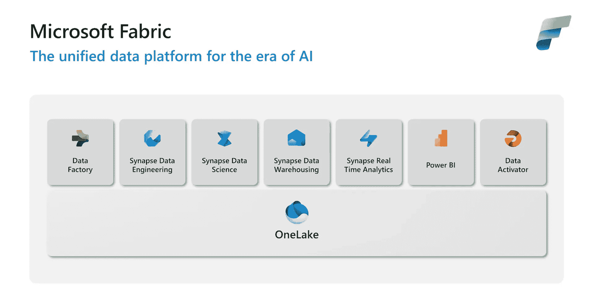

微软公开的学习材料中的图像

## OneLake

我已经稍微谈了一下 OneLake，但想要再深入探讨一下。如下图所示，OneLake 作为其他组件的共同基础。

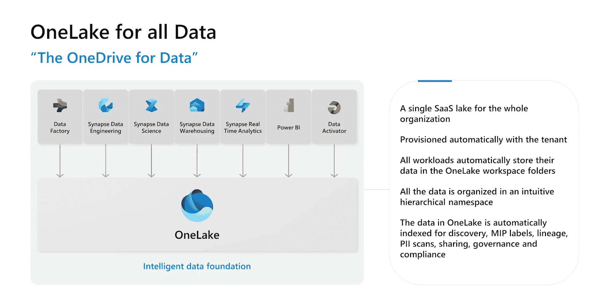

微软公开的学习材料中的图像

这些组件的工作负载会自动将数据存储在 OneLake 工作区文件夹中。然后，OneLake 中的数据会被索引以实现多种用途。其中之一是数据血缘，可以追踪数据集上应用了哪些转换。另一个是 PII（个人身份信息）扫描，可以突出显示敏感信息。

我个人认为 OneLake 最大的优势之一是透明性。在像 Azure Synapse Analytics 这样的平台中，大家很难跟踪哪些数据可用以及对数据应用了哪些转换。数据分析师可能会获得访问 Azure Data Lake Gen 2 存储的权限，以获取用于可视化的完成数据。但他/她对数据在这种形式下所应用的转换了解不多。尽管可以通过 Microsoft Purview 处理这个问题，但这有点麻烦。默认的透明性是一个我认为不会成为头条新闻但对更好协作至关重要的特性。

## Data Factory

Data Factory 是 Azure 生态系统中的一个现有服务，已被纳入 Microsoft Fabric 平台。该工具用于连接到数据源，如数据库、Kafka 等流系统、SharePoint 中的文档以及其他大量来源。然后，你可以编写数据管道以简化数据转换步骤并自动化管道管理。

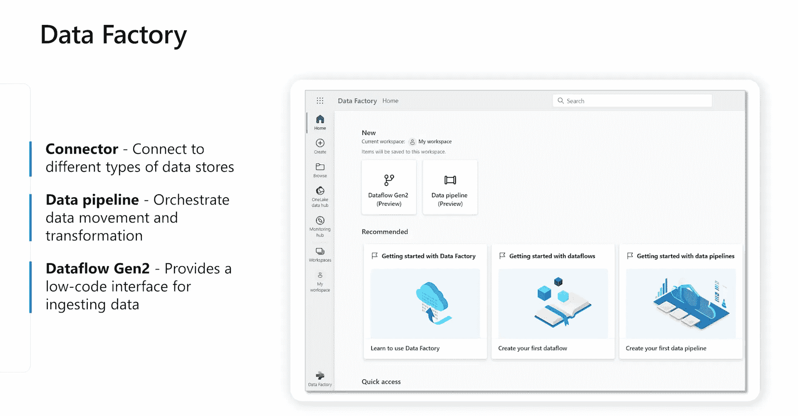

微软公开的学习材料中的图像

Data Factory 还包括 Dataflow Gen2，这是一个用于数据摄取和简单转换的低代码工具。Power BI 的用户会觉得非常熟悉，因为 Dataflow Gen 2 看起来很像他们习惯的 Power Query 编辑器。这样，数据分析师和业务用户可以在数据摄取和处理方面发挥更大作用。

Data Factory 已经通过名为**管道**的功能存在于 Azure Synapse Analytics 平台中。因此，Data Factory 在 Microsoft Fabric 中的加入是预期之中的。

## Synapse Data Engineering

在 Data Factory 中，可以使用低代码工具进行一些简单的转换。对于更复杂的处理，你可以使用 Synapse Data Engineering 设置 Spark 作业和笔记本，以更自定义的方式处理数据。

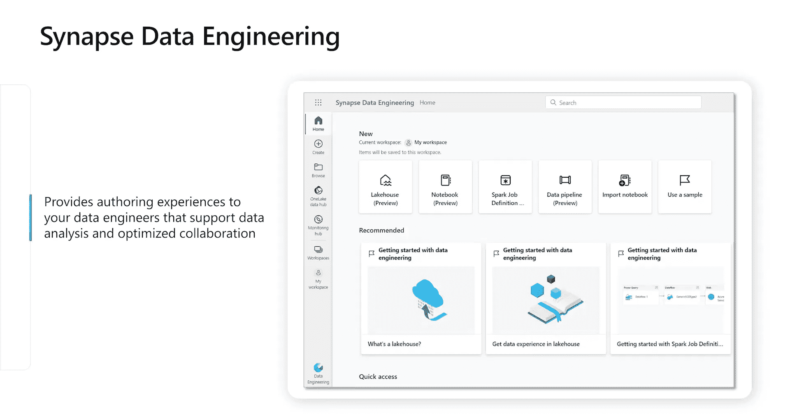

图片来自微软公开的学习材料

Synapse Data Engineering 还允许设置湖仓，在一个位置管理结构化和非结构化数据。然后可以使用 Spark 作业和笔记本对数据进行转换。湖仓还提供一个**SQL 分析端点**，以便你可以编写基于 SQL 的查询来提取数据。请注意，SQL 分析端点仅设计用于读取操作。大多数数据工程师会在 Microsoft Fabric 中的大量时间里在 Synapse Data Engineering 中工作。

## Synapse Data Science

与 Azure Synapse Analytics 的不同之处在于数据科学的引入，特别是机器学习模型开发的生命周期。

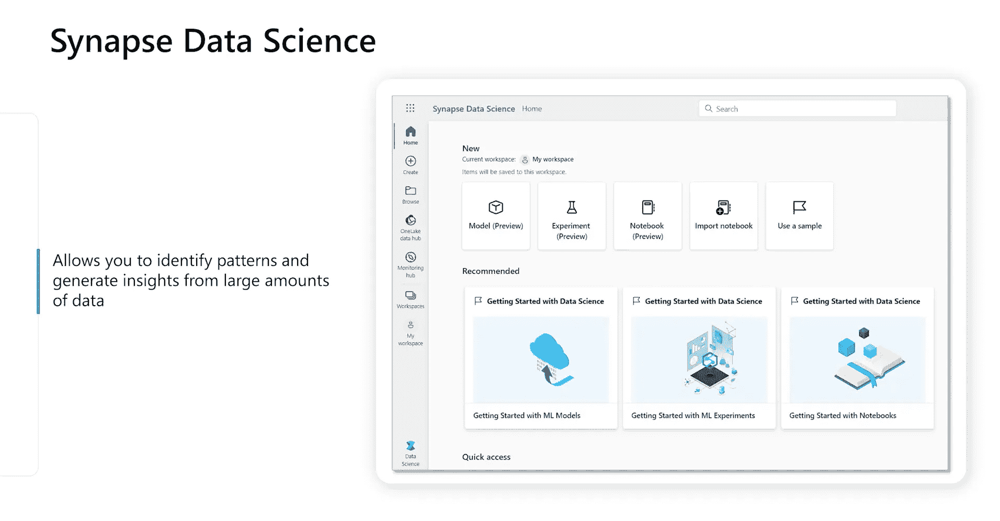

图片来自微软公开的学习材料

Synapse Data Science 包括模型托管、实验和 ML 模型的部署。内置了 MLflow 体验，使得参数和指标的跟踪变得简单。Microsoft Fabric 还支持**自动日志记录**，这是一个简化日志记录体验的功能。

ML 模型的训练可以通过 Python/PySpark 和 SparklyR/R 完成。像 scikit-learn 这样的流行库可以轻松集成，模型开发的体验也变得简单了许多。其他基于 Azure 的 AI 工具，如 Azure OpenAI Service 和 Text Analytics，也可以从 Microsoft Fabric 中轻松使用。当前这一连接处于预览阶段，但未来将会包含更多的微软 AI 服务。

我认为，在 Microsoft Fabric 被称为完整的 MLOps 平台之前，还需要更多的时间、测试和进一步的开发，但他们已经做出的改变非常令人印象深刻。

## Synapse Data Warehousing

我之前提到过，Microsoft Fabric 中的湖仓有一个 SQL 分析端点，你可以在数据上编写只读的 SQL 查询（以及创建视图）。Microsoft Fabric 还提供了一个完整的数据仓库解决方案，支持 DDL 和 DML 查询。

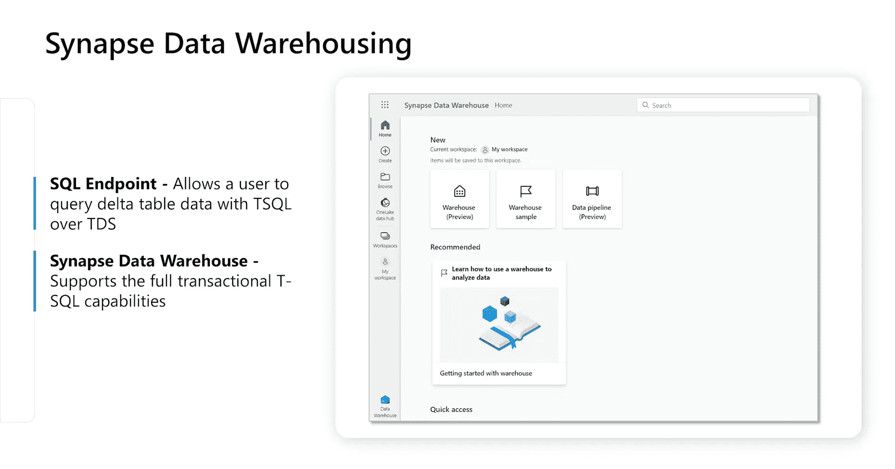

图片来自微软公开的学习材料

因此，通过 Synapse 数据仓库，你可以拥有一个全面的数据仓库，支持 T-SQL 功能。选择来自湖仓的 SQL 分析端点还是一个全面的数据仓库，是在大多数情况下需要考虑的权衡。微软有大量文档[阐述这种权衡](https://learn.microsoft.com/en-us/fabric/data-warehouse/data-warehousing?wt.mc_id=tela_mscom22_webpage_gdc#compare-different-warehousing-capabilities)以及不同选项所提供的功能。

## Synapse 实时分析

实时按需数据的期望由 Synapse 实时分析满足。许多系统持续收集数据，以显示在仪表盘中或用于机器学习模型中。示例包括来自传感器的 IoT 数据或客户在网站上的浏览数据。Microsoft Fabric 的 Synapse 实时分析组件全面处理流数据。

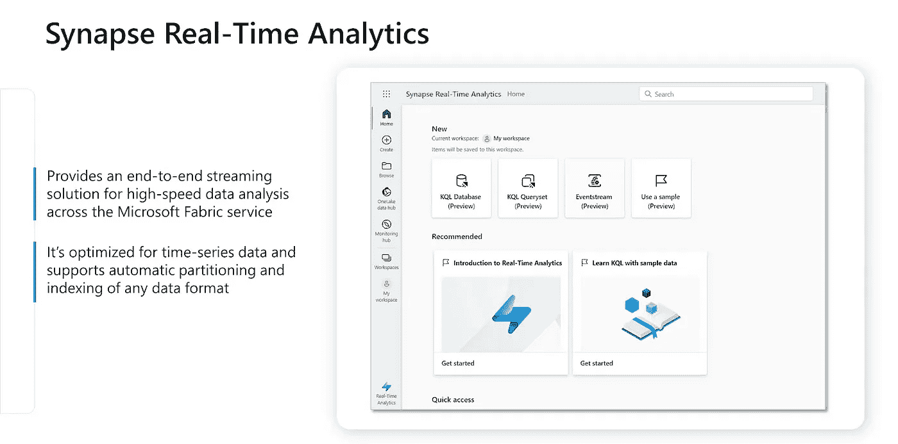

来自微软公开学习资料的图片

它使用 KQL（Kusto 查询语言）来查询事件流。它针对时间序列数据进行了优化，并具有大量支持自动分区和扩展的功能。最终结果可以轻松地与 Microsoft Fabric 中的其他组件（如 Synapse 数据工程或 Power BI）集成。

## Power BI

我怀疑 Power BI 是否需要过多介绍。过去十年来，它一直是事实上的可视化/仪表盘解决方案之一。通过 Power BI，你可以创建更新且美观的仪表盘，并将其分发给拥有正确访问权限和权限的人。

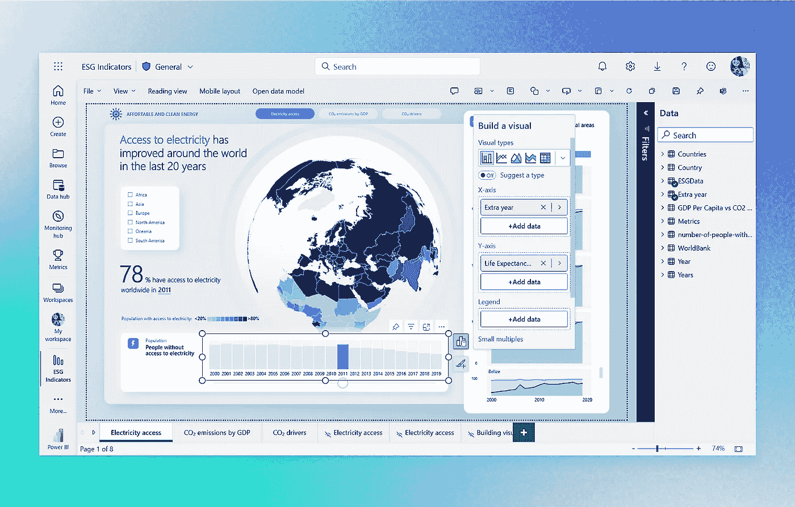

来自微软公开学习资料的图片

Microsoft Fabric 中的新变化是 Power BI 与其他数据和分析平台紧密集成。之前，数据工程师可以在 Azure Synapse Analytics 中工作，而数据分析师则在 Power BI 中工作，两者之间的互动很少。在 Microsoft Fabric 中，数据分析师被鼓励在数据处理过程中发挥更大的作用，而数据工程师则被鼓励更多地思考数据如何在可视化阶段提供见解。

还有一种新的连接模式叫做**直接湖模式**，作为速度和避免数据重复之间的中间道路，似乎非常有前景。这对频繁更新的大型数据集是最优的。我还没有进行过基准测试，但我小心乐观地认为这在许多情况下可能会很有价值。

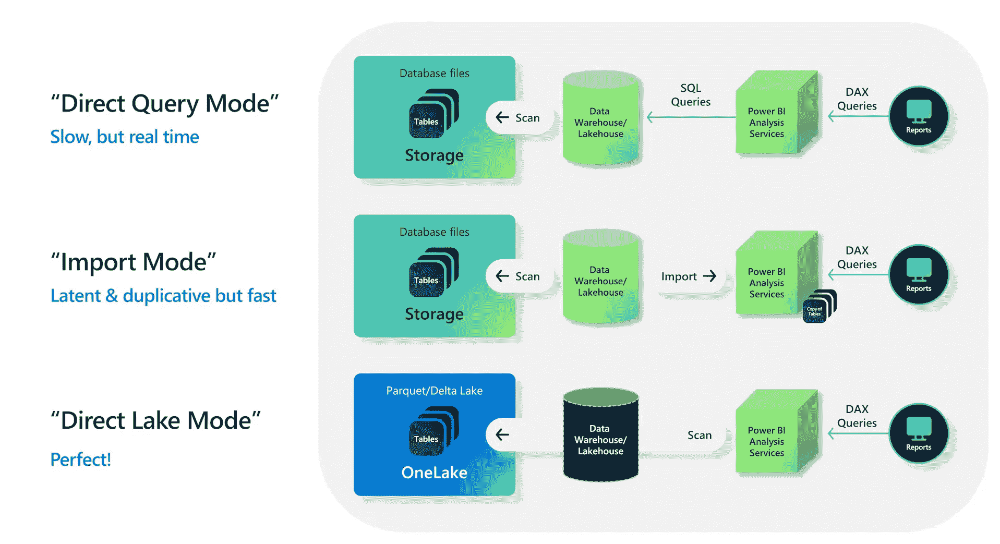

来自微软公开学习资料的图片

## 数据激活器

Microsoft Fabric 平台的最后一个组件是 Data Activator。Data Activator 是一个无代码工具，用于在数据中检测到条件或模式时采取行动。它设置了**反应**——一个包含连接到数据、监控数据的特定条件，然后通过触发器采取行动所需信息的项目。

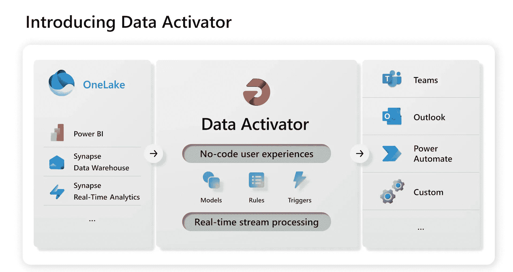

图片来自微软公开的学习材料

无代码规则和触发器可以在 Microsoft Teams 或 Outlook 等应用程序中发送通知，通知有关有趣的变更。还可以在 Power Platform 中使用 Power Automate 编写自定义工作流，以确定终端用户如何被提醒。

警报系统可以通过 Logic Apps 或其他服务与 Azure Synapse Analytics 集成。如果连接警报系统需要稍微付出一点努力，它们往往会很快被忽视，因此 Data Activator 成为 Microsoft Fabric 的一部分是很棒的。虽然在我看来它没有提供革命性的东西，但它使整个 Microsoft Fabric 平台变得更加全面。

# 使用 Microsoft Fabric 的三大优势

现在我们已经描述了 Microsoft Fabric 的组成部分，我想讨论一下 Microsoft Fabric 的一些优势。这些优势基于我个人的兴趣。

## SaaS 和学习曲线

随着 Microsoft Fabric 朝着 SaaS 解决方案的方向发展，技能提升的速度应该比 PaaS 解决方案更快，并且能够覆盖更大范围的人群。具体来说，我认为数据分析师有望承担更多传统上属于数据工程师的任务。这包括监控数据、设置数据管道以及编写数据转换的代码。我的初步实验表明，Data Activator 和 OneLake 的启动确实非常迅速。这些组件也有一个友好的界面，开始时不会显得令人生畏。我认为这将促使数据分析师尝试并实验以前由数据工程师完成的任务。

在学习材料方面也有很多进展。我参加了微软提供的为期四天的免费数字课程，旨在教授 Fabric 平台的基础知识。2024 年还将推出新的微软认证——**Microsoft Certified: Fabric Analytics Engineer Associate**。看起来微软确实致力于 Microsoft Fabric，并且愿意为这一解决方案制作大量学习材料。

## 缩小数据分析师与数据工程师之间的差距

我之前简要提到过这一点，但想要更深入地关注这个问题。在数据领域，有许多角色，例如数据科学家、数据工程师、数据分析师、机器学习工程师、数据架构师等等。虽然这些角色之间存在一些明显的差异，但数据领域在角色方面变得不必要地碎片化。这种碎片化并不是基于不同的意识形态或类似的高尚目标，而仅仅是由于工具的分离。Microsoft Fabric 通过其结构使这一点变得更加一致和不那么碎片化。

数据工程师应该考虑数据转换的最终结果如何用于可视化。同样，数据分析师应该关心在数据准备好进行可视化之前发生了哪些数据转换。现实中常见的情况是，数据工程师和数据分析师被隔离在不同的工具中，之间的接口非常有限。这个接口是基于需求的，并没有真正促进协作或共享见解。这可能导致大量的反复沟通和独立运作的孤岛。

使用 Microsoft Fabric，数据分析师和数据工程师被鼓励紧密合作。他们可以更轻松地查看彼此的工作，并在自己的专业领域之外进行贡献。这并不一定意味着数据工程师会设计 Power BI 仪表板，或者数据分析师会编写 Spark 代码。但数据分析师和数据工程师之间的交集将会更大，更多的协作成为可能。我认为这是数据与分析平台的一个主要亮点。

## 一个将 AI 置于核心的位置的平台

在许多数据与分析平台中，AI 和机器学习更多的是一种事后考虑。它们提供了一些 ML 模型的托管功能，但首先是一个数据平台，AI 功能只是锦上添花。

Microsoft Fabric 采取了不同的方法，将 AI 置于平台的核心。不仅 ML 模型生命周期功能相对具有竞争力，而且像 Microsoft Copilot 和 GPT 模型这样的 LLMs 的原生集成被仔细地构建到平台中。由于 Microsoft 是生成 AI 的主要参与者，能够尽快获取新开发和改进是非常有用的。

似乎 Microsoft Fabric 也在逐步建立与其他 Azure AI 服务（以前称为 Azure Cognitive Services）的更多连接。这些服务当然可以通过各自的端点作为独立服务使用，但 Microsoft Fabric 正在尝试使连接尽可能顺畅。我认为在未来半年内，大多数 Azure AI 服务将可以通过 Microsoft Fabric 轻松访问。拥有高级的 [文档智能](https://azure.microsoft.com/en-us/products/ai-services/ai-document-intelligence) 用于解析 PDF 文档，或高级的 [文本到语音翻译](https://azure.microsoft.com/en-us/products/ai-services/ai-speech)，只需点击按钮即可使用，这是其他数据平台难以竞争的。

# 使用 Microsoft Fabric 的 3 个缺点

为了对抗我之前提到的 Microsoft Fabric 的优点，下面是一些使用 Microsoft Fabric 的可能缺点。这些都是基于我自己的担忧。

## 统一化与锁定

Microsoft Fabric 确实将许多现有的 Azure 解决方案统一到一个具有自己计费和统一 OneLake 的包中。然而，这也意味着你被鼓励将 Microsoft Fabric 作为一个完整的解决方案来使用，而不是在微服务架构中的单一组件。这使得数据平台更容易锁定在 Microsoft 生态系统中。这是否好坏取决于你使用的其他工具以及你对平台未来的抱负。对许多人来说，这可能是一个他们不愿妥协的缺点。

## 低代码的双刃剑

低代码的优势在于它允许更多的人参与。数据分析师和业务用户可以在 Microsoft Fabric 中承担更多任务。但从这个角度来看，低代码是把双刃剑。低代码的简单性通常意味着定制可能性较少。工具的 GUI 基于程度越高，细调选项越少。

以具体示例说明，Data Factory 是一个低代码工具，可以从例如事务数据库中提取数据。但是，Data Factory 提供的功能比你编写 SQL 查询来获取数据的功能要少。这是自然的，因为 SQL 查询是一种完整的声明性语言，而 Data Factory 只有一些预设和配置选项。因此，Data Factory 9/10 的情况下会顺利完成，但有时编写代码可以提供更多的可能性。

Microsoft Fabric 走低代码路线可能是一个让所有人不尽兴的发展。我对他们在低代码和基于代码的工具之间取得的平衡感到相当满意。然而，向低代码方向迈进一步会使平台对我和许多有编码背景的人来说变得更难管理。这种发展可能是一个值得密切关注的未来缺点。

## 新技术 — 技术能力要求降低

这一点适用于任何新技术。很少有人对 Microsoft Fabric 非常熟悉。如果你尝试建立一个内部团队，那么要求新员工具备 Fabric 经验可能过于苛刻。你需要进行内部技能提升，并花时间了解在 Microsoft Fabric 中哪些模式有效，哪些无效。好处是，Fabric 从 Synapse Analytics、Data Factory 和 Power BI 等服务中汲取了很多，这些背景应该足以让你快速上手 Microsoft Fabric。

# 应该改变吗？

将现有解决方案更改为 Microsoft Fabric 是一个复杂的决定。**将这一重要决定基于一篇博客文章是个愚蠢的主意**。不过，这里有两个明确的案例：

+   你是否将 Synapse Analytics 作为数据平台？你是否在使用其他工具，如 Microsoft Purview 和 Power BI？你是否觉得将这些服务连接起来很麻烦，并且难以跟踪？在这种情况下，迁移是有希望的。进行更改可能会使你的数据平台更易于管理。**开始尝试 Microsoft Fabric！** 尝试复制你现有数据平台中的一些数据管道。如果这带来了良好的结果，那么你就有了一个新的数据平台的严肃竞争者。

+   你是否在使用多个不在微软平台上的工具？也许你没有使用 Power BI，而是使用像 Grafana 这样的不同仪表板解决方案？你是否关注基于代码的工具和开源工具？**在这种情况下不要切换到 Microsoft Fabric。** 你仍然应该关注 Microsoft Fabric，但你的公主不幸在另一座城堡里。

除了这种明确的解决方案外，你需要尝试 Microsoft Fabric。只有这样你才能掌握它是否适合你的需求。更改数据与分析平台是一个重大决定。成功需要技术能力和强大的业务理解。

# 总结

[Spencer Bergen](https://unsplash.com/@spencerbergen?utm_source=medium&utm_medium=referral) 在 [Unsplash](https://unsplash.com/?utm_source=medium&utm_medium=referral) 上的照片

希望你对 Microsoft Fabric 及其提供的功能有一个诚实的概述。如果你对 AI、数据科学或数据工程感兴趣，请随时关注我或在 [LinkedIn](https://www.linkedin.com/in/eirik-berge/) 上联系我。你对 Microsoft Fabric 的体验如何？我很想听听你的意见 😃

**喜欢我的文章吗？** 查看我的其他帖子以获取更多内容：

+   [作为数据科学家成功所需的软技能](https://medium.com/towards-data-science/the-soft-skills-you-need-to-succeed-as-a-data-scientist-ceac760230d3)

+   如何作为数据科学家编写高质量的 Python

+   用美观的类型提示现代化你的罪恶 Python 代码

+   在 Python 中可视化缺失值极其简单

+   在 Python 中使用 PyOD 进行异常/离群点检测 🔥
