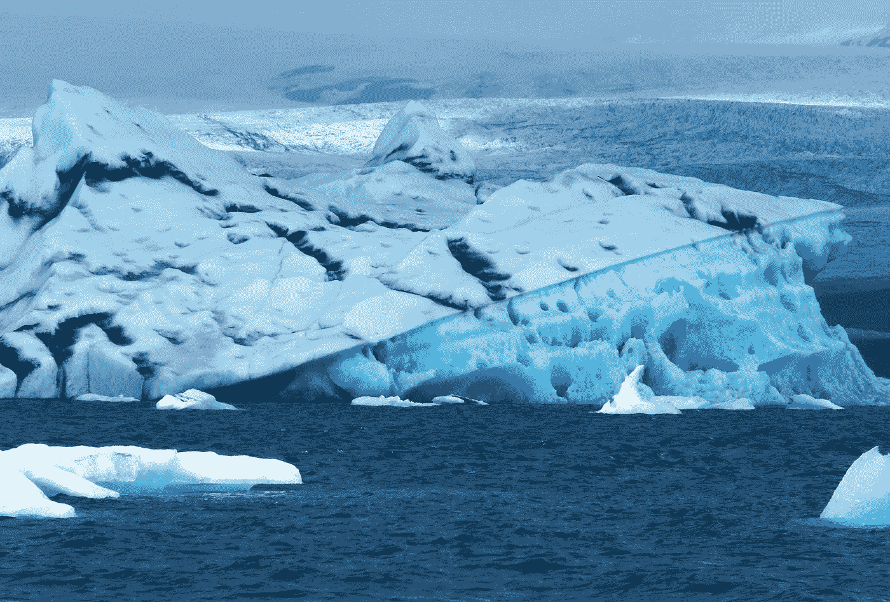
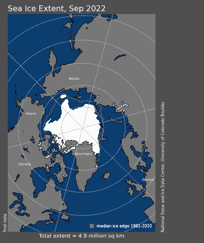
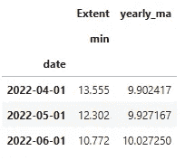
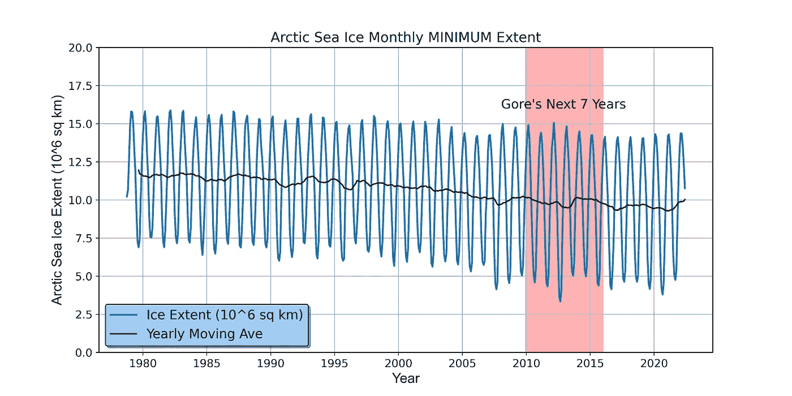
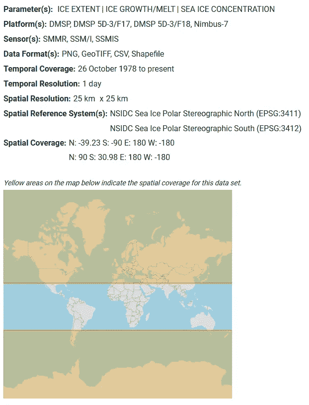

# 使用 Python 分析北极冰趋势

> 原文：[`towardsdatascience.com/analyze-arctic-ice-trends-with-python-581ba4423416`](https://towardsdatascience.com/analyze-arctic-ice-trends-with-python-581ba4423416)

## 探索过去的预测

[](https://medium.com/@lee_vaughan?source=post_page-----581ba4423416--------------------------------)[](https://towardsdatascience.com/?source=post_page-----581ba4423416--------------------------------) [Lee Vaughan](https://medium.com/@lee_vaughan?source=post_page-----581ba4423416--------------------------------)

·发表在[Towards Data Science](https://towardsdatascience.com/?source=post_page-----581ba4423416--------------------------------) ·阅读时间 7 分钟·2023 年 6 月 27 日

--



倾斜的冰岛冰山（图源：作者）

*测量*是*所有*科学的基石。没有它，我们如何测试我们的假设？

作为数据科学的首选编程语言，Python 使得收集、清理和理解测量数据变得容易。借助 Python，我们可以回测预测，验证模型，并追究预言者的责任。

去年，一个[过时的网络迷因](https://www.dailymail.co.uk/sciencetech/article-2738653/Stunning-satellite-images-summer-ice-cap-thicker-covers-1-7million-square-kilometres-MORE-2-years-ago-despite-Al-Gore-s-prediction-ICE-FREE-now.html)在我的 LinkedIn 动态中出现，标记有“#灾难化”的标签。内容是关于他在 2007 年和 2009 年提出的北极海在七年内将无夏季冰的评论。一些事实核查[网站](https://www.politifact.com/factchecks/2021/mar/02/facebook-posts/fact-checking-claims-al-gore-said-all-arctic-ice-w/)将这一说法验证为“基本真实”，并引用了以下引用：

> “一些模型表明，Wieslav Maslowski 博士认为，在接下来的五到七年内，整个北极冰盖在某些夏季月份可能会完全无冰，概率为 75%。”
> 
> - 阿尔·戈尔，2009 年 12 月

虽然许多人对网络迷因视而不见，但数据科学家能够深入探讨数据并得出自己的结论。在这个*快速成功的数据科学*项目中，我们将使用 Python 的 pandas 和 Matplotlib 库来审视过去四十年北极海冰的行为，并对评论和迷因进行检验。

# 关于气候变化的评论

请注意，这既不是一篇*反对*气候变化的文章，也不是*支持*气候变化的文章，而是一篇*支持数据*的文章。无论你对人为气候变化的看法如何，我希望你同意验证模型和确认预测对每个人都至关重要。

同样重要的是，关键主题的思想领袖应避免做出易被驳斥的夸张或轻率的声明。这不仅会损害可信度，还会使话题政治化，使得理性的讨论变得困难，甚至不可能。

在这种情况下，艾尔·戈尔明智地用概率和“建议”和“可能”等词语来缓和他的评论。不幸的是，这些缓和在制作表情包时容易被误用。

# 国家雪冰数据中心

为了确认或驳斥戈尔的“预测”，我们需要知道在相关时间段内的*最小*海冰范围。幸运的是，我们可以访问由[*国家雪冰数据中心*](https://nsidc.org/home)提供的全面公共数据集，该中心是科罗拉多大学博尔德分校[*环境科学合作研究所（CIRES）*](https://nsidc.org/home)的一部分。此数据集利用卫星图像追踪和监测北极海冰的变化。



基于卫星图像的 2022 年 9 月海冰范围（感谢国家雪冰数据中心，科罗拉多大学博尔德分校 [1]）

数据以月度和日度增量提供。通常，月度总数[推荐](https://nsidc.org/data/masie/masie-faqs)用于观察海冰趋势。然而，为了确保我们捕捉到每个月的*最小*测量范围，我们将使用*每日*数据，并选择*最低值*的那一天来代表*整个月*。

虽然按日增量的数据集可以通过提供的[链接](https://nsidc.org/data/seaice_index/data-and-image-archive)以 CSV 格式访问，但我已经准备好了文件，并将其存储在这个[代码片段](https://gist.github.com/rlvaugh/806d65cdc77c01961156e15a09fe0d97)中以便使用。

为了解决当前的问题，我们将使用 pandas 准备数据，并使用 Matplotlib 绘制[折线图](https://chartio.com/learn/charts/line-chart-complete-guide/)。我们将绘制*所有*数据，但主要关注每个夏季发生的*最小*值。

# 代码

以下代码被输入到 JupyterLab 中，并按单元描述。

## 导入库

对于这个项目，我们只需要 Matplotlib 和 pandas 这两个稳固的库。你可以使用 conda 安装它们：

`conda install matplotlib pandas`

和使用 pip：

`pip install matplotlib`

`pip install pandas`

Matplotlib 的 `mdates` 模块将帮助我们在图表上标注戈尔提出无冰北极海的时间跨度。以下是导入的库：

```py
import pandas as pd
import matplotlib.pyplot as plt
import matplotlib.dates as mdates
```

## 加载和准备数据

以下注释的代码使用 pandas 库从 Gist 中加载数据，并为绘图做准备。此外，它生成了年度移动平均值，以捕捉测量中的长期趋势。

```py
# Read the data:
URL = 'https://bit.ly/3NLoDzx'
df = pd.read_csv(URL, skiprows=[1])

# Remove leading whitespace from the column names:
df.columns = df.columns.str.strip()

# Drop unnecessary columns:
df = df.drop(df.columns[[4, 5]], axis=1)

# Group by monthly MINIMUM ice extent:
df = df.groupby(['Year', 'Month']).agg({'Extent': ['min']}).reset_index()

# Create a 'date' column from the 'Year' and 'Month' columns:
cols = ['Year', 'Month']
df['date'] = df[cols].apply(lambda x: '-'.join(x.values.astype(str)), 
                            axis="columns")
df['date'] = pd.to_datetime(df['date'])

# Set the 'date' column as the DataFrame index:
df = df.set_index(df['date'])

# Drop unnecessary year, month, and date columns:
df = df.drop(df.columns[[0, 1, 3]], axis=1)

# Calculate the yearly moving average:
df['yearly_ma'] = df.Extent.rolling(12).mean()

# Check the results:
df.tail(3)
```



DataFrame 的末尾（作者提供的图片）

## 绘制数据

以下注释的代码绘制了每月最低冰面数据和年度移动平均值的折线图。阿尔·戈尔 2009 年言论后的七年期用红色突出显示并标记为“戈尔的接下来 7 年”。

```py
# Create the plot:
fig, ax = plt.subplots(figsize=(12, 6))
ax.set_title('Arctic Sea Ice Monthly MINIMUM Extent', size=15)
ax.plot(df['Extent'], lw=2)
ax.plot(df['yearly_ma'], color='k')
ax.set_ylim([0, 20])
ax.tick_params(axis='both', 
               which='major', 
               labelsize=12)
ax.grid()

# Add a legend:
ax.legend(['Ice Extent (10⁶ sq km)', 'Yearly Moving Ave'],
           frameon=True,
           loc=3,
           prop={'size': 14},
           facecolor='#a1c9f4',
           edgecolor='k',
           fancybox=True,
           shadow=True,
           framealpha=1)

# Add a shaded span for Gore's prediction:
ax.axvspan(*mdates.datestr2num(['2009-12-14', '2016-1-1']), 
           color='red', 
           alpha=0.3)

# Annotate the 7-year span referenced by Gore in 2009:
ax.text(0.655, 0.8, 
        "Gore's Next 7 Years", 
        transform=ax.transAxes, 
        fontsize=14)

# Set the x and y labels:
font1 = {'family': 'arial', 
         'color': 'black', 
         'size': 15}
ax.set_xlabel('Year', fontdict=font1)
ax.set_ylabel('Arctic Sea Ice Extent (10⁶ sq km)', 
              fontdict=font1)

plt.show()
```



最终的线图（作者提供的图片）

图中锯齿状的蓝线跟踪了每个月北极海冰的最低冰面。每次波动的峰值代表冬季最低冰面（通常在 3 月最高）。每次波动的低谷代表夏季最低冰面（通常在 9 月最低）。黑线是年度移动平均值，它滤除了季节性“噪声”，显示了 44 年期间海冰面积的整体趋势。

> 由于我们使用的是每月记录的最低值，而不是更典型的月平均值或中位数值，因此这个图可能与您在网上找到的其他图有所不同。

# 结果

在 2009 年后的七年里，北极海并*未*变成无冰状态，尽管在 2012 年 9 月 16 日达到了 334 万平方公里的新低。这比 1981 年 9 月的低点 690 万平方公里以及 2009 年的低点 500 万平方公里要低得多。实际上，从 2009 年到 2012 年，冰面面积有一个稳定的下降趋势。

2012 年之后，数值似乎有所稳定，到 2021 年夏季，移动平均曲线实际上在上升。

虽然阿尔·戈尔并没有“说对”，但他的声明确实留出了实际结果的空间。他引用的模型包括了 25% 的可能性，即*部分*冰层将在北极海过夏季时依然存在。

我们应该从中学到的一点是，地球气候是一个复杂的系统。关于其行为的具体和短期预测应非常谨慎。虽然制造紧迫感可能很重要，但这很容易适得其反，导致嘲笑和信誉下降。

# 引用

[1] Fetterer, F., K. Knowles, W. N. Meier, M. Savoie, 和 A. K. Windnagel. Sea Ice Index, Version 3\. 2017，由国家雪冰数据中心分发。 [`doi.org/10.7265/N5K072F8`](https://nsidc.org/data/g02135/versions/3)。访问日期 06–18–2022。

这个项目的具体数据来源网站是 [`nsidc.org/data/nsidc-0081.html`](http://nsidc.org/data/nsidc-0081.html) 和 [`nsidc.org/data/nsidc-0051.html`](http://nsidc.org/data/nsidc-0051.html)（数据范围：1978 年 10 月至 2022 年 6 月）。

关于数据的更多详细信息列在下面的表格中：



NSIDC 海冰指数 v3 数据表（由科罗拉多大学博尔德分校国家雪冰数据中心提供）

根据 NSIDC 的[引用政策](https://nsidc.org/about/data-use-and-copyright)，除非特别说明使用限制，否则可以下载和使用 NSIDC 网站上的照片、图像或文本。卫星图像可以免费下载并使用，但需正确注明来源。除非另有说明，照片和图像可以用于商业目的；但不能重新销售。

许多网站上的图像都附有标题和具体的版权信息。否则，通用的版权格式应为：“图像/照片由科罗拉多大学博尔德分校国家雪冰数据中心提供。”

# 谢谢！

感谢阅读，请关注我获取更多未来的*快速成功数据科学*项目。
