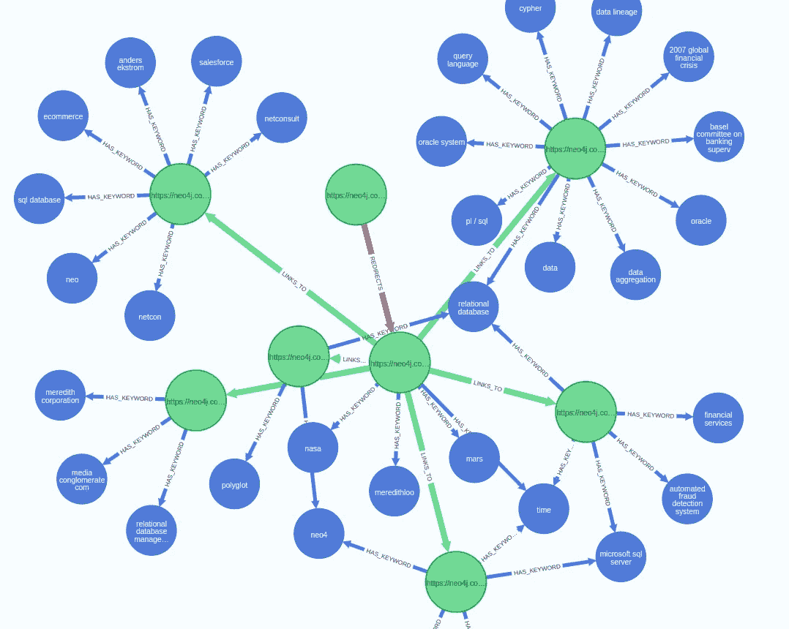

# 使用自然语言处理和知识图谱分析您的网站

> 原文：[`towardsdatascience.com/analyze-your-website-with-nlp-and-knowledge-graphs-88e291f6cbf4?source=collection_archive---------1-----------------------#2023-01-05`](https://towardsdatascience.com/analyze-your-website-with-nlp-and-knowledge-graphs-88e291f6cbf4?source=collection_archive---------1-----------------------#2023-01-05)

## 结合各种自然语言处理技术，构建一个表示您网站的知识图谱

[](https://bratanic-tomaz.medium.com/?source=post_page-----88e291f6cbf4--------------------------------)[](https://towardsdatascience.com/?source=post_page-----88e291f6cbf4--------------------------------) [Tomaz Bratanic](https://bratanic-tomaz.medium.com/?source=post_page-----88e291f6cbf4--------------------------------)

·

[关注](https://medium.com/m/signin?actionUrl=https%3A%2F%2Fmedium.com%2F_%2Fsubscribe%2Fuser%2F57f13c0ea39a&operation=register&redirect=https%3A%2F%2Ftowardsdatascience.com%2Fanalyze-your-website-with-nlp-and-knowledge-graphs-88e291f6cbf4&user=Tomaz+Bratanic&userId=57f13c0ea39a&source=post_page-57f13c0ea39a----88e291f6cbf4---------------------post_header-----------) 发表在 [Towards Data Science](https://towardsdatascience.com/?source=post_page-----88e291f6cbf4--------------------------------) · 14 分钟阅读 · 2023 年 1 月 5 日 [](https://medium.com/m/signin?actionUrl=https%3A%2F%2Fmedium.com%2F_%2Fvote%2Ftowards-data-science%2F88e291f6cbf4&operation=register&redirect=https%3A%2F%2Ftowardsdatascience.com%2Fanalyze-your-website-with-nlp-and-knowledge-graphs-88e291f6cbf4&user=Tomaz+Bratanic&userId=57f13c0ea39a&source=-----88e291f6cbf4---------------------clap_footer-----------)

--

[](https://medium.com/m/signin?actionUrl=https%3A%2F%2Fmedium.com%2F_%2Fbookmark%2Fp%2F88e291f6cbf4&operation=register&redirect=https%3A%2F%2Ftowardsdatascience.com%2Fanalyze-your-website-with-nlp-and-knowledge-graphs-88e291f6cbf4&source=-----88e291f6cbf4---------------------bookmark_footer-----------)

网站反映了公司。大多数情况下，它用于向用户提供各种产品和服务的信息并推动销售。然而，网站随着时间的推移而增长和变化，许多小的和大的变化被引入。因此，网站最终可能会变得混乱，无法实现其最初的使命。因此，定期评估网站的结构和内容以使其尽可能优化是有意义的。优化网站是一个庞大的业务，因此有多种商业工具可以帮助你进行 SEO 和其他建议。然而，我将向你展示如何通过一点编码知识创建网站内容的全面而详细的表示，从而允许你分析和改进它。

你可以使用任何现有的网络爬虫工具提取网站的结构。此外，利用各种自然语言处理技术评估网站的内容也是有意义的。由于大多数网站是受版权保护的，我决定在本教程中使用 Neo4j 文档网站作为示例。文档网站的内容在 [CC 4.0 许可证](https://neo4j.com/docs/license/) 下提供。不过，你可以将类似的工作流程应用于任何你希望的网页。


从文档中提取信息以构建知识图谱。图像由作者提供。

这可能看起来有点神奇（如果你忽略我的箭头），如何利用你网站上的信息构建知识图谱。在这篇文章中，我旨在为信息提取带来更多的清晰度，并为你提供可以自己使用的工具。我曾经使用类似的方法处理过 医疗文档、[新闻](https://medium.com/neo4j/making-sense-of-news-the-knowledge-graph-way-d33810ce5005) 或甚至 [加密货币报告](https://medium.com/neo4j/monitoring-the-cryptocurrency-space-with-nlp-and-knowledge-graphs-92a1cfaebd1a)，现在我们将利用 NLP 和知识图谱来分析一个网站。

## 数据收集和建模工作流程


数据收集和建模工作流程。图像由作者提供。

数据收集和预处理分为三个部分。

+   网络爬虫：一个 Python 脚本，用于遍历文档网页并收集链接和文本

+   NLP 流程：从文本中提取关键词并计算文本嵌入，以检测相似/重复内容

+   知识图谱：将结果存储为知识图谱以进行进一步分析

数据收集和预处理的代码可在 [GitHub 上的 Jupyter 笔记本](https://github.com/tomasonjo/blogs/blob/master/neo4jdocs/Preprocessing.ipynb) 中找到。

*你不需要自己运行数据收集和处理，因为这需要几个小时。我已经准备了一个* [*Neo4j dump*](https://drive.google.com/file/d/1vpQe2gfoPiUVXQpUq-J6Fsjxq5BamyXM/view?usp=sharing) *，如果你想跟随文章中的分析，可以使用这个数据。*

**网页抓取器**

我通常使用[Python Selenium](https://selenium-python.readthedocs.io/)进行网页抓取，但你可以使用任何其他库或语言来从网站中提取相关信息。我不会详细介绍代码，因为这篇文章的目标不是教你如何抓取网站。然而，你可以查看处理网页抓取的[Jupyter notebook](https://github.com/tomasonjo/blogs/blob/master/neo4jdocs/Preprocessing.ipynb)。

对于 Neo4j 文档网站，我避免抓取左侧和顶部导航栏的链接，因为这会在图中引入大量噪音，因为大多数页面都有相同的导航栏。


在抓取过程中会忽略导航栏中的链接。图片由作者提供。

在 Neo4j 文档网站中，我希望捕捉到用户如何在不使用导航栏的情况下遍历文档。否则，我们将引入噪音，因为所有页面都会链接到导航栏中的相同页面。此外，我专注于从文档网页中提取文本和链接，因此一些产品或营销页面的内容没有被抓取。

**自然语言处理**

自然语言处理步骤包括提取关键词和计算文本嵌入，以检测相似和重复的内容。在考虑训练自己的 NLP 模型之前，查看[HuggingFace 模型库](https://huggingface.co/models)是否有任何公开可用的模型适合你的用例总是一个好主意。

经过一些研究，我发现了一个由**Yankı Ekin Yüksel**提供的[关键词提取模型](https://huggingface.co/yanekyuk/bert-uncased-keyword-extractor)。我非常喜欢使用 transformers 和 HuggingFace 加载和运行模型的简单性。

以下代码加载关键词提取模型并准备一个 NLP 流水线。

```py
tokenizer = AutoTokenizer.from_pretrained("yanekyuk/bert-uncased-keyword-extractor")
model = AutoModelForTokenClassification.from_pretrained(
    "yanekyuk/bert-uncased-keyword-extractor"
)

nlp = pipeline("ner", model=model, tokenizer=tokenizer)
```

你不需要下载模型或担心文件路径。相反，你可以简单地将模型名称定义为 tokenizer 和模型的参数，transformers 库会为你完成所有工作。

流水线返回的令牌不一定是一个单词。因此，我们需要在 NLP 流水线完成后从令牌构建回单词。

```py
def extract_keywords(text):
    """
    Extract keywords and construct them back from tokens
    """
    result = list()
    keyword = ""
    for token in nlp(text):
        if token['entity'] == 'I-KEY':
            keyword += token['word'][2:] if \
              token['word'].startswith("##") else f" {token['word']}"
        else:
            if keyword:
                result.append(keyword)
            keyword = token['word']
    # Add the last keyword
    result.append(keyword)
    return list(set(result))

extract_keywords("""
Broadcom agreed to acquire cloud computing company VMware in a $61 billion (€57bn) cash-and stock deal.
""") # ['cloud computing', 'vmware', 'broadcom']
```

这个示例展示了模型从给定文本中提取了**云计算**、**vmware**和**broadcom**。这些结果似乎非常适合我们的用例，因为我们正在分析 Neo4j 文档，其中应该包含许多技术关键词。

接下来，我们还需要计算文本嵌入，以帮助我们识别相似和重复的内容。我在 HuggingFace 模型库中搜索了一下，发现了一个可以用来识别相似句子或段落的[句子变换模型](https://huggingface.co/sentence-transformers/all-MiniLM-L6-v2)。此外，该模型只需三行代码即可加载和使用。

```py
from sentence_transformers import SentenceTransformer

model = SentenceTransformer("sentence-transformers/all-MiniLM-L6-v2")

def generate_embeddings(text):
    embeddings = model.encode(text)
    return [float(x) for x in embeddings.tolist()]
```

我们需要将结果转换为浮点数列表，因为 Neo4j Driver 不支持 NumPy 数组。

**知识图谱构建**

在完成网页抓取和自然语言处理步骤后，我们可以继续构建知识图谱。你可能已经猜到，我们将使用 Neo4j 来存储我们的知识图谱。你可以使用[免费云实例](https://neo4j.com/cloud/platform/aura-graph-database/)或设置[本地环境](https://neo4j.com/download/)。

初始导入后的图形模式定义如下。


初始图形模式。图像由作者提供。

在我们图表的中心是网页。我们知道它们的 URL 地址、文本嵌入值，以及网页抓取工具是否提取了页面文本。页面还可以链接或重定向到其他页面，这通过相应的关系表示。作为 NLP 工作流的一部分，我们还检测了网站上的关键词，并将其作为单独的节点存储。

如果你对数据导入的代码实现感兴趣，可以查看[预处理笔记本](https://github.com/tomasonjo/blogs/blob/master/neo4jdocs/Preprocessing.ipynb)。否则，我们将直接进入网络分析部分。

## **网络分析**

*我准备了一个* [*Neo4j 数据库转储*](https://drive.google.com/file/d/1vpQe2gfoPiUVXQpUq-J6Fsjxq5BamyXM/view?usp=sharing) *，如果你不想抓取 Neo4j 文档但仍想跟随网络分析示例，可以使用这个转储。*



Neo4j 文档网站知识图谱的样本子图。图像由作者提供。

我将带你了解一些我认为有趣的网站网络分析示例。我们将使用[图数据科学 Python](https://neo4j.com/docs/graph-data-science/current/python-client/)客户端，这是一个理想的工具，可以用来从 Python 进行 Neo4j 网络分析。

包含所有相关网络分析代码的 Jupyter Notebook[可在 GitHub 上获得](https://github.com/tomasonjo/blogs/blob/master/neo4jdocs/Analysis.ipynb)。

**总体统计数据**

首先，我们将通过使用`apoc.meta.stats`过程来评估数据集的大小，统计节点和关系的数量。

```py
gds.run_cypher("""
CALL apoc.meta.stats()
YIELD labels, relTypesCount
""")
```

我们的知识图谱包含 15370 页和 4199 个关键字，还有 62365 个链接和 723 个重定向。我没有预料到这么多页面。然而，考虑到文档涵盖了多个产品的多个版本，网站上的页面数量激增是有意义的。此外，许多链接指向 Neo4j 网站外的页面。

接下来，我们将评估从多少页面成功检索到内容信息。

```py
gds.run_cypher("""
MATCH (p:Page)
RETURN p.has_text AS has_text,
       count(*) AS count
""")
```

我们已经成功检索了 9688 个网页的内容并计算了文本嵌入。网络爬虫专注于从文档网站中恢复内容，同时大多忽略了产品和类似页面的结构和文本。因此，Neo4j 网站上有 2972 个我们尚未检索到内容的页面。最后，Neo4j 网站链接到其主要域外的 2710 个页面。在网络爬虫过程中，Neo4j 文档网站外的页面被明确忽略。

出于好奇，我们可以列出 Neo4j 最常链接的十个随机外部网页。

```py
gds.run_cypher("""
MATCH (p:Page)
WHERE p.has_text IS NULL
RETURN p.url AS page,
       count{(p)<-[:LINKS_TO|REDIRECTS]-()} AS links
ORDER BY links DESC
LIMIT 5
""")
```

*结果*

最常链接的网页实际上是一个本地 URL，即 Neo4j 浏览器的默认地址。以下是一些 GitHub 上 APOC 发布的链接。最后，看起来 Neo4j 有一些支持与微软 NLP 和 AWS 云 API 集成的产品或服务，否则他们可能不会在文档中链接这些内容。

**识别死链**

我们将通过识别死链或损坏的链接来进行处理。损坏的链接是指指向不存在网页的链接。与大多数网站一样，Neo4j 文档有一个指定的 404 网页。网络爬虫将“404”文本值分配给任何响应 404 页面的 URL。

```py
gds.run_cypher("""
MATCH (:Page)-[:LINKS_TO|REDIRECTS]->(:Page{is_404:true})
RETURN count(*) AS brokenLinkCount
""")
```

数据集中有 241 个损坏的链接。考虑到数据库中总共有 62 千个链接，损坏的链接数量听起来很少。然而，如果你在你的网站上执行了此分析，你可以将结果转发给相关团队以修复这些链接。

**查找最短路径**

大多数网站的设计旨在轻轻推动用户沿着路径到达最终目标。例如，如果你经营一个电子商务网站，那么目标可能是购买事件。借助 Neo4j，你可以分析用户可能遵循的所有路径，以到达期望的目的地。由于我们处理的是文档网站，我们无法探讨用户如何最终完成网站上的购买。然而，我们可以应用相同的技术，评估网站各部分之间的最短路径。

以下代码查找两个给定网页之间的所有最短路径。

```py
gds.run_cypher("""
MATCH (start:Page {url:"https://neo4j.com/docs"}), 
      (end:Page {url:"https://console.neo4j.io"})
MATCH p=shortestPath((start)-[:LINKS_TO|REDIRECTS*..10]->(end))
RETURN [n in nodes(p) | n.url] AS path
""")
```

结果显示，用户必须遍历以下网页才能从文档主页到达 Aura 控制台页面：

+   [`neo4j.com/docs`](https://neo4j.com/docs,)

+   [`neo4j.com/docs/aura/auradb`](https://neo4j.com/docs/aura/auradb,)

+   [`neo4j.com/docs/aura/auradb/getting-started/create-database`](https://neo4j.com/docs/aura/auradb/getting-started/create-database,)

+   [`console.neo4j.io`](https://console.neo4j.io)

将你的网站表示为知识图谱可以显著提高对网页设计流程的理解，从而帮助你优化它们。

**链接分析**

接下来，我们将使用中心性算法对网页的重要性进行排名。例如，假设我们简单地将网页的排名定义为传入链接的数量。在这种情况下，我们可以利用度中心性算法来对网页的重要性进行排名。

要执行[图数据科学库](https://neo4j.com/product/graph-data-science/)中的任何图算法，我们首先需要在内存中投影一个图。

```py
G, metadata = gds.graph.project('structure', 'Page', 
  ['LINKS_TO', 'REDIRECTS'])
```

使用图数据科学库的投影功能，你可以选择要用图算法评估的知识图谱的特定子图。在这个例子中，我们选择了**Page**节点和**LINKS_TO**及**REDIRECTS**关系。为了简便起见，我们将链接和重定向视为相同。然而，进行更深入的网络分析时，我们可以定义一些权重，也许将重定向视为比链接更重要。

以下代码将计算传入度中心性，即网页所拥有的传入链接或重定向的数量。

```py
df = gds.degree.stream(G, orientation="REVERSE")
df["url"] = [d["url"] for d in gds.util.asNodes(df["nodeId"].to_list())]
df.sort_values("score", ascending=False, inplace=True)
df.head()
```

需要注意的一点是，我们使用了图数据科学 Python 客户端与数据库进行交互，因此如果你习惯于 Cypher 过程调用，语法可能会略有不同。结果如下：

开发者知识库页面有 598 个传入链接。许多链接也指向开发者博客和图形摘要的特定标签。我认为，许多文档网站都指向可以在图形摘要的博客中找到的具体示例。如果我们要更好地理解预期流程，我们可以深入分析这些链接的来源等。

有时传入链接的数量不足以作为排名指标。Google 的创始人意识到这个问题，因此他们提出了最著名的图算法 PageRank，它考虑了传入链接的数量及其来源。例如，如果网页直接链接自主页或仅有少数人访问的外围文档页面，则有所不同。

以下代码将计算 PageRank 分数并将其与度数据框合并。

```py
pr_df = gds.pageRank.stream(G)
pr_df["pagerank"] = pr_df.pop("score")
combined_df = df.merge(pr_df, on="nodeId")
combined_df.sort_values("pagerank", ascending=False, inplace=True)
```

现在我们可以根据 PageRank 分数检查前五个最重要的网页。

得分列表示传入链接和重定向的数量，而 PageRank 列则保存 PageRank 分数。

有趣的是，只有开发者知识库页面在使用 PageRank 而不是度中心性时保留了其位置。看来 GraphConnect 非常重要，因为它仍然是第二个最重要的网页。作为一名网页 UX 设计师，你可以利用这些信息尝试更改网站结构，以便最新的 GraphConnect 可能会更重要。记住，我们只是对这个网络分析进行了初步探索。然而，你可以找到有趣的模式，然后深入了解网页流程并进行优化。

**关键字分析和共现主题聚类**

在本次分析的最后部分，我们将查看关键字分析。


网页及其关键字的图形表示。图像由作者提供。

在正确的网页上拥有合适的关键字是搜索引擎优化的关键方面之一。通过检查页面上最频繁的关键字，我们可以获得页面的高层次概述。

```py
gds.run_cypher("""
MATCH (k:Keyword)
RETURN k.name AS keyword,
       count {(k)<-[:HAS_KEYWORD]-()} AS mentions
ORDER BY mentions DESC
LIMIT 5
""")
```

*结果*

结果看起来正是我们预期的。网页讨论了节点、neo4j、图表和 Java。不确定为什么会有剪贴板。也许文档中有很多“复制到剪贴板”的部分。

我们可以稍微深入，查看 URL 地址中包含“graph-data-science”的网页上最频繁的关键字。通过这种方式，我们主要筛选出 Neo4j 图数据科学库文档。

```py
gds.run_cypher("""
MATCH (p:Page)-[:HAS_KEYWORD]->(k:Keyword)
WHERE p.url CONTAINS "graph-data-science"
RETURN k.name AS keyword,
       count(*) AS mentions
ORDER BY mentions DESC
LIMIT 5
""")
```

*结果*

它看起来与整体关键字存在情况非常相似，只是“algorithm”这个关键字在这里出现得更频繁。现在，我们可以继续通过其他部分或单独页面深入挖掘关键字。知识图谱是进行深入分析或通过指定的用户流程分析关键字和内容分布的绝佳工具。此外，如果你使用了能够检测短尾和长尾关键字的 NLP 模型，这将大大有助于 SEO 分析和优化。

最后，我们还可以只用几行代码执行关键字共现聚类。关键字共现聚类可以理解为识别主题的任务，其中主题由文本语料库中频繁共现的多个关键字组成。


关键字共现主题聚类输出的示意图。图像由作者提供。

Neo4j 中关键字共现聚类或主题聚类的工作流程如下：

1.  投影一个包含相关信息的内存图。

1.  创建一个 CO_OCCUR 关系，以便在文本中常常一起出现的关键字之间建立联系。

1.  运行像 Louvain 方法这样的社区检测算法来识别关键字的社区或集群。

我们将开始通过投影一个包含所有相关信息的内存图。我们需要投影 Page 和 Keyword 节点以及连接的 HAS_KEYWORD 关系。由于我们要检查共同出现的关键词集群，而不是相似网页的组，因此我们需要在图投影中反转关系的方向。

*附注：如果你离开自然方向并按照示例进行操作，你将根据提到的关键词识别出相似网页的集群*

```py
G, metadata = gds.graph.project(
    "keywords", ["Page", "Keyword"], {"HAS_KEYWORD": {"orientation": "REVERSE"}}
)
```

接下来，我们需要在经常一起出现的关键词之间创建**CO_OCCUR**关系。为了解决这个任务，我们将使用 Node Similarity 算法。Node Similarity 默认使用[Jaccard 相似系数](https://en.wikipedia.org/wiki/Jaccard_index)来计算两个节点之间的相似性。

在这个示例中，每个关键词都有一组包含它的网页。如果基于网页的关键词对之间的 Jaccard 系数大于 0.40，则会在它们之间创建一个新的**CO_OCCUR**关系。我们使用变异模式将算法的结果存储回内存中的投影图。

```py
gds.nodeSimilarity.mutate(
    G, mutateRelationshipType="CO_OCCUR", mutateProperty="score", 
    similarityCutoff=0.4
)
```

最后，我们将使用 Louvain 方法算法，一个社区检测算法，来识别关键词的集群。该算法输出每个节点及其社区 ID。因此，我们需要根据社区 ID 对结果进行分组，以创建形成主题或集群的关键词列表。

```py
topic_df = gds.louvain.stream(G, nodeLabels=["Keyword"], relationshipTypes=["CO_OCCUR"])
topic_df["keyword"] = [
    n["name"] for n in gds.util.asNodes(topic_df["nodeId"].to_list())
]
topic_df.groupby("communityId").agg(
    {"keyword": ["size", list]}
).reset_index().sort_values([("keyword", "size")], ascending=False).head()
```

*结果*


由于我们遵循的主题聚类工作流程是一种无监督技术，我们需要手动分配总体主题名称。例如，我们可以观察到第一个最大主题包含 chewbacca、jedi、christmas day、independence day 等关键词。这是一个有趣的节日与星球大战的混合。我们可以探索为什么节日和星球大战混合在一起。此外，第二大主题似乎谈论了各种 panama 和 paradise papers 以及涉及的公司和人物。

## 总结

在我看来，知识图谱和自然语言处理技术是天作之合。如前所述，我见过类似的方法来分析医学文档、[新闻](https://medium.com/neo4j/making-sense-of-news-the-knowledge-graph-way-d33810ce5005)甚至[加密报告](https://medium.com/neo4j/monitoring-the-cryptocurrency-space-with-nlp-and-knowledge-graphs-92a1cfaebd1a)。这个想法是使用 NLP 和其他工具从非结构化数据中提取有价值的信息，然后用于构建知识图谱。知识图谱提供了一种友好且灵活的提取信息的结构，可用于支持各种分析工作流程。

本博客文章的所有代码都可以在[GitHub](https://github.com/tomasonjo/blogs/tree/master/neo4jdocs)上找到。
