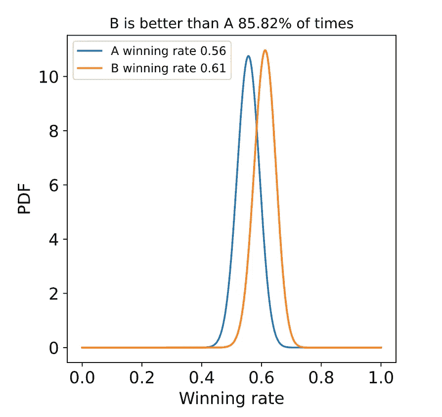
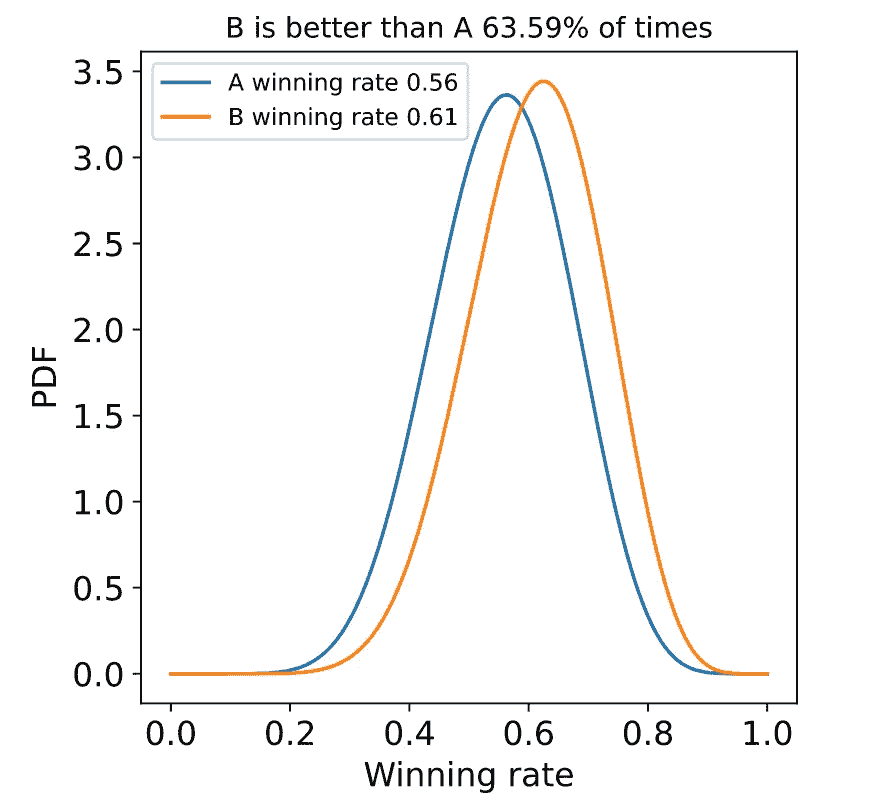
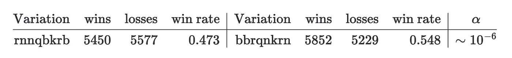
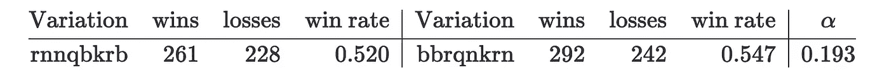
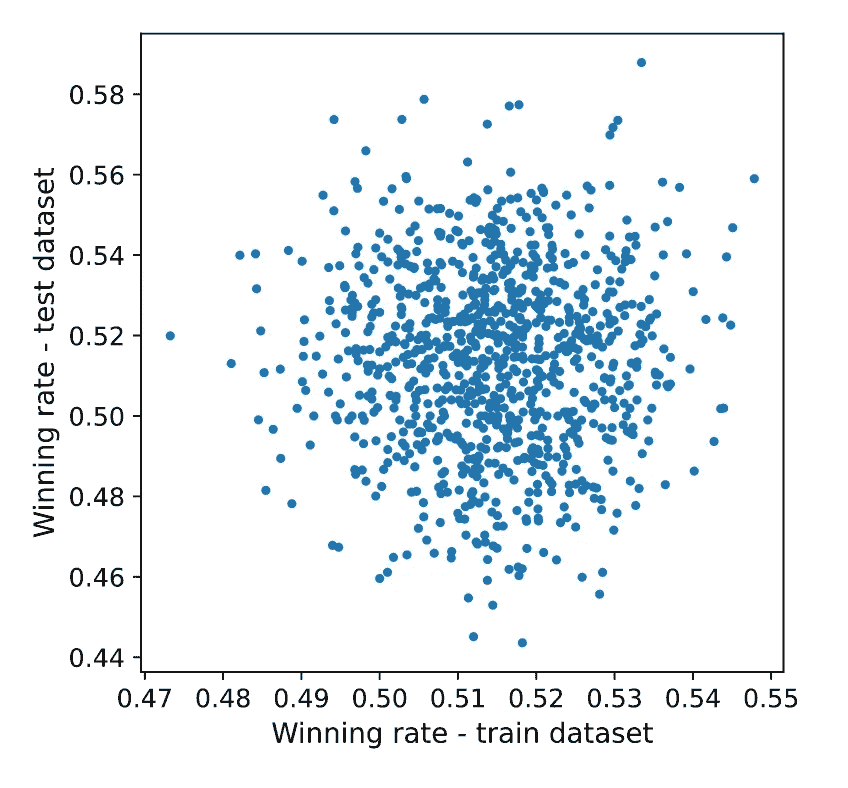
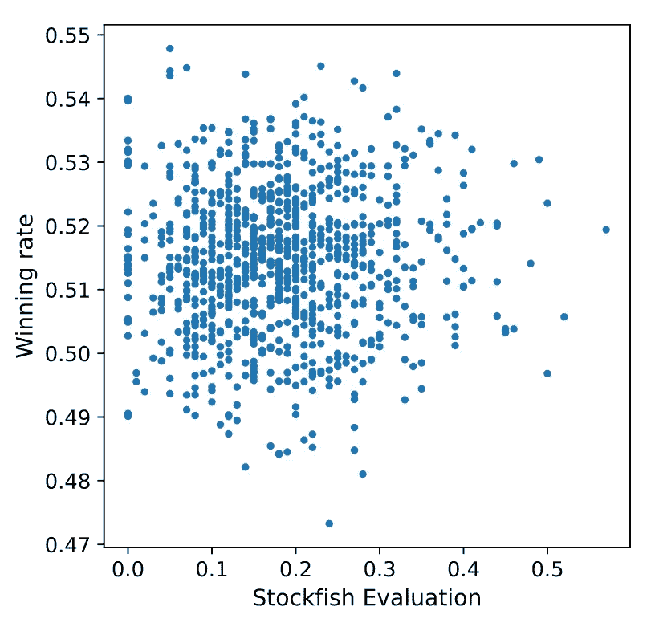
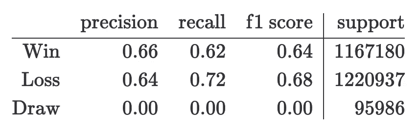
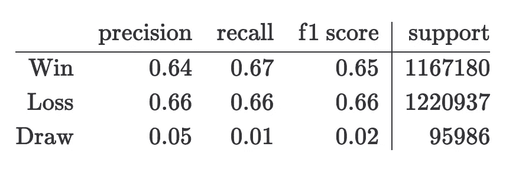

# 分析 Chess960 数据

> 原文：[`towardsdatascience.com/analyzing-chess960-data-da5c8cdb01de?source=collection_archive---------12-----------------------#2023-01-13`](https://towardsdatascience.com/analyzing-chess960-data-da5c8cdb01de?source=collection_archive---------12-----------------------#2023-01-13)

## 使用超过 1400 万局 Chess960 游戏来找出是否有比其他变体更好的变体

[](https://medium.com/@alexmolasmartin?source=post_page-----da5c8cdb01de--------------------------------)[](https://towardsdatascience.com/?source=post_page-----da5c8cdb01de--------------------------------) [亚历克斯·莫拉斯](https://medium.com/@alexmolasmartin?source=post_page-----da5c8cdb01de--------------------------------)

·

[关注](https://medium.com/m/signin?actionUrl=https%3A%2F%2Fmedium.com%2F_%2Fsubscribe%2Fuser%2F8fa4cb38d347&operation=register&redirect=https%3A%2F%2Ftowardsdatascience.com%2Fanalyzing-chess960-data-da5c8cdb01de&user=Alex+Molas&userId=8fa4cb38d347&source=post_page-8fa4cb38d347----da5c8cdb01de---------------------post_header-----------) 发表于 [Towards Data Science](https://towardsdatascience.com/?source=post_page-----da5c8cdb01de--------------------------------) · 12 分钟阅读 · 2023 年 1 月 13 日 [](https://medium.com/m/signin?actionUrl=https%3A%2F%2Fmedium.com%2F_%2Fvote%2Ftowards-data-science%2Fda5c8cdb01de&operation=register&redirect=https%3A%2F%2Ftowardsdatascience.com%2Fanalyzing-chess960-data-da5c8cdb01de&user=Alex+Molas&userId=8fa4cb38d347&source=-----da5c8cdb01de---------------------clap_footer-----------)

--

[](https://medium.com/m/signin?actionUrl=https%3A%2F%2Fmedium.com%2F_%2Fbookmark%2Fp%2Fda5c8cdb01de&operation=register&redirect=https%3A%2F%2Ftowardsdatascience.com%2Fanalyzing-chess960-data-da5c8cdb01de&source=-----da5c8cdb01de---------------------bookmark_footer-----------)

在这篇文章中，我分析了 Lichess 上所有可用的 Chess960 游戏。通过这些信息，并使用贝叶斯 A/B 测试，我展示了没有哪个起始位置比其他位置更有利于任何一方。

原始文章发布于 [这里](https://www.amolas.dev/blog/chess-960-initial-position/)。所有图片和图表，除非另有说明，均由作者提供。


图片由 [哈桑·帕莎](https://unsplash.com/@hpzworkz?utm_source=medium&utm_medium=referral) 提供，来源于 [Unsplash](https://unsplash.com/?utm_source=medium&utm_medium=referral)

# 介绍

世界费舍尔随机棋锦标赛最近在雷克雅未克举行，[GMHikaru](https://twitter.com/GMHikaru) 胜出。费舍尔随机棋，也被称为 Chess960，是经典棋局的一种独特变体，它随机化棋子的起始位置。这一改变的目的是通过消除记忆开局的优势来平衡比赛，使玩家不得不依靠自己的技巧和创造力。

在跟踪这一事件的过程中，我心中出现了一个问题：是否有某些初始 Chess960 变体会给某一方带来不公平的优势？目前标准棋局的初始位置给白方略微的优势，白方通常赢得约 55% 的比赛点数（[参考](https://en.wikipedia.org/wiki/First-move_advantage_in_chess)），Stockfish 给白方的评分为 +0.3（[参考](https://lichess.org/analysis)）。然而，这一优势相对较小，这可能是该位置成为标准位置的原因之一。

关于这个主题已有一些工作。Ryan Wiley 写了这篇[博客文章](https://lichess.org/@/rdubwiley/blog/using-lichesss-public-data-to-find-the-best-chess-960-position/GCpB9WLH)，他在文章中分析了 lichess 上的数据，并得出了一些变体优于其他变体的结论。文章中提到某些棋局对白方的胜率更高，但他没有展示这一说法的显著性。这让我觉得也许他的发现需要重新审视。他还训练了一个机器学习模型，以变体和玩家的 ELO 为输入来预测比赛结果。最终模型的准确率为 65%。

另一方面，还有这个[仓库](https://github.com/welyab/chess960-win-by-position-setup)，其中包含了 450 万场比赛的统计数据（每个变体约 4500 场比赛）。在这个仓库中，列出了白方和黑方的最大差异，但同样没有给出统计显著性。

最后，还有一些关于这个主题的计算机分析研究。在这个[电子表格](https://docs.google.com/spreadsheets/u/1/d/1JVT6_ROOlCTtMmazzBe0lhcGv54rB6JCq67QOhaRp6U/edit#gid=0)中，包含了所有起始位置的 Stockfish 深度 ~40 评估。有趣的是，没有一个位置 Stockfish 给黑方提供优势。还有这个[数据库](http://computerchess.org.uk/ccrl/404FRC/opening_report_by_white_score.html)，其中包含了不同计算机引擎之间的 Chess960 比赛。然而，我目前只对分析人类比赛感兴趣，所以对这类比赛不会给予过多关注，也许在未来的文章中会涉及。

由于之前的工作没有解决给每种 Chess960 变体的获胜机会赋予统计信心的问题，我决定尝试一下。

# 简而言之

在这篇文章中，我分析了所有在 Lichess 上进行的 Chess960 比赛。通过这些信息，我展示了

1.  使用贝叶斯 AB 测试，我展示了没有任何起始位置比其他位置更有利于任何一方。

1.  此外，变体过去的获胜率并不预测该变体未来的获胜率。

1.  并且 Stockfish 的评估并不预测每个变体的实际获胜率

1.  最后，知道正在使用的变体并不能帮助预测获胜者。

# 数据

Lichess——世界上最伟大的国际象棋平台——维护了一个 [数据库](https://database.lichess.org/) ，其中包含了他们平台上所有已进行的游戏。为了进行分析，我下载了所有可用的 Chess960 数据（直到 2022 年 12 月 31 日）。对于所有进行的游戏，我提取了变体、玩家的 ELO 以及最终结果。这些数据可以在 [Kaggle](https://www.kaggle.com/datasets/alexmolas/chess-960-lichess) 上获得。用于下载和处理数据的脚本和笔记本可以在这个 [repo](https://github.com/AlexMolas/chess-960) 上找到。

我使用的数据是根据 [Creative Commons CC0 许可协议](https://tldrlegal.com/license/creative-commons-cc0-1.0-universal) 发布的，这意味着你可以将其用于研究、商业目的、出版等任何你喜欢的用途。你可以下载、修改和再分发这些数据，无需请求许可。

# 数学框架

## 贝叶斯 A/B 测试

根据上述的先前工作，一些变体比其他变体更好。但我们如何确保这些差异在统计上是显著的呢？为了解答这个问题，我们可以使用著名的 A/B 测试策略。也就是说，我们首先假设变体*A*比变体*B*具有更大的获胜机会。零假设则是*A*和*B*具有相同的获胜率。为了排除零假设，我们需要证明在零假设的假设下观察到的数据是如此极端，以至于继续相信零假设没有意义。为此，我们将使用贝叶斯 A/B 测试 [1](https://www.amolas.dev/blog/chess-960-initial-position/#fn:1)。

在贝叶斯框架下，我们为每个变体分配一个获胜率的概率分布。也就是说，不是说变体*A*的获胜率是`X%`，而是说变体*A*的获胜率有某种概率分布。建模这种问题时，自然的选择是使用贝塔分布 ([ref](https://www.countbayesie.com/blog/2015/4/25/bayesian-ab-testing))。

贝塔分布被定义为


其中 *B(a, b) = Γ(a)Γ(b)/Γ(a+b), Γ(x)* 是伽马函数，对于正整数 *Γ(n) = (n-1)!*。对于给定的变体，参数α可以解释为白方胜利的次数加一，而β则为白方失败的次数加一。

现在，对于两种变体*A*和*B*，我们想知道*A*的胜率比*B*的胜率大的可能性。数值上，我们可以通过从*A*和*B*中抽取*N*个值，即*w_A*和*w_B*，并计算*w_A > w_B*的比例来做到这一点。然而，我们可以通过解析的方法计算这一点，从


注意，Beta 函数可能会给出非常大的数字，因此为了避免溢出，我们可以使用`log`进行转换。幸运的是，许多统计软件包都有对数 Beta 函数的实现。通过这种转换，项被转换为


这在 python 中实现，使用`scipy.special.betaln`对数 B(a, b)的实现，如

```py
import numpy as np
from scipy.special import betaln as logbeta

def prob_b_beats_a(n_wins_a: int, 
                   n_losses_a: int, 
                   n_wins_b: int, 
                   n_losses_b: int) -> float:

  alpha_a = n_wins_a + 1
  beta_a = n_losses_a + 1

  alpha_b = n_wins_b + 1
  beta_b = n_losses_b + 1
  probability = 0.0
  for i in range(alpha_b):
    total += np.exp(
      logbeta(alpha_a + i, beta_b + beta_a)
      - np.log(beta_b + i)
      - logbeta(1 + i, beta_b)
      - logbeta(alpha_a, beta_a)
    )
  return probability
```

使用这种方法，我们可以计算一个变体比另一个变体更好的可能性，并由此定义一个阈值*α*，使得我们可以说，如果*Pr(p_A>p_B)<1-α*，则变体*B*显著优于变体*A*。

下面你可以看到一些 Beta 分布的图。第一幅图中，参数为*α_A*= 100，*β_A*=80，*α_B*=110 和*β_B*=70。



参数为*α_A*= 100，*β_A*=80，*α_B*=110 和*β_B*=70 的 Beta 分布

在第二幅图中，参数为*α_A*= 10，*β_A*=8，*α_B*=11 和*β_B*=7。



参数为*α_A*= 10，*β_A*=8，*α_B*=11 和*β_B*=7 的 Beta 分布

注意，即使在两种情况下胜率相同，但分布看起来不同。这是因为在第一种情况下，我们对实际胜率的确定性更高，这是因为我们观察到了比第二种情况更多的点。

## 家庭错误率

通常，在 A/B 测试中，人们仅比较两个变体，例如：白色背景与蓝色背景的网站转换率。然而，在这个实验中，我们不仅仅是在比较两个变体，而是比较所有可能的变体对——记住我们想找出是否有至少一个变体优于另一个变体——因此，我们所做的比较数量是 960*959/2 ~ 5e5。这意味着使用典型值*α=0.05*是不正确的，因为我们需要考虑到我们进行的比较数量。例如，假设所有初始位置的胜率分布相同，使用标准值会有一定的概率


至少观察到一个假阳性！这意味着即使在任何变体对之间没有统计显著差异的情况下，我们仍将观察到至少一个假阳性。如果我们想保持相同的*α*但将比较数量从 2 增加到，我们需要定义一个有效的*α*，如


并解决


插入我们的值后，我们最终得到*α_eff =1e-7*。

## 列车/测试分割

在前面的部分，我们发展了理论，以确定一种变体是否比另一种变体更好，基于观察到的数据。也就是说，在看到一些数据后，我们建立了`变体 B 优于变体 A`的形式的假设。然而，我们不能使用用于生成假设的数据来验证假设的真实性。我们需要在尚未使用的数据集上测试这个假设。

为了实现这一点，我们将把完整的数据集拆分成两个不相交的`train`和`test`数据集。`train`数据集将与贝叶斯 A/B 测试框架一起使用，以生成*B>A*形式的假设。然后，使用`test`数据集，我们将检查这些假设是否成立。

请注意，这种方法只有在赢率的分布随时间不变时才有意义。这似乎是一个合理的假设，因为，据我所知，过去几年没有发生过重大的理论进展来改变某些变体的获胜概率。实际上，最小化理论和准备对游戏结果的影响是 Chess960 的目标之一。

## 数据准备

在前面的部分，我们隐含地假设一局游戏要么赢，要么输，但它也可能是平局。我为胜利分配了`1`分，为平局分配了`1/2`分，为失败分配了`0`分，这是国际象棋比赛中通常的做法。

# 结果

在这一部分，我们将应用上面解释的所有技术到 lichess 数据集中。在数据集中，我们有超过 1300 万局游戏，这大约是每种变体 1.4 万局。然而，数据集包含了大量不同的玩家和时间控制（从 ELO 900 到 2000，从快速棋到经典棋）。因此，使用所有游戏进行比较将意味着忽视混杂变量。为避免这个问题，我只使用了 ELO 在（1800, 2100）范围内且使用快速棋时间控制的玩家的游戏。我意识到这些筛选条件与世界费舍尔随机国际象棋锦标赛等顶级比赛的现实情况不符，但在 lichess 数据中，高等级玩家（>2600）的经典 Chess960 游戏并不多，所以我将只使用游戏数量更多的组。在应用这些筛选条件后，我们得到一个包含约 240 万局游戏的数据集，每种变体约有 2500 局。

列车/测试分割是通过时间分割完成的。`2022-06-01`之前的所有游戏都属于训练数据集，而该日期之后的所有游戏都属于测试数据集，这大约占训练数据的 80%和测试数据的 20%。

## 生成假设

第一步是通过 A/B 测试生成一组假设。要比较的变化对数量相当大（1e5），测试所有这些变化对会花费很多时间，因此我们只比较获胜率最高的 20 个变化与获胜率最低的 30 个变化。这意味着我们将有 900 对变化进行比较。在这里，我们看到 `train` 数据集中差异较大的变化对。



注意到这些变化的 *α* 大于 *α*_*eff*，这意味着差异不显著。由于这些是差异较大的变化，我们知道没有任何变化对具有统计学上显著的差异。

尽管差异不显著，但从这张表格可以假设变化 `rnnqbkrb` 比变化 `bbqrnkrn` 更差。如果我们在 `test` 数据集中检查这些变化值，我们会得到



注意到“差”的变化的获胜率仍然低于“好”的变化，然而，它已经从 `0.473` 增加到 `0.52`，这差距还是很大的。这提出了一个新问题：过去的变化表现是否能保证未来的表现？

## 过去与未来的表现

在上一部分，我们已经看到如何生成和测试假设，但我们也注意到一些变化的表现会随时间变化。在这一部分，我们将更详细地分析这个问题。为此，我计算了 `train` 和 `test` 数据集中的获胜率，并将它们绘制在一起进行比较。



训练与测试的获胜率

如我们所见，过去的获胜率与未来的获胜率之间没有关系！

## 评估与率

我们已经看到过去的表现不能保证未来的表现，但 Stockfish 评估能否预测未来的表现？在接下来的图表中，我展示了 Stockfish 对每个变化的评估以及数据集中相应的获胜率。



Stockfish 评估与每个变化的获胜率

## 机器学习模型

直到现在，我们已经看到在 Chess960 游戏中没有更好的变化，并且过去的表现不能保证未来的表现。在这一部分，我们将看看是否可以根据变化和玩家的 ELO 预测哪一方将赢得比赛。为此，我将训练一个机器学习模型。

模型的特征包括白棋和黑棋的 ELO、正在进行的变体以及使用的时间控制。由于变体特征的基数很大，我将使用`CatBoost`，该模型专门设计用于处理分类特征。此外，作为基准，我将使用一个模型，该模型预测如果`White ELO > Black ELO`则白棋获胜，`White ELO == Black ELO`则平局，`White ELO < Black ELO`则白棋失败。通过这个实验，我想了解变体对预期胜率的影响。

在接下来的表格中，我展示了两个模型的分类报告。

+   CatBoost 模型



+   基准模型



从这些表格中，我们可以看到 CatBoost 和基准模型的结果几乎相同，这意味着知道正在进行的变体并不有助于预测游戏结果。注意，结果与[这里](https://lichess.org/@/rdubwiley/blog/using-lichesss-public-data-to-find-the-best-chess-960-position/GCpB9WLH)获得的结果相符（准确率 ~65%），但在链接的博客中假设知道变体有助于预测赢家，而我们已经看到这并不成立。

# 结论与评论

在这篇文章中，我展示了

+   使用标准阈值来确定显著结果在进行多次比较时不有效，需要进行调整。

+   胜率没有统计学上的显著差异，即：我们不能说某个变体比另一个变体对白棋更有利。

+   过去的比率不能暗示未来的比率。

+   Stockfish 评估无法预测胜率。

+   知道正在进行的变体并不有助于预测比赛结果。

然而，我意识到我使用的数据并不代表我最初想研究的问题。这是因为 Lichess 上的数据偏向于非职业玩家，即使我使用了来自具有良好 ELO（从 1800 到 2100）的玩家的数据，但他们距离参加 Chess960 世界杯的玩家（>2600）还很远。问题在于，ELO >2600 的玩家数量非常少（根据[chess.com](https://www.chess.com/players?page=10)的数据显示为 209），而且并不是所有人都在 Lichess 上定期进行 Chess960 比赛，因此具有这种特征的棋局数量几乎为零。
