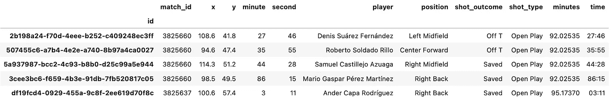
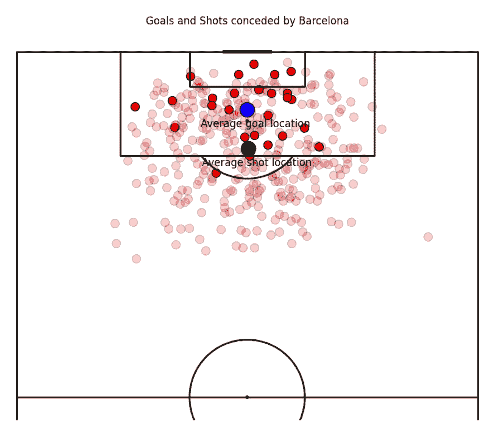
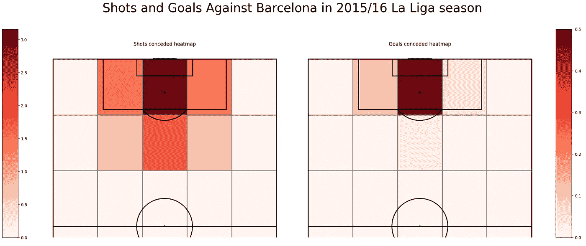
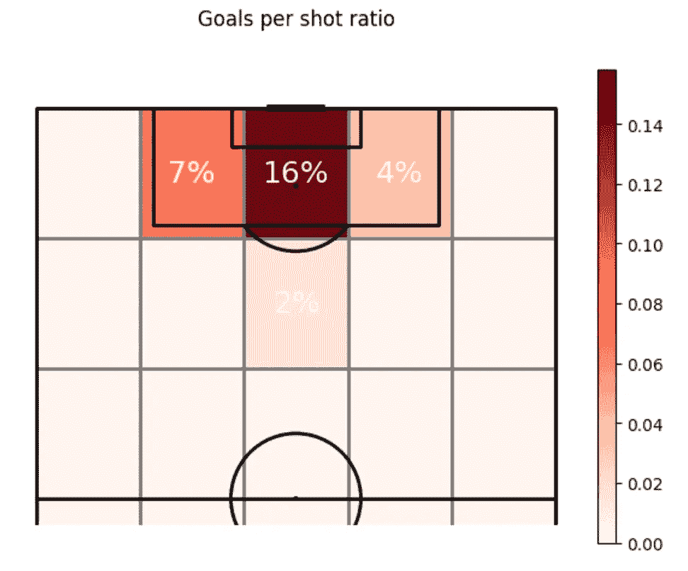
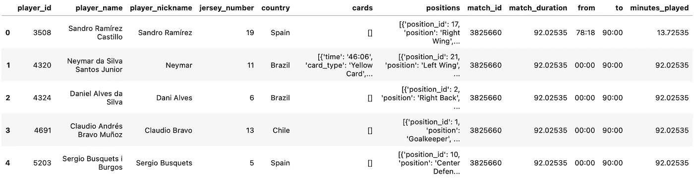
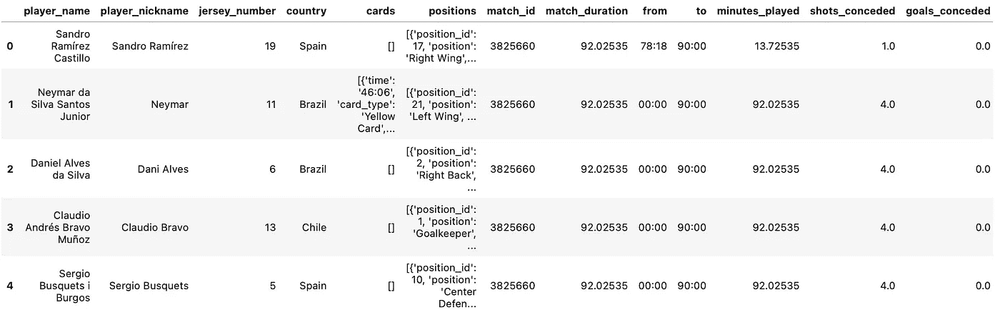
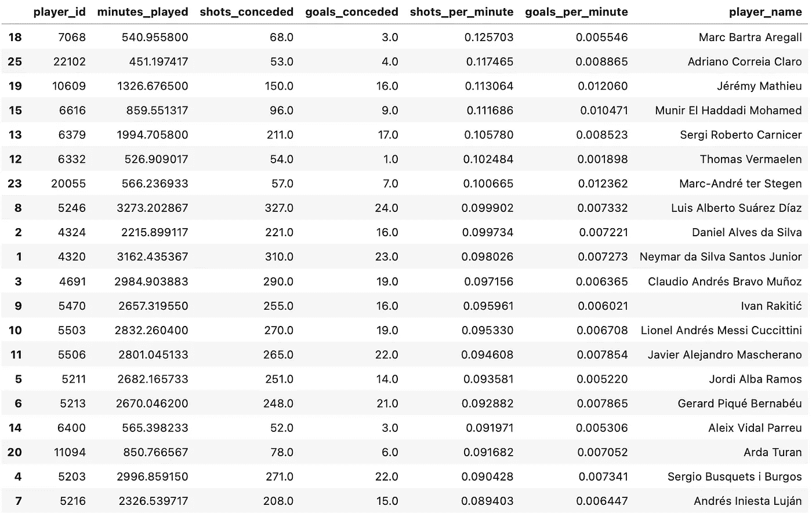
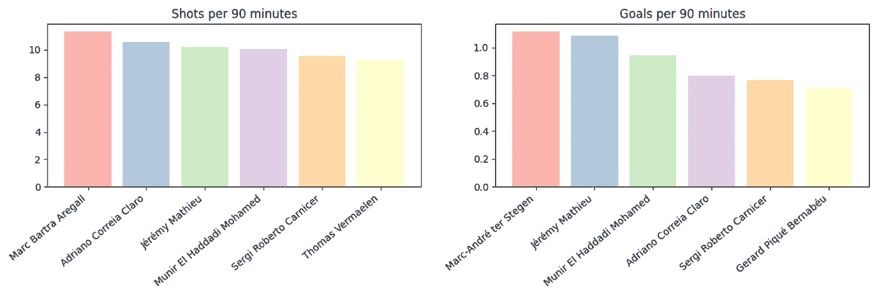

# 从数据科学的角度分析 FC 巴塞罗那的防守

> 原文：[`towardsdatascience.com/analyzing-fc-barcelonas-defense-from-a-data-science-perspective-76797018b0b3`](https://towardsdatascience.com/analyzing-fc-barcelonas-defense-from-a-data-science-perspective-76797018b0b3)

## 体育分析

## 通过视觉数据比较来说明巴萨防守的漏洞

[](https://polmarin.medium.com/?source=post_page-----76797018b0b3--------------------------------)[](https://towardsdatascience.com/?source=post_page-----76797018b0b3--------------------------------) [Pol Marin](https://polmarin.medium.com/?source=post_page-----76797018b0b3--------------------------------)

·发布于 [Towards Data Science](https://towardsdatascience.com/?source=post_page-----76797018b0b3--------------------------------) ·13 分钟阅读·2023 年 8 月 10 日

--


照片由 [Alessio Patron](https://unsplash.com/@alessiop?utm_source=medium&utm_medium=referral) 提供，来源于 [Unsplash](https://unsplash.com/?utm_source=medium&utm_medium=referral)

## 简介

几天前我发布了我的第一个体育分析文章。对这一话题仍然充满兴趣，现在我又在写关于足球的内容。

在下文中 — 链接见下方 — 我使用了频率统计来演示进球事件的随机性。但我将其更进一步。文中解释的随机模型 — 受到泊松分布的影响 — 在许多与足球无关的领域也适用。

[](/how-random-are-goals-in-soccer-8a822c1f3bc?source=post_page-----76797018b0b3--------------------------------) ## 足球进球的随机性有多大？

### 通过频率统计理解进球事件

towardsdatascience.com

今天我们将更进一步，尽管这将以足球为中心，但我们将要了解的过程和知识对于任何数据科学家都是相关的。

从足球角度来看，我们将专注于防守，分析巴萨的防守，看看在哪些方面可以改进，无论是在团队还是个人层面。

由于防守是一个广泛的术语 — 包括铲球、扑救、拦截和许多其他高级统计数据 — 我将更加具体，专注于射门和失球。

在 2015–16 赛季的西甲中，巴萨是第二少失球的球队（29 球），仅次于马竞（18 球）。尽管这已经不错，但仍有改进的空间。

目标不是提供解决方案，那是教练组的工作。我们今天作为数据科学家或体育分析师的目标是发现问题并提出假设，以便教练组可以根据这些信息解决场上的问题。

这是我们今天将要探讨的内容的简要总结：

1.  背景和上下文。

1.  获取数据、转换和准备数据。

1.  分析 FCB 的射门和丢球。

1.  更深入地分析每个球员的射门和丢球。

**所有的代码都将在我的 GitHub 仓库** [1]中提供，链接在资源部分，因此我将在此跳过部分代码，以免大段代码分散读者对内容的关注。

## 上下文

没有背景信息的数据科学问题是无法解决的。我们需要深入理解我们所处理的数据。如果没有这样做，我们无法得出有用的结论。

**数据需要上下文才能转化为信息**。

让我们回到过去。2015-16 赛季西甲联赛是一个有趣的赛季。F.C.巴萨以 91 分获得冠军，紧随其后的是只差 1 分的皇家马德里（90 分），而马德里竞技获得 88 分。

最后一轮比赛将决定一切。但三队都赢得了各自的比赛，因此排名没有变化。巴萨赢得了冠军。

在那个赛季，巴萨还赢得了国王杯和欧洲超级杯，但在冠军联赛和西班牙超级杯中惨遭失败。在冠军联赛中，他们在四分之一决赛被马德里竞技淘汰，在西班牙超级杯中，他们以总比分 1-5 输给了毕尔巴鄂竞技。

显然，巴萨的防守存在问题。在那次西甲赛季中，他们被进球次数比马德里竞技多了 11 次（增加了 61%）。看起来 MSN 进攻组合（梅西-苏亚雷斯-内马尔）在大多数比赛中弥补了球队的防守。

但奇迹是不存在的。

四名常规防守首发球员是阿尔维斯、皮克、马斯切拉诺和阿尔巴。这些都是世界级的防守球员，但显然他们并没有打满所有比赛时间。替补球员包括马蒂厄、罗贝托、阿德里亚诺、巴尔特拉、维尔马伦……如果看替补席，水平下降了不少。

我们可以怪罪替补球员吗？也许不能。我想指出的是，阿尔维斯和阿尔巴都是相当进攻的边后卫……这是否导致他们的球队丢了更多的射门或进球？

我们今天的任务是分析防守，看看是否能发现潜在的缺陷。

## 获取数据、转换和准备数据

现实世界中的原始数据永远不会被清理和准备好以供数据科学家使用。大多数时候，代码将用于处理数据集并将其转换为我们项目所需的精确数据。

对于今天的目的，我们将使用 StatsBomb 的免费开放数据[2]。我们还将使用`statsbombpy`[3]模块对数据进行处理。

你可以通过运行以下命令来安装它：

```py
pip install statsbombpy
```

我们还将使用一些你可能需要安装的其他模块。如果尚未安装，请先安装这些模块，然后导入它们：

```py
import matplotlib
import matplotlib.pyplot as plt
from mplsoccer import VerticalPitch
import numpy as np
import pandas as pd
from statsbombpy import sb
```

我们现在准备好检索数据。由于我们需要检查 2015–16 赛季 FCB 的射门和失球，我们首先需要获取该比赛和赛季的所有比赛数据：

```py
competition_row = sb.competitions()[
    (sb.competitions()['competition_name'] == 'La Liga') 
    & (sb.competitions()['season_name'] == '2015/2016')
]
competition_id = pd.unique(
    competition_row['competition_id']
)[0]
season_id = pd.unique(
    competition_row['season_id']
)[0]

matches = sb.matches(competition_id=competition_id, season_id=season_id)
```

然后，对于每场比赛，我们可以轻松地通过以下方式检索其事件：

```py
match_events = sb.events(match_id=match_id)
```

因此，我们提取了所有巴萨比赛中的所有事件，并创建了一个包含所有事件的数据框：`all_events`。我们还创建了两个额外的列，因为它们对于后续分析会很有用：

+   一个叫做`minutes`的列，其在同一场比赛的所有行中具有相同的值：它的持续时间。

+   另一个叫做`time`，它只是`minute`和`second`列中值的连接。

最终，`all_events`数据框被过滤以仅保留对手球队的射门。结果如下：

```py
shots_against_team.head()
```



shots_against_team DF 中的前 5 行 — 图片由作者提供

StatsBomb 的数据非常棒。完整且准确。今天对我们有用的是射门发生的位置，由`x`和`y`列标记。因此，我们可以使用这些数据来进行可视化。

## 分析 FCB 的射门和失球

一旦我们拥有所有需要的数据，我们可以开始分析。像往常一样，绘图是我做的第一件事，因为这是理解我们所处理数据的最佳方式。

我们将使用来自`mplsoccer`[4]模块的`VerticalPitch`类来展示射门和进球的位置：

```py
# Set up pitch (layout)
pitch = VerticalPitch(line_zorder=2, line_color='black', half = True)
fig, axs = pitch.grid(nrows=1, ncols=1, axis=False, endnote_height=0.05)

# Plot each shot
for row in shots_against_team.itertuples():
    if row.shot_outcome == 'Goal':
        # If it was a goal, we want to see it clearly
        alpha = 1
    else:
        # Increase transparency if it wasn't a goal
        alpha = 0.2
    pitch.scatter(
        row.x, 
        row.y, 
        alpha = alpha, 
        s = 100, 
        color = "red", 
        ax=axs['pitch'],
        edgecolors="black"
    )
```

这段简单的代码允许我们绘制半个足球场，并将射门用红色标记，透明度根据是否进球而有所不同。此外，我还添加了两个额外的点，分别表示平均射门和进球的位置（绿色和蓝色）。



2015–16 赛季西甲联赛中 FCB 的射门和失球 — 图片由作者提供

两个平均值都相当集中（略微偏向左侧），而进球位置比射门平均位置更靠近球门。毫不奇怪，射门越接近球门，进球越容易。

继续分析射门，唯一无法忽视的就是：在禁区外，射门似乎更多来自右侧（尽管相对均匀）。但在禁区内，射门明显偏向左侧。

那是阿尔维斯和皮克的一侧。

如果我们关注进球，来自左侧的进球更为分散，而右侧的进球在图中看起来更为集中或聚集。

以下代码片段用于创建射门热图。如果我们对进球应用相同的方法，我们会得到热图，用于更好地展示射门和进球在场地不同区域的分布。

```py
pitch = VerticalPitch(line_zorder=2, line_color='black', half = True)
fig, axs = pitch.grid(nrows=1, ncols=2, axis=False, endnote_height=0.05)

shot_bin_statistic = pitch.bin_statistic(
    shots_against_team.x, 
    shots_against_team.y, 
    statistic='count', 
    bins=(6, 5), 
    normalize=False
)
#normalize by number of games
shot_bin_statistic["statistic"] = shot_bin_statistic["statistic"]/len(team_matches)
#make a heatmap
pcm  = pitch.heatmap(shot_bin_statistic, cmap='Reds', edgecolor='grey', ax=axs['pitch'][0])
#legend to our plot
ax_cbar = fig.add_axes((-0.05, 0.093, 0.03, 0.786))
cbar = plt.colorbar(pcm, cax=ax_cbar)
axs['pitch'][0].set_title('Shots conceded heatmap')

fig.suptitle(f"Shots and Goals Against {team} in 2015/16 La Liga season", fontsize = 30)
```

如果我们绘制两个热图，我们会得到：



2015–16 赛季西甲联赛中 FCB 的射门和失球 — 图片由作者提供

现在，显然，大多数射门和进球都来自中心和离球门最近的位置。一旦球在那儿，只有射门才有意义。

射门热图几乎是完全对称的，这因为我们将其分成了 5 个区间或列。如果我们选择更多区间，可能会更清楚地看到左侧偏斜。

但我们可以在进球热图中看到这一点。巴萨在阿尔维斯-皮克的一侧丢球比在马斯切拉诺-阿尔巴的一侧更多。

在分析一个团队的防守时，有几个因素非常重要。最终目标是查看他们失败的原因以及我们如何减少丢球的数量。一个团队可以通过多种方式实现这一点，但减少对方射门次数显然是一种减轻丢球数量的方式。

然而，今天我们还没有将射门与进球联系起来。我们将通过构建一个新的**KPI**来实现这一点，这是今天的第一个 KPI。

**关键绩效指标**（KPIs）在任何数据科学或分析项目中都极其重要。选择正确的 KPIs 可以让我们评估和正确地评估我们使用的策略，而选择不准确的 KPIs 则会导致无用和误导性的分析。

今天的第一个 KPI 将是**每次射门进球比率**，作为检查对手在射门时得分机会的方式：

```py
# Count goals per heatmap bin
goal_bin_statistic = pitch.bin_statistic(
    shots_against_team.loc[shots_against_team['shot_outcome'] == 'Goal'].x, 
    shots_against_team.loc[shots_against_team['shot_outcome'] == 'Goal'].y, 
    statistic='count', 
    bins=(6, 5), 
    normalize=False
# Count shots per heatmap bin
shot_bin_statistic = pitch.bin_statistic(
    shots_against_team.x, 
    shots_against_team.y, 
    statistic='count', 
    bins=(6, 5), 
    normalize=False
)

# Create goal_shot_ratio KPI by dividing goals/shots
goal_shot_ratio = goal_bin_statistic.copy()
goal_shot_ratio['statistic'] = np.divide(goal_bin_statistic['statistic'], shot_bin_statistic['statistic'])
goal_shot_ratio['statistic'] = np.nan_to_num(goal_shot_ratio['statistic'])
```

下面是这个新统计数据绘制成热图的结果：



对 FCB 的每次射门进球比率 — 图片由作者提供

我们可以清晰地看到之前提到的左侧偏斜。当对方从阿尔维斯和皮克的一侧射门时，在禁区内丢球的机会几乎是从马斯切拉诺和阿尔巴的一侧射门丢球概率的两倍。

这并不意味着皮克比马斯切拉诺差，我当然不这样认为。我们只是说，从左侧射门比从右侧射门更容易导致丢球。

## 深入分析 — 球员分析

我觉得我们一直在责怪皮克和阿尔维斯，但我们甚至还没有比较他们的个人数据。因此，我们将深入分析这些球员的个人表现，再次从射门和丢球的角度来看。

如果这种不对称的原因是因为替补球员在首发球员疲劳或受伤时替换他们，那会怎么样？如果在个人层面上，他们的射门和丢球表现是一样的呢？

这就是我们现在要分析的内容，但我们首先需要准备数据。我们需要知道每个球员在每场比赛中打了多少分钟，球队在他们在场时丢了多少球……

我们将使用`statsbombpy`的阵容数据，结合我们已经建立的事件数据框来获取这些数据：

```py
all_lineups = None
for match_id in pd.unique(all_events['match_id']):
    match_lineups = sb.lineups(match_id=match_id)['Barcelona']

    match_lineups['match_id'] = match_id
    match_lineups['match_duration'] = all_events[all_events['match_id'] == match_id]['minutes'].unique()[0]
    match_lineups['from'] = match_lineups['positions'].apply(lambda x: x[0]['from'] if x else np.nan)
    match_lineups['to'] = match_lineups.apply(lambda x: x['positions'][-1]['to'] if x['positions'] and x['positions'][-1]['to'] is not None else ('90:00' if x['positions'] else np.nan), axis=1)
    match_lineups['minutes_played'] = match_lineups.apply(lambda x: parse_positions(x['positions'], x['match_duration']), axis=1)

    if all_lineups is None:
        all_lineups = match_lineups.copy()
    else:
        all_lineups = pd.concat([all_lineups, match_lineups], join="inner")

all_lineups = all_lineups.reset_index(drop=True)
```

我们只是添加了一些有用的新列，并使用了一个自定义函数 — `parse_position()` — 来解析球员在比赛中在场的分钟数（也包括额外的加时）。



all_lineups 数据框的前 5 行 — 图片由作者提供

现在我们可以继续计算每个球员在场时，球队接到的射门和丢球的数量。

```py
 for match_id in pd.unique(all_lineups['match_id']):
    match_shots = shots_against_team[
      shots_against_team['match_id'] == match_id
    ]
    for player_tup in all_lineups[all_lineups['match_id'] == match_id].itertuples():

        # For whatever reason, the 'from' column is being mapped to '_10'
        shots_conceded = match_shots[
          (match_shots['time'] >= player_tup._10) 
          & (match_shots['time'] <= player_tup.to)
        ]
        goals_conceded = len(
          shots_conceded[shots_conceded['shot_outcome'] == 'Goal']
        )
        shots_conceded = len(shots_conceded)

        all_lineups.at[player_tup.Index,'shots_conceded'] = shots_conceded
        all_lineups.at[player_tup.Index,'goals_conceded'] = goals_conceded
```

新列在`all_lineups`数据框中的样子如下：



每场比赛按球员统计的射门和进球数 — 图片来源于作者

这很有用，因为它允许我们看到每场比赛当特定球员在场时的表现。让我们进一步深入探讨。

除了我们在前一部分创建的 KPI 之外，我们现在将生成两个新的 KPI：

+   **每分钟射门数**

+   **每分钟进球数**

```py
grouped = all_lineups.groupby('player_id')[
    ['minutes_played', 'shots_conceded', 'goals_conceded']
].sum()

grouped['shots_per_minute'] = \
    grouped['shots_conceded'] / grouped['minutes_played']

grouped['goals_per_minute'] = \
    grouped['goals_conceded'] / grouped['minutes_played']
```

如果我们排除那些每场比赛平均上场时间少于 10 分钟的球员，并按`shots_per_minute`变量对数据框进行排序，我们会得到以下结果：



显示球员与进球和被射门相关的统计数据的数据框 — 图片来源于作者

这再清楚不过了。前 6 名中有 5 名是替补防守球员：巴尔特拉、阿德里亚诺、马修、罗伯托和维尔马伦。这太疯狂了。

难怪路易斯·恩里克偏爱皮克、马斯切拉诺、阿尔维斯和阿尔巴。



每 90 分钟的射门和进球数 — 图片来源于作者

转化为每 90 分钟的射门数，当巴尔特拉在场时，球队每场比赛平均接收 11.31 次射门。与之相比，马斯切拉诺在场时每 90 分钟接收 8.51 次射门。

就每 90 分钟的进球数而言，我们仍然看到马修、阿德里亚诺和罗伯托位于表现最差的 6 名球员中。显然效率不高。

我们也看到了皮克，这解释了我们在热图上看到的左侧偏斜。

但让我们将这个放到团队背景中。来看看团队比例：

```py
Barcelona conceded 356 shots. An average of 9.37 shots per match.
Barcelona conceded 26 goals. An average of 0.68 goals per match.
```

这是相关的：

+   左侧图中的所有球员，除了维尔马伦外，每场比赛承受的射门数都高于球队平均水平。换句话说，这 5 名球员在防守上**表现不佳**。由于他们大多数是防守球员，这意味着球队在他们在场时防线挣扎。幸运的是，射门的增加并没有直接转化为进球。

+   如果我们看右侧图，所有 6 名球员都高于球队平均水平。当他们在场时，球队承受了更多的进球。这次，一半是替补防守球员。

## 结论

所有数据科学项目都需要得出结论。这可能是最重要的部分——提取洞见并与利益相关者分享是进行前期分析和研究的原因。

在我们的足球案例中，这就是我们如何结束分析并与那赛季的教练路易斯·恩里克分享：

作为一个团队，我们在那个赛季的防守排名第二。不算差，但距离最佳防守还相当远（相差 11 个进球）。我们承受的进球数超过了预期，减少这一数字的最佳方法是减少巴萨让对手射门的次数。

如果我们关注这些射门和进球，危险的射门（在禁区内）似乎偏向于皮克的一侧。我们不是在指责他，我们需要看看为什么会这样。

更深入的分析证明，如果我们要责怪某人，那不会是首发防守球员。在场时，对手的射门次数减少。是否转化为进球数量较少取决于多个因素，但确实存在相关性。

实际上，当像维尔马伦、马蒂厄、巴尔特拉、阿德里亚诺和/或罗伯托这样的球员上场时，球队每分钟受到的射门和进球数量最多。因此，在我看来，重点应该是寻找更好的防守选项来支持由阿尔维斯、比克、马斯切拉诺和阿尔巴建立的防守核心，或提升现有防守球员的表现。

比克和马斯切拉诺大部分时间主导了防守，这帮助巴萨赢得了他们赢得的奖杯。但即便比克在被射门方面是最好的防守者，当对手射门时，他们进球的几率还是比马斯切拉诺高。因果关系还是偶然性，我们永远无法知道（我会选择第二种）。

如果你对 2016 年转会窗口期间发生的事情感到好奇：阿德里亚诺、巴尔特拉和维尔马伦离开了俱乐部。马蒂厄再待了一个赛季，但他的出场次数大幅下降，在所有比赛中只踢了 16 场：他基本上是最后的选择。

罗伯托是唯一一个留下来并且保持了相当多的上场时间的人。

那个夏天，巴萨还尝试通过签下乌姆蒂蒂和迪涅来增强阵容——如果他们知道结果会是这样就好了……

从某种程度上说，今天的分析对 FCB 来说并不新鲜：他们已经在 2015–16 赛季结束时进行了类似分析，并看到了我们在他们防守中看到的相同问题。不知何故，他们未能签下足够的优质球员来改善情况，并在下赛季没有赢得西甲。

```py
**Thanks for reading the post!** 

I really hope you enjoyed it and found it insightful.

Follow me and subscribe to my mail list for more 
content like this one, it helps a lot!

**@polmarin**
```

## 资源

[1] [FCB 防守分析库 — GitHub](https://github.com/polmarin/fcb_defense_analysis)

[2] [StatsBomb 的许可证 — GitHub](https://github.com/statsbomb/statsbombpy/blob/master/doc/LICENSE.pdf)

[3] [statsbombpy — GitHub](https://github.com/statsbomb/statsbombpy)

[4] [mplsoccer — Readthedocs.io](https://mplsoccer.readthedocs.io/en/latest/index.html)
