# 使用 Python 分析地理空间数据（第二部分 - 假设检验）

> 原文：[`towardsdatascience.com/analyzing-geospatial-data-with-python-part-2-hypothesis-test-fe3f3f18fc82`](https://towardsdatascience.com/analyzing-geospatial-data-with-python-part-2-hypothesis-test-fe3f3f18fc82)

## 了解阿什维尔*AirBnb*房源的地理空间假设检验

[](https://gustavorsantos.medium.com/?source=post_page-----fe3f3f18fc82--------------------------------)[](https://towardsdatascience.com/?source=post_page-----fe3f3f18fc82--------------------------------) [Gustavo Santos](https://gustavorsantos.medium.com/?source=post_page-----fe3f3f18fc82--------------------------------)

·发表于 [Towards Data Science](https://towardsdatascience.com/?source=post_page-----fe3f3f18fc82--------------------------------) ·12 min read·2023 年 8 月 31 日

--


阿什维尔，NC 的蓝岭山脉。照片来自作者个人收藏。

# 介绍

在下方链接的第一篇文章中，我们介绍了地理空间数据分析，下载了*AirBnb*在北卡罗来纳州阿什维尔市的房源数据，并进行了一些步骤以从地理空间数据中提取洞察。

[](/analyzing-geospatial-data-with-python-7244c1b9e302?source=post_page-----fe3f3f18fc82--------------------------------) ## 使用 Python 分析地理空间数据

### 一篇包含 Python 代码的实用数据分析文章。

towardsdatascience.com

在那篇文章中，我们更多关注了租赁物业的集中区域及其价格。因此，我们得出结论：阿什维尔的房源集中在市中心区域，最高价格可以在蓝岭公路沿线看到，这可能是由于美丽的景色和乡村环境。

很好。我建议你阅读第一篇文章，以便你可以将初始代码和想法整合在一起，然后继续使用第二部分提供的知识。

## 数据集

如果你还不知道，AirBnb 是一个点对点的平台，供人们列出他们的房屋、房间或卧室供出租。它们的租赁数据由这个社区项目在网站 [`insideairbnb.com/`](http://insideairbnb.com/) 收集，任何人都可以访问并下载数据集进行分析。所以我们将继续使用相同的数据。数据在[Creative Commons Attribution 4.0 International License](http://creativecommons.org/licenses/by/4.0/)下开放。

# 在这篇文章中

在这篇文章中，我们将了解创建地理空间假设检验的组成部分。它们包括：

+   一阶和二阶效应

+   自相关

+   空间权重

+   邻接矩阵

+   莫兰指数（Moran’s I）

+   全球空间自相关

+   局部空间自相关

请注意，这里介绍了很多概念，但我们也会将所有内容一起编码。要进行此练习的编码，请导入以下内容：

```py
import pandas as pd
import numpy as np
import geopandas as gpd
import matplotlib.pyplot as plt
!pip install pysal
!pip install geoplot
import pysal
import seaborn as sns
import folium

# For points map
import geoplot.crs as gcrs
import geoplot as gplt

# packages for Hypothesis test
from pysal.explore import esda
from pysal.lib import weights
from esda.moran import Moran
from splot.esda import plot_moran
from splot import esda as esdaplot
```

让我们开始工作吧。

## 一阶效应和二阶效应

在处理地理空间数据时，我们在寻找模式。例如：

+   *是否存在租赁物业价格较高的地方？*

+   *这些地方彼此接近还是在空间中随机分布？*

这些问题是我们在寻找空间模式时考虑的。如果我们像在本文第一部分那样查看绘制在地图上的数据，我们可以快速识别模式并从中提取重要见解。然而，这可能只是偶然发生的。因此，存在统计测试以确保这些现象不仅仅是巧合，并为展示分析结果提供更多信心。

要创建假设检验，我们应考虑**一阶效应**，即观察值如何根据分析区域的变化在不同地方变化。**二阶效应**是观察值如何根据与其他观察值的互动在不同地方变化。

> 一阶效应是价格如何因区域内新建购物中心而变化。二阶效应是价格如何基于该区域租赁价格的平均值波动。

## 假设检验

了解到数据可能具有统计显著性模式或仅仅是偶然的，我们将构建我们的假设检验如下：

+   **Ho**：数据在空间中随机分布。*[p-Value >* ***α****]*

+   **Ha**：数据具有空间结构。*[p-Value <* ***α****]*

统计测试基于数据点的自相关。简单来说，这意味着我们将对正在研究的变量与其邻域中的观测值进行比较。

## 空间自相关

> 在本研究中，空间自相关是租赁物业的价格与同一区域内其他房源的相关性。

空间自相关可以是：

+   正相关：当高价房源靠近其他昂贵的出租房或便宜的房源靠近其他便宜的房源时。

+   负相关：当便宜的房源靠近昂贵的房源时。

+   无相关性：数据是随机分布的。

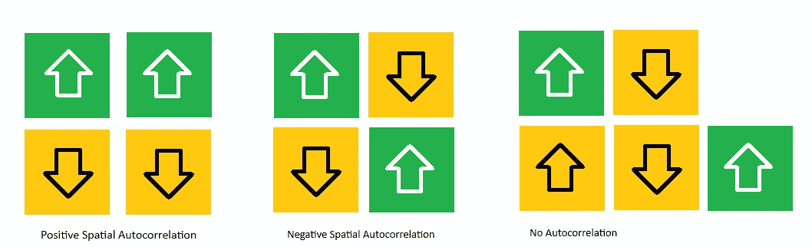

自相关类型。图片由作者提供。改编自 JORDAN (Packt, 2023)。

下一步是理解权重矩阵，因为它使得计算自相关成为可能。

## 权重矩阵和邻接

> 权重矩阵是一种表示数据空间结构的方式。

空间权重矩阵是用来数值化确定我们分析的数据点与其邻居之间关系的一种方式。因此，为了创建这个矩阵，我们首先需要了解另一个概念：*邻接性*。

邻接性就是邻里关系。它包括与正在分析的观察点共享共同边界的点。因此，如果你有一个中心点，围绕它的所有点将构成邻接点，就如图中黄色方块是邻接于红色中心方块的。

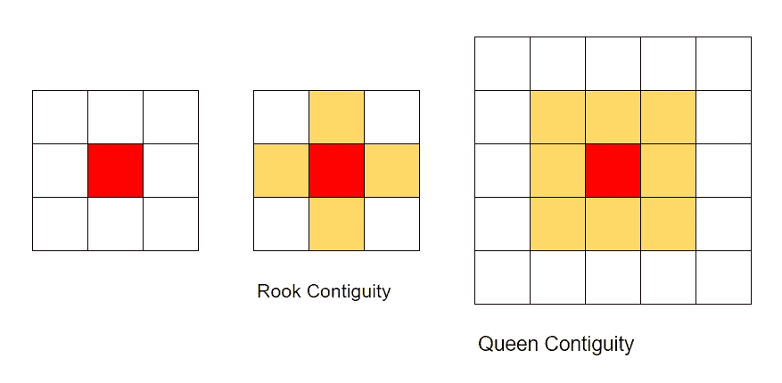

邻接性方法。图片由作者提供。

最常用的矩阵受到了国际象棋游戏移动的启发。它们是*车邻接矩阵* — **它考虑了所有共享边界的邻居，沿直线向上、向下和向侧面移动，就像车在国际象棋棋盘上的移动一样** — 还有*皇后邻接矩阵* — **它考虑了所有方向上的直接邻居，包括侧面和对角线，就像皇后在国际象棋棋盘上的移动一样**。

> 简而言之，邻接性就是邻里关系。

还有其他邻接矩阵，但我们只会概念性地讨论这两个矩阵，并且仅使用皇后权重矩阵进行编码。为了进行编码，代码片段非常简单。只需记住`listings_gpd`文件来自于这篇文章的第一部分，它是从 Asheville, NC 的 AirBnb 列表转换为 Geopandas 数据框创建的。*（注意：你将在本文末尾找到该练习的完整代码链接）*

```py
# Convert Pandas df to Geopandas df
listings_gpd = gpd.GeoDataFrame(listings,
                                geometry=gpd.points_from_xy(listings.longitude, listings.latitude, crs=4326))

# Generate weights Matrix W from the Geo Data
w = weights.Queen.from_dataframe(listings_gpd)
```

创建矩阵`W`就简单如斯。如果你想使用车邻接矩阵，只需将`Queen`替换为`Rook`。

之后，我们将通过将点的权重除以所有邻居权重的总和来标准化矩阵`W`。这是一个标准程序，以去除潜在的偏差。代码也非常简单。

```py
# Row Standardization
w.transform = 'R'
```

一旦计算了我们的权重，我们可以查看图形（如果需要），以了解在计算过程中什么与什么有关。

```py
from splot.libpysal import plot_spatial_weights
plot_spatial_weights(w, listings_gpd)
```

这是得到的结果图形。

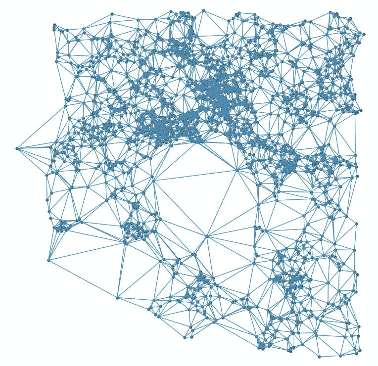

Asheville 的 AirBnb 列表的皇后 W 矩阵。图片由作者提供。

接下来，我们可以计算空间滞后，即你正在处理的变量的邻居的平均值。在我们的例子中，就是每个数据点周围的价格的平均值。这可以通过方法`lag_spatial`来计算，并将在下一部分中用于计算 Moran's I 统计量。

```py
# calculate the spatial lag
listings_gpd['price_lag'] = weights.spatial_lag.lag_spatial(w, listings_gpd['price'])
```

## Moran's I 和全局空间自相关

**莫兰指数**是一种统计量，用于衡量空间中所有点与其邻居之间的全局相关性。**结果显示了总体空间分布的趋势或强度**。该统计量是一个介于-1 和 1 之间的数值，以及一个用于检验统计显著性的 p 值。你可以在[维基百科](https://en.wikipedia.org/wiki/Moran%27s_I)上查看公式。

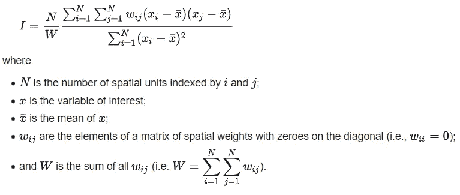

全球自相关公式：莫兰指数。图像来自[维基百科](https://en.wikipedia.org/wiki/Moran%27s_I)。

要计算莫兰指数，代码如下。请查看我们如何输入所需的变量`price`和权重矩阵`W`，这是我们空间中点之间关系的数值表示。通过这些，方法`esda.moran.Moran()`可以进行计算。

```py
# Calculating Moran's I for price (Global spatial correlation)
moran_stat = esda.moran.Moran(listings_gpd['price'], w)
print(f"Moran's I: {moran_stat.I}")
print(f"Moran's I p-Value: {moran_stat.p_sim}")

[OUT]
Moran's I: 0.2118266504045153
Moran's I p-Value: 0.001
```

结果返回了 0.21 的弱正相关，但在统计上是显著的，*p*值低于考虑的 0.05。这意味着，根据我们的数据点，总体趋势表明价格没有强相关。换句话说，价格不会形成太多高价或低价的聚类。

要绘制测试结果，只需一行代码。

```py
plot_moran(moran_stat);
```

上述代码将显示下图。

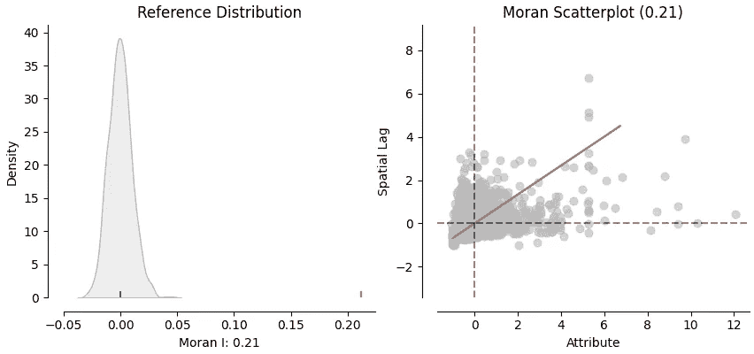

莫兰检验图。图像由作者提供。

解释你所看到的图：

+   左侧：我们可以看到每个点的统计密度分布（自相关）。我们可以注意到，大多数点都漂浮在零附近，从而确认了弱相关性。

+   右侧：这是每个价格与价格滞后（每个点邻域内价格的平均值）对比的图。如果你看到线性模式，这意味着更强的相关性，因此列表价格将高度相关，我们会看到许多价格高或低的聚类。

## 局部空间自相关（LISA）

虽然全局空间自相关返回一个莫兰指数的单一值，显示数据空间分布的趋势，但局部空间自相关将为每个点返回一个值，**测量每个点与其周围环境的关系。**这有助于识别局部聚类模式，其中高价位靠近其他高价租赁和低价-低价连接。

让我们计算数据集的局部数值。我们还可以绘制结果的密度图，以检查分布的情况。

```py
# Local Spatial Correlation
price_local_I = esda.moran.Moran_Local(listings_gpd['price'], w)

#Plotting the output density plot
sns.kdeplot(price_local_I.Is);
```

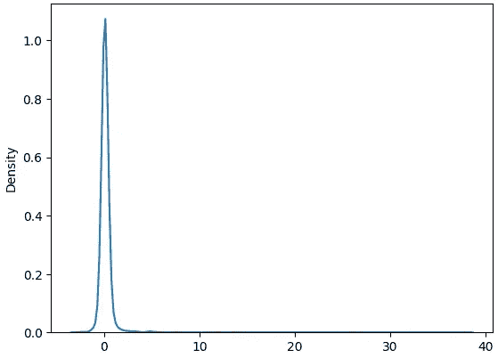

局部空间自相关密度图。图像由作者提供。

有趣的是，我们再次确认大多数点都在零附近，呈现出较弱的相关性，并且与全局数值（0.21）一致。

接下来，绘制这些点。

```py
# Figure
f, ax = plt.subplots(1, figsize=(12,8))

# plot choropleth of local statistics
(listings_gpd
 .assign(ML_I = price_local_I.Is)
 .plot(column = 'ML_I', cmap='vlag',
       scheme='quantiles',
       k=4,
       edgecolor='white',
       linewidth= 0.1,
       alpha=0.75,
       legend=True,
       ax=ax)
);
```

这是结果。

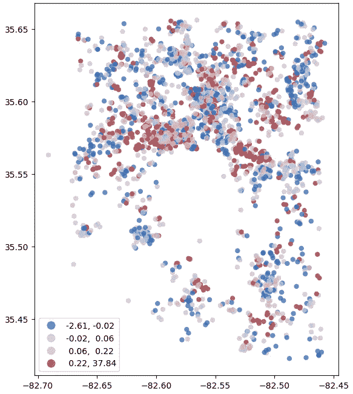

局部空间自相关统计散点图。图像由作者提供。

好的。如果我们考虑我们的`alpha = 0.05`，那么只有蓝色和浅蓝色的点会在统计上显著，因为备择假设（p 值 < ***α***）不是随机分布的点。因此，让我们再次绘制它，查看显著性。

首先，我们确定我们的 alpha 值并创建一个标签来标识仅低于阈值的点。然后我们将其添加到数据集`listings_gpd`中。

```py
# Determine what's statistically significant correlation
alpha = 0.05
labels = 1* (price_local_I.p_sim < alpha)

# Add to data frame
listings_gpd = listings_gpd.assign( stat_cd = labels)
listings_gpd['stat_label'] = listings_gpd.stat_cd.map({0:'Not stat significant', 1:'stat significant'})
```

接下来，我们绘制它。

```py
# Plot statistically significant correlation
listings_gpd.plot(
    column = 'stat_label',
    categorical=True,
    k=2,
    cmap='vlag',
    edgecolor = 'white',
    linewidth= 0.1,
    legend=True);
```

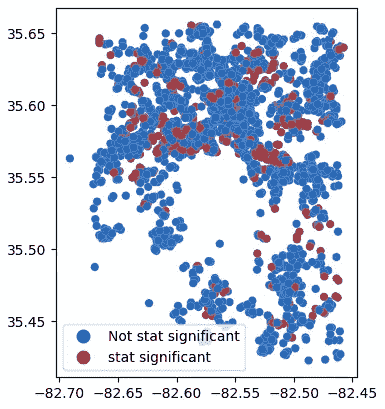

局部空间自相关的统计显著点。图片由作者提供。

另一种更快捷的选择是使用*splot*包中的`esdaplot.lisa_cluster`函数来绘制局部簇点（*HH=高值紧邻高值，HL=高值紧邻低值，LH=低值紧邻高值，LL=低值紧邻低值，ns=不显著*），将 alpha 值传递给参数 p `p=alpha`。

```py
# Figure
f, ax = plt.subplots(1, figsize=(5,5))

# Plot quadrants statistically significant
esdaplot.lisa_cluster(price_local_I, 
                      listings_gpd, 
                      p=alpha, ax=ax);
```

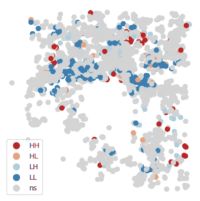

为北卡罗来纳州阿什维尔的 AirBnb 房源绘制的局部簇。图片由作者提供。

这很漂亮，但我们仍然需要将其绘制在地图上。因此，我们必须在数据集中添加另一个变量，即象限（HH，LL，HL，LH）。这些信息在`price_local_I.q`变量的`q`属性中，包含 LISA 计算。我们还将用颜色对它们进行编码，以便通过`Folium`包使地图更易读。

```py
# Get quadrants and p-values
quadrants = pd.DataFrame({'quadrant': price_local_I.q, 'p':price_local_I.p_sim})
quadrants['significant'] = labels
quadrants.quadrant.where(quadrants.p > alpha, other= 5, inplace=True )

# Add quadrants colors to variable in listings
listings['quadrants'] = quadrants.quadrant.map({1:'HH', 2:'LH', 3:'LL', 4:'HL', 5:'NS'})
listings['quadrants_colors'] = quadrants.quadrant.map({1:'red', 2:'lightblue', 3:'blue', 4:'orange', 5:'gray'})
```

最后，我们可以使用下面的代码片段绘制带有统计显著价格簇的 Folium 地图。

```py
# Preparing data for plot
data = listings[['latitude','longitude', 'price']].values
data =data.tolist()

# Create a Base map with Folium
m = folium.Map(location= [35.5951, -82.5515], zoom_start=12)

for lat, lon, q, ptcolor in zip(listings.latitude, listings.longitude, listings.quadrants, listings.quadrants_colors):
  folium.CircleMarker(
     location=[lat, lon],
     radius=2,
     opacity=0.5,
     color=ptcolor,
     fill=True,
     fill_color=ptcolor,
     popup=q,
  ).add_to(m)

# Add a choropleth layer
folium.Choropleth(
    geo_data=asheville,
    name="choropleth",
    data=listings,
    columns=["neighbourhood", "price"],
    key_on="feature.properties.neighbourhood",
    fill_color="RdBu_r",
    fill_opacity=0.1,
    line_opacity=0.8,
    legend_name="Prices",
    show=True
).add_to(m)

# Layer Control (add/ Remove layers)
folium.LayerControl().add_to(m)

#Display
m
```

显示的地图就是这个。

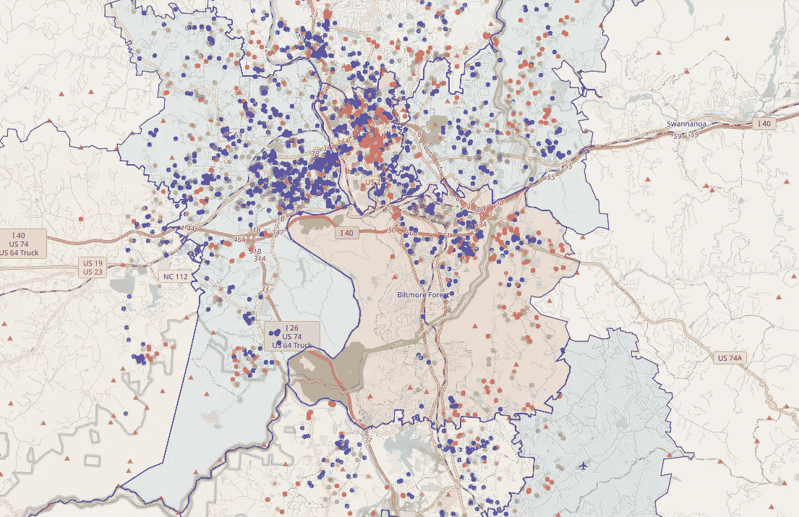

阿什维尔，NC 的 AirBnb 房源与局部价格簇。图片由作者提供。

放大来看，我们现在看到左上角的区域是一个蓝色的区域图，这得到了许多较低价格租赁的簇的确认。另一方面，市中心则充满了高价值簇，因此是一个更偏红色的区域图。

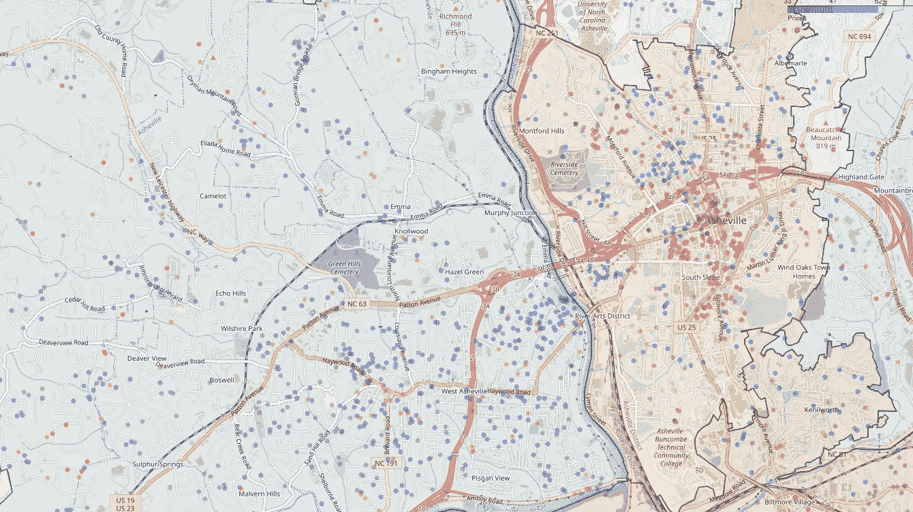

就这些了，伙计们。这就是如何执行地理空间假设检验。

# 在你离开之前

在这篇文章中，我们学习了如何对地理空间数据进行假设检验。这类统计检验是*确定结果是否真的显著，还是仅仅可能是偶然发生的*的*重要*方法。

有了这样的工具，你现在可以将其应用于你的商业模型，例如比较邻里的食品价格、电影票、餐厅……嗯，选择是无限的。我相信公司会很高兴知道那些可以利用更好定价策略的簇，无论是提高价格以匹配竞争并保持质量感知，还是稍微降低价格，以创建价值交易形象。

总结一下，执行检验的步骤是：

1.  定义统计显著性的 alpha 值

1.  确定将使用哪种类型的邻接矩阵（Queen，Rook，KNN）

1.  计算权重矩阵

1.  标准化行

1.  计算全球自相关的 Moran’s I 统计数据

1.  计算局部自相关的 LISA 统计数据

1.  根据假设检验识别显著的数据点

1.  绘制结果。

该练习的完整代码：

[](https://github.com/gurezende/Studying/blob/master/Python/Geospatial/Geospatial_geopandas_with_Hypothesis_Test.ipynb?source=post_page-----fe3f3f18fc82--------------------------------) [## Studying/Python/Geospatial/Geospatial_geopandas_with_Hypothesis_Test.ipynb 在 master ·…

### 这是一个包含我对新包进行测试和研究的仓库……

[github.com](https://github.com/gurezende/Studying/blob/master/Python/Geospatial/Geospatial_geopandas_with_Hypothesis_Test.ipynb?source=post_page-----fe3f3f18fc82--------------------------------)

如果你喜欢这些内容，可以关注我的博客获取更多，或在[LinkedIn 上找到我](https://www.linkedin.com/in/gurezende/)。

[](https://gustavorsantos.medium.com/?source=post_page-----fe3f3f18fc82--------------------------------) [## Gustavo Santos - Medium

### 阅读 Gustavo Santos 在 Medium 上的文章。数据科学家。我从数据中提取洞察，帮助个人和公司…

[gustavorsantos.medium.com](https://gustavorsantos.medium.com/?source=post_page-----fe3f3f18fc82--------------------------------)

此外，如果你考虑订阅 Medium，这里有一个推荐链接。你的一部分会员费用将会到我这里，帮助我继续发布优质内容。

[](https://medium.com/@gustavorsantos/membership?source=post_page-----fe3f3f18fc82--------------------------------) [## 通过我的推荐链接加入 Medium - Gustavo Santos

### 作为 Medium 会员，你的会员费用的一部分将会给你阅读的作者，你将获得对所有故事的完整访问权限…

[medium.com](https://medium.com/@gustavorsantos/membership?source=post_page-----fe3f3f18fc82--------------------------------)

# 参考文献

[JORDAN, David S. [2023]. *Applied Geospatial Data Science with Python*. 第 1 版. Pactk Publishing.](https://www.amazon.com/Applied-Geospatial-Data-Science-Python/dp/1803238127/ref=asc_df_1803238127/?tag=hyprod-20&linkCode=df0&hvadid=598352683676&hvpos=&hvnetw=g&hvrand=1787360199645971497&hvpone=&hvptwo=&hvqmt=&hvdev=c&hvdvcmdl=&hvlocint=&hvlocphy=1020988&hvtargid=pla-1875036424962&psc=1)

[](https://en.wikipedia.org/wiki/Moran%27s_I?source=post_page-----fe3f3f18fc82--------------------------------) [## Moran’s I - 维基百科

### 来源于维基百科 自统计学中的 Moran’s I 是一种由…开发的空间自相关度量

[en.wikipedia.org](https://en.wikipedia.org/wiki/Moran%27s_I?source=post_page-----fe3f3f18fc82--------------------------------) [](https://deepnote.com/@carlos-mendez/PYTHON-Spatial-weights-923ef4f8-8fbe-48de-8fc1-ecc9e3755a7d?source=post_page-----fe3f3f18fc82--------------------------------) [## [PYTHON] 空间权重

### W 和计量经济学 如果我们只有三个观测值（n=3），我们如何估计 A 的六个参数？？？我们怎么做…

[deepnote.com](https://deepnote.com/@carlos-mendez/PYTHON-Spatial-weights-923ef4f8-8fbe-48de-8fc1-ecc9e3755a7d?source=post_page-----fe3f3f18fc82--------------------------------)  [## libpysal.weights.Queen - libpysal v4.7.0 手册

### 从一组共享至少一个顶点的 pysal 多边形中构造权重对象。

[pysal.org](https://pysal.org/libpysal/generated/libpysal.weights.Queen.html?source=post_page-----fe3f3f18fc82--------------------------------#libpysal.weights.Queen)  [## esda.Moran_Local - esda v2.5.0 手册

### 确保条件随机化的可重复性的种子。必须在这里设置，而不是在函数外部，因为…

[pysal.org](https://pysal.org/esda/generated/esda.Moran_Local.html?source=post_page-----fe3f3f18fc82--------------------------------)  [## 空间权重

### “空间权重”是地理数据科学和空间统计中表示图形的一种方式。它们被广泛…

[geographicdata.science](https://geographicdata.science/book/notebooks/04_spatial_weights.html?source=post_page-----fe3f3f18fc82--------------------------------) [](/analyzing-geospatial-data-with-python-7244c1b9e302?source=post_page-----fe3f3f18fc82--------------------------------) ## 用 Python 分析地理空间数据

### 一个包含 Python 代码的实用数据分析帖子。

[towardsdatascience.com  [## 快速入门 - Folium 0.14.0 文档

### 要创建一个基础地图，只需将起始坐标传递给 Folium：要在 Jupyter notebook 中显示，只需请求…

[python-visualization.github.io](https://python-visualization.github.io/folium/quickstart.html?source=post_page-----fe3f3f18fc82--------------------------------)
