# 使用 ChatGPT 代码解释器分析人道主义数据的非结构化 Excel 表格

> 原文：[`towardsdatascience.com/analyzing-humanitarian-data-unstructured-excel-tables-with-chatgpt-code-interpreter-ccb8cabfa146?source=collection_archive---------3-----------------------#2023-07-10`](https://towardsdatascience.com/analyzing-humanitarian-data-unstructured-excel-tables-with-chatgpt-code-interpreter-ccb8cabfa146?source=collection_archive---------3-----------------------#2023-07-10)

## 使用代码解释器的一些初步探索

[](https://medium.com/@astrobagel?source=post_page-----ccb8cabfa146--------------------------------)[](https://towardsdatascience.com/?source=post_page-----ccb8cabfa146--------------------------------) [Matthew Harris](https://medium.com/@astrobagel?source=post_page-----ccb8cabfa146--------------------------------)

·

[关注](https://medium.com/m/signin?actionUrl=https%3A%2F%2Fmedium.com%2F_%2Fsubscribe%2Fuser%2F4a2cd25b8ff9&operation=register&redirect=https%3A%2F%2Ftowardsdatascience.com%2Fanalyzing-humanitarian-data-unstructured-excel-tables-with-chatgpt-code-interpreter-ccb8cabfa146&user=Matthew+Harris&userId=4a2cd25b8ff9&source=post_page-4a2cd25b8ff9----ccb8cabfa146---------------------post_header-----------) 发表在 [Towards Data Science](https://towardsdatascience.com/?source=post_page-----ccb8cabfa146--------------------------------) · 10 min read · Jul 10, 2023[](https://medium.com/m/signin?actionUrl=https%3A%2F%2Fmedium.com%2F_%2Fvote%2Ftowards-data-science%2Fccb8cabfa146&operation=register&redirect=https%3A%2F%2Ftowardsdatascience.com%2Fanalyzing-humanitarian-data-unstructured-excel-tables-with-chatgpt-code-interpreter-ccb8cabfa146&user=Matthew+Harris&userId=4a2cd25b8ff9&source=-----ccb8cabfa146---------------------clap_footer-----------)

--

[](https://medium.com/m/signin?actionUrl=https%3A%2F%2Fmedium.com%2F_%2Fbookmark%2Fp%2Fccb8cabfa146&operation=register&redirect=https%3A%2F%2Ftowardsdatascience.com%2Fanalyzing-humanitarian-data-unstructured-excel-tables-with-chatgpt-code-interpreter-ccb8cabfa146&source=-----ccb8cabfa146---------------------bookmark_footer-----------)

由 DALL-E2 创建，提示为“儿童的蜡笔画，展示一个快乐的机器人处理数据，背景有图表”

TL;DR

*新的实验性功能‘*[*代码解释器*](https://openai.com/blog/chatgpt-plugins#code-interpreter)*’为生成和运行 Python 代码提供了本地支持，作为使用 ChatGPT 的一部分。它在执行数据工程和分析任务方面展示了巨大潜力，提供了一个非技术用户可能使用的对话界面。本文展示了一些 ChatGPT (GPT-4) 代码解释器在我* [*之前的博客文章*](https://medium.com/towards-data-science/parsing-irregular-spreadsheet-tables-in-humanitarian-datasets-with-some-help-from-gpt-3-57efb3d80d45)*中的非结构化 Excel 表格测试，以查看它是否能够自动将该表格转换为可以加载到数据库中的更标准形式。在有限提示下，它能够识别层级标题结构，但无法生成能够准确解析表格的代码。在调整提示以建议使用 openpyxl Python 库来提取有关 Excel 合并单元格的信息后，它能够在一次尝试中解析表格。然而，在使用完全相同的提示重复任务时，它失败了。由于尚未能控制温度参数以使结果更具确定性，代码解释器似乎无法始终如一地处理这一特定任务。不过，早期阶段且仅为测试功能，使用大型语言模型进行自动化数据处理的模式很可能会持续存在，并且无疑会随着时间的推移而改进。*

本周 ChatGPT 推出了一个名为 [代码解释器](https://openai.com/blog/chatgpt-plugins#code-interpreter) 的新功能，它允许 ChatGPT 生成和调用 Python 代码，以及上传数据文件以执行如数据分析等任务。正如我在 [之前的博客文章](https://medium.com/me/stories/public) 中探讨的那样，大型语言模型在简化数据工程和分析任务方面具有潜力。[LangChain](https://python.langchain.com/docs/get_started/introduction.html) 项目提供了 [一些很棒的模式](https://python.langchain.com/docs/use_cases/tabular)，而且这个领域已经有很多商业活动，因此看到 OpenAI 开始提供本地支持是非常有趣的。

目前已经有许多文章探讨 OpenAI 代码解释器，但我想知道它在使用我之前探索的一些表格数据时表现如何，这些数据可以在惊人的 [人道数据交换](https://data.humdata.org/) (HDX) 中找到。能够为如 HDX 这样的平台提供自然语言接口，为较少技术的用户探索和理解这些数据开辟了道路，这对于预测和加快人道灾难事件的响应时间具有重要意义。

# 获取 Open AI 代码解释器的访问权限

代码解释器目前是一个‘Alpha’功能，意味着它处于早期测试阶段，并不是标准 ChatGPT 的一部分。要访问它，你需要：

1.  成为[ChatGPT+](https://openai.com/blog/chatgpt-plus)订阅者，费用为每月 $20

1.  访问[`chat.openai.com/`](https://chat.openai.com/)

1.  选择左下角你名字旁的“…”并选择“设置”

1.  点击“Beta 功能”并激活“代码解释器”

1.  回到聊天窗口，将鼠标悬停在 GPT-3.5 或 GPT-4 上，并选择“代码解释器”

值得注意的是，最初你必须在 OpenAI 的插件等候名单上，但我不确定是否仍然如此。尽管我没有收到列表中的访问确认，但这些功能仍然出现在我这里。如果上述方法无效，你可能[需要被添加](https://openai.com/waitlist/plugins)。

# 分析 Excel 文件中的非结构化表格

如[之前的博客文章](https://medium.com/towards-data-science/parsing-irregular-spreadsheet-tables-in-humanitarian-datasets-with-some-help-from-gpt-3-57efb3d80d45)中提到的，Excel 文件中的表格可以有各种奇妙的形式，包括合并单元格、空白行等，这些都可能使自动处理变得有些挑战。对于这篇文章，我决定尝试使用[GPT-4](https://openai.com/research/gpt-4)与代码解释器来分析在人道数据交换（HDX）中发现的 Excel 表格的典型示例……


Excel 中不规则表格的示例，包括空白的顶部行、标签和合并单元格。对人类来说完全可读，但对数据科学来说是一个挑战。这个文件来自[人道数据交换](https://data.humdata.org/dataset/kenya-number-of-acreage-under-irrigation-in-bomet-county)

尽管代码解释器可以访问开放数据集，但它尚未包含 HDX，也没有访问互联网的能力。我预计这很快会有所改变，但在此期间，我下载了文件，按照上述描述在[`chat.openai.com/`](https://chat.openai.com/)上开始了一个会话，然后通过点击聊天输入框中的“+”上传了这个文件……


上传后，ChatGPT 立即开始工作，将数据加载到 Python Pandas 中，并进行一些初步分析……

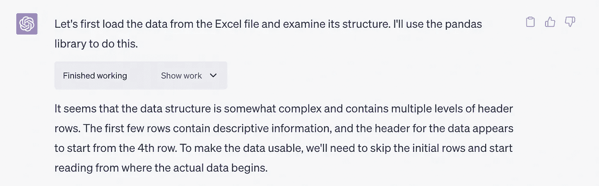

它立刻发现表格在工作表中有些不规则，并立即尝试解决这个问题……

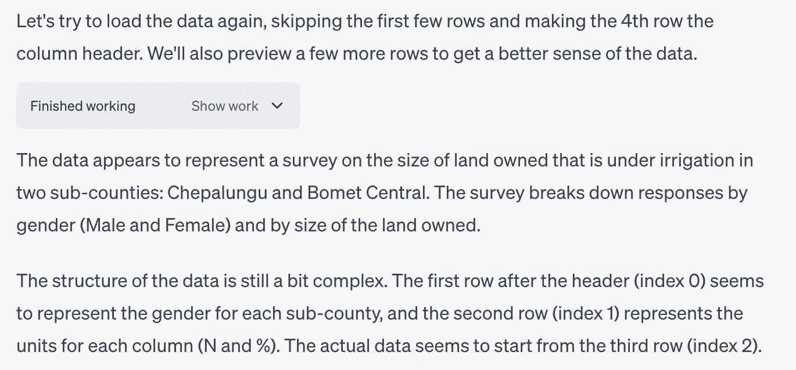

这实际上非常准确。事实上，它接着询问了……

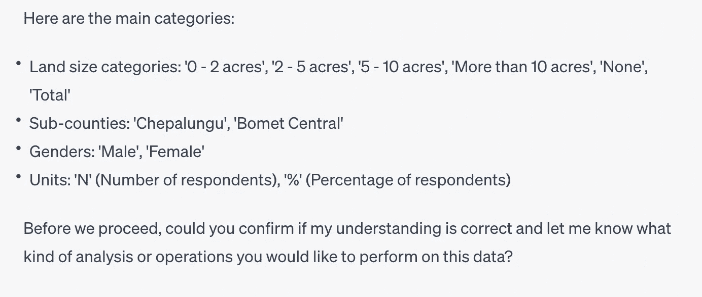

我回应道……

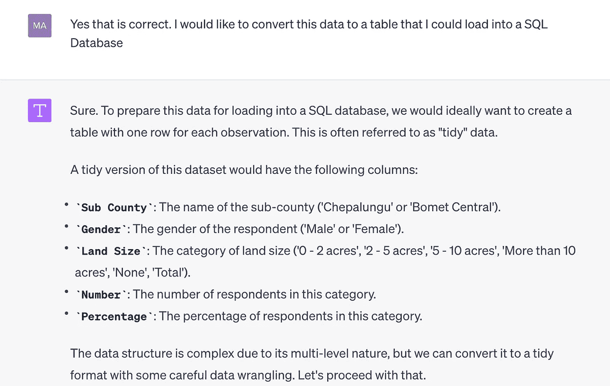

通过选择每个响应下的“显示工作”下拉菜单，可以看到它是如何得出结论的，提供生成的 Python 代码和结果……

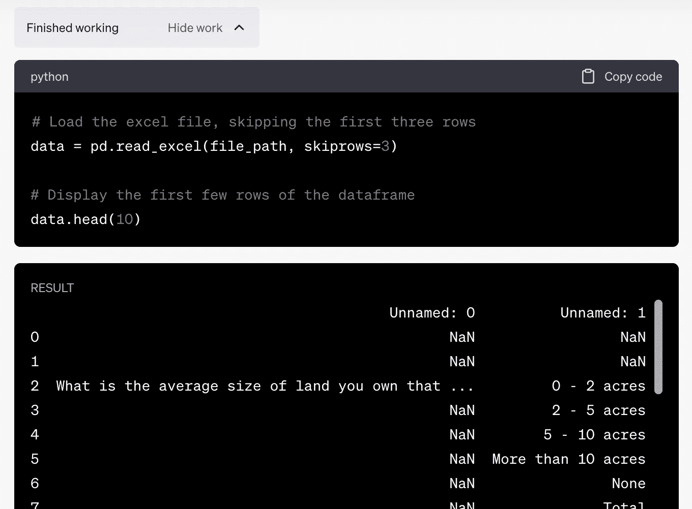

它的方法似乎合理，但值得注意的是，它没有使用关于合并单元格的原生 Excel 信息，而是直接加载到 Pandas 中。

ChatGPT 开始工作并自动尝试处理数据……


但它立即失败了。在选择“显示工作”时，我们看到它生成了一些用于解析我们表格的 Python 代码……

```py
# Drop the rows that are not needed
data = data.drop([0, 1])

# Reset the index
data = data.reset_index(drop=True)

# Define the land size categories
land_sizes = data.iloc[:, 1].values

# Initialize empty lists to hold the tidy data
sub_counties = []
genders = []
land_sizes_tidy = []
numbers = []
percentages = []

# Iterate over the sub-counties and genders
for i in range(4, data.shape[1], 2):
    sub_county = data.columns[i].split(' ')[0]
    gender = data.columns[i].split(' ')[1]

    # Iterate over the land size categories
    for j in range(len(land_sizes)):
        land_size = land_sizes[j]
        number = data.iloc[j, i]
        percentage = data.iloc[j, i + 1]

        # Append the values to the lists
        sub_counties.append(sub_county)
        genders.append(gender)
        land_sizes_tidy.append(land_size)
        numbers.append(number)
        percentages.append(percentage)

# Create a tidy dataframe
tidy_data = pd.DataFrame({
    'Sub County': sub_counties,
    'Gender': genders,
    'Land Size': land_sizes_tidy,
    'Number': numbers,
    'Percentage': percentages
})

tidy_data
```

但这导致了一个边界错误……

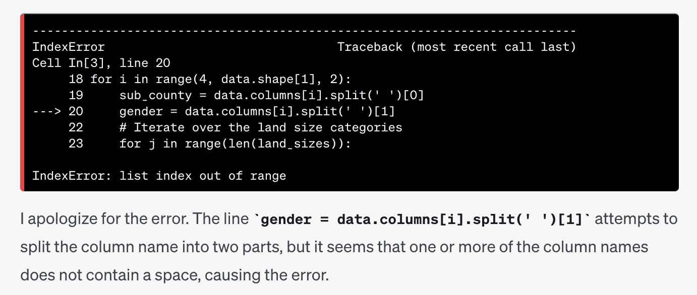

ChatGPT 没有放弃，自动开始调试……

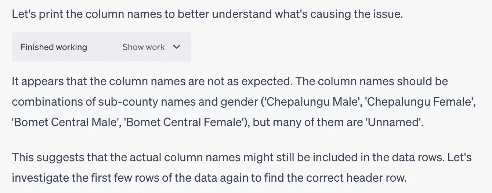

这相当令人印象深刻，因为它似乎正确识别了问题。然而，考虑到它在对话开始时已经准确识别了列层次结构，结果却似乎“丢失”了这些信息，这让人有些失望。

再次，它回到了任务中并自动继续进行……

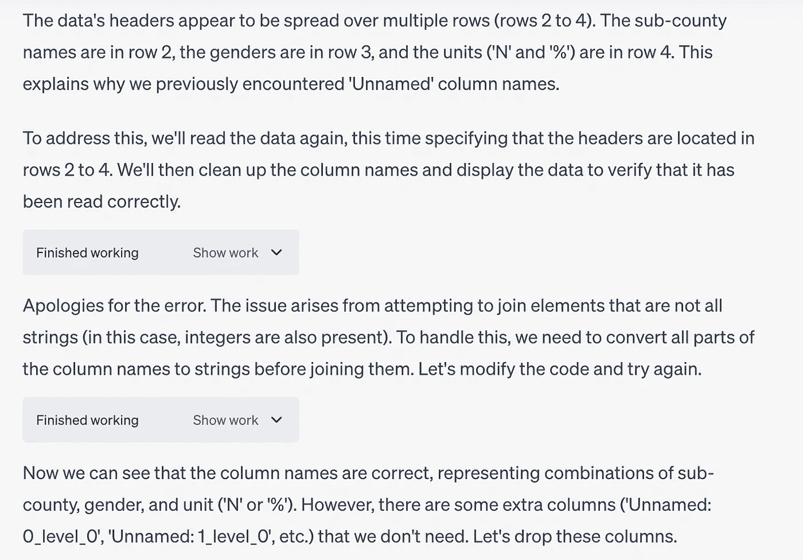

这生成了一个带有如下标题的表格……

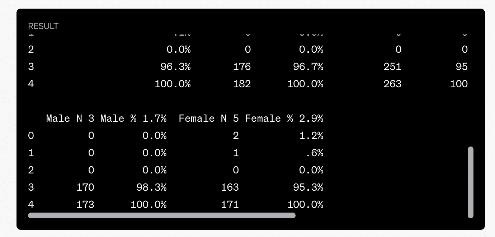

我们看到数据被包括在列标题中，表明它没有识别出列的结束和数据的开始。事实上，它甚至发现了这一点并勇敢地继续……

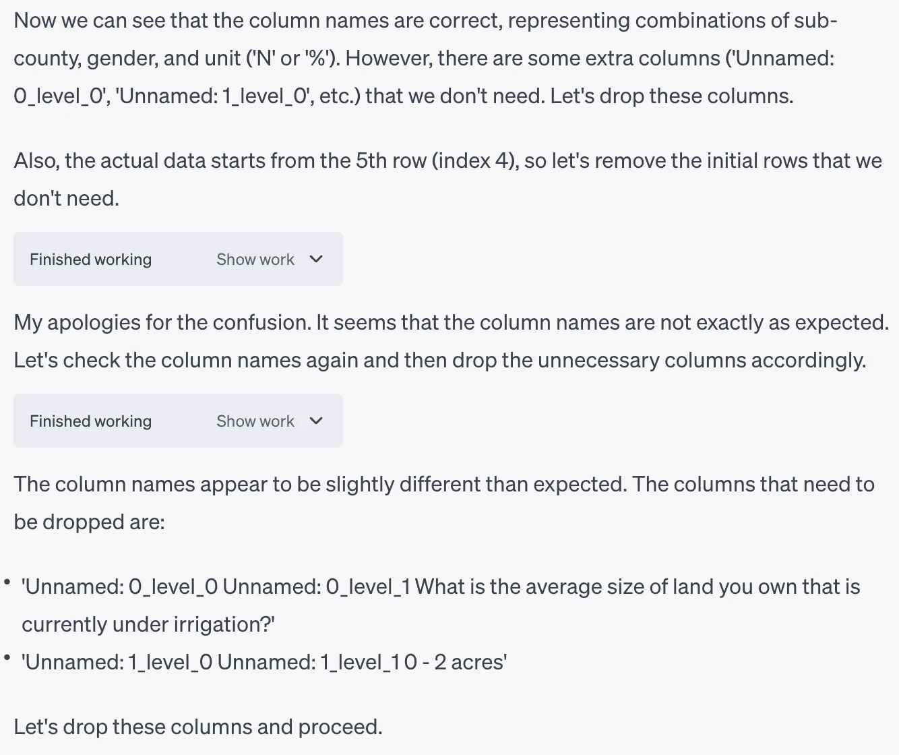

此时，它陷入了一种有些混乱的状态，尝试了许多在此未显示的循环。

最终，我认为超出了令牌限制，生成停止了，表格看起来是这样的……

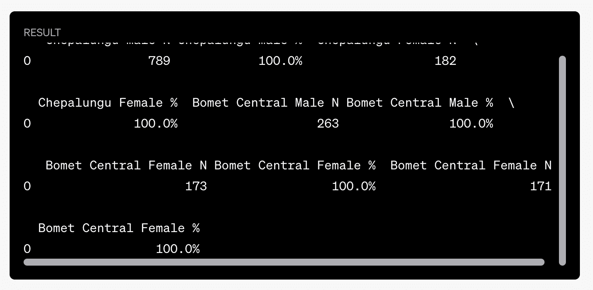

在‘显示工作’输出中对比上述值与原始表格，我们看到最后一行“总计”的值看起来是正确的，但有两个“Bomet Central Femail N Bomet”列标题。它发现了这一点……


由于它看起来非常接近，我要求 ChatGPT 继续……

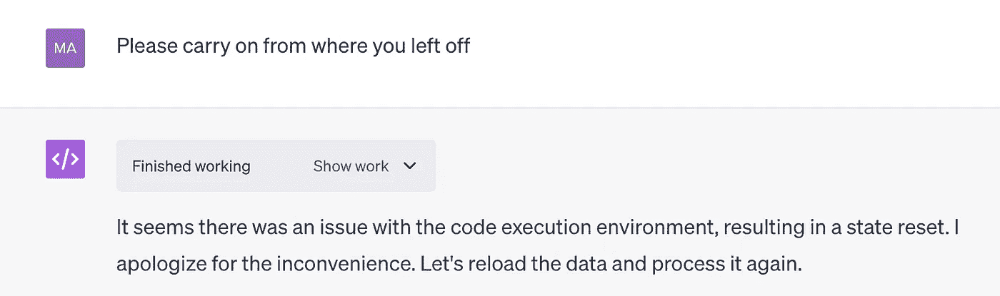

我让它等了一会儿才要求继续，我怀疑这导致了代码环境任务被终止。它似乎很乐意再次开始，但这样做时丢失了一些变量……

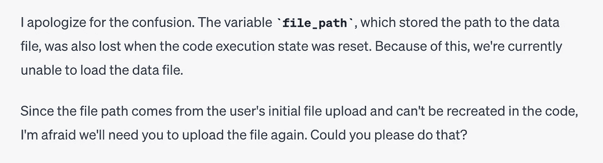

我按照提示重新上传了文件，它再次开始处理。最终，这是它生成的表格……

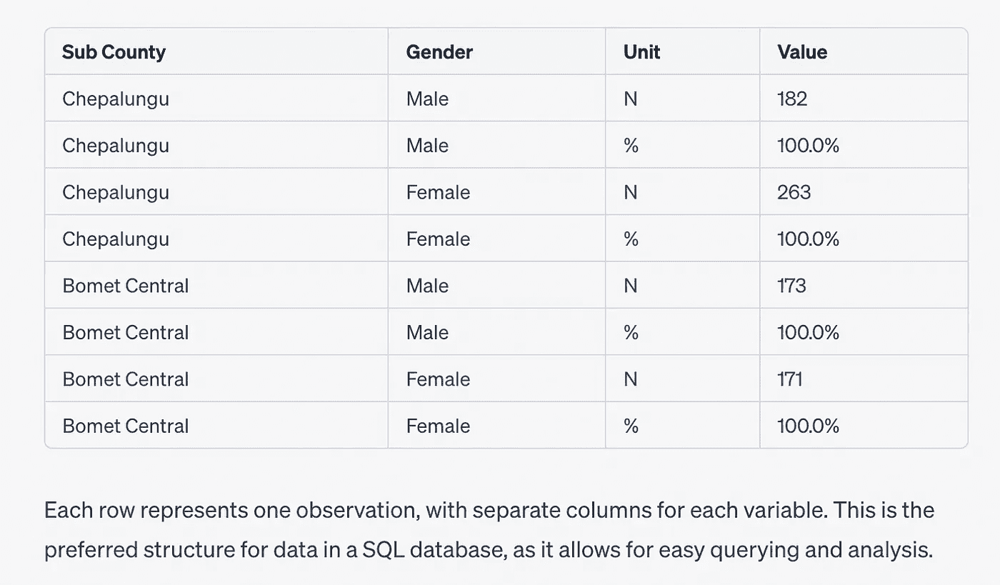

这非常好……对于原始表格中的*仅*“总计”行。ChatGPT 丢失了所有其他被按面积拆分的数据行，因此解析实际上失败了。

我指出它实际上缺少一个与土地面积相关的列，而它在第一次初始上传后确实立即识别了这一点……

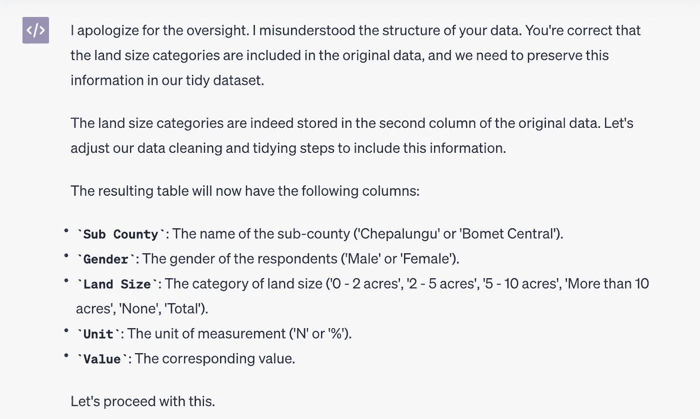

此时，ChatGPT 开始了另一个任务，尝试解析表格的多个方法，但没有一个最终成功。聊天的完整链接可以在[这里](https://chat.openai.com/share/891b77ef-411e-4b7b-85f1-7aa77438696f)找到。

我开始了一个全新的聊天会话并[再次尝试](https://chat.openai.com/share/caad774e-c45e-415c-b3a2-1a881057058b)，这导致了不同的结果，这对该技术的可重复性有影响。但无论我尝试了多少次，结果从未正确。

# 给 ChatGPT 一些编码建议

在我[之前的博客文章](https://medium.com/towards-data-science/parsing-irregular-spreadsheet-tables-in-humanitarian-datasets-with-some-help-from-gpt-3-57efb3d80d45)中，我能够通过使用从 Excel 中提取的信息来表示哪些单元格已合并，来成功解析像提供的示例那样的表格。这对于理解表格标题的层次结构以及我们人类在查看 Excel 表格时的使用非常关键。如果仅使用 Pandas Excel 解析——这就是 ChatGPT 在我们的测试中所做的——而不是逐个询问 Excel 结构，这些信息会丢失，使成功解析包含合并标题单元格的表格变得更加困难。

那么，如果我们给 ChatGPT 提示直接使用 'openpyxl' 并考虑合并单元格会怎么样呢？

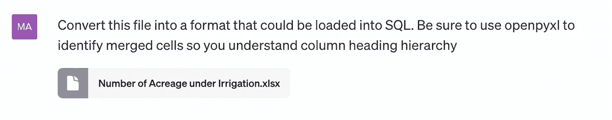

就像上次一样，它从一开始就正确处理了事情……

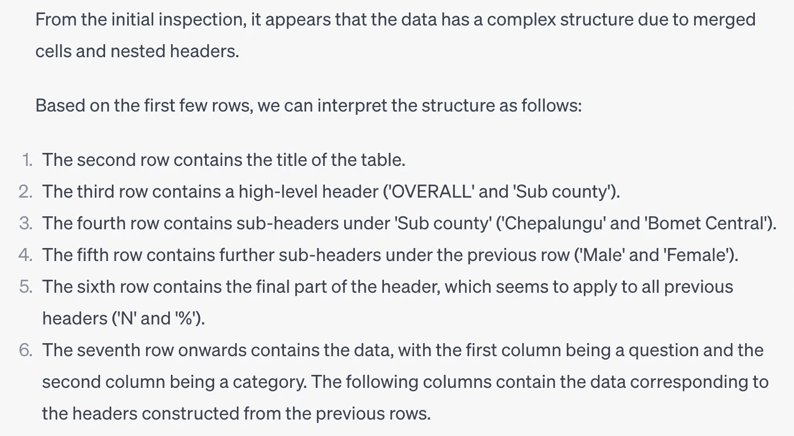

然后再次进行分析……

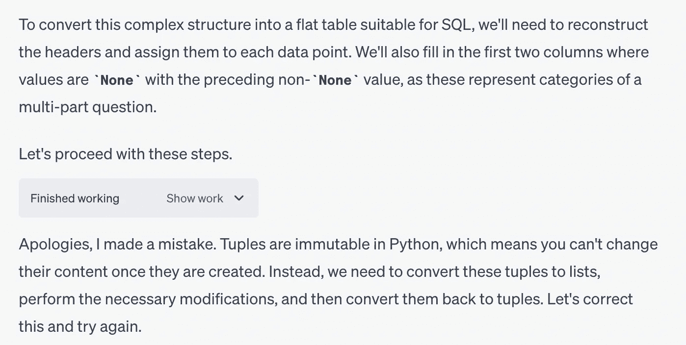

然而，这一次，在提供了一些关于技术的指导后……它几乎完美地展平了表格，仅使用上述单一提示而无需进一步干预。

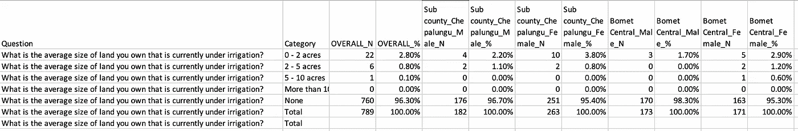

ChatGPT '代码解释器' 处理一个未结构化的 Excel 表格，将其转换成可能被加载到 SQL 数据库中的形式。这个结果是通过提示使用 'openpyxl' Python 库来识别列标题中的合并单元格创建的。

唯一的问题是最后一行，但通过进一步提示我们可以轻松去除。要查看完整的互动和生成的代码，请查看[这里](https://chat.openai.com/share/0afcb347-1abe-49d4-a015-b4ed80e12a13)。

我要求 ChatGPT 生成完整的代码以查看它最后得出了什么……


```py
from openpyxl import load_workbook
import pandas as pd

# Load the workbook
wb = load_workbook(filename='/mnt/data/Number of Acreage under Irrigation.xlsx')
ws = wb.active
data = ws.values
data = list(data)

# Convert the tuples to lists
data = [list(row) for row in data]

# Function to handle None values in the first two columns
def handle_none(data):
    last_valid = [None, None]
    for row in data:
        for i in range(2):
            if row[i] is not None:
                last_valid[i] = row[i]
            else:
                row[i] = last_valid[i]
    return data

data_filled = handle_none(data)

# Construct the headers
headers = [None] * len(data_filled[0])
for row in data_filled[2:6]:
    for i, value in enumerate(row):
        if value is not None:
            if headers[i] is None:
                headers[i] = value
            else:
                headers[i] += '_' + value

# Adjust the first two headers
headers[0] = 'Question'
headers[1] = 'Category'

# Adjust '%' headers
for i in range(len(headers)):
    if headers[i] == '%':
        headers[i] = headers[i-1].rsplit('_', 1)[0] + '_%'

# Adjust 'Female_N' and 'Female_%' headers
headers[6] = 'Sub county_Chepalungu_Female_N'
headers[7] = 'Sub county_Chepalungu_Female_%'
headers[10] = 'Bomet Central_Female_N'
headers[11] = 'Bomet Central_Female_%'

# Create a DataFrame
df = pd.DataFrame(data_filled[6:], columns=headers)

# Save the DataFrame as a CSV file
df.to_csv('/mnt/data/Number_of_Acreage_under_Irrigation_SQL.csv', index=False)
```

这似乎是合理的。它不是通用的，而是针对正在处理的文件具有特定的行。我怀疑我们可能需要更多的提示来（也许）使 ChatGPT 生成通用代码，但对于本研究中的任务，它能够很好地解析未结构化的表格。

很棒的结果！

鉴于第一次测试中 ChatGPT 使用相同提示得出了不同的结果，我决定重复完全相同的成功提示以查看成功测试中的表现。遗憾的是，它得出了完全不同的且[不正确的答案](https://chat.openai.com/share/1fe1e956-b814-4210-a034-284fa7bef228)，使用了*完全相同的提示*。

结果不太理想！

在 API 中，通过降低[温度参数](https://platform.openai.com/docs/api-reference/chat)可以使模型变得更加确定性，产生可重复的结果，但由于代码解释器在 API 中尚不可用，我无法进行这方面的实验。

# 结论

在最初失败之后，我们能够通过提供一些关于如何在 Python 中实现这一点的编码提示，促使 ChatGPT 正确解析一个非结构化的表格，这实际上是一个相当惊人的结果。然而，结果并不具备可重复性，因为在第二次尝试时使用完全相同的提示失败了。这很可能是因为我们尚未控制这个测试功能中的模型温度参数。

还注意到另一个有趣的限制，例如当令牌限制被突破时，完成任务之前的结果会中断，需要另一个提示才能继续。此外，随着 ChatGPT 尝试不同的代码块，处理过程相当缓慢。它还不是一种可以应用于需要快速响应的任务的技术。

基本上，代码解释器看起来非常令人印象深刻，并显示出巨大的潜力，但似乎尚未完全准备好完成上述任务。

至少在现在，尽管时间非常短……我在 ChatGPT 上领先了一步。😊
