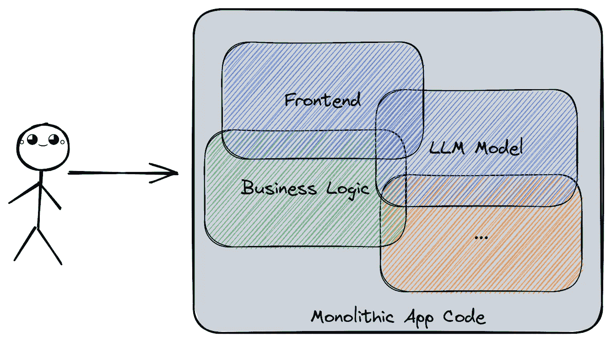
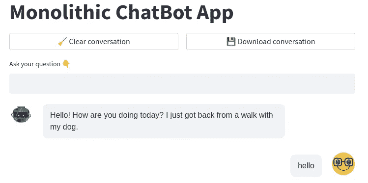
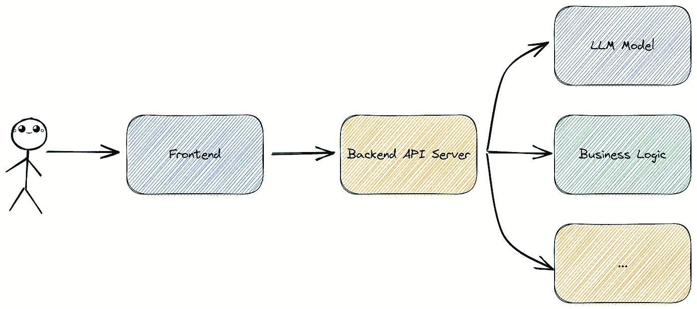
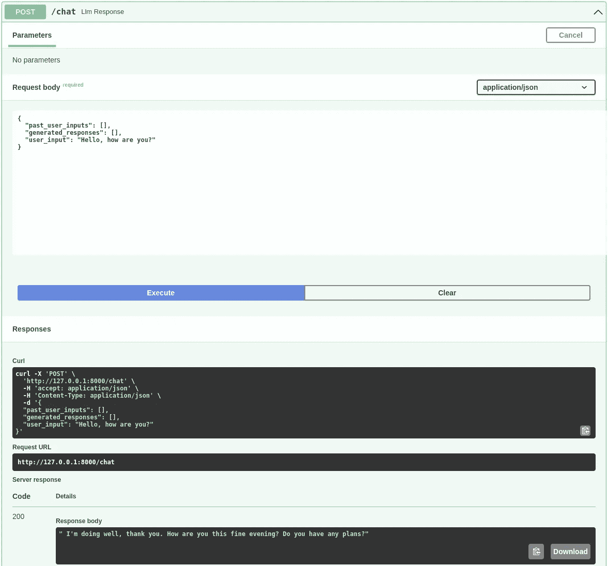

# 基于 LLM 的聊天机器人应用程序的结构：单体架构与微服务架构模式

> 原文：[`towardsdatascience.com/anatomy-of-llm-based-chatbot-applications-monolithic-vs-microservice-architectural-patterns-77796216903e`](https://towardsdatascience.com/anatomy-of-llm-based-chatbot-applications-monolithic-vs-microservice-architectural-patterns-77796216903e)

## 实用指南：使用 Streamlit、Huggingface 和 FastAPI 构建单体和微服务聊天机器人应用程序

[](https://stephen-leo.medium.com/?source=post_page-----77796216903e--------------------------------)[](https://towardsdatascience.com/?source=post_page-----77796216903e--------------------------------) [Marie Stephen Leo](https://stephen-leo.medium.com/?source=post_page-----77796216903e--------------------------------)

·发表于[Towards Data Science](https://towardsdatascience.com/?source=post_page-----77796216903e--------------------------------) ·9 分钟阅读·2023 年 5 月 8 日

--


图片由作者使用 Midjourney V5.1 生成，提示词为：“等距的高现实感笔记本电脑视图，屏幕上显示一个明亮的、多彩的魔方，内部被照亮，明亮、温暖、愉快的光线。8k，hdr，虚幻引擎”

随着 OpenAI 的 ChatGPT 的出现，聊天机器人正在迅速流行！每个企业都在寻求将 ChatGPT 融入其面向客户和内部的应用程序中。此外，由于开源聊天机器人进展如此迅速，以至于即使[谷歌工程师似乎也得出结论认为他们和 OpenAI“没有护城河”，](https://www.semianalysis.com/p/google-we-have-no-moat-and-neither) 现在正是进入 AI 行业的最佳时机！

作为构建这种应用程序的数据科学家，关键的决策之一是选择单体架构还是微服务架构。这两种架构各有优缺点；最终的选择取决于业务的需求，例如可扩展性和与现有系统的集成方便性。在这篇博客文章中，我们将使用 Streamlit、Huggingface 和 FastAPI 的实时代码示例来探讨这两种架构之间的区别！

首先，创建一个新的 conda 环境并安装必要的库。

```py
# Create and activate a conda environment
conda create -n hf_llm_chatbot python=3.9
conda activate hf_llm_chatbot

# Install the necessary libraries
pip install streamlit streamlit-chat "fastapi[all]" "transformers[torch]"
```

# 单体架构



在单体应用程序中，与应用程序相关的所有代码都紧密耦合在一个独立的单元中。 图片由作者提供

单体架构是一种将整个应用程序构建为一个自包含的单元的方法。这种方法简单且易于开发，但随着应用程序的增长，可能会变得复杂。在单体架构中，包括用户界面、业务逻辑和数据存储在内的所有应用程序组件都是紧密耦合的。对应用程序某一部分所做的任何更改都可能对整个应用程序产生连锁反应。

下面我们使用 Huggingface 和 Streamlit 来构建一个单体聊天机器人应用程序。我们将使用 Streamlit 来构建前端用户界面，而 Huggingface 提供了一种非常易于使用的高层抽象，称为 [pipelines](https://huggingface.co/docs/transformers/main_classes/pipelines#natural-language-processing)，它可以访问各种开源 LLM 模型。

首先，让我们创建一个包含三个在单体和微服务架构的前端中常用的助手函数的文件 utils.py。

1.  `clear_conversation()`: 此函数删除 Streamlit 前端中所有存储的 session_state 变量。我们用它来清除整个聊天记录并开始一个新的聊天线程。

1.  `display_conversation()`: 此函数使用 streamlit_chat 库创建一个漂亮的聊天界面前端，将我们的整个聊天线程从最新到最旧的消息显示在屏幕上。由于 Huggingface pipelines API 将 user_inputs 和 generate_responses 存储在不同的列表中，我们还使用此函数创建一个包含整个聊天线程的单一 interleaved_conversation 列表，以便在需要时可以下载它。

1.  `download_conversation()`: 此函数将整个聊天线程转换为 pandas dataframe 并下载为 csv 文件到您的本地计算机。

```py
# %%writefile utils.py
from datetime import datetime

import pandas as pd
import streamlit as st
from streamlit_chat import message

def clear_conversation():
    """Clear the conversation history."""
    if (
        st.button("🧹 Clear conversation", use_container_width=True)
        or "conversation_history" not in st.session_state
    ):
        st.session_state.conversation_history = {
            "past_user_inputs": [],
            "generated_responses": [],
        }
        st.session_state.user_input = ""
        st.session_state.interleaved_conversation = []

def display_conversation(conversation_history):
    """Display the conversation history in reverse chronology."""

    st.session_state.interleaved_conversation = []

    for idx, (human_text, ai_text) in enumerate(
        zip(
            reversed(conversation_history["past_user_inputs"]),
            reversed(conversation_history["generated_responses"]),
        )
    ):
        # Display the messages on the frontend
        message(ai_text, is_user=False, key=f"ai_{idx}")
        message(human_text, is_user=True, key=f"human_{idx}")

        # Store the messages in a list for download
        st.session_state.interleaved_conversation.append([False, ai_text])
        st.session_state.interleaved_conversation.append([True, human_text])

def download_conversation():
    """Download the conversation history as a CSV file."""
    conversation_df = pd.DataFrame(
        reversed(st.session_state.interleaved_conversation), columns=["is_user", "text"]
    )
    csv = conversation_df.to_csv(index=False)

    st.download_button(
        label="💾 Download conversation",
        data=csv,
        file_name=f"conversation_{datetime.now().strftime('%Y%m%d%H%M%S')}.csv",
        mime="text/csv",
        use_container_width=True,
    )
```

接下来，让我们创建一个包含整个单体应用程序的 monolith.py 文件。

1.  OpenAI 的 ChatGPT API 对问题和回答中的每个令牌都收费。因此，在这个小演示中，我选择使用 Huggingface 的一个开源模型，名为“facebook/blenderbot-400M-distill”。您可以在 [Huggingface 模型中心](https://huggingface.co/models?pipeline_tag=conversational) 找到超过 2000 个经过对话任务训练的开源模型的完整列表。有关对话任务 pipeline 的更多细节，请参考 [Huggingface 官方文档](https://huggingface.co/docs/transformers/v4.28.1/en/main_classes/pipelines#transformers.Conversation)。当开源模型不可避免地赶上 OpenAI 和 Google 的专有模型时，我相信 Huggingface 将成为研究人员分享这些模型的平台，考虑到他们在过去几年中如何彻底改变了 NLP 领域！

1.  `main()`: 此函数使用 Streamlit 构建前端应用的布局。我们将有一个按钮来清除对话，另一个按钮来下载。我们还会有一个文本框，用户可以在其中输入问题，按下回车后，我们将调用 `monolith_llm_response` 函数处理用户的输入。最后，我们将使用来自 `utils` 的 `display_conversation` 函数在前端显示整个对话。

1.  `monolith_llm_response()`: 此函数负责使用 Huggingface 管道处理聊天机器人逻辑。首先，我们创建一个新的 `Conversation` 对象，并将其初始化为到目前为止的整个对话历史。然后，我们将最新的 `user_input` 添加到该对象中，最后，我们将此对话对象传递给我们之前创建的 Huggingface 管道。Huggingface 会自动将用户输入和生成的响应添加到对话历史中！

```py
# %%writefile monolith.py
import streamlit as st
import utils
from transformers import Conversation, pipeline

# https://huggingface.co/docs/transformers/v4.28.1/en/main_classes/pipelines#transformers.Conversation
chatbot = pipeline(
    "conversational", model="facebook/blenderbot-400M-distill", max_length=1000
)

@st.cache_data()
def monolith_llm_response(user_input):
    """Run the user input through the LLM and return the response."""
    # Step 1: Initialize the conversation history
    conversation = Conversation(**st.session_state.conversation_history)

    # Step 2: Add the latest user input
    conversation.add_user_input(user_input)

    # Step 3: Generate a response
    _ = chatbot(conversation)

    # User input and generated response are automatically added to the conversation history
    # print(st.session_state.conversation_history)

def main():
    st.title("Monolithic ChatBot App")

    col1, col2 = st.columns(2)
    with col1:
        utils.clear_conversation()

    # Get user input
    if user_input := st.text_input("Ask your question 👇", key="user_input"):
        monolith_llm_response(user_input)

    # Display the entire conversation on the frontend
    utils.display_conversation(st.session_state.conversation_history)

    # Download conversation code runs last to ensure the latest messages are captured
    with col2:
        utils.download_conversation()

if __name__ == "__main__":
    main()
```

就这些了！我们可以通过运行 `streamlit run monolith.py` 来运行这个单体应用，并在网页浏览器上与应用进行交互！我们还可以将此应用快速部署到像 Google Cloud Run 这样的云服务中，正如 [我之前的博客文章](https://medium.com/towards-artificial-intelligence/make-extra-money-on-the-side-with-data-science-984a623c53f5) 中所描述的那样，并通过互联网进行交互！



单体 Streamlit 应用界面。图片由作者提供。

# 微服务架构



在微服务应用中，每个组件被拆分为自己的较小的独立服务。图片由作者提供。

微服务架构是一种将应用程序拆分成更小的独立服务的方法。每个应用程序组件，如用户界面、业务逻辑和数据存储，都是独立开发和部署的。这种方法提供了灵活性和可扩展性，因为我们可以模块化地添加更多功能，并通过添加更多实例来水平扩展每个服务，而不会影响其他服务。

让我们使用 FastAPI 将 Huggingface 模型推理从我们的单体应用中拆分为一个单独的微服务，并将 Streamlit 前端拆分为另一个微服务。由于这个演示中的后端仅有 LLM 模型，我们的后端 API 服务器与上图中的 LLM 模型相同。我们可以直接在前端微服务中重用我们之前创建的 `utils.py` 文件！

首先，让我们创建一个 `backend.py` 文件，这将作为我们的 FastAPI 微服务，运行 Huggingface 管道推理。

1.  我们首先使用之前选择的相同模型，“facebook/blenderbot-400M-distill”创建管道对象。

1.  我们创建了一个 `ConversationHistory` Pydantic 模型，以便将管道所需的输入作为负载传递给 FastAPI 服务。如需更多有关 FastAPI 请求主体的信息，请参见 [FastAPI 文档](https://fastapi.tiangolo.com/tutorial/body/)。

1.  为 APIs 保留根路由用于健康检查是一个好习惯。所以我们首先定义这个路由。

1.  最后，我们定义一个名为 `/chat` 的路由，该路由接受 API 有效负载作为 ConversationHistory 对象，并将其转换为字典。然后我们创建一个新的 Conversation 对象，并用有效负载中接收到的对话历史进行初始化。接着，我们将最新的 user_input 添加到该对象中，并将这个对话对象传递给 Huggingface pipeline。最后，我们必须将最新生成的响应返回给前端。

```py
# %%writefile backend.py
from typing import Optional

from fastapi import FastAPI
from pydantic import BaseModel, Field
from transformers import Conversation, pipeline

app = FastAPI()

# https://huggingface.co/docs/transformers/v4.28.1/en/main_classes/pipelines#transformers.Conversation
chatbot = pipeline(
    "conversational", model="facebook/blenderbot-400M-distill", max_length=1000
)

class ConversationHistory(BaseModel):
    past_user_inputs: Optional[list[str]] = []
    generated_responses: Optional[list[str]] = []
    user_input: str = Field(example="Hello, how are you?")

@app.get("/")
async def health_check():
    return {"status": "OK!"}

@app.post("/chat")
async def llm_response(history: ConversationHistory) -> str:
    # Step 0: Receive the API payload as a dictionary
    history = history.dict()

    # Step 1: Initialize the conversation history
    conversation = Conversation(
        past_user_inputs=history["past_user_inputs"],
        generated_responses=history["generated_responses"],
    )

    # Step 2: Add the latest user input
    conversation.add_user_input(history["user_input"])

    # Step 3: Generate a response
    _ = chatbot(conversation)

    # Step 4: Return the last generated result to the frontend
    return conversation.generated_responses[-1]
```

我们可以使用 `uvicorn backend:app --reload` 本地运行这个 FastAPI 应用，也可以将其部署到 Google Cloud Run 等云服务中，如[我之前的博客文章](https://medium.com/towards-artificial-intelligence/make-extra-money-on-the-side-with-data-science-984a623c53f5)中所述，并通过互联网进行交互！你可以通过访问 [`127.0.0.1:8000/docs`](http://127.0.0.1:8000/docs) 来使用 FastAPI 自动生成的 `/docs` 路由中的 API 文档测试后端。



后端的 FastAPI 文档。图片由作者提供

最后，让我们创建一个包含前端代码的 `frontend.py` 文件。

1.  `main()`：这个函数与单体应用中的 `main()` 函数非常相似，唯一的变化是当用户输入任何内容时，我们调用 `microservice_llm_response()` 函数。

1.  `microservice_llm_response()`：由于我们将 LLM 逻辑拆分到一个单独的 FastAPI 微服务中，这个函数利用存储在 session_state 中的对话历史记录，向后端 FastAPI 服务发送请求，然后将用户输入和 FastAPI 后端的响应都附加到对话历史中，以便继续记住整个聊天线程。

```py
# %%writefile frontend.py
import requests
import streamlit as st
import utils

# Replace with the URL of your backend
app_url = "http://127.0.0.1:8000/chat"

@st.cache_data()
def microservice_llm_response(user_input):
    """Send the user input to the LLM API and return the response."""
    payload = st.session_state.conversation_history
    payload["user_input"] = user_input

    response = requests.post(app_url, json=payload)

    # Manually add the user input and generated response to the conversation history
    st.session_state.conversation_history["past_user_inputs"].append(user_input)
    st.session_state.conversation_history["generated_responses"].append(response.json())

def main():
    st.title("Microservices ChatBot App")

    col1, col2 = st.columns(2)
    with col1:
        utils.clear_conversation()

    # Get user input
    if user_input := st.text_input("Ask your question 👇", key="user_input"):
        microservice_llm_response(user_input)

    # Display the entire conversation on the frontend
    utils.display_conversation(st.session_state.conversation_history)

    # Download conversation code runs last to ensure the latest messages are captured
    with col2:
        utils.download_conversation()

if __name__ == "__main__":
    main()
```

就这样！我们可以通过运行 `streamlit run frontend.py` 来启动这个前端应用，并在网页浏览器上与应用进行交互！正如我的[上一篇博客文章](https://medium.com/towards-artificial-intelligence/make-extra-money-on-the-side-with-data-science-984a623c53f5)中所描述的，我们也可以快速部署到云服务如 Google Cloud Run，并通过互联网与之互动！

# 选择哪个架构？

答案取决于你应用的需求。单体架构可以是数据科学家快速构建初步概念验证并向业务干系人展示的一个很好的起点。但不可避免地，如果你计划将应用投入生产，微服务架构通常比单体架构更好，因为它提供了更多的灵活性和可扩展性，并允许不同的专业开发人员专注于构建各种组件。例如，前端开发人员可能会使用 React 构建前端，数据工程师可能会使用 Airflow 编写数据管道，而 ML 工程师可能会使用 [FastAPI](https://fastapi.tiangolo.com/) 或 [BentoML](https://github.com/bentoml/BentoML) 来部署具有自定义业务逻辑的模型服务 API。

此外，通过微服务，聊天机器人开发人员可以轻松地加入新功能或更改现有功能，而不会影响整个应用程序。这种灵活性和可扩展性对那些希望将聊天机器人集成到现有应用中的企业至关重要。专注的 UI/UX、数据工程师、数据科学家和 ML 工程师可以各自专注于他们的专业领域，以交付一个精致的产品！

# 结论

总之，单体架构和微服务架构各有优缺点，两者之间的选择取决于业务的具体需求。然而，我更倾向于微服务架构用于聊天机器人应用，因为它的灵活性、可扩展性，以及我可以将前端开发委托给更合格的 UI/UX 专家 🤩。
