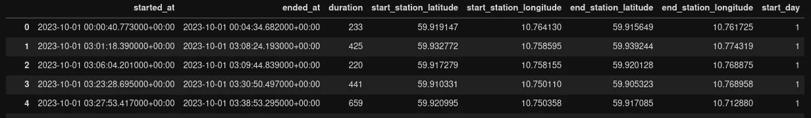

# 用 Python 动画化空间移动

> 原文：[`towardsdatascience.com/animating-spatial-movement-in-python-ccf4e9462a0f`](https://towardsdatascience.com/animating-spatial-movement-in-python-ccf4e9462a0f)

## 如何将起点-终点矩阵转化为迷人的动画

[](https://medium.com/@haavardwallinaagesen?source=post_page-----ccf4e9462a0f--------------------------------)[](https://towardsdatascience.com/?source=post_page-----ccf4e9462a0f--------------------------------) [Håvard Wallin Aagesen](https://medium.com/@haavardwallinaagesen?source=post_page-----ccf4e9462a0f--------------------------------)

·发布于 [Towards Data Science](https://towardsdatascience.com/?source=post_page-----ccf4e9462a0f--------------------------------) ·阅读时间 6 分钟·2023 年 11 月 23 日

--


自行车共享数据的移动静态地图。图片由作者提供。

空间数据本质上是可视化的，Python 在可视化（地理）空间数据方面的进步使得快速绘制各种形状和形式的地图变得非常简单。甚至创建图表和简单地图的动画也是相对容易的。特别是 Choropleth 地图，具有静态多边形和变化的颜色，已经有现成的函数来完成这项工作。

但当涉及到移动数据和动画化线路时，这项任务就显得有些繁琐。在这里，我将尝试给出一个示例，展示我如何在 Python 中解决空间移动数据动画化的问题。

# 初始数据

首先，我们需要一些带有时间戳的（线型）数据；在这个例子中，我将使用来自挪威奥斯陆的自行车共享系统的数据。这些数据在[挪威开放政府数据许可证 (NLOD) 2.0](https://data.norge.no/nlod/no/2.0#_lisensavtalens_innledning)/开放政府许可证下公开提供，可以从[Oslo Bysykkel](https://oslobysykkel.no/en/open-data)的主页获取。

```py
import geopandas as gpd
import pandas as pd

# Import data from csv
data = pd.read_csv("https://data.urbansharing.com/oslobysykkel.no/trips/v1/2023/10.csv")
data = data[['started_at','ended_at','duration', 'start_station_latitude', 'start_station_longitude','end_station_latitude', 'end_station_longitude']]
# Subset the data to only one day
data['start_day'] = data['started_at'].apply(lambda x: int(x[8:11]))
data = data[data["start_day"]==day]
data
```



初始数据集的前五行。图片由作者提供。

由于数据包括旅行的起点和终点，我们需要在这些点之间创建一条线，为此我们可以使用 NetworkX 中 Dijkstra 算法的实现。

# 创建移动线路

在我们可以创建移动线路之前，我们需要一个街道网络，以便进行最短路径计算。通过 `osmnx`，我们可以从 OpenStreetMap 获取我们感兴趣区域的自行车网络。我们将使用自行车旅行数据的范围作为我们的研究区域。

```py
import osmnx as ox
# Create a GeoDataFrame from the stations
initial_data = gpd.GeoDataFrame(data, geometry=gpd.points_from_xy(data['start_station_longitude'],data['start_station_latitude']),crs="EPSG:4326")
# Get the total bounds
total_bounds = initial_data.total_bounds
# Create a list for the polygon
bounding_box = [[total_bounds[0],total_bounds[3]], [total_bounds[0],total_bounds[1]], [total_bounds[2],total_bounds[1]], [total_bounds[2],total_bounds[3]]]
# Create the polygon
bounding_box_polygon = Polygon(bounding_box)
# Buffer the polygon to include roads just outside of the stations
graph_extent = bounding_box_polygon.buffer(0.02)
# Create the graph
area_graph = ox.graph_from_polygon(graph_extent, network_type='bike')
nodes, edges = ox.graph_to_gdfs(area_graph)
```

要使用 Dijkstra 算法计算最短路径，我们可以创建一个函数，并将其应用于我们的数据框：

```py
import networkx as nx
from shapely import ops

def calculate_shortest_path(start_point,end_point, graph):
    # Find the nearest node to the start and end points
    start_node = ox.distance.nearest_nodes(graph, X=start_point.x, Y=start_point.y)
    end_node = ox.distance.nearest_nodes(graph, X=end_point.x, Y=end_point.y)

    # Calculate the shortest path
    path = nx.dijkstra_path(graph, source=start_node, target=end_node, weight='length')

    # Convert the network path to a LineString
    geoms = [edges.loc[(u, v, 0), 'geometry'] for u, v in zip(path[:-1], path[1:])]
    route_lineString = MultiLineString(geoms)
    route_lineString = ops.linemerge(route_lineString)
    return route_lineString
```

我们现在可以将函数应用于数据框。为此，我们创建 Shapely 点作为起点和终点，然后在函数中使用这些点来计算它们之间的路径：

```py
data['start_point'] = data.apply(lambda row: Point(row['start_station_longitude'],row['start_station_latitude']), axis=1)
data['end_point'] = data.apply(lambda row: Point(row['end_station_longitude'],row['end_station_latitude']), axis=1)
data['shortest_path'] = data.apply(lambda row: calculate_shortest_path(row['start_point'],row['end_point'],area_graph), axis=1)
print(data.head())
```


数据集现在具有最短路径。作者图片。

在开始将行拆分为路径上的点之前，我们可以准备时间数据，以便在最终动画中美观地显示：

```py
from datetime import datetime
data['started_at'] = data['started_at'].apply(lambda x: datetime.strptime(x[0:19], "%Y-%m-%d %H:%M:%S"))
data['ended_at'] = data['ended_at'].apply(lambda x: datetime.strptime(x[0:19], "%Y-%m-%d %H:%M:%S"))
```


计算出的最短路径中的一行。作者图片。

# 拆分行

现在我们有了移动线路，目的是在这条线路上以固定的间隔创建一个点，以便根据时间顺序绘制这些点。

以下`line_to_points()`函数遍历数据框中的每一行，并根据自行车旅行的持续时间将行拆分为段。在这个例子中，每行在 15 秒后被拆分，并在该位置创建一个点。

```py
def line_to_points(df):
# Create a dataframe for our points
 point_df = pd.DataFrame(columns=['x','y','time','dateminute','size'])
# Iterate over the line data
 for idx, line in df.iterrows():
  start_x = line['shortest_path'].coords.xy[0][0]
  start_y = line['shortest_path'].coords.xy[1][0]
  # Create number of sections based on duration of trip
  delta = line['ended_at']-line['started_at']
  sections = line['duration']/15
  time_gap = delta/sections
  # Create initial point
  point_time = line['started_at']
  size = 10
  # Create timestamp
  dateminute = int(str(line['started_at'].year)+str(line['started_at'].month).zfill(2)+str(line['started_at'].day).zfill(2)+str(line['started_at'].hour).zfill(2)+str(line['started_at'].minute).zfill(2))
  append_list = [start_x,start_y,point_time.strftime("%Y-%m-%d %H:%M:%S"),dateminute,size]
  point_series = pd.Series(append_list,index=point_df.columns)
  point_df = point_df.append(point_series, ignore_index=True)
  # Iterate over rest of the sections, size relative to time
  i = 1
  while i <=sections:
   size = 50
   point_time += time_gap
   this_section = i/sections
   new_point = line['shortest_path'].interpolate(this_section, normalized=True)
   dateminute = int(str(point_time.year)+str(point_time.month).zfill(2)+str(point_time.day).zfill(2)+str(point_time.hour).zfill(2)+str(point_time.minute).zfill(2))
   if i == (sections-1):
    size = 30
   if i == 1:
    size = 30
   if i == (sections):
    size = 10
   point_series = pd.Series([new_point.x,new_point.y,point_time.strftime("%Y-%m-%d %H:%M:%S"),dateminute,size],index=point_df.columns)
   point_df = point_df.append(point_series, ignore_index=True)
   i+=1
 return point_df
```

使用`line_to_points()`函数，我们创建一个新的数据框，只包含我们希望用时间戳动画化的点，我们可以在绘图时迭代这些点。

```py
# Create a GeoDataFrame from the paths
paths_gdf = gpd.GeoDataFrame(data, geometry='shortest_path', crs="EPSG:4326")
paths_gdf = paths_gdf[~paths_gdf.is_empty] 
result = line_to_points(paths_gdf)
```


行转换为带时间戳的点。作者图片。

# 动画化移动

为了能够绘制新的点数据，我们创建一个地理数据框，其中包含时间戳、点的大小和每个点的坐标。

```py
# Create geodataframe
gdf = gpd.GeoDataFrame(result, geometry=gpd.points_from_xy(result['x'], result['y']))
gdf['size'] = gdf['size'].astype(float)
gdf.crs = "EPSG:4326"
gdf = gdf.to_crs(epsg=4326)
# Get list of timestamps
times = list(gdf['dateminute'].unique())
times.sort()
```

这里的核心目标是为新地理数据框中的每个时间戳创建一个图，然后将所有这些图合并为一个 GIF 动画。为此，我们创建一个函数，该函数将绘制地理数据框中的单行，同时用小点大小绘制所有先前的行。这样，我们就能看到当前时间的大点，同时还能够看到先前的点，给人一种直观的路径感。

```py
import matplotlib
import matplotlib.pyplot as plt
import contextily as ctx

def plot_minute(minute):
  # Set up the plot parameter
  matplotlib.rcParams.update({'font.size': 16})
  fig, ax = plt.subplots(ncols = 1, figsize=(32,20))
  # Plot all rows before the current minute
  old_minutes = gdf[gdf['dateminute'] < minute]
  old_minutes.to_crs(epsg=4326).plot(ax=ax, color='#1DA1F2',markersize=5, edgecolor=None, linewidth=0, alpha=0.4) # 2 - Projected plot
  # Select and plot the current minute
  minute_gdf = gdf[gdf['dateminute'] == minute]
  minute_gdf.to_crs(epsg=4326).plot(ax=ax, color='#1DA1F2',markersize=minute_gdf['size'], edgecolor=None, linewidth=0.3, alpha=0.8) # 2 - Projected plot
  # Set common boundaries for the plot
  xlim = ([stations_gdf.total_bounds[0],  stations_gdf.total_bounds[2]])
  ylim = ([stations_gdf.total_bounds[1],  stations_gdf.total_bounds[3]])
  ax.set_xlim(xlim)
  ax.set_ylim(ylim)
  # Set time variables
  mi = str(minute)[-2:]
  h = str(minute)[-4:-2]
  #d = str(minute)[-4:-2]
  m = str(minute)[4:6]
  y = str(minute)[:4]
  # Add a basemap
  ctx.add_basemap(ax,crs=minute_gdf.crs.to_string(), source=ctx.providers.CartoDB.DarkMatter)
  ax.set_axis_off()
  # Create text
  ax.text(.5,.9,f'{h}:{mi} - {day}/{m}/{y}',
        horizontalalignment='center',color='white',
        transform=ax.transAxes,size=18)
  plt.tight_layout()
  # Save plot to file
  plt.savefig(f'animation/{minute}.png',transparent=True, dpi=100)
  plt.close()
```

我们现在可以使用之前创建的时间戳列表`times`，并遍历每个时间戳，运行`plot_minute()`函数为我们拥有的每个时间戳数据制作地图。

```py
for timestamp in times:
  plot_minute(timestamp)
```


单分钟绘制的地图之一。作者图片。

# 转换为 GIF

对所有时间戳运行`plot_minute()`的结果是，我们现在有一个充满.png 地图的文件夹。动画化一系列 png 有几种方法，在基于 UNIX 的系统上，你可以在 bash 中运行`convert`程序。根据绘图设置的参数，png 和动画本身的结果文件大小可能会非常大，因此可能需要调整大小以减少文件大小。

```py
convert -resize 20% -delay 5 -loop 0 animation/*.png animation.gif
```

现在我们可以查看最终结果：

# 结论

在这篇文章中，我向你展示了一种将移动点数据集转化为基于最短路径算法的动画地图的方法，使用了几个常见的 Python 库。

这个解决方案适用于任何具有配套网络的起始-目的地矩阵，并且许多城市的自行车共享数据是可以获取的。希望它能激励你去探索其他城市的自行车共享模式和城市结构！
