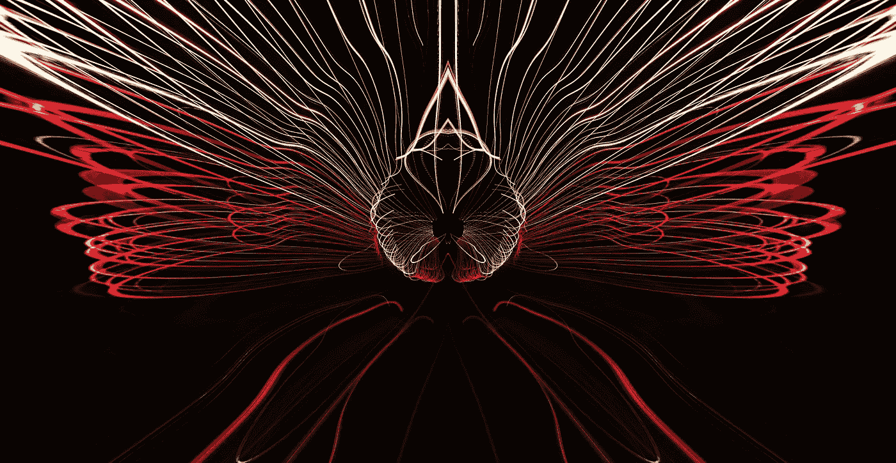

# 使用自动编码器方法在 TensorFlow 和 Keras 中进行异常检测

> 原文：[`towardsdatascience.com/anomaly-detection-in-tensorflow-and-keras-using-the-autoencoder-method-5600aca29c50`](https://towardsdatascience.com/anomaly-detection-in-tensorflow-and-keras-using-the-autoencoder-method-5600aca29c50)



图片由[Leiada Krozjhen](https://unsplash.com/@leiadakrozjhen?utm_source=medium&utm_medium=referral)拍摄，来源于[Unsplash](https://unsplash.com/?utm_source=medium&utm_medium=referral)

## 一种前沿的无监督方法，用于去噪、降维、异常检测等

[](https://rashida00.medium.com/?source=post_page-----5600aca29c50--------------------------------)[](https://towardsdatascience.com/?source=post_page-----5600aca29c50--------------------------------) [Rashida Nasrin Sucky](https://rashida00.medium.com/?source=post_page-----5600aca29c50--------------------------------)

·发表于[Towards Data Science](https://towardsdatascience.com/?source=post_page-----5600aca29c50--------------------------------) ·阅读时间 7 分钟·2023 年 9 月 23 日

--

直到现在，我分享的所有关于 TensorFlow 和神经网络的教程都是关于有监督学习的。这一次将介绍自动编码器，它是一种无监督学习技术。简单来说，自动编码器**通过压缩输入数据**来**减少噪声**，并对数据进行编码和重建。这样，自动编码器可以**减少数据的维度**或噪声，专注于输入数据的实际重点。

如你所见，自动编码器介绍中涉及的不止一个过程。

1.  首先，构建一个压缩输入数据的模型，即编码器模型。

1.  然后另一个模型用于重建压缩数据，这个模型是解码器模型，它应该尽可能接近输入数据。

在这个过程中，它可以去除噪声、减少维度，并清理输入数据。

在本教程中，我将详细解释自动编码器的工作原理，并提供一个实际示例。

对于这个示例，我选择使用一个名为 deep_weeds 的[公开数据集](https://github.com/AlexOlsen/DeepWeeds/blob/master/LICENSE)（Apache 许可证 2.0）。

```py
import tensorflow as tf
import tensorflow_datasets as tfds
ds = tfds.load('deep_weeds', split='train', shuffle_files=True)
```

## 数据准备

我们需要为这个无监督异常检测示例准备一个数据集。只有一个类别将被视为我们的主类别，即有效类别。我会从另一个类别中添加一些数据作为异常。然后我们将开发模型，看看能否找出这些少量的异常数据。

我选择了类别 5 作为有效类别，类别 1 作为异常类别。在下面的代码块中，我首先获取类别 5 和类别 1 的所有数据，并创建图像及其对应标签的列表。

```py
import numpy as np
images_main = []
images_anomaly = []
labels_main= []
labels_anomaly = []
ds = ds.prefetch(tf.data.AUTOTUNE)
for example in ds:
  #print(np.array(example['label']))
  if np.array(example['label']) == 5:
    images_main.append(example["image"])
    labels_main.append(example["label"])
  if np.array(example['label']) == 1:
    images_anomaly.append(example["image"])
    labels_anomaly.append(example["label"])
```

让我们看看这里主图像（类别 5 图像）的形状：

```py
np.array(images_main).shape
```

输出：

```py
(1009, 256, 256, 3)
```

图像的形状是 (256, 256, 3)，我们有总共 1009 张属于类别 5 的数据。

但是，我们不需要类别 1 的所有数据。因为类别 1 是异常类别。所以，只有 1% 的类别 1 数据会被用于训练。

```py
parc = round(len(labels_anomaly) * 0.01)
images_anomaly = np.array(images_anomaly)[:parc]
# stacking the main images and anomaly images together
total_images = np.vstack([images_main, images_anomaly])
```

总图像的形状：

```py
total_images.shape
```

输出：

```py
(1020, 256, 256, 3)
```

我们共有 1020 张用于训练的图像。如前所述，我们有 1009 张类别 5 的图像，我们取了 1020–1009 = 11 张类别 1 的图像，这些是我们的异常图像。

让我们看看是否可以在 Keras 和 TensorFlow 中开发一个自动编码器模型来检测这些异常。

## 模型开发

这是有趣的部分！但首先，我们应该进行必要的导入：

```py
# import the necessary packages
from tensorflow.keras.layers import BatchNormalization
from tensorflow.keras.layers import Conv2D
from tensorflow.keras.layers import Conv2DTranspose
from tensorflow.keras.layers import LeakyReLU
from tensorflow.keras.layers import Activation
from tensorflow.keras.layers import Flatten
from tensorflow.keras.layers import Dense
from tensorflow.keras.layers import Reshape
from tensorflow.keras.layers import Input
from tensorflow.keras.models import Model
from tensorflow.keras import backend as K
from tensorflow.keras.optimizers import Adam
from tensorflow.keras.datasets import mnist
from tensorflow.keras.models import load_model
from sklearn.model_selection import train_test_split
import matplotlib.pyplot as plt
import numpy as np
import random
import cv2
```

一些数据应该单独保留用于测试目的。可以使用 sklearn 库中的 train_test_split 方法来实现。记住，由于这是无监督学习方法，标签不是必需的。我们将仅分割图像。

```py
(train_x, test_x) = train_test_split(total_images, test_size=0.2, random_state=0)
```

最后，自动编码器模型。我们将构建一个 Convolution_Autoencoder 类，这是一种卷积神经网络。该类具有 build 方法，在此方法中我们将定义 Autoencoder 模型。

‘build’ 方法接受宽度、深度、高度、滤波器和 latentDim 作为参数。在这里，宽度、深度和高度是图像的维度，对于我们来说是 (256, 256, 3)，正如我们在上面的 total_images.shape 方法中看到的。

参数‘filters’是卷积层的滤波器。

‘latentDim’ 是我们在编码器方法后压缩层的大小。

在这个 build 方法中，第一部分是一个简单的卷积神经网络（CNN）作为编码器模型。

一旦编码器部分完成后，将使用 Conv2DTranspose 层开发解码器模型，以再次重建数据。

然后，我们构建自动编码器模型，这实际上是编码器和解码器模型的组合。

最后，我们返回编码器、解码器和自动编码器模型。

```py
class Convolution_Autoencoder:
  @staticmethod
  def build(width, height, depth, filters=(16, 32, 64), latentDim=32):
    input_shape = (height, width, depth)
    chanDim = -1

    inputs = Input(shape=input_shape)
    x = inputs

    for f in filters:
      x = Conv2D(f, (3, 3), strides = 2, padding="same")(x)
      x = LeakyReLU(alpha=0.3)(x)
      x = BatchNormalization(axis=chanDim)(x)

    volume = K.int_shape(x)
    x = Flatten()(x)
    latent = Dense(latentDim)(x)

    #encoder model
    encoder = Model(inputs, latent, name="encoder")

    #compressed representation
    latent_layer_input = Input(shape=(latentDim,))
    x = Dense(np.prod(volume[1:]))(latent_layer_input)

    x = Reshape((volume[1], volume[2], volume[3]))(x)

    #Recostructing the image with a decoder model
    for f in filters[::-1]:
      x = Conv2DTranspose(f, (3, 3), strides=2, padding="same")(x)
      x = LeakyReLU(alpha=0.3)(x)
      x = BatchNormalization(axis=chanDim)(x)

    x = Conv2DTranspose(depth, (3, 3), padding="same")(x)

    outputs = Activation("sigmoid")(x)

    decoder = Model(latent_layer_input, outputs, name="decoder")

    autoencoder = Model(inputs, decoder(encoder(inputs)), name="autoencoder")

    return (encoder, decoder, autoencoder)
```

模型开发完成了。现在是运行模型并查看其是否有效的时候了。它应该像任何其他 TensorFlow 模型一样运行。

在这里，我们将首先使用 Adam 优化器编译模型。同时，我在学习率中使用了衰减，并将“mse”作为损失函数。

```py
epochs = 50
lr_start = 0.001
batchSize = 32

(encoder, decoder, autoencoder) = Convolution_Autoencoder.build(256, 256, 3)
opt = tf.keras.optimizers.legacy.Adam(lr = lr_start, decay = lr_start / epochs)
autoencoder.compile(loss = "mse", optimizer = opt)
```

最后，运行模型。记住，这是一种无监督学习方法。所以在模型训练中不会有任何标签。相反，我们需要传递两个训练特征，即 train_x 两次。如果你注意到 Convolution_Autoencoder 类中的 build 方法，autoencoder 看起来像这样：

```py
autoencoder = Model(inputs, decoder(encoder(inputs)), name="autoencoder")
```

在上面的模型中，我们需要首先传入 train_x 作为输入，然后是 decoder(encoder(inputs))，其中我们需要再次传入 train_x。测试数据 test_x 也是如此。

在你开始模型训练之前，我应该警告你，在 Google Colab 的默认设置下，它非常慢。你可以通过在 GPU 上运行来显著提高速度。在运行之前，请更改你的 Google Colab 笔记本设置。

```py
history = autoencoder.fit(
 train_x, train_x,
 validation_data=(test_x, test_x),
 epochs=30,
 batch_size=batchSize)
```

输出：

```py
Epoch 1/30
26/26 [==============================] - 15s 157ms/step - loss: 12963.2842 - val_loss: 13428.3906
Epoch 2/30
26/26 [==============================] - 2s 87ms/step - loss: 12924.1787 - val_loss: 13392.3418
Epoch 3/30
26/26 [==============================] - 2s 88ms/step - loss: 12911.4551 - val_loss: 13401.3350
Epoch 4/30
26/26 [==============================] - 2s 92ms/step - loss: 12905.8975 - val_loss: 13344.5596
...
...
Epoch 27/30
26/26 [==============================] - 2s 89ms/step - loss: 12890.9102 - val_loss: 13322.1299
Epoch 28/30
26/26 [==============================] - 2s 89ms/step - loss: 12890.8701 - val_loss: 13322.0820
Epoch 29/30
26/26 [==============================] - 2s 89ms/step - loss: 12890.8428 - val_loss: 13322.0488
```

如你所见，损失没有太多变化，这只是因为我们没有标签。相反，我们将训练特征传递给它两次。损失来自将原始图像与自编码器重建图像进行比较。

## 模型评估

模型评估与常规监督学习模型不同，因为自编码器不是监督学习方法。让我们一步一步来做。

首先，我们将像往常一样进行预测，这将是通过自编码器模型解码的图像。

然后，使用原始错误和重建错误计算均方误差，并将其保存到‘errors’列表中。这里是相关代码。

```py
decoded = autoencoder.predict(test_x)
errors = []

for (image, recon) in zip(total_images, decoded):
  mse = np.mean((image - recon) ** 2)
  errors.append(mse)
```

由于我们有测试集中所有图像的‘mse’，我们选择一个阈值。在这里，我使用了 np.quantile 方法的 95% 分位数，并从‘errors’中获取‘mse’大于阈值的索引。当‘mse’大于我们决定的阈值错误时，我们将其视为异常。

```py
thresh = np.quantile(errors, 0.95)
idxs = np.where(np.array(errors) >= thresh)[0]
idxs
```

输出：

```py
array([  9,  10,  35,  59,  84, 134, 146, 188, 200, 201, 202])
```

现在，让我们回到之前为训练准备的图像数据集‘total_images’。我们需要检查这些超过阈值的索引是否实际上是异常：

```py
for i in idxs:
  if total_images[i] in images_anomaly:
    print(True)
```

输出：

```py
True
True
True
True
True
True
True
True
True
True
True
```

是的！！它们都是异常数据。如果你计算上面的‘True’数量，我们这里有 11 个‘True’。我们可以检查‘images_anomaly’中最初有多少异常数据：

```py
len(images_anomaly)
```

输出：

```py
11
```

因此，我们使用自编码器模型找到了所有的异常数据。

## 结论

我还有另一个使用概率来发现异常的异常检测教程。请查看下面的‘更多阅读’部分。这里我们使用了 TensorFlow 和 Keras，它们是处理图像和更复杂数据的更高级工具。正如我在介绍中提到的，自编码器也可以用于各种其他任务。我将在未来的帖子中分享更多自编码器的应用案例，以及 TensorFlow 和 Keras 中的更多前沿技术。

欢迎关注我的 [Twitter](https://twitter.com/rashida048) 和点赞我的 [Facebook](https://www.facebook.com/rashida.smith.161) 页面。

## 更多阅读：

[从头开始用 Python 实现完整的异常检测算法：逐步指南 | 作者：Rashida Nasrin Sucky | Towards Data Science (medium.com)](https://medium.com/p/4c115e65d54e)

[在 Keras 和 TensorFlow 中实现 Siamese 网络 | 作者：Rashida Nasrin Sucky | 2023 年 8 月 | Towards Data Science (medium.com)](https://medium.com/p/aa327418e177)

[完整实现迷你 VGG 网络用于图像识别 | 作者：Rashida Nasrin Sucky | Towards Data Science (medium.com)](https://medium.com/p/849299480356)

[使用 Keras 调参器进行 TensorFlow 模型的超参数调整 | 作者：拉希达·纳斯林·苏基 | 发表在 AI 方向 (medium.com)](https://medium.com/p/41978f53111)

[在编写 Apache Beam 管道时使用 Map、Filter 和 CombinePerKey 转换的示例 | 作者：拉希达·纳斯林·苏基 | 发表在数据科学方向 (medium.com)](https://medium.com/p/e06926124a02)
