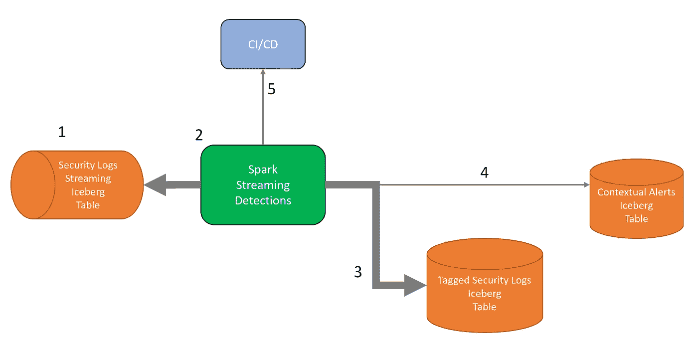
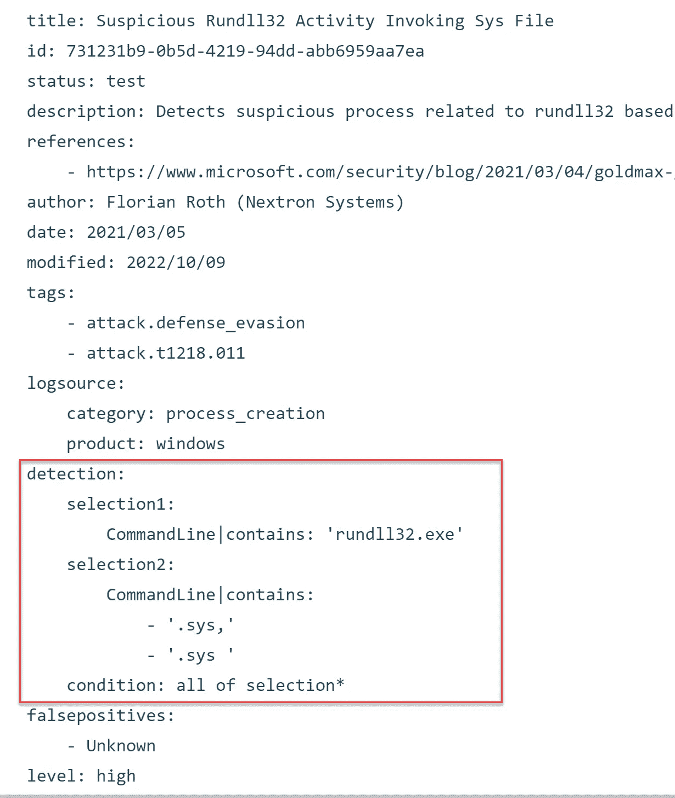
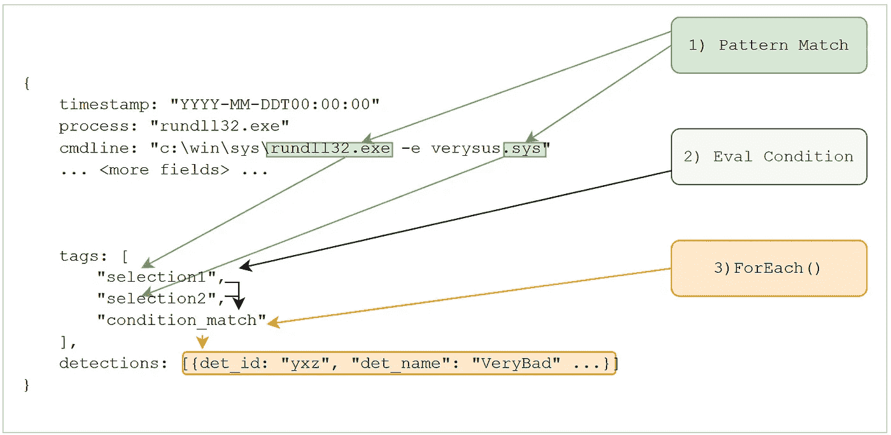
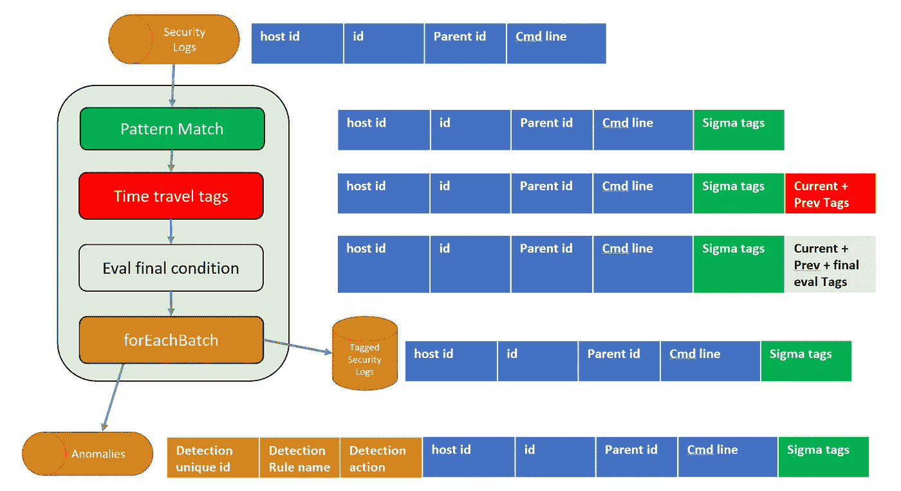
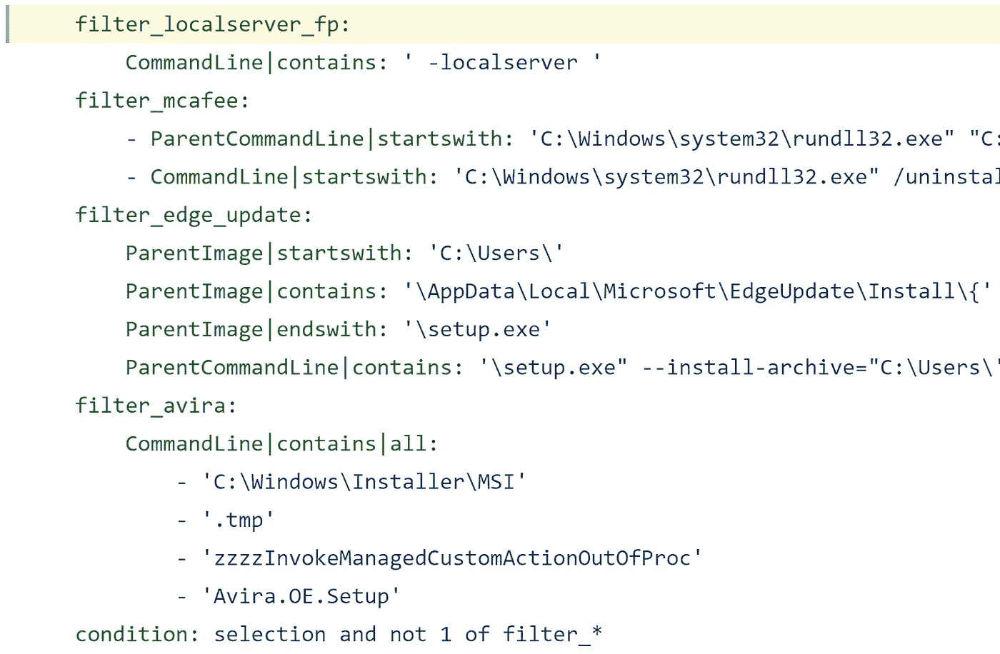
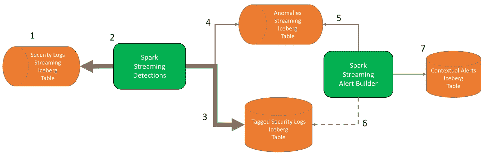
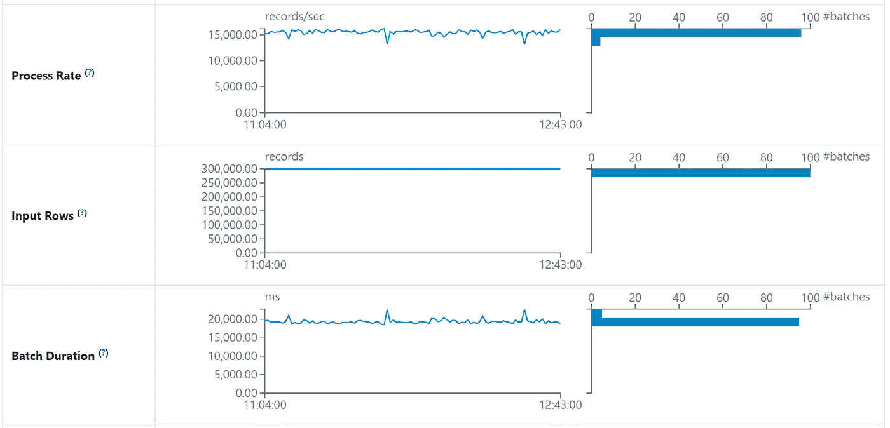
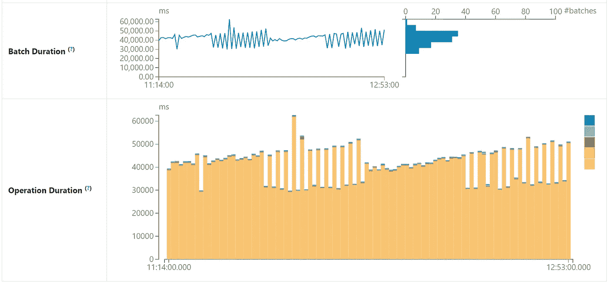

# 使用 Sigma 规则进行异常检测：构建您自己的 Spark 流处理检测

> 原文：[`towardsdatascience.com/anomaly-detection-using-sigma-rules-build-your-own-spark-streaming-detections-657bcef3988a?source=collection_archive---------9-----------------------#2023-06-12`](https://towardsdatascience.com/anomaly-detection-using-sigma-rules-build-your-own-spark-streaming-detections-657bcef3988a?source=collection_archive---------9-----------------------#2023-06-12)

## 轻松在 Spark 流处理管道中部署 Sigma 规则：一种支持即将发布的 Sigma 2 规范的未来-proof 解决方案

[](https://medium.com/@jean-claude.cote?source=post_page-----657bcef3988a--------------------------------)[](https://towardsdatascience.com/?source=post_page-----657bcef3988a--------------------------------) [Jean-Claude Cote](https://medium.com/@jean-claude.cote?source=post_page-----657bcef3988a--------------------------------)

·

[Follow](https://medium.com/m/signin?actionUrl=https%3A%2F%2Fmedium.com%2F_%2Fsubscribe%2Fuser%2F444ed0089012&operation=register&redirect=https%3A%2F%2Ftowardsdatascience.com%2Fanomaly-detection-using-sigma-rules-build-your-own-spark-streaming-detections-657bcef3988a&user=Jean-Claude+Cote&userId=444ed0089012&source=post_page-444ed0089012----657bcef3988a---------------------post_header-----------) 发表在 [Towards Data Science](https://towardsdatascience.com/?source=post_page-----657bcef3988a--------------------------------) · 13 分钟阅读 · 2023 年 6 月 12 日[](https://medium.com/m/signin?actionUrl=https%3A%2F%2Fmedium.com%2F_%2Fvote%2Ftowards-data-science%2F657bcef3988a&operation=register&redirect=https%3A%2F%2Ftowardsdatascience.com%2Fanomaly-detection-using-sigma-rules-build-your-own-spark-streaming-detections-657bcef3988a&user=Jean-Claude+Cote&userId=444ed0089012&source=-----657bcef3988a---------------------clap_footer-----------)

--

[](https://medium.com/m/signin?actionUrl=https%3A%2F%2Fmedium.com%2F_%2Fbookmark%2Fp%2F657bcef3988a&operation=register&redirect=https%3A%2F%2Ftowardsdatascience.com%2Fanomaly-detection-using-sigma-rules-build-your-own-spark-streaming-detections-657bcef3988a&source=-----657bcef3988a---------------------bookmark_footer-----------)

由 Dana Walker 拍摄于 Unsplash

在我们之前的文章中，我们详细阐述并设计了一个名为 flux-capacitor 的有状态函数。

flux-capacitor 有状态函数可以记住日志事件之间的父子（和祖先）关系。它还可以记住在特定时间窗口内在同一主机上发生的事件，Sigma 规范称之为 [时间临近相关性](https://github.com/SigmaHQ/sigma-specification/blob/version_2/Sigma_meta_rules.md#temporal-proximity-temporal)。

要深入了解 flux-capacitor 的设计，请参阅 第一部分，第二部分，[第三部分](https://medium.com/towards-data-science/anomaly-detection-using-sigma-rules-part-3-temporal-correlation-using-bloom-filters-a45ffd5e9069)，[第四部分](https://medium.com/towards-data-science/anomaly-detection-using-sigma-rules-part-4-flux-capacitor-design-70cb5c2cfb72) 和 [第五部分](https://medium.com/towards-data-science/anomaly-detection-using-sigma-rules-part-5-flux-capacitor-optimization-118e538cf8c4)。不过，你不需要理解功能的实现就可以使用它。

在本文中，我们首先展示一个执行离散检测的 Spark 流处理作业。离散检测是一个 Sigma 规则，它使用单个日志行（单个事件）的特征和值。

然后，我们利用 flux-capacitor 功能来处理日志事件之间的有状态父子关系。flux-capacitor 还能检测在特定时间窗口内在同一主机上发生的多个事件，这些在即将发布的 Sigma 规范中被称为 [时间临近相关性](https://github.com/SigmaHQ/sigma-specification/blob/version_2/Sigma_meta_rules.md#temporal-proximity-temporal)。这些 Spark 流处理作业的完整演示可以在我们的 [git repo](https://github.com/cccs-jc/flux-capacitor/tree/main/demo) 中找到。

# 离散检测

执行离散测试相当简单，这要归功于 Spark 中开箱即用的所有内置功能。Spark 支持读取流数据源、写入接收器、检查点、流流连接、窗口聚合等功能。有关所有可能功能的完整列表，请参阅全面的 Spark [结构化流处理编程指南](https://spark.apache.org/docs/latest/structured-streaming-programming-guide.html)。

这里是一个高层次的图示，展示了一个 Spark 流处理作业，它从“start-process”窗口事件的 Iceberg 表中消费事件（1）。一个经典的例子可以在 [Windows Security Logs (事件 ID 4688)](https://www.ultimatewindowssecurity.com/securitylog/encyclopedia/event.aspx?eventID=4688) 中找到。



离散检测的拓扑结构

源表（1）名为`process_telemetry_table`。Spark 作业读取所有事件，检测异常事件，标记这些事件，并将其写入名为`tagged_telemetry_table`的表（3）。被认为异常的事件也会写入一个包含警报的表（4）。

定期我们轮询一个包含我们想要应用的 Sigma 规则自动生成的 SQL 的 git 仓库（5）。如果 SQL 语句发生变化，我们重新启动流处理作业以将这些新的检测添加到管道中。

以[这个 Sigma 规则](https://github.com/SigmaHQ/sigma/blob/master/rules/windows/process_creation/proc_creation_win_rundll32_sys.yml)为例：



来自*proc_creation_win_rundll32_sys.yml 在* Sigma HQ 的截图

`detection`部分是 Sigma 规则的核心，包括一个`condition`和一个或多个命名测试。`selection1`和`selection2`是命名的布尔测试。Sigma 规则的作者可以为这些测试命名有意义的名称。`condition`是用户可以在最终评估中组合测试的地方。有关编写 Sigma 规则的更多细节，请参见[Sigma 规范](https://github.com/SigmaHQ/sigma-specification/blob/main/Sigma_specification.md)。

> 从现在开始，我们将这些命名的布尔测试称为**标签**。

Spark 流处理作业的内部工作分为 4 个逻辑步骤：

+   读取源表`process_telemetry_table`

+   执行模式匹配

+   评估最终条件

+   写入结果

**模式匹配**步骤包括评估在 Sigma 规则中找到的标签，**最终条件评估**评估`condition`。


在该图的右侧，我们展示了在此处理阶段该行的样子。蓝色的列表示从源表中读取的值。**模式匹配**步骤添加了一列名为`Sigma tags`，这是所有执行的测试及其通过或失败情况的映射。灰色列包含最终的 Sigma 规则评估。最后，棕色列是在 foreachBatch 函数中添加的。生成了一个 GUID，从 Sigma 标签映射中提取出为真的规则名称，并从规则名到规则类型的查找映射中检索检测`action`。这为生成的警报提供了上下文。

此图描绘了事件的属性如何组合成标签、最终评估和最终上下文信息。



现在让我们看看实际的 pyspark 代码。首先，我们使用`readStream`函数将 spark 连接到源表，并指定从中读取冰山表的名称。`load`函数返回一个数据帧，我们用它来创建一个名为`process_telemetry_view`的视图。

```py
spark
  .readStream
  .format("iceberg")
  .option("stream-from-timestamp", ts)
  .option("streaming-skip-delete-snapshots", True)
  .option("streaming-skip-overwrite-snapshots", True)
  .load(constants.process_telemetry_table)
  .createOrReplaceTempView("process_telemetry_view")
```

`process_telemetry_view`中的数据如下所示：

```py
+-------------------+---+---------+---------------------+                       
|timestamp          |id |parent_id|Commandline          |
+-------------------+---+---------+---------------------+
|2022-12-25 00:00:01|11 |0        |                     |
|2022-12-25 00:00:02|2  |0        |c:\win\notepad.exe   |
|2022-12-25 00:00:03|12 |11       |                     |
|2022-12-25 00:00:08|201|200      |cmdline and args     |
|2022-12-25 00:00:09|202|201      |                     |
|2022-12-25 00:00:10|203|202      |c:\test.exe          |
+-------------------+---+---------+---------------------+
```

在此视图上，我们应用了一个 **模式匹配** 步骤，该步骤由 Sigma 编译器生成的 SQL 语句组成。`patern_match.sql` 文件如下所示：

```py
select
 *,
 -- regroup each rule's tags in a map (ruleName -> Tags)
 map(
  'rule0',
  map(
      'selection1', (CommandLine LIKE '%rundll32.exe%'),
      'selection2', (CommandLine LIKE '%.sys,%' OR CommandLine LIKE '%.sys %'),
  )
 ) as sigma
from
    process_telemetry_view
```

我们使用 `spark.sql()` 将此语句应用于 `process_telemetry_view` 视图。

```py
df = spark.sql(render_file("pattern_match.sql"))
df.createOrReplaceTempView("pattern_match_view")
```

请注意，每个 Sigma 规则中找到的标签的结果存储在一个布尔值映射中。`sigma` 列保存了每个 Sigma 规则中找到的每个标签的结果。通过使用 **MapType**，我们可以轻松引入新的 Sigma 规则，而不会影响表的模式。添加新规则只是简单地在 `sigma` 列（一个 **MapType**）中增加一项新条目。

```py
+---+---------+---------------------+----------------------------------+
|id |parent_id|Commandline          |sigma
+---+---------+---------------------+----------------------------------+
|11 |0        |                     |{rule0 -> {
                                        selection1 -> false, 
                                        selection2 -> false
                                        }, 
                                     }
```

同样，**评估最终条件** 步骤应用了 Sigma 规则中的条件。`condition` 被编译成一个 SQL 语句，该语句使用 [map](https://spark.apache.org/docs/latest/api/sql/#map), [map_filter](https://spark.apache.org/docs/latest/api/sql/#map_filter), [map_keys](https://spark.apache.org/docs/latest/api/sql/#map_keys) 来构建一个名为 `sigma_final` 的列。此列包含所有条件评估为真规则的名称。

```py
 select
    *,
    map_keys( -- only keep the rule names of rules that evaluted to true
    map_filter( -- filter map entries keeping only rules that evaluated to true
    map( -- store the result of the condition of each rule in a map
        'rule0', 
        -- rule 0 -> condition: all of selection*
        sigma.rule0.selection1 AND sigma.rule0.selection2)
    )
    , (k,v) -> v = TRUE)) as sigma_final
from
    pattern_match_view
```

自动生成的语句使用 `spark.sql()` 应用。

```py
df = spark.sql(render_file("eval_final_condition.sql"))
```

这是添加了新列 `sigma_final` 后的结果，列出了触发的规则数组。

```py
+---+---------+-------------------------------------+-------------+
|id |parent_id|sigma                                | sigma_final |
+---+---------+-------------------------------------+-------------+
|11 |0        |{rule0 -> {                          | []          |
                  selection1 -> false, 
                  selection2 -> false
                  }
               }
```

我们现在准备开始对我们的数据帧进行流处理作业。请注意，我们将回调函数 `for_each_batch_function` 传递给 `foreachBatch`。

```py
streaming_query = (
    df
    .writeStream
    .queryName("detections")
    .trigger(processingTime=f"{trigger} seconds")
    .option("checkpointLocation", get_checkpoint_location(constants.tagged_telemetry_table) )
    .foreachBatch(foreach_batch_function)
    .start()
  )

streaming_query.awaitTermination() 
```

`for_each_batch_function` 在每个微批次中被调用，并接收评估后的 `batchdf` 数据帧。`for_each_batch_function` 将 `batchdf` 的全部内容写入 `tagged_telementry_table`，并对任何评估为真的 Sigma 规则写入警报。

```py
def foreach_batch_function(batchdf, epoch_id):
    # Transform and write batchDF
    batchdf.persist()
    batchdf.createOrReplaceGlobalTempView("eval_condition_view")
    run("insert_into_tagged_telemetry")
    run("publish_suspected_anomalies")
    spark.catalog.clearCache()
```

详细信息请参见我们的 Git 仓库中的 [insert_into_tagged_telemetry.sql](https://github.com/cccs-jc/flux-capacitor/blob/main/demo/templates/static/insert_into_tagged_telemetry.sql) 和 [publish_suspected_anomalies.sql](https://github.com/cccs-jc/flux-capacitor/blob/main/demo/templates/static/publish_suspected_anomalies.sql)。

如上所述，使用 Spark 内置功能编写流式异常检测处理离散测试相对简单。

# 基于过去事件的检测

迄今为止，我们展示了如何使用离散 Sigma 规则检测事件。在本节中，我们利用 flux-capacitor 函数来启用缓存标签和测试过去事件的标签。正如我们在之前的文章中讨论的，flux-capacitor 使我们能够检测父子关系以及过去事件的仲裁特征序列。

这些类型的 Sigma 规则需要同时考虑当前事件和过去事件的标签。为了执行最终规则评估，我们引入了 **Time travel tags** 步骤，以检索事件的所有过去标签，并将它们与当前事件合并。这正是 flux-capacitor 函数设计的目的，它缓存和检索过去的标签。现在，过去标签和当前标签在同一行上，**Eval final condition** 可以像我们在上述离散示例中所做的那样进行评估。

现在检测结果如下：



flux-capacitor 接收 **Pattern Match** 步骤生成的 `Sigma tags`。flux-capacitor 存储这些标签以备后用。红色的列具有与我们之前使用的 `Sigma tags` 列相同的模式。然而，它结合了当前标签和从内部状态检索到的过去标签。

借助 flux-capacitor 函数，添加过去标签的缓存和检索变得容易。在我们的 Spark 异常检测中，我们是这样应用 flux-capacitor 函数的。首先，将 **Pattern Match** 步骤生成的数据框传递给 `flux_stateful_function`，该函数返回另一个数据框，其中包含过去的标签。

```py
flux_update_spec = read_flux_update_spec()
bloom_capacity = 200000
# reference the scala code
flux_stateful_function = spark._sc._jvm.cccs.fluxcapacitor.FluxCapacitor.invoke
# group logs by host_id
jdf = flux_stateful_function(
          pattern_match_df._jdf, 
          "host_id", 
          bloom_capacity, 
          flux_update_spec)
output_df = DataFrame(jdf, spark)
```

为了控制 `flux_stateful_function` 的行为，我们传入一个 `flux_update_spec`。flux-capacitor 规范是由 Sigma 编译器生成的 yaml 文件。规范详细说明了哪些标签应该被缓存和检索，以及它们应该如何处理。`action` 属性可以设置为 `parent`、`ancestor` 或 `temporal`。

让我们使用 Sigma HQ 的一个具体例子 [proc_creation_win_rundll32_executable_invalid_extension.yml](https://github.com/SigmaHQ/sigma/blob/cd71edc09ca915f389e50df5b1bbb5ecd4b7f89d/rules/windows/process_creation/proc_creation_win_rundll32_executable_invalid_extension.yml)



来自 Sigma HQ github 的截图

再次强调，检测的核心由标签和一个最终的 `condition` 组成，它将所有这些标签组合在一起。然而，请注意，这条规则（我们称之为规则 1）涉及对 `CommandLine` 的测试，还测试了父进程 `ParentImage`。**ParentImage** 不是在启动进程日志中找到的字段。相反，它指的是父进程的 **Image** 字段。

如之前所见，这个 Sigma 规则将被编译成 SQL 用于评估标签，并将它们组合成最终条件。

为了传播父标签，Sigma 编译器还生成了一个 flux-capacitor 规范。规则 1 是一个 `parent` 规则，因此规范必须指定什么是父字段和子字段。在我们的日志中，这些对应于 `id` 和 `parent_id`。

规范还指定了哪些 `tags` 应该被 flux-capacitor 函数缓存和检索。以下是自动生成的规范：

```py
rules:
    - rulename: rule1
      description: proc_creation_win_run_executable_invalid_extension
      action: parent
      tags:
        - name: filter_iexplorer
        - name: filter_edge_update
        - name: filter_msiexec_system32
      parent: parent_id
      child: id
```

请注意规则 0 不包含在 flux-capacitor 函数中，因为它没有时间标签。

# 标记传播示例

为了更好地理解 flux-capacitor 的作用，你可以在流分析之外使用该函数。这里我们展示了一个简单的 **祖先** 示例。我们想要传播 `pf` 标签。例如，`pf` 可能表示包含 `rundll32.exe` 的 `CommandLine`。

```py
spec = """
    rules:
        - rulename: rule2
          action: ancestor
          child: pid
          parent: parent_pid
          tags:
            - name: pf
    """

df_input = spark.sql("""
    select
        *
    from
    values
    (TIMESTAMP '2022-12-30 00:00:05', 'host1', 'pid500', '', map('rule1', map('pf', true, 'cf', false))),
    (TIMESTAMP '2022-12-30 00:00:06', 'host1', 'pid600', 'pid500', map('rule1', map('pf', false, 'cf', false))),
    (TIMESTAMP '2022-12-30 00:00:07', 'host1', 'pid700', 'pid600', map('rule1', map('pf', false, 'cf', true)))
    t(timestamp, host_id, pid, parent_pid, sigma)
    """)
```

打印数据框 `df_input` 我们看到 pid500 启动并具有带有 `pf` 特性的 `CommandLine`。然后 pid500 启动了 pid600。之后 pid600 启动了 pid700。Pid700 具有子特性 `cf`。

```py
+-------------------+------+----------+--------------+-------------------------------------+
|timestamp          |pid   |parent_pid|human_readable|sigma                                |
+-------------------+------+----------+--------------+-------------------------------------+
|2022-12-30 00:00:05|pid500|          |[pf]          |{rule2 -> {pf -> true, cf -> false}} |
|2022-12-30 00:00:06|pid600|pid500    |[]            |{rule2 -> {pf -> false, cf -> false}}|
|2022-12-30 00:00:07|pid700|pid600    |[cf]          |{rule2 -> {pf -> false, cf -> true}} |
+-------------------+------+----------+--------------+-------------------------------------+
```

Sigma 规则是 `pf` 和 `cf` 的组合。为了将 `pf` 标签带回当前行，我们需要对 `pf` 标签应用时间旅行。将 flux-capacitor 函数应用于 `df_input` 数据框。

```py
jdf = flux_stateful_function(df_input._jdf, "host_id", bloom_capacity, spec, True)
df_output = DataFrame(jdf, spark)
```

我们获得了 `df_output` 数据框。注意 `pf` 标签如何在时间中传播。

```py
+-------------------+------+----------+--------------+------------------------------------+
|timestamp          |pid   |parent_pid|human_readable|sigma                               |
+-------------------+------+----------+--------------+------------------------------------+
|2022-12-30 00:00:05|pid500|          |[pf]          |{rule2 -> {pf -> true, cf -> false}}|
|2022-12-30 00:00:06|pid600|pid500    |[pf]          |{rule2 -> {pf -> true, cf -> false}}|
|2022-12-30 00:00:07|pid700|pid600    |[pf, cf]      |{rule2 -> {pf -> true, cf -> true}} |
+-------------------+------+----------+--------------+------------------------------------+
```

本笔记本 [TagPropagationIllustration.ipynb](https://github.com/cccs-jc/flux-capacitor/blob/main/TagPropagationIllustration.ipynb) 包含了更多类似的父子和时间邻近的示例。

# 构建带有上下文的警报

flux-capacitor 函数缓存所有过去的标签。为了节省内存，它使用布隆过滤器段缓存这些标签。布隆过滤器具有极小的内存占用，查询和更新都很快。然而，它们确实引入了可能的假阳性。因此，我们的检测可能实际上是一个假阳性。为了解决这个问题，我们将怀疑的异常放入队列 (4) 进行重新评估。

为了消除假阳性，第二个名为 **警报生成器** 的 Spark 流作业读取怀疑的异常 (5) 并检索需要重新评估规则的事件 (6)。

例如，在父子 Sigma 规则的情况下，**警报生成器**将读取怀疑的异常 (5)，检索子进程事件。接下来，在 (6) 中，它将检索该子事件的父进程。然后，利用这两个事件重新评估 Sigma 规则。然而，这次 flux-capacitor 配置为将标签存储在哈希映射中，而不是布隆过滤器中。这消除了假阳性，并且作为额外的好处，我们获得了所有参与检测的事件。我们将此警报及证据行（父子事件）存储到警报表中 (7)。



带有状态检测的拓扑（时间）

**警报生成器** 处理的量仅为 (2) **流检测** 的一小部分。由于在 (5) 中读取的低量，历史搜索到标记的遥测 (6) 是可能的。

想要更深入地了解，请查看 **流检测** 的 Spark 作业 [streaming_detections.py](https://github.com/cccs-jc/flux-capacitor/blob/main/demo/streaming_detections.py) 和 **警报生成器** [streaming_alert_builder.py](https://github.com/cccs-jc/flux-capacitor/blob/main/demo/streaming_alert_builder.py)。

# 性能

为了评估这个概念验证的性能，我们在拥有 16 个 CPU 和 64G 内存的机器上进行了测试。我们编写了一个简单的数据生成器，每秒创建 5,000 个合成事件，并在 30 天内进行了实验。

**Spark Streaming Detections** 作业在一台机器上运行。该作业配置为每分钟触发一次。每个微批次（触发）读取 300,000 个事件，平均需要 20 秒完成。该作业可以轻松跟上输入事件的速率。



**Spark Streaming Detections**

**Spark Alert Builder** 在单台机器上运行，并配置为每分钟触发一次。这个作业完成需要 30 到 50 秒的时间。该作业对 `tagged_telemetry_table` 的组织方式非常敏感。这里我们看到维护作业的效果，每小时组织并排序最新数据。因此，每小时，**Spark Alert Builder** 的微批处理执行时间恢复到 30 秒。



**Spark Streaming Alert Builder**

# 表维护

我们的 Spark 流作业每分钟触发一次，因此每分钟产生小型数据文件。为了在这个表中实现快速搜索和检索，定期对数据进行压缩和排序非常重要。幸运的是，Iceberg 提供了[内置程序](https://iceberg.apache.org/docs/latest/maintenance/)来组织和维护您的表。

例如，这个脚本 [maintenance.py](https://github.com/cccs-jc/flux-capacitor/blob/main/demo/maintenance.py) 每小时运行一次，用于对 Iceberg 的 `tagged_telemetry_table` 中新增加的文件进行排序和压缩。

```py
CALL catalog.system.rewrite_data_files(
            table => 'catalog.jc_sched.tagged_telemetry_table',
            strategy => 'sort',
            sort_order => 'host_id, has_temporal_proximity_tags',
            options => map('min-input-files', '100',
                        'max-concurrent-file-group-rewrites', '30',
                        'partial-progress.enabled', 'true'),
            where => 'timestamp >= TIMESTAMP \'2023-05-06 00:00:00\' '
        )
```

每天结束时，我们还会重新对这个表进行排序，以在长时间搜索期间（几个月的数据）实现最大的搜索性能。

```py
CALL catalog.system.rewrite_data_files(
            table => 'catalog.jc_sched.tagged_telemetry_table',
            strategy => 'sort',
            sort_order => 'host_id, has_temporal_proximity_tags',
            options => map('min-input-files', '100',
                        'max-concurrent-file-group-rewrites', '30',
                        'partial-progress.enabled', 'true',
                        'rewrite-all', 'true'),
            where => 'timestamp >= TIMESTAMP \'2023-05-05 00:00:00\' AND timestamp < TIMESTAMP \'2023-05-06 00:00:00\' '
        )
```

我们还执行另一个维护任务，即从流表中删除旧数据。这些表仅用作生产者和消费者之间的缓冲区。因此，每天我们会对流表进行老化处理，保留最近 7 天的数据。

```py
delete from catalog.jc_sched.process_telemetry_table
where
    timestamp < current_timestamp() - interval 7 days
```

最后，每天我们执行标准的 Iceberg 表维护任务，如过期快照和删除孤立文件。我们在所有表上运行这些维护作业，并在[Airflow](https://airflow.apache.org/)上安排这些作业的时间。

# 结论

在本文中，我们展示了如何构建一个 Spark 流异常检测框架，通用地应用 Sigma 规则。新的 Sigma 规则可以轻松添加到系统中。

这个概念验证在合成数据上进行了广泛测试，以评估其稳定性和可扩展性。它显示出很大的潜力，将在生产系统上进一步评估。

> *除非另有说明，所有图片均为作者所有*
