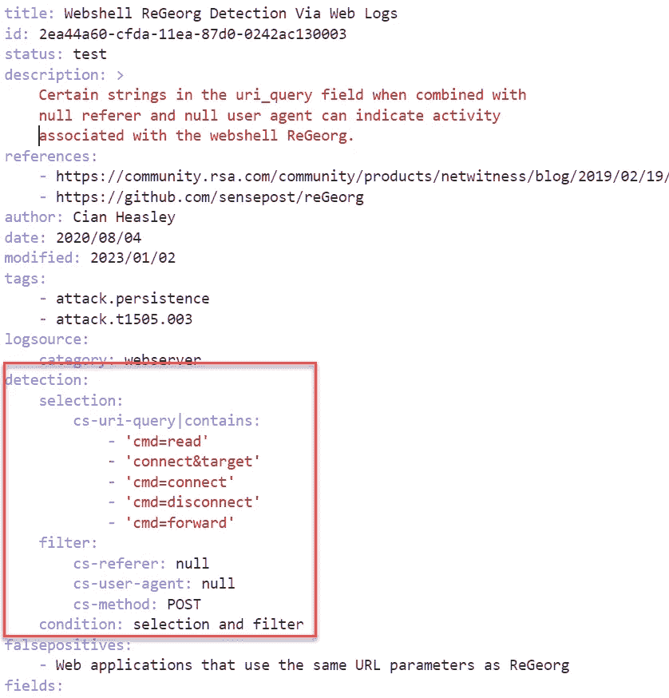
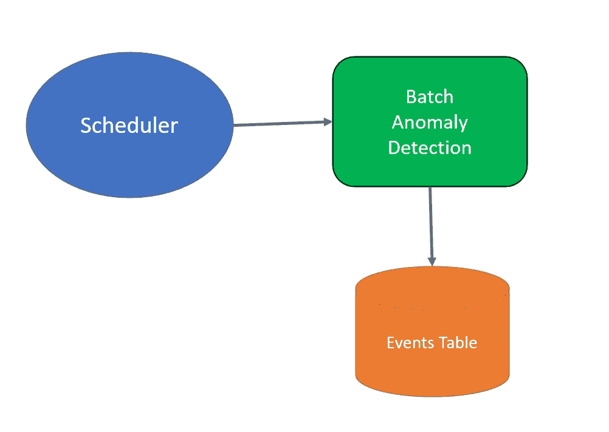
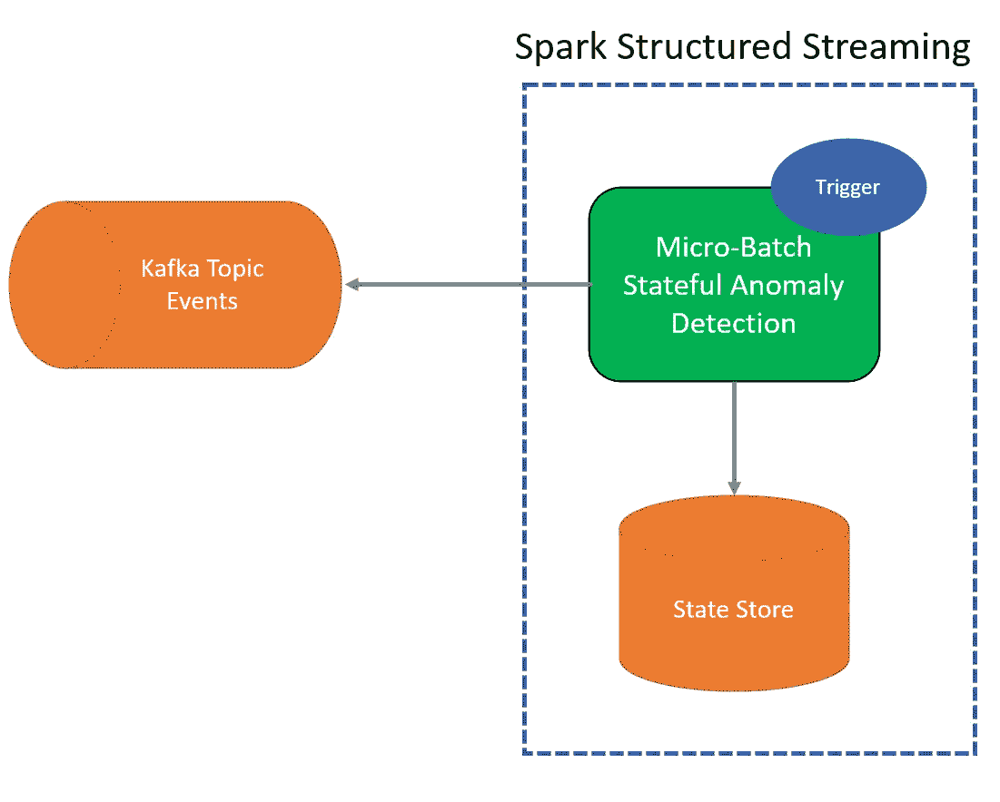

# 使用 Sigma 规则进行异常检测（第一部分）：利用 Spark SQL 流处理

> 原文：[`towardsdatascience.com/anomaly-detection-using-sigma-rules-part-1-leveraging-spark-sql-streaming-246900e95457?source=collection_archive---------9-----------------------#2023-01-24`](https://towardsdatascience.com/anomaly-detection-using-sigma-rules-part-1-leveraging-spark-sql-streaming-246900e95457?source=collection_archive---------9-----------------------#2023-01-24)

## Sigma 规则用于检测网络安全日志中的异常。我们使用 Spark 结构化流处理来大规模评估 Sigma 规则。

[](https://medium.com/@jean-claude.cote?source=post_page-----246900e95457--------------------------------)[](https://towardsdatascience.com/?source=post_page-----246900e95457--------------------------------) [Jean-Claude Cote](https://medium.com/@jean-claude.cote?source=post_page-----246900e95457--------------------------------)

·

[关注](https://medium.com/m/signin?actionUrl=https%3A%2F%2Fmedium.com%2F_%2Fsubscribe%2Fuser%2F444ed0089012&operation=register&redirect=https%3A%2F%2Ftowardsdatascience.com%2Fanomaly-detection-using-sigma-rules-part-1-leveraging-spark-sql-streaming-246900e95457&user=Jean-Claude+Cote&userId=444ed0089012&source=post_page-444ed0089012----246900e95457---------------------post_header-----------) 发表在 [Towards Data Science](https://towardsdatascience.com/?source=post_page-----246900e95457--------------------------------) ·8 min 阅读·2023 年 1 月 24 日[](https://medium.com/m/signin?actionUrl=https%3A%2F%2Fmedium.com%2F_%2Fvote%2Ftowards-data-science%2F246900e95457&operation=register&redirect=https%3A%2F%2Ftowardsdatascience.com%2Fanomaly-detection-using-sigma-rules-part-1-leveraging-spark-sql-streaming-246900e95457&user=Jean-Claude+Cote&userId=444ed0089012&source=-----246900e95457---------------------clap_footer-----------)

--

[](https://medium.com/m/signin?actionUrl=https%3A%2F%2Fmedium.com%2F_%2Fbookmark%2Fp%2F246900e95457&operation=register&redirect=https%3A%2F%2Ftowardsdatascience.com%2Fanomaly-detection-using-sigma-rules-part-1-leveraging-spark-sql-streaming-246900e95457&source=-----246900e95457---------------------bookmark_footer-----------)

摄影：Tom Carnegie，来源于 Unsplash，加拿大最高法院

## 数据草图的兴起

数据草图是一个总括性术语，涵盖了使用理论数学、统计学和计算机科学的各种数据结构和算法，以解决集合基数、分位数、频率估计等问题，并具有数学上证明的误差范围。

数据草图比传统方法快几个数量级，它们需要更少的计算资源，有时是解决大数据问题的唯一可行解决方案。要了解更多关于数据草图的信息，请查看 [Apache Data Sketch 项目](https://datasketches.apache.org/docs/Background/SketchOrigins.html)。

> 草图实现了可以从中提取信息的算法。
> 
> 在单次传输的数据流中，这也被称为“单次触摸”处理。

Spark 大量利用数据草图，例如：[维度缩减](https://spark.apache.org/docs/latest/mllib-dimensionality-reduction.html)、[局部敏感哈希](https://spark.apache.org/docs/latest/ml-features.html#locality-sensitive-hashing)、[计数最小草图](https://spark.apache.org/docs/latest/api/sql/#count_min_sketch)。

在这一系列文章中，我们将带你深入了解高性能欺诈检测系统的设计。通过实际例子，我们评估并对比了传统算法与基于数据草图的算法的性能。

## 什么是 Sigma 规则

[Sigma](https://github.com/SigmaHQ/sigma) 是一种通用签名格式，允许你在日志事件中进行检测。规则易于编写，适用于任何类型的日志。最重要的是，Sigma 规则是抽象的，不绑定于任何特定的 SIEM，使得 Sigma 规则可共享。

一旦网络安全研究人员或分析师开发了检测方法，他们可以使用 Sigma 描述并与他人分享他们的技术。以下是来自 Sigma HQ 的一段话：

> Sigma 对日志文件的作用就如同 [Snort](https://www.snort.org/) 对网络流量和 [YARA](https://github.com/VirusTotal/yara) 对文件的作用。

让我们来看一下来自 [Sigma HQ](https://github.com/SigmaHQ/sigma/blob/master/rules/web/web_webshell_regeorg.yml) 的一个[示例](https://github.com/SigmaHQ/sigma/blob/master/rules/web/web_webshell_regeorg.yml)。



规则的核心是检测部分。当条件评估为 true 时，意味着我们进行了检测。条件由命名表达式组成。例如，这里声明了选择和过滤表达式。这些表达式对日志的属性进行测试。在这种情况下是 web 日志。

## Sigmac 生成 SQL

Sigmac 编译器用于将抽象的 Sigma 规则转换为具体的形式，以便实际的 SIEM 或处理平台进行评估。Sigmac 具有许多后端，能够将规则转换为 QRadar、ElasticSearch、ArcSight、FortiSIEM 和通用 SQL。

使用 SQL sigmac 后端，我们可以将上述规则转换为：

```py
SELECT 
    * 
FROM
    (
    SELECT
    (
        (cs-uri-query LIKE '%cmd=read%'
        OR cs-uri-query LIKE '%connect&target%'
        OR cs-uri-query LIKE '%cmd=connect%'
        OR cs-uri-query LIKE '%cmd=disconnect%'
        OR cs-uri-query LIKE '%cmd=forward%')
        AND (cs-referer IS NULL
        AND cs-USER-agent IS NULL
        AND cs-METHOD LIKE 'POST')) 
 AS web_webshell_regeorg,
       *
   FROM
    test_webserver_logs
   )
WHERE 
     web_webshell_regeorg = TRUE
```

这些 SQL 语句通常由调度器在特定触发间隔（例如 1 小时）下调用。每小时，检测系统会搜索最新的事件。



然而，一些 Sigma 规则应用了时间聚合。例如，[通过全球目录进行枚举](https://github.com/SigmaHQ/sigma/blob/7c36a33ea77e94cbb5ad58fa061a84ed74dd503a/rules/windows/builtin/security/win_global_catalog_enumeration.yml)计算一段时间窗口内事件的发生次数。

```py
detection:
    selection:
        EventID: 5156
        DestPort:
        - 3268
        - 3269
    timeframe: 1h
    condition: selection | count() by SourceAddress > 2000
```

使用上述批处理模型，这些类型的查询会一遍又一遍地重新处理相同的事件。特别是当相关窗口很大时。此外，如果我们试图通过将触发频率提高到每`5 分钟`来减少检测延迟，我们将引入更多对相同事件的重新处理。

理想情况下，为了减少对相同事件的反复处理，我们希望异常检测能够记住上一个处理的事件是什么，以及迄今为止计数器的值。这正是 Spark Structured Streaming 框架所提供的功能。流式查询每分钟触发一次微批处理（可配置）。它读取新事件，更新所有计数器并将其持久化（用于灾难恢复）。



在这种模型中，每个事件只评估一次。提高触发频率不会像无状态批处理模型那样产生相同的成本。而且由于事件只评估一次，复杂的检测（如正则表达式匹配）不会产生膨胀的成本。

## 使用 Spark Streaming 运行检测

Spark Structured Streaming 可以轻松评估 sigmac 编译器生成的 SQL。首先，我们通过连接到我们最喜欢的队列机制（EventHubs，Kafka）来创建一个流数据框。在本例中，我们将从一个 Iceberg 表中`readStream`，该表中事件会被增量插入。了解有关 Iceberg 流能力的更多信息，[请点击这里](https://iceberg.apache.org/docs/latest/spark-structured-streaming/)。

```py
# current time in milliseconds
ts = int(time.time() * 1000)
# create a streaming dataframe for an iceberg table
streamingDf = (
    spark.readStream
    .format("iceberg")
    .option("stream-from-timestamp", ts)
    .option("streaming-skip-delete-snapshots", True)
    .load("icebergcatalog.dev.events_table")
)

# alias the dataframe to a table named "events"
streamingDf.createOrReplaceTempView("events")
```

注意，我们将流数据框别名为视图名称`events`。这样做是为了在 SQL 语句中引用此流数据框，即：`select * from events`。我们现在要做的就是配置 sigmac 编译器，以便对`events`表生成 SQL 语句。例如，生成的 sql 文件可能如下所示：

```py
SELECT
    (cs-uri-query LIKE '%cmd=read%'
    OR cs-uri-query LIKE '%connect&target%'
    OR cs-uri-query LIKE '%cmd=connect%'
    OR cs-uri-query LIKE '%cmd=disconnect%'
    OR cs-uri-query LIKE '%cmd=forward%')
    AND (cs-referer IS NULL
    AND cs-USER-agent IS NULL
    AND cs-METHOD LIKE 'POST')) 
    AS web_webshell_regeorg,
    -- another detection here
    cs-uri-query LIKE '%something%'
    AS detection2
    *
FROM
    events
```

在我们的分析中，我们加载生成的 SQL 并要求 Spark 从中创建一个`hitsDf`数据框。

```py
# load auto-generated SQL statement
with open('./generated_sql_statement.sql', 'r') as f:
    detections_sql = f.read()

hitsDf = spark.sql(detections_sql)
```

我们通过调用`writeStream`启动流查询，并配置查询以每分钟触发一次微批处理。此流查询将无限期运行，将检测结果写入我们选择的接收端。这里我们只是将结果写入控制台接收端，但我们也可以写入另一个 Iceberg 表。或者，我们可以使用`[forEachBatch](https://spark.apache.org/docs/latest/structured-streaming-programming-guide.html#using-foreach-and-foreachbatch)`执行一些任意的 python 代码，例如，将通知推送到 REST 端点。或者我们甚至可以同时做这两件事。

```py
# start a streaming query printing results to the console
query = (
    hitsDf.writeStream
    .outputMode("append")
    .format("console")
    .trigger(processingTime="1 minute")
    .start()
)
```

## 父进程挑战

到目前为止，我们已经看到了如何检测离散事件中的异常。然而，Sigma 规则可以将事件与之前的事件相关联。一个经典的例子是在 [Windows 安全日志 (事件 ID 4688)](https://www.ultimatewindowssecurity.com/securitylog/encyclopedia/event.aspx?eventID=4688) 中找到的。在这个日志源中，我们可以找到有关进程创建的信息。该日志中的一个关键部分是启动此进程的进程。你可以使用这些 `Process ID` 来确定程序在运行时做了什么等。

以这个 Sigma 规则为例：[Rundll32 执行没有 DLL 文件](https://github.com/SigmaHQ/sigma/blob/master/rules/windows/process_creation/proc_creation_win_run_executable_invalid_extension.yml)。

```py
detection:
    selection:
        Image|endswith: '\rundll32.exe'
    filter_empty:
        CommandLine: null
    filter:
        - CommandLine|contains: '.dll'
        - CommandLine: ''
    filter_iexplorer:
        ParentImage|endswith: ':\Program Files\Internet Explorer\iexplore.exe'
        CommandLine|contains: '.cpl'
    filter_msiexec_syswow64:
        ParentImage|endswith: ':\Windows\SysWOW64\msiexec.exe'
        ParentCommandLine|startswith: 'C:\Windows\syswow64\MsiExec.exe -Embedding'
    filter_msiexec_system32:
        ParentImage|endswith: ':\Windows\System32\msiexec.exe'
        ParentCommandLine|startswith: 'C:\Windows\system32\MsiExec.exe -Embedding'
    filter_splunk_ufw:
        ParentImage|endswith: ':\Windows\System32\cmd.exe'
        ParentCommandLine|contains: ' C:\Program Files\SplunkUniversalForwarder\'
    filter_localserver_fp:
        CommandLine|contains: ' -localserver '
    condition: selection and not 1 of filter*
```

在原始遥测中，一个事件只知道父级 `Process ID`。然而，规则中提到 `ParentImage` 和 `ParentCommandLine`。规则基本上假设已经进行了连接。

幸运的是，Spark Structured Streaming 支持 [流-流连接](https://spark.apache.org/docs/latest/structured-streaming-programming-guide.html#stream-stream-joins)。为了检索 `ParentImage` 和 `ParentCommandLine`，我们对进程日志进行自连接。我们将 `current` 侧与 `parent_of_interest` 侧连接。连接条件如下：

`current.ParentProcessID = parent_of_interest.ProcessID`

## 左侧：为每个检测规则设置标志

我们使用 `c` 作为当前进程的约定，使用 `r1` 作为规则 1。

因此，在 [Rundll32 执行没有 DLL 文件](https://github.com/SigmaHQ/sigma/blob/master/rules/windows/process_creation/proc_creation_win_run_executable_invalid_extension.yml)（规则 1）中，`filter_empty` 被

```py
 %%sparksql --view current --output skip
select
    *,
    ID,
    CommandLine,
    ImagePath,
    -- rule 1
    ImagePath ilike '%\\\\rundll32.exe' as cr1_selection,
    Commandline is null as cr1_filter_empty,
    Commandline ilike '%.dll%' OR Commandline = '' as cr1_filter,
    Commandline ilike '% -localserver %' as cr1_filter_localserver_fp
from
    events
```

## 右侧：在 `parents_of_interest` 上过滤消息

对于应用于父进程的条件，我们也进行相同的操作。然而，在这种情况下，我们还会过滤表格。这意味着被过滤的父进程的所有标志必然都设置为 `FALSE`。通过过滤，我们大大减少了执行流式连接时需要缓存的 `parents_of_interest` 键的数量。

```py
%%sparksql --output skip --view parents_of_interest

select
    *
from (
    select
        host_id as parent_host_id,
        ID as parent_id,
        ImagePath as parent_imagepath,
        CommandLine as parent_commandline,

        -- rule 1
        (ImagePath ilike '%:\Program Files\Internet Explorer\iexplore.exe'
            AND CommandLine ilike '%.cpl%')
        as pr1_filter_iexplorer,
        (ImagePath ilike '%:\Windows\SysWOW64\msiexec.exe'
            AND CommandLine ilike 'C:\Windows\syswow64\MsiExec.exe -Embedding%')
        as pr1_filter_msiexec_syswow64,
        (ImagePath ilike '%:\Windows\System32\msiexec.exe' AND
            CommandLine ilike 'C:\Windows\system32\MsiExec.exe -Embedding%')
        as pr1_filter_msiexec_system32
    from
        events
)
where
    pr1_filter_iexplorer
    OR pr1_filter_msiexec_syswow64
    OR pr1_filter_msiexec_system32 
```

## 将当前与其父级连接

我们对父级侧进行左连接。由于父级侧被过滤，因此可能找不到对应的父进程 ID。当未找到父进程时，列将具有标志设置为 NULL。我们使用 `coalesce` 将这些父级标志的值设置为 `FALSE`。`pr3_selection_atexec` 是一个父标志，因此我们像这样应用 `coalesce`：

```py
coalesce(pr3_selection_atexec, FALSE)
```

我们还组合来自当前和父级的条件。例如，`selection_atexec` 条件由父级和子级条件组成。

```py
selection_atexec:
        ParentCommandLine|contains:
            - 'svchost.exe -k netsvcs' 
            - 'taskeng.exe'
        CommandLine|contains|all:
            - 'cmd.exe'
            - '/C'
            - 'Windows\Temp\'
            - '&1'
```

因此我们像这样组合它们：

```py
cr3_selection_atexec AND coalesce(pr3_selection_atexec, FALSE) 
as r3_selection_atexec,
```

`r3_selection_atexec` 是规则 3 中 `selection_atexec` 的最终标志。

```py
%%sparksql --view joined --output skip

select
    --rule1
    cr1_selection as r1_selection,
    cr1_filter_empty as r1_filter_empty,
    cr1_filter as r1_filter,
    cr1_filter_localserver_fp as r1_filter_localserver_fp,
    coalesce(pr1_filter_iexplorer, FALSE) as r1_filter_iexplorer,
    coalesce(pr1_filter_msiexec_syswow64, FALSE) as r1_filter_msiexec_syswow64,
    coalesce(pr1_filter_msiexec_system32, FALSE) as r1_filter_msiexec_system32,
    parent_host_id,
    parent_id,
    parent_imagepath,
    parent_commandline
from
    current as c
    left join parents_of_interest as p
    on c.ParentProcessID = p.parent_id
```

## 最后我们应用 Sigma 规则条件

例如规则 1 的条件是：

```py
condition: selection and not 1 of filter*
```

我们只需应用这个条件，并将结果命名为 `rule1`。

```py
r1_selection AND NOT (r1_filter_empty 
                              OR r1_filter
                              OR r1_filter_localserver_fp
                              OR r1_filter_iexplorer
                              OR r1_filter_msiexec_syswow64
                              OR r1_filter_msiexec_system32)
        as rule1,
```

以下是完整语句中的条件。

```py
%%sparksql --output json
select
    *
from (
    select
        *,

        -- rule 1 -> condition: selection and not 1 of filter*
        r1_selection AND NOT (r1_filter_empty 
                              OR r1_filter
                              OR r1_filter_localserver_fp
                              OR r1_filter_iexplorer
                              OR r1_filter_msiexec_syswow64
                              OR r1_filter_msiexec_system32)
        as rule1,
    from
        joined
    )
where
    rule1 = TRUE
```

请注意，sigmac 编译器不会生成这种类型的 SQL。然而，我们计划编写一个自定义的 sigma 编译器以生成上述 SQL 语句。

执行这些 SQL 语句与我们最初的示例没有区别。

Spark Structured Streaming 可以在微批处理之间保持和持久化状态。在文档中，Spark 称之为[窗口分组聚合](https://spark.apache.org/docs/latest/structured-streaming-programming-guide.html#window-operations-on-event-time)。相同的原则适用于流-流连接。你可以配置 Spark 来缓存聚合，或者在这种情况下，缓存`parents_of_interests`的行在一个窗口中。

然而，这种方式的扩展性如何？我们可以在 Spark 的[状态存储](https://spark.apache.org/docs/3.0.2/api/scala/org/apache/spark/sql/streaming/GroupState.html)窗口中保留多少行`parents_of_interests`？

在我们下一篇文章中，我们将回答这些问题。为了不遗漏，请关注我们并订阅邮件获取这些故事。敬请期待！

> 除非另有说明，所有图像均由作者提供。
