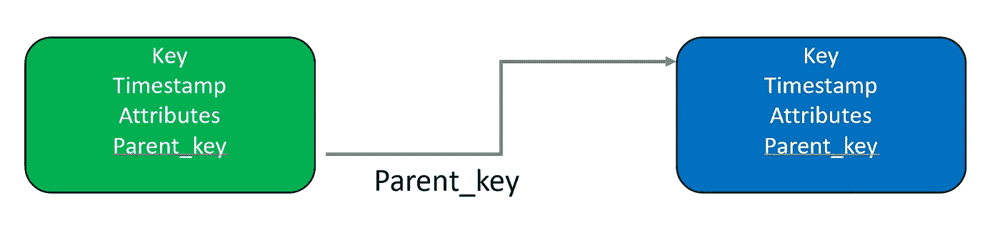
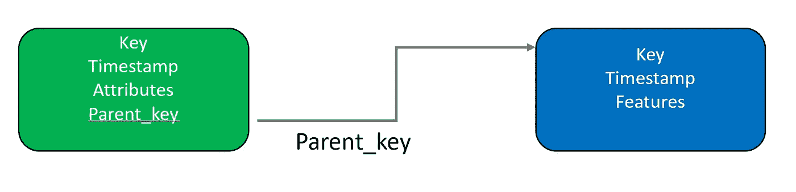
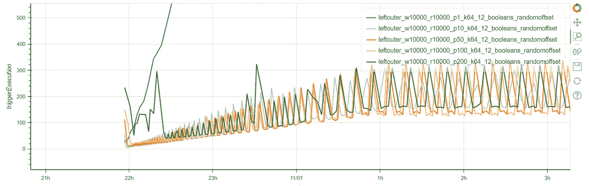
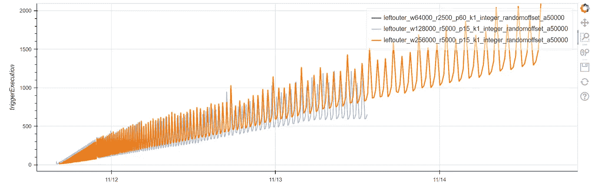
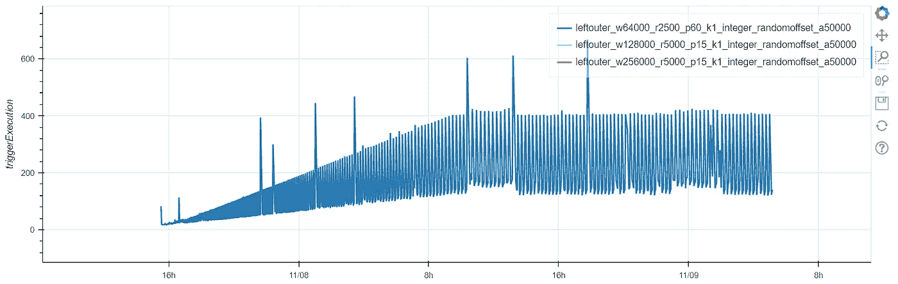
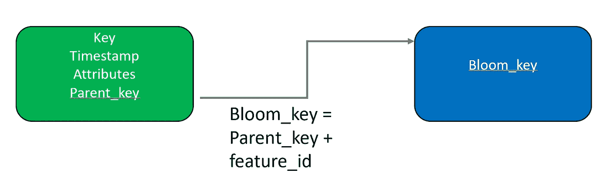

# 使用 Sigma 规则的异常检测（第二部分） Spark 流-流连接

> 原文：[`towardsdatascience.com/anomaly-detection-using-sigma-rules-part-2-spark-stream-stream-join-6bb4734e912f?source=collection_archive---------14-----------------------#2023-02-02`](https://towardsdatascience.com/anomaly-detection-using-sigma-rules-part-2-spark-stream-stream-join-6bb4734e912f?source=collection_archive---------14-----------------------#2023-02-02)

## 一类 Sigma 规则检测时间相关性。我们评估了 Spark 的有状态对称流-流连接在执行时间相关性时的可扩展性。

[](https://medium.com/@jean-claude.cote?source=post_page-----6bb4734e912f--------------------------------)[](https://towardsdatascience.com/?source=post_page-----6bb4734e912f--------------------------------) [Jean-Claude Cote](https://medium.com/@jean-claude.cote?source=post_page-----6bb4734e912f--------------------------------)

·

[关注](https://medium.com/m/signin?actionUrl=https%3A%2F%2Fmedium.com%2F_%2Fsubscribe%2Fuser%2F444ed0089012&operation=register&redirect=https%3A%2F%2Ftowardsdatascience.com%2Fanomaly-detection-using-sigma-rules-part-2-spark-stream-stream-join-6bb4734e912f&user=Jean-Claude+Cote&userId=444ed0089012&source=post_page-444ed0089012----6bb4734e912f---------------------post_header-----------) 发表在[Towards Data Science](https://towardsdatascience.com/?source=post_page-----6bb4734e912f--------------------------------) ·7 分钟阅读·2023 年 2 月 2 日[](https://medium.com/m/signin?actionUrl=https%3A%2F%2Fmedium.com%2F_%2Fvote%2Ftowards-data-science%2F6bb4734e912f&operation=register&redirect=https%3A%2F%2Ftowardsdatascience.com%2Fanomaly-detection-using-sigma-rules-part-2-spark-stream-stream-join-6bb4734e912f&user=Jean-Claude+Cote&userId=444ed0089012&source=-----6bb4734e912f---------------------clap_footer-----------)

--

[](https://medium.com/m/signin?actionUrl=https%3A%2F%2Fmedium.com%2F_%2Fbookmark%2Fp%2F6bb4734e912f&operation=register&redirect=https%3A%2F%2Ftowardsdatascience.com%2Fanomaly-detection-using-sigma-rules-part-2-spark-stream-stream-join-6bb4734e912f&source=-----6bb4734e912f---------------------bookmark_footer-----------)

由 Naveen Kumar 拍摄，来自 Unsplash

跟进我们[之前的文章](https://medium.com/towards-data-science/anomaly-detection-using-sigma-rules-part-1-leveraging-spark-sql-streaming-246900e95457)，我们评估了 Spark 将一个开始进程事件与其父开始进程事件进行连接的能力。

在这篇文章中，我们评估了 Spark [流-流连接](https://spark.apache.org/docs/latest/structured-streaming-programming-guide.html#stream-stream-joins)的扩展性。具体来说，它能在连接窗口中容纳多少事件。

在我们的研究中，我们评估了几种方法：

## 完全连接

完整的流-流连接需要缓存连接右侧的所有先前事件（父项启动过程）。由于只有这些父项启动过程事件的子集是感兴趣的，因此不需要所有过去的父项启动过程详细信息。例如，一个 Sigma 规则可能会指定一个包含字符串 `.cpl` 的父项 CommandLine——所有其他事件可以被忽略。

## 加入感兴趣的父项

感兴趣的父项是将过滤条件应用于连接的右侧得到的结果。这可以大大减少需要记住的父项数量。连接完成后，我们对当前处理和父项处理应用条件。



## 与感兴趣的父项特征连接

更好的解决方案是存储我们在右侧评估的条件，并丢弃所有其他属性——CommandLine、Image 等。这样我们只保留有限数量的布尔标志，而不是可能很长的字符串。在下图中，`Features` 是 Sigma 过滤器表达式名称的映射，值是测试结果。例如：

```py
features = { 
  'rule3_selection_atexec' -> false, 
  'rule2_selection' -> true 
}
```



在我们的研究中，我们很快意识到减少 Spark 需要存储的状态量至关重要。因此，我们选择只保留感兴趣的父项。这些是我们正在寻找的特征的父项。我们丢弃所有其他父项，只保留这些父项的最小信息集：连接键、时间戳和特征标志。

## 模拟测试框架

为了评估 Spark 流-流连接的性能，我们创建了一个 `cause` 和 `effect` 事件的模拟流。在我们的实验中，我们通过设置水印为零来禁用迟到支持。

```py
 cause = (
        spark.readStream
        .format("rate")
        .option("rowsPerSecond", rate)
        .load()
        .withWatermark("timestamp", "0 seconds")
        .withColumn("name", F.lit(name))
    )
```

这些`cause`和`effect`流事件是通过 Spark 流-流连接操作进行合并的：

```py
 cause = cause.select('cause_timestamp', 'cause_key', 'cause_load')

effect = effect.select(
  'effect_timestamp', 
  'effect_key', 
  'effect_load', 
  'host_id', 
  'id', 
  'name', 
  'value')

joindf = (
    effect.join(
        cause,
        F.expr(f"""
            effect_key = cause_key
            and effect_timestamp >= cause_timestamp
            and effect_timestamp < (cause_timestamp + interval {window} seconds)
        """),
        "left"
    )

joindf
    .writeStream
    .format("iceberg")
    .outputMode("append")
    .trigger(processingTime="1 minutes")
    .queryName(name)
    .option("checkpointLocation", checkpoint)
    .toTable(output_table_name)
```

注意连接表达式 `effect_key = cause_key` 和窗口子句，表示效果时间必须在 `cause` 之后，但不能比 `window` 秒更久。

Linxiao Ma 在他的文章 [Spark Structured Streaming Deep Dive (7) — Stream-Stream Join](https://dataninjago.com/2022/07/21/spark-structured-streaming-deep-dive-7-stream-stream-join/) 中详细解释了，在这些条件下，原因事件会被缓存到 Spark 的有状态存储中，最多 `window` 秒。然而，`effect` 事件不需要被存储。对于每个在流-流连接中经过的 `effect` 事件，都会进行查找以找到相应的 `cause`。对于每个进入连接的 `effect`，都会写入一行 `cause+effect`。

## 选择合适的状态存储

Spark 有两个状态存储实现。最初的是名为 HDFSBackedStateStore 的，它是一个由 HDFS 文件支持的简单内存哈希表。最新的状态存储基于 RocksDB。[RocksDB 是一个可嵌入的键值持久存储](https://www.confluent.io/blog/how-to-tune-rocksdb-kafka-streams-state-stores-performance/)用 C++编写。RocksDB 的状态部分保存在内存中，部分保存在本地磁盘上。在每个检查点，Spark 将更改的文件副本保存到中央位置（数据湖）。

当你需要存储大量键时，Spark 推荐使用[RocksDB](https://spark.apache.org/docs/latest/structured-streaming-programming-guide.html#rocksdb-state-store-implementation)。根据[DataBricks](https://docs.databricks.com/structured-streaming/stateful-streaming.html)，一个大型 Spark 工作节点可以缓存多达 1 亿个键。

由于我们的流流连接会缓存大量的感兴趣的父项行，我们决定在评估中使用 RocksDB 状态存储。

```py
.config("spark.sql.streaming.stateStore.providerClass", 
  "org.apache.spark.sql.execution.streaming.state.RocksDBStateStoreProvider")
```

我们所有的实验都在一个具有 48G RAM 和 16 CPU 的单个 Spark 工作节点上进行。我们模拟了来自 50,000 个主机的日志。

我们的测试框架非常灵活。它允许我们更改许多参数，例如每秒事件数、每个事件的大小、连接的时间窗口、键大小、时间窗口中事件的分布等。

## Spark 分区的影响

在我们的第一个实验中，我们在 10,000 秒（约 2.77 小时）的窗口中连接效果和原因。我们模拟了每个感兴趣的父项会有 12 个布尔标志。我们设置了每秒 10,000 个事件的速率。在这里，我们展示了 Spark 分区（单个任务）数量变化的影响。



更改分区数量对性能没有影响。执行一个微批次的时间大约是 225 秒。记住我们每 60 秒触发一次`.trigger(processingTime="1 minutes")`。Spark 将立即开始下一个微批次。因此，事件处理的延迟最多为 225 秒。

## 窗口大小的影响

在第二个实验中，我们调整了流流连接窗口的大小（时间）。在每秒 5,000 个事件的速率下，作业不稳定。每个微批次的执行时间越来越长。我们正在落后。



如果我们将窗口减少到 18 小时，并将速率降低到每秒 2,500 个事件，作业会稳定下来，并在每个微批次约 300 秒时达到稳定。



然而，实际上，我们不会保留每一个父事件。我们只会保留“感兴趣的父事件”。这些事件中有一个或多个为真的 Sigma 规则表达式。重要的是要衡量 Spark 存储父事件的能力。我们可以轻松计算：2,500 事件/秒 x 64,000 秒。Spark 可以缓存 1.6 亿个“感兴趣的父事件”。我们的实验结果确认了 [Databricks 关于 RocksDB StateStore 的声明](https://docs.databricks.com/structured-streaming/stateful-streaming.html)，即每台机器可以处理 1 亿个键。如果我们假设这些事件来自 50,000 个主机，那么 Spark 可以每台主机保存 3,200 个“感兴趣的父事件”。

有趣的是，Spark 存储了特征标志和键。它需要存储 `causes` 的键，以便将其与 `effect` 键连接。

我们可以做的另一个有趣的观察是，通过键查找我们检索到什么？我们检索到一个包含布尔标志的事件（即一行）。实际上，这些标志通常是互斥的。也就是说，在某一行中，只有一个标志可能为真，而所有其他标志都为假。Spark 存储 `cause` 键和所有相关的标志，无论它们是真还是假。

## Bloom 过滤器连接

是否有更好的方法来跟踪特征标志？是的，答案是 Bloom 过滤器。

Bloom 过滤器是一种概率数据结构，可以存储一个键并测试键的存在性。Bloom 过滤器对键进行哈希，并利用哈希结果在位数组中设置一些位。

Bloom 过滤器非常紧凑。为了节省空间，你可能会付出假阳性的代价。然而，一旦检测完成，触发的 Sigma 规则可以重新评估以确认正确性。

我们可以使用 Bloom 过滤器来执行上述连接。假设我们使用一个复合键（`parent_key + feature_id`），其中 `feature_id` 是给定 Sigma 过滤器表达式的名称。应用于父进程的过滤器表达式存储在 Bloom 过滤器中，但仅在它们为真的情况下。测试复合键的存在性，如果键在 Bloom 中，则返回真；如果不在，则返回假。

Bloom 可以存储一定数量的键。超出这个数量后，假阳性会急剧增加。通过只存储真实的特征，我们可以延长 Bloom 过滤器的有效性。

因此，连接被建模为在 Bloom 过滤器中的查找。



在我们的下一篇文章中，我们将构建一个自定义的 Spark 有状态连接函数，利用 Bloom 过滤器。

> 除非另有说明，否则所有图像均由作者提供
