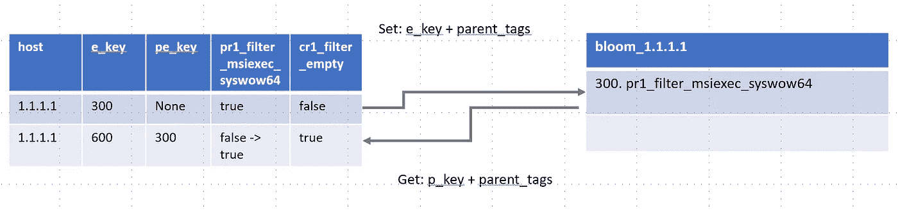
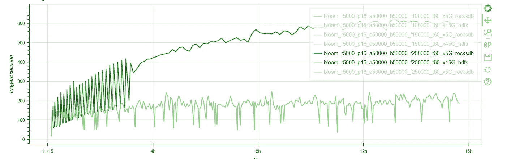
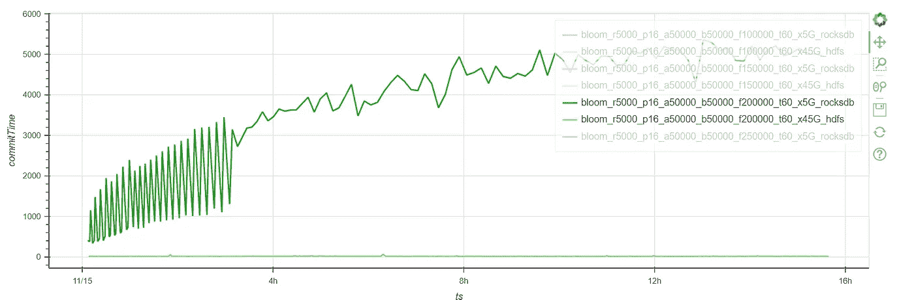
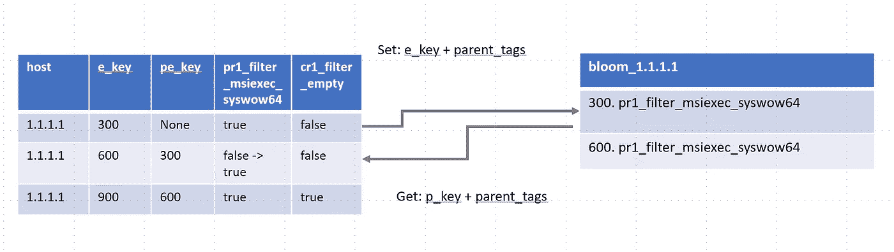
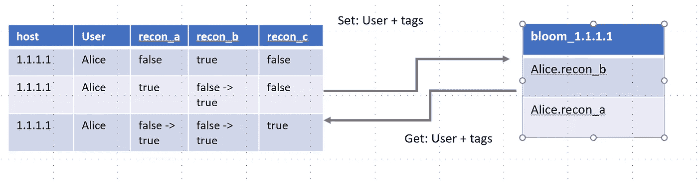

# 使用 Sigma 规则进行异常检测（第三部分）基于布隆过滤器的时间相关性

> 原文：[`towardsdatascience.com/anomaly-detection-using-sigma-rules-part-3-temporal-correlation-using-bloom-filters-a45ffd5e9069?source=collection_archive---------9-----------------------#2023-02-14`](https://towardsdatascience.com/anomaly-detection-using-sigma-rules-part-3-temporal-correlation-using-bloom-filters-a45ffd5e9069?source=collection_archive---------9-----------------------#2023-02-14)

## 一个基于布隆过滤器的定制状态映射函数能否超越通用的 Spark 流-流连接？

[](https://medium.com/@jean-claude.cote?source=post_page-----a45ffd5e9069--------------------------------)[](https://towardsdatascience.com/?source=post_page-----a45ffd5e9069--------------------------------) [Jean-Claude Cote](https://medium.com/@jean-claude.cote?source=post_page-----a45ffd5e9069--------------------------------)

·

[关注](https://medium.com/m/signin?actionUrl=https%3A%2F%2Fmedium.com%2F_%2Fsubscribe%2Fuser%2F444ed0089012&operation=register&redirect=https%3A%2F%2Ftowardsdatascience.com%2Fanomaly-detection-using-sigma-rules-part-3-temporal-correlation-using-bloom-filters-a45ffd5e9069&user=Jean-Claude+Cote&userId=444ed0089012&source=post_page-444ed0089012----a45ffd5e9069---------------------post_header-----------) 发表在 [Towards Data Science](https://towardsdatascience.com/?source=post_page-----a45ffd5e9069--------------------------------) ·6 分钟阅读·2023 年 2 月 14 日[](https://medium.com/m/signin?actionUrl=https%3A%2F%2Fmedium.com%2F_%2Fvote%2Ftowards-data-science%2Fa45ffd5e9069&operation=register&redirect=https%3A%2F%2Ftowardsdatascience.com%2Fanomaly-detection-using-sigma-rules-part-3-temporal-correlation-using-bloom-filters-a45ffd5e9069&user=Jean-Claude+Cote&userId=444ed0089012&source=-----a45ffd5e9069---------------------clap_footer-----------)

--

[](https://medium.com/m/signin?actionUrl=https%3A%2F%2Fmedium.com%2F_%2Fbookmark%2Fp%2Fa45ffd5e9069&operation=register&redirect=https%3A%2F%2Ftowardsdatascience.com%2Fanomaly-detection-using-sigma-rules-part-3-temporal-correlation-using-bloom-filters-a45ffd5e9069&source=-----a45ffd5e9069---------------------bookmark_footer-----------)

由 Kalpaj 拍摄于 Unsplash，Peggys Cove，加拿大新斯科舍省

这是我们系列文章的第 3 篇。请参考第一部分和第二部分以获得一些背景信息。

Spark 的 [flatMapGroupsWithState](https://spark.apache.org/docs/latest/structured-streaming-programming-guide.html#arbitrary-stateful-operations) 函数允许用户在分组数据上应用自定义代码，并提供支持来持久化用户定义的状态。

在本文中，我们将实现一个有状态的函数，该函数检索父进程的标签（特征）。解决方案的关键是创建一个由进程 ID（下图中的 `e_key`）和我们想要记住的标签（特征）名称组成的复合键。例如，在第 1 行中，我们创建一个布隆键 `300.pr1_filter_msiexec_syswow64`。我们将此键存储在布隆过滤器中。请注意，由于布隆过滤器的特性，键实际上并不存储在布隆中。相反，键被哈希，并且该哈希用于在布隆的位数组中打开一些位。因此，如果标签为 false，我们不将其存储在布隆中。只有标记为 true 的才会存储。



在第二行中，我们展示了如何使用父进程的进程 ID (`pe_key` 而非 `e_key`) 创建一个检索布隆键。因此，查找键为 `300.pr1_filter_msiexec_syswow64`。如果查询布隆键返回 false，我们可以确定它从未存储在布隆中。然而，如果查询返回 true，我们知道该键确实存储在布隆中（但存在假阳性的可能性）。

我们使用布隆返回的结果来更新当前行的 `pr1_filter_msiexec_syswow64`。这有效地执行了我们上一篇文章中的连接操作。使用当前行的标签和检索到的当前行父进程的标志，我们最终可以评估完整的 Sigma 规则条件。

## 测试工具

为了评估这种方法的性能，我们在 Scala 中构建了一个初步的 flatMapGroupsWithState 原型，并使用了 Guava 布隆过滤器库。

为了估算布隆过滤器的大小，我们使用了这个 [实用的在线计算器](https://hur.st/bloomfilter/)。容量越大（可以存储的标签数量），布隆过滤器的大小就越大。例如，容量为 200,000 的布隆过滤器的大小约为 234KiB，假阳性率为 1%。

我们为每个主机使用一个布隆过滤器。继续模拟 50,000 个主机，这大约给我们提供了 12GiB 的状态。

我们最初使用 RocksDB 状态存储进行所有实验，因为在进行流流连接时表现非常好。然而，正如经常发生的那样，我们进行了一个意外的发现。旧版 HDFS 状态存储在这种用例中实际上比 RocksDB 表现更好。以下是结果的简要总结：



使用 RocksDB 的执行时间不断增加，而 HDFS 在每个微批次约 200 秒时保持稳定。



RocksDB 性能不佳的原因是它重新组织本地状态文件。在每次触发时，我们加载和修改每个 bloom，每个 bloom 的大小为 200KiB。然后，RocksDB 需要对其 SST 文件进行压缩和重组。RocksDB 似乎更适合处理大量较小的值。而 HDFS 则更适合处理较大的值，但在处理非常大量的数据时表现不佳。

## 与流-流连接的结果比较

现在让我们将这些结果与流-流连接的结果进行比较。在流-流连接中，我们使用了每秒 2,500 个事件的速率，而使用 bloom 时的速率为 5,000。

此外，在流-流连接中，我们可以保持平均 3,200 个“兴趣的父标签”。即与 3,200 个事件相关联的标签。如果我们假设每个事件只有一个真实标签，这将产生每个主机 3,200 个标签。

使用 bloom，我们可以每台主机保持约 100,000 个标签。这大约是原来的 30 倍！

使用自定义的 flatMapGroupsWithState，我们仅读取一次输入流（例如来自 Kafka 或 Iceberg 表）。而使用连接时，我们必须读取两次流，一次用于连接的每一侧。

## 自定义的 flatMapGroupsWithState 更加灵活

此外，bloom 方法适用于更有趣的用例。例如，假设你不仅想记住你父级的标签，还想记住你父级的父级的标签。这使用流-流连接可能会相当困难。你要连接多少次？

通过简单的调整，我们可以支持传播祖先标签。在上面的示例中，在第 2 行，我们提取了 bloom 键 `300.pr1_filter_msiexec_syswow64` 和列中的值 `pr1_filter_msiexec_syswow64`。为了支持祖先标签，我们将该标签重新放入 bloom 中，但使用第 2 行的 `e_key` 值。因此，我们存储了 bloom 键 `600.pr1_filter_msiexec_syswow64`。



现在，假设我们得到一个子进程 900（进程 300 的孙子）。如前所述，我们使用我们的父键 `pe_key`（600）进行提取，形成 bloom 键 `600.pr1_filter_msiexec_syswow64`，从而有效地提取我们祖父的标签。

## 超越父子关系

到目前为止，我们集中于父子关系。然而，通过存储和检索标签，我们还可以支持 [时间邻近关联](https://github.com/SigmaHQ/sigma-specification/blob/version_2/Sigma_meta_rules.md#temporal-proximity-temporal)。时间邻近关联是即将发布的 Sigma 规范中的一项新功能。规范中给出的示例如下：

```py
action: correlation
type: temporal
rules:
    - recon_cmd_a
    - recon_cmd_b
    - recon_cmd_c
group-by:
    - ComputerName
    - User
timespan: 5m
ordered: false
```

该规则规定，3 个事件（recon_cmd_a/b/c）必须发生在一个时间窗口内。这些事件不必按任何特定顺序出现。

正如我们之前所做的，我们可以将这些事件表示为标签，并对每个主机（每个 ComputerName）使用一个布隆过滤器。我们使用列`User`，而不是使用列`e_key`/`pe_key`（父/子）。列`User`为我们存储和从布隆过滤器中检索的复合键提供了上下文。



在第一行，我们看到`recon_cmd_b`为真，因此我们使用`User`作为上下文将其存储在布隆过滤器中，从而将其存储在`Alice.recon_cmd_b`下。

在第二行，我们看到`recon_cmd_a`为真，因此我们将其存储在`Alice.recon_cmd_a`下。在每一行中，我们总是尝试提取键：`Alice.recon_cmd_a`、`Alice.recon_cmd_b`和`Alice.recond_cmd_c`。因此，`recom_cmd_b`被更新为真。

对于第三行，我们推送`Alice.recond_cmd_c`并提取其他两个。

Sigma 规范支持这种关联的`ordered`版本。支持有序时间接近性也是可能的。为了支持有序事件，我们**有条件**地提取标签，而不是**始终**提取。

如果我们假设上述规则是有序的，我们将把程序从始终存储和提取所有键改为有条件地存储`recon_cmd_b`，仅当`recon_cmd_a`已经被看到时，并且永远不存储`recon_cmd_c`。

在我们的下一篇文章中，我们将改进我们的概念验证。我们将使其更加灵活，并能够支持上述描述的附加用例。

*除非另有说明，否则所有图片均由作者提供*
