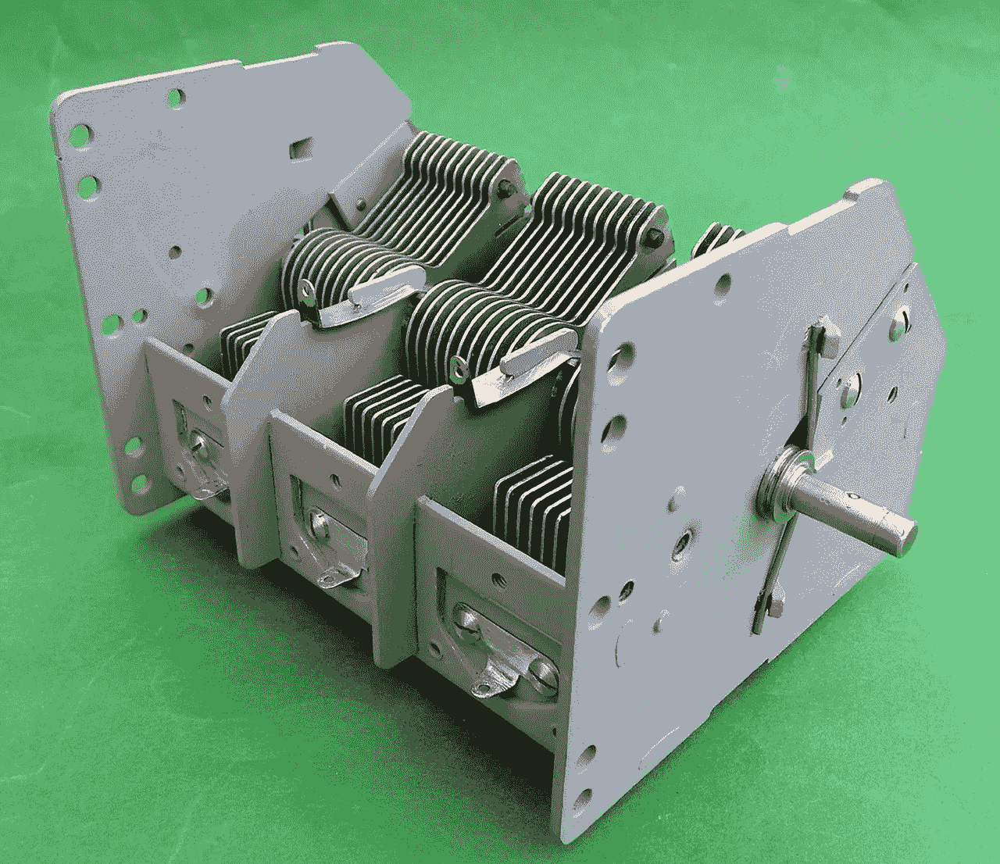

# 使用 Sigma 规则进行异常检测（第四部分）：Flux 电容器设计

> 原文：[`towardsdatascience.com/anomaly-detection-using-sigma-rules-part-4-flux-capacitor-design-70cb5c2cfb72?source=collection_archive---------12-----------------------#2023-03-02`](https://towardsdatascience.com/anomaly-detection-using-sigma-rules-part-4-flux-capacitor-design-70cb5c2cfb72?source=collection_archive---------12-----------------------#2023-03-02)

## 我们实现了一个 Spark 结构化流式状态映射函数，以处理网络安全日志中的时间相关性。

[](https://medium.com/@jean-claude.cote?source=post_page-----70cb5c2cfb72--------------------------------)[](https://towardsdatascience.com/?source=post_page-----70cb5c2cfb72--------------------------------) [Jean-Claude Cote](https://medium.com/@jean-claude.cote?source=post_page-----70cb5c2cfb72--------------------------------)

·

[关注](https://medium.com/m/signin?actionUrl=https%3A%2F%2Fmedium.com%2F_%2Fsubscribe%2Fuser%2F444ed0089012&operation=register&redirect=https%3A%2F%2Ftowardsdatascience.com%2Fanomaly-detection-using-sigma-rules-part-4-flux-capacitor-design-70cb5c2cfb72&user=Jean-Claude+Cote&userId=444ed0089012&source=post_page-444ed0089012----70cb5c2cfb72---------------------post_header-----------) 发布于 [数据科学前沿](https://towardsdatascience.com/?source=post_page-----70cb5c2cfb72--------------------------------) · 6 分钟阅读 · 2023 年 3 月 2 日[](https://medium.com/m/signin?actionUrl=https%3A%2F%2Fmedium.com%2F_%2Fvote%2Ftowards-data-science%2F70cb5c2cfb72&operation=register&redirect=https%3A%2F%2Ftowardsdatascience.com%2Fanomaly-detection-using-sigma-rules-part-4-flux-capacitor-design-70cb5c2cfb72&user=Jean-Claude+Cote&userId=444ed0089012&source=-----70cb5c2cfb72---------------------clap_footer-----------)

--

[](https://medium.com/m/signin?actionUrl=https%3A%2F%2Fmedium.com%2F_%2Fbookmark%2Fp%2F70cb5c2cfb72&operation=register&redirect=https%3A%2F%2Ftowardsdatascience.com%2Fanomaly-detection-using-sigma-rules-part-4-flux-capacitor-design-70cb5c2cfb72&source=-----70cb5c2cfb72---------------------bookmark_footer-----------)

图片来自 [Pixabay](https://pixabay.com/photos/large-vintage-variable-capacitor-2307278/) 的 Robert Wilson

这是我们系列文章的第 4 篇。有关更多背景信息，请参考 第一部分 、第二部分 和 [第三部分](https://medium.com/towards-data-science/anomaly-detection-using-sigma-rules-part-3-temporal-correlation-using-bloom-filters-a45ffd5e9069)。

在本文中，我们将详细介绍自定义 Spark flatMapWithGroupState 函数的设计。我们选择用 Scala 编写这个函数，因为 Spark 本身是用 Scala 编写的。我们将这个函数命名为 Flux Capacitor。电容器积累电荷并随后释放它们。类似地，我们的 flatMapWithGroupState 将积累标签（评估为真/假的 Sigma 表达式），然后释放它们。

我们的 Flux Capacitor 函数易于配置，允许用户指定每个标签的存储和检索方式。在我们的实现中，我们将标签的更新和检索行为封装在一个标签评估器类层次结构中。

## 标签评估器


除非另有说明，所有标签将由过渡评估器进行评估。这个评估器是一个无操作的评估器，它仅仅将当前标签值传递出去。可缓存评估器是一个能够在布隆过滤器中存储和检索标签的基类。这个基类有两个模板方法，`makeBloomPutKey` 和 `makeBloomGetKey`，让子类决定标签的存储和检索方式。默认标签使用相同的键在布隆过滤器中存取值。这个键只是规则和标签名称的拼接。当用户将以下规范传递给 Flux Capacitor 时，将创建默认标签评估器对象来处理标签的存储和检索。

```py
rules:
    - rulename: rule5
      description: un-ordered set of events by host
      action: temporal
      ordered: false
      tags:
        - name: recon_cmd_a
        - name: recon_cmd_b
        - name: recon_cmd_c
```

我们设计的 Flux Capacitor 规范类似于 Sigma 规则。然而，这个规范仅描述了 Flux Capacitor 中标签的处理方式。

有序评估器通过引入“依赖标签”来专业化默认评估器。依赖标签必须首先被评估，只有当依赖标签为真时，有序标签才会被评估。当用户指定 `ordered: true` 时，将使用此评估器。

层级结构的另一侧处理父子关系。与默认标签相反，父评估器的 put 键由 `规则名称 + 标签名称 + 父 ID` 组成，而 get 键由 `规则名称 + 标签名称 + 当前 ID` 组成。父子关系的规范允许用户指定哪个列名包含父 ID，哪个列名包含当前消息 ID。在这个例子中，`parent_id` 和 `id` 是表示父子关系的列。

```py
rules:
    - rulename: rule4
      description: propagate to child only
      action: parent
      parent: parent_id
      child: id
      tags:
        - name: parent_process_feature1
```

正如我们在上一篇文章中所解释的，祖先评估器通过将自身存储在布隆过滤器中，从而沿父子层级传播自身，专业化了父评估器。

## 规则评估器

到目前为止，我们只应用了一个 Sigma 规则。我们这样做是为了保持简单。然而，实际上我们希望同时应用多个 Sigma 规则。当我们处理日志源并解析其内容时，我们希望应用所有适用的 Sigma 规则。

为了保持组织性，我们在[MapType](https://spark.apache.org/docs/2.0.2/api/java/index.html?org%2Fapache%2Fspark%2Fsql%2Ftypes%2FMapType.html=)类型的列中表示每个规则及其相关的标签。这个映射中的键是规则名称，值是标签名称到标签值（true/false）的映射。

```py
select

    -- regroup each rule's tags in a map (ruleName -> Tags)
    map(
        'rule1', map('cr1_selection', cr1_selection,
                    'cr1_filter_empty', cr1_filter_empty,
                    'cr1_filter', cr1_filter,
                    'cr1_filter_localserver_fp', cr1_filter_localserver_fp,
                    'pr1_filter_iexplorer', pr1_filter_iexplorer,
                    'pr1_filter_msiexec_syswow64', pr1_filter_msiexec_syswow64,
                    'pr1_filter_msiexec_system32', pr1_filter_msiexec_system32),
        'rule2', map('cr2_filter_provider', cr2_filter_provider,
                    'cr2_filter_git', cr2_filter_git,
                    'pr2_selection', pr2_selection,
                    'pr2_filter_git', pr2_filter_git),
        'rule3', map('cr3_selection_other', cr3_selection_other,
                    'cr3_selection_atexec', cr3_selection_atexec,
                    'pr3_selection_other', pr3_selection_other,
                    'pr3_selection_atexec', pr3_selection_atexec)
       ) as sigma
```

通过使用映射，我们可以保持输入和输出行的模式不变。任何稍后引入的新 Sigma 规则将简单地添加到这个映射中，而不会影响整体输入和输出行模式。

我们的 Flux Capacitor 规范反映了这一点。规范适用于一系列规则名称。每个规则规范都说明了如何更新该规则的标签。

```py
rules:
    - rulename: rule1
      description: ordered list of events by host
      action: temporal
      ordered: true
      tags:
        - name: recon_cmd_a
        - name: recon_cmd_b
        - name: recon_cmd_c

    - rulename: rule3
      description: propagate to all decendents
      action: ancestor
      tags:
        - name: ancestor_process_feature1
      parent: parent_id
      child: id
```

在我们的实现中，每个规则规范由一个`Rule`类处理。`Rules`类依次评估每个`Rule`。

## 映射函数

Spark Dataframe `flatMapGroupsWithState`在每个组上调用用户提供的函数，同时在调用之间维护用户定义的每组状态。该函数的签名接受一个键、一个输入行迭代器（每组）和一个状态，并返回一个输出行迭代器。我们的 Flux Capacitor 函数如下：

```py
case class FluxCapacitorMapFunction(
    val tagCapacity: Int,
    val specification: String
) {

def processBatch(
      key: String,
      rows: Iterator[Row],
      state: GroupState[FluxState]
  ): Iterator[Row] = {

    val bloom =
    if (state.exists()) {
      state.get()
    } else {
      BloomFilter.create(Funnels.stringFunnel(), tagCapacity, 0.01)
    }

    val rulesConf = RulesConf.load(specification)
    val rules = new RulesAdapter(new Rules(rulesConf, bloom))
    val outputRows = rows.map(row => rules.evaluateRow(row))
    state.update(bloom)
    outputRows.iterator
  }
```

第一次调用函数时，我们将没有状态。在这种情况下，我们创建一个假阳性概率为 1%的 Guava 布隆过滤器。

然后我们从 YAML 字符串加载规范。稍后我们将看到用户如何将这个规范传递给函数。规范被解析并提供给`Rules`类。`Rules`类创建相应的标签评估器。

接下来，我们将`evaluateRow`应用于这一组输入行，生成一个输出行的列表。

调用`evaluateRow`会修改布隆过滤器（一些标签将被存储在布隆中）。因此，我们使用`state.update(bloom)`来持久化布隆。

最后，我们返回一个输出行的迭代器。

## 应用 Flux Capacitor

从用户的角度来看，使用 Flux Capacitor 进行异常检测是非常简单的。

假设用户已经创建了一个 dataframe `taggedEventsDF`。在后续的文章中，我们将展示如何利用 sigma 编译器创建这个 dataframe。

```py
val taggedEventsDF = ...

val specification = """
rules:
    - rulename: rule1
      description: ordered list of events by host
      action: temporal
      ordered: true
      tags:
        - name: recon_cmd_a
        - name: recon_cmd_b
        - name: recon_cmd_c

    - rulename: rule3
      description: propagate to all decendents
      action: ancestor
      tags:
        - name: ancestor_process_feature1
      parent: parent_id
      child: id
"""

val tagCapacity = 200000
val flux = new FluxCapacitorMapFunction(tagCapacity, specification)
```

一旦创建了 FluxCapacitorMapFunction，它需要传递给 Spark 的`flatMapGroupsWithState`。用户还需要指定哪个列包含主机 ID。

```py
// create encoders to serialize/deserialize the output rows and the bloom
val outputEncoder = RowEncoder(taggedEventsDF.schema).resolveAndBind()
val stateEncoder = Encoders.javaSerialization(BloomFilter.class)

// we associate a bloom with each host
var groupKeyIndex = df.schema.fieldIndex("host_id")

taggedEventsDF
  .groupByKey(row => row.getString(groupKeyIndex))
  .flatMapGroupsWithState(
     Append,
     GroupStateTimeout.NoTimeout()
  )(flux.processBatch)(stateEncoder, outputEncoder)
```

我们为每个主机关联一个布隆过滤器，因此我们的分组键`groupByKey`是`host_id`列。

Spark 需要知道如何序列化和反序列化状态。我们为输出行和布隆过滤器（状态）创建 Spark 编码器。

我们指定了一种附加模式，而不是更新或完成。在附加模式下，我们输出的每一行都被添加到结果表中，这在异常检测中是所期望的。

最后，我们将我们的`flux.processBatch`传递给`flatMapGroupsWithState`函数。

## 结论

在本文中，我们展示了如何实现一个可配置且可重用的有状态映射函数，能够处理多种用例：时间邻近相关性（有序和无序）以及父子关系（包括祖先）。

目前，我们的状态永远不会超时，我们始终使用相同的布隆过滤器，因此布隆过滤器最终会被填满。在我们的下一篇文章中，我们将用一个会忘记的布隆过滤器来解决这个问题，并优化 Flux Capacitor 的性能。

> 除非另有说明，所有图片均由作者提供
