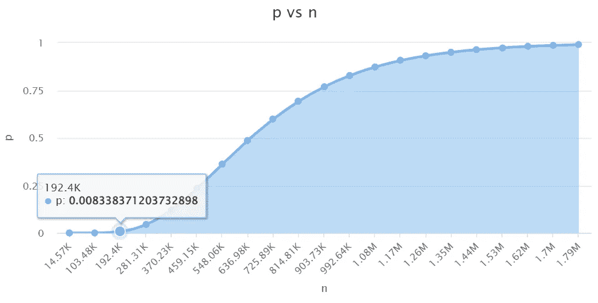
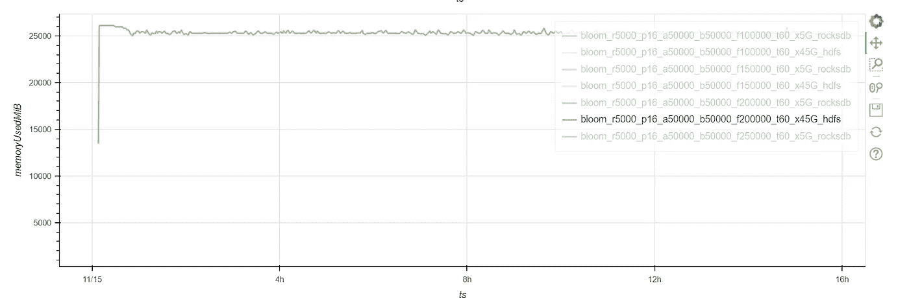
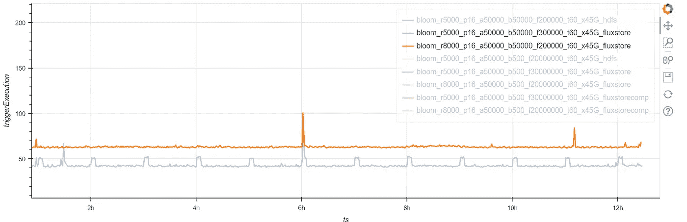
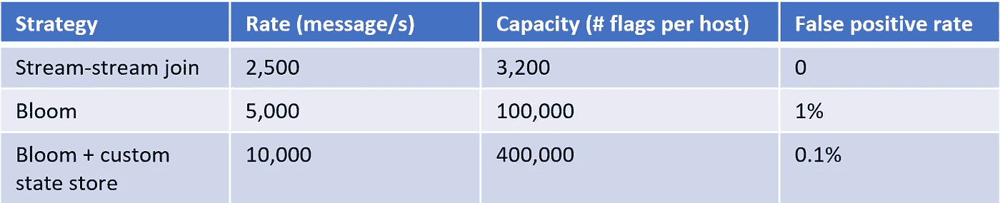

# 使用 Sigma 规则进行异常检测（第五部分）：Flux Capacitor 优化

> 原文：[`towardsdatascience.com/anomaly-detection-using-sigma-rules-part-5-flux-capacitor-optimization-118e538cf8c4?source=collection_archive---------11-----------------------#2023-03-17`](https://towardsdatascience.com/anomaly-detection-using-sigma-rules-part-5-flux-capacitor-optimization-118e538cf8c4?source=collection_archive---------11-----------------------#2023-03-17)

## 为了提升性能，我们实现了一种遗忘布隆过滤器和一个定制的 Spark 状态存储提供者

[](https://medium.com/@jean-claude.cote?source=post_page-----118e538cf8c4--------------------------------)[](https://towardsdatascience.com/?source=post_page-----118e538cf8c4--------------------------------) [Jean-Claude Cote](https://medium.com/@jean-claude.cote?source=post_page-----118e538cf8c4--------------------------------)

·

[关注](https://medium.com/m/signin?actionUrl=https%3A%2F%2Fmedium.com%2F_%2Fsubscribe%2Fuser%2F444ed0089012&operation=register&redirect=https%3A%2F%2Ftowardsdatascience.com%2Fanomaly-detection-using-sigma-rules-part-5-flux-capacitor-optimization-118e538cf8c4&user=Jean-Claude+Cote&userId=444ed0089012&source=post_page-444ed0089012----118e538cf8c4---------------------post_header-----------) 发表于 [Towards Data Science](https://towardsdatascience.com/?source=post_page-----118e538cf8c4--------------------------------) ·8 min read·Mar 17, 2023[](https://medium.com/m/signin?actionUrl=https%3A%2F%2Fmedium.com%2F_%2Fvote%2Ftowards-data-science%2F118e538cf8c4&operation=register&redirect=https%3A%2F%2Ftowardsdatascience.com%2Fanomaly-detection-using-sigma-rules-part-5-flux-capacitor-optimization-118e538cf8c4&user=Jean-Claude+Cote&userId=444ed0089012&source=-----118e538cf8c4---------------------clap_footer-----------)

--

[](https://medium.com/m/signin?actionUrl=https%3A%2F%2Fmedium.com%2F_%2Fbookmark%2Fp%2F118e538cf8c4&operation=register&redirect=https%3A%2F%2Ftowardsdatascience.com%2Fanomaly-detection-using-sigma-rules-part-5-flux-capacitor-optimization-118e538cf8c4&source=-----118e538cf8c4---------------------bookmark_footer-----------)

照片来自 Shippagan, NB, Canada 的 Leora Winter，Unsplash

这是我们系列文章的第 5 篇。请参阅第一部分，第二部分，[第三部分](https://medium.com/towards-data-science/anomaly-detection-using-sigma-rules-part-3-temporal-correlation-using-bloom-filters-a45ffd5e9069)和[第四部分](https://medium.com/towards-data-science/anomaly-detection-using-sigma-rules-part-4-flux-capacitor-design-70cb5c2cfb72)获取一些背景信息。

在我们之前的文章中，我们展示了使用布隆过滤器所获得的性能提升。我们还展示了如何利用布隆过滤器实现时间接近相关性、父子和祖先关系。

到目前为止，我们一直在每个主机上使用一个布隆过滤器。最终，布隆过滤器将被标签填满，并会产生大量假阳性。使用这个[在线布隆过滤器计算器](https://hur.st/bloomfilter/?n=200000&p=0.01&m=&k=)，我们可以看到获得假阳性的概率。注意到假阳性率在超过 200,000 个标签后迅速增加。（这个图表的 n=200,000 和 p=1%）



图片由作者提供

## 健忘布隆过滤器

我们需要一种方法来处理非常旧的标签。我们需要一个健忘的布隆过滤器。正如 Redis Labs 在这篇优秀论文中解释的[Age-Partitioned Bloom Filter](https://arxiv.org/pdf/2001.03147.pdf)，有许多方法可以实现健忘的布隆过滤器。我们将使用最基本的方法：

> 基于分段的方法使用几个不相交的分段，这些分段可以单独添加和退役。最简单且多次提到的方法是使用一系列普通的布隆过滤器，每代一个，当使用中的布隆过滤器满了时，添加一个新的并退役最旧的一个。

我们选择使用 10 代。因此，每台主机使用 10 个布隆过滤器。每个布隆过滤器最多可以容纳 20,000 个标签。

我们使用“活动”布隆过滤器来插入新标签。当“活动”布隆过滤器满了时，我们创建一个新的。当我们达到 10 个布隆过滤器时，我们丢弃最旧的布隆过滤器。

我们通过测试“活动”布隆过滤器来查询标签。如果没有找到标签，我们测试下一个（更旧的）布隆过滤器，直到到达末尾。

请注意，对于每个我们想要测试的标签，我们可能会在 10 个不同的布隆过滤器中执行 10 次测试。每次测试都有一定的概率报告假阳性。因此，通过使用 10 个布隆过滤器，我们将机会提高了 10 倍。为了降低假阳性的几率，我们使用了假阳性率为 1/1000 的布隆过滤器，而不是 1/100 的。实际上，我们将展示我们甚至可以使用 1/10000 的假阳性率。

为了适应多个布隆过滤器，我们不再在状态存储中保存布隆对象：

```py
val stateEncoder = Encoders.javaSerialization(BloomFilter.class)
```

相反，我们将持久化一个 FluxState 对象，其中包含一个布隆过滤器列表：

```py
val stateEncoder = Encoders.product[FluxState]
```

FluxState 包含以下字段：

```py
case class FluxState(
    var version: Long = 0,
    var active: Int = 0,
    var serializedBlooms: List[Array[Byte]] = List()
) extends TagCache {
```

出于性能原因，我们自己序列化 bloom 过滤器。由于我们知道这些对象的大小，我们可以通过预分配序列化缓冲区来优化序列化。`serializedBlooms` 字段保存序列化的 blooms。active 字段跟踪此列表中活动 bloom 的索引。我们稍后会解释版本号的使用。这就是我们序列化 blooms 的方式：

```py
val padding = 4000
val n = tagCapacity / NUM_BLOOMS
// Formula taken from https://hur.st/bloomfilter
// m = ceil( (n * log(p)) / log(1 / pow(2, log(2))))
val mBits = Math.ceil( 
      (n * Math.log(desiredFpp)) / Math.log(1 / Math.pow(2, Math.log(2))))
val numBytes = (mBits / 8).toInt + padding  
val byteArrayOut = new ByteArrayOutputStream(numBytes)
val store = new ObjectOutputStream(byteArrayOut)
store.writeObject(bloom)
store.close
byteArrayOut.toByteArray()
```

## 高效的检查点

我们将大型 bloom 分割成 10 个较小的 bloom。由于 bloom 过滤器的特性，10 个 20,000 标签的 bloom 所占用的空间大致与一个 200,000 标签的大 bloom 相同，大约为 200KiB。

Spark HDFS 状态存储提供者将所有 FluxState 对象保存在内存中。如果我们假设有一个 50,000 主机的集群，这将导致大约 10GiB 的 RAM 实际上，HDFS 状态存储的内存使用量被测量为 25GiB。



图片来源：作者

它的使用量更高的原因是 HDFS 状态存储默认会保留状态的 2 份副本。我们可以通过 `spark.sql.streaming.maxBatchesToRetainInMemory` 将其更改为只存储一份副本。这将内存使用量降低到大约 12GiB 的 RAM，这与我们的估计相符。

作为检查点的一部分，Spark 会将所有状态写入数据湖，并在每个微批处理完成后执行此操作。Spark 花费大量时间来持久化 12 GiB 的状态，并且反复进行此操作。

然而，在每个微批处理中，我们只修改 10 个 blooms 中的 1 个（活动 bloom）。其他 9 个 blooms 可能会被查询但保持不变。默认的 HDFS 状态存储提供者并不知晓哪个 bloom 被更改，它只是持久化 FluxState 对象。如果状态存储提供者知道哪个 bloom 是活动 bloom，它可以更高效，只检查点修改过的活动 bloom。这可能会将序列化减少到 12GiB 的 1/10。

## 自定义状态存储提供者

[HDFSBackedStateStoreProvider.scala](https://github.com/apache/spark/blob/master/sql/core/src/main/scala/org/apache/spark/sql/execution/streaming/state/HDFSBackedStateStoreProvider.scala) 类处理 put 和 get 状态请求。它将这些键/值对保存在内存映射中，并将这些键/值持久化到数据湖中。

通过对 put 和 get 方法进行一些轻微的修改，我们可以专门化 [HDFSBackedStateStoreProvider](https://github.com/apache/spark/blob/master/sql/core/src/main/scala/org/apache/spark/sql/execution/streaming/state/HDFSBackedStateStoreProvider.scala) 类的行为，使其能够意识到我们遗忘 bloom 过滤器策略。

基本的想法是将每个 bloom 段存储在一个单独的键下。我们不将整个状态存储在键“windows_host_abc”下，而是将每个段存储在“windows_host_abc_segment1”、“windows_host_abc_segment2”、“windows_host_abc_segment3”等下。

**put**函数接收要存储的键和值。键将是主机 ID，值将是一个 FluxState 对象。Spark 在调用此方法之前，将键和值都编码为 UnsafeRow：

```py
override def put(key: UnsafeRow, value: UnsafeRow): Unit = {
  require(value != null, "Cannot put a null value")
  verify(state == UPDATING, "Cannot put after already committed or aborted")
  //val keyCopy = key.copy()
  val valueCopy = value.copy()

  // Create the key to store this bloom using the bloom id (active)
  val newRowKey = makeRowKey(key.getString(0), getActiveValue(valueCopy))
  // Store key/value as normal
  mapToUpdate.put(newRowKey, valueCopy)
  writeUpdateToDeltaFile(compressedStream, newRowKey, valueCopy)
}
```

我们的**put**函数与原始的完全相同。唯一的变化是键。我们将“活跃的”布隆过滤器索引附加到原始键上。

需要注意的是，我们还修改了我们的 FluxState 类，只序列化“活跃的”布隆过滤器，而不是所有 10 个布隆过滤器。

```py
def toState(): FluxState = {
  version += 1    
  // we only store the active blooms, all other blooms were un-changed
  val approxsize = tagCapacity / NUM_BLOOMS * 3
  val byteArrayOut = new ByteArrayOutputStream(approxsize)
  val store = new ObjectOutputStream(byteArrayOut)
  store.writeObject(getActiveBloom())
  store.close
  serializedBlooms = List(byteArrayOut.toByteArray())
}
```

原始的**get**方法是这样的：

```py
override def get(key: UnsafeRow): UnsafeRow = {
      mapToUpdate.get(key)
    }
```

我们修改了**get**方法以收集主机 ID 的 10 个布隆过滤器段。首先，我们通过迭代 10 个布隆索引来构建一个 FluxState 列表。然后，我们创建一个新的 FluxState 来保存所有的布隆过滤器。我们通过版本号来确定哪个是活跃的布隆过滤器。

```py
override def get(key: UnsafeRow): UnsafeRow = {
  // CCCS: The list of blooms for this key are put
  // in separate entries in the store
  // we will find all of these entries and create a FluxState
  val groupKey = key.getString(0)
  val fluxStates = Range(0, NUM_BLOOMS)
      .map(bloomIndex => mapToUpdate.get(makeRowKey(groupKey, bloomIndex)))
      .filter(_ != null)
      .map(value => deserializeFluxState(value))

  if(fluxStates.length > 0) {
    makeRowValue(coalesceFluxStates(fluxStates))
  }
  else {
    // else we found none of the blooms
    null
  }
}
```

## 调整假阳性概率

现在我们将布隆过滤器分成了 10 部分，我们可以查询 10 个布隆过滤器，因此可能会有更多的假阳性。为了解决这个问题，我们将假阳性概率降低到 1/10000，从而使总体假阳性概率为 1/1000。这比我们之前的实验少了十倍的假阳性机会。然而，由于我们只序列化“活跃的”布隆过滤器，总体性能要好得多。

## 结果

以前，当我们序列化所有段时，我们可以在每秒 5,000 个事件的速度下实现每主机 100,000 个标签的容量。

采用分段的方法，其中我们只序列化活跃的布隆过滤器，我们可以在每秒 5,000 个事件的速度下实现每主机 300,000 个标签的容量。或者，我们可以减小布隆过滤器的大小以容纳更多的事件：200,000 个标签 @ 8,000 个事件每秒。



作者提供的图片

在所有以前的实验中，我们一直在用随机标签对新创建的布隆过滤器进行“填充”。我们这样做是为了防止 HDFSBackStore 在将其状态保存到数据湖时压缩布隆过滤器。一个空的布隆过滤器几乎会压缩到零，而一个容量满的布隆过滤器（具有最大熵）几乎是不可压缩的。当我们首次启动实验时，由于压缩效果惊人，性能表现非常好。要看到标签在布隆过滤器中的效果需要很长时间。为了解决这个问题，我们将所有布隆过滤器填充到 95%的容量。换句话说，我们一直在测量最坏情况。

然而，在实际操作中，布隆过滤器会慢慢填满。一些布隆过滤器的填充速度比其他的快。从统计上讲，我们不可能在同一时间点上所有 50,000 个布隆过滤器都达到 95%的容量。使用随机填充可以进行更现实的模拟。

```py
def createBloom() = {
  val bloomCapacity: Int = tagCapacity / NUM_BLOOMS
  val bloom = BloomFilter.create(
                Funnels.stringFunnel(), 
                bloomCapacity, 
                desiredFpp)
  val prep = (bloomCapacity * Math.random()).toInt
  (1 to prep).map("padding" + _).foreach(s => bloom.put(s))
  bloom
}
```

由于可压缩的布隆过滤器，我们可以以每秒 10,000 个事件的速度运行该模拟，并且每个主机的总体容量为 400,000 个标签，总计 20 亿个标签在单个 Spark 工作节点上。这远远超过了我们在流流连接中能够实现的 1 亿个标签。

从 bloom 中存储和检索标签非常迅速。平均而言，一台机器可以每秒进行约 200,000 次测试。将标签存储在 bloom 中成本稍高，但一台机器仍能每秒存储 20,000 个标签。这意味着我们可以同时支持大量 Sigma 规则。

这里是我们实验中使用的不同策略的总结。



作者提供的图像

## 结论

结果清晰地显示了与自定义状态存储结合使用的**bloom 策略**的性能改进，该存储仅保存“活跃”的 bloom 段。**bloom 策略**还比流-流连接方法更通用，因为它可以处理如“祖先”和[时间接近性](https://github.com/SigmaHQ/sigma-specification/blob/version_2/Sigma_meta_rules.md#temporal-proximity-temporal)（有序和无序）等用例。概念验证可以在这里找到[`github.com/cccs-jc/flux-capacitor`](https://github.com/cccs-jc/flux-capacitor)。如果你对这个 flux-capacitor 功能有新的用例，我们很乐意听到。
