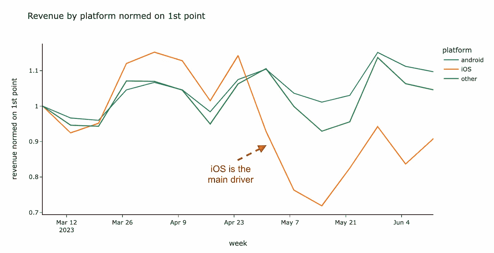

# 异常根本原因分析 101

> 原文：[`towardsdatascience.com/anomaly-root-cause-analysis-101-98f63dd12016?source=collection_archive---------0-----------------------#2023-06-28`](https://towardsdatascience.com/anomaly-root-cause-analysis-101-98f63dd12016?source=collection_archive---------0-----------------------#2023-06-28)

## 如何找到每个指标异常的解释

[](https://miptgirl.medium.com/?source=post_page-----98f63dd12016--------------------------------)[](https://towardsdatascience.com/?source=post_page-----98f63dd12016--------------------------------) [Mariya Mansurova](https://miptgirl.medium.com/?source=post_page-----98f63dd12016--------------------------------)

·

[关注](https://medium.com/m/signin?actionUrl=https%3A%2F%2Fmedium.com%2F_%2Fsubscribe%2Fuser%2F15a29a4fc6ad&operation=register&redirect=https%3A%2F%2Ftowardsdatascience.com%2Fanomaly-root-cause-analysis-101-98f63dd12016&user=Mariya+Mansurova&userId=15a29a4fc6ad&source=post_page-15a29a4fc6ad----98f63dd12016---------------------post_header-----------) 发表在 [Towards Data Science](https://towardsdatascience.com/?source=post_page-----98f63dd12016--------------------------------) ·14 min 阅读·2023 年 6 月 28 日[](https://medium.com/m/signin?actionUrl=https%3A%2F%2Fmedium.com%2F_%2Fvote%2Ftowards-data-science%2F98f63dd12016&operation=register&redirect=https%3A%2F%2Ftowardsdatascience.com%2Fanomaly-root-cause-analysis-101-98f63dd12016&user=Mariya+Mansurova&userId=15a29a4fc6ad&source=-----98f63dd12016---------------------clap_footer-----------)

--

[](https://medium.com/m/signin?actionUrl=https%3A%2F%2Fmedium.com%2F_%2Fbookmark%2Fp%2F98f63dd12016&operation=register&redirect=https%3A%2F%2Ftowardsdatascience.com%2Fanomaly-root-cause-analysis-101-98f63dd12016&source=-----98f63dd12016---------------------bookmark_footer-----------)

照片由 [Markus Winkler](https://unsplash.com/@markuswinkler?utm_source=medium&utm_medium=referral) 提供，发布于 [Unsplash](https://unsplash.com/?utm_source=medium&utm_medium=referral)

我们使用指标和关键绩效指标（KPIs）来监控产品的健康状况：确保一切稳定或产品按预期增长。但有时，指标会突然变化。转化率可能在一天内上升 10%，或收入可能在几个季度内略微下降。在这种情况下，企业不仅需要了解发生了什么，还需要理解原因以及应采取的措施。这时分析师就发挥了重要作用。

我第一次从事的数据分析角色是 KPI 分析师。异常检测和根本原因分析是我近三年来的主要关注点。我发现了数十个 KPI 变化的关键驱动因素，并制定了一种处理这些任务的方法。

在这篇文章中，我想与大家分享我的经验。这样，下次你遇到意外的指标行为时，你将有一个可以遵循的指南。

# 应该关注什么？

在进行分析之前，让我们定义我们的主要目标：我们希望实现什么。那么，我们的异常根本原因分析的目的是什么？

最直接的答案是理解指标变化的关键驱动因素。不言而喻，从分析师的角度来看，这是一个正确的答案。

但我们从商业角度来看。花费资源进行此研究的主要原因是为了最小化对客户的潜在负面影响。例如，如果由于昨天发布的新版本应用中的一个漏洞导致转化率下降，那么今天找出这个问题会比一个月后当数百名客户已经流失时要好。

> 我们的主要目标是最小化对客户的潜在负面影响。

作为分析师，我喜欢为我的工作任务设置优化指标。最小化潜在不利影响听起来像是一种合适的心态，帮助我们专注于正确的事情。

因此，牢记主要目标，我会尝试找出以下问题的答案：

+   这是一个真正影响客户行为的问题，还是仅仅是一个数据问题？

+   如果我们的客户行为确实发生了变化，我们能做些什么？不同选项的潜在效果是什么？

+   如果这是一个数据问题，我们能否使用其他工具监控相同的过程？我们如何修复损坏的过程？

# 步骤 1：自己动手做

根据我的经验，最好的第一步是重现受影响的客户旅程。例如，假设 iOS 上的电商应用订单数量减少了 10%。在这种情况下，值得尝试购买一些东西，并仔细检查是否存在产品问题：按钮不可见、横幅无法关闭等。

另外，记得查看日志以确保信息正确捕捉。客户体验可能一切正常，但我们可能会丢失关于购买的数据。

我相信这是开始异常调查的一个重要步骤。首先，经过 DIY，你将更好地理解受影响的客户旅程部分：步骤是什么，数据如何记录。其次，你可能会找到根本原因，从而节省几个小时的分析时间。

> **提示：** 如果异常幅度较大，更可能重现问题，这意味着问题影响了许多客户。

# **步骤 2：检查数据**

正如我们之前讨论的，首先，了解客户是否受到影响，或者只是数据异常，这一点非常重要。

我强烈建议你检查数据是否是最新的。你可能会看到昨天的收入减少了 50%，因为报告只捕捉了当天的前半部分。你可以查看原始数据或与数据工程团队沟通。

如果没有已知的数据相关问题，你可以使用不同的数据源来双重检查指标。在许多情况下，产品有客户端数据（例如，Google Analytics 或 Amplitude）和后端数据（例如，应用日志、访问日志或 API 网关日志）。因此，我们可以使用不同的数据源来验证 KPI 动态。如果你在一个数据源中看到异常，那么你的问题可能与数据有关，并不会影响客户。

另一点需要记住的是时间窗口和数据延迟。有一次，一位产品经理找我说激活出现了问题，因为从注册到首次成功操作（例如在电子商务中是购买）的转化率在过去三周里一直在下降。然而，这实际上是一种日常情况。


作者基于合成数据的示例

下降的根本原因是时间窗口。我们跟踪注册后前 30 天内的激活情况。因此，注册超过 4 周的用户有整整一个月的时间来进行首次操作。但最近一批用户只有一周的时间来转化，因此他们的转化率预期会低得多。如果你想比较这些用户群体的转化情况，可以将时间窗口更改为一周或等待。

如果数据出现延迟，你可能会看到最近几天有类似的下降趋势。例如，我们的移动分析系统在设备使用 Wi-Fi 网络时会批量发送事件。因此，平均而言，从所有设备收集所有事件需要 3 到 4 天。所以在过去的 3 到 4 天看到较少的活跃设备是很正常的。

对于这种情况，好的做法是从图表中去掉最后一个句点。这将防止你的团队基于数据做出错误的决策。然而，人们仍然可能会不小心遇到这些不准确的指标，因此在深入进行根本原因分析之前，你应该花些时间理解这些方法论上准确的指标。

# 第三步：全景视图

下一步是更全面地查看趋势。首先，我倾向于缩小视野，查看较长时间的趋势，以获得整体图景。

例如，看看购买数量。订单数量已经稳定增长了好几个星期，预计在 12 月底（圣诞节和新年期间）会有所下降。但接着，在 5 月初，KPI 显著下降并持续减少。我们应该开始感到恐慌了吗？


作者基于合成数据的示例

实际上，大多数情况下，没有必要惊慌。我们可以查看过去三年的指标趋势，并注意到每年夏季购买数量都会减少。这是季节性因素的影响。许多产品在夏季的参与度较低，因为客户会去度假。然而，这种季节性模式并不是普遍存在的：例如，旅游或夏季节庆网站可能会有相反的季节性趋势。


作者基于合成数据的示例

再看一个例子——另一个产品的活跃客户数量。我们可以看到自六月以来有所下降：月活跃用户曾经为 380K — 400K，现在只有 340–360K（下降约 -10%）。我们已经检查过以往几年的夏季没有发生这样的变化。我们是否应该得出结论认为我们的产品出现了问题？


作者基于合成数据的示例

等等，还不行。在这种情况下，放大查看也可能有帮助。考虑到长期趋势，我们可以看到最近三周的数值接近于二月和三月的数值。真正的异常是从四月初到五月中旬的 1.5 个月高客户数量。我们可能错误地得出 KPI 下降的结论，但它只是回到了正常水平。考虑到那是 2020 年春季，网站上的高流量很可能是由于 COVID 隔离：客户在家里，在线时间增加。


作者基于合成数据的示例

你初步分析的最后一点是确定 KPI 变化的确切时间。在某些情况下，变化可能会在 5 分钟内突然发生。而在其他情况下，可能只是趋势的微小变化。例如，活跃用户曾经每周增长 +5%，但现在仅为 +3%。

尝试尽可能准确地确定变化点（甚至到分钟级别）是值得的，因为这将帮助你后续选择最可信的假设。

指标变化的速度可以给你一些线索。例如，如果转化率在 5 分钟内发生变化，那不可能是由于新应用版本的发布（通常需要几天时间才能更新应用），更可能是由于后端的变化（例如 API）。

# **步骤 4：获取背景信息**

理解整个背景（发生了什么）对我们的调查可能至关重要。

我通常检查以查看整体情况的内容：

+   **内部变化**。不用说，内部变化会影响 KPI，因此我通常会查看所有的发布、实验、基础设施事件、产品变化（例如，新设计或价格变动）以及供应商更新（例如，升级到我们用于报告的最新版本 BI 工具）。

+   **外部因素**可能会根据你的产品有所不同。在金融科技领域，货币汇率可能会影响客户行为，而重大新闻或天气变化可能会影响搜索引擎市场份额。你可以为你的产品头脑风暴类似的因素。试着在思考外部因素时富有创意。例如，我们曾发现网站流量的下降是由于我们最重要地区的网络问题。

+   **竞争对手活动**。尝试了解你的主要竞争对手是否正在做某些事情——大规模的营销活动、产品不可用的事件或市场关闭。最简单的方法是查看 Twitter、Reddit 或新闻上的提及。此外，还有许多监控服务问题和故障的网站（例如，[DownDetector](https://downdetector.co.uk/)或[DownForEveryoneOrJustMe](https://downforeveryoneorjustme.com/)），你可以在这些网站上检查竞争对手的健康状况。

+   **客户反馈**。你可以通过客户支持团队了解产品的问题。因此，不要犹豫，问问他们是否有新的投诉或特定类型的客户联系量增加。然而，请记住，可能只有少数人会联系客户支持（特别是如果你的产品对日常生活并非必需）。例如，多年前，我们的搜索引擎在~100K 老版本 Opera 浏览器用户中完全崩溃。问题持续了几天，但不到十个客户联系了支持。

由于我们已经定义了异常时间，因此很容易获取所有发生在附近的事件。这些事件就是你的假设。

> **提示：** 如果你怀疑内部变更（发布或实验）是 KPI 下降的根本原因。最佳实践是恢复这些变更（如果可能的话），然后尝试理解确切的问题。这将帮助你减少对客户的潜在负面影响。

# **步骤 5：切片与切块**

此时，你希望已经对异常发生时的周围情况有所了解，并对根本原因有了一些假设。

我们先从更高的层次看待异常。例如，如果在美国客户的 Android 设备上出现了异常，值得检查 iOS、网页以及其他地区的客户。这样你将能够适当地理解问题的规模。

之后，是时候深入挖掘并尝试定位异常（尽可能狭窄地定义受 KPI 变化影响的段或多个段）。最直接的方法是查看你产品在不同维度上的 KPI 趋势。

这样有意义的维度列表可能会根据你的产品有所不同，所以值得与团队进行头脑风暴。我建议查看以下因素组：

+   **技术特性**：例如，平台、操作系统、应用版本；

+   **客户特征**：例如，新客户或现有客户（群体），年龄，地区；

+   **客户行为**：例如，产品功能的采用，实验标志，营销渠道。

在按不同维度拆分 KPI 趋势时，最好只查看足够显著的细分。例如，如果收入下降了 10%，没有必要查看对总收入贡献不到 1%的国家。小组中的指标往往更具波动性，因此不显著的细分可能会增加过多噪音。我更倾向于将所有小片段分组到`其他`组中，以避免完全丧失该信号。

例如，我们可以查看按平台划分的收入。不同平台的绝对数值可能差异很大，因此我将所有系列标准化到第一个点，以比较随时间的动态。有时，最好对前 N 个点进行平均化。例如，将前七天的平均值来捕捉每周季节性。

这就是你可以在 Python 中做到的。

```py
import plotly.express as px

norm_value = df[:7].mean()
norm_df = df.apply(lambda x: x/norm_value, axis = 1)
px.line(norm_df, title = 'Revenue by platform normed on 1st point')
```

图表告诉我们整个故事：在 5 月之前，不同平台的收入趋势非常接近，但随后 iOS 出现了变化，iOS 收入下降了 10-20%。所以 iOS 平台主要受到这一变化的影响，而其他平台则相对稳定。



基于合成数据的作者示例

# **步骤 6：理解你的指标**

在确定受到异常影响的主要细分后，让我们尝试分解我们的 KPI。这可能会给我们更好的了解情况。

我们通常在分析中使用两种类型的 KPI：绝对数值和比率。所以让我们讨论每种情况的分解方法。

我们可以通过标准化来分解**绝对数值**。例如，让我们看看在服务中总共花费的时间（内容产品的标准 KPI）。我们可以将其分解为两个单独的指标。


然后我们可以查看两个指标的动态。在下面的例子中，我们可以看到活跃客户数保持稳定，而每位客户花费的时间下降了，这意味着我们并没有完全失去客户，但由于某些原因，他们开始在我们的服务上花费更少的时间。


基于合成数据的作者示例

对于**比率指标**，我们可以分别查看分子和分母的动态。例如，让我们使用 30 天内从注册到首次购买的转化率。我们可以将其分解为两个指标：

+   在注册后 30 天内完成购买的客户数量（分子），

+   注册人数（分母）。

在下面的例子中，转化率在四月份从 43.5%下降到 40%。注册人数和转化客户数都增加了。这意味着有更多的客户转化率较低。这可能是由于不同的原因：

+   新的营销渠道或质量较低的用户的营销活动；

+   数据中的技术变化（例如，我们改变了地区定义，现在我们考虑了更多的客户）；

+   网站上的欺诈或机器人流量。


作者基于合成数据的示例

> **提示：** 如果我们看到转换用户的下降，而总用户数量保持稳定，这将表明产品或数据中关于转换的事实存在问题。

对于**转换**，将其转化为漏斗也可能会有所帮助。例如，在我们的案例中，我们可以查看以下步骤的转换：

+   完成注册

+   产品目录

+   将商品添加到购物车

+   下订单

+   成功支付。

每一步的转换动态可以显示客户旅程中发生变化的阶段。

# **第 7 步：得出结论**

根据上述所有分析阶段，你应该对当前情况有一个比较全面的了解：

+   具体改变了什么；

+   哪些细分市场受到影响；

+   周围发生了什么。

现在是总结的时候了。我倾向于以结构化的方式记录所有信息，描述测试过的假设和我们得出的结论，以及当前对主要根本原因的理解和下一步（如果需要）。

> **提示：** 记录所有测试过的假设（不仅仅是已证明的假设）是值得的，因为这将避免重复不必要的工作。

现在最重要的是验证我们的主要根本原因是否能够完全解释 KPI 变化。我通常在没有已知影响的情况下对情况进行建模。

例如，在从注册到首次购买的转换案例中，我们可能发现了欺诈攻击，并知道如何通过 IP 地址和用户代理来识别机器人流量。因此，我们可以查看在已知主要根本原因——欺诈流量——影响之外的转换率。


作者基于合成数据的示例

如你所见，欺诈流量仅解释了大约 70%的下降，还有其他因素可能影响 KPI。这就是为什么最好双重检查你是否发现了所有重要因素。

有时，证明你的假设可能是具有挑战性的，例如价格或设计的变化，你无法进行适当的 A/B 测试。我们都知道，相关性并不意味着因果关系。

在这种情况下检查假设的可能方法：

+   查看过去类似情况，例如价格变化是否与 KPI 有类似的相关性。

+   尝试识别行为发生变化的客户，比如那些开始在我们的应用中花费更少时间的客户，并进行调查。

在此分析之后，你仍然可能对效果产生疑问，但这可能会增加你对找到正确答案的信心。

> **提示：** 如果你陷入困境，调查也可能有帮助：你已经检查了所有假设但仍未找到解释。

# **如何为下一次根本原因分析做好准备？**

在详细调查结束时，是时候考虑如何让下次变得更轻松、更好。

经过多年的异常调查经验，我总结了以下最佳实践：

+   拥有**特定于您的产品的清单**是非常有帮助的——这可以为您和您的同事节省数小时的工作。值得整理出假设列表和检查这些假设的工具（例如仪表盘链接、关于竞争对手的外部信息来源等）。请记住，编写清单不是一次性活动：一旦遇到新的异常类型，您应该将新知识添加到清单中，以保持其最新。

+   另一个有价值的文档是**包含所有重要事件的变更日志**，例如价格变动、竞争产品的推出或新功能发布。变更日志将帮助您在一个地方找到所有重要事件，而无需翻阅多个聊天记录和维基页面。记住更新变更日志可能会很有挑战性。您可以将其纳入分析值班职责，以确立明确的责任。

+   在大多数情况下，您需要来自不同人员的输入，以了解情况的整体背景。预先准备好的**工作组和 KPI 异常调查渠道**可以节省宝贵的时间，并保持所有利益相关者的更新。

+   最后但同样重要的是，为了最小化对客户的潜在负面影响，我们应该**建立监控系统**，以便尽快了解异常情况并开始寻找根本原因。因此，请腾出时间来建立和改进您的警报和监控系统。

# TL;DR

我希望您牢记的关键消息：

1.  处理根本原因分析时，您应该**专注于最小化对客户的潜在负面影响**。

1.  **尽量发挥创造力并广泛考虑**：了解您产品内部发生的情况、基础设施的状况以及潜在的外部因素。

1.  **深入挖掘**：从不同角度查看您的指标，尝试检查不同的细分市场并分解您的指标。

1.  **做好准备**：如果您已经有产品清单、变更日志和工作组进行头脑风暴，那么处理这样的研究会容易得多。

非常感谢您阅读这篇文章。我希望现在您不会在面对根本原因分析任务时感到困惑，因为您已经有了手头的指南。如果您有任何后续问题或评论，请随时在评论区留言。
