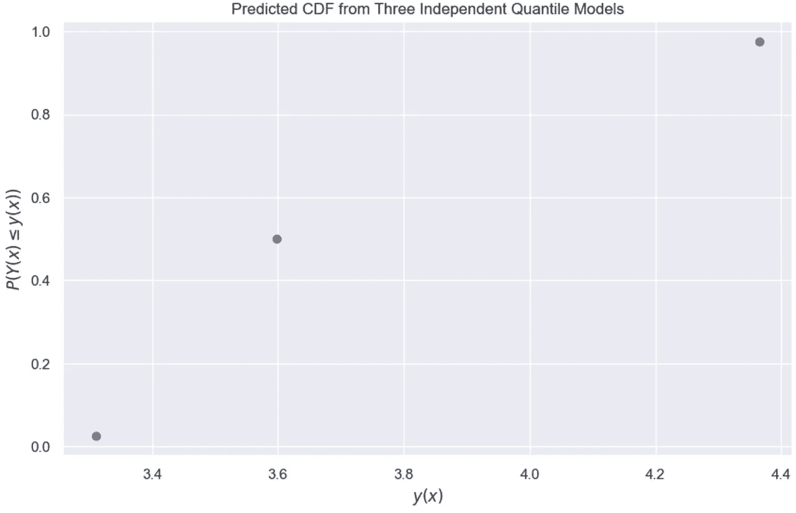
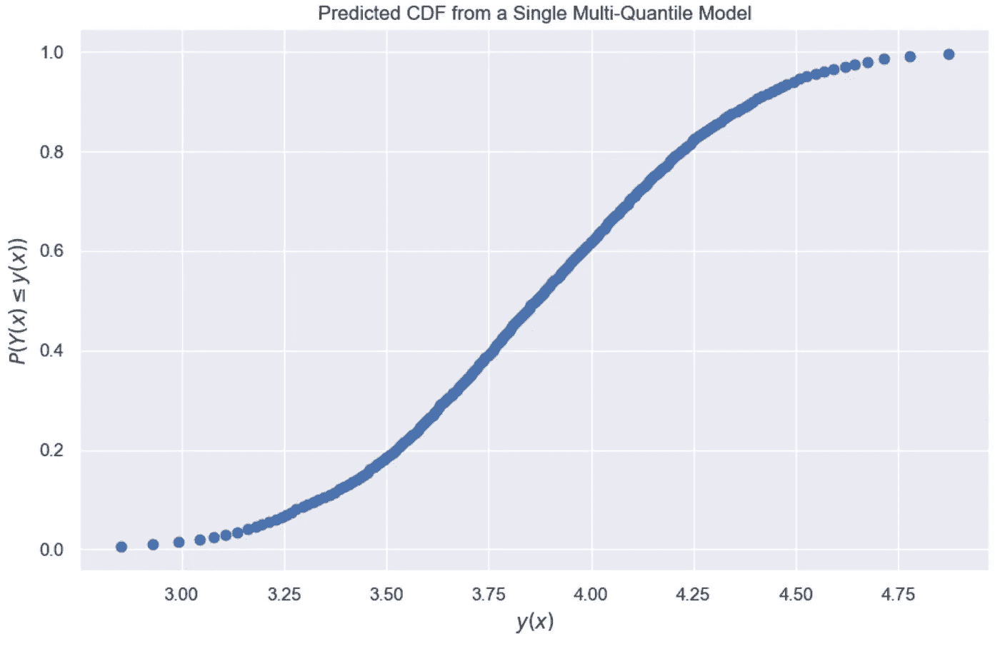
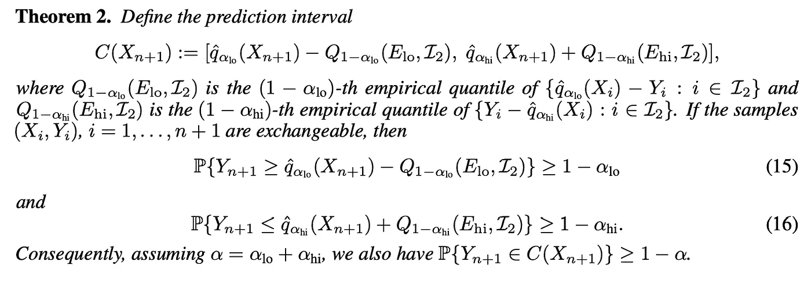
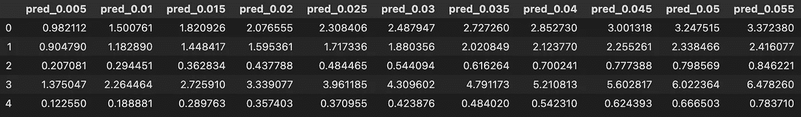
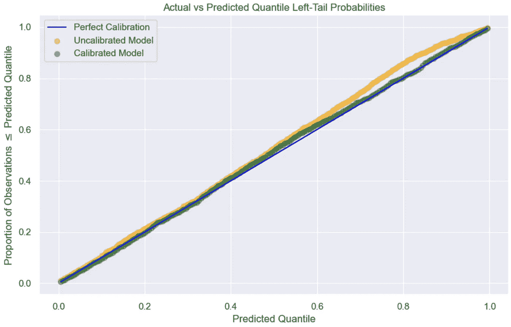
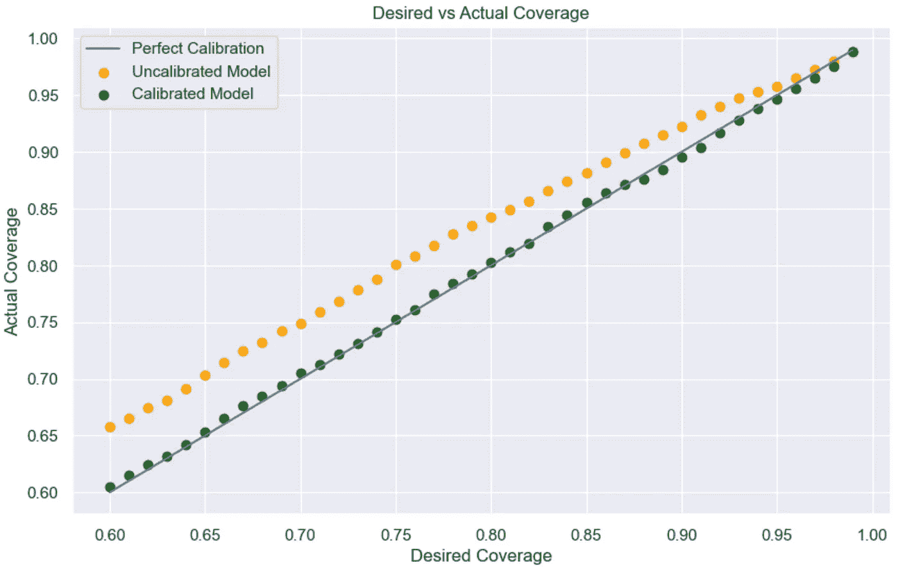
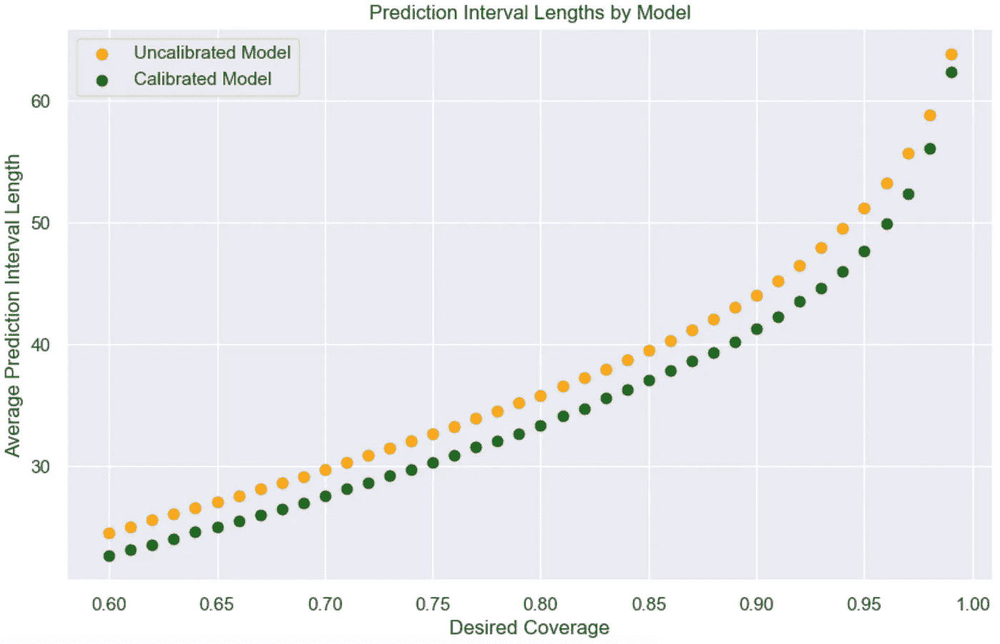

# 另一种（符合性）预测概率分布的方法

> 原文：[`towardsdatascience.com/another-conformal-way-to-predict-probability-distributions-fcc63e78680d`](https://towardsdatascience.com/another-conformal-way-to-predict-probability-distributions-fcc63e78680d)

## 使用 Catboost 进行符合性多分位回归

[](https://harrisonfhoffman.medium.com/?source=post_page-----fcc63e78680d--------------------------------)[](https://towardsdatascience.com/?source=post_page-----fcc63e78680d--------------------------------) [Harrison Hoffman](https://harrisonfhoffman.medium.com/?source=post_page-----fcc63e78680d--------------------------------)

·发表于 [Towards Data Science](https://towardsdatascience.com/?source=post_page-----fcc63e78680d--------------------------------) ·阅读时间 11 分钟·2023 年 3 月 8 日

--


德克萨斯州。图像来源：作者。

在 [上一篇文章](https://medium.com/towards-data-science/a-new-way-to-predict-probability-distributions-e7258349f464) 中，我们探索了 Catboost 的多分位损失函数的能力，该函数允许使用单一模型预测多个分位数。这种方法优雅地克服了传统分位回归的一项限制：后者需要为每个分位数开发一个单独的模型，或将整个训练集存储在模型中。然而，分位回归还有另一个缺点，我们将在本文中讨论：预测的分位数可能存在偏差，无法保证校准和覆盖。本文将演示如何通过符合性多分位回归来克服这一问题。我鼓励尚未跟进本系列的人在阅读之前回顾以下文章：

[](/a-new-way-to-predict-probability-distributions-e7258349f464?source=post_page-----fcc63e78680d--------------------------------) ## 预测概率分布的新方法

### 探索 Catboost 的多分位回归

towardsdatascience.com [](/understanding-noisy-data-and-uncertainty-in-machine-learning-4a2995a84198?source=post_page-----fcc63e78680d--------------------------------) [## 理解机器学习中的噪声数据和不确定性

### 实际原因是你的机器学习模型未能正常工作

[## 如何使用“符合分位数回归”预测风险比例区间](https://towardsdatascience.com/understanding-noisy-data-and-uncertainty-in-machine-learning-4a2995a84198?source=post_page-----fcc63e78680d--------------------------------) [如何预测风险比例区间与符合分位数回归](https://towardsdatascience.com/how-to-predict-risk-proportional-intervals-with-conformal-quantile-regression-175775840dc4?source=post_page-----fcc63e78680d--------------------------------)

### 这个算法——由斯坦福学者在 2019 年发布——将分位数回归与符合预测结合在一起。这里…

[如何预测风险比例区间与符合分位数回归](https://towardsdatascience.com/how-to-predict-risk-proportional-intervals-with-conformal-quantile-regression-175775840dc4?source=post_page-----fcc63e78680d--------------------------------)

# 回顾：为何选择多分位数回归？

多分位数回归使我们能够使用一个模型预测多个目标分位数。因为没有计算限制要求每个分位数一个模型，也没有像 KNN 或分位数回归森林那样需要在模型中存储整个训练集的限制，我们可以更有效地预测更多分位数，并更好地了解条件目标分布的样貌。

使用传统的分位数回归，生成 95%的预测区间需要一个用于 2.5 分位数的模型，一个用于 97.5 分位数的模型，可能还需要一个用于期望值或 50 分位数的模型。每个模型的单次预测结果大致如下：



预测的 [CDF](https://en.wikipedia.org/wiki/Cumulative_distribution_function) 样本用于单个测试样本（三个独立的分位数模型）。图像由作者提供。

假设这些分位数经过校准，它们揭示了一些见解。首先，*给定特征*，目标小于或等于 3.6 的概率大约是 0.50 或 50%。类似地，给定特征，目标值在 3.25 和 4.38 之间的概率大约是 0.95 或 95%。

虽然模型的输出很好且符合我们的要求，但我们可能希望动态调整风险容忍度。例如，如果我们需要更保守的 99%预测区间怎么办？类似地，如果我们更愿意承担风险，接受 90%或 80%预测区间怎么办？如果我们想知道“给定特征，目标大于 y1 的概率是多少？”我们可能还想问“给定特征，目标在 y1 和 y2 之间的概率是多少？”多分位数回归通过预测尽可能多的分位数来帮助回答这些问题：



预测的 [CDF](https://en.wikipedia.org/wiki/Cumulative_distribution_function) 样本用于单个测试样本（一个多分位数模型）。图像由作者提供。

能够准确预测的分位数越多，风险容忍度可以随时调整的余地就越大，我们可以更好地回答关于条件目标分布的一般概率问题。

请注意，单一决策树模型已被[用于](https://scikit-garden.github.io/examples/QuantileRegressionForests/)生成多个分位数预测。然而，这依赖于树将[所有目标值存储在叶子节点中](https://scikit-garden.github.io/examples/QuantileRegressionForests/#:~:text=also%20all%20the%20target%20values%20in%20the%20leaf%20node.)。在预测时，指定一个分位数，并从叶子节点中的数据中经验性地计算出来，这要求模型存储整个训练集。这也意味着深度树可能在叶子节点中只有很少的样本可供使用。

Catboost 本质上有所不同，因为它仅在终端节点中存储指定的分位数的数量。此外，损失函数被优化以预测每个指定的分位数。我们还享受了 Catboost 提供的性能提升，这是其底层架构带来的优势。

# 分位回归的问题

在传统的和多分位回归中，[没有总是有统计保证](https://arxiv.org/pdf/1905.03222.pdf) 分位数是无偏的。这意味着，对于训练来预测目标分布的第 95 分位数的模型，并不能保证 95%的观察值实际上会小于或等于预测值。这在需要准确概率表示来做出关键决策的高风险应用中是一个问题。

分位回归也可能产生[过于保守](https://arxiv.org/pdf/1905.03222.pdf)的预测区间，进而导致信息不足。一般来说，预测区间应尽可能窄，同时保持所需的覆盖水平。

# 符合性多分位回归

符合性分位回归的想法是调整预测的分位数，以准确反映所需的风险容忍度和区间长度。这是通过一个“校准”步骤来完成的，该步骤计算“符合性得分”以纠正预测的分位数。有关符合性分位回归的更多细节可以在[这篇论文](https://arxiv.org/pdf/1905.03222.pdf)和这篇文章中找到。对于符合性多分位回归，我们将利用以下定理：



左尾和右尾符合性分位回归。[来源](https://arxiv.org/pdf/1905.03222.pdf)。

如果这看起来过于抽象，请不要担心，步骤实际上很简单：

1.  创建训练集、校准集和测试集。在训练集上拟合多分位模型以预测所有感兴趣的分位数。

1.  在校准集上进行预测。对于每个校准实例和预测的分位数，计算预测分位数与对应目标值之间的差异。这些就是一致性分数。

1.  对于每个测试示例和预测的分位数（假设为 q），从模型预测的分位数中减去对应于分位数 q 的一致性分数的 1-q 分位数。这些就是新的预测分位数。

我们可以在 Python 类中实现这个逻辑：

```py
import numpy as np
import pandas as pd
from catboost import CatBoostRegressor, CatBoostError
from typing import Iterable

class ConformalMultiQuantile(CatBoostRegressor):

    def __init__(self, quantiles:Iterable[float], *args, **kwargs):

        """
        Initialize a ConformalMultiQuantile object.

        Parameters
        ----------
        quantiles : Iterable[float]
            The list of quantiles to use in multi-quantile regression.
        *args
            Variable length argument list.
        **kwargs
            Arbitrary keyword arguments.
        """

        kwargs['loss_function'] = self.create_loss_function_str(quantiles)
        super().__init__(*args, **kwargs)
        self.quantiles = quantiles
        self.calibration_adjustments = None

    @staticmethod
    def create_loss_function_str(quantiles:Iterable[float]):

        """
        Format the quantiles as a string for Catboost

        Paramters
        ---------
        quantiles : Union[float, List[float]]
            A float or list of float quantiles

        Returns
        -------
        The loss function definition for multi-quantile regression
        """

        quantile_str = str(quantiles).replace('[','').replace(']','')

        return f'MultiQuantile:alpha={quantile_str}'

    def calibrate(self, x_cal, y_cal):

        """
        Calibrate the multi-quantile model

        Paramters
        ---------
        x_cal : ndarray
            Calibration inputs
        y_cal : ndarray
            Calibration target
        """

        # Ensure the model is fitted
        if not self.is_fitted():

            raise CatBoostError('There is no trained model to use calibrate(). Use fit() to train model. Then use this method.')

        # Make predictions on the calibration set
        uncalibrated_preds = self.predict(x_cal)

        # Compute the difference between the uncalibrated predicted quantiles and the target
        conformity_scores = uncalibrated_preds - np.array(y_cal).reshape(-1, 1)

        # Store the 1-q quantile of the conformity scores
        self.calibration_adjustments = \
            np.array([np.quantile(conformity_scores[:,i], 1-q) for i,q in enumerate(self.quantiles)])

    def predict(self, data, prediction_type=None, ntree_start=0, ntree_end=0, thread_count=-1, verbose=None, task_type="CPU"):

        """
        Predict using the trained model.

        Parameters
        ----------
        data : pandas.DataFrame or numpy.ndarray
            Data to make predictions on
        prediction_type : str, optional
            Type of prediction result, by default None
        ntree_start : int, optional
            Number of trees to start prediction from, by default 0
        ntree_end : int, optional
            Number of trees to end prediction at, by default 0
        thread_count : int, optional
            Number of parallel threads to use, by default -1
        verbose : bool or int, optional
            Verbosity, by default None
        task_type : str, optional
            Type of task, by default "CPU"

        Returns
        -------
        numpy.ndarray
            The predicted values for the input data.
        """

        preds = super().predict(data, prediction_type, ntree_start, ntree_end, thread_count, verbose, task_type)

        # Adjust the predicted quantiles according to the quantiles of the
        # conformity scores
        if self.calibration_adjustments is not None:

            preds = preds - self.calibration_adjustments

        return preds
```

# 示例：超导性数据集

我们将对 [超导性数据集](https://archive.ics.uci.edu/ml/datasets/Superconductivty+Data) 上的 **超导体** 数据集进行一致性多分位回归。该数据集提供了 21,263 个包含 81 个 [超导体](https://en.wikipedia.org/wiki/Superconductivity) 特征及其 [临界温度](https://link.springer.com/article/10.1007/s42452-020-03266-0#:~:text=The%20critical%20temperature%20is%20the,critical%20temperature%20is%20mostly%20intuitive.) （目标）。数据被划分为 ~64% 用于训练，~16% 用于校准，20% 用于测试。

```py
# Dependencies
import numpy as np
import pandas as pd
import matplotlib.pyplot as plt
import seaborn as sns
from catboost import CatBoostRegressor, CatBoostError
from sklearn.model_selection import train_test_split
from typing import Iterable
pd.set_option('display.max.columns', None)
sns.set()

# Read in superconductivity dataset
data = pd.read_csv('train.csv')

# Predicting critical temperature
target = 'critical_temp'

# 80/20 train/test split
x_train, x_test, y_train, y_test = train_test_split(data.drop(target, axis=1), data[target], test_size=0.20)

# Hold out 20% of the training data for calibration
x_train, x_cal, y_train, y_cal = train_test_split(x_train, y_train, test_size=0.20)

print("Training shape:", x_train.shape) # Training shape: (13608, 81)
print("Calibration shape:", x_cal.shape) # Calibration shape: (3402, 81)
print("Testing shape:", x_test.shape) # Testing shape: (4253, 81)
```

我们将指定一组要预测的分位数。为了展示多分位回归的强大功能，该模型将预测从 0.005 到 0.99 的 200 个分位数——这在实际中可能有些过度。接下来，我们将 **拟合** 一致性多分位模型，进行 **未经校准的预测**，在 **校准集** 上 **校准** 模型，并进行 **校准后的预测**。

```py
# Store quantiles 0.005 through 0.99 in a list
quantiles = [q/200 for q in range(1, 200)]

# Instantiate the conformal multi-quantile model
conformal_model = ConformalMultiQuantile(iterations=100,
                                        quantiles=quantiles,
                                        verbose=10)

# Fit the conformal multi-quantile model
conformal_model.fit(x_train, y_train)

# Get predictions before calibration
preds_uncalibrated = conformal_model.predict(x_test)
preds_uncalibrated = pd.DataFrame(preds_uncalibrated, columns=[f'pred_{q}' for q in quantiles])

# Calibrate the model
conformal_model.calibrate(x_cal, y_cal)

# Get calibrated predictions
preds_calibrated = conformal_model.predict(x_test)
preds_calibrated = pd.DataFrame(preds_calibrated, columns=[f'pred_{q}' for q in quantiles])

preds_calibrated.head()
```

结果预测应如下所示：



前五个观察值的前几个预测分位数。图片来源于作者。

在测试集上，我们可以测量未经校准和校准的预测如何与它们所表示的左尾概率对齐。例如，如果分位数已校准，则 40% 的目标值应小于或等于预测分位数 0.40，90% 的目标值应小于或等于预测分位数 0.90 等。下面的代码计算期望左尾概率与实际左尾概率之间的平均绝对误差（MAE）：

```py
# Initialize an empty DataFrame
comparison_df = pd.DataFrame()

# For each predicted quantile
for i, quantile in enumerate(quantiles):

    # Compute the proportion of testing observations that were less than or equal 
    # to the uncalibrated predicted quantile
    actual_prob_uncal = np.mean(y_test.values <= preds_uncalibrated[f'pred_{quantile}'])

    # Compute the proportion of testing observations that were less than or equal 
    # to the calibrated predicted quantile
    actual_prob_cal = np.mean(y_test.values <= preds_calibrated[f'pred_{quantile}'])

    comparison_df_curr = pd.DataFrame({
                                    'desired_probability':quantile,
                                    'actual_uncalibrated_probability':actual_prob_uncal,
                                    'actual_calibrated_probability':actual_prob_cal}, index=[i])

    comparison_df = pd.concat([comparison_df, comparison_df_curr])

comparison_df['abs_diff_uncal'] = (comparison_df['desired_probability'] - comparison_df['actual_uncalibrated_probability']).abs()
comparison_df['abs_diff_cal'] = (comparison_df['desired_probability'] - comparison_df['actual_calibrated_probability']).abs()

print("Uncalibrated quantile MAE:", comparison_df['abs_diff_uncal'].mean()) 
print("Calibrated quantile MAE:", comparison_df['abs_diff_cal'].mean()) 

# Uncalibrated quantile MAE: 0.02572999018133225
# Calibrated quantile MAE: 0.007850550660662823
```

未校准的分位数平均偏差约为 0.026，而校准后的分位数偏差为 0.008。因此，校准后的分位数与期望的左尾概率更加一致。



实际 vs 预测分位数的左尾概率。图片来源于作者。

这可能看起来不像校准中有戏剧性的变化，但通过分析实际与期望覆盖率，可以更清楚地看出未经校准模型中的误差：

```py
coverage_df = pd.DataFrame()

for i, alpha in enumerate(np.arange(0.01, 0.41, 0.01)):

    lower_quantile = round(alpha/2, 3)
    upper_quantile = round(1 - alpha/2, 3)

    # Compare actual to expected coverage for both models
    lower_prob_uncal = comparison_df[comparison_df['desired_probability'] == lower_quantile]['actual_uncalibrated_probability'].values[0]
    upper_prob_uncal = comparison_df[comparison_df['desired_probability'] == upper_quantile]['actual_uncalibrated_probability'].values[0]

    lower_prob_cal = comparison_df[comparison_df['desired_probability'] == lower_quantile]['actual_calibrated_probability'].values[0]
    upper_prob_cal = comparison_df[comparison_df['desired_probability'] == upper_quantile]['actual_calibrated_probability'].values[0]

    coverage_df_curr = pd.DataFrame({'desired_coverage':1-alpha,
                                    'actual_uncalibrated_coverage':upper_prob_uncal - lower_prob_uncal,
                                    'actual_calibrated_coverage':upper_prob_cal - lower_prob_cal}, index=[i])

    coverage_df = pd.concat([coverage_df, coverage_df_curr])

coverage_df['abs_diff_uncal'] = (coverage_df['desired_coverage'] - coverage_df['actual_uncalibrated_coverage']).abs()
coverage_df['abs_diff_cal'] = (coverage_df['desired_coverage'] - coverage_df['actual_calibrated_coverage']).abs()

print("Uncalibrated Coverage MAE:", coverage_df['abs_diff_uncal'].mean()) 
print("Calibrated Coverage MAE:", coverage_df['abs_diff_cal'].mean()) 

# Uncalibrated Coverage MAE: 0.03660674817775689
# Calibrated Coverage MAE: 0.003543616270867622

fig, ax = plt.subplots(figsize=(10, 6))
ax.plot(coverage_df['desired_coverage'],
        coverage_df['desired_coverage'],
        label='Perfect Calibration')
ax.scatter(coverage_df['desired_coverage'],
           coverage_df['actual_uncalibrated_coverage'],
           color='orange',
           label='Uncalibrated Model')
ax.scatter(coverage_df['desired_coverage'],
           coverage_df['actual_calibrated_coverage'],
           color='green',
           label='Calibrated Model')

ax.set_xlabel('Desired Coverage')
ax.set_ylabel('Actual Coverage')
ax.set_title('Desired vs Actual Coverage')
ax.legend()
plt.show()
```



实际覆盖率与期望覆盖率。图像来源：作者。

未校准模型往往过于保守，覆盖了比期望更多的示例。而校准模型则与每个期望的覆盖率几乎完美对齐。

此外，校准模型生成的预测区间的平均长度少于未校准模型。因此，校准模型的覆盖率更好，预测区间也更具信息性。



按期望覆盖率的平均预测区间长度。图像来源：作者。

可能会有人问，如果我们允许未校准模型将校准集作为训练数据会发生什么。这在实践中是合理的，因为我们不会无缘无故地丢弃好的训练数据。以下是结果：

```py
# Fit a model using the training and calibration data
regular_model = ConformalMultiQuantile(iterations=100,
                                        quantiles=quantiles,
                                        verbose=10)

regular_model.fit(pd.concat([x_train, x_cal]), pd.concat([y_train, y_cal]))

# Fit a model on the training data only
conformal_model = ConformalMultiQuantile(iterations=100,
                                        quantiles=quantiles,
                                        verbose=10)

conformal_model.fit(x_train, y_train)

# Get predictions before calibration
preds_uncalibrated = regular_model.predict(x_test)
preds_uncalibrated = pd.DataFrame(preds_uncalibrated, columns=[f'pred_{q}' for q in quantiles])

# Calibrate the model
conformal_model.calibrate(x_cal, y_cal)

# Get calibrated predictions
preds_calibrated = conformal_model.predict(x_test)
preds_calibrated = pd.DataFrame(preds_calibrated, columns=[f'pred_{q}' for q in quantiles])

comparison_df = pd.DataFrame()

# Compare actual to predicted left-tailed probabilities
for i, quantile in enumerate(quantiles):

    actual_prob_uncal = np.mean(y_test.values <= preds_uncalibrated[f'pred_{quantile}'])
    actual_prob_cal = np.mean(y_test.values <= preds_calibrated[f'pred_{quantile}'])

    comparison_df_curr = pd.DataFrame({
                                    'desired_probability':quantile,
                                    'actual_uncalibrated_probability':actual_prob_uncal,
                                    'actual_calibrated_probability':actual_prob_cal}, index=[i])

    comparison_df = pd.concat([comparison_df, comparison_df_curr])

comparison_df['abs_diff_uncal'] = (comparison_df['desired_probability'] - comparison_df['actual_uncalibrated_probability']).abs()
comparison_df['abs_diff_cal'] = (comparison_df['desired_probability'] - comparison_df['actual_calibrated_probability']).abs()

print("Uncalibrated quantile MAE:", comparison_df['abs_diff_uncal'].mean()) 
print("Calibrated quantile MAE:", comparison_df['abs_diff_cal'].mean()) 

# Uncalibrated quantile MAE: 0.023452756375340143
# Calibrated quantile MAE: 0.0061827359227361834
```

即使在训练数据少于未校准模型的情况下，校准模型输出的分位数也更好。更重要的是，当我们将预测的分位数的期望值与目标值进行比较时，这些模型的表现相似：

```py
from sklearn.metrics import r2_score, mean_absolute_error

print(f"Uncalibrated R2 Score: {r2_score(y_test, preds_uncalibrated.mean(axis=1))}")
print(f"Calibrated R2 Score: {r2_score(y_test, preds_calibrated.mean(axis=1))} \n")

print(f"Uncalibrated MAE: {mean_absolute_error(y_test, preds_uncalibrated.mean(axis=1))}")
print(f"Calibrated MAE: {mean_absolute_error(y_test, preds_calibrated.mean(axis=1))} \n")

# Uncalibrated R2 Score: 0.8060126144892599
# Calibrated R2 Score: 0.8053382438575666 

# Uncalibrated MAE: 10.622258046774979
# Calibrated MAE: 10.557269513856014 
```

# 最终思考

机器学习中没有万无一失的解决方案，符合性分位回归也不例外。支撑符合性预测理论的粘合剂是数据的[可交换性](https://en.wikipedia.org/wiki/Exchangeable_random_variables)假设。例如，如果数据的分布随时间漂移（这在许多实际应用中通常发生），那么符合性预测无法再提供强有力的概率保证。虽然有[绕过](https://arxiv.org/pdf/2202.13415.pdf)这一假设的方法，但这些方法最终取决于数据漂移的严重程度和学习问题的性质。将宝贵的训练数据用于校准也可能不是最佳选择。

一如既往，机器学习从业者负责理解数据的性质并应用适当的技术。感谢阅读！

*成为会员：* [*https://harrisonfhoffman.medium.com/membership*](https://harrisonfhoffman.medium.com/membership)

# 参考文献

1.  *Catboost 损失函数 —* [`catboost.ai/en/docs/concepts/loss-functions-regression#MultiQuantile`](https://catboost.ai/en/docs/concepts/loss-functions-regression#MultiQuantile)

1.  *符合性分位回归* — [`arxiv.org/pdf/1905.03222.pdf`](https://arxiv.org/pdf/1905.03222.pdf)

1.  *符合性预测超越可交换性* — [`arxiv.org/pdf/2202.13415.pdf`](https://arxiv.org/pdf/2202.13415.pdf)

1.  *超导数据集* — [`archive.ics.uci.edu/ml/datasets/Superconductivty+Data`](https://archive.ics.uci.edu/ml/datasets/Superconductivty+Data)

1.  *如何使用保形分位回归预测风险比例区间* — `towardsdatascience.com/how-to-predict-risk-proportional-intervals-with-conformal-quantile-regression-175775840dc4`

1.  *如何使用机器学习保形预测预测完整概率分布* — [`valeman.medium.com/how-to-predict-full-probability-distribution-using-machine-learning-conformal-predictive-f8f4d805e420`](https://valeman.medium.com/how-to-predict-full-probability-distribution-using-machine-learning-conformal-predictive-f8f4d805e420)
