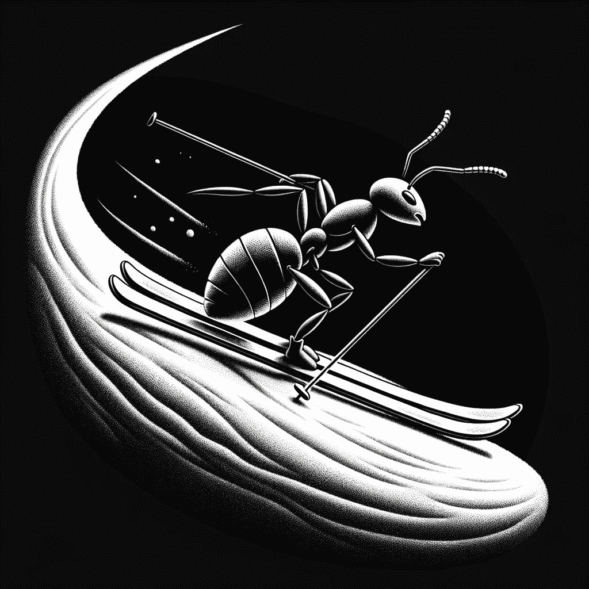

# 《蚁群优化实战》

> 原文：[`towardsdatascience.com/ant-colony-optimization-in-action-6d9106de60af?source=collection_archive---------4-----------------------#2023-09-20`](https://towardsdatascience.com/ant-colony-optimization-in-action-6d9106de60af?source=collection_archive---------4-----------------------#2023-09-20)

一只滑雪的蚂蚁。图像由作者使用 Dall·E 创建。

## 使用 ACO 在 Python 中解决优化问题并提升结果

 [Hennie de Harder](https://hennie-de-harder.medium.com/?source=post_page-----6d9106de60af--------------------------------)

·

[关注](https://medium.com/m/signin?actionUrl=https%3A%2F%2Fmedium.com%2F_%2Fsubscribe%2Fuser%2Ffb96be98b7b9&operation=register&redirect=https%3A%2F%2Ftowardsdatascience.com%2Fant-colony-optimization-in-action-6d9106de60af&user=Hennie+de+Harder&userId=fb96be98b7b9&source=post_page-fb96be98b7b9----6d9106de60af---------------------post_header-----------) 发布于 [Towards Data Science](https://towardsdatascience.com/?source=post_page-----6d9106de60af--------------------------------) ·10 min read·Sep 20, 2023

--

**欢迎回来！在我之前的** **上一篇文章****中，我介绍了蚁群优化（ACO）的基础知识。在这一部分，我们将深入探讨从零开始实现 ACO 算法，以应对两种不同的问题类型。**

我们将要讨论的问题是旅行商问题（TSP）和二次分配问题（QAP）。为什么这两个问题？因为 TSP 是一个经典挑战，而 ACO 恰好是一个有效的算法，用于找到图中最具成本效益的路径。另一方面，二次分配问题代表了与优化物品排列相关的不同问题类别，在这篇文章中，我旨在展示 ACO 可以作为解决这类分配相关问题的宝贵工具。这种多功能性使得 ACO 算法适用于广泛的问题。最后，我将分享一些提高解决方案速度的技巧。

# 旅行商问题

TSP 的描述很简单，但在寻找解决方案时可能会面临重大挑战。基本定义是：你需要发现一个访问图中所有节点的最短路径。这个问题属于…
