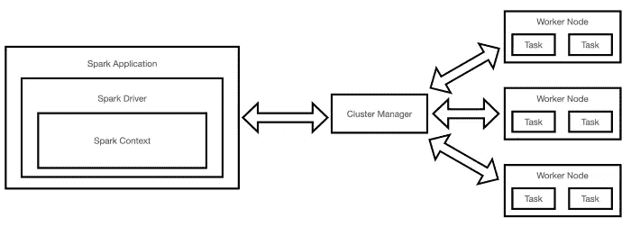

# Apache Spark 优化技术

> 原文：[`towardsdatascience.com/apache-spark-optimization-techniques-fa7f20a9a2cf?source=collection_archive---------3-----------------------#2023-01-11`](https://towardsdatascience.com/apache-spark-optimization-techniques-fa7f20a9a2cf?source=collection_archive---------3-----------------------#2023-01-11)

## 对一些最常见的 Spark 性能问题及其解决方法的回顾

 [Pier Paolo Ippolito](https://pierpaoloippolito28.medium.com/?source=post_page-----fa7f20a9a2cf--------------------------------)

·

[关注](https://medium.com/m/signin?actionUrl=https%3A%2F%2Fmedium.com%2F_%2Fsubscribe%2Fuser%2Fb8391a6a5f1a&operation=register&redirect=https%3A%2F%2Ftowardsdatascience.com%2Fapache-spark-optimization-techniques-fa7f20a9a2cf&user=Pier+Paolo+Ippolito&userId=b8391a6a5f1a&source=post_page-b8391a6a5f1a----fa7f20a9a2cf---------------------post_header-----------) 发布于 [Towards Data Science](https://towardsdatascience.com/?source=post_page-----fa7f20a9a2cf--------------------------------) ·5 分钟阅读·2023 年 1 月 11 日 

--

图片由 [Manuel Nägeli](https://unsplash.com/@gwundrig?utm_source=medium&utm_medium=referral) 提供，来源于 [Unsplash](https://unsplash.com/?utm_source=medium&utm_medium=referral)

# 介绍

Apache Spark 目前是业界最流行的大数据技术之一，由 Databricks 和 Palantir 等公司支持。

数据工程师在使用 Spark 时的关键职责之一，是编写高度优化的代码，以充分利用 Spark 的分布式计算能力（图 1）。

图 1：Apache Spark 架构（图像由作者提供）。

在本文中，你将会了解一些使用 Spark 时最常见的性能问题（例如 5 个 S）及其解决方法。如果你对 Apache Spark 完全陌生，可以在我的上一篇文章中找到更多相关信息。

# 5 个 S

5 个 S（溢出、偏移、洗牌、存储、序列化）是 Spark 中最常见的 5 个性能问题。可以用来在任何情况下提高 Spark 性能的两个关键通用方法是：

+   减少摄取的数据量。
