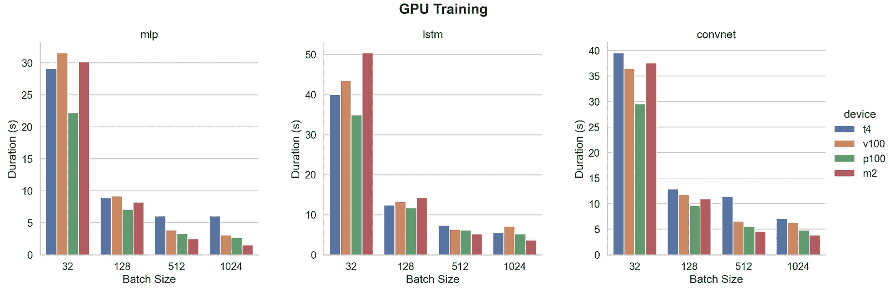
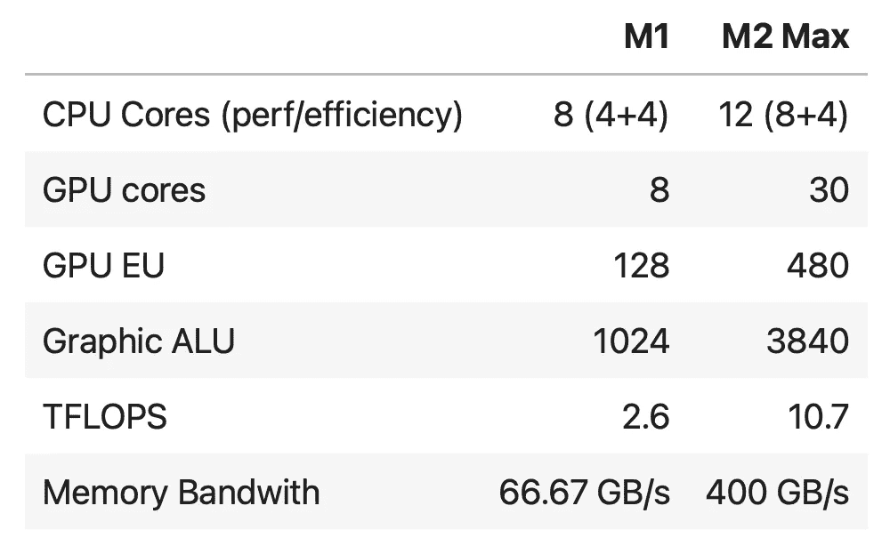

# Apple M2 Max GPU 与 Nvidia V100、P100 和 T4 的对比

> 原文：[`towardsdatascience.com/apple-m2-max-gpu-vs-nvidia-v100-p100-and-t4-8b0d18d08894?source=collection_archive---------0-----------------------#2023-11-02`](https://towardsdatascience.com/apple-m2-max-gpu-vs-nvidia-v100-p100-and-t4-8b0d18d08894?source=collection_archive---------0-----------------------#2023-11-02)

## 比较 Apple Silicon M2 Max GPU 与 Nvidia V100、P100 和 T4 在使用 TensorFlow 训练 MLP、CNN 和 LSTM 模型时的性能。

 [Fabrice Daniel](https://fabrice-daniel.medium.com/?source=post_page-----8b0d18d08894--------------------------------)

·

[关注](https://medium.com/m/signin?actionUrl=https%3A%2F%2Fmedium.com%2F_%2Fsubscribe%2Fuser%2F926442548db0&operation=register&redirect=https%3A%2F%2Ftowardsdatascience.com%2Fapple-m2-max-gpu-vs-nvidia-v100-p100-and-t4-8b0d18d08894&user=Fabrice+Daniel&userId=926442548db0&source=post_page-926442548db0----8b0d18d08894---------------------post_header-----------) 发表在 [Towards Data Science](https://towardsdatascience.com/?source=post_page-----8b0d18d08894--------------------------------) · 6 分钟阅读 · 2023 年 11 月 2 日 

--

作者提供的图片

2020 年 11 月发布的[**Apple M1**](https://en.wikipedia.org/wiki/Apple_M1)在由 Intel 主导的计算机世界中引发了一场革命。这些新款 M1 Mac 在许多基准测试中表现出色，因为 M1 的速度超过了大多数高端台式计算机，而且能耗仅为它们的一小部分。

以下是我之前对 M1 的基准测试：

[**M1 与 Xeon®、Core i5、K80 和 T4 的基准测试**](https://medium.com/towards-data-science/benchmark-m1-vs-xeon-vs-core-i5-vs-k80-and-t4-e3802f27421c)

[**M1 在 TensorFlow 训练中与 20 核心 Xeon® 竞争**](https://medium.com/towards-data-science/benchmark-m1-part-2-vs-20-cores-xeon-vs-amd-epyc-16-and-32-cores-8e394d56003d)

2023 年 1 月，苹果公司宣布了新的 [**M2 Pro 和 M2 Max**](https://en.wikipedia.org/wiki/Apple_M2)。它们的规格让我们期待显著的性能提升，尤其是在 GPU 方面。

比较 M2 Max 与 M1 的规格

*这款 M2 Max 配备了 30 个 GPU 核心，因此我们从 38 个 GPU 核心版本的 13.6 TFLOPS 估算出 10.7 TFLOPS。*
