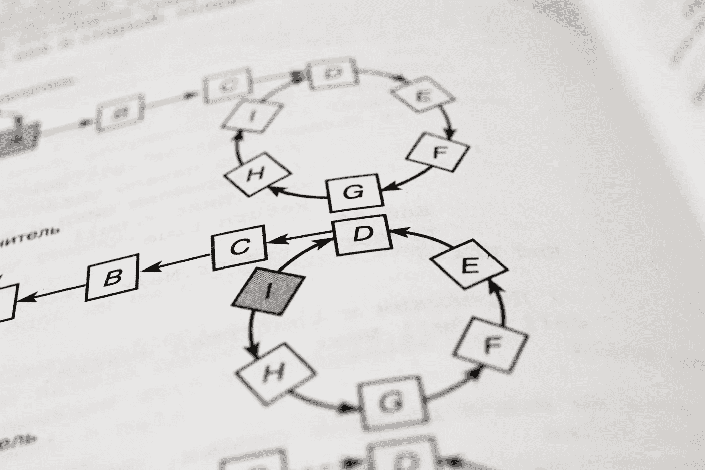
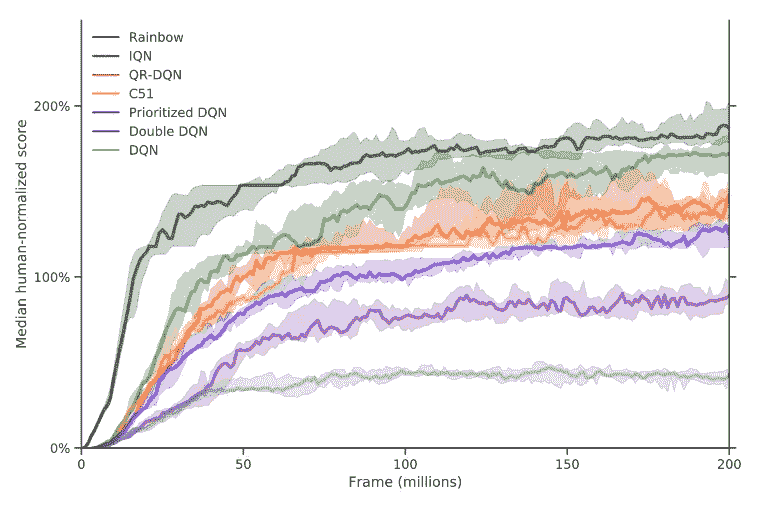

# 应用强化学习 III：深度 Q 网络（DQN）

> 原文：[`towardsdatascience.com/applied-reinforcement-learning-iii-deep-q-networks-dqn-8f0e38196ba9?source=collection_archive---------6-----------------------#2023-01-02`](https://towardsdatascience.com/applied-reinforcement-learning-iii-deep-q-networks-dqn-8f0e38196ba9?source=collection_archive---------6-----------------------#2023-01-02)

## 逐步学习 DQN 算法的行为，以及与之前的强化学习算法相比的改进

 [哈维尔·马丁内斯·奥赫达](https://medium.com/@JavierMtz5?source=post_page-----8f0e38196ba9--------------------------------)

·

[关注](https://medium.com/m/signin?actionUrl=https%3A%2F%2Fmedium.com%2F_%2Fsubscribe%2Fuser%2F74d7213a71a8&operation=register&redirect=https%3A%2F%2Ftowardsdatascience.com%2Fapplied-reinforcement-learning-iii-deep-q-networks-dqn-8f0e38196ba9&user=Javier+Mart%C3%ADnez+Ojeda&userId=74d7213a71a8&source=post_page-74d7213a71a8----8f0e38196ba9---------------------post_header-----------) 发表在 [Towards Data Science](https://towardsdatascience.com/?source=post_page-----8f0e38196ba9--------------------------------) ·7 分钟阅读·2023 年 1 月 2 日

--

照片由 [Андрей Сизов](https://unsplash.com/@alpridephoto?utm_source=medium&utm_medium=referral) 提供，来源于 [Unsplash](https://unsplash.com/?utm_source=medium&utm_medium=referral)

> 如果你想在没有 Premium Medium 账户的情况下阅读这篇文章，你可以通过这个朋友链接来阅读 :)
> 
> [`www.learnml.wiki/applied-reinforcement-learning-iii-deep-q-networks-dqn/`](https://www.learnml.wiki/applied-reinforcement-learning-iii-deep-q-networks-dqn/)

深度 Q 网络，最早由 Mnih 等人在 2013 年的论文**[1]**中报告，是迄今为止最著名的强化学习算法之一，由于其发布以来在无数 Atari 游戏中表现出超越人类的能力，如*图 1*所示。

**图 1**。每个代理在 57 款 Atari 游戏中的中位数人类标准化评分图。**图片摘自** [**deepmind/dqn_zoo GitHub 存储库**](https://github.com/deepmind/dqn_zoo)

此外，除了看到 DQN 代理像职业玩家一样玩这些 Atari 游戏的迷人之处外，DQN 还解决了一个已经存在几十年的算法问题：Q 学习，这在本系列的第一篇文章中已有介绍和解释。
