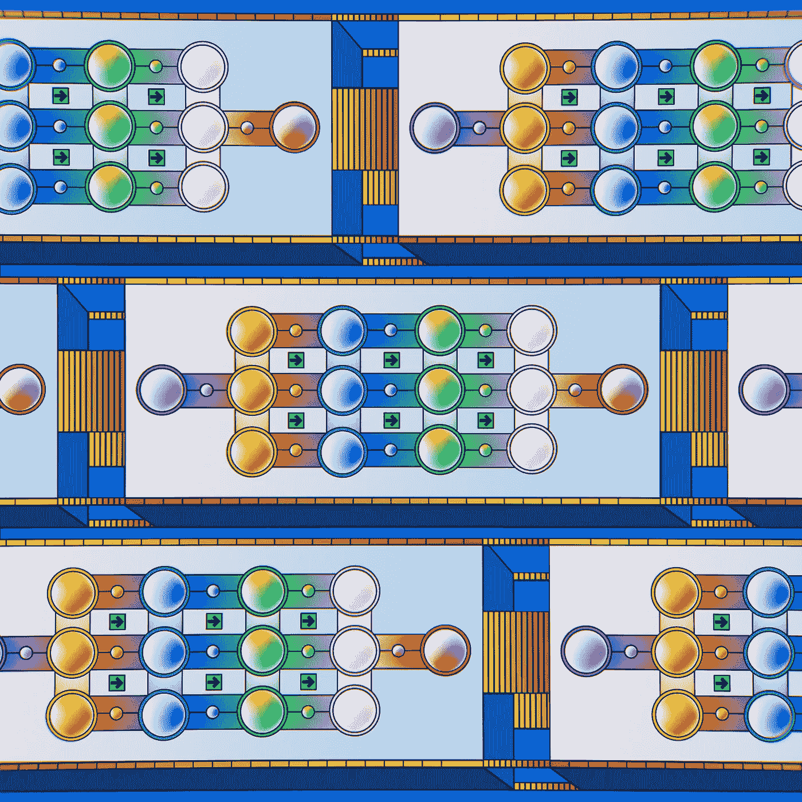

# 应用强化学习 IV：DQN 实现

> 原文：[`towardsdatascience.com/applied-reinforcement-learning-iv-implementation-of-dqn-7a9cb2c12f97?source=collection_archive---------12-----------------------#2023-01-10`](https://towardsdatascience.com/applied-reinforcement-learning-iv-implementation-of-dqn-7a9cb2c12f97?source=collection_archive---------12-----------------------#2023-01-10)

## DQN 算法的实现及其在 OpenAI Gym 的 CartPole-v1 环境中的应用

 [哈维尔·马丁内斯·奥赫达](https://medium.com/@JavierMtz5?source=post_page-----7a9cb2c12f97--------------------------------)

·

[关注](https://medium.com/m/signin?actionUrl=https%3A%2F%2Fmedium.com%2F_%2Fsubscribe%2Fuser%2F74d7213a71a8&operation=register&redirect=https%3A%2F%2Ftowardsdatascience.com%2Fapplied-reinforcement-learning-iv-implementation-of-dqn-7a9cb2c12f97&user=Javier+Mart%C3%ADnez+Ojeda&userId=74d7213a71a8&source=post_page-74d7213a71a8----7a9cb2c12f97---------------------post_header-----------) 发表在 [Towards Data Science](https://towardsdatascience.com/?source=post_page-----7a9cb2c12f97--------------------------------) ·8 分钟阅读·2023 年 1 月 10 日

--

图片由 [DeepMind](https://unsplash.com/@deepmind?utm_source=medium&utm_medium=referral) 提供，来自 [Unsplash](https://unsplash.com/?utm_source=medium&utm_medium=referral)

> 如果你想阅读这篇文章但没有高级 Medium 账户，可以通过这个朋友链接来阅读 :)
> 
> [`www.learnml.wiki/applied-reinforcement-learning-iv-implementation-of-dqn/`](https://www.learnml.wiki/applied-reinforcement-learning-iv-implementation-of-dqn/)

在本系列的上一篇文章中，[*应用强化学习 III：深度 Q 网络（DQN）*](https://medium.com/@JavierMtz5/applied-reinforcement-learning-iii-deep-q-networks-dqn-8f0e38196ba9) 介绍并解释了深度 Q 网络算法，以及相对于其前身 [Q 学习](https://medium.com/towards-data-science/applied-reinforcement-learning-i-q-learning-d6086c1f437) 的应用优势和劣势。在本文中，将通过将 DQN 应用于实际用例来实践之前所解释的一切。如果你对 DQN 算法的基本概念或其原理不熟悉，建议在继续阅读本文之前先查看上一篇文章。

[## 应用强化学习 III：深度 Q 网络（DQN）](https://medium.com/@JavierMtz5/applied-reinforcement-learning-iii-deep-q-networks-dqn-8f0e38196ba9?source=post_page-----7a9cb2c12f97--------------------------------)

### 逐步学习 DQN 算法的行为，以及其相较于之前强化学习的改进…

[medium.com](https://medium.com/@JavierMtz5/applied-reinforcement-learning-iii-deep-q-networks-dqn-8f0e38196ba9?source=post_page-----7a9cb2c12f97--------------------------------)

# 环境 — CartPole-v1

将使用的模拟环境是 [**gym CartPole 环境**](https://www.gymlibrary.dev/environments/classic_control/cart_pole/)，它包括…
