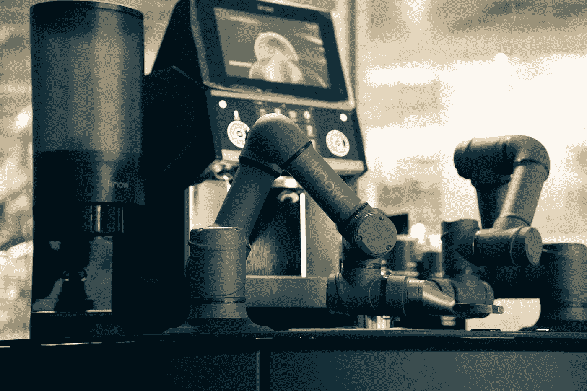

# 应用强化学习 VI：用于连续控制的深度确定性策略梯度 (DDPG)

> 原文：[`towardsdatascience.com/applied-reinforcement-learning-vi-deep-deterministic-policy-gradients-ddpg-for-continuous-dad372f6cb1d?source=collection_archive---------16-----------------------#2023-03-07`](https://towardsdatascience.com/applied-reinforcement-learning-vi-deep-deterministic-policy-gradients-ddpg-for-continuous-dad372f6cb1d?source=collection_archive---------16-----------------------#2023-03-07)

## DDPG 算法的介绍和理论解释，它在连续控制领域有许多应用

 [Javier Martínez Ojeda](https://medium.com/@JavierMtz5?source=post_page-----dad372f6cb1d--------------------------------)

·

[关注](https://medium.com/m/signin?actionUrl=https%3A%2F%2Fmedium.com%2F_%2Fsubscribe%2Fuser%2F74d7213a71a8&operation=register&redirect=https%3A%2F%2Ftowardsdatascience.com%2Fapplied-reinforcement-learning-vi-deep-deterministic-policy-gradients-ddpg-for-continuous-dad372f6cb1d&user=Javier+Mart%C3%ADnez+Ojeda&userId=74d7213a71a8&source=post_page-74d7213a71a8----dad372f6cb1d---------------------post_header-----------) 发布于 [Towards Data Science](https://towardsdatascience.com/?source=post_page-----dad372f6cb1d--------------------------------) ·8 分钟阅读·2023 年 3 月 7 日

--

图片由 [Eyosias G](https://unsplash.com/pt-br/@yozz_t?utm_source=medium&utm_medium=referral) 提供，来自 [Unsplash](https://unsplash.com/?utm_source=medium&utm_medium=referral)

> 如果你想阅读这篇文章而不需要 Premium Medium 账户，可以通过这个朋友链接访问 :)
> 
> [`www.learnml.wiki/applied-reinforcement-learning-vi-deep-deterministic-policy-gradients-ddpg-for-continuous-control/`](https://www.learnml.wiki/applied-reinforcement-learning-vi-deep-deterministic-policy-gradients-ddpg-for-continuous-control/)

**DDPG 算法**，首次由 Lillicarp 等人在 ICLR 2016 上提出 **[1]**，在深度强化学习算法用于连续控制方面取得了重大突破，因为它相对于只适用于离散动作的 DQN **[2]** 有了改进，且其结果非常优秀且易于实现（见**[1]**）。

关于**NAF 算法** **[3]**，它在[上一篇文章](https://medium.com/towards-data-science/applied-reinforcement-learning-v-normalized-advantage-function-naf-for-continuous-control-62ad143d3095)中提到，DDPG 适用于连续动作空间和连续状态空间，因此它也是适用于机器人技术或自动驾驶等领域的连续控制任务的有效选择。
