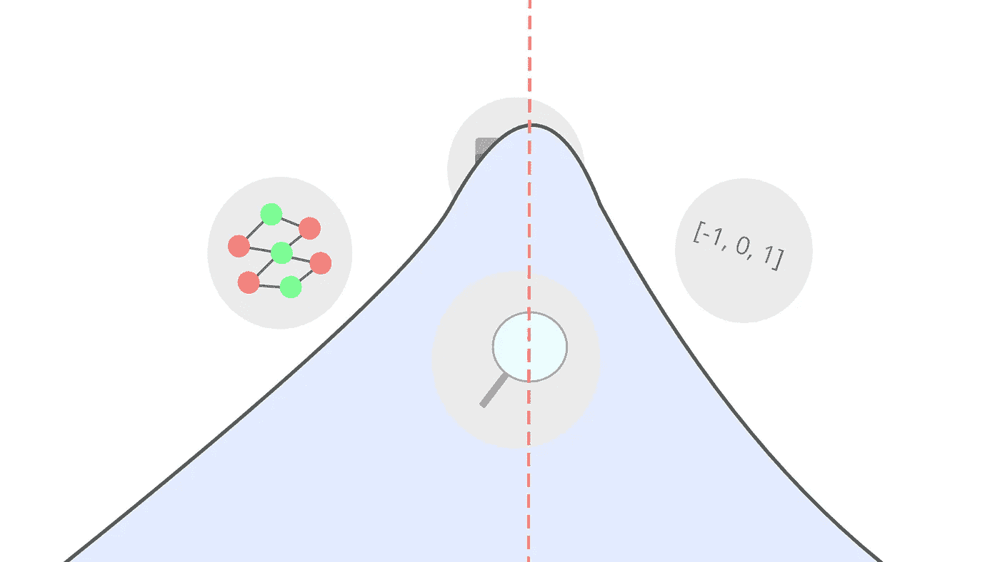
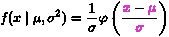
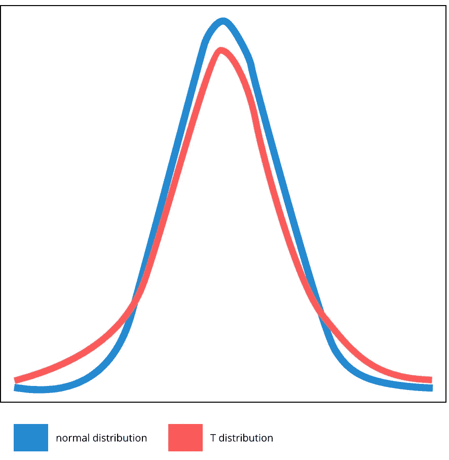
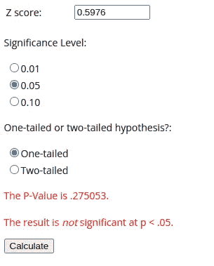
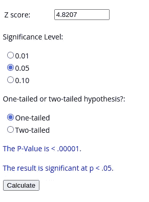

# 应用和使用正态分布进行数据科学

> 原文：[`towardsdatascience.com/applying-and-using-the-normal-distribution-for-data-science-98f910629ba1`](https://towardsdatascience.com/applying-and-using-the-normal-distribution-for-data-science-98f910629ba1)

## 数据科学步骤

## 回顾正态分布在数据科学中的各种应用

[](https://emmaccode.medium.com/?source=post_page-----98f910629ba1--------------------------------)[](https://towardsdatascience.com/?source=post_page-----98f910629ba1--------------------------------) [Emma Boudreau](https://emmaccode.medium.com/?source=post_page-----98f910629ba1--------------------------------)

·发布于 [Towards Data Science](https://towardsdatascience.com/?source=post_page-----98f910629ba1--------------------------------) ·10 分钟阅读·2023 年 7 月 7 日

--



(作者提供的图片)

# 介绍

在开始数据科学时，可能极其困难的一点是确定这段旅程的确切起点和终点。关于数据科学旅程的终点，重要的是要记住这个领域每天都有进展，必定会有新的突破 —— 要准备好学习大量知识。数据科学不仅包括科学、统计和编程，还涉及多个其他学科。

为了减轻数据科学的复杂性，重要的是将信息分解为易于消化的小块。深入研究并了解领域中的特定方面 —— 无论是数据、编程、机器学习、分析还是科学，确实可以很有趣。虽然这让我感到兴奋，但有时也很有必要缩小重点，深入学习某一特定主题。对于初学者来说，这些交织的领域确实让人不知从何开始。我认为，统计学和正态分布是数据科学的一个很好的起点。我写了一篇文章，详细阐述了原因，并深入探讨了正态分布。我们将在这里简要总结这篇文章，但许多细节将被省略。

[](https://chifi.dev/the-firtst-thing-to-learn-for-data-science-stats-the-normal-distribution-e28dd353e19c?source=post_page-----98f910629ba1--------------------------------) [## 数据科学统计的首要学习内容 — 正态分布

### 简单正态分布的概述和编程。

[chifi.dev](https://chifi.dev/the-firtst-thing-to-learn-for-data-science-stats-the-normal-distribution-e28dd353e19c?source=post_page-----98f910629ba1--------------------------------)

上述描述的正态分布是一个简单的概率密度函数（PDF），我们可以在数据上应用此函数。这个函数，我们称之为***f***，计算标准差***x***在均值`f(x)`中的数量。考虑一下。我们需要从均值中获得标准差，我们怎么检查一个值离均值有多少个标准差？首先，我们需要看它离均值有多远，对吧？然后我们需要看这个差异有多少个标准差。这正是我们在公式中所做的。因此，对于每个 x，我们减去均值，然后将差异除以标准差。在统计学中，小写希腊字母 sigma (σ) 代表标准差，小写希腊字母 mu (µ) 代表均值。在下面的公式中，x bar (x̄) 代表观察值（即上面**f(x)**中的**x**）。



主要注意被突出显示的部分。

## 进入编程语言

在上一篇文章的结尾，我们将其引入了编程语言——Julia。语言的选择完全取决于数据科学家，但也需要考虑权衡，并且了解行业动态也很重要。例如，R 是一种相对较慢的语言，但其分析包已由优秀开发者和出色的仪表盘工具维护多年。如今最受欢迎的选择可能是 Python，因为它能够快速连接 C 库且易于使用。Julia 是一种相对较新的语言，但它是我最喜欢的编程语言，我认为大多数数据科学家应该了解它。虽然 Julia 的受欢迎程度迅速上升，但如果你同时掌握这两种语言，也总有更多的工作机会。幸运的是，大多数常用于数据科学的流行语言往往有很多共同之处，最终相互参考也相当容易。这是我们用 Python 和 Julia REPL 分别编写的正态分布。

> python

```py
>>> from numpy import mean, std
>>> x = [5, 10, 15]
>>> normed = [(mean(x) - i) / std(x) for i in x]
>>> print(normed)
[1.224744871391589, 0.0, -1.224744871391589]
```

> julia

```py
julia> using Statistics: std, mean

julia> x = [5, 10, 15]
3-element Vector{Int64}:
  5
 10
 15

julia> normed = [(mean(x) - i) / std(x) for i in x]
3-element Vector{Float64}:
  1.0
  0.0
 -1.0
```

这里是每种编程语言的笔记本。我将用三种语言编写笔记本，不仅使本教程对每个人都可用，还推广使用多种语言的理念。这些语言相似且相当容易阅读，因此很容易对比差异，了解你喜欢哪种语言，并深入探索每种语言的权衡。

> notebooks
> 
> python

[](https://github.com/emmettgb/Emmetts-DS-NoteBooks/blob/master/Python3/Applying%20the%20normal%20distribution%20%28py%29.ipynb?source=post_page-----98f910629ba1--------------------------------) [## Emmetts-DS-NoteBooks/Python3/Applying the normal distribution (py).ipynb at master ·…

### 各种项目的随机笔记本。通过创建一个账户来为 emmettgb/Emmetts-DS-NoteBooks 开发贡献代码…

github.com](https://github.com/emmettgb/Emmetts-DS-NoteBooks/blob/master/Python3/Applying%20the%20normal%20distribution%20%28py%29.ipynb?source=post_page-----98f910629ba1--------------------------------)

> julia

[](https://github.com/emmettgb/Emmetts-DS-NoteBooks/blob/master/Julia/Applying%20the%20normal%20distribution.ipynb?source=post_page-----98f910629ba1--------------------------------) [## Emmetts-DS-NoteBooks/Julia/Applying the normal distribution.ipynb at master ·…

### 各种项目的随机笔记本。通过创建一个账户来为 emmettgb/Emmetts-DS-NoteBooks 开发贡献代码…

github.com](https://github.com/emmettgb/Emmetts-DS-NoteBooks/blob/master/Julia/Applying%20the%20normal%20distribution.ipynb?source=post_page-----98f910629ba1--------------------------------)

## 设置我们的函数

我们首先需要一个函数，它能为一个`Vector`的数字提供正态分布。这就像是在将均值和标准差代入公式之前获取均值和标准差一样简单。这个函数将接受一个参数，即我们的`Vector`，然后返回我们标准化后的`Vector`。为此，我们当然还需要均值和标准差——我们可以使用相关的依赖。在 Python 中，我们会使用 Numpy 的`mean`和`std`函数。在 Julia 中，我们会使用`Statistics.mean`和`Statistics.std`。不过，今天我们将从头开始编写所有内容，这里是我在 Python 和 Julia 中的简单均值和标准差函数：

```py
# python
import math as mt
def mean(x : int):
    return(sum(x) / len(x))

def std(arr : list):
    m = mean(arr)
    arr2 = [(i-m) ** 2 for i in arr]
    m = mean(arr2)
    m = mt.sqrt(m)
    return(m)
```

```py
# julia
mean(x::Vector{<:Number}) = sum(x) / length(x)

function std(array3::Vector{<:Number})
    m = mean(array3)
    [i = (i-m) ^ 2 for i in array3]
    m = mean(array3)
    try
        m = sqrt(m)
    catch
        m = sqrt(Complex(m))
    end
    return(m)
end
```

现在我们有了一些获取函数所需值的功能，我们需要将这些功能封装成一个函数。这很简单，我只需使用上面的方法获取我们的总体均值和标准差，然后通过一个理解式来减去均值并将差异除以标准差。

```py
# python
def norm(x : list):
    mu = mean(x)
    sigma = std(x)
    return([(xbar - mu) / sigma for xbar in x])
```

```py
# julia
function norm(x::Vector{<:Number})
    mu::Number = mean(x)
    sigma::Number = std(x)
    [(xbar - mu) / sigma for xbar in x]::Vector{<:Number}
end
```

现在让我们尝试一下我们的标准化函数。这是一个容易测试的例子，我们只需提供一个我们知道均值的向量。这是因为我们向量的均值应该为零。因此，在`[5, 10, 15]`的情况下，0 将是 10——即`[5, 10, 15]`的均值。5 将大约是-1.5，即距离均值一个标准差（在这种情况下，我们的标准差等于 2.5）。

```py
norm([5, 10, 15])

[-1.224744871391589, 0.0, 1.224744871391589]
```

在正态分布中，统计显著值通常在距离均值近 2 个标准差时开始被注意到。换句话说，如果大多数人的身高约为 10 英寸，而某人的身高为 20 英寸，这将是距离均值 3 个标准差的情况，并且在统计上非常显著。

```py
mu = mean([5, 10, 15])
sigma = std([5, 10, 15])

(15 - mu) / sigma

1.5811388300841895

(20 - mu) / sigma

3.162277660168379
```

## 分析的正态分布

Z 分布或正态分布在数据分析中也有许多应用。这个分布可以用于测试，但不像 T 检验那样常用。原因是正态分布的尾部相对较短。因此，它通常用于样本量较大且方差已知的测试中。例如，将正态分布与 T 分布比较，我们会发现 T 分布的尾部更长。这意味着统计显著性的区域更长——因此更容易检测。



仅供参考 — 当自由度减少时，T 分布的尾部变长，均值的权重减小。上面的 t 分布大约有 8 个自由度，但 1 个自由度的 T 分布会更加平坦，尾部更宽。作者提供的图片

这种测试，即 Z 检验，将测试总体均值是否有足够的差异以达到统计显著性。公式也与之前 PDF 中看到的公式非常相似，所以这里没有太多新内容。我们将 xbar 更改为我们要测试的总体的均值，而不是使用每个观察值。该测试将返回一个叫做 Z 统计量的结果。与 T 统计量类似，它通过另一个函数得出概率值。让我们创建一个简单的一维观察集，并看看如何进行这样的测试。

```py
pop = [5, 10, 15, 20, 25, 30]
mu = mean(pop)
sigma = std(pop)
```

我们将从中间获取一个随机样本并计算 Z 统计量：

```py
xbar = mean(pop[3:5])
```

现在我们只需将其代入我们的公式中……

```py
(xbar - mu) / sigma
0.5976143046671968
```

这个新数字是我们的 Z 统计量。将这些统计值转化为概率值的数学过程相当复杂。两种语言中都有可以帮助处理这些问题的库。对于 Julia，我推荐`HypothesisTests`，而对于 Python，我推荐`scipy`模块。对于本文，我们将使用一个在线 Z 统计量到[概率值计算器](https://www.socscistatistics.com/pvalues/normaldistribution.aspx)。让我们将 Z 统计量代入其中：



作者提供的图片

正如我们预期的那样，一些离其他样本非常近的总体，其均值在统计上并不显著。话虽如此，我们当然可以尝试一些在统计上更显著的情况，并拒绝我们的零假设！

```py
xbar = mean([50, 25, 38])
(xbar - mu) / sigma

4.820755390982054
```



作者提供的图片

正态分布在测试中的确表现良好。关键在于理解这种测试形式需要较大的样本量，并且并不适用于所有数据。在大多数情况下，对于初学者，我会建议从更容易测试的分布开始，例如 T 分布。对于 Z 检验，数据的重要性更大，初学者可能很难找到大规模的数据来源，而且即使数据在统计上显著，也可能更难获得统计显著结果。

正态分布在数据科学项目中的某些情况下也可以用于快速分析。将数据转化为其与总体的关系对于从数据可视化到确定给定总体的变异程度等所有方面都是非常有用的。通过研究我们观察值与均值的关系，我们可以学到很多关于总体的信息。如果你想了解更多关于这个过程的内容，我有一个适合初学者的概述，可能会在这种情况下对你有所帮助，你可以在这里阅读：

[## 面向初学者的应用科学介绍](https://towardsdatascience.com/a-beginner-friendly-introduction-to-applied-science-dd60741a9b17?source=post_page-----98f910629ba1--------------------------------)

### 学习特征和统计分析的基础知识

[面向数据科学的初学者友好介绍](https://towardsdatascience.com/a-beginner-friendly-introduction-to-applied-science-dd60741a9b17?source=post_page-----98f910629ba1--------------------------------)

## 归一化数据

正态分布的另一个极佳应用是利用分布来进行数据归一化。连续特征可能会出现一些问题，其中最重要的问题之一是离群值。我们需要将离群值从数据中剔除，这样我们的数据才能成为一种概括。记住，构建优质数据的关键是构建一个良好的总体。我所指的是，我们希望数据的总体——例如均值——能够代表数据在一定变异水平下的正常状态。这样，当某些东西不同的时候，就会变得非常明显。

由于正态分布告诉我们一个值离均值有多少个标准差，因此很容易理解我们如何利用它来进行数据归一化。如前所述，2.0 大致是事情开始变得显著的地方。也就是说，我们可以制作一个掩码，并利用它来筛选不良值！

```py
# julia
function drop_outls(vec::Vector{<:Number})
    normed = norm(vec)
    mask = [~(x <= -2 || x >= 2) for x in normed]
    normed[mask]
end
```

通过这种简单的掩码过滤，我们增加了辨别值是否远离均值的能力，并基于此将其剔除。在大多数情况下，我们可能还想用均值替换这些离群值，以免丢失其他特征或目标的观察值。

```py
# python
def drop_outls(vec : list):
    mu = mean(vec)
    normed = norm(vec)
    mask = [x <= -2 or x >= 2 for x in normed]
    ret = []
    for e in range(1, len(mask)):
        if mask[e] == False:
            ret.append(vec[e])
        else:
            ret.append(mu)
    return(ret)
```

## 归一化的常态

在数据科学中，正态分布的最终应用之一是标准化（Standard Scaler）。标准化就是将正态分布应用到你的数据上。这种标准化方法非常有用，因为它有助于将数据转化为更贴近其所在特征的数据。这对于机器学习来说极其重要，可以非常容易地提高模型的准确性，前提是你有一个连续特征。使用标准化非常简单；只需像之前一样使用我们的 PDF，就能获得归一化特征。

```py
myX = [1, 2, 3, 4, 5]
normedx = norm(x)
```

这用于提供给机器学习的数据。正态分布通常用于处理许多机器学习模型中的连续特征，这些模型每天都会被部署。

## 总结一下

总结一下，正态分布是统计学和数据科学的基本构建块，广泛应用于数据科学的各种应用中。这个领域有很多不同的主题通常会以这种方式展开：开始时相对简单，最终发展成相当复杂的内容。深入研究一个主题肯定是很好的，正态分布也不例外，因为它的本质和简单性使得它具备了令人惊叹的能力。感谢大家的阅读，希望这个概述对你们有帮助！
