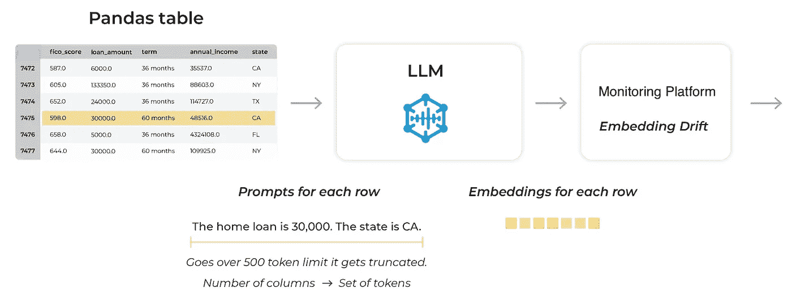

# 应用大型语言模型于表格数据以识别漂移

> 原文：[`towardsdatascience.com/applying-large-language-models-to-tabular-data-to-identify-drift-54c9fa59255f?source=collection_archive---------2-----------------------#2023-04-25`](https://towardsdatascience.com/applying-large-language-models-to-tabular-data-to-identify-drift-54c9fa59255f?source=collection_archive---------2-----------------------#2023-04-25)

图片由作者使用 Dall-E 2 创建

## 大型语言模型（LLMs）是否能够减少异常检测中的工作量，避免参数化或专门的模型训练？

 [Aparna Dhinakaran](https://aparnadhinak.medium.com/?source=post_page-----54c9fa59255f--------------------------------)

·

[关注](https://medium.com/m/signin?actionUrl=https%3A%2F%2Fmedium.com%2F_%2Fsubscribe%2Fuser%2Ff32f85889f3a&operation=register&redirect=https%3A%2F%2Ftowardsdatascience.com%2Fapplying-large-language-models-to-tabular-data-to-identify-drift-54c9fa59255f&user=Aparna+Dhinakaran&userId=f32f85889f3a&source=post_page-f32f85889f3a----54c9fa59255f---------------------post_header-----------) 发布于 [Towards Data Science](https://towardsdatascience.com/?source=post_page-----54c9fa59255f--------------------------------) ·9 分钟阅读·2023 年 4 月 25 日

--

**跟随本博客的** [**配套 Colab**](https://colab.research.google.com/gist/PubliusAu/1d3f3e6d1497e80f72f3e887e8a2bdc1/zero-shot-anomaly-detection-using-llms-california-medium-home-values-arize.ipynb)**.**

*本博客由 Arize AI 的首席执行官兼联合创始人 Jason Lopatecki 和 Decision Patterns 的首席执行官兼创始人 Christopher Brown 合作撰写*

最近，大语言模型（LLM）的进展正在许多领域证明其破坏性力量（参见：[*人工通用智能的火花：对 GPT-4 的早期实验*](https://arxiv.org/pdf/2303.12712.pdf)*）。像许多人一样，我们对这些进展充满浓厚的兴趣，并探索 LLMs 影响数据科学和机器学习领域工作流程和常见实践的潜力。

在我们的[之前的文章](https://medium.com/towards-data-science/boosting-tabular-data-predictions-with-large-language-models-531337f834dc)中，我们展示了 LLMs 使用 Kaggle 竞赛中常见的表格数据提供预测的潜力。几乎不需要任何努力（即数据清理和/或特征开发），我们的基于 LLM 的模型能够在多个竞赛条目中获得八十多百分位的分数。虽然这与最佳模型相比并不具有竞争力，但所需的少量工作使其成为一个有趣的附加预测工具和一个优秀的起点。

本文解决了数据科学和机器学习工作流程中的另一个常见挑战：漂移和异常检测。机器学习模型是用历史数据和已知结果进行训练的。存在一个隐含的假设，即未来的数据将保持静态（例如，关于其分布特征不变）。在实践中，这往往是一个脆弱的假设。复杂系统因各种原因随时间发生变化。数据可能自然地转变为新模式（通过漂移），或者可能由于训练数据之后出现的新异常而发生变化。负责模型的数据科学家通常需要监控数据，检测漂移或异常，并作出与重新训练模型相关的决策。这不是一项简单的任务。许多文献、方法论和最佳实践已经被开发出来以检测漂移和异常。许多解决方案采用了昂贵且耗时的努力，旨在检测和减轻生产系统中异常的存在。

我们想知道：LLMs 是否可以减少漂移和异常检测所需的工作量？

# 方法

本文提出了一种使用大语言模型（LLM）[嵌入](https://arize.com/blog-course/embeddings-meaning-examples-and-how-to-compute/)、UMAP [降维](https://arize.com/blog-course/reduction-of-dimensionality-top-techniques)、非参数聚类和数据可视化来进行异常和漂移检测的新方法。异常检测（有时也称为离群点检测或稀有事件检测）是使用统计学、分析和机器学习技术来识别感兴趣的数据观测值。

为了说明这种方法，我们使用了 [加州中等住宅价值数据集](https://scikit-learn.org/stable/modules/generated/sklearn.datasets.fetch_california_housing.html)，该数据集可在 SciKit learn 包中获得（© 2007–2023，scikit-learn 开发者，BSD 许可证；原始数据来源是 Pace, R. Kelley 和 Ronald Barry，“[稀疏空间自回归](https://www.sciencedirect.com/science/article/abs/pii/S016771529600140X)”，“*统计与概率通讯*”，第 33 卷，第 3 期，1997 年 5 月 5 日，第 291–297 页）。我们通过采样和置换数据合成小区域的异常数据。合成数据然后很好地隐藏在原始（即“生产”）数据中。实验通过改变异常点的比例以及“异常度”——基本上是我们预计发现异常的难度，来进行。然后该过程试图识别这些异常值。通常，这种内点检测具有挑战性，需要选择比较集、模型训练和/或启发式定义。

我们证明了 LLM 模型方法可以以 96.7%的准确率（假阳性和假阴性大致相等）检测到包含仅 2%数据的异常区域。这种检测能够发现隐藏在现有分布内部的异常数据。这种方法可以应用于生产数据，无需标记、手动分布比较，甚至无需过多思考。该过程完全不依赖参数和模型，是进行异常检测的一个有吸引力的第一步。

# 背景

模型可观察性的一个常见挑战是快速且直观地识别异常数据。这些异常值可能由于数据漂移（数据分布随时间的自然变化）或异常（意外的数据子集覆盖预期分布）而出现。异常可能来自许多来源，但有两个非常常见。第一个是对上游数据源的（通常是）未通知的更改。越来越多的数据消费者与数据生产者的接触较少。计划中的（和未计划的）更改没有传达给数据消费者。第二个问题则更为隐蔽：对流程和系统中执行不良操作的对手。这些行为通常引起数据科学家的关注。

一般来说，查看多变量数据的漂移方法存在一些挑战，这些挑战限制了它们的使用。一种典型的方法是使用变分自编码器（VAEs）、降维，或者将原始未编码的数据组合成一个向量。这通常涉及到建模过去的异常、创建特征以及检查内部（不）一致性。这些技术的缺陷在于需要不断（重新）训练模型并适应每个数据集。此外，团队通常需要手动识别、设置和调整许多参数。这种方法可能很慢、耗时且昂贵。

在这里，我们将 LLMs 应用于表格数据中的异常检测任务。展示的方法具有优点，因为它易于使用。无需额外的模型训练，降维使问题空间在视觉上可表示，聚类生成异常簇的候选项。使用预训练的 LLM 可以绕过参数化、特征工程和专门模型训练的需求。其插件化意味着 LLM 可以直接为数据科学团队工作。

# 数据

在这个例子中，我们使用的是 1990 年美国人口普查中的加利福尼亚州房屋价值数据（Pace et al, 1997），该数据可以在[在线](https://developers.google.com/machine-learning/crash-course/california-housing-data-description)找到，并且被纳入了[SciKit-Learn](https://scikit-learn.org/stable/datasets/real_world.html#7.2.7) Python 包中。选择这个数据集是因为它的清洁度、使用了连续/数值特征以及其普遍可用性。我们已经在类似的数据上进行了实验。

## 方法论

注：有关该过程的更完整示例，请参阅[配套笔记本](https://colab.research.google.com/gist/PubliusAu/1d3f3e6d1497e80f72f3e887e8a2bdc1/zero-shot-anomaly-detection-using-llms-california-medium-home-values-arize.ipynb)。

# 合成异常

与之前的研究一致，我们发现检测异常的能力受三个因素的影响：异常观察的数量、异常值或这些观察值在参考分布中突出的程度，以及定义异常的维度数量。

第一个因素应该很明显。更多的异常信息导致检测更快更容易。确定一个单独的观察是否异常是一个挑战。随着异常数量的增加，识别变得更容易。

第二个因素，即**异常值程度**，至关重要。在极端情况下，异常可能超出一个或多个变量的允许范围。在这种情况下，异常检测是显而易见的。更困难的是那些隐藏在分布中间的异常（即“内部点”）。内部点检测往往具有挑战性，许多建模方法对任何形式的系统检测感到无能为力。

最后一个因素是定义异常所使用的维度数量。换句话说，就是有多少变量参与了观察的异常特性。在高维空间中，观察通常变得稀疏。一组在多个维度上变化很小的异常，可能突然变得与参考分布中的观察值非常遥远。几何推理（以及各种多维距离计算）表明，受影响的维度数量越多，检测越容易，检测限制越低。

在合成我们的异常数据时，我们影响了这三个变量。我们进行了一个实验设计，其中：异常观测的数量从总观测的 1% 到 10% 不等，异常值集中在 0.50–0.75 分位数周围，变量数量从 1 到 4 受影响。

# 利用 LLM 进行异常和漂移检测

我们的方法使用提示让 LLM 提供关于数据每一行的信息。[提示很简单](https://arize.com/blog-course/applying-large-language-models-to-tabular-data/)。对于每一行/观测，一个提示包括以下内容：

*“<列名> 的值是 <单元格值>。<列名> 的值是 <单元格值>。…”*

对每一列进行这样的操作，为每一行创建一个连续的提示。有两点需要注意：

1.  对训练数据生成提示不是必要的，只需对进行异常检测的数据生成提示即可。

1.  询问观测是否异常并非严格必要（尽管这是一个额外调查的热点领域）。

从表格数据创建的提示示例。每行数据被编码为一个单独的提示，并通过连接每个单元格中的简单语句生成。（图片由作者提供）

一旦提供给 LLM，模型的文本响应会被 *忽略*。我们只关心每个观测的嵌入（例如嵌入向量）。嵌入向量至关重要，因为每个嵌入向量提供了观测在 LLM 训练参考下的位置。尽管实际机制由于神经网络模型的性质和复杂性而被掩盖，但我们将 LLM 视为构建一个潜在响应表面。该表面已包含互联网规模的来源，包括对房价的学习。真实观测——例如那些与学习结果匹配的——位于或接近响应表面；异常值则位于响应表面之外。虽然响应表面大体上是一个隐藏的产物，但确定异常并不是学习表面的问题，而是单纯地识别类似值的簇。真实观测彼此接近。异常观测也彼此接近，但这些集合是不同的。确定异常只是分析这些嵌入向量的问题。

LLM 捕捉了数字特征和分类特征的结构。上图展示了表格数据框的每一行以及映射到 LLM 生成的嵌入的模型预测。LLM 以一种方式映射这些提示，从特征创建拓扑表面，这些特征基于 LLM 之前训练的内容。在上述示例中，你可以看到数值字段 X/Y/Z 在左侧为低值，在右侧为高值。（图片由作者提供）

# 可视化：维度缩减、聚类和异常识别

这个欧几里得距离图提供了一个粗略的指示，说明数据中是否存在异常。图表右侧的凸起与引入的数据中的合成异常是一致的。

UMAP 算法是一项重要创新，它旨在保持几何结构，以便优化使得紧密观察仍然保持紧密，而远离的观察保持远离。在进行维度减少后，我们应用聚类方法来查找密集的、相似的簇。这些簇随后与参考分布进行比较，这可以用来突出异常或漂移的簇。这些步骤大多数是无参数的。最终目标是识别出作为离群点的数据点簇。

嵌入漂移：通过 UMAP 降维、聚类和与参考分布比较的自动（异常）簇检测。漂移或异常点会自动用红色标出，并可排队进行进一步分析，包括带有人类反馈的强化学习。

# 实验结果

我们探讨了多种条件下的异常检测方法，包括异常变量的数量、异常的比例以及离群程度。在这些实验中，即使在值接近分布的中位数（中位数上下 +/- 5 个百分位）的情况下，我们也能够检测到异常区域，其占数据的比例达到了或超过了 2%。在实验的五次重复中，该方法都能自动找到并识别异常区域，并且如上节所示，使其明显可见。在将单个点识别为异常簇成员时，该方法的准确率为 97.6%，精确度为 84%，召回率为 89.4%。

## 结果总结

+   异常比例：2%

+   异常分位数：0.55

+   异常列数：4

+   准确率：97.6%

+   精确度：84.0%

+   召回率：89.4%

## 混淆矩阵

作者提供的图像

# 结论

这部分展示了使用预训练的 LLM 帮助从业者识别表格数据中的漂移和异常。在对不同异常比例、异常位置和异常列进行测试期间，该方法在大多数情况下能够检测到占数据 2%以内的异常区域，且这些区域位于变量值中位数的五个百分位以内。我们并不声称这种分辨率适合于稀有事件检测，但检测异常内点的能力令人印象深刻。更令人印象深刻的是，这种检测方法是无参数的，快速且易于实现，并且基于视觉。

该方法的实用性源自于呈现给 LLMs 的基于表格的数据提示。在训练过程中，LLMs 在高维空间中绘制拓扑表面，这些表面可以通过潜在的嵌入表示。通过预测映射出的高维表面代表了真实（训练）数据中的特征组合。如果 LLMs 接收到漂移或异常的数据，这些数据会出现在距离真实/真数据更远的流形上的不同位置。

[这篇博客](https://arize.com/blog-course/anomaly-detection-using-large-language-models/)中描述的方法在模型可观测性和数据治理方面具有直接应用，允许数据组织与组织制定服务级别协议|理解（SLA）。例如，通过少量工作，组织可以声明将在固定时间内检测到所有异常，这些异常占数据的 2%体积。虽然这可能看起来不是什么重大好处，但它限制了漂移/异常造成的损害，并且可能比许多组织目前取得的结果更好。这可以安装在任何新的表格数据集上。随后，如有需要，组织可以努力提高灵敏度（降低检测限度）并改善 SLA。
