# “近似预测”使特征选择极大地加快

> 原文：[`towardsdatascience.com/approximate-predictions-make-feature-selection-radically-faster-0f9664877687`](https://towardsdatascience.com/approximate-predictions-make-feature-selection-radically-faster-0f9664877687)

## 特征选择之所以如此缓慢，是因为它需要创建许多模型。了解如何利用近似预测让其速度极快。

[](https://medium.com/@mazzanti.sam?source=post_page-----0f9664877687--------------------------------)[](https://towardsdatascience.com/?source=post_page-----0f9664877687--------------------------------) [Samuele Mazzanti](https://medium.com/@mazzanti.sam?source=post_page-----0f9664877687--------------------------------)

·发表于 [Towards Data Science](https://towardsdatascience.com/?source=post_page-----0f9664877687--------------------------------) ·10 分钟阅读·2023 年 11 月 17 日

--

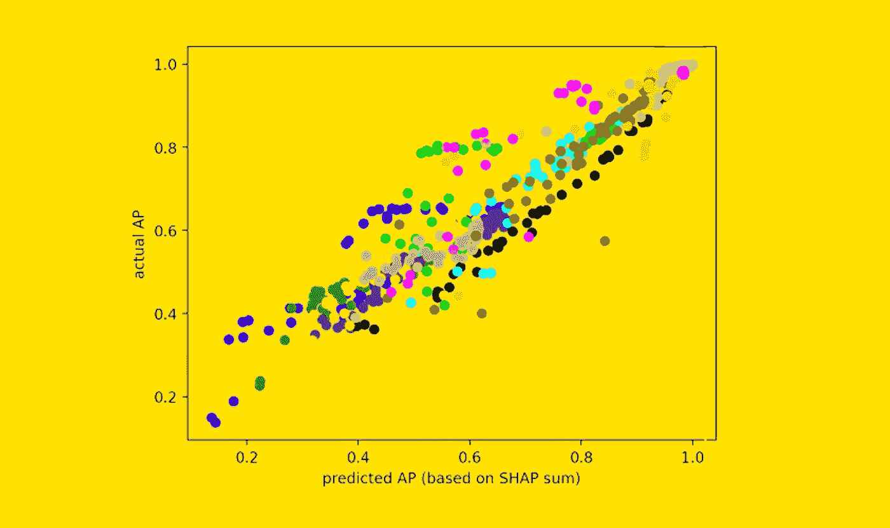

[作者提供的图片]

在开发机器学习模型时，我们通常从一大堆特征开始，这些特征是我们特征工程工作结果。

**特征选择是选择对我们的机器学习模型最优的小子集特征的过程**。

为什么这样做而不是保持所有特征？

+   **内存**。大数据占用大空间。丢弃特征意味着你需要更少的内存来处理数据。有时也会有外部约束。

+   **时间**。在较少的数据上重新训练模型可以节省大量时间。

+   **准确性**。少即是多：这对于机器学习也是如此。包含冗余或无关的特征意味着包含不必要的噪音。经常发生的情况是，使用较少数据训练的模型表现更好。

+   **可解释性**。较小的模型更容易解释。

+   **调试**。较小的模型更容易维护和排查故障。

现在，特征选择的主要问题是**非常慢，因为它需要训练许多模型**。

在这篇文章中，我们将看到一个技巧，它通过“近似预测”使特征选择极其快速。

# 一个非常困难的问题

让我们尝试可视化特征选择的问题。我们从*N*个特征开始，其中*N*通常是数百或数千个。

因此，特征选择的输出可以看作是一个长度为*N*的由“是”/“否”组成的数组，其中数组的每个元素告诉我们相应的特征是否被选择。

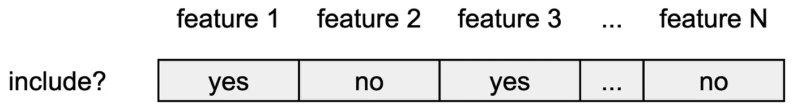

特征选择的输出。[作者提供的图片]

特征选择的过程包括尝试不同的“候选”，最后选择最佳的一个（根据我们的性能指标）。

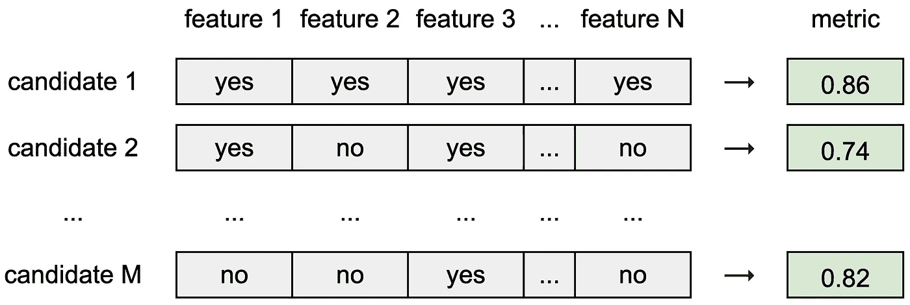

每个候选都是一组不同的特征。 [作者提供的图像]

由于我们有*N*个特征，且每个特征可以被选择或不被选择，这意味着**我们有 2^*N* 个可能的候选**。

这个数字很快会变得巨大。例如，仅有 50 个特征，并假设评估一个候选平均需要 1 秒，那么尝试所有可能的候选将需要 3500 万年！

因此，应该清楚为什么在大多数实际情况下，评估的候选数量只是所有可能候选的一个微小部分。

# 候选方案提议与评估。

存在许多特征选择方法，但所有这些方法都可以被框架为由两个步骤组成的迭代过程：

1.  提议一个新的候选。

1.  评估候选。

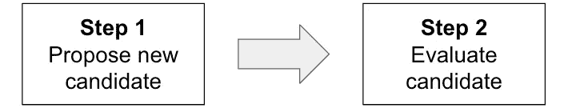

一个非常通用的特征选择框架。 [作者提供的图像]

通常，所有注意力都集中在第一步。第一步的目的是基于我们目前的学习，找到可能表现良好的候选。

然而，在本文中，我们将完全忽略第 1 步，专注于第 2 步：候选评估。为此，**我们将完全随机地提出新的候选**。特别是，我们将使用以下函数来提出新的候选：

```py
def get_random_candidate(features):
   """Get a random set of features."""

  candidate_size = np.random.randint(1, len(features)+1)
  candidate = np.random.choice(features, replace=False, size=candidate_size)

  return candidate
```

关于第 2 步，我们将基于不同类型的预测比较两种评估策略：

+   精确预测。

+   近似预测。

如果你现在对这些术语不熟悉也不用担心，接下来的段落会让事情变得更清晰。

# 基于“精确预测”的特征选择。

给定一个新的候选，你到目前为止看到的所有特征选择方法可能都遵循这种结构：

1.  在由训练观察和候选特征组成的数据框上训练模型。

1.  使用模型对验证集进行预测。

1.  在验证集上计算性能指标。

从图形上来看，这相当于：

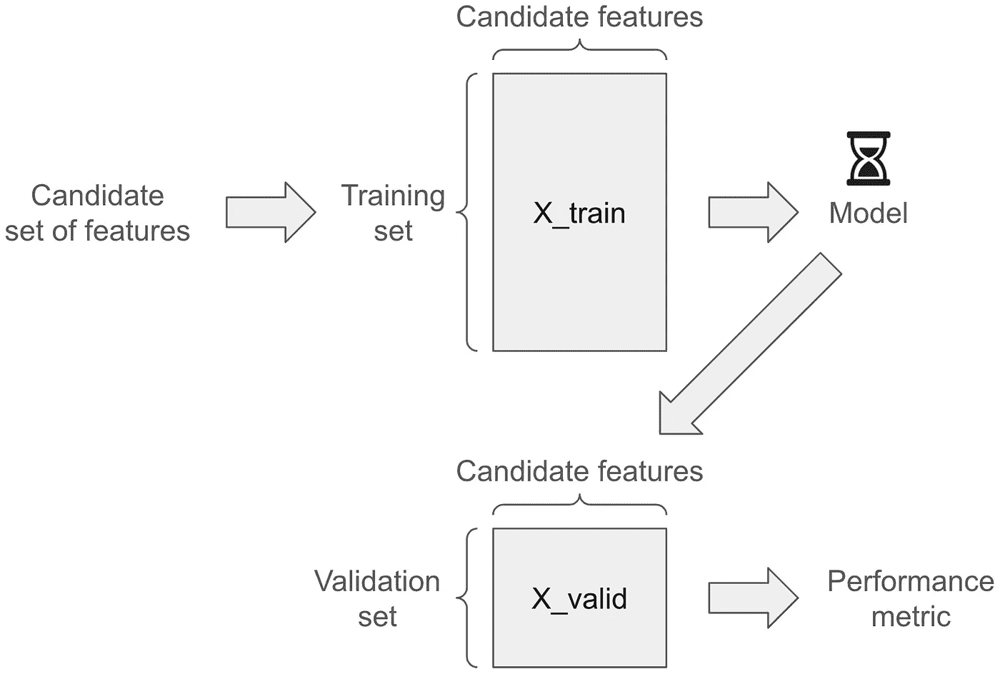

基于精确预测的特征选择。 [作者提供的图像]

这种方法基于**“精确预测”，因为我们获得的是仅在候选特征上训练的模型所做的实际预测**。

这个过程，用 Python 表示，大致如下：

```py
for iteration in n_iterations:
  # Step 1: Propose a candidate (i.e. a list of features).
  candidate = get_random_candidate(X_train.columns)

  # Step 2: Train a model on those features
  model = model.fit(X_train.loc[:, candidate], y_train)

  # Step 3: Get the predictions made by the model on the validation set.
  preds_valid = model.predict_proba(X_valid.loc[:, candidate])

  # Step 3: Compute the performance metric on the validation set.
  ap_valid = average_precision_score(y_valid, preds_valid)
```

正如你所见，每次迭代都会训练一个新的模型，使得这个过程非常缓慢。

那么，有没有办法在不必在每次迭代时训练新模型的情况下利用我们对特征的了解呢？

这就是“近似预测”发挥作用的地方。

# 近似预测的直觉。

为了帮助我们理解“近似预测”，我们使用[Pycaret](https://github.com/pycaret/pycaret)（一个遵循[MIT 许可](https://github.com/pycaret/pycaret/blob/master/LICENSE)的 Python 库）中的示例数据集。数据集名为“Concrete”，任务是根据一些特征预测混凝土的强度。

我们从将观察数据分成训练集和验证集开始。

```py
from pycaret.datasets import get_data
from sklearn.model_selection import train_test_split

df = get_data("concrete", verbose=False)
X, y = df.drop("strength", axis=1), df["strength"]
X_train, X_valid, y_train , y_valid = train_test_split(X, y)
```

我们可以在训练数据集上训练一个模型（我将使用 LightGBM，但任何模型都可以）：

```py
from lightgbm import LGBMRegressor

model = LGBMRegressor(verbose=-1).fit(X_train, y_train)
```

由于我们已经有了训练好的模型，我们可以计算 SHAP 值（如果你对这个主题不熟悉，可以阅读我的 SHAP 值介绍）：

```py
from shap import TreeExplainer

shap_explainer = TreeExplainer(model)
shap_expected_value = shap_explainer.expected_value
shap_valid = shap_explainer.shap_values(X_valid)
```

我们可以轻松显示 SHAP 值：

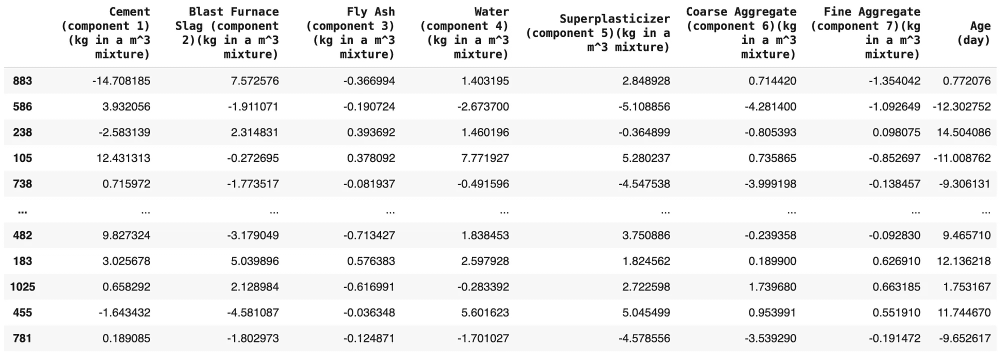

混凝土数据集验证集的 SHAP 值。[图片来自作者]

每个 SHAP 值代表了某个特征对该观察的最终预测的贡献。例如，如果我们取第一行的第一个特征（-14.708），这意味着该特征将最终预测值降低了-14.708。

**SHAP 值最重要的特性是它们是加性的**。这意味着如果我们对第一行的 SHAP 值（-14.708185 +7.572576 -0.366994 +…）进行求和，我们可以准确得到模型对该行的预测。

这对所有行都适用。不相信我？你可以用下面的代码自己检查：

```py
import numpy as np

pred_valid = model.predict(X_valid)
pred_valid_proxy = shap_expected_value + shap_valid.sum(axis=1)

assert (np.abs(approx_pred_valid - pred_valid) < 1e-10).all()
```

这证明了通过求和任何个体的 SHAP 值，我们可以准确得到该个体的模型预测（实际上在第十位小数处有一个小的四舍五入差异，但可以忽略）。

**我们可以利用 SHAP 值的加性属性来模拟训练于特定特征子集的模型所产生的预测**。

假设我们想回答以下问题：“如果模型只使用特征*Fly Ash*、*Water*和*Age*，它会做出什么预测？”

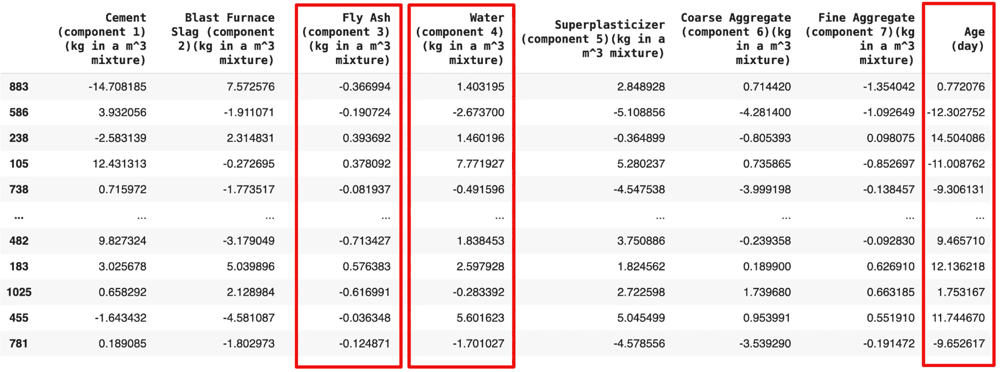

从 SHAP 值中选择特征子集。[图片来自作者]

SHAP 值允许我们回答这个问题。实际上，由于它们是加性的，并且考虑了特征间的交互，**只需对那些特征的 SHAP 值进行求和，我们就能估计出一个仅在这些特征上训练的模型所做的预测**。

```py
candidate_features = [...]

approx_pred_valid = shap_expected_value + shap_valid[candidate_features].sum(axis=1)
```

当然，这只是一个近似！如果我们想要准确的预测，我们需要训练一个仅专注于候选特征的新模型。这就是为什么我称**这种方式获得的预测为“近似预测”**。

但是，近似预测对特征选择有什么用呢？

# 基于“近似预测”的特征选择

**近似预测允许我们模拟任何可能的特征候选，而不必训练一个新模型**。我们只需要训练所有特征的模型的 SHAP 值。

你能看到这为什么是一个改变游戏规则的因素吗？**使用精确预测时，我们需要在每次迭代时训练一个新模型。相反，为了获得近似预测，我们只需对数据框的某些列进行求和！** 这使得过程快得多。

从图形上看，这就是近似预测发生的情况：

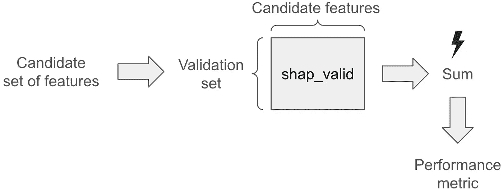

基于近似预测的特征选择。[作者提供的图片]

在 Python 中的翻译：

```py
# Step 0: Train a model on the dataset with all the features and compute the
# SHAP values on the validation set.
shap_valid = model.fit(X_train, y_train).get_shap_values(X_valid)

for iteration in n_iterations:
  # Step 1: Propose a candidate (i.e. a list of features).
  candidate = get_random_candidate(X_train.columns)

  # Step 2: Get the predictions on the validation set 
  # (by summing the SHAP values of the respective features).
  pred_valid = shap_valid.loc[:, candidate].sum(axis=1)

  # Step 3: Compute the performance metric on the validation set.
  ap_valid = average_precision_score(y_valid, pred_valid) 
```

如你所见，在这种情况下，一开始只训练了一个模型。然后，在每次迭代中，我们只是执行简单的列求和，这显然比训练一个全新的模型要快得多。

这看起来很惊人，但我们必须记住，求和一些特征的 SHAP 值就像是获得一个*代理*，这个代理接近于如果我们只用这些特征训练模型时的实际预测。

所以，就像任何近似一样，问题变成了：**这个近似对我们的目的足够好吗？**

# 代理是否足够好？

为了回答这个问题，让我们从[Pycaret](https://github.com/pycaret/pycaret)（一个[MIT 许可证](https://github.com/pycaret/pycaret/blob/master/LICENSE)下的 Python 库）中获取一个示例数据集。

数据集称为“心脏”，包含 15 个特征：

+   AGE_50

+   MD_50

+   SBP_50

+   DBP_50

+   HT_50

+   WT_50

+   CHOL_50

+   SES

+   CL_STATUS

+   MD_62

+   SBP_62

+   DBP_62

+   CHOL_62

+   WT_62

+   IHD_DX

使用这些特征，我随机生成了 50 个不同的候选（即 50 组不同的特征）。作为性能指标，我使用了平均精度。对于每个候选，我尝试了精确预测和近似预测方法，并且对于这两种方法，我计算了：

+   实际 AP：这是使用精确预测计算的平均精度。

+   预测的 AP：这是使用近似预测计算的平均精度。

如果预测的 AP 与实际的 AP 非常相似，我们可以说代理是好的。

让我们可视化 50 个候选的预测 AP 和实际 AP。

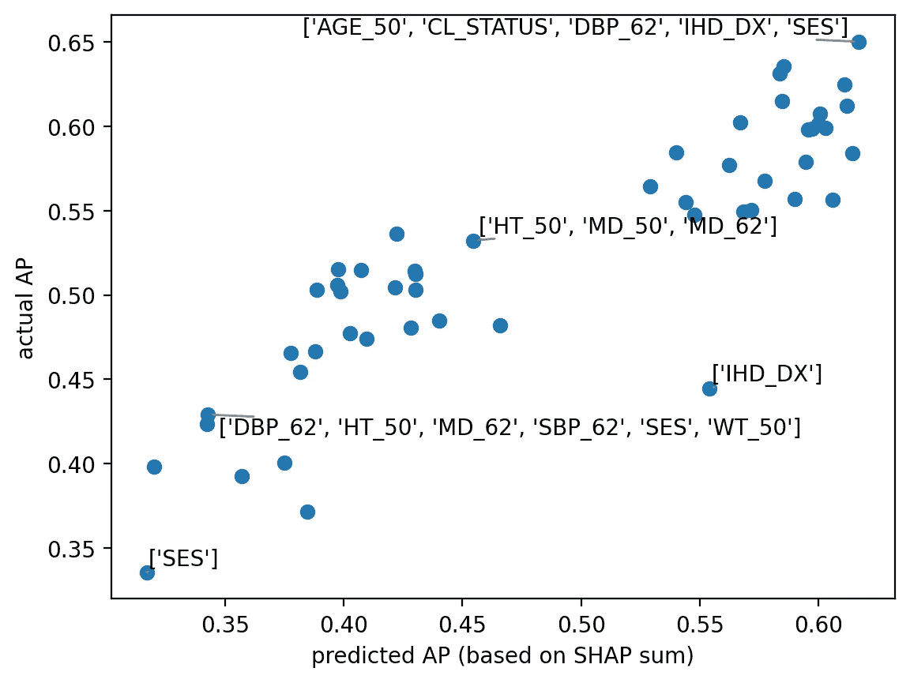

心脏数据集。每个点表示一组候选特征。[作者提供的图片]

作为例子，我添加了一些标签，显示了该候选特征中包含的特征。

出于好奇，我们还来可视化每个候选特征包含的特征数量。

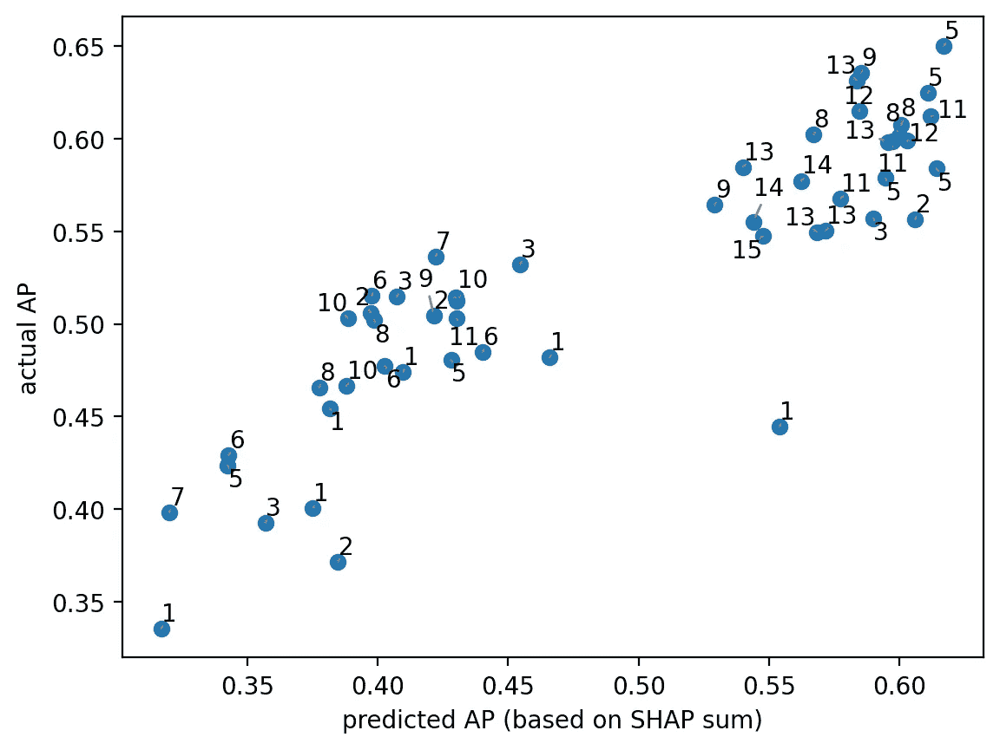

心脏数据集。每个点表示一组候选特征。标签表示该候选特征的数量。[作者提供的图片]

预测的 AP 与实际的 AP 似乎非常相关，这是好消息！

让我们来测量一下。我将使用斯皮尔曼相关系数而不是皮尔逊相关系数，因为在这种情况下，我们更关注候选的相对顺序，而不是它们的线性关系。

在这种情况下，相关性为 89%，非常高。这对我们来说是好消息，因为这意味着**如果我们使用近似预测选择最佳候选特征，这个候选特征也很可能是准确预测中的最佳（或最佳之一）候选特征。**

我们也可以对 Pycaret 中的一些其他数据集重复相同的程序。对于每个数据集，我随机抽取 50 个特征集候选项，并测量预测 AP 和实际 AP。

这些是结果：

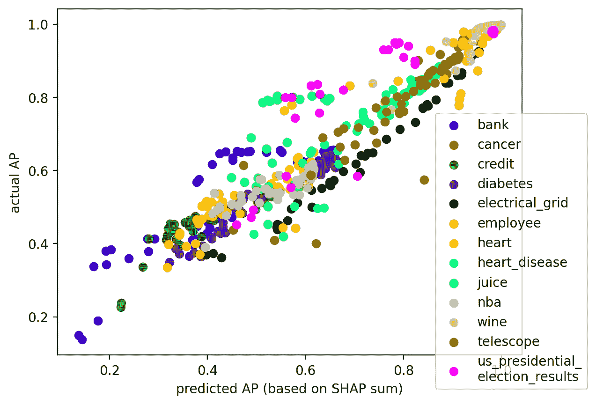

13 个数据集，每个数据集 50 个候选特征。每个点代表一个候选特征。[作者提供的图片]

一看之下，似乎所有数据集都有很强的相关性。这再次证实了我们的直觉。

但让我们更严谨地进行计算，分别计算每个数据集的预测 AP 与实际 AP 之间的斯皮尔曼相关性：

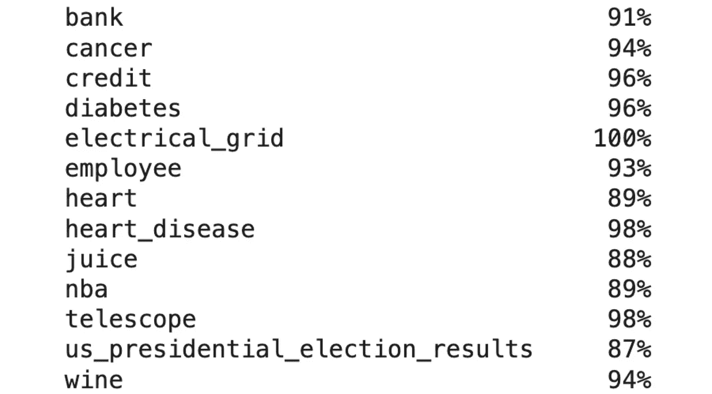

数据集之间预测 AP 和实际 AP 的相关性。[作者提供的图片]

这些数字证实了我们之前的印象：相关系数始终很高，介于 87%和 100%之间。

因此，我们可以得出结论：**近似预测实际上是准确预测的良好代理，** 我们可以利用它们使特征选择变得更快，同时保持可靠性。

# 结论

任何特征选择方法至少包括两个步骤：提出一组新的候选特征和评估这些候选特征。

在这篇文章中，我们专注于第二步（评估），展示了如何利用 SHAP 值来获得“近似预测”。这种方法允许我们获得“准确预测”的估计值，即如果我们训练一个专注于每组特征的不同模型，我们将会得到的预测结果。

好处在于近似预测通过简单的加法获得，从而使评估步骤大大加快，并允许评估更多候选特征。

我们还展示了近似预测足够可靠，因为我们使用这种方法获得的性能指标与我们使用准确预测所获得的性能指标高度相关。

*你可以通过* [*这个笔记本*](https://github.com/smazzanti/tds_approximate_predictions_for_feature_selection/blob/main/tds_approximate_predictions_for_feature_selection.ipynb)*复制本文中使用的所有代码。*

*感谢你的阅读！*

*如果你觉得我的工作有用，你可以订阅* [***每次我发布新文章时接收电子邮件***](https://medium.com/@mazzanti.sam/subscribe) *(通常每月一次)。*

*想要支持我的工作？你可以* [***请我喝一杯卡布奇诺***](https://ko-fi.com/samuelemazzanti)*。*

*如果你愿意，* [***加我 Linkedin***](https://www.linkedin.com/in/samuelemazzanti/)*！*
