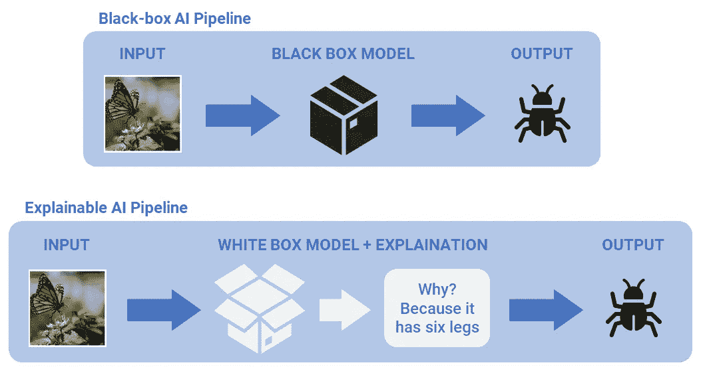
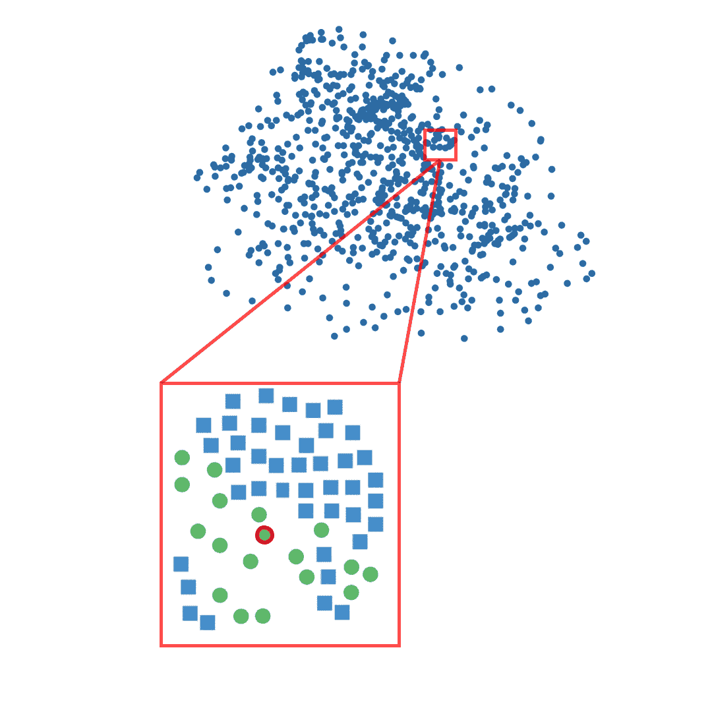
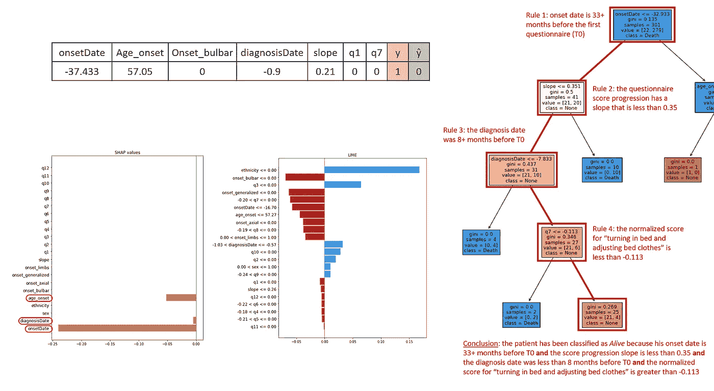

# Araucana XAI：利用决策树在医疗保健中的局部解释性

> 原文：[`towardsdatascience.com/araucana-xai-why-did-ai-get-this-one-wrong-8ee79dabdb1a`](https://towardsdatascience.com/araucana-xai-why-did-ai-get-this-one-wrong-8ee79dabdb1a)

## 引入一种基于 CART 的模型无关、后期 XAI 方法，以提供局部解释，提升医疗保健中 AI 辅助决策的透明度

 [Tommaso Buonocore](https://medium.com/@detsutut?source=post_page-----8ee79dabdb1a--------------------------------)

·发表于 [Towards Data Science](https://towardsdatascience.com/?source=post_page-----8ee79dabdb1a--------------------------------) ·阅读时间 7 分钟·2023 年 7 月 14 日

--

“Araucana”一词来源于智利的猴面包树松，但也是一种美丽的家禽鸡的名字。© [MelaniMarfeld](https://pixabay.com/photos/araucana-hen-chicken-poultry-4097906/) 来源于 Pixabay

# 为什么 AI 会在这一点上出错？

在人工智能领域，对复杂 AI 系统缺乏透明度和可理解性的担忧日益增加。近期研究致力于通过开发解释性模型来解决这个问题，这些模型揭示了像提升、集成和深度学习技术等不透明系统的内部工作原理。

## 局部和全球解释性

解释性模型可以以两种不同的方式揭示 AI 系统的行为：

+   **全球解释性**。全球解释器提供对 AI 分类器整体行为的*全面理解*。他们旨在揭示在各种输入和场景中保持一致的宏观模式、趋势、偏差和其他特征。

+   **局部解释性**。另一方面，局部解释器专注于提供对 AI 系统在*单个实例*中的决策过程的*见解*。通过突出对模型预测有重大影响的特征或输入，局部解释器提供了对特定决策如何得出的一个 glimpse。然而，需要注意的是，这些解释可能不适用于其他实例，也不能全面理解模型的整体行为。

对**可信且透明的 AI 系统**的需求不断增加，这不仅受到以准确性著称但解释性有限的复杂**黑箱模型**广泛采用的推动，也受到遵守**新法规**的需求的激励，这些法规旨在保护个人免受数据及数据驱动应用滥用的影响，如人工智能法案、通用数据保护条例（GDPR）或美国国防部的人工智能伦理原则。

通过深入了解 AI 系统的内部工作机制并提供输出解释，研究人员努力揭开黑箱的神秘面纱，促进对重新塑造我们世界的技术的更大理解和信任。

黑箱模型与白箱可解释模型。在第一个流程中，蝴蝶被正确分类为昆虫，但模型没有提供其预测的解释。在第二个流程中，模型的内部机制是透明的，我们可以解释为什么蝴蝶被分类为昆虫。对于本质上不透明的模型，一种常见策略是通过训练来模仿黑箱模型的代理白箱模型提供解释。在我们的例子中，这可以表述为：“一个可解释的模型，表现得与黑箱模型完全一致，认为蝴蝶是昆虫，因为它有六条腿。”

## 模型不可知、事后、局部解释器

在这篇博客文章中，我们将主要关注局部可解释性，特别是**模型不可知**、**事后**、**局部**解释器。模型不可知解释器可以应用于任何机器学习模型，无论其底层算法或架构如何。术语“事后”指的是解释在模型对特定实例做出预测后生成的。简而言之，具有这些属性的解释器可以分析任何模型在特定实例上的决策过程，突出对预测影响最大的特征或输入，而无需修改或重新训练模型。

在撰写时，SHAP [1] 和 LIME [2] 可以说是解释机器学习模型预测的两种最广泛采用的模型不可知技术。

+   **SHAP**（SHapley Additive exPlanations）基于博弈论和 Shapley 值的概念。它通过为每个预测中的特征分配重要性分数来提供解释，考虑所有可能的特征组合及其对预测的贡献。SHAP 值捕捉了特征在所有可能特征组合中的平均边际贡献，从而提供更准确和一致的解释。

+   **LIME**（局部可解释模型无关解释）通过在实例的局部邻域创建一个更简单的可解释模型，如线性模型，来近似基础模型在感兴趣预测周围的行为。LIME 通过基于每个特征对局部模型输出的影响来加权特征的重要性，从而解释模型的预测。

SHAP 和 LIME 都有各自的优点和局限性，但两者共有的一个主要局限性是它们通过**特征重要性**和特征排名来提供解释。特征的重要性只是可解释 AI 这一更广泛和复杂概念的一个方面。例如，在临床领域，处理 AI 驱动工具的医生常常抱怨无法检查和导航模型得出特定决策的推理过程，就像他们处理医疗指南一样。

# AraucanaXAI

AraucanaXAI [3] 诞生于解决临床医生对传统 XAI 方法的投诉，但也可以扩展到任何其他需要决策规则的场景。AraucanaXAI 框架提出了一种新颖的方法论，用于生成通用 ML 模型对单个实例的预测解释，使用**决策树**提供**决策过程形式的解释**。所提出的 XAI 方法的优点包括对原始模型的改进忠实度、处理非线性决策边界的能力，以及对分类和回归问题的原生支持。

至于 SHAP 和 LIME，AraucanaXAI 同样可以作为一个[Python 包](https://pypi.org/project/araucanaxai/)轻松通过 PyPI 安装。

[## GitHub - detsutut/AraucanaXAI: 基于树的机器学习模型预测的局部解释](https://github.com/detsutut/AraucanaXAI?source=post_page-----8ee79dabdb1a--------------------------------)

### 日益复杂的学习方法，如提升（boosting）、集成（bagging）和深度学习，已经使 ML 模型更加准确……

[github.com](https://github.com/detsutut/AraucanaXAI?source=post_page-----8ee79dabdb1a--------------------------------)

## 它是如何工作的？

算法相对简单。给定单个实例 *x:*

1.  计算 *D* = dist(*x*,*z*) 对于训练集的每个元素 *z*。默认的距离度量是 Gower 距离，兼容混合类型变量。

1.  定义子集 *T_n* 为最接近 *x* 的 *N* 个元素（即 *x* 的邻域）。

1.  使用 SMOTE 过采样（可选）来扩展邻域 *T_n*。这使得我们要检查的局部区域更加密集和平衡。

1.  用黑箱分类器的预测函数*f*预测的类别*y_hat*重新标记*T_n*（或*T_n* ∪ *S*，即通过过采样生成的样本）的样本。将解释集*E*定义为*T_n* ∪ *S* ∪ *x*。请记住，代理模型的目标不是最大化预测性能，而是具有与原始模型相同的预测行为。这就是我们关注*y_hat*而非*y*的原因。

1.  在*E*上训练决策树*e*。可选地，进行剪枝。

1.  从根节点到对应于*x*的叶节点导航*e*以获取规则集。

AraucanaXAI 算法的逐步可视化。（注：重新标记步骤未显示）

## 用例示例：ALS 死亡率预测

现在我们对这种新的 XAI 方法了解更多了，我们什么时候使用它？正如本文开头所述，**AraucanaXAI 旨在满足临床医生的需求**，以可导航的树或一组与指南和既定医学知识易于比较的层次化规则的形式提供解释。

AraucanaXAI 最近被用来提升复杂预测模型，这些模型旨在基于 6 个月的观察预测**肌萎缩侧索硬化症**（ALS）患者的死亡率。预测 ALS 进展是一个具有挑战性的问题，需要复杂的模型和许多特征，包括通过问卷来分层 ALS 的严重程度。AraucanaXAI 可以帮助临床医生将模型的推理分解为更简单但真实的规则，通常是为了更好地理解模型为何与他们的观点不一致。

例如，在下面的例子中，实际情况表明 ALS 患者将在六个月内死亡，而神经网络则预测相反。AraucanaXAI 突出的规则集可以帮助理解模型的观点：发病日期发生在第一次 ALSFRS-R 问卷提交（T0）前 3 年，进展斜率小于 0.35（即，根据问卷，患者恶化缓慢），诊断日期在 T0 之前超过 8 个月，“翻身和调整床单” 的归一化评分较低。总体而言，这一临床图景并没有那么糟糕，这使得模型认为患者在六个月后仍然会活着。

针对特定 ALS 患者的死亡预测解释，由 SHAP（左）、LIME（中）、和 AraucanaXAI（右）提供

## 结论与未来工作

尽管同样的策略可以推广到其他领域，但 AraucanaXAI 已经被证明是**在医疗保健中针对个体患者的 XAI 的有前途的方法**，其中将解释分解为层次化规则为决策者提供了额外的价值。

-   然而，仍然存在一些未解决的局限性。首先，医疗领域产生了越来越多的非结构化数据，但 AraucanaXAI 目前仅处理表格数据。为了在临床实践中使用，AraucanaXAI 需要升级以处理文本和图像，这对医疗机构至关重要。其次，**什么构成对用户的“良好”解释目前没有明确的度量标准**（这是目前 XAI 文献中已知的空白）以及医生用户本身的直接参与，这需要在设计良好的评估研究中进行。此类研究构成了未来值得追求的工作，具有潜在的好处可以造福可解释的 AI 社区。最后，AraucanaXAI 展示生成的解释的方式依赖于 scikit-learn 的决策树可视化功能，该功能有限，需要改进。

-   如果你有兴趣帮助 AraucanaXAI，查看[G[itHub 仓库](https://github.com/bmi-labmedinfo/araucana-xai) 并**成为贡献者**！扩展/改进将得到适当的认可。

## 参考文献

[1] [S. M. Lundberg 和 S.-I. Lee — 统一模型预测解释方法](https://arxiv.org/abs/1705.07874)

[2] [M. T. Ribeiro, S. Singh 和 C. Guestrin — “我为什么要相信你？”：解释任何分类器的预测](https://arxiv.org/abs/1602.04938)

[3] [E. Parimbelli, T.M. Buonocore, G. Nicora, W. Michalowski, S. Wilk, R. Bellazzi — 为什么人工智能在这个问题上出错了？基于树的机器学习模型预测解释](https://www.sciencedirect.com/science/article/pii/S0933365722002238)

[4] [T.M. Buonocore, G. Nicora, A. Dagliati, E. Parimbelli— XAI 在 ALS 6 个月死亡率预测中的评估](https://www.researchgate.net/profile/Tommaso-Buonocore/publication/362761796_Evaluation_of_XAI_on_ALS_6-months_mortality_prediction/links/62fe1002eb7b135a0e422dfd/Evaluation-of-XAI-on-ALS-6-months-mortality-prediction.pdf)

*如果未另有说明，图片均为作者原创贡献。*

-   请在评论区留下你的想法，并分享如果你觉得这有帮助！如果你喜欢我的工作，你现在可以通过为我买杯咖啡来表示支持，[几小时的自主时间](https://www.buymeacoffee.com/detsutut) ☕

 [## Tommaso Buonocore — 博士生 — 大数据与生物医学信息学 — ICS Maugeri SpA Società…

### -   生物医学工程师和人工智能爱好者，目前正在研究自然语言处理解决方案，以改善基于医疗的预测任务…

www.linkedin.com](https://www.linkedin.com/in/tbuonocore?source=post_page-----8ee79dabdb1a--------------------------------)
