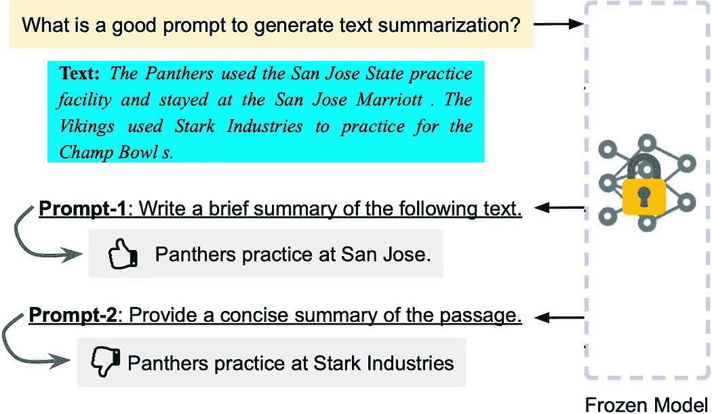

# 大型语言模型（LLMs）生成的提示是否可靠？

> 原文：[`towardsdatascience.com/are-prompt-generated-by-large-language-models-llms-reliable-4162fd10c845?source=collection_archive---------11-----------------------#2023-04-14`](https://towardsdatascience.com/are-prompt-generated-by-large-language-models-llms-reliable-4162fd10c845?source=collection_archive---------11-----------------------#2023-04-14)

## 释放大型语言模型的力量与自动生成的提示

 [Henry Lai](https://medium.com/@a0987284901?source=post_page-----4162fd10c845--------------------------------)

·

[关注](https://medium.com/m/signin?actionUrl=https%3A%2F%2Fmedium.com%2F_%2Fsubscribe%2Fuser%2Fd5548707b59&operation=register&redirect=https%3A%2F%2Ftowardsdatascience.com%2Fare-prompt-generated-by-large-language-models-llms-reliable-4162fd10c845&user=Henry+Lai&userId=d5548707b59&source=post_page-d5548707b59----4162fd10c845---------------------post_header-----------) 发表在 [Towards Data Science](https://towardsdatascience.com/?source=post_page-----4162fd10c845--------------------------------) · 6 min 阅读 · 2023 年 4 月 14 日 

--

图 1\. 两种不同 ChatGPT 生成提示的性能变异示例

大型语言模型（LLMs）的快速发展，包括[ChatGPT](https://openai.com/blog/chatgpt)和[GPT-4](https://cdn.openai.com/papers/gpt-4.pdf)，彻底改变了数据科学。过去，数据科学家通常会花费大量时间来准备数据、设计模型并对其进行微调以解决各种问题。而如今，随着 LLMs 的出现，我们可以以纯数据驱动的方式完成许多任务，而无需花费任何建模方面的努力（参见[数据驱动的 AI 框架](https://github.com/daochenzha/data-centric-AI)）。

推动这一进展的关键概念是提示（prompting），指的是使用特定的输入文本或问题来引导语言模型生成所需的输出。例如，在总结一篇长文章时，我们可以向 LLM 提供一个提示，例如“*用一句话总结上述内容*”，然后输入文章文本。这使得 LLM 能够生成文章的简洁总结，方便研究人员快速提取相关信息。提示的使用为数据科学开辟了新的机会，使科学家能够简化工作流程，提高生产力。

创建有效的提示仍然是一个重大挑战，因为即使是看似相似的提示也可能产生截然不同的输出。例如…
