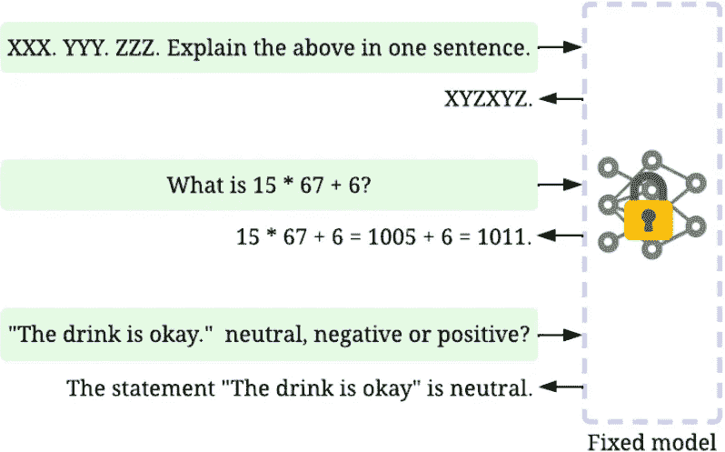
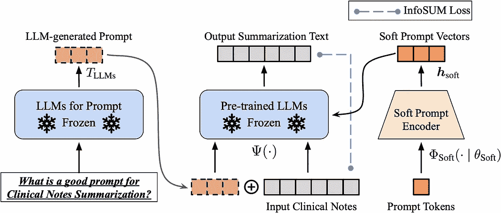
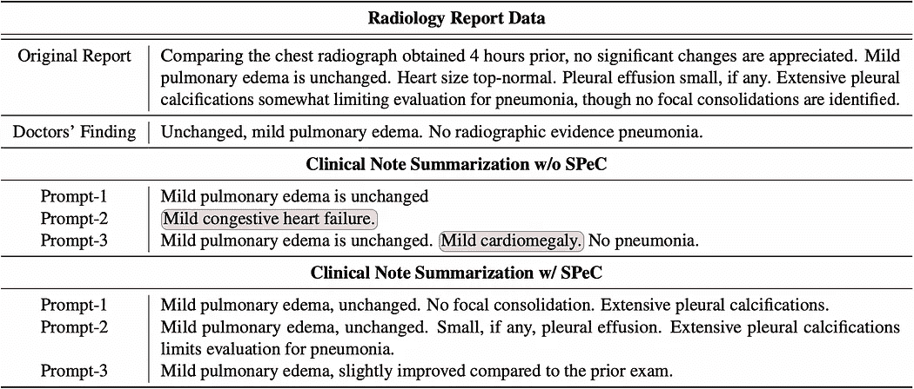

# 大型语言模型（LLMs）生成的提示可靠吗？

> 原文：[`towardsdatascience.com/are-prompt-generated-by-large-language-models-llms-reliable-4162fd10c845`](https://towardsdatascience.com/are-prompt-generated-by-large-language-models-llms-reliable-4162fd10c845)

## 释放大型语言模型（LLMs）与自动生成提示的力量

 [Henry Lai](https://medium.com/@a0987284901?source=post_page-----4162fd10c845--------------------------------)

·发布于 [Towards Data Science](https://towardsdatascience.com/?source=post_page-----4162fd10c845--------------------------------) ·6 分钟阅读·2023 年 4 月 14 日

--

图 1\. 两个不同的 ChatGPT 生成提示的性能变异示例

大型语言模型（LLMs）的快速发展，包括 [ChatGPT](https://openai.com/blog/chatgpt) 和 [GPT-4](https://cdn.openai.com/papers/gpt-4.pdf)，已经彻底改变了数据科学。过去，数据科学家通常需要花费大量时间来准备数据、设计模型并进行调整以解决各种问题。而现在，随着 LLMs 的出现，我们可以在纯数据驱动的方式下完成许多任务，而无需花费任何建模工作（参见 [数据驱动 AI 框架](https://github.com/daochenzha/data-centric-AI)）。

推进的一个关键理念是提示，它指的是使用特定的输入文本或问题来引导语言模型生成所需的输出。例如，在总结一篇长文章时，我们可以向 LLM 提供一个提示，比如“*用一句话总结以上内容*”，并输入文章文本。这使得 LLM 能够生成文章的简洁总结，帮助研究人员快速提取相关信息。提示的使用开辟了数据科学的新机会，使科学家能够简化工作流程，提高生产力。

创建有效的提示仍然是一个重大挑战，因为即使是看似相似的提示也可能产生截然不同的输出。例如，使用“*写一个简要总结*”或“*提供一个简洁的总结*”可能会导致大相径庭的总结，如图 1 所示。这种输出的变异可能使数据科学家难以确定使用哪个提示来实现预期的结果。

为了应对创建有效提示的挑战，自动提示可以是一个可行的解决方案，它利用 LLM 直接生成提示模板。例如，在总结临床笔记时，可以通过提问“*什么是总结临床笔记的有效提示？*”来请求 LLM 提供提示建议。模型随后可以生成各种针对特定任务的提示候选，从而可能加速有效提示创建的过程。

由 LLM 生成的提示通常在质量上具有不可预测性，导致输出结果表现出显著的变异性。这反过来又需要大量的手动工作来逐一检查每个候选提示。在本文中，我们将介绍一个名为 SPeC 的框架，以提高 LLM 生成的提示的有效性和可靠性。SPeC 利用软提示令牌来校准性能变异性，同时保留 LLM 生成提示带来的性能提升，从而实现明显更一致的输出。

## LLM 中的提示调整

图 2\. 提示调整。图像来自于[`arxiv.org/abs/2303.10158`](https://arxiv.org/pdf/2303.10158.pdf)的论文，经过原作者许可。

提示调整是继[数据驱动 AI](https://arxiv.org/abs/2303.10158)概念之后对数据科学的一次革命。除了收集更多的训练数据，提示调整是一种提高 LLM 性能的替代方法，无需进一步的微调。值得注意的是，有效的提示是提示调整成功的关键因素，因为特定的输入词语可以激发 LLM 所学到的相应信息，从而显著提高 LLM 在特定下游任务中的适应性和性能。数据科学家和研究人员可以从这一方法中受益匪浅，因为它使他们能够高效且有效地利用 LLM 在各种下游任务中。谷歌研究的首席主管[杰夫·迪恩](https://twitter.com/JeffDean)也提倡这一方法。

## 如何自动生成提示？

设计一个有效的提示从来不是一件简单的事，因为仍然需要大量领域特定的专业知识来提取某些关键词和句子以形成提示。强大的 LLM 的出现使用户可以通过利用自动生成的提示来提高他们在指定任务中的生产力。当用户向 LLM 输入问题时，它可以生成相应的提示模板。例如，数据科学家可以向 ChatGPT 询问有关文本摘要的好提示，然后利用得到的反馈来进行文本摘要。这种方法可以显著简化工作流程，为用户节省大量时间和精力。

## 自动生成的提示可靠吗？

然而，LLM 生成的提示质量可能高度不可预测，这反过来会导致 LLM 性能方差的显著增加。即使提示在语义上相似，它们也可能产生截然不同的输出。例如，如图 1 所示，从冻结的 LLM 生成的提示-2 和提示-1 虽然高度相似，但产生了完全不同的总结。这一问题在高风险领域尤其成问题，如金融和医疗行业，其中生成提示的方差可能会削弱研究人员和工程师对 LLM 结果的信任。因此，关键是找到控制 LLM 生成的提示质量的方法，以确保其输出的可靠性，特别是在这些领域。

## **我们可以信任生成提示的结果吗？**

实际上，答案是否定的。LLM 中经常出现的不确定性对需要信任这些模型生成结果的科学家来说是一个重大问题。如果 LLM 生成的提示也出现显著的不确定性，它可能会严重削弱科学家对结果的信心。因此，必须有一种机制来减少由这些自动生成的提示质量引起的输出方差，以确保 LLM 能够更可靠地工作。

## 基于软提示的 LLM 校准

图 3\. 基于软提示的校准（SPeC）框架概述。图像来源于论文 [`arxiv.org/abs/2303.10158`](https://medium.com/r?url=https%3A%2F%2Farxiv.org%2Fpdf%2F2303.13035v2.pdf) 经原作者许可。

[*完整论文链接*](https://arxiv.org/pdf/2303.13035v2.pdf)

受[*数据驱动的人工智能*](https://arxiv.org/abs/2303.10158)概念的启发，一个框架*基于软提示的校准（SPeC）*，如*图 3*所示，讨论了减少不同提示结果方差的技术。SpeC 框架利用软提示令牌来校准性能的变异，同时保持由 LLM 生成的提示带来的性能提升。软提示令牌可以是与输入文本语义相关的任何句子。例如，“放射科医师描述检查中的稳定异常”可以作为临床笔记总结的良好软提示令牌。通过这种方式，给定一个经过良好训练的软提示编码器，通过将软提示令牌与输入文本一起添加，我们将能够实现 LLM 的稳定推断结果。例如，医学医生可以通过使用相关的关键词或术语轻松提供适当的软提示令牌，以获得一致的期望结果。

## 临床笔记总结的实验分析

SPeC 框架在一个重要的医疗任务——医生的临床笔记总结中进行了评估。在这项工作中，LLM 生成的提示是通过向 ChatGPT 提问“什么是一个好的临床笔记总结提示？”来收集的。

SPeC 有效指导了那些已被冻结的预训练 LLMs，以在临床笔记总结中减少变异性。这确保了 LLMs 能够保持使用 ChatGPT 生成的提示所带来的性能改进，同时减少性能的变异性，以确保最终的临床总结更加准确，并忠实于原始数据。

SPeC 在保持冻结的预训练 LLMs 一致总结性能方面的有效性在其案例研究中得到了证明，该研究强调了如果不使用 SPeC 可能导致的错误结果（以红色标出）。研究结果显示在*图 4*中。

图 4\. Flan-T5 使用和不使用 SPeC 的性能变异性比较。

## SPeC 框架如何在日常工作流程中使用？

在[数据中心化人工智能](https://arxiv.org/abs/2303.10158)的时代，LLMs 具有通过提供快速和准确的分析以及使用提示调优技术来彻底改变数据科学的潜力，从而实现更高效和有效的工作流程。然而，关于 LLMs 输出的不确定性已引发了一些担忧，特别是在需要做出关键和紧急决策的情况下。重要的是要解决这些担忧，以确保 LLMs 可以有效地融入人工智能系统中。

SPeC 框架有效减轻了科学家在使用 LLMs 时提出的不确定性担忧，提高了他们对 LLMs 做出决策的信任度。例如，对于生物医学数据科学家来说，SPeC 框架在提供可靠和一致的医疗信息总结方面的成功，具有使医疗从业人员能够为优化患者护理做出明智决策的潜力。

# 资源

你可以通过以下论文了解更多关于 SPeC 如何在医疗保健行业提供帮助，并提高医疗专家对 LLMs 做出决策的信任度：

+   [1] [SPeC：基于软提示的校准以减轻临床笔记总结中的性能变异性](https://arxiv.org/abs/2303.13035)

+   [2] [数据中心化人工智能：综述](https://arxiv.org/abs/2303.10158)

+   [3] [优秀的数据中心化人工智能](https://github.com/daochenzha/data-centric-AI)

如果你对如何在不同的下游任务中应用 SPeC 感兴趣，可以在[Github 仓库](https://github.com/ynchuang/SPeC-A-Soft-Prompt-Based-Calibration)中找到更多说明。
