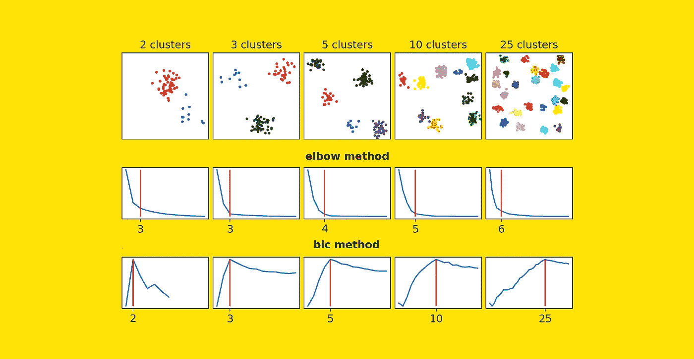
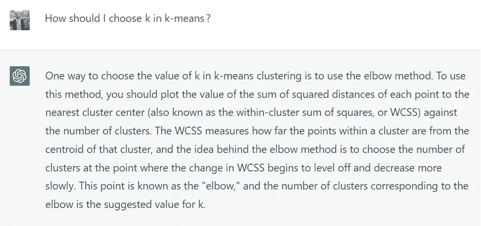

# 你还在使用肘部法则吗？

> 原文：[`towardsdatascience.com/are-you-still-using-the-elbow-method-5d271b3063bd?source=collection_archive---------1-----------------------#2023-02-03`](https://towardsdatascience.com/are-you-still-using-the-elbow-method-5d271b3063bd?source=collection_archive---------1-----------------------#2023-02-03)

## 肘部法则是找到*k*-均值聚类簇数的最流行方法。但还有更好的替代方案

 [萨穆埃尔·马赞提](https://medium.com/@mazzanti.sam?source=post_page-----5d271b3063bd--------------------------------)

·

[查看](https://medium.com/m/signin?actionUrl=https%3A%2F%2Fmedium.com%2F_%2Fsubscribe%2Fuser%2Fe16f3bb86e03&operation=register&redirect=https%3A%2F%2Ftowardsdatascience.com%2Fare-you-still-using-the-elbow-method-5d271b3063bd&user=Samuele+Mazzanti&userId=e16f3bb86e03&source=post_page-e16f3bb86e03----5d271b3063bd---------------------post_header-----------) 发表在 [Towards Data Science](https://towardsdatascience.com/?source=post_page-----5d271b3063bd--------------------------------) ·7 分钟阅读·2023 年 2 月 3 日

--

[作者提供的图片]

我问了 ChatGPT 如何选择适合的*k*-均值聚类的簇数。以下是回答：

[来自 ChatGPT 的截图: [`chat.openai.com/chat`](https://chat.openai.com/chat)]

ChatGPT 建议使用所谓的“肘部法则”，这是目前在许多线上和线下资源中引用最多的方法。

然而，**肘部法则的受欢迎程度实在难以解释**！事实上，正如我们在这篇文章中将看到的，这种方法几乎总是被不同的现有方法所超越。

如果你想知道如何轻松超越 Elbow 方法以决定数据集的最佳聚类数，请继续阅读。

# 测试肘部

Elbow 方法背后的逻辑如下。

由于我们想知道最佳的聚类数（*k*），我们尝试不同的 *k* 值，例如，数据集观察值数量的平方根之间的所有整数值。在每次迭代中，我们记录…
