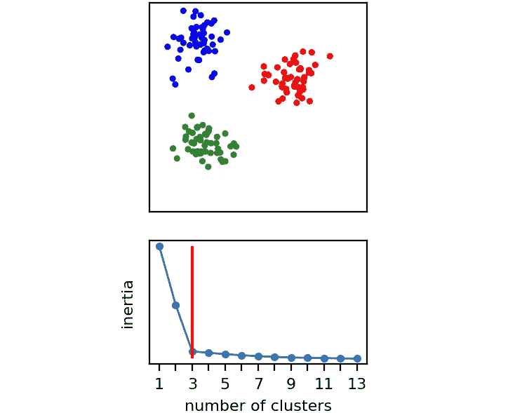
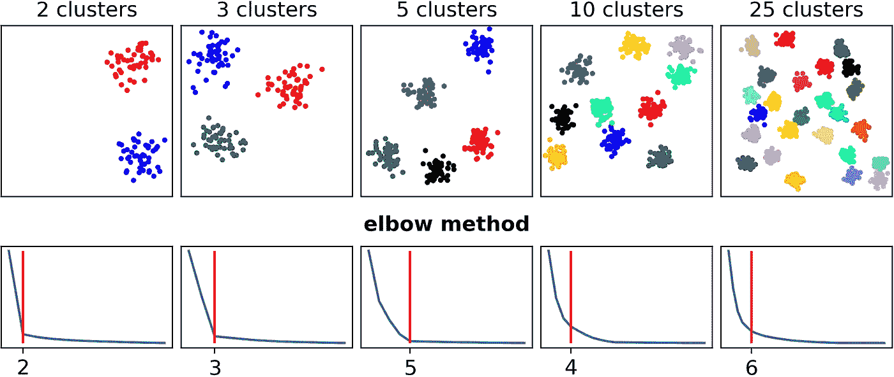
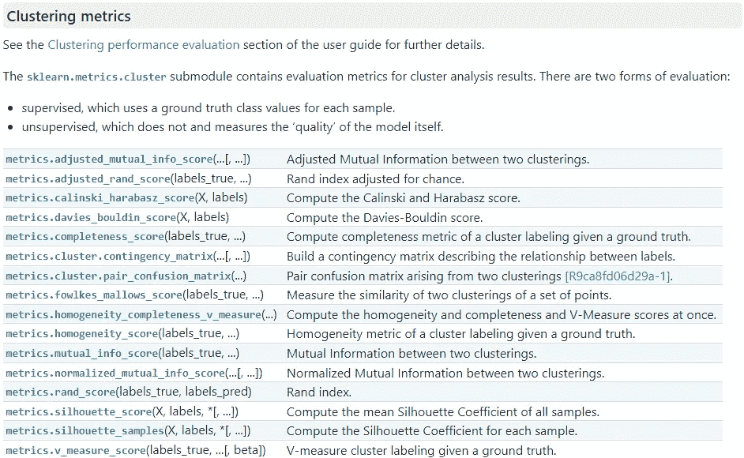
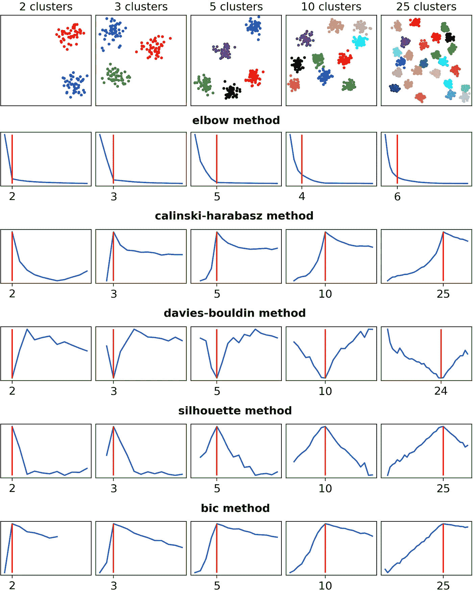
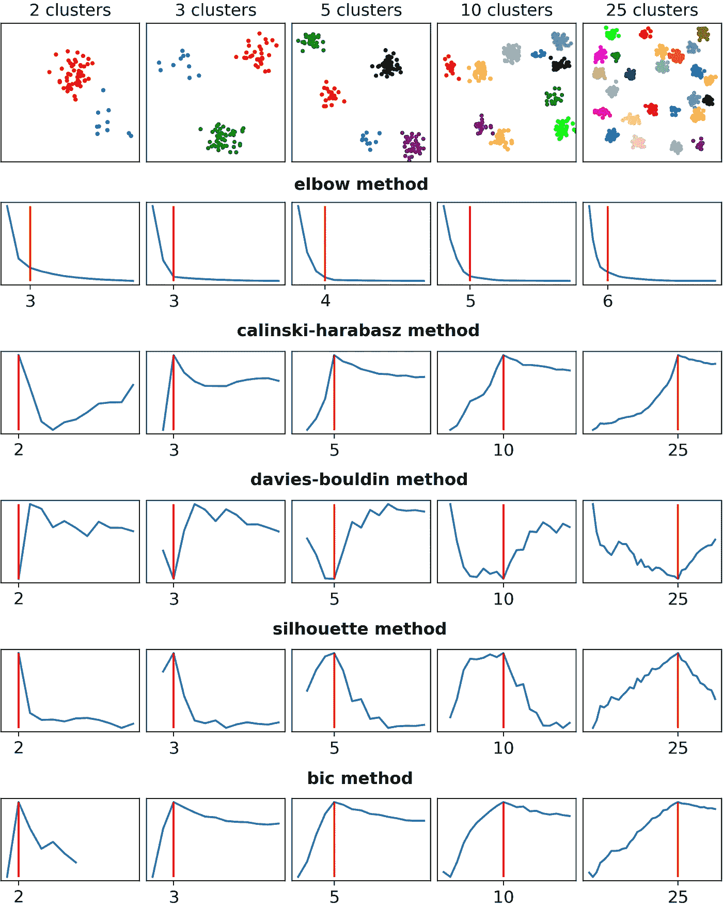
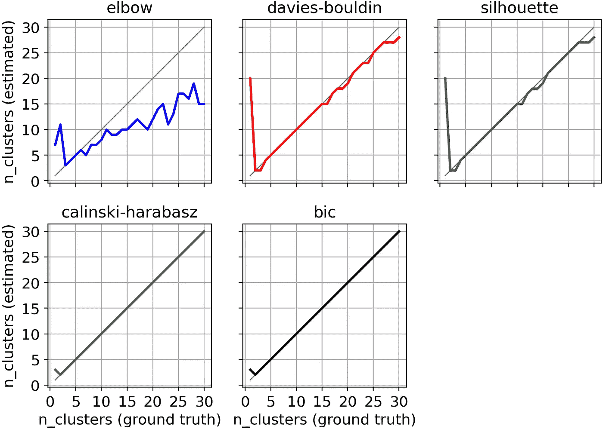
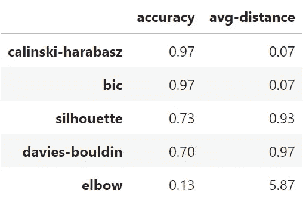

# 你还在使用 Elbow 方法吗？

> 原文：[`towardsdatascience.com/are-you-still-using-the-elbow-method-5d271b3063bd`](https://towardsdatascience.com/are-you-still-using-the-elbow-method-5d271b3063bd)

## Elbow 方法是确定 k-means 聚类数目最受欢迎的方式。但还有更好的替代方法。

[](https://medium.com/@mazzanti.sam?source=post_page-----5d271b3063bd--------------------------------)[](https://towardsdatascience.com/?source=post_page-----5d271b3063bd--------------------------------) [Samuele Mazzanti](https://medium.com/@mazzanti.sam?source=post_page-----5d271b3063bd--------------------------------)

·发布于[Towards Data Science](https://towardsdatascience.com/?source=post_page-----5d271b3063bd--------------------------------) ·7 分钟阅读·2023 年 2 月 3 日

--


[作者提供的图片]

我请 ChatGPT 建议如何选择*k*-means 的合适聚类数目。这是回答：


[来自 ChatGPT 的截图: [`chat.openai.com/chat`](https://chat.openai.com/chat)]

ChatGPT 建议使用所谓的“Elbow 方法”，这是迄今为止在许多在线和离线来源中被引用最多的方法。

然而，**Elbow 方法的流行程度实在难以解释**！事实上，正如我们将在本文中看到的，这种方法几乎总是被不同的现有方法超越。

如果你想知道如何轻松超越 Elbow 方法来确定数据集的最佳聚类数目，请继续阅读。

# 测试肘部

Elbow 方法背后的逻辑如下。

由于我们想知道最佳聚类数目（*k*），我们尝试不同的*k*值，例如，所有整数值从 1 到数据集观测值数量的平方根。在每次迭代中，我们记录所谓的“惯性”。

```py
inertia = []

for k in range(1, 14):
  inertia.append(KMeans(n_clusters=k).inertia_)
```

惯性是每个点与其所属聚类中心之间的平方距离之和。因此，可以预期惯性随着*k*的增加而减小。事实上，随着聚类数目的增加，每个聚类会更小，因此每个点离其聚类中心更近。最终，当*k*等于数据点的数量时，惯性必然为零。

其核心思想是* k*的最佳值是惯性曲线的最大曲率点。这个点是惯性值较低但额外复杂度（即更多的聚类）不值得的地方。这个点被称为**曲线的肘部**。

为了定位惯性曲线的肘部，我们可以使用一个名为`kneed`的 Python 库：

```py
from kneed import KneeLocator

k_elbow = KneeLocator(
  x=range(1, 14), 
  y=inertia, 
  curve="convex", 
  direction="decreasing").elbow
```

让我们看看一个由 3 个簇组成的二维数据集的例子：



在玩具数据集上的肘部法则。 [图片来源：作者]

在这种情况下，肘部法则猜对了正确的簇数：3。但它在其他数据集上也会有效吗？

让我们看看。



等大小的簇。 [图片来源：作者]

肘部法则在三个数据集（2、3 和 5）中猜对了正确的簇数，但在另外两个例子（10 和 25）中严重低估了簇数。

好的，肘部法则可能没有如我们所希望的那样有效。但是市场上有没有更好的方法？

# 超越肘部法则

肘部法则是基于惯性（inertia）的，它是一个聚类拟合优度的评分。但如果我们想使用不同的方法，我们就需要使用不同的评分。

让我们看看 Scikit-Learn 中直接可用的选项。



Scikit-Learn 中可用的聚类指标列表。 [来自 [Scikit-Learn 文档](https://scikit-learn.org/stable/modules/classes.html#module-sklearn.metrics) 的截图]

实际上，许多这些指标对我们不起作用，因为它们需要 `labels_true` 作为输入，而我们希望在没有真实标签的情况下测试这些方法。

因此，在这个列表中，我们只能使用那些以 `X` 和 `labels` 作为输入的指标。因此，只有“Calinski-Harabasz”、“Davies-Bouldin”和“Silhouette”对我们有效。

除此之外，我还将添加一个在 Scikit-Learn 中未实现的评分指标。这个评分是“BIC”（贝叶斯信息准则），我会包含它，因为[这篇论文](https://arxiv.org/abs/2212.12189)显示它表现得非常好。对于 BIC，我将使用 Bob Hancock 在[这个 GitHub 仓库](https://github.com/bobhancock/goxmeans/tree/a78e909e374c6f97ddd04a239658c7c5b7365e5c)中实现的版本。由于代码是用 GoLang 编写的，我已经将其翻译成了以下 Python 函数：

```py
def bic_score(X, labels):
  """
  BIC score for the goodness of fit of clusters.
  This Python function is directly translated from the GoLang code made by the author of the paper. 
  The original code is available here: https://github.com/bobhancock/goxmeans/blob/a78e909e374c6f97ddd04a239658c7c5b7365e5c/km.go#L778
  """

  n_points = len(labels)
  n_clusters = len(set(labels))
  n_dimensions = X.shape[1]

  n_parameters = (n_clusters - 1) + (n_dimensions * n_clusters) + 1

  loglikelihood = 0
  for label_name in set(labels):
    X_cluster = X[labels == label_name]
    n_points_cluster = len(X_cluster)
    centroid = np.mean(X_cluster, axis=0)
    variance = np.sum((X_cluster - centroid) ** 2) / (len(X_cluster) - 1)
    loglikelihood += \
      n_points_cluster * np.log(n_points_cluster) \
      - n_points_cluster * np.log(n_points) \
      - n_points_cluster * n_dimensions / 2 * np.log(2 * math.pi * variance) \
      - (n_points_cluster - 1) / 2

  bic = loglikelihood - (n_parameters / 2) * np.log(n_points)

  return bic
```

总结一下，我们现在有五个评分可以进行比较：

1.  **Inertia（肘部法则）**；

1.  **Calinski-Harabasz**；

1.  **Davies-Bouldin**；

1.  **Silhouette**；

1.  **BIC**。

流程是一样的：对于每个数据集，我们使用 *k* = 1、*k* = 2、*k* = 3 等来拟合 *k*-均值。对于每个 *k*，我们计算这五个评分。这意味着我们会得到五条曲线，每条曲线对应一个指标。

现在，我们如何决定最佳的 *k* 值？对于惯性（inertia），我们已经知道答案：它是位于“肘部”处的点。其他评分的使用更为简单，因为它们的行为要么是“越高越好”，要么是“越低越好”：

1.  **Inertia** → **肘部法则更好**；

1.  **Calinski-Harabasz** → **越高越好**；

1.  **Davies-Bouldin** → **越低越好**；

1.  **Silhouette** → **越高越好**；

1.  **BIC** → **越高越好**。

那么让我们看看这些评分在我们的五个数据集上的表现如何。



五个数据集及其各自的曲线。[作者提供的图片]

如我们所见，肘部法则正确猜测了三个数据集，但在剩下的两个数据集中完全失误。相反，**其他方法正确猜测了所有数据集**（除了 Davies-Bouldin 在第五个数据集上的结果，不过它非常接近真实值：24 而非 25）。

但也许这些数据集太简单了。实际上，所有数据集都是由大小相同的簇组成的。这种情况不太可能出现：**在大多数真实数据集中，我们期望簇的观测值数量是不同的**。

所以让我们看看不等大小的簇会发生什么。



不同大小簇的五个数据集。[作者提供的图片]

这一次，肘部法则与其他方法之间的差异比之前更为明显。事实上，尽管肘部法则只对一个簇做出了正确的选择，但其他四种方法都正确猜测了所有五个数据集。

这些例子很有趣，但它们仍然没有告诉我们哪种方法更优。为了回答这个问题，我们应该进行大规模的比较。

# 系统性比较

我构建了 30 个数据集，每个数据集有不同数量的簇，从 1 到 30。每个簇有不同数量的观测值。

对于每个数据集，我尝试了不同的*k*值，并记录了五个结果分数（Inertia、Calinski-Harabasz、Davies-Bouldin、Silhouette 和 BIC）。然后，根据我们上面看到的规则，我确定了每种方法推荐的*k*值。

为了决定哪种方法是赢家，我绘制了每个数据集的真实簇数量（*x*-轴）和每种方法建议的簇数量（*y*-轴）。显然，最佳方法是与对角线距离最近的。



真实簇的数量（x 轴）和每种方法估计的簇数量（y 轴）。[作者提供的图片]

从图中可以明显看出，**肘部法则是表现最差的**。Davies-Bouldin 和 Silhouette 大多数时候是正确的，或者至少非常接近真实值（除了当真实的*k*等于 1 时）。但**明显的赢家（并列）是 Calinski-Harabasz 和 BIC**。

我们还可以通过计算**方法正确猜测簇的真实数量的次数（准确性）以及它们平均偏离真实值的距离**来总结这些视觉见解：



准确性和与真实值的平均距离。[作者提供的图片]

Calinski-Harabasz 和 BIC 在 97%的情况下（30 个数据集中的 29 个）是正确的，这相当令人印象深刻。Silhouette 在 73%的时间（30 个数据集中的 22 个）是正确的，而 Davies-Bouldin 在 70%的情况下（30 个数据集中的 21 个）是正确的。肘部法则则远远落后，只有 13%（30 个数据集中的 4 个）。

# 结论

在这篇文章中，我们看到，尽管它很受欢迎，**肘部法则实际上是设置数据集聚类数量时最差的选择**。事实上，我们测试的所有四种替代方法都比肘部法则表现得好得多。特别是，Calinski-Harabasz 和 BIC 表现极为出色，在 30 个数据集中只有一个错误。

你可以在[这个笔记本](https://github.com/smazzanti/are_you_still_using_elbow_method/blob/main/are-you-still-using-elbow-method.ipynb)中找到本文使用的所有 Python 代码。

*感谢阅读！*

*如果你觉得我的工作有用，你可以订阅* [***每次发布新文章时获取邮件通知***](https://medium.com/@mazzanti.sam/subscribe) *(通常是每月一次)。*

*如果你想支持我的工作，你可以* [***请我喝杯咖啡***](https://ko-fi.com/samuelemazzanti)*。*

*如果你愿意，* [***在 Linkedin 上添加我***](https://www.linkedin.com/in/samuelemazzanti/)*！*
