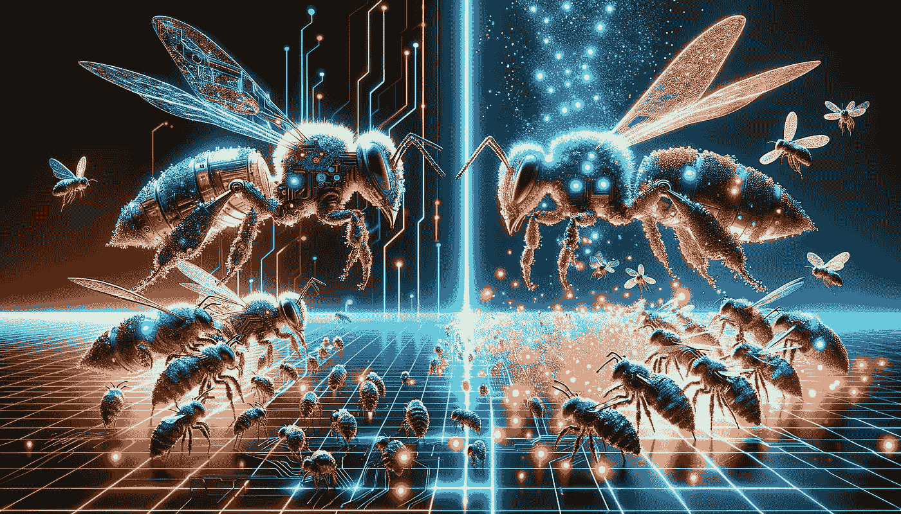

# 人工蜂群——它与 PSO 的区别

> 原文：[`towardsdatascience.com/artificial-bee-colony-how-it-differs-from-pso-9c6831bfb552?source=collection_archive---------4-----------------------#2023-12-18`](https://towardsdatascience.com/artificial-bee-colony-how-it-differs-from-pso-9c6831bfb552?source=collection_archive---------4-----------------------#2023-12-18)

## 直觉和 ABC 的代码实现，以及探索它在哪些方面优于粒子群优化

 [James Koh, PhD](https://medium.com/@byjameskoh?source=post_page-----9c6831bfb552--------------------------------)

·

[关注](https://medium.com/m/signin?actionUrl=https%3A%2F%2Fmedium.com%2F_%2Fsubscribe%2Fuser%2F780706b02d58&operation=register&redirect=https%3A%2F%2Ftowardsdatascience.com%2Fartificial-bee-colony-how-it-differs-from-pso-9c6831bfb552&user=James+Koh%2C+PhD&userId=780706b02d58&source=post_page-780706b02d58----9c6831bfb552---------------------post_header-----------) 发布于 [Towards Data Science](https://towardsdatascience.com/?source=post_page-----9c6831bfb552--------------------------------) ·10 分钟阅读·2023 年 12 月 18 日

--

图像由 DALL·E 3 根据提示“绘制一个以蜜蜂对战为主题的科幻风格图像”创建。

我在一篇近期文章中分享了粒子群优化（PSO）的直觉、实现和实用性，作为我系列自然启发算法的一部分。今天，我将解释人工蜂群（ABC）是如何工作的。

蜜蜂不是群体的一部分吗？这两种算法是否仅仅是同一枚硬币的两面？

在本文中，我将直接进入 ABC 的直觉部分。接下来，我将提供数学原理，然后是 Python 中的实现。最后，我将制定一个 PSO 无法解决但 ABC 可以轻松解决的问题，并解释使 ABC 能够做到这一点的方面。

# 直觉

类似于强化学习和进化算法的情况，ABC 的一个基本驱动因素是探索与利用之间的平衡。

对于那些刚接触群体智能算法的人来说，最初可能会对与生物学的关联感到畏惧，并认为需要一些复杂的数学建模来模拟自然中究竟发生了什么。由于变量在教材中通常用希腊字母表示，因此…
