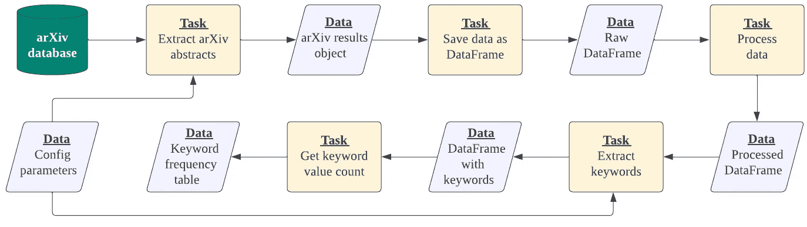

# arXiv 关键词提取与分析管道，使用 KeyBERT 和 Taipy

> 原文：[`towardsdatascience.com/arxiv-keyword-extraction-and-analysis-pipeline-with-keybert-and-taipy-2972e81d9fa4`](https://towardsdatascience.com/arxiv-keyword-extraction-and-analysis-pipeline-with-keybert-and-taipy-2972e81d9fa4)

## 构建一个包括前端用户界面和后端管道的关键词分析 Python 应用程序

[](https://kennethleungty.medium.com/?source=post_page-----2972e81d9fa4--------------------------------)[](https://towardsdatascience.com/?source=post_page-----2972e81d9fa4--------------------------------) [Kenneth Leung](https://kennethleungty.medium.com/?source=post_page-----2972e81d9fa4--------------------------------)

·发表于 [Towards Data Science](https://towardsdatascience.com/?source=post_page-----2972e81d9fa4--------------------------------) ·阅读时间 12 分钟·2023 年 4 月 18 日

--


由 [Marylou Fortier](https://unsplash.com/@rylouma?utm_source=unsplash&utm_medium=referral&utm_content=creditCopyText) 提供，来源于 [Unsplash](https://unsplash.com/photos/heNLI144X7Y?utm_source=unsplash&utm_medium=referral&utm_content=creditCopyText)

随着来自社交媒体、客户评论和在线平台的文本数据量呈指数级增长，我们必须能够理解这些非结构化数据。

关键词提取和分析是强大的自然语言处理（NLP）技术，帮助我们实现这一目标。

**关键词提取** 涉及自动识别和提取给定文本中最相关的词汇，而 **关键词分析** 则涉及分析这些关键词，以洞察潜在的模式。

在这份逐步指南中，我们将探讨如何利用强大的工具 **KeyBERT** 和 **Taipy** 构建一个关键词提取和分析管道及网页应用程序，应用于 arXiv 摘要。

## 目录

> ***(1)*** *背景****(2)*** *工具概述****(3)*** *逐步指南****(4)*** *总结*

这里是本文的 [GitHub 仓库](https://github.com/kennethleungty/Keyword-Analysis-with-KeyBERT-and-Taipy)。

# (1) 背景

由于人工智能（AI）和机器学习研究的迅速进展，每天跟踪大量发表的论文可能具有挑战性。

关于这类研究， [arXiv](https://arxiv.org/) 无疑是领先的信息来源之一。arXiv（发音为‘archive’）是一个开放获取的档案馆，收藏了大量涵盖计算机科学、数学等各学科的科学论文。


arXiv 截图 | 图像使用 [CC 2.0](https://ccnull.de/foto/arxivorg-logo-under-magnifying-glass/1014135) 许可证

arXiv 的一个关键特性是它为每篇上传到平台上的论文提供摘要。这些摘要是理想的数据源，因为它们简洁、富含技术词汇，并包含领域特定术语。

因此，我们将利用最新的 arXiv 摘要批次作为此项目中处理的文本数据。

目标是创建一个网络应用程序（包括前端界面和后端管道），用户可以根据特定输入值查看 arXiv 摘要的关键词和关键短语。


完成的应用程序用户界面截图 | 作者提供的图像

# (2) 工具概述

在这个项目中，我们将使用三种主要工具：

+   arXiv API Python 包装器

+   KeyBERT

+   Taipy

## (i) arXiv API Python 包装器

arXiv 网站提供了公共 API 访问，以最大化其开放性和互操作性。例如，为了在我们的 Python 工作流程中检索文本摘要，我们可以使用 [**arXiv API 的 Python 包装器**](https://github.com/lukasschwab/arxiv.py)。

arXiv API Python 包装器提供了一组函数，用于在数据库中搜索符合特定条件的论文，如作者、关键词、类别等。

它还允许用户检索有关每篇论文的详细元数据，如标题、摘要、作者和出版日期。

## (ii) KeyBERT

KeyBERT（源自“keyword”和“BERT”）是一个 Python 库，提供了一个易于使用的界面来使用 [BERT](https://en.wikipedia.org/wiki/BERT_(language_model)) 嵌入和余弦相似度，以提取文档中最能代表文档本身的词汇。


KeyBERT 工作原理的示意图 | 图像使用 [MIT 许可证](https://github.com/MaartenGr/KeyBERT/blob/master/LICENSE)

KeyBERT 的最大优势在于其灵活性。它允许用户轻松修改基础设置（例如参数、嵌入、分词）以实验和微调获得的关键词。

在这个项目中，我们将调整以下参数集：

+   返回的顶级关键词数

+   单词 n-gram 范围（即最小和最大 n-gram 长度）

+   多样化算法（最大总和距离 或 最大边际相关性），它决定了提取关键词的相似度定义方式。

+   候选数（如果设置了最大总和距离）

+   多样性值（如果设置了最大边际相关性）

两种多样化算法（最大和距离和最大边际相关性）共享相同的基本思想，即平衡两个目标：检索与查询高度相关的结果，并且内容多样以避免彼此之间的冗余。

## (iii) Taipy

[Taipy](https://www.taipy.io/) 是一个开源的 Python 应用程序构建工具，使开发人员和数据科学家能够迅速将数据和机器学习算法转换为完整的 web 应用。

尽管设计为低代码库，Taipy 还提供了高度的用户自定义。因此，它非常适合广泛的使用案例，从简单的仪表板到生产就绪的工业应用。


Taipy 组件 | 作者提供的图片

Taipy 有两个关键组件：Taipy GUI 和 Taipy Core。

+   **Taipy GUI**：一个简单的图形用户界面构建工具，使我们能够轻松创建交互式前端应用界面。

+   **Taipy Core**：一个现代的后端框架，能够高效地构建和执行管道和场景。

虽然我们可以独立使用 Taipy GUI 或 Taipy Core，但将两者结合使用可以高效地构建强大的应用程序。

# (3) 分步指南

如前面在上下文部分提到的，我们将构建一个 web 应用，提取和分析选定的 arXiv 摘要的关键词。

以下图示说明了数据和工具如何集成。


项目概述 | 作者提供的图片

让我们开始创建上述管道和 web 应用的步骤。

# 第 1 步 — 初始设置

我们首先使用下面显示的相应版本，通过 pip 安装必要的 Python 库：

+   [arvix](https://pypi.org/project/arxiv/) 1.4.3

+   [keybert](https://pypi.org/project/keybert/) 0.7.0

+   [pandas](https://pypi.org/project/pandas/) 1.5.3

+   [taipy](https://pypi.org/project/taipy/) 2.2.0

# 第 2 步 — 设置配置文件

由于将使用许多参数，将它们保存在单独的配置文件中是理想的。以下 YAML 文件 `config.yml` 包含初始的配置参数值。

配置文件设置好后，我们可以通过以下代码将这些参数值轻松导入到其他 Python 脚本中。

```py
with open('config.yml') as f:
    cfg = yaml.safe_load(f)
```

# 第 3 步 — 构建函数

在此步骤中，我们将创建一系列 Python 函数，这些函数构成管道的重要组件。我们创建一个新的 Python 文件 `functions.py` 来存储这些函数。

## (3.1) 检索和保存 arXiv 摘要和元数据

第一个要添加到 `functions.py` 的函数是用于通过 arXiv API Python 包从 arXiv 数据库中检索文本摘要的函数。

接下来，我们编写一个函数，将摘要文本和相应的元数据存储在 pandas DataFrame 中。

## (3.2) 处理数据

对于数据处理步骤，我们有以下函数来将摘要发布日期解析为适当的格式，同时创建新的空列以存储关键词。

## (3.3) 运行 KeyBERT

接下来，我们创建一个函数来运行 KeyBERT 库中的 `KeyBert` 类。`KeyBert` 类是使用 BERT 进行关键词提取的最小方法，是我们入门的最简单方法。

生成 BERT 嵌入的方法有很多种（例如，[Flair](https://github.com/flairNLP/)，[Huggingface Transformers](https://github.com/huggingface/transformers)和 [spaCy](https://nightly.spacy.io/)）。在这种情况下，我们将使用 [sentence-transformers](https://www.sbert.net/) ，这是 KeyBERT 创建者推荐的。

特别是，我们将使用默认的`[all-MiniLM-L6-v2](https://huggingface.co/sentence-transformers/all-MiniLM-L6-v2)` 模型，因为它在速度和质量之间提供了很好的平衡。

以下函数从每个摘要中迭代提取关键词，并将其保存到前一步创建的新 DataFrame 列中。

## (3.4) 获取关键词值计数

最后，我们创建一个函数生成关键词的值计数，以便稍后我们可以在图表中绘制关键词频率。

# 步骤 4 — 设置 Taipy Core：后台配置

为了协调和连接后台管道流程，我们将利用 Taipy Core 的功能。

Taipy Core 提供了一个开源框架，便于创建、管理和高效执行我们的数据管道。它有四个基本概念：**数据节点、任务、管道和场景**。


Taipy Core 的四个基本概念 | 图片来自作者

为了设置后台，我们将使用**配置对象**（来自`Config`类）来建模和定义上述概念的特征和期望行为。

## (4.1) 数据节点

与大多数数据科学项目一样，我们从处理数据开始。在 Taipy Core 中，我们使用**数据节点**来定义我们将处理的数据。

我们可以将数据节点视为 Taipy 对数据变量的表示。然而，数据节点不是直接存储数据，而是包含了一组如何检索所需数据的指令。

数据节点可以读取和写入各种数据类型，例如 Python 对象（如`str`、`int`、`list`、`dict`、`DataFrame` 等）、Pickle 文件、CSV 文件、SQL 数据库等。

使用 `Config.configure_data_node()` 函数，我们根据 步骤 2 中配置文件的值定义关键词参数的数据节点。

`id` 参数设置数据节点的名称，而 `default_data` 参数定义默认值。

接下来，我们将配置对象包含到管道的五组数据中，如下所示：


五个数据节点沿管道的示意图 | 图片来自作者

以下代码定义了五个配置对象：

## (4.2) 任务

Taipy 中的任务可以被视为 Python 函数。我们可以使用 `Config.configure_task()` 定义任务的配置对象。

我们需要设置五个任务配置对象，分别对应 步骤 3 中构建的五个功能。


五个任务的示意图 | 作者提供的图片

`input` 和 `output` 参数分别指输入和输出数据节点。

例如，在 `task_process_data_cfg` 中，输入是包含 arXiv 搜索结果的原始 pandas DataFrame 的数据节点，而输出是存储处理后数据的 DataFrame 的数据节点。

`skippable` 参数设置为 True 时，表示如果输入没有更改，则可以跳过该任务。

下面是我们迄今为止定义的数据节点和任务的流程图：



数据节点和任务流程图 | 作者提供的图片

## (4.3) 管道

**管道**是由 Taipy 自动执行的一系列任务。它是一个配置对象，由一系列任务配置对象组成。

在这种情况下，我们将五个任务分配到两个管道中（一个用于数据准备，一个用于关键字分析），如下所示：


两个管道中的任务 | 作者提供的图片

我们使用以下代码来定义两个管道配置：

与所有配置对象一样，我们使用 `id` 参数为这些管道配置分配名称。

## (4.4) 场景

在这个项目中，我们的目标是创建一个应用程序，反映基于输入参数（例如 N-gram 长度）变化的更新关键字集合（及其相应分析）。

为了实现这一目标，我们利用了强大的**场景**概念。Taipy 场景提供了一个框架，用于在不同条件下运行管道，例如用户修改输入参数或数据时。

场景还允许我们保存来自不同输入的输出，以便在同一应用程序界面中进行轻松比较。

由于我们预计要对管道进行直接的顺序运行，我们可以将两个管道配置放入一个场景配置对象中。

# 第 5 步 — 设置 Taipy GUI（前端）

现在让我们转变思路，探索应用程序的前端方面。Taipy GUI 提供了 Python 类，使得创建具有文本和图形元素的强大 Web 应用程序界面变得容易。

页面是用户界面的基础，它们包含文本、图像或控件，通过视觉元素在应用程序中显示信息。

需要创建两个页面：**（i）** 关键字分析仪表板页面和 **（ii）** 数据查看器页面，以显示关键字 DataFrame。

## (5.1) 数据查看器

Taipy GUI 可以被视为**增强版**的 Markdown，这意味着我们可以使用 Markdown 语法来构建我们的前端界面。

我们从简单的前端页面开始，显示提取的 arXiv 摘要数据的 DataFrame。该页面设置在一个 Python 脚本（名为`data_viewer_md.py`）中，并将 Markdown 存储在一个名为`data_page`的变量中。

在 Markdown 中创建 Taipy 构造的基本语法是使用文本片段，其通用格式为`<|...|...|>`。

在上述 Markdown 中，我们传递了我们的 DataFrame 对象`df`和`table`，后者表示一个**表格**元素。仅这些几行代码，我们就可以获得如下输出：


数据查看器页面的截图 | 作者提供的图片

## (5.2) 关键词分析仪表板

现在我们转到应用程序的主要仪表板页面，在那里我们可以更改参数并可视化获得的关键词。可视化元素将包含在一个 Python 脚本（名为`analysis_md.py`）中

此页面包含多个组件，所以让我们一步步来。首先，在应用程序加载时，我们实例化参数值。

接下来，我们定义页面的输入部分，用户可以在其中更改参数和场景。此部分将保存到一个名为`input_page`的变量中，最终将如下所示：


关键词分析页面的输入部分 | 作者提供的图片

我们在 Markdown 中创建一个七列布局，以便将输入字段（例如文本输入、数字输入、下拉菜单选择器）和按钮整齐地组织起来。

> 我们将解释`on_change`和`on_action`参数中元素的回调函数，因此现在无需担心这些内容。

之后，我们定义输出部分，其中将显示基于输入参数的关键词频率表和图表。


关键词分析页面的输出部分 | 作者提供的图片

除了指定输出部分的 Markdown 外，我们还将定义图表属性，将其存储在`output_page`变量中。

在上述最后一行中，我们将输入和输出部分合并为一个名为`analysis_page`的变量。

## (5.3) 主着陆页面

在我们的前端界面完成之前，还有最后一部分。现在我们已经准备好两个页面，我们将在主着陆页面上显示它们。

主页面在`main.py`中定义，这是应用程序启动时运行的脚本。目标是创建一个功能菜单栏，供用户在页面之间切换。

从上述代码中，我们可以看到 Taipy 的状态功能正在运行，其中页面根据会话状态中选择的页面进行渲染。

# 步骤 6——使用场景连接后端和前端

此时，我们的前端界面和后端管道已成功设置。然而，我们还需要将它们链接在一起。

更具体地说，我们需要创建 **场景** 组件，以便管道中处理输入参数的变化，并将输出反映在仪表板中。

场景的附加好处是每个输入输出集都可以被保存，以便用户可以重新查看这些先前的配置。

我们将定义四个函数来设置场景组件，这些函数将存储在 `analysis_md.py` 脚本中：

## (6.1) 更新图表

这个函数根据存储在会话状态中的所选场景的输入参数更新关键词数据框、频率统计表和相应的条形图。

## (6.2) 提交场景

这个函数将用户修改后的输入参数集注册为场景，并将这些值通过管道传递。

## (6.3) 创建场景

这个函数保存一个已执行的场景，以便它可以轻松地从创建的场景下拉菜单中重新创建和引用。

## (6.4) 同步 GUI 和 Core

这个函数从保存的场景下拉菜单中选择的场景中检索输入参数，并在前端 GUI 中显示结果输出。

# 第 7 步—— 启动应用程序

在最后一步，我们通过完成 `main.py` 中的代码来结束，以确保 Taipy 启动并在脚本执行时正确运行。

上述代码完成了以下步骤：

+   实例化 Taipy Core

+   设置场景创建和执行

+   检索关键词数据框和频率统计表

+   启动 Taipy GUI（带有指定页面）

最后，我们可以在命令行中运行 `python main.py`，我们构建的应用程序将可以在 `localhost:8020` 上访问。


完成应用程序的前端界面 | 图片来源：作者

# (4) 总结

与文档相关的关键词提供了该文档主题的简明而全面的指示，突出了其中包含的最重要的主题、概念、观点或论点。

在本文中，我们探讨了如何使用 KeyBERT 和 Taipy 提取和分析 arXiv 摘要中的关键词。我们还发现了如何将这些功能作为一个包含前端用户界面和后端管道的 web 应用程序进行交付。

随意查看附带的 [**GitHub 仓库**](https://github.com/kennethleungty/Keyword-Analysis-with-KeyBERT-and-Taipy) 中的代码。

# 在你离开之前

我欢迎你 **加入我的数据科学发现之旅！** 关注这个 [Medium](https://kennethleungty.medium.com/) 页面，并访问我的 [GitHub](https://github.com/kennethleungty)，以获取更多引人入胜和实用的内容。与此同时，祝你使用 KeyBERT 和 Taipy 构建关键词提取和分析管道时玩得开心！

[](/when-ai-goes-astray-high-profile-machine-learning-mishaps-in-the-real-world-26bd58692195?source=post_page-----2972e81d9fa4--------------------------------) ## 当 AI 偏离轨道：现实世界中的高调机器学习失误

### 一次关于臭名昭著的机器学习失误和失败的巡礼，这些失误和失败引起了世界的关注

towardsdatascience.com [](https://medium.datadriveninvestor.com/how-to-web-scrape-wikipedia-using-llm-agents-f0dba8400692?source=post_page-----2972e81d9fa4--------------------------------) [## 如何使用 LLM 代理抓取维基百科

### 使用 LangChain 代理和工具与 OpenAI 的 LLM 及函数调用进行维基百科网页抓取的简单指南

medium.datadriveninvestor.com](https://medium.datadriveninvestor.com/how-to-web-scrape-wikipedia-using-llm-agents-f0dba8400692?source=post_page-----2972e81d9fa4--------------------------------)
