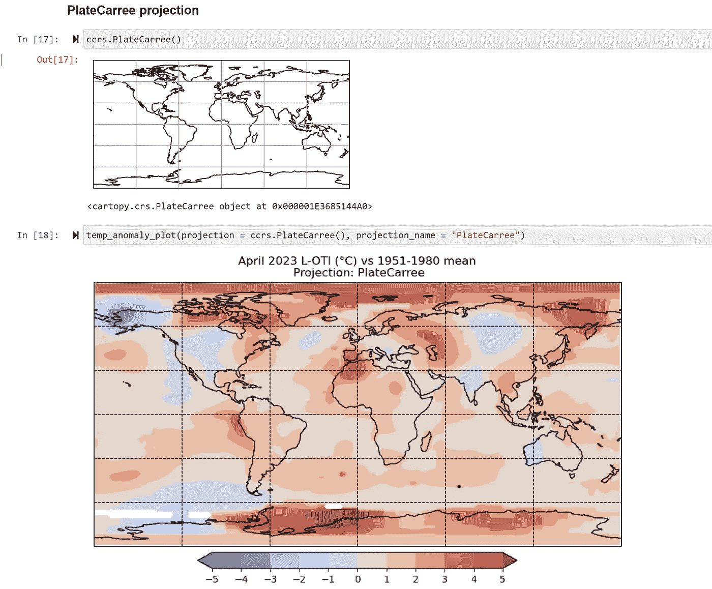
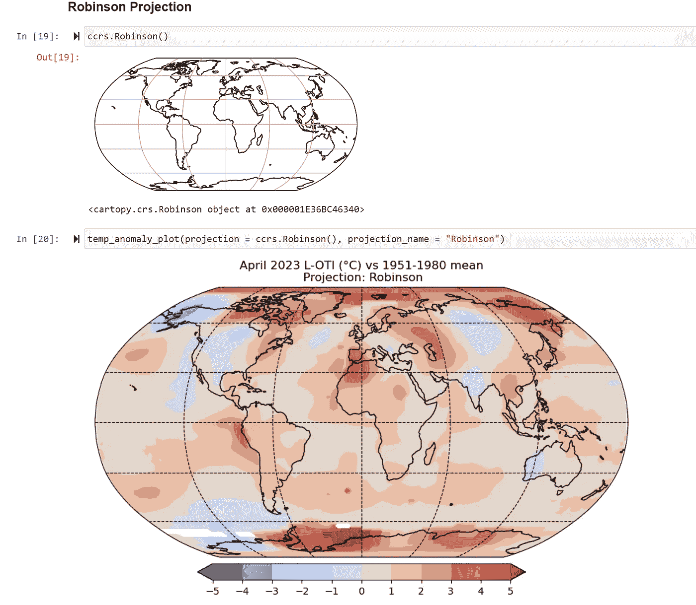

# 使用 NASA 的太空研究评估全球温度异常 - 第二部分

> 原文：[`towardsdatascience.com/assessing-global-temperature-anomaly-using-nasas-space-studies-part-ii-29e5e313a7b3?source=collection_archive---------11-----------------------#2023-06-05`](https://towardsdatascience.com/assessing-global-temperature-anomaly-using-nasas-space-studies-part-ii-29e5e313a7b3?source=collection_archive---------11-----------------------#2023-06-05)

## 使用 `cartopy`、`matplotlib` 和 Python 中的 `netCDF` 数据绘制从 NASA 的 GISSTEMP 获得的全球地表温度异常数据。

[](https://medium.com/@himalaya.birshrestha?source=post_page-----29e5e313a7b3--------------------------------)[](https://towardsdatascience.com/?source=post_page-----29e5e313a7b3--------------------------------) [Himalaya Bir Shrestha](https://medium.com/@himalaya.birshrestha?source=post_page-----29e5e313a7b3--------------------------------)

·

[关注](https://medium.com/m/signin?actionUrl=https%3A%2F%2Fmedium.com%2F_%2Fsubscribe%2Fuser%2Fba33e6d0d27b&operation=register&redirect=https%3A%2F%2Ftowardsdatascience.com%2Fassessing-global-temperature-anomaly-using-nasas-space-studies-part-ii-29e5e313a7b3&user=Himalaya+Bir+Shrestha&userId=ba33e6d0d27b&source=post_page-ba33e6d0d27b----29e5e313a7b3---------------------post_header-----------) 发布于 [Towards Data Science](https://towardsdatascience.com/?source=post_page-----29e5e313a7b3--------------------------------) ·10 min read·2023 年 6 月 5 日[](https://medium.com/m/signin?actionUrl=https%3A%2F%2Fmedium.com%2F_%2Fvote%2Ftowards-data-science%2F29e5e313a7b3&operation=register&redirect=https%3A%2F%2Ftowardsdatascience.com%2Fassessing-global-temperature-anomaly-using-nasas-space-studies-part-ii-29e5e313a7b3&user=Himalaya+Bir+Shrestha&userId=ba33e6d0d27b&source=-----29e5e313a7b3---------------------clap_footer-----------)

--

[](https://medium.com/m/signin?actionUrl=https%3A%2F%2Fmedium.com%2F_%2Fbookmark%2Fp%2F29e5e313a7b3&operation=register&redirect=https%3A%2F%2Ftowardsdatascience.com%2Fassessing-global-temperature-anomaly-using-nasas-space-studies-part-ii-29e5e313a7b3&source=-----29e5e313a7b3---------------------bookmark_footer-----------)

在本文撰写时（2023 年 5 月），全球 CO2 排放[浓度](https://www.co2.earth/daily-co2#:~:text=421.74%20ppm&text=This%20table%20presents%20the%20most,atmospheric%20CO2%20on%20the%20planet.)为 425 ppm。这一浓度水平是 1400 万年来的最高点，预计在未来几年还会继续上升（The World Counts，2023）。显而易见，人为温室气体（GHG）排放是全球变暖的主要驱动因素。在本系列的第一部分，我讨论了全球地表温度异常、相关科学及其不确定性，基于 NASA 戈达德太空研究所提供的过去 142 年（自 1880 年以来）的[数据](https://data.giss.nasa.gov/gistemp/graphs_v4/)（GISSTEMP）。

[](/assessing-global-temperature-anomaly-using-nasas-space-studies-part-i-a4c0c4b825cb?source=post_page-----29e5e313a7b3--------------------------------) ## 使用 NASA 的太空研究评估全球温度异常 — 第 I 部分

### 探索历史全球温度异常背后的基础数据、不确定性和科学原理

towardsdatascience.com

最近，世界气象组织（WMO）发布的一份报告称，相对于 1850–1900 年，全球近地表温度预计在未来五年内上升 1.1°C 至 1.8°C（WMO，2023）。报告进一步指出，有 98%的可能性未来五年中某一年将成为有记录以来最热的一年，并且有可能其中一年会暂时超过 1.5°C 的阈值。

从全球来看，2022 年是有记录以来第五暖的年份（WMO，2023）。气候相关灾害继续成为 2022 年的新闻头条，包括巴基斯坦的灾难性洪水、佛罗里达州的飓风、欧洲的热浪、中国、欧洲和美国河流的干旱及创纪录的水位下降，以及格陵兰岛的冰盖融化创纪录。

在本系列的这一部分，我将关注 2022 年的全球地表温度异常，使用 NASA 的[GISSTEMP](https://data.giss.nasa.gov/gistemp/)数据。在这篇文章的第一部分，我将创建显示 2023 年 4 月相对于 1951–1980 年均值的全球地表温度异常的地图，涵盖不同的投影方式。在第二部分，我将绘制显示 2022 年不同季节的全球地表温度异常的地图。我将使用 Python 中的 matplotlib、cartopy 和 netcdf4 包来实现这一目的。让我们开始吧。


从太空看到的海洋云层。照片由[NASA](https://unsplash.com/@nasa?utm_source=medium&utm_medium=referral)提供，发布在[Unsplash](https://unsplash.com/?utm_source=medium&utm_medium=referral)

# **A. 2023 年 4 月的全球地表温度异常，相对于 1951-1980 年的平均值**

**数据**

相对于基准期的历史时间范围内的全球地表温度异常数据是开放访问的，并从 NASA 的 GISS 表面温度分析[网站](https://data.giss.nasa.gov//gistemp/maps/)下载（GISTEMP 团队，2023 年和 Lenssen 等人，2019 年）。我选择了 4 月作为**平均期**，2023 年的开始到结束作为**时间段**，1951 年开始到 1980 年结束作为**基准期**。1200 公里的**平滑半径**指的是一个站点对区域温度的影响距离。


NASA 的 GISSTEMP 网站上的数据门户。数据来源于 GISTEMP 团队，2023 年和 Lenssen 等人，2019 年。图片由作者提供。

我下载了网格数据作为**netCDF**（*.nc*）文件。netCDF 代表网络公共数据格式，是一种包含一组用于数组导向的机器无关数据访问的接口的文件格式（国家雪冰数据中心，2023 年）。netCDF 文件中的数据使用 netCDF4 包的 Dataset 模块在 Python 中读取，如下所示：


使用 netCDF4 包的 Dataset 模块读取 netCDF 文件。图片由作者提供。

给定的数据变量包含经度（lon）、纬度（lat）和温度异常（TEMPANOMALY）数据。这些数据属于 numpy 掩码数组类型，这意味着数据可能包含一些缺失或无效的条目。在这里，`temp_anomaly`数据可能在每个坐标点上并不总是可用。


访问不同的数据点以获取经度、纬度和温度异常。图片由作者提供。

**2. 使用 Cartopy 绘图**

**安装 Cartopy 包的指南**

要安装 cartopy 包，首先需要安装它的依赖项**shapely**和**pyproj**。shapely 和 pyproj 包的兼容 wheel 文件可以根据**Python 版本**和**Windows 版本**在[这里](https://www.lfd.uci.edu/~gohlke/pythonlibs/#pyproj)获取。安装这些包后，我成功地通过`pip install cartopy`安装了 cartopy 包。

**用于在不同投影下绘制数据的函数**

以下函数使用`projection`和`projection_name`作为参数，这些参数决定了我们想要显示的地图投影类型及其标题。

在下面的函数`temp_anomaly_plot()`中，首先向图中添加一个具有特定投影的坐标轴。地图被设置为覆盖全球范围。`clevs`定义了我们想要在地图上投影的数据（温度异常）的范围。在这里，我将这个范围定义为-5°C 到 6°C。`cmap`指的是颜色图。在这里，我选择了 coolwarm 颜色图，其中蓝色反映寒冷端，红色反映温暖端。

该函数使用`lons`和`lats`作为坐标，`temp_anomaly`作为数据绘制填充轮廓。默认情况下，Cartopy 假设坐标与结果图的投影匹配。因此，安全的选项是提供[transform](https://scitools.org.uk/cartopy/docs/latest/tutorials/understanding_transform.html)关键字，以便 Cartopy 理解坐标指的是特定的原始投影（此处为 ccrs.PlateCarree()）并需要将其转换为新的`projection`类型。最后，在地图下方添加了一个水平颜色条。

```py
def temp_anomaly_plot(projection, projection_name):

    fig = plt.figure(figsize = (12, 6))

    #Add an axes to the current figure and make it the current axes.
    ax = plt.axes(projection = projection)

    #make the map global rather than having it zoom in to extent of the plotted data
    ax.set_global()

    ax.gridlines(linestyle = "--", color = "black")

    #Set contour levels, then draw the plot and a colorbar
    clevs = np.arange(-5, 6)
    cmap = "coolwarm"

    #Plot filled contours
    plt.contourf(lons, lats, 
                 temp_anomaly,
                 clevs,
                 transform = ccrs.PlateCarree(),
                 cmap = cmap,
                 extend = "both" #To add arrows on both ends of the colorbar
                )

    #Add coastlines after filling contours
    ax.coastlines(resolution = "110m", lw = 1)

    plt.title(f"April 2023 L-OTI (°C) vs 1951-1980 mean\n Projection: {projection_name}")

    cb = plt.colorbar(ax = ax,
                      orientation = "horizontal",
                      pad = 0.02,
                      aspect = 20,  #ratio of long to short dimension
                      shrink = 0.5, #Fraction by which to multiply the size of the colorbar
                      ticks = clevs #To get the ticks same as clevs -5 to 5 degree Celsius in colorbar
                     )

    cb.set_label("°C", size = 12, rotation = 0, labelpad = 15)
    cb.ax.tick_params(labelsize = 10)
    plt.savefig(f"../output/temp_anomaly_{projection_name}.jpeg",
               dpi = 300)

    plt.show()
```

**3. 投影**

地图投影永远无法完全准确地表示球形地球。**地图投影**试图将地球表面或其一部分从球形（3D）转换为平面形状（2D）。由于地图投影过程的原因，每张地图都会显示**角度符合性、距离和面积的失真**（QGIS 文档，2023）。在 Python 中，地理空间数据可以使用 Cartopy 包以各种[投影](https://scitools.org.uk/cartopy/docs/v0.15/crs/projections.html)绘制。

使用上节定义的`temp_anomaly_plot`函数，我在全球地图上以三种不同的投影绘制了全球表面温度异常：

**PlateCarree 投影**

PlateCarree 投影是一种等距圆柱[投影](https://pro.arcgis.com/en/pro-app/latest/help/mapping/properties/plate-carree.htm)，其标准纬线位于赤道。



Cartopy 包的 Platecarree 投影（顶部），以及 2023 年 4 月相对于 1951 至 1980 年平均值的表面温度异常地图的 Platecarree 投影（底部）。作者插图。

**罗宾逊投影**

罗宾逊投影是世界地图中最常用的伪圆柱投影之一。这是一种折衷方案，其中地图上的面积、角度符合性和距离的失真是可以接受的（QGIS 文档，2023）。



Cartopy 包的罗宾逊投影（顶部），以及 2023 年 4 月相对于 1951 至 1980 年平均值的表面温度异常地图的罗宾逊投影（底部）。作者插图。

**正射投影**

正射投影是一种方位投影[投影](https://pro.arcgis.com/en/pro-app/3.0/help/mapping/properties/orthographic.htm)，将地球表面从无限距离投影到平面。在这种投影中，需要指定要在平面中心查看的`central_longitude`和`central_latitude`。因此，在这种投影中，全球的所有位置无法一次全部可见。


Cartopy 包的正射投影（上），以及 2023 年 4 月的地表温度异常相对于 1951 年至 1980 年平均的正射投影地图（下）。插图作者提供。

# **B. 全球地表温度异常按季节分布**

在这一部分，我打算绘制 2022 年不同季节的全球地表温度异常。数据来源于同一个 NASA GISSTEMP [网站](https://data.giss.nasa.gov/gistemp/maps/)。不过，在这种情况下，我选择了四个气象季节（冬季、春季、夏季和秋季）作为**平均期**，并下载了相应的网格数据作为 netCDF 文件。为了获取 2022 年整个日历年的数据，我选择了**时间间隔**，即 2022 年开始和结束之间的时间。

接下来，我创建了一个`get_data`函数，从相应的 netCDF 文件中提取四季的经度、纬度、温度异常和平均温度异常数据，如下所示：


从 netCDF 文件中提取四季的经度、纬度、温度异常和平均温度异常数据的函数。图像作者提供。

我打算将四季的温度异常绘制成单个图中的四个子图。下面的代码片段中已相应编写了代码。我还为整个图添加了一个公共的图例色条。

```py
clevs = np.arange(-5, 6)
cmap = “coolwarm”
projection = ccrs.PlateCarree()

# Use subplot_kw to declare the projection
fig, axs = plt.subplots(2, 2, figsize = (24, 7), subplot_kw = {"projection": projection},
 #gridspec_kw = {'wspace':0.01, 'hspace':0.3}
 )
plt.subplots_adjust(left = 0.2, right = 0.8, top = 0.9, bottom = -0.25)

fig.suptitle(title, x = 0.5, y = 1, fontsize = 20, fontweight = "bold")

cf1 = axs[0, 0].contourf(winter_lons, winter_lats, 
 winter_temp_anomaly,
 clevs,
 #transform = ccrs.PlateCarree(),
 cmap = cmap,
 extend = "both"
 )

axs[0, 0].set_title(f'Winter 2022: +{winter_temp_anomaly_mean} °C', fontsize = 20)
axs[0, 0].coastlines()
axs[0, 0].gridlines(draw_labels=True)
axs[0, 0].set_aspect('equal', adjustable=None)

cf2 = axs[0, 1].contourf(spring_lons, spring_lats, 
 spring_temp_anomaly,
 clevs,
 #transform = ccrs.PlateCarree(),
 cmap = cmap,
 extend = "both"
 )
axs[0, 1].set_title(f'Spring 2022: +{spring_temp_anomaly_mean} °C', fontsize = 20)
axs[0, 1].coastlines()
axs[0, 1].gridlines(draw_labels=True)
axs[0, 1].set_aspect('equal', adjustable=None)

cf3 = axs[1, 0].contourf(summer_lons, summer_lats, 
 summer_temp_anomaly,
 clevs,
 #transform = ccrs.PlateCarree(),
 cmap = cmap,
 extend = "both"
 )
axs[1, 0].set_title(f'Summer 2022: +{summer_temp_anomaly_mean} °C', fontsize = 20)
axs[1, 0].coastlines()
axs[1, 0].gridlines(draw_labels=True)
axs[1, 0].set_aspect('equal', adjustable=None)

cf4 = axs[1, 1].contourf(autumn_lons, autumn_lats, 
 autumn_temp_anomaly,
 clevs,
 #transform = ccrs.PlateCarree(),
 cmap = cmap,

 #To add arrows in the colorbar
 extend = "both"
 )

cax = fig.add_axes([0.25, -0.35, 0.5, 0.025]) #[left, bottom, width, height]

lgd = fig.colorbar(cf4,
 orientation = "horizontal",
 ticks = clevs,
 cax = cax,
 label = "°C"
 ).set_label("°C", rotation = 0)

axs[1, 1].set_title(f'Autumn 2022: +{autumn_temp_anomaly_mean} °C', fontsize = 20)
axs[1, 1].coastlines()
axs[1, 1].gridlines(draw_labels=True)
axs[1, 1].set_aspect('equal', adjustable=None)

plt.savefig("../output/temperature_anomalies_by_seasons.jpeg",
 bbox_inches = "tight",
 dpi = 300)

plt.show() 
```

结果图如下所示：


2022 年四个气象季节的全球地表温度异常，相对于 1951 年至 1980 年均值作为基准期。数据基于 GISTEMP 团队，2023 年及 Lenssen 等，2019 年。插图作者提供。

# 关键要点

从这次分析中得到的一些关键点如下：

+   2022 年是[*拉尼娜*](https://education.nationalgeographic.org/resource/la-nina/)年，这通常对全球温度有冷却作用。尽管如此，2022 年的全球平均地表温度异常相对于 1951–80 年均值为 1.2°C。2022 年是有记录以来最温暖的拉尼娜年，这突显了全球变暖的极端性（CNN, 2023）。

+   地表温度异常在全球不同地区并不均匀。如前文帖子所讨论，全球地表温度异常在陆地上的值远高于海洋。一项[研究](https://www.ecmwf.int/en/about/media-centre/news/2023/european-climate-marked-heat-and-drought-2022-report)指出，近年来陆地的温度上升速度大约是海洋的两倍。

+   与历史 1951–80 年基期相比，2022 年的不同季节中有些海洋区域稍微凉爽。这些区域在地图上以蓝色表示。例如，南美洲左侧的部分太平洋和格林兰岛下方的一些区域。然而，这并未描绘完整的图景，因为大多数地方已经变暖，这在地图上以红色表示。

+   与世界其他地区相比，北极地区近年来变暖程度更高。这主要归因于海冰和雪盖的融化，导致反射减少和太阳辐射吸收增加（PBS 新闻时间，2022）。在 2022 年，北极的温度异常在冬季比其他月份更为突出。

+   上述 B 部分显示了 2022 年全球表面温度异常在不同季节之间的差异。夏季观察到的温度异常最高（1.15°C），其次是春季（1.14°C）、冬季（1.08°C）和秋季（1.02°C）。这与近年来夏季变得更暖和并且相较于其他季节更为难以忍受有关。

## 结论

在这篇文章中，首先，我绘制了相对于 1951–80 年均值的 2023 年 4 月全球表面温度异常数据，使用了从 NASA 的[GISSTEMP](https://data.giss.nasa.gov/gistemp/maps/)获取的 netCDF 文件。我展示了使用 Cartopy 包在不同投影下绘制地图的方法。接下来，我将 2022 年四个气象季节的表面温度异常数据绘制为一个图中的四个子图。通过这些地图图示，我提取了近年来全球不同地区和不同季节的表面温度异常的主要信息。

Xarray 是 Python 中另一个有用的包，可用于处理 netCDF 或其他文件格式的地理空间数据。例如，[Lubomir Franko](https://medium.com/@lubomirfranko/climate-data-visualisation-with-python-visualise-climate-data-using-cartopy-and-xarray-cf35a60ca8ee)和 Giannis Tolios 的文章展示了如何使用 xarray、cartopy 和 matplotlib 绘制欧洲的表面温度异常数据。使用 xarray 处理空间数据的可能性可以作为另一个话题进行讨论。

本文和本系列之前的文章中使用的笔记本和数据可以在这个 GitHub[仓库](https://github.com/hbshrestha/global_temperature_anomaly)中找到。感谢您的阅读！

## **参考文献**

CNN, 2023\. [2022 年是有记录以来最暖的拉尼娜年。科学家们表示今年将更暖 | CNN](https://edition.cnn.com/2023/01/12/us/2022-warmest-la-nina-year-climate/index.html#:~:text=Scientists%20say%20this%20year%20will%20be%20warmer,-By%20Rachel%20Ramirez&text=Low%20water%20levels%20on%20the,Mighty%20Mississippi%20to%20record%20lows.)

GISTEMP 团队，2023 年：GISS 地表温度分析（GISTEMP），版本 4。NASA 戈达德太空研究所。数据集访问日期：2023 年 5 月 31 日，网址为 [data.giss.nasa.gov/gistemp/](https://data.giss.nasa.gov/gistemp/)。

Lenssen, N., G. Schmidt, J. Hansen, M. Menne, A. Persin, R. Ruedy, 和 D. Zyss, 2019 年：[GISTEMP 不确定性模型的改进](https://pubs.giss.nasa.gov/abs/le05800h.html)。J. Geophys. Res. Atmos., **124**，第 12 期，6307–6326，doi:10.1029/2018JD029522。

国家雪冰数据中心——推进对地球冰冻区域的认识，2023 年。[什么是 netCDF？ | 国家雪冰数据中心 (nsidc.org)](https://nsidc.org/data/user-resources/help-center/what-netcdf#:~:text=NetCDF%20(network%20Common%20Data%20Form,format%20for%20representing%20scientific%20data.)

PBS 新闻时间，2022 年。[北极变暖的速度几乎是全球其他地区的四倍 | PBS 新闻时间](https://www.pbs.org/newshour/politics/the-arctic-is-warming-nearly-four-times-faster-than-the-rest-of-the-world#:~:text=As%20the%20darkest%20natural%20surface,90%20percent%20of%20solar%20radiation.&text=When%20covered%20with%20sea%20ice,the%20absorption%20of%20solar%20radiation.)

QGIS 文档，2023 年。[8. 坐标参考系统 — QGIS 文档](https://docs.qgis.org/3.28/en/docs/gentle_gis_introduction/coordinate_reference_systems.html)

The World Counts，2023 年。[全球变暖与二氧化碳浓度（theworldcounts.com）](https://www.theworldcounts.com/challenges/global-warming/CO2-concentration)

世界气象组织（WMO），2023 年。[全球年度至十年气候更新 | 世界气象组织 (wmo.int)](https://public.wmo.int/en/our-mandate/climate/global-annual-decadal-climate-update)
