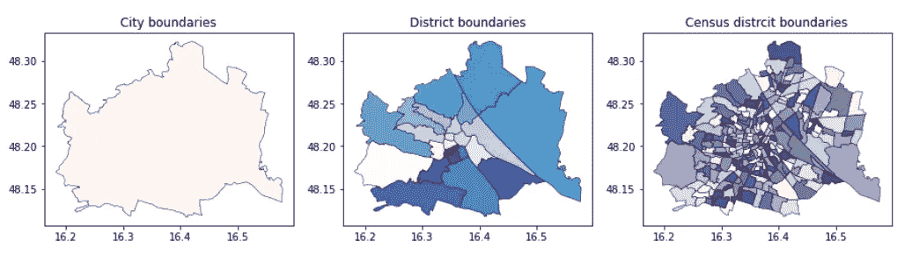
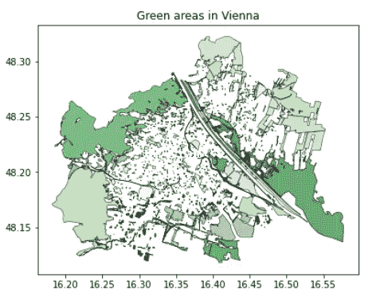
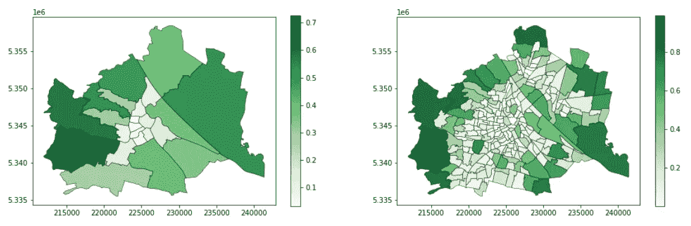
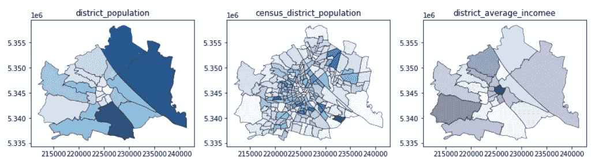
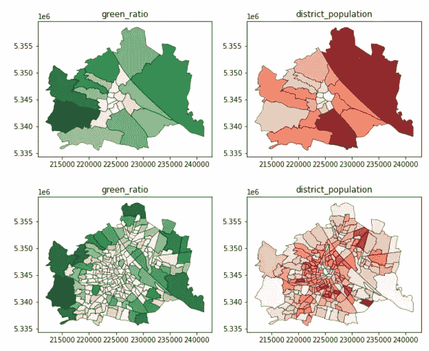
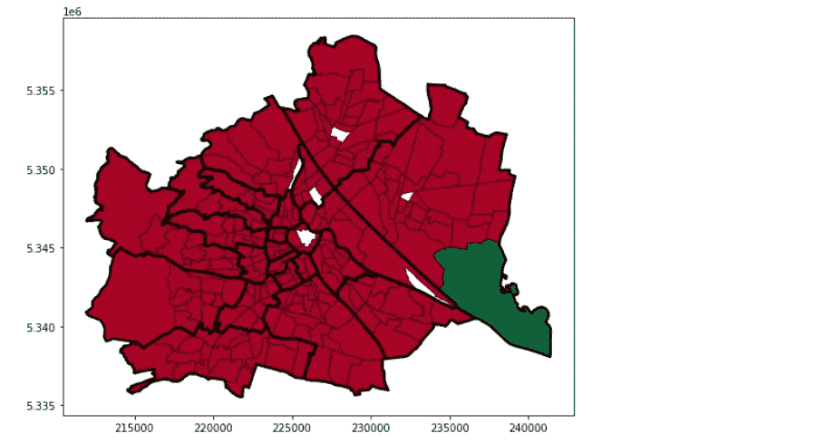
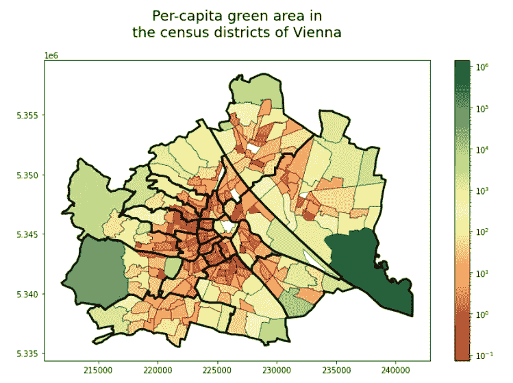
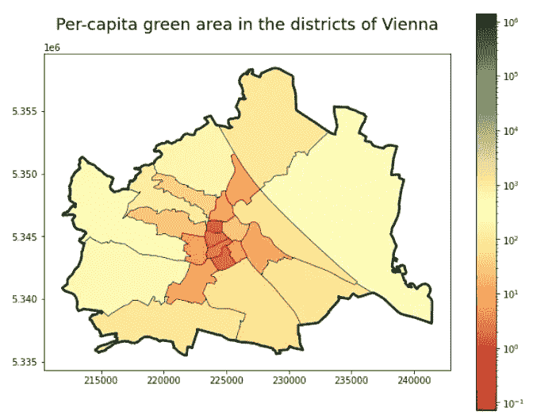
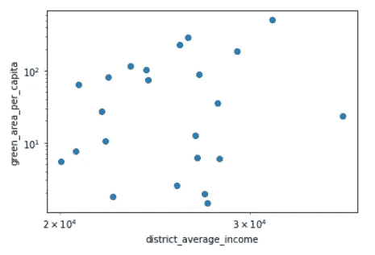

# 使用维也纳开放数据门户评估城市绿地平等性

> 原文：[`towardsdatascience.com/assessing-urban-geen-inequality-using-viennas-open-data-portal-aa628e0237ad`](https://towardsdatascience.com/assessing-urban-geen-inequality-using-viennas-open-data-portal-aa628e0237ad)


图片来源 [CHUTTERSNAP](https://unsplash.com/@chuttersnap?utm_source=medium&utm_medium=referral) 于 [Unsplash](https://unsplash.com/?utm_source=medium&utm_medium=referral)

## 尽管有许多优势，但在高度城市化的地区，接触自然和绿地变得越来越困难。一些人担心，服务不足的社区可能更容易面临这些问题。在这里，我提出了一种数据驱动的方法来探索这一问题。

[](https://medium.com/@janosovm?source=post_page-----aa628e0237ad--------------------------------)[](https://towardsdatascience.com/?source=post_page-----aa628e0237ad--------------------------------) [Milan Janosov](https://medium.com/@janosovm?source=post_page-----aa628e0237ad--------------------------------)

·发表于 [Towards Data Science](https://towardsdatascience.com/?source=post_page-----aa628e0237ad--------------------------------) ·11 min read·2023 年 9 月 11 日

--

我提出了一个近年来在专业圈子和地方政府中引起兴趣的城市发展问题——现在关注的是绿地平等性。这个概念指的是在特定城市不同区域内人们获取绿地的差异。在这里，我探索其财政维度，并观察每人绿地面积与该城市单位的经济水平之间是否存在明显的关系。

我将探索城市的两种不同空间分辨率——区划和人口普查区，使用奥地利政府开放数据门户提供的 Esri Shapefiles。我还会将表格统计数据（人口和收入）纳入地理参考的行政区域。接着，我会将这些行政区域与官方绿地数据集叠加，记录每个绿地的位置，并以地理空间格式呈现。然后，我将这些信息结合起来，并量化每个城市区的每人绿地总量。最后，我将每个区域的财政状况（通过年净收入捕捉）与每人绿地比例相关联，以查看是否出现任何模式。

# 1\. 数据来源

我们可以在奥地利政府的开放数据门户 [这里](https://www.data.gv.at/) 查看。

当我写这篇文章时，网站的英文翻译没有真正起作用，因此我没有依赖我早已遗忘的 12 年德语课程，而是使用了 DeepL 来浏览子页面和数千个数据集。

然后，我收集了几个数据文件，包括地理参考（Esri shapefiles）和简单的表格数据，这些数据将用于后续分析。我收集的数据：

**边界 — 维也纳以下空间单位的行政边界：**

+   [维也纳的行政边界](https://www.data.gv.at/katalog/en/dataset/86c29af5-c52c-423d-8764-82c1bb037936)

+   [维也纳 23 个区的行政边界](https://www.data.gv.at/katalog/en/dataset/2ee6b8bf-6292-413c-bb8b-bd22dbb2ad4b)

+   [维也纳 250 个普查区的行政边界](https://www.data.gv.at/katalog/en/dataset/e4079286-310c-435a-af2d-64604ba9ade5)

**土地使用 — 绿色空间和建成区域的位置信息：**

+   [绿色带维也纳城市](https://www.data.gv.at/katalog/en/dataset/10c7b88b-a708-4e17-a7ef-2c1ce0590377) 视觉化现有和专用的绿色带区域，由 1539 个地理空间多边形文件组成，这些文件包围了绿色空间。

**统计数据 — 关于人口和收入的数据，反映了区域的社会经济水平：**

+   [每个区的人口](https://www.data.gv.at/katalog/en/dataset/0b1c34b4-06c0-49f3-9379-d86cc8b1c78d)，自 2002 年起每年记录，并按 5 岁年龄组、性别和原籍国分开存储。

+   [每个普查区的人口](https://www.data.gv.at/katalog/en/dataset/15516cf5-09c1-4e69-acf8-3d43183dd026)，自 2008 年起每年记录，并按三个不规则年龄组、性别和来源分开存储。

+   [平均净收入](https://www.data.gv.at/katalog/en/dataset/d76c0e8b-c599-4700-8a88-29d0d87e563d#resources) 自 2002 年以来，维也纳各区的每名员工每年以欧元表示。

此外，我将下载的数据文件存储在名为 data 的本地文件夹中。

# 2. 基本数据探索

**2.1 行政边界**

首先，读取和可视化包含每个行政边界级别的不同形状文件，以更详细地了解城市：

```py
folder     = 'data'
admin_city = gpd.read_file(folder + '/LANDESGRENZEOGD')
admin_district = gpd.read_file(folder + '/BEZIRKSGRENZEOGD')
admin_census = gpd.read_file(folder + '/ZAEHLBEZIRKOGD')

display(admin_city.head(1))
display(admin_district.head(1))
display(admin_census.head(1))
```

在此我们注意到列名 BEZNR 和 ZBEZ 分别对应于区 ID 和普查区 ID。出乎意料的是，它们以不同的格式存储/解析，分别为 numpy.float64 和 str：

```py
print(type(admin_district.BEZNR.iloc[0]))
print(type(admin_census.ZBEZ.iloc[0]))pyth
```

确保我们确实有 23 个区和 250 个普查区，如数据文件文档所声称：

```py
print(len(set(admin_district.BEZNR)))
print(len(set(admin_census.ZBEZ)))
```

现在可视化边界 — 首先是城市，然后是其区，再然后是更小的普查区。

```py
f, ax = plt.subplots(1,3,figsize=(15,5))

admin_city.plot(ax=ax[0],     
  edgecolor = 'k', 
  linewidth = 0.5, 
  alpha = 0.9, 
  cmap = 'Reds')

admin_district.plot(ax=ax[1], 
  edgecolor = 'k', 
  linewidth = 0.5, 
  alpha = 0.9, 
  cmap = 'Blues')

admin_census.plot(ax=ax[2],   
  edgecolor = 'k', 
  linewidth = 0.5, 
  alpha = 0.9, 
  cmap = 'Purples')

ax[0].set_title('City boundaries')
ax[1].set_title('District boundaries')
ax[2].set_title('Census distrcit boundaries')
```

这段代码输出维也纳的以下视觉效果：



维也纳的不同行政级别。图像由作者提供。

**2.2 绿色区域**

现在，也查看一下绿色空间的分布：

```py
gdf_green  = gpd.read_file(folder + '/GRUENFREIFLOGD_GRUENGEWOGD')
display(gdf_green.head(3))
```

在这里，人们可能会注意到没有直接将绿地（例如，没有添加区 ID）与社区链接的方法——因此稍后我们将通过操作几何形状找到重叠区域来做到这一点。

现在可视化这个：

```py
f, ax = plt.subplots(1,1,figsize=(7,5))

gdf_green.plot(ax=ax,  
  edgecolor = 'k', 
  linewidth = 0.5, 
  alpha = 0.9, 
  cmap = 'Greens')

ax.set_title('Green areas in Vienna')
```

这段代码展示了维也纳的绿地所在的位置：



维也纳的官方绿带。图片由作者提供。

我们可以注意到，林业区域仍然在行政边界内，这意味着并不是城市的每个部分都是城市化和人口密集的。稍后，当我们评估人均绿地面积时，我们会回到这一点。

**2.3 统计数据——人口、收入**

最后，让我们看看统计数据文件。第一个主要区别是这些文件没有地理参考，只是简单的 csv 表格：

```py
df_pop_distr = pd.read_csv('vie-bez-pop-sex-age5-stk-ori-geo4-2002f.csv', 
  sep = ';',
  encoding='unicode_escape', 
  skiprows = 1)

df_pop_cens  = pd.read_csv('vie-zbz-pop-sex-agr3-stk-ori-geo2-2008f.csv', 
  sep = ';',
  encoding='unicode_escape', 
  skiprows = 1)

df_inc_distr = pd.read_csv('vie-bez-biz-ecn-inc-sex-2002f.csv', 
  sep = ';',
  encoding='unicode_escape', 
  skiprows = 1)

display(df_pop_distr.head(1))
display(df_pop_cens.head(1))
display(df_inc_distr.head(1))
```

# 3\. 数据预处理

**3.1\. 准备统计数据文件**

前一小节显示统计数据表使用了不同的命名约定——它们使用 DISTRICT_CODE 和 SUB_DISTRICT_CODE 标识符，而不是像 BEZNR 和 ZBEZ 这样的东西。然而，在阅读每个数据集的文档后，很明显可以很容易地进行转换，接下来我在下一个单元中提供了两个简短的函数。我将同时处理区和普查区级别的数据。

此外，我只对统计信息的（最新）汇总值和数据点感兴趣，比如最新快照中的总人口。因此，让我们清理这些数据文件，保留我稍后会用到的列。

```py
# these functions convert the district and census district ids to be compatbile with the ones found in the shapefiles
def transform_district_id(x): 
  return int(str(x)[1:3])

def transform_census_district_id(x): 
  return int(str(x)[1:5])

# select the latest year of the data set
df_pop_distr_2 = df_pop_distr[df_pop_distr.REF_YEAR \
  ==max(df_pop_distr.REF_YEAR)]
df_pop_cens_2  = df_pop_cens[df_pop_cens.REF_YEAR \
  ==max(df_pop_cens.REF_YEAR)]
df_inc_distr_2 = df_inc_distr[df_inc_distr.REF_YEAR \
  ==max(df_inc_distr.REF_YEAR)]

# convert district ids
df_pop_distr_2['district_id'] = \
  df_pop_distr_2.DISTRICT_CODE.apply(transform_district_id)

df_pop_cens_2['census_district_id'] = \
  df_pop_cens_2.SUB_DISTRICT_CODE.apply(transform_census_district_id)

df_inc_distr_2['district_id'] = \
  df_inc_distr_2.DISTRICT_CODE.apply(transform_district_id)

# aggregate population values
df_pop_distr_2 = df_pop_distr_2.groupby(by = 'district_id').sum()
df_pop_distr_2['district_population'] = df_pop_distr_2.AUT + \
  df_pop_distr_2.EEA  + df_pop_distr_2.REU  + df_pop_distr_2.TCN
df_pop_distr_2 = df_pop_distr_2[['district_population']]

df_pop_cens_2 = df_pop_cens_2.groupby(by = 'census_district_id').sum()
df_pop_cens_2['census_district_population'] = df_pop_cens_2.AUT \
  + df_pop_cens_2.FOR
df_pop_cens_2 = df_pop_cens_2[['census_district_population']]

df_inc_distr_2['district_average_income'] = \
  1000*df_inc_distr_2[['INC_TOT_VALUE']]
df_inc_distr_2 = \
  df_inc_distr_2.set_index('district_id')[['district_average_income']]

# display the finalized tables
display(df_pop_distr_2.head(3))
display(df_pop_cens_2.head(3))
display(df_inc_distr_2.head(3))

# and unifying the naming conventions
admin_district['district_id'] = admin_district.BEZNR.astype(int)
admin_census['census_district_id'] = admin_census.ZBEZ.astype(int)

print(len(set(admin_census.ZBEZ)))
```

双重检查两个聚合层次的计算总人口值：

```py
print(sum(df_pop_distr_2.district_population))
print(sum(df_pop_cens_2.census_district_population))
```

这两个应该都提供相同的结果——1931593 人。

**3.1\. 准备地理空间数据文件**

现在我们完成了统计文件的基本数据准备，是时候将绿地多边形与行政区域多边形匹配了。接下来，让我们计算每个行政区域的总绿地覆盖面积。此外，我还会出于好奇添加每个行政区域的相对绿地覆盖面积。

要获得以 SI 单位表示的面积，我们需要切换到所谓的本地 CRS，在维也纳的情况下是 EPSG:31282。你可以在[这里](https://epsg.io/31282)和这里更多地了解这个话题、地图投影和坐标参考系统。

```py
# converting all GeoDataFrames into the loca crs
admin_district_2 = \
  admin_district[['district_id', 'geometry']].to_crs(31282)

admin_census_2 = \
   admin_census[['census_district_id', 'geometry']].to_crs(31282)

gdf_green_2      = gdf_green.to_crs(31282)
```

计算以 SI 单位测量的行政单元面积：

```py
admin_district_2['admin_area'] = \
  admin_district_2.geometry.apply(lambda g: g.area)

admin_census_2['admin_area'] = \ 
  admin_census_2.geometry.apply(lambda g: g.area)

display(admin_district_2.head(1))
display(admin_census_2.head(1))
```

# 4\. 计算人均绿地面积比率

4.1 计算每个行政单元的绿地覆盖率

我将使用 GeoPandas 的叠加函数将这两个行政边界 GeoDataFrame 与包含绿色区域多边形的 GeoDataFrame 叠加在一起。然后，我计算每个绿色区域部分落入不同行政区域的面积。接下来，我将这些面积汇总到每个行政区域，包括区级和普查区级。最后，在每个分辨率单元中，我添加之前计算的行政官方单元面积，并计算每个区和普查区的绿色面积比率。

```py
gdf_green_mapped_distr = gpd.overlay(gdf_green_2, admin_district_2)

gdf_green_mapped_distr['green_area'] = \
  gdf_green_mapped_distr.geometry.apply(lambda g: g.area)

gdf_green_mapped_distr = \
  gdf_green_mapped_distr.groupby(by = 'district_id').sum()[['green_area']]

gdf_green_mapped_distr = \
  gpd.GeoDataFrame(admin_district_2.merge(gdf_green_mapped_distr, left_on = 'district_id', right_index = True))

gdf_green_mapped_distr['green_ratio'] = \
  gdf_green_mapped_distr.green_area / gdf_green_mapped_distr.admin_area

gdf_green_mapped_distr.head(3)
```

```py
gdf_green_mapped_cens = gpd.overlay(gdf_green_2, admin_census_2)
gdf_green_mapped_cens['green_area'] = \
  gdf_green_mapped_cens.geometry.apply(lambda g: g.area)

gdf_green_mapped_cens = \
  gdf_green_mapped_cens.groupby(by = 'census_district_id').sum()[['green_area']]

gdf_green_mapped_cens = \
  gpd.GeoDataFrame(admin_census_2.merge(gdf_green_mapped_cens, left_on = 'census_district_id', right_index = True))

gdf_green_mapped_cens['green_ratio'] = gdf_green_mapped_cens.green_area / gdf_green_mapped_cens.admin_area
gdf_green_mapped_cens.head(3)
```

最后，按区和普查区可视化绿色比率！结果似乎非常有意义，外围区域的绿化水平较高，而中心区域的绿化水平明显较低。此外，250 个普查区清晰地显示了不同街区特征的更详细、更细致的图景，为城市规划者提供了更深刻和更本地化的洞察。另一方面，区级信息由于空间单元减少了十倍，展示了总体平均水平。

```py
f, ax = plt.subplots(1,2,figsize=(17,5))

gdf_green_mapped_distr.plot(ax = ax[0], 
  column = 'green_ratio', 
  edgecolor = 'k', 
  linewidth = 0.5, 
  alpha = 0.9,  
  legend = True,
  cmap = 'Greens')

gdf_green_mapped_cens.plot(ax = ax[1], 
  column = 'green_ratio', 
  edgecolor = 'k', 
  linewidth = 0.5, 
  alpha = 0.9,  
  legend = True,
  cmap = 'Greens')
```

这段代码输出了以下地图：



这两张地图显示了维也纳每个区/普查区的绿色面积比率。图片由作者提供。

**4.2 为每个行政单位添加人口和收入信息**

在本节的最后一步，让我们将统计数据映射到行政区域。提醒一下：我们在区级和普查区级都有人口数据。然而，我只能在区级找到收入（社会经济水平指标）。这在地理空间数据科学中是一种常见的权衡。虽然一个维度（绿化）在更高分辨率（普查区）下更具洞察力，但数据限制可能会迫使我们使用较低分辨率的数据。

```py
display(admin_census_2.head(2))
display(df_pop_cens_2.head(2))
```

```py
gdf_pop_mapped_distr  = admin_district_2.merge(df_pop_distr_2, \
  left_on = 'district_id', right_index = True)

gdf_pop_mapped_cens  = admin_census_2.merge(df_pop_cens_2, \
  left_on = 'census_district_id', right_index = True)

gdf_inc_mapped_distr = admin_district_2.merge(df_inc_distr_2, \
  left_on = 'district_id', right_index = True)

f, ax = plt.subplots(1,3,figsize=(15,5))

gdf_pop_mapped_distr.plot(column = 'district_population', ax=ax[0],     \
  edgecolor = 'k', linewidth = 0.5, alpha = 0.9, cmap = 'Blues')

gdf_pop_mapped_cens.plot(column = 'census_district_population', ax=ax[1], \
  edgecolor = 'k', linewidth = 0.5, alpha = 0.9, cmap = 'Blues')

gdf_inc_mapped_distr.plot(column = 'district_average_income', ax=ax[2],   \
  edgecolor = 'k', linewidth = 0.5, alpha = 0.9, cmap = 'Purples')

ax[0].set_title('district_population')
ax[1].set_title('census_district_population')
ax[2].set_title('district_average_incomee')
```

这段代码生成了以下图形：



维也纳街区的各种统计信息。图片由作者提供。

**4.3 绿色面积人均计算**

让我们总结一下目前的情况，所有数据都整合成了与维也纳各区和普查区对应的整洁形状文件：

在区级，我们有绿色面积比率、人口和收入数据。

在普查区的层面上，我们有绿色面积比率和人口数据。

为了简单地捕捉绿色平等，我将绿色面积的绝对大小与区级和普查区级的人口信息合并，计算人均绿色面积的总量。

让我们来看看我们的输入——绿色覆盖和人口：

```py
# a plot for the disticts
f, ax = plt.subplots(1,2,figsize=(10,5))

gdf_green_mapped_distr.plot(
  ax = ax[0], 
  column = 'green_ratio', 
  edgecolor = 'k', 
  linewidth = 0.5, 
  alpha = 0.9,  
  cmap = 'Greens')

gdf_pop_mapped_distr.plot(
  ax = ax[1], 
  column = 'district_population', 
   edgecolor = 'k', 
  linewidth = 0.5, 
  alpha = 0.9,  
  cmap = 'Reds')

ax[0].set_title('green_ratio')
ax[1].set_title('district_population')

# a plot for the census disticts
f, ax = plt.subplots(1,2,figsize=(10,5))
gdf_green_mapped_cens.plot(
  ax = ax[0], 
  column = 'green_ratio', 
  edgecolor = 'k', 
  linewidth = 0.5, 
  alpha = 0.9,  
  cmap = 'Greens')

gdf_pop_mapped_cens.plot(
ax = ax[1], 
  column = 'census_district_population',
  edgecolor = 'k', 
  linewidth = 0.5, 
  alpha = 0.9,  
  cmap = 'Reds')

ax[0].set_title('green_ratio')
ax[1].set_title('district_population')
```

这段代码生成了以下图形：



维也纳各区和普查区的绿色面积和人口水平。图片由作者提供。

为了计算人均绿地面积，我将首先通过以下步骤合并绿化和人口数据框。我将以普查区为例，因为它的空间分辨率更高，允许我们观察到更好的模式（如果有的话）。确保我们不进行零除操作，并遵循常识；我们来去除那些无人居住的区域。

```py
gdf_green_pop_cens = \
  gdf_green_mapped_cens.merge(gdf_pop_mapped_cens.drop( \
    columns = ['geometry', 'admin_area']), left_on = 'census_district_id',\
    right_on = 'census_district_id')[['census_district_id', \
    'green_area', 'census_district_population',  'geometry']]

gdf_green_pop_cens['green_area_per_capita'] = \
  gdf_green_pop_cens['green_area'] / \
  gdf_green_pop_cens['census_district_population']

gdf_green_pop_cens = \
  gdf_green_pop_cens[gdf_green_pop_cens['census_district_population']>0]

f, ax = plt.subplots(1,1,figsize=(10,7))

gdf_green_pop_cens.plot(
  column = 'green_area_per_capita', 
  ax=ax, 
  cmap = 'RdYlGn', 
  edgecolor = 'k', 
  linewidth = 0.5)

admin_district.to_crs(31282).plot(\
  ax=ax, color = 'none', edgecolor = 'k', linewidth = 2.5)
```

这段代码块的结果是以下图形：



每个普查区根据其人均绿地评分着色。图像由作者提供。

让我们稍微调整一下可视化：

```py
f, ax = plt.subplots(1,1,figsize=(11,7))

ax.set_title('Per-capita green area in\nthe census districts of Vienna', 
  fontsize = 18, pad = 30)

gdf_green_pop_cens.plot(
  column = 'green_area_per_capita', 
  ax=ax, 
  cmap = 'RdYlGn', 
  edgecolor = 'k', 
  linewidth = 0.5, 
  legend=True, 
  norm=matplotlib.colors.LogNorm(\
    vmin=gdf_green_pop_cens.green_area_per_capita.min(), \
    vmax=gdf_green_pop_cens.green_area_per_capita.max()), )

admin_district.to_crs(31282).plot(
  ax=ax, color = 'none', edgecolor = 'k', linewidth = 2.5)
```

这段代码的结果是以下图形：



每个普查区根据其人均绿地评分着色。图像由作者提供。

区域的情况也是如此：

```py
# compute the per-capita green area scores
gdf_green_pop_distr = \
  gdf_green_mapped_distr.merge(gdf_pop_mapped_distr.drop(columns = \
  ['geometry', 'admin_area']), left_on = 'district_id', right_on = \
   'district_id')[['district_id', 'green_area', 'district_population', \
   'geometry']]

gdf_green_popdistr = \
  gdf_green_pop_distr[gdf_green_pop_distr.district_population>0]

gdf_green_pop_distr['green_area_per_capita'] = \
  gdf_green_pop_distr['green_area'] / \
  gdf_green_pop_distr['district_population']

# visualize the district-level map
f, ax = plt.subplots(1,1,figsize=(10,8))

ax.set_title('Per-capita green area in the districts of Vienna', \ 
  fontsize = 18, pad = 26)

gdf_green_pop_distr.plot(column = 'green_area_per_capita', ax=ax, \
  cmap = 'RdYlGn', edgecolor = 'k', linewidth = 0.5, legend=True, \
  norm=matplotlib.colors.LogNorm(vmin=\
  gdf_green_pop_cens.green_area_per_capita.min(), \
  vmax=gdf_green_pop_cens.green_area_per_capita.max()), )

admin_city.to_crs(31282).plot(ax=ax, \
  color = 'none', edgecolor = 'k', linewidth = 2.5)
```

这段代码块的结果是以下图形：



每个区根据其人均绿地评分着色。图像由作者提供。

尽管显著的趋势很清楚——外缘，每个人更多的绿地，市区，反转。然而，这两个图表，特别是详细的普查区层级图表，清楚地显示了不同区域人们享有的绿地面积的差异。进一步的研究和引入额外的数据来源，例如土地使用数据，可能有助于更好地解释这些区域为什么拥有较高的绿地或人口。目前，让我们欣赏这张地图，希望每个人都能在自己家中找到适量的绿意！

```py
# merging the greenery, population and financial data
gdf_district_green_pip_inc = \
  gdf_green_pop_distr.merge(gdf_inc_mapped_distr.drop(columns = \
  ['geometry']))
```

可视化金融和绿化维度之间的关系：

```py
f, ax = plt.subplots(1,1,figsize=(6,4))

ax.plot(gdf_district_green_pip_inc.district_average_income, \
  gdf_district_green_pip_inc.green_area_per_capita, 'o')

ax.set_xscale('log')
ax.set_yscale('log')
ax.set_xlabel('district_average_income')
ax.set_ylabel('green_area_per_capita')
```

这段代码块的结果是以下散点图：



比较维也纳各区的平均净收入与人均绿地面积比率。图像由作者提供。

初看之下，散点图并未特别支持金融数据决定人们获取绿地的情况。说实话，我对这些结果有点惊讶——然而，考虑到维也纳长期以来有意识地努力绿化城市，这可能就是我们在这里没有看到任何主要趋势的原因。为了确认，我还检查了这两个变量之间的相关性：

```py
print(spearmanr(gdf_district_green_pip_inc.district_average_income, gdf_district_green_pip_inc.green_area_per_capita))

print(pearsonr(gdf_district_green_pip_inc.district_average_income, gdf_district_green_pip_inc.green_area_per_capita))
```

由于金融数据的重尾分布，我会更认真地考虑斯皮尔曼（0.13）相关性，但即使是皮尔逊相关性（0.30）也暗示了一个相对较弱的趋势，这与我之前的观察一致。
