# 从对齐中获得的注意力，实际解释

> 原文：[`towardsdatascience.com/attention-from-alignment-practically-explained-548ef6588aa4`](https://towardsdatascience.com/attention-from-alignment-practically-explained-548ef6588aa4)

## 学习重要的东西，忽略无关的东西。

[](https://medium.com/@danielwarfield1?source=post_page-----548ef6588aa4--------------------------------)[](https://towardsdatascience.com/?source=post_page-----548ef6588aa4--------------------------------) [Daniel Warfield](https://medium.com/@danielwarfield1?source=post_page-----548ef6588aa4--------------------------------)

·发布于[Towards Data Science](https://towardsdatascience.com/?source=post_page-----548ef6588aa4--------------------------------) ·阅读时间 11 分钟·2023 年 7 月 19 日

--


图片由[Armand Khoury](https://unsplash.com/@armand_khoury?utm_source=medium&utm_medium=referral)提供，[Unsplash](https://unsplash.com/?utm_source=medium&utm_medium=referral)

注意力机制，由[Attention Is All You Need](https://arxiv.org/pdf/1706.03762.pdf) (2017)的开创性论文普及开来，可以说是目前机器学习中最重要的架构趋势。最初用于序列到序列建模的注意力机制，现已扩展到几乎所有的机器学习子学科。

本文将描述一种在变压器风格的注意力之前的特定注意力形式。我们将讨论它的工作原理及其用途。我们还将回顾一些文献，并提供一个在 PyTorch 中实现这种注意力形式的教程。通过阅读本文，你将对注意力这一概念有更深入的理解，这对探索更前沿的应用非常有用。

# 注意力机制的原因

注意力机制最初由[Neural Machine Translation by Jointly Learning to Align and Translate](https://arxiv.org/pdf/1409.0473v7.pdf) (2014)推广，这也是本文的指导参考。该论文采用了一个编码器-解码器架构用于英语到法语的翻译。


编码器-解码器架构的简要介绍，用于法语到英语的翻译任务

这是一种非常常见的架构，但具体细节可能会因实现而异。例如，一些早期的序列到序列编码器-解码器文献使用的是递归网络，这些网络逐步“构建”然后“解构”嵌入。

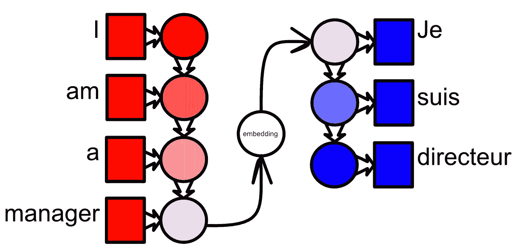

一个简单的序列到序列递归编码器-解码器的信息流概念化。编码器逐步将英语单词一个一个地嵌入到嵌入空间中，然后由解码器进行解构。在此图中，圆圈表示编码器中的嵌入（红色）、中间嵌入空间（白色）以及解码器中的嵌入（蓝色）。在这种情况下，嵌入是长且复杂的向量，包含抽象内容，人类难以直观理解。

这个概念及其小的变体曾经是几年的前沿技术。然而，这种方法的一个问题是整个输入序列必须嵌入到嵌入空间中，这通常是一个固定大小的向量。因此，这些模型很容易忘记过长序列中的内容。**注意力机制旨在缓解将整个输入序列适应到嵌入空间的问题。它通过告诉模型哪些输入与哪些输出相关来实现这一点。** 换句话说，注意力机制允许模型专注于输入的相关部分，忽略其余部分。

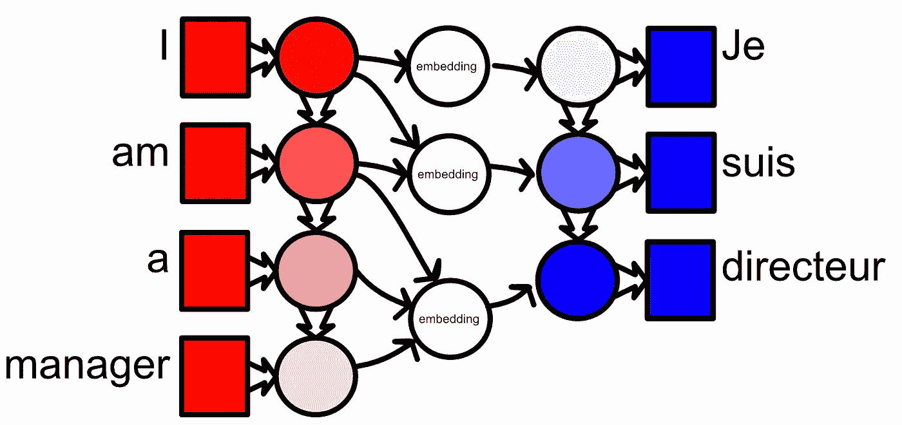

基于注意力的思考过程的一个例子。在法语中，“je”与“我”完全相同。“Suis”是动词“etre”（“to be”）的一个变位形式，并根据主语“I”和动词“am”变成“suis”。“directeur”的选择与“manager”关系密切，但也与该词使用的上下文相关。选择哪些输入与哪些输出相关是注意力机制的任务。

# 从高层次来看注意力是如何工作的

实际上，我们将讨论的注意力机制最终成为一个称为“对齐”分数的矩阵。这些对齐分数编码了输入序列中的一个单词与输出序列中的一个单词之间的关系程度。

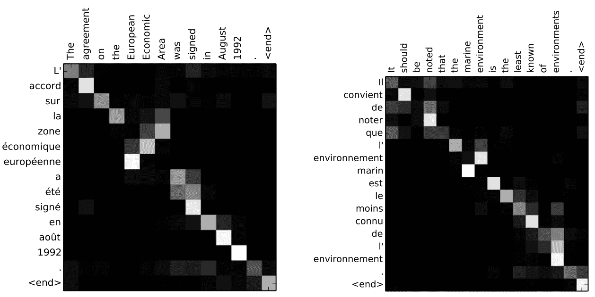

两个注意力矩阵的示例，针对两个不同的英语到法语的例子，来自 [神经机器翻译：通过联合学习对齐和翻译](https://arxiv.org/pdf/1409.0473v7.pdf)(2014)。这篇论文只是间接提到了“注意力”一词，并实际上称之为“对齐模型”。“注意力”这一术语似乎是在事后被普及的。

对齐评分可以通过多种方式计算。我们将坚持使用 2014 年的论文，详细分析其特定的对齐函数：

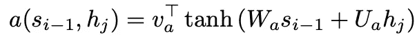

从[《通过联合学习对齐和翻译的神经机器翻译》](https://arxiv.org/pdf/1409.0473v7.pdf)（2014 年）中计算对齐评分。这不是唯一存在的对齐函数，但这是我们将重点关注的函数。“Ua”和“Wa”表示对先前输出嵌入向量（si-1）和特定输入嵌入向量（hj）的可学习变换，而“va”表示将总嵌入向量减少到最终对齐标量的可学习变换。

在计算第 i 个输出的对齐时，这种方法使用解码器的前一个嵌入状态（s_i-1）、一个输入词的嵌入（h_j）以及可学习的参数 W_a、U_a 和 v_a，以计算第 i 个输出与第 j 个输入的对齐。tanh 激活函数被包含以添加非线性，这在训练模型以理解复杂关系时至关重要。

**换句话说，上述函数计算了下一个输出词与单个输入词之间的分数，表示输入词对当前输出的相关性**。该函数在所有输入词（h_j）上运行，以根据当前输出计算所有输入词的对齐评分。


一个关于如何计算给定预测（词 8）的对齐的概念图。对齐函数在解码器的前一个输出嵌入向量与所有输入之间计算，以计算当前输出的注意力。改编自[《通过联合学习对齐和翻译的神经机器翻译》](https://arxiv.org/pdf/1409.0473v7.pdf)（2014 年）

对所有计算出的对齐评分应用 softmax 函数，将其转化为概率。这在文献中被称为“soft-search”或“soft-alignment”。

注意力的具体使用方式可以因实现而异。在[《通过联合学习对齐和翻译的神经机器翻译》](https://arxiv.org/pdf/1409.0473v7.pdf)（2014 年）中，注意力机制决定了向解码器提供哪些输入嵌入向量。

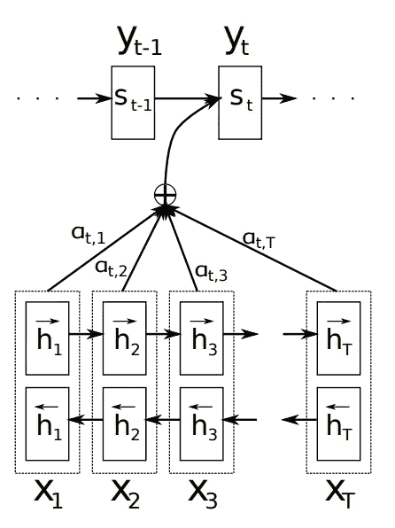

一个图示说明了提出的模型尝试生成第 t 个目标词 yt，给定一个源句子（x1, x2, . . . , xT）。每个输入嵌入向量乘以其相应的对齐评分，然后将它们加在一起形成上下文向量，用于当前解码器输出步骤。来自[《通过联合学习对齐和翻译的神经机器翻译》](https://arxiv.org/pdf/1409.0473v7.pdf)（2014 年）。

这个选择过程通过加权和来完成。所有的输入嵌入向量都乘以它们各自的对齐评分（实际上，大多数对齐评分的值为零，而一个或两个可能的值是 0.8 和 0.2），然后这些加权后的嵌入向量被加在一起，形成特定输出的上下文向量。

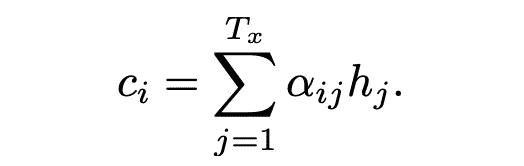

用于第 i 次解码步骤的上下文向量 ci。这是基于对齐得分的所有输入嵌入的加权总和。来自 [Neural Machine Translation by Jointly Learning to Align and Translate](https://arxiv.org/pdf/1409.0473v7.pdf)(2014)。

**上下文向量是所有与当前输出相关的输入的组合。**

下图展示了注意力如何融入整体结构：

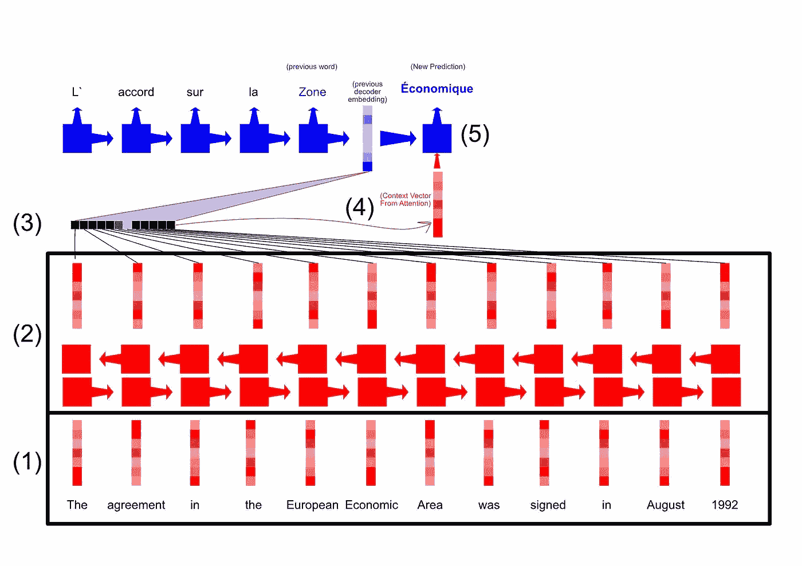

特定输出的信息流的分解。

1.  输入被嵌入到一些初始的向量表示中（例如，使用 word2vect）。

1.  这些通过双向 LSTM 进行处理，以在嵌入之间创建一定的上下文意识。

1.  使用前一个解码器嵌入和对齐函数中的学习参数来计算每个输入的对齐得分。

1.  经过 soft-max 处理的对齐结果会与每个输入相乘，汇总在一起，并用于构建上下文向量。

1.  解码器使用前一个解码器的隐藏状态以及上下文向量来生成当前单词的预测。

在下一部分，我们将实现这个注意力机制的 PyTorch 版本。

# PyTorch 中的注意力。

虽然我最初计划实现整个英语到法语的示例，但显然实现过程将过于冗长，并且包含许多与注意力机制解释无关的复杂性。因此，我创建了一个玩具问题，该问题模拟了英语到法语翻译的语法方面，以专门展示注意力机制，而无需实现 LSTM、嵌入、辅助令牌、批处理、掩码和其他特定问题的组件。

完整代码可以在 [这里](https://github.com/DanielWarfield1/MLWritingAndResearch/blob/main/AttentionDemo.ipynb) 找到，供感兴趣的人参考。

如前所述，英语到法语的翻译可以被认为是两个子问题：对齐和翻译。编码器和解码器中的各种网络翻译值，而注意力机制则重新定位这些向量。换句话说，**注意力完全依赖于对齐。** 为了模拟英语到法语翻译中的对齐问题，定义了以下玩具问题：

给定一些打乱的值输入。

```py
[[ 0\.  1.], [17\. 18.], [10\. 11.], [13\. 14.], [14\. 15.], [ 2\.  3.] ... ]
```

将它们组织成顺序输出：

```py
[[0\. 1.], [1\. 2.], [ 2\.  3.], [ 3\.  4.], [ 4\.  5.], [ 5\.  6.] ...]
```

实际上，给定之前的输出向量，提出给注意力机制的问题是：**在给定的可能输出中，下一个应该出现哪个输出？** 这与英语到法语翻译中的语法问题非常相似，即：**给定先前的输出单词，哪些输入与下一个输出相关？** 因此，通过解决这个玩具问题，我们可以展示注意力机制的强大功能，而不会过于深入细节。

## 定义对齐函数。

回顾对齐函数。


上述讨论的对齐函数，来自于[《通过共同学习对齐和翻译的神经机器翻译》](https://arxiv.org/pdf/1409.0473v7.pdf)(2014)。

这个函数本质上决定了给定前一个输出(si-1)的输入(hj)的权重(α)。这可以直接在 PyTorch 中实现：

```py
"""
Implimenting the alignment function.

The whole idea is that, given an embedding for the encoder and decoder, the
alignment func outputs a scalar raiting the alignment. So, the shapes of
v, W, and U should be such that the output is a scalar.
"""

import torch
import torch.nn.functional as F

#defining the size of the input and output vectors of the attention mechanism
EMBED_DIM = 100

#these need to be sized in such a way that matrix multiplication yields a scalar
#otherwise, they're just general learnable parameters. Different alignment
#functions might have different parameters. For instance, "attention is all you
#need" uses a projection head that generates a query, key, and value, which are
#used in a different self-alignment function. this can allign vectors of different
#lengths
encoder_embedding_dim = EMBED_DIM*2
decoder_embedding_dim = EMBED_DIM

U_attention = torch.rand(EMBED_DIM, encoder_embedding_dim)
W_attention = torch.rand(decoder_embedding_dim, EMBED_DIM)
v_attention = torch.rand(1,EMBED_DIM)

def alignment_func(s, h, W=W_attention, U=U_attention, v=v_attention):
    """
    s: si-1, from the paper, the previous decoder state
    h: hj, from the paper, an input embedding
    W,U,v: trainable parameters

    calculates v*tanh(W*s + U*h), should return the scalar alpha
    """

    v1 = torch.matmul(W,s)
    v2 = torch.matmul(U,h)
    v3 = F.tanh(v1+v2)

    return torch.matmul(v, v3)

#testing the alignment function between one embedded word and another
#dividing by value to get them in a good range for tanh
s = torch.rand(decoder_embedding_dim)/50
h = torch.rand(encoder_embedding_dim)/50
alignment_func(s, h)
```

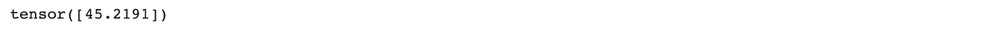

对齐函数的示例输出。一个标量，对应于特定的输入输出对。

## 定义注意机制

对于给定的前一个输出，注意机制的任务是计算应关注哪些输入。这可以通过计算所有输入的对齐度，并将该对齐向量通过 softmax 来完成。

```py
"""
defining attention, wich is a list of softmaxed alignment scores for all input
embeddings (hj) given the previous decoder embedding (si-1). This is equivilent
to a row of the attention matrix, hence the name of the function.
"""

def compute_attention_row(s, hs, W=W_attention, U=U_attention, v=v_attention):
    """
    computes alignments for all h values given s

    s is a vector of length embedding size
    hs is a tensor of shape (sequence length, embedding size)
    the output is a vector of sequence length
    """
    return F.softmax(torch.cat([alignment_func(s, h, W, U, v) for h in hs]),0)

#testing the computation of an allignment row between the previous decoder
#embedding and all encoder embeddings
compute_attention_row(torch.rand(decoder_embedding_dim)/50, torch.rand(10,encoder_embedding_dim)/50)
```

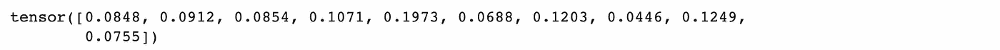

给定输出位置的单个注意向量。

## 定义一个可学习的注意模块

现在我们需要将前面的函数封装到 PyTorch `nn.Module`中。这是以一种计算注意机制产生可追踪梯度的方式实现的，允许通过反向传播更新 U、W 和 V 参数。

此模块还支持不同的编码器和解码器嵌入，这可能在将此模块适应不同应用时非常有用。

```py
"""
Defining the attention module
"""

from torch import nn

#defining the input dimension from the encoder (h) and decoder (s)
encoder_embedding_dim = 10
decoder_embedding_dim = 20

#defining an example sequence length
sequence_length = 15

class Attention(nn.Module):
    """
    -computes an alignment for all encoder embeddings
    -constructs a context vector using those embeddings
    -outputs that context vector
    """

    def __init__(self, embed_dim=EMBED_DIM, encoder_embedding_dim=encoder_embedding_dim, decoder_embedding_dim=decoder_embedding_dim):
        super(Attention, self).__init__()

        #learnable attention parameters
        self.U = nn.Parameter(torch.rand(embed_dim, encoder_embedding_dim), requires_grad=True )
        self.W = nn.Parameter(torch.rand(embed_dim, decoder_embedding_dim), requires_grad=True )
        self.v = nn.Parameter(torch.rand(1,embed_dim), requires_grad=True )
        self.encoder_embedding_dim = encoder_embedding_dim

        if torch.cuda.is_available():
            self.cuda()

    def forward(self, s, hn):
        """
        computes a batch of context vectors given a current the all encoder
        embeddings and the current decoder embedding
        """
        #defining a tensor consisting of a context vector for each batch
        weights = compute_attention_row(s, hn, W=self.W, U=self.U, v=self.v)

        return torch.sum(hn * weights[:, None], axis=0)

print('==== Testing Attention ====')
#testing if the attention mechanism can support different sequence lengths
#and embedding dimensions
test_attention = Attention()

#defining previous decoder state
s = torch.rand(decoder_embedding_dim)/50
#defining input embeddings
hn = torch.rand(sequence_length, encoder_embedding_dim)/50

test_attention(s, hn).shape
```

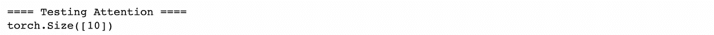

创建长度为 10 的上下文向量。这是合理的，因为输入嵌入的长度为 10，这种注意技术的输出是一个上下文向量，即所有输入嵌入的加权和。

## 训练

现在我们可以训练注意模块来解决玩具问题。这是通过生成 X/Y 对（一个相应的混洗和未混洗的集合），然后迭代每个输出应该是什么，并在模型错误时调整权重来完成的。

```py
""" Training Attention

Essentially, this generates random X/Y pairs, and trains the model to predict
each output given the previous correct output and all of the inputs.

This is a proof of concept. In reality using minibatches, better initializations, and
stochastically providing the true previous output occasionally would probably improve
convergence and generalizability.
"""

import random
from tqdm import tqdm
import numpy as np
import matplotlib.pyplot as plt

min_len = 5
max_len = 20

test_attention = Attention(20,2,2)
loss_fn = nn.MSELoss()
optimizer = torch.optim.SGD(test_attention.parameters(), lr=1e-3, momentum=0.9)
lr_phase = 0

#training on some number of random sequences
batch_losses = []
for i in tqdm(range(800)):

    #generating x and y
    y = []
    x = []
    for j in range(random.randint(min_len,max_len)):
        y.append([j+1, j+2])
        x.append([j+1,j+2])
    random.shuffle(x)
    x = np.array([[0,1]] + x).astype(np.float32)
    y = np.array([[0,1]] + y).astype(np.float32)
    x = torch.from_numpy(x)
    y = torch.from_numpy(y)

    #iterating over all training examples (given s predict s+1)
    s_in = x[0]
    sample_losses = []
    for j in range(2,len(x)):

        y_this = y[j]

        optimizer.zero_grad()
        s_out = test_attention(s_in, x)

        loss = loss_fn(s_out, y_this)
        sample_losses.append(loss.detach())

        loss.backward(retain_graph=True)
        optimizer.step()

        s_in = torch.clone(y_this).detach()

    batch_loss = np.mean(sample_losses)
    batch_losses.append(batch_loss)

    #hacking together a simple learning rate scheduler
    if batch_loss<0.05 and lr_phase == 0:
        optimizer = torch.optim.SGD(test_attention.parameters(), lr=1e-4, momentum=0.9)
        lr_phase+=1

    #stopping training when loss is good enough
    if batch_loss<0.03:
        break

plt.plot(batch_losses)
```

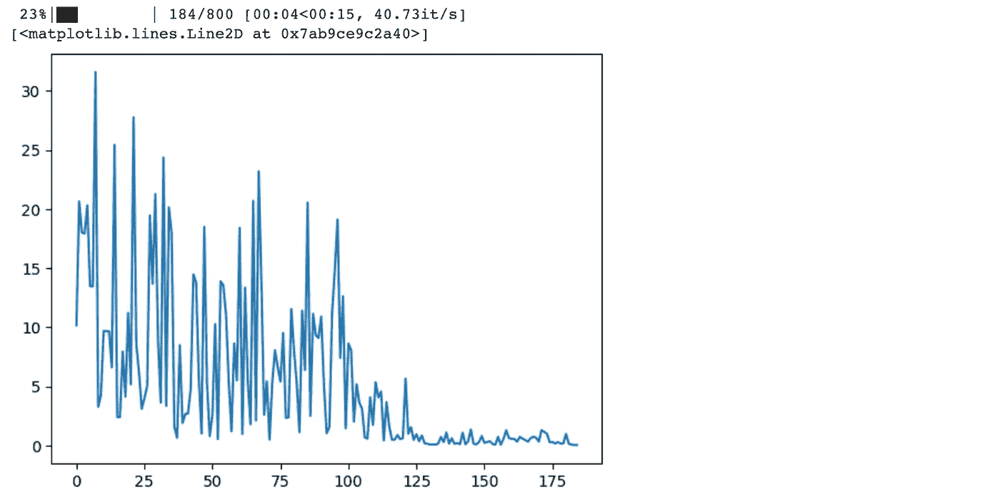

训练损失。如实现中所述，训练过程可以显著改进，以促进更好的收敛，但这对于我们的示例来说已足够。

# 结果

使用以下代码，我们可以生成一个随机混洗的序列，并让我们的注意模型对其进行排序。

```py
"""
Visualizing alignment
"""

#generating x
x = []
for j in range(1, random.randint(min_len,max_len)):
    x.append([j,j+1])
random.shuffle(x)

x = np.array([[0,1]] + x).astype(np.float32)
x = torch.from_numpy(x)

#Extracting learned parameters for generating alignment visual
W = test_attention.W
U = test_attention.U
v = test_attention.v

s = x[0]
y_hat = []
rows = []

#predicting the next element in the sequence.
#skipping over the trivia first, and not predicting one after the last.
for _ in range(0,len(x)-1):

    #computing attention weights for this output, for visualization purposes
    row = list(compute_attention_row(s, x, W=W, U=U, v=v).detach().numpy())
    rows.append(row)

    #predicting what should be in this location.
    with torch.no_grad():
        s = torch.round(test_attention(s, x))

    y_hat.append(list(s))

#converting to numpy arrays
y_hat = np.array(y_hat)
x_p = np.array(x)

#printing intputs and predicted outputs
print('input: ')
print(x_p)
print('output: ')
print(y_hat)

#generating attention matrix plot
from matplotlib.ticker import MaxNLocator
alignments = np.array(rows)
plt.pcolormesh(alignments, edgecolors='k', linewidth=2)
ax = plt.gca()
ax.set_aspect('equal')
ax.yaxis.set_major_locator(MaxNLocator(integer=True))
ax.xaxis.set_major_locator(MaxNLocator(integer=True))
plt.title('Algnment scores used in attention')
plt.ylabel('output index (each row is attention for an output)')
plt.xlabel('input index')
plt.show()
```

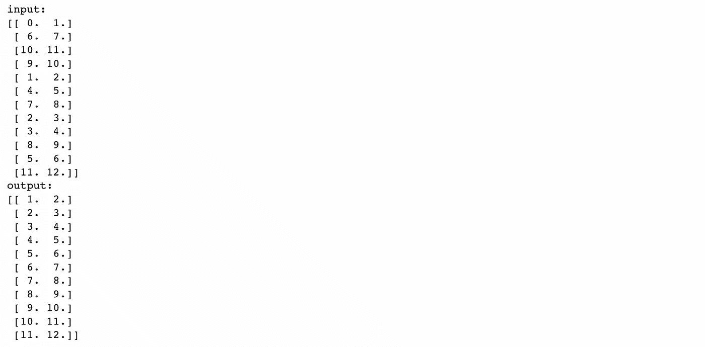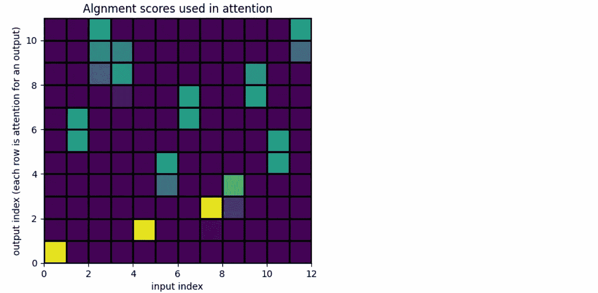

混洗后的输入、模型输出和对齐分数。

基于输出处理方式的一些伪影，但正如你所见，注意机制正确地将输入解混洗！

# 讨论

我们创建了一个通用的对齐模块，可以在更大的网络中使用，以关注关键信息。这直接受到用于英法翻译的模块的启发，但可以应用于各种应用场景。

# 关注更多！

在未来的文章中，我还将描述机器学习领域的几篇里程碑论文，重点是实际和直观的解释。变换器中使用的注意机制与这个注意机制有些不同，我会在未来的帖子中详细讲解。

**请点赞、分享并关注。作为独立作者，你的支持确实能产生巨大的影响！**

**署名：** 本文档中的所有图片均由**丹尼尔·沃菲尔德**创作，除非另有来源说明。你可以将本文中的任何图片用于你的非商业目的，只要你引用这篇文章，[`danielwarfield.dev`](https://danielwarfield.dev/)，或两者都引用。
