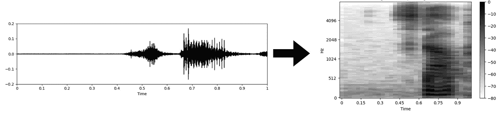
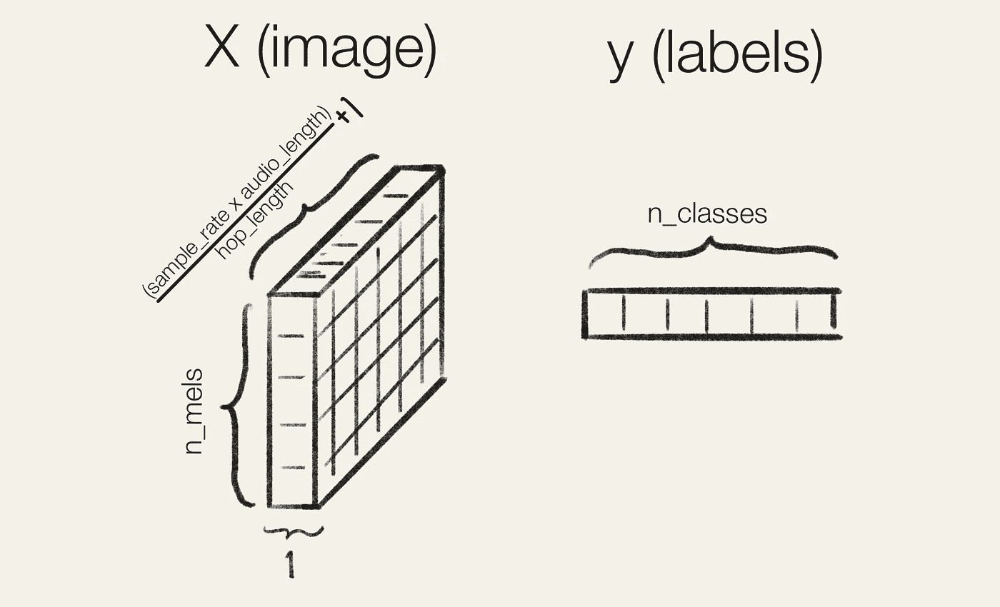
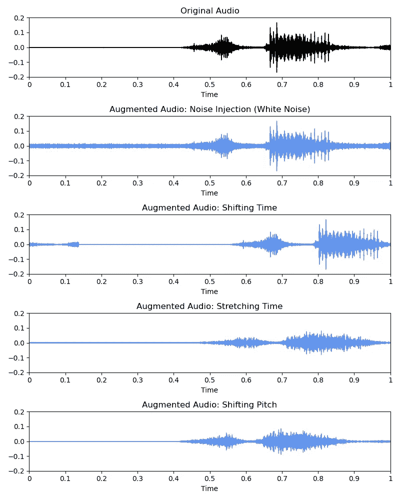

# 使用 Python 进行深度学习的音频分类

> 原文：[`towardsdatascience.com/audio-classification-with-deep-learning-in-python-cf752b22ba07`](https://towardsdatascience.com/audio-classification-with-deep-learning-in-python-cf752b22ba07)

## Kaggle 蓝图

## 调整图像模型以应对领域迁移和类别不平衡，使用 PyTorch 和 torchaudio 处理音频数据

[](https://medium.com/@iamleonie?source=post_page-----cf752b22ba07--------------------------------)[](https://towardsdatascience.com/?source=post_page-----cf752b22ba07--------------------------------) [Leonie Monigatti](https://medium.com/@iamleonie?source=post_page-----cf752b22ba07--------------------------------)

·发表在[Towards Data Science](https://towardsdatascience.com/?source=post_page-----cf752b22ba07--------------------------------) ·阅读时间 10 分钟·2023 年 4 月 4 日

--


使用机器学习对声音景观中的鸟鸣进行分类（图片由作者绘制）

欢迎来到另一期的“Kaggle 蓝图”，在这里我们将分析[Kaggle](https://www.kaggle.com/)比赛的获胜解决方案，以寻找可以应用于我们自己数据科学项目的经验教训。

本期将回顾[“BirdCLEF 2022”](https://www.kaggle.com/competitions/birdclef-2022)比赛中的技术和方法，该比赛于 2022 年 5 月结束。

# 问题陈述：具有领域迁移的音频分类

[“BirdCLEF 2022”](https://www.kaggle.com/competitions/birdclef-2022)比赛的目标是通过声音识别夏威夷鸟类。参赛者提供了单个鸟鸣的短音频文件，并要求预测特定鸟类是否出现在更长的录音中。

[](https://www.kaggle.com/competitions/birdclef-2022/?source=post_page-----cf752b22ba07--------------------------------) [## BirdCLEF 2022

### 在声音景观中识别鸟鸣

www.kaggle.com](https://www.kaggle.com/competitions/birdclef-2022/?source=post_page-----cf752b22ba07--------------------------------)

与普通的音频分类问题相比，此次比赛增加了以下挑战：

+   **领域偏移** — 训练数据由单一鸟类叫声的干净音频录音组成，且没有其他声音（几秒钟，长度不同）。然而，测试数据则由“在野外”录制的较长（1 分钟）“不干净”录音组成，并包含了除了鸟叫声之外的其他声音（例如风、雨、其他动物等）。


音频数据中的领域偏移

+   **类别不平衡/少样本学习** — 由于某些鸟类比其他鸟类更为稀有，我们面临长尾类别分布的问题，其中一些鸟类只有一个样本。


长尾类别分布

*在这里插入你的数据！* — 为了跟随本文，你的数据集应如下所示：


在这里插入你的数据：你的音频数据集数据框应该如何格式化

# 将音频分类视为图像分类问题，并使用深度学习方法

竞争对手们在解决这个音频分类问题时，通常会采用以下方法：

1.  将音频分类问题转换为图像分类问题，方法是将音频从波形转换为梅尔谱图，并应用深度学习模型

1.  对波形和谱图中的音频数据应用数据增强，以应对领域偏移和类别不平衡

1.  微调预训练图像分类模型，以应对类别不平衡

本文将使用 PyTorch（版本 1.13.0）作为深度学习框架，以及 `[torchaudio](https://pytorch.org/audio/stable/index.html)`（版本 0.13.0）和 `[librosa](https://librosa.org/doc/main/index.html)`（版本 0.10.0）进行音频处理。此外，我们还将使用 `[timm](https://timm.fast.ai/)`（版本 0.6.12）进行预训练图像模型的微调。

```py
# Deep Learning framework
import torch
import torch.nn as nn
import torch.optim as optim
import torch.nn.functional as F
from torch.optim import lr_scheduler
from torch.utils.data import Dataset, DataLoader

# Audio processing
import torchaudio
import torchaudio.transforms as T
import librosa

# Pre-trained image models
import timm
```

# 准备工作：熟悉音频数据

在开始解决音频分类问题之前，让我们首先熟悉处理音频数据。你可以使用 `torchaudio` 库或 `librosa` 库中的 `.load()` 方法从不同的文件格式（例如 .wav、.ogg 等）加载音频及其采样率。

```py
PATH = "audio_example.wav"

# Load a sample audio file with torchaudio
original_audio, sample_rate = torchaudio.load(PATH)

# Load a sample audio file with librosa
original_audio, sample_rate = librosa.load(PATH, 
                                           sr = None) # Gotcha: Set sr to None to get original sampling rate. Otherwise the default is 22050
```

如果你想直接在 Jupyter notebook 中收听加载的音频进行探索，可以使用以下代码提供音频播放器。

```py
# Play the audio in Jupyter notebook
from IPython.display import Audio

Audio(data = original_audio, rate = sample_rate)
```


在 Jupyter notebook 中显示加载数据的音频播放器

`[librosa](https://librosa.org/doc/main/index.html)` 库还提供了各种方法来快速显示音频数据以供探索。如果你使用 `[torchaudio](https://pytorch.org/audio/stable/index.html)` 加载音频文件，请确保将张量转换为 NumPy 数组。

```py
import librosa.display as dsp
dsp.waveshow(original_audio, sr = sample_rate);
```


“Speech Commands” 数据集中的单词“stop”原始音频数据（波形）[0]

# 步骤 1：将音频分类问题转换为图像分类问题

一种使用深度学习模型对音频数据建模的流行方法是将 *“计算机听觉”* 问题转化为 *计算机视觉* 问题 [2]。具体来说，波形音频被转换为 Mel 频谱图（这是一种图像），如下所示。



将音频文件从波形（时域）转换为 Mel 频谱图（频域）

通常，你会使用快速傅里叶变换（FFT）来计算性地将音频信号从时域（波形）转换到频域（频谱图）。

然而，FFT 会给出整个音频信号时间序列的整体频率成分。因此，在将音频数据从时域转换到频域时，你会丢失时间信息。

除了 FFT，你还可以使用短时傅里叶变换（STFT）来保留时间信息。STFT 是 FFT 的一种变体，通过使用滑动时间窗口将音频信号分成更小的部分。它对每个部分进行 FFT，然后将它们组合起来。

+   `n_fft` — 滑动窗口的长度（默认值：2048）

+   `hop_length` — 窗口滑动的样本数（默认值：512）。`hop_length` 将直接影响生成图像的大小。如果你的音频数据具有固定长度，并且你希望将波形转换为固定图像大小，你可以设置 `hop_length = audio_length // (image_size[1] — 1)`


短时傅里叶变换（STFT）

接下来，你将把幅度转换为分贝，并根据 Mel 频率尺度对频率进行分箱。为此，`n_mels` 是频带数量（Mel 频带）。这将决定生成的频谱图的高度。


将幅度转换为分贝并对频谱应用 Mel 分箱

关于 Mel 频谱图的详细解释，我推荐这篇文章：

[](https://medium.com/analytics-vidhya/understanding-the-mel-spectrogram-fca2afa2ce53?source=post_page-----cf752b22ba07--------------------------------) [## 了解 Mel 频谱图

### （以及信号处理中的其他主题）

medium.com](https://medium.com/analytics-vidhya/understanding-the-mel-spectrogram-fca2afa2ce53?source=post_page-----cf752b22ba07--------------------------------)

下面你可以看到一个示例 PyTorch `Dataset`，它加载一个音频文件，并在经过一些预处理步骤后将波形转换为 Mel 频谱图。

```py
class AudioDataset(Dataset):
    def __init__(self, 
                df, 
                target_sample_rate= 32000, 
                audio_length
                wave_transforms=None,
                spec_transforms=None):
        self.df = df
        self.file_paths = df['file_path'].values
        self.labels = df[['class_0', ..., 'class_N']].values
        self.target_sample_rate = target_sample_rate
        self.num_samples = target_sample_rate * audio_length
        self.wave_transforms = wave_transforms
        self.spec_transforms = spec_transforms

    def __len__(self):
        return len(self.df)

    def __getitem__(self, index):

        # Load audio from file to waveform
        audio, sample_rate = torchaudio.load(self.file_paths[index])

        # Convert to mono
        audio = torch.mean(audio, axis=0)

        # Resample
        if sample_rate != self.target_sample_rate:
            resample = T.Resample(sample_rate, self.target_sample_rate)
            audio = resample(audio)

        # Adjust number of samples
        if audio.shape[0] > self.num_samples:
            # Crop
            audio = audio[:self.num_samples]
        elif audio.shape[0] < self.num_samples:
            # Pad
            audio = F.pad(audio, (0, self.num_samples - audio.shape[0]))

        # Add any preprocessing you like here 
        # (e.g., noise removal, etc.)
        ...

        # Add any data augmentations for waveform you like here
        # (e.g., noise injection, shifting time, changing speed and pitch)
        ...

        # Convert to Mel spectrogram
        melspectrogram = T.MelSpectrogram(sample_rate = self.target_sample_rate, 
                                        n_mels = 128, 
                                        n_fft = 2048, 
                                        hop_length = 512)
        melspec = melspectrogram(audio)

        # Add any data augmentations for spectrogram you like here
        # (e.g., Mixup, cutmix, time masking, frequency masking)
        ...

        return {"image": torch.stack([melspec]), 
                "label": torch.tensor(self.labels[index]).float()}
```

你生成的数据集在喂给神经网络之前应产生类似这样的样本：



音频数据集中的样本结构

# 步骤 2：对音频数据应用增强

针对本次竞赛的领域转换和类别不平衡挑战，采用了对训练数据应用数据增强的技术 [5, 8, 10, 11]。你可以对波形和谱图的音频数据应用数据增强。`[torchaudio](https://pytorch.org/audio/stable/index.html)` 库已经提供了许多不同的音频数据增强方法。

在**波形（时间域）**中流行的音频数据增强技术有：

+   噪声注入，如白噪声、有色噪声或背景噪声 (`[AddNoise](https://pytorch.org/audio/stable/generated/torchaudio.transforms.AddNoise.html#torchaudio.transforms.AddNoise)`)

+   时间转换

+   改变速度 (`[Speed](https://pytorch.org/audio/stable/generated/torchaudio.transforms.Speed.html#torchaudio.transforms.Speed)`；或者使用 `[TimeStretch](https://pytorch.org/audio/stable/generated/torchaudio.transforms.TimeStretch.html#torchaudio.transforms.TimeStretch)` 频率域)

+   改变音高 (`[PitchShift](https://pytorch.org/audio/stable/generated/torchaudio.transforms.PitchShift.html#torchaudio.transforms.PitchShift)`)



不同音频增强技术概述：噪声注入（白噪声、有色噪声、背景噪声）、时间转换、速度和音高变化

在**谱图（频率域）**中流行的音频数据增强技术有：

+   像 Mixup [13] 或 Cutmix [3] 这样的流行图像增强技术


用于谱图的数据增强：Mixup [13]

+   SpecAugment [7] (`[FrequencyMasking](https://pytorch.org/audio/stable/generated/torchaudio.transforms.FrequencyMasking.html#torchaudio.transforms.FrequencyMasking)` 和 `[TimeMasking](https://pytorch.org/audio/stable/generated/torchaudio.transforms.TimeMasking.html#torchaudio.transforms.TimeMasking)`)


用于谱图的数据增强：SpecAugment [7]

如你所见，虽然提供了很多音频增强方法，`[torchaudio](https://pytorch.org/audio/stable/index.html)` 并未提供所有提议的数据增强方法。

因此，如果你想注入特定类型的噪声、时间转换，或应用 Mixup [13] 或 Cutmix [12] 数据增强，你必须 [编写自定义数据增强代码（PyTorch）](https://pytorch.org/tutorials/beginner/data_loading_tutorial.html#transforms)。你可以参考这个 音频数据增强技术集合 以了解它们的实现：

[](/data-augmentation-techniques-for-audio-data-in-python-15505483c63c?source=post_page-----cf752b22ba07--------------------------------) ## Python 中的音频数据增强技术

### 如何用 librosa、numpy 和 PyTorch 对波形（时间域）和谱图（频率域）进行音频增强

towardsdatascience.com

在之前的 PyTorch `Dataset` 类示例中，你可以按照以下方式应用数据增强：

```py
class AudioDataset(Dataset):
    def __init__(self, 
                df, 
                target_sample_rate= 32000, 
                audio_length):
        self.df = df
        self.file_paths = df['file_path'].values
        self.labels = df[['class_0', ..., 'class_N']].values
        self.target_sample_rate = target_sample_rate
        self.num_samples = target_sample_rate * audio_length

    def __len__(self):
        return len(self.df)

    def __getitem__(self, index):

        # Load audio from file to waveform
        audio, sample_rate = torchaudio.load(self.file_paths[index])

        # Add any preprocessing you like here 
        # (e.g., converting to mono, resampling, adjusting size, noise removal, etc.)
        ...

        # Add any data augmentations for waveform you like here
        # (e.g., noise injection, shifting time, changing speed and pitch)
        wave_transforms = T.PitchShift(sample_rate, 4)
        audio = wave_transforms(audio)

        # Convert to Mel spectrogram
        melspec = ...

        # Add any data augmentations for spectrogram you like here
        # (e.g., Mixup, cutmix, time masking, frequency masking)
        spec_transforms = T.FrequencyMasking(freq_mask_param=80)
        melspec = spec_transforms(melspec)

        return {"image": torch.stack([melspec]), 
                "label": torch.tensor(self.labels[index]).float()}
```

# 第 3 步：针对少样本学习微调预训练的图像分类模型

在这次比赛中，我们面临着类别不平衡的问题。由于一些类别只有一个样本，我们正在处理少样本学习问题。Nakamura 和 Harada [6] 在 2019 年表明，微调可能是少样本学习的有效方法。

很多竞争者[2, 5, 8, 10, 11]微调了常见的预训练图像分类模型，例如

+   EfficientNet（例如，`tf_efficientnet_b3_ns`）[9]，

+   SE-ResNext（例如，`se_resnext50_32x4d`）[3]，

+   NFNet（例如，`eca_nfnet_l0`）[1]

你可以使用`[timm](https://timm.fast.ai/)`库加载任何预训练的图像分类模型进行微调。确保将`in_chans = 1`设置为 1，因为我们处理的是 1 通道 Mel 谱图而不是 3 通道图像。

```py
class AudioModel(nn.Module):
    def __init__(self, 
                model_name = 'tf_efficientnet_b3_ns',
                pretrained = True, 
                num_classes):
        super(AudioModel, self).__init__()

        self.model = timm.create_model(model_name, 
                                       pretrained = pretrained, 
                                       in_chans = 1)
        self.in_features = self.model.classifier.in_features
        self.model.classifier = nn.Sequential(
              nn.Linear(self.in_features, num_classes)
          )

    def forward(self, images):
        logits = self.model(images)
        return logits
```

其他竞争者报告了在类似音频分类问题上微调预训练模型的成功[4, 10]。

微调使用余弦退火学习率调度器（`[CosineAnnealingLR](https://pytorch.org/docs/stable/generated/torch.optim.lr_scheduler.CosineAnnealingLR.html#torch.optim.lr_scheduler.CosineAnnealingLR)`）进行几个周期[2, 8]。

```py
scheduler = torch.optim.lr_scheduler.CosineAnnealingLR(optimizer,
                              T_max = ..., # Maximum number of iterations.
                              eta_min = ...) # Minimum learning rate.
```


PyTorch 余弦退火/衰减学习率调度器（图像由作者提供，原文发表于[“PyTorch 学习率调度器视觉指南”](https://medium.com/towards-data-science/a-visual-guide-to-learning-rate-schedulers-in-pytorch-24bbb262c863#fad1)）

你可以在这个深度学习模型微调指南中找到更多提示和最佳实践：

[](/intermediate-deep-learning-with-transfer-learning-f1aba5a814f?source=post_page-----cf752b22ba07--------------------------------) ## 中级深度学习与迁移学习

### 这是一本实用指南，介绍了用于计算机视觉和自然语言处理的深度学习模型微调。

towardsdatascience.com

# 总结

从 Kagglers 在[“BirdCLEF 2022”](https://www.kaggle.com/competitions/birdclef-2022)比赛期间创建的学习资源中，我们可以学到更多经验。这类问题陈述也有许多不同的解决方案。

在这篇文章中，我们集中讨论了许多竞争者中流行的一般方法：

1.  通过将音频从波形转换为 Mel 谱图并应用深度学习模型，将音频分类问题转化为图像分类问题

1.  将数据增强应用于波形和谱图中的音频数据以应对领域迁移和类别不平衡

1.  微调预训练的图像分类模型以应对类别不平衡

# 享受这个故事了吗？

[*免费订阅*](https://medium.com/subscribe/@iamleonie) *以便在我发布新故事时获得通知。*

[](https://medium.com/@iamleonie/subscribe?source=post_page-----cf752b22ba07--------------------------------) [## 当 Leoni Monigatti 发布时，获取电子邮件通知。

### 当 Leoni Monigatti 发布时，获取电子邮件通知。通过注册，你将创建一个 Medium 账户（如果你还没有的话）…

medium.com](https://medium.com/@iamleonie/subscribe?source=post_page-----cf752b22ba07--------------------------------)

*在* [*LinkedIn*](https://www.linkedin.com/in/804250ab/)、[*Twitter*](https://twitter.com/helloiamleonie) *和* [*Kaggle*](https://www.kaggle.com/iamleonie) *上找到我！*

# 参考文献

## 数据集

由于原始比赛数据不允许商业使用，示例使用了以下数据集。

[0] Warden P. Speech Commands: 一个用于单词语音识别的公共数据集，2017。可从 [`download.tensorflow.org/data/speech_commands_v0.01.tar.gz`](http://download.tensorflow.org/data/speech_commands_v0.01.tar.gz) 获取

许可证：CC-BY-4.0

## 图像参考

除非另有说明，所有图像均由作者创建。

## 网络与文献

[1] Brock, A., De, S., Smith, S. L., & Simonyan, K. (2021 年 7 月). 高性能大规模图像识别，无需归一化。在 *国际机器学习会议* (第 1059–1071 页)。PMLR。

[2] [Chai Time Data Science](https://www.youtube.com/@ChaiTimeDataScience) (2022). [BirdCLEF 2022: 第 11 位 Pos Gold 解决方案 | Gilles Vandewiele](https://www.youtube.com/watch?v=MXZKNnuoQXw) (访问日期：2023 年 3 月 13 日)

[3] Hu, J., Shen, L., & Sun, G. (2018). Squeeze-and-excitation 网络。在 *IEEE 计算机视觉与模式识别会议论文集* (第 7132–7141 页)。

[4] Kramarenko Vladislav (2022). [第四名](https://www.kaggle.com/competitions/birdclef-2022/discussion/326987) 在 Kaggle 讨论中 (访问日期：2023 年 3 月 13 日)

[5] LeonShangguan (2022). [[公共 #1 私人 #2] + [私人 #7/8 (潜在)] 解决方案。主持人获胜。](https://www.kaggle.com/competitions/birdclef-2022/discussion/326950) 在 Kaggle 讨论中 (访问日期：2023 年 3 月 13 日)

[6] Nakamura, A., & Harada, T. (2019). 重新审视少样本学习的微调。*arXiv 预印本 arXiv:1910.00216*。

[7] Park, D. S., Chan, W., Zhang, Y., Chiu, C. C., Zoph, B., Cubuk, E. D., & Le, Q. V. (2019). Specaugment: 一种用于自动语音识别的简单数据增强方法。*arXiv 预印本 arXiv:1904.08779*。

[8] slime (2022). [第三名解决方案](https://www.kaggle.com/competitions/birdclef-2022/discussion/327193) 在 Kaggle 讨论中 (访问日期：2023 年 3 月 13 日)

[9] Tan, M., & Le, Q. (2019 年 5 月). Efficientnet: 重新思考卷积神经网络的模型缩放。在*国际机器学习会议*（第 6105–6114 页）。PMLR。

[10] Volodymyr (2022). [第一名解决方案模型（这不是全部 BirdNet）](https://www.kaggle.com/competitions/birdclef-2022/discussion/327047) 在 Kaggle 讨论区（访问日期：2023 年 3 月 13 日）

[11] yokuyama (2022). [第五名解决方案](https://www.kaggle.com/competitions/birdclef-2022/discussion/327044) 在 Kaggle 讨论区（访问日期：2023 年 3 月 13 日）

[12] Yun, S., Han, D., Oh, S. J., Chun, S., Choe, J., & Yoo, Y. (2019). Cutmix: 一种用于训练强分类器的正则化策略，具有可定位特征。在*IEEE/CVF 国际计算机视觉会议论文集*（第 6023–6032 页）。

[13] Zhang, H., Cisse, M., Dauphin, Y. N., & Lopez-Paz, D. (2017) mixup: 超越经验风险最小化。arXiv 预印本 arXiv:1710.09412。
