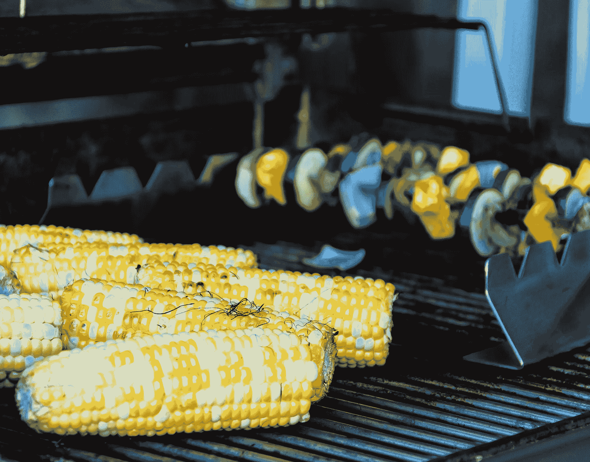

# 八月刊：数据科学家的夏季读物

> 原文：[`towardsdatascience.com/august-edition-summer-reads-for-data-scientists-52d5ad64835b?source=collection_archive---------8-----------------------#2023-08-02`](https://towardsdatascience.com/august-edition-summer-reads-for-data-scientists-52d5ad64835b?source=collection_archive---------8-----------------------#2023-08-02)

## [月刊](https://towardsdatascience.com/tagged/monthly-edition)

## 寻找一些启发性、引人入胜、发人深省的文章？你来对地方了

 [TDS 编辑](https://towardsdatascience.medium.com/?source=post_page-----52d5ad64835b--------------------------------)

·

[关注](https://medium.com/m/signin?actionUrl=https%3A%2F%2Fmedium.com%2F_%2Fsubscribe%2Fuser%2F7e12c71dfa81&operation=register&redirect=https%3A%2F%2Ftowardsdatascience.com%2Faugust-edition-summer-reads-for-data-scientists-52d5ad64835b&user=TDS+Editors&userId=7e12c71dfa81&source=post_page-7e12c71dfa81----52d5ad64835b---------------------post_header-----------) 发表在 [Towards Data Science](https://towardsdatascience.com/?source=post_page-----52d5ad64835b--------------------------------) ·4 min read·2023 年 8 月 2 日

--

图片来源：[Hari Nandakumar](https://unsplash.com/@hariprasad000?utm_source=medium&utm_medium=referral) 在 [Unsplash](https://unsplash.com/?utm_source=medium&utm_medium=referral)

现在是重新评估什么算作引人入胜的夏季阅读材料的时候了吗？我们认为是时候了。传统观念（以及许多市场部门）会让我们相信，温暖的天气和较慢的节奏要求低投入、低回报的娱乐活动：如果你愿意的话，可以把它看作是知识上的冰棒。

我们的作者们有不同看法。在过去几周中，我们分享了许多聪明而发人深省的文章，他们找到了愿意探讨复杂主题的接受者。成功的关键可能在于执行：如果一篇文章有吸引力的语调，并帮助我们扩展对当前数据科学和机器学习场景的认知，那么它就可以成为泳池边、火车上或者露营中的消遣。

我们希望您喜欢我们八月份那些富有启发性且易于阅读的选择。在我们深入探讨之前，我们还想感谢您的支持，特别向那些愿意通过[成为 Medium 会员](https://bit.ly/tds-membership)做出有意义贡献的人致以特别的感谢。

谈到[Medium](https://medium.com/u/504c7870fdb6?source=post_page-----52d5ad64835b--------------------------------)：这个平台对社区和讲故事的庆祝即将到来，TDS 的作家和读者都受到热烈邀请。Medium Day 将于 8 月 12 日举行，[注册仍在进行中](https://blog.medium.com/register-now-for-medium-day-80c68f97d011)（免费）。到时见？

[TDS 编辑](https://medium.com/u/7e12c71dfa81?source=post_page-----52d5ad64835b--------------------------------)

## TDS 编辑精选

+   **到底女性都在哪里？**（2023 年 7 月，10 分钟）

    最近几个月来，我们看到了许多关于大型语言模型输出中偏见的片段性报道。[Yennie Jun](https://medium.com/u/12ca1ab81192?source=post_page-----52d5ad64835b--------------------------------)的一项启发性研究采用了系统化方法，展示了语言模型在性别平等方面的深层问题。该研究强调，在 AI 工具完全普及到教育领域之前，解决这些偏见的重要性。

+   **普遍生成 AI 的环境影响**（2023 年 7 月，15 分钟）

    “如果数十亿人开始每天广泛使用生成 AI，环境影响会如何？”也许我们离 AI 像*那样*普及的时刻还很远，但[Kasper Groes Albin Ludvigsen](https://medium.com/u/ba0b31bed21a?source=post_page-----52d5ad64835b--------------------------------)现在就推动我们考虑技术对气候的影响，现在还有机会塑造其未来方向。

+   **全球数据晴雨表：世界上开放数据的当前状态是什么？**（2023 年 7 月，8 分钟）

    政府发布的公开数据集的快速增长可能会让一些人认为我们正处于一个开放数据的黄金时代。[迪亚·巴尔多希](https://medium.com/u/d61c58ba988e?source=post_page-----52d5ad64835b--------------------------------)对数据可访问性和治理的概述采用全球视角，描绘了一个更复杂的故事：尽管取得了很大进展，但仍面临许多挑战（这些挑战往往在各地区和国家之间分布不均）。

+   **ChatGPT 真的智能吗？**（2023 年 7 月，11 分钟）

    如果你对夏季阅读的定义包括一个大而引人注目的问题和一个细致而深思的答案，你会喜欢[蓝楚](https://medium.com/u/3916743f0e10?source=post_page-----52d5ad64835b--------------------------------)的最新文章。ChatGPT 等工具的当前和未来能力引发了激烈的争论，蓝楚的深度探讨是理解这些工具如何工作——以及为什么它们仍然远未具备类似人类的理解（更不用说意识）——的有用资源。

+   **迈布里奇德比：用人工智能赋予动物运动照片生命**（2023 年 7 月，16 分钟）

    爱德华·迈布里奇的*马的运动*照片序列标志着 19 世纪后半叶新兴电影技术的到来；[罗伯特·A·冈萨尔维斯](https://medium.com/u/c97e6c73c13c?source=post_page-----52d5ad64835b--------------------------------)利用这些动态图像展示了最近创新——生成性人工智能——在需求驱动下产生迷人视觉效果的力量。

+   **数据科学能找到大脚怪吗？**（2023 年 5 月，14 分钟）

    对于数据科学家来说，利用核心工作流——如探索性数据分析、聚类和可视化——来追踪世界上最著名的神秘生物之一，还有什么比这更有趣的呢？[布拉德利·斯蒂芬·肖](https://medium.com/u/c5cd0a58b5ae?source=post_page-----52d5ad64835b--------------------------------)以半开玩笑的方式尝试寻找大脚怪，展示了即使从最不可能的来源中也可以挖掘出有趣的见解。

## 原创特色

探索我们最新的资源和阅读推荐。

+   **关注 TDS 列表，发现我们最好的文章** 充分利用我们最近推出（并频繁更新）的 Medium 列表，找到我们推荐的所有文章。

+   **让数据团队获得成功的决策** 我们精心策划的文章集合，关于那些帮助数据团队脱颖而出、执行良好并产生可持续结果的选择。

## 热门文章

如果你错过了这些，这里是上个月 TDS 最受欢迎的文章。

+   **Pandas 2.0：数据科学家的游戏规则改变者？** 作者：[Miriam Santos](https://medium.com/u/243289394aaa?source=post_page-----52d5ad64835b--------------------------------)

+   **ChatGPT 代码解释器：它如何为我节省了数小时的工作** 作者：[Soner Yıldırım](https://medium.com/u/2cf6b549448?source=post_page-----52d5ad64835b--------------------------------)

+   **在本地使用 CPU 推理运行 Llama 2 进行文档问答** 作者：[Kenneth Leung](https://medium.com/u/dcd08e36f2d0?source=post_page-----52d5ad64835b--------------------------------)

+   **用三种难度级别解释向量数据库** 作者：[Leonie Monigatti](https://medium.com/u/3a38da70d8dc?source=post_page-----52d5ad64835b--------------------------------)

+   **在 Colab 笔记本中微调你自己的 Llama 2 模型** 作者：[Maxime Labonne](https://medium.com/u/dc89da634938?source=post_page-----52d5ad64835b--------------------------------)

+   **从分析到实际应用：客户生命周期价值的案例** 作者：[Katherine Munro](https://medium.com/u/b84716d39740?source=post_page-----52d5ad64835b--------------------------------)

我们非常高兴在 6 月迎来了新一批 TDS 作者——他们包括[维亚切斯拉夫·朱可夫](https://medium.com/u/996e241eda9b?source=post_page-----52d5ad64835b--------------------------------)、[库洛德·艾拉米](https://medium.com/u/9c6a36490614?source=post_page-----52d5ad64835b--------------------------------)、[赫特·特里维迪](https://medium.com/u/ce8ebd0c262c?source=post_page-----52d5ad64835b--------------------------------)、[迈克·琼斯](https://medium.com/u/253ada1cc4c9?source=post_page-----52d5ad64835b--------------------------------)、[费利克斯·范·德伦](https://medium.com/u/dfe1ea06bab8?source=post_page-----52d5ad64835b--------------------------------)、[沙哈尔·戴维森](https://medium.com/u/fa5cf0bcd8ab?source=post_page-----52d5ad64835b--------------------------------)、[布雷克·阿特金森](https://medium.com/u/6dc08bbba014?source=post_page-----52d5ad64835b--------------------------------)、[安娜·维亚](https://medium.com/u/c1a8933ed8b?source=post_page-----52d5ad64835b--------------------------------)、[杰克·布兰丁](https://medium.com/u/4bbca0afc68f?source=post_page-----52d5ad64835b--------------------------------)、[索拉诺·托德斯基尼](https://medium.com/u/618a52c38c0c?source=post_page-----52d5ad64835b--------------------------------)、[埃伦·加布里利扬](https://medium.com/u/9f456c2bb76?source=post_page-----52d5ad64835b--------------------------------)、[帕特里克·米久拉博士](https://medium.com/u/1c427b50c38d?source=post_page-----52d5ad64835b--------------------------------)和[扬·坎蒂·米尔切克](https://medium.com/u/134993f2df6e?source=post_page-----52d5ad64835b--------------------------------)、[达科塔·史密斯](https://medium.com/u/dcadf2cebe12?source=post_page-----52d5ad64835b--------------------------------)、[维吉·巴拉戈帕拉克里希南](https://medium.com/u/b3366eb9a0cf?source=post_page-----52d5ad64835b--------------------------------)、[马克·德尔贝尔](https://medium.com/u/6fc3dd051b77?source=post_page-----52d5ad64835b--------------------------------)、[马蒂亚斯·敏德](https://medium.com/u/6a3d24668b34?source=post_page-----52d5ad64835b--------------------------------)、[阿什利·张](https://medium.com/u/9405421f8a0?source=post_page-----52d5ad64835b--------------------------------)、[戴夫·林](https://medium.com/u/6b1d830863a3?source=post_page-----52d5ad64835b--------------------------------)、[莉亚·阮](https://medium.com/u/7ee083e5e515?source=post_page-----52d5ad64835b--------------------------------)、[达莎·赫尔曼诺娃博士](https://medium.com/u/971f577059b9?source=post_page-----52d5ad64835b--------------------------------)、[约翰·梁](https://medium.com/u/6125e8835d3b?source=post_page-----52d5ad64835b--------------------------------)和[汉斯·范·达姆](https://medium.com/u/6ce6c6116a37?source=post_page-----52d5ad64835b--------------------------------)。如果你有有趣的项目或想法与我们分享，[我们很乐意听取你的意见](http://bit.ly/write-for-tds)!

下个月见。
