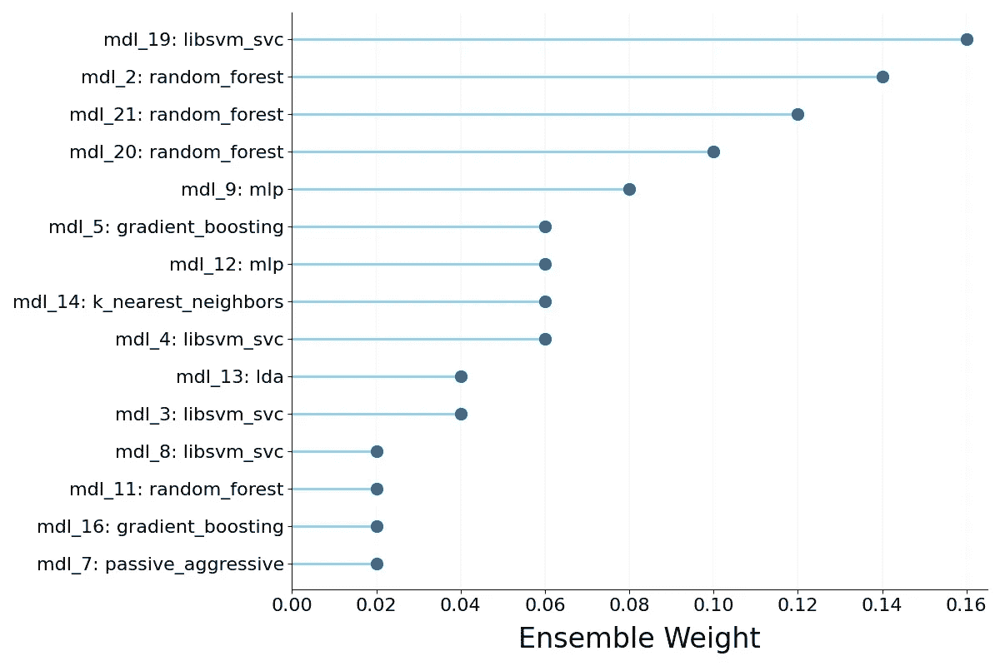

# Auto-Sklearn：如何通过自动化机器学习提升性能和效率

> 原文：[`towardsdatascience.com/auto-sklearn-how-to-boost-performance-and-efficiency-through-automated-machine-learning-2db116eafc8?source=collection_archive---------4-----------------------#2023-04-11`](https://towardsdatascience.com/auto-sklearn-how-to-boost-performance-and-efficiency-through-automated-machine-learning-2db116eafc8?source=collection_archive---------4-----------------------#2023-04-11)

## 了解如何利用 AutoML 最大化机器学习工作流的结果

  [托马斯·A·多费尔](https://thomasdorfer.medium.com/?source=post_page-----2db116eafc8--------------------------------)

·

[关注](https://medium.com/m/signin?actionUrl=https%3A%2F%2Fmedium.com%2F_%2Fsubscribe%2Fuser%2F7c54f9b62b90&operation=register&redirect=https%3A%2F%2Ftowardsdatascience.com%2Fauto-sklearn-how-to-boost-performance-and-efficiency-through-automated-machine-learning-2db116eafc8&user=Thomas+A+Dorfer&userId=7c54f9b62b90&source=post_page-7c54f9b62b90----2db116eafc8---------------------post_header-----------) 发表在 [Towards Data Science](https://towardsdatascience.com/?source=post_page-----2db116eafc8--------------------------------) ·6 min read·2023 年 4 月 11 日[投票](https://medium.com/m/signin?actionUrl=https%3A%2F%2Fmedium.com%2F_%2Fvote%2Ftowards-data-science%2F2db116eafc8&operation=register&redirect=https%3A%2F%2Ftowardsdatascience.com%2Fauto-sklearn-how-to-boost-performance-and-efficiency-through-automated-machine-learning-2db116eafc8&user=Thomas+A+Dorfer&userId=7c54f9b62b90&source=-----2db116eafc8---------------------clap_footer-----------)

--

图片由作者提供。

我们许多人都对选择适合特定预测任务的机器学习模型这一挑战感到熟悉，鉴于可选择的[模型数量之多](https://machinelearningmastery.com/a-tour-of-machine-learning-algorithms/)。除此之外，我们还需要找到最佳超参数，以最大化模型的性能。

这些挑战可以通过自动化机器学习，或者说[AutoML](https://www.automl.org/automl/)在很大程度上得到克服。我说*在很大程度上*是因为，尽管名字如此，这一过程并不是*完全*自动化的，仍然需要用户进行一些手动调整和决策。

实质上，AutoML 解放了用户免于繁琐且耗时的数据预处理、模型选择、超参数优化和集成构建任务。因此，这个工具包不仅为专家节省了宝贵的时间，还使非技术用户能够进入机器学习领域。用作者的话来说：

> 自动化机器学习提供了使机器学习对非机器学习专家可用的方法和过程，以提高机器学习的效率并加速机器学习的研究。
